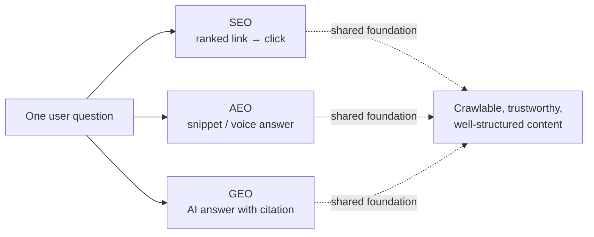
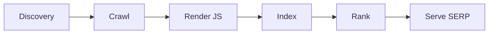
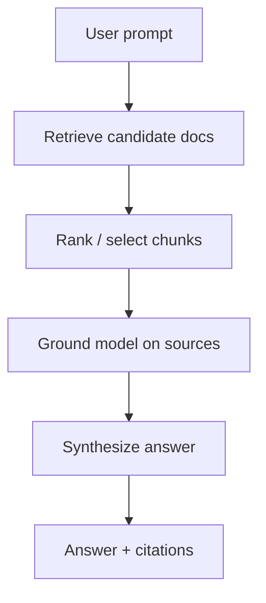
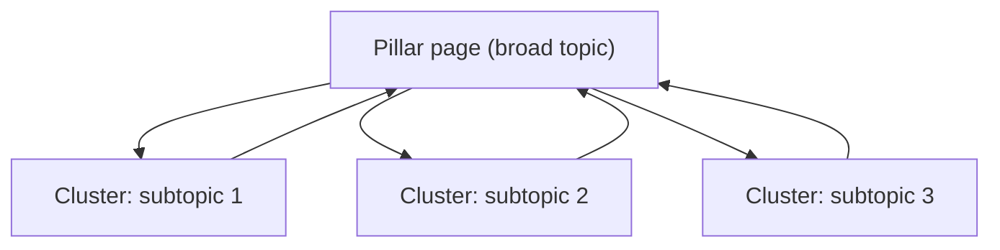
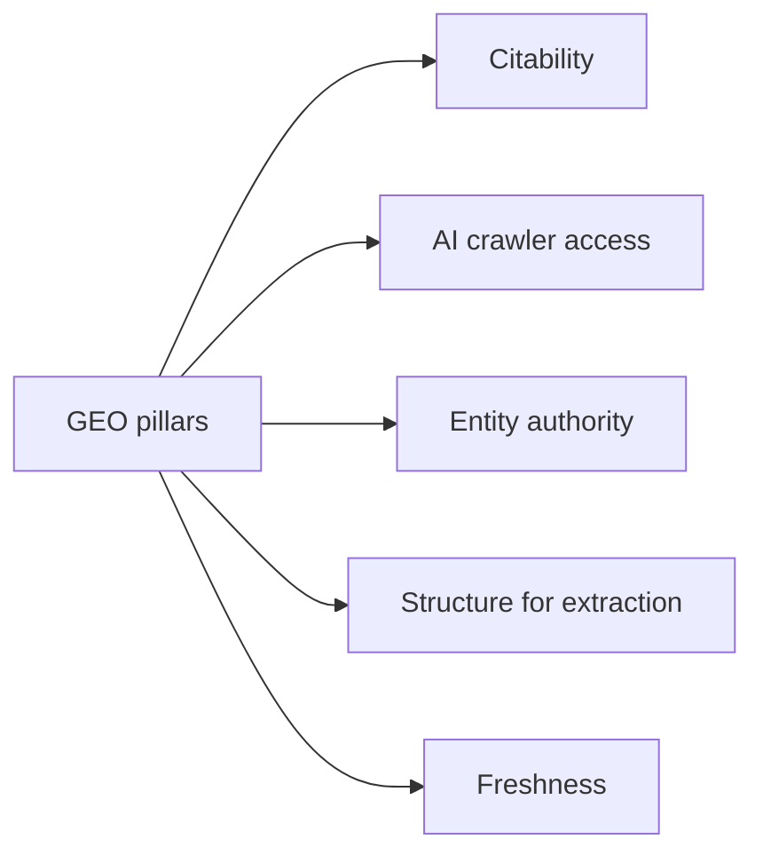

# The Complete Handbook of SEO, GEO & AEO

> A practical, example-driven reference for ranking on traditional search engines (SEO), getting cited by AI answer engines (GEO), and winning answer/voice results (AEO).

This single document is generated from the modular chapters in this folder. To update it, edit the chapter files and run `node build-handbook.mjs`. The browser version (`handbook.html`) renders the same content with navigation, search, and diagrams.


## Table of contents

**Part I — Foundations**

- [01 — SEO vs GEO vs AEO: Definitions, Differences & Convergence](#01-seo-vs-geo-vs-aeo-definitions-differences-and-convergence)
- [02 — How Search Engines Work: Crawling, Indexing, Ranking](#02-how-search-engines-work-crawling-indexing-ranking)
- [03 — How AI Answer Engines Work: LLMs, RAG & Citations](#03-how-ai-answer-engines-work-llms-rag-and-citations)
- [04 — How Answer & Voice Engines Work](#04-how-answer-and-voice-engines-work)
- [05 — The Searcher: Intent, the Funnel & Query Types](#05-the-searcher-intent-the-funnel-and-query-types)

**Part II — SEO (Search Engine Optimization)**

- [06 — Keyword Research](#06-keyword-research)
- [07 — On-Page SEO: Titles, Meta, Headings, Content](#07-on-page-seo-titles-meta-headings-content)
- [08 — Technical SEO: Crawlability, Indexability, Sitemaps, Robots](#08-technical-seo-crawlability-indexability-sitemaps-robots)
- [09 — Site Architecture & Internal Linking](#09-site-architecture-and-internal-linking)
- [10 — Page Experience: Core Web Vitals, Speed & Mobile](#10-page-experience-core-web-vitals-speed-and-mobile)
- [11 — Structured Data & Schema.org](#11-structured-data-and-schema-org)
- [12 — Off-Page SEO & Link Building](#12-off-page-seo-and-link-building)
- [13 — Local SEO](#13-local-seo)
- [14 — E-commerce SEO](#14-e-commerce-seo)
- [15 — International & Multilingual SEO](#15-international-and-multilingual-seo)
- [16 — Content Strategy & E-E-A-T](#16-content-strategy-and-e-e-a-t)

**Part III — GEO (Generative Engine Optimization)**

- [17 — What GEO Is & Why It Matters](#17-what-geo-is-and-why-it-matters)
- [18 — Citability: Getting Quoted by AI](#18-citability-getting-quoted-by-ai)
- [19 — AI Crawler Access, robots.txt & llms.txt](#19-ai-crawler-access-robots-txt-and-llms-txt)
- [20 — Platform-Specific Optimization (ChatGPT, Perplexity, Gemini, AI Overviews, Copilot)](#20-platform-specific-optimization-chatgpt-perplexity-gemini-ai-overviews-copilot)
- [21 — Brand Mentions, Entities & Authority](#21-brand-mentions-entities-and-authority)
- [22 — Structuring Content for AI Extraction](#22-structuring-content-for-ai-extraction)

**Part IV — AEO (Answer Engine Optimization)**

- [23 — Featured Snippets & Zero-Click](#23-featured-snippets-and-zero-click)
- [24 — Voice Search Optimization](#24-voice-search-optimization)
- [25 — FAQ, Q&A & People Also Ask](#25-faq-q-and-a-and-people-also-ask)

**Part V — Measurement, Tools & Workflow**

- [26 — Measurement: KPIs, Analytics & Attribution](#26-measurement-kpis-analytics-and-attribution)
- [27 — The Toolbox](#27-the-toolbox)
- [28 — Audits, Cadence & Reporting](#28-audits-cadence-and-reporting)

**Part VI — The Do's & Don'ts Compendium**

- [29 — The Do's & Don'ts Compendium: Hundreds of Worked Examples](#29-the-do-s-and-don-ts-compendium-hundreds-of-worked-examples)

**Part VII — Field Evidence: baaz.pro Results**

- [30 — Field Evidence: baaz.pro Search Console Results](#30-field-evidence-baaz-pro-search-console-results)

**Appendices**

- [Appendix A — Glossary](#appendix-a-glossary)
- [Appendix B — Templates & Boilerplate (copy-paste ready)](#appendix-b-templates-and-boilerplate-copy-paste-ready)
- [Appendix C — Sources & Further Reading](#appendix-c-sources-and-further-reading)


---


# Part I — Foundations


# 01 — SEO vs GEO vs AEO: Definitions, Differences & Convergence



**What this chapter covers.** The three optimization disciplines that now decide whether your content is found: SEO (classic search), AEO (answer/voice results), and GEO (AI answer engines). We define each precisely, explain how they differ in mechanism and goal, show where they overlap, and give you a mental model for working on all three at once without wasting effort.

## Why it matters

For two decades, "being found online" meant one thing: ranking in Google's blue links. That is no longer true. A single user question can now be resolved in at least four ways, and each one is a different battlefield:

1. **A list of links** (classic SEO) — the user clicks through to your site.
2. **A featured snippet or answer box** (AEO) — the user reads the answer on the results page, often without clicking.
3. **A voice assistant reply** (AEO) — the user hears a single spoken answer.
4. **An AI-generated answer** (GEO) — ChatGPT, Perplexity, Gemini, or Google's AI Overview synthesizes an answer from multiple sources and may *cite* you.

If you optimize only for #1, you can be invisible in #2–#4 even while ranking #1 in the blue links. The disciplines share a foundation but diverge in what "winning" looks like.

> **Illustrative scenario.** A user asks "is creatine safe for teenagers?" In 2010 they got ten links and clicked the top one. In 2026 they may get: a Google AI Overview summarizing three sources (your brand cited or not), a featured snippet pulled from one page, a "People Also Ask" cluster, *and* ten links — or they may never visit Google at all and ask ChatGPT, which answers from its training data plus live web results. Five different placements, five different optimization strategies.

---

## SEO — Search Engine Optimization

**Definition.** The practice of improving a website so that search engines (primarily Google, also Bing) rank its pages highly in organic (unpaid) results for relevant queries, and so that users click through to the site.

**The goal:** a ranking position and a click. Success is measured in rankings, impressions, organic clicks, and the sessions/conversions that follow.

**The mechanism.** Search engines run three processes — *crawling* (discovering pages), *indexing* (storing and understanding them), and *ranking* (ordering them for a query). You optimize each: make pages crawlable, make them indexable and understandable, and make them the most relevant, trustworthy, high-quality answer so they rank. (Covered in depth in [Chapter 02](#02-how-search-engines-work-crawling-indexing-ranking).)

**What you optimize:** keywords and intent, titles and metadata, content quality and depth, site structure and internal links, page speed and Core Web Vitals, structured data, backlinks and authority, and technical health (crawlability, canonicalization, sitemaps).

> ❌ **Don't:** treat SEO as "stuffing keywords into a page."
> *Why:* modern ranking is driven by relevance, helpfulness, and trust (E-E-A-T) — keyword density was deprecated as a primary signal more than a decade ago.
>
> ✅ **Do:** match the page to the searcher's *intent* and make it the most genuinely useful result.
> *Why:* Google's systems reward content that satisfies the query and keeps users from bouncing back to search.

> **📈 Proof — baaz.pro (Search Console, Mar–Jun 2026).** After applying these SEO foundations, baaz.pro's organic visibility scaled **~20× in six months** — from ~180 to ~3,800 monthly impressions (**8.88k impressions and 100 clicks** in total) — with service, industry, and case-study pages ranking in the **top 4–7**. Impressions and average position climbed first; clicks followed, exactly the SEO cause-and-effect described above.

![baaz.pro — Search performance, last 6 months (Google Search Console)](data:image/png;base64,iVBORw0KGgoAAAANSUhEUgAABagAAAKkCAYAAADlQdikAAAAAXNSR0IArs4c6QAAAARnQU1BAACxjwv8YQUAAAAJcEhZcwAADsMAAA7DAcdvqGQAAP+lSURBVHhe7P17cFTXvucJ3r/qn6mpmLjREz0VPTG3oyOqZqYrZqK7eu707enqqo57Xce3OMfXx1w/7uFc+xi/bY5tDlhgYR9e5i1esjEgjMAgQDwtQBiLt5ARbxAgkHjIRgIECCRZCPSW+E2s/cjcufbOVO5UZu5M6fOJ+ITNfuXKnXuldn5z5W/9RduTHkFERERERERERERETLd/oS9AREREREREREREREyHBNSIiIiIiIiIiIiIGIgE1IiIiIiIiIiIiIgYiATUiIiIiIiIiIiIiBiIBNSIiIiIiIiIiIg4bH1w977cvB3Fu49d22N6JaBGRERERERERETEYWqdFL7xjDzzTBTfWC+XXftgOiWgRkRERERERERExGEqAXWmS0CNiIiIiIiIiIiIw1QC6kyXgBoRERERERERERGHqQTUmW5WBNSX174lzz77rIfPyQtjXpF3cwul5EKTa790Wn+ySD599blw20a9Lxvq3NshIiIiIiIiIiJiuiSgznSzPKCO9JU55VL/yL1/qm08NEdecLXnLVlzzb0tIiIiIiIiIiIipsvgAup9Mzwez+mMI9L25L5s/tD694ffyU3tGI27PjXXPfuuFNlZ48FZ7mMpR/1WXv9wiZTWPXa1RXnzxGb57L2XZNSz5vajRr8rn206IzddeWq0czZKnv/Dh7Lwh1vyIOZ2bmcc1B8jbNYF1M+9+Iq8MsbpaHnOEQy/urzWtX9qPSOLX7Af/zl5c3qRlJTtkTXzF0oJI6gREREREREREREDdJAQNR0B9W9ekpf+ycMllea219bL60Z7fiszDjrC5UdnZOFo8xhjvq4JL7cD6mdHRR7vN9bjPfuSzD0cGVJfLnpXRlnPedRotf1vQ/9+5u31cjkipA6fM3Nby9GjQuft7cI6aXtySzZ/EvmcwuF35PKFR93nxzbrAuovDrnXP6gulHdH2SHxx7Khwb1NyrxWJG9abXth4Rn3ekREREREREREREyLN7/7VMZoQbAdmnqqh7z/9HuZ9N1913ET0Q6oXzfCXPd6p1Vf/95sz+glcswKiy8XjnUtM7QDale43iLHFljHGfONVNnLL3wtY4zn+1uZsd/x3G6fkfy3zTY+H5FrhgNqfeTzzR+myvPGeftUSpsj18XaL5bDIqBW1hd/HNrm093ew9iVD+41Sf2dFmsYuk+bW6RRP/GOgPrNtYNfbPZx6u80SWOrx7o4fNAUz76PpVE9ht5ebX19U/RzpaseN/F2+388Q/tcRX0eHj5K8LEQERERERERETHrvVz4rjuIjlNzZLD7mInoJ6B2jpY2tq//TsYZwfpv5bP9LZHbRg2oVej8nYwznsu7UmRUd3gspbnmcZ9f4DG4tvobK7z+UDbftpfHCpqPyAxj+9/KwhP6ulj7RXfYBNRtNYXRg+I7Z2TD9LfkudAoa7McxwsfLJSSau0FftIj17fmWOVDcmRLXY/UHymUDx0TIKrjh7Z5xTEx4vOO0iP5xyOP23pL9uR/LK8+52zDs/Lcqx/L4jK7bkukR/Lt4+XLkSeP5ULJdHnz+fC+5rk4Loudj6keZ37kc33ujYWy/2dHO7T1zz7/lsw7cMv1+BHtdjyuuc9r8unaMx41vwdvj3q8P5fUej5nw0dNcqw48rmG9iv2ekzT+pNb5M9vO14P5XOj5d35e+RCk3t7REREREREREQcniYSUicznFb6CqhVven99ujkD2XSpN+a7Zq0Wxr1bX0F1JUywwq63YGysk5W/MFs52f7w8uiB812QP2S5F/Q18XaL7rDJqB+sHtKaJsPtzaF19VskXe1UDjS0TJxa+RFEn68t2TxWvcEiCqgHnTixi/KHW0okYkvemzj8LkPtmi1Xnpk/xf2+ulSsPZ91z7muSiXL+xl0wtlzXvuYxuOel82nD0ji//gsc7y091aWB9Hu599r0hrd5ztefZZeVf/IkHZVC5fvOLeNvIxV8hpLXC+vPH9iFrkLl/MkS012mMhIiIiIiIiIuKw1U9InexwWhmzBvUn38l11z6OCRONoNoxMaLTqAH1Y6laaZUFeX6JHFPLQoH1WCn0OpZq51Tz8cJBevSgOXROn8+LLDsyyH6xHB4B9Z1y+SIUpL4la+yTrcJOe/moV2RiQblcUKUf7tyS0yX58m5on9fkK0fiHxE+GyN/n5M3cwtlQ9kWKZj+sXxaXGeMqp43f6HMm/p+KMB+4b3p5jLlDmuyRmcbjNHM02VNyX7ZU7ZfStZqo4Rz90R8IxIOqK12jHpFPpxfJCUlRbI49y2Zd0Rt5wiELV+ZVCglZftlT0mR/NkZSFujmMNt2CMFk14Jr38h37xwDR/L6WWvWfs5z12TXD+/R+a9ER6p/GqBc2JKd3te+CBfNqj26I83aorscZbueFQXEWgbo8uLzXO1pzhfPnQE1y9MLw+dq8ZDji8RXsmRgkO1Rjvr6y5KSX749Xn21RVywdVxEBERERERERFxuBpPSJ2KcFoZCqi9dIXLlkfzwpMX5u7zrkAQbZLE0CSGarJFayBqaALGGAG1a6T3IJMkPvtS+PgRjpCA+tWJVgBsOz2ybMYLc46HXrhji0dby0fLF4c8TlpTufz5BWvfz/eH9oscHf2WLD7rsa/tIDWow214Vt5dftE9JL+1VgpCoaxqZ7huckRA/cIUKbHLdEQYGQi/mn8x8sJ1Pkela8Rzi5Tkhp9rKNy3vL67UDZUe9RyflQrX71q7TdmhVyI0p4XvggHybbHFobPyRdGyG7qrCOu9nOV8rAD7FHPyZvT98gFVQv70RlZbH8B8OIc2e9RyqPxwPRQSP3p9x7PBRERERERERERh62xQupUhdNKd/A7mOGA1/T3HmU0HAG17rOjZMyHS2SHs6TxEEdQu/zNBCm6Fi1fGyEBdSwjymQ8Kpcv7LrHjvBZ98Jye0TvFCmxRvM6H++FiBksPYwVUDvb8HaR97ciyoYt8qH9PHL3hNrqDKg/LHaULYnQEQjrI5Lt40y3jzNa5lW619dvDQfDniPUDa2JBx0TTF5ebZ+nObLfqz3P5kiJR2DcdjI/FBiHz1mdrHnb2u+FObLf43kY3rkl9c5JGg/NCbU9evhcK1+NcZ9fREREREREREQcGXqF1KkMp5V+A+qbWz402/b8VFk4w6pB7TXSOmqJDy+TVIP6UY3kjzGXjdty3+M4UfaLw2EQUD8nL7zhMdGgY9LEiMkLdUMlNsKjhwctKeI0VkDtnLhxdawL8XF4FPOoOXLEWh4OqN0jm8M6AuEoIXj4OOEQPkJHyKs/3wd1+2Xxx6+56js/94eP5c8f2+G+s32Dt8fznD0qlz/b+0131O8exHBI/qw894rH62sZmqQxWpsQEREREREREXFY6wypUx1OK30F1E27ZZIRJFsBcNMR+ez5KIGwr4D6sZTmmsd5foHHQNzqb2SMcU4+lM237eXeQfODPZ9aAbpX/eno+w1m1gXUeoAaVUfoGq92uQlfj+cVtnq0YbDjhEPk8Gjk5AfUzpHODqO0M6K2s3LUc/LKmNGusDopAbXXsjiMKIMSj44vABARERERERERcWSpQup0hNPK+APqx3J4lj1i+ptQhQjniOp9zioFvgLqHmm78LUVQv9WZux3hN23z0j+21Z4PavSMfg3WtBcIyusUdTezynafrEdvgH1hRXyirXPh2pSQ2uCv+i2yAPrxff1eLGCVUcb3t14y72vw3AZjgwJqB+dkXl27epR78tXJyNLjDz4+aJsyLVrSSchoG7eI5/a+8057t4niuESLR/Lhmv6a+rhvWhlQBAREREREREREZNnaJLE3zgmGnS6pNLc9sQSed4KkCPKcDjKakQEyH4DapV3Fr0bmnzRnPjwt+HJGP95iRyLKNMbPWh+cHCW2dZnP5UdrtK+0feL5fANqB2B56B1pDV9PZ5X2GrrDF1j1MGOCIPf2yLXreWBBtSOOtGvLK917xMxAWQSAmpnnehXCx2TLmpqPx94sHuK1Qbv+tqIiIiIiIiIiIhBGAqooznjiLQ9qpMVVqj7/NQj0qgd48FhKxB2TpiYQECtvHlis3z23ksyyiolMmr0u/JZYaVcd5XriBU0h9eN+bom6jr3ftEdvgH1kyYpmRgOeAtq9PXKFtn/xSvyyqRC2V8XHlnr6/E8w1bbx7Lnc7sNo+WLQ44ZNB3bXCgIP55zMsRAA+oj4WXu56Xq4uyRT+26zkkJqHvkQsFrocd81+sxjddrtDz7yseyuKRW6lXnubNHJobqSxeGJ8mMaGu5fPHKKzKxoFyuOydYRERERERERETEYWXV9jyZO3eIbteDV0ylwzigNktsvGqHpaNeky/KaqXRCigfNFyUDVPt8hDPyrO5e0LfUPh6vChha8iaInk3FOSOlnfz98sFo5zIY2msLpeCSY42vJgfUWA80IDaOfr7xTmy/054+wcN5bL4D/Yx9fYN3p6o5ywi9H5O3py/R07XWeeq7qKUzAkH2M4w+sJyx/I/zJE91S3WaPXHUn9+i/z5lXBbP93t9SUBIiIiIiIiIiIOBwcdtRyPamSzx7ExNQ7vgFrtuzUncqI/L/+QH1FnxdfjRQtbHbomG/TyxRzZoo3yDjSg1oPfZ5+TF8a8Iq+88pz179Hy7nt2uJ6kgFqdq8p8eTUUUkdRP1eP6mTLRLvcSHRfXXzG9TMJREREREREREQcPhJQZ5/DPqBW1p8skk9ftYNVp2qU7n5X2QdfjxcjbHX6oHqP/PkN7za8mlskxxwjlG2DDqhVSY1j+W/Jc3qbn3tLFle2OM5T8gJq5YO6/TLvba9z9ay8Msn7XLU9apJja6fIq8+591HtnVd2K3oNcERERERERERERAzErAiok+WDe7VyrGy/7CnbL0fO3wqV+0inzjbsqayVxmb3Nhlnc4tcqAyftwdedZ5T4IOmW3L6iHWujlyU603hOuFRNUqnnDH3KTtulgjRt0FERERERERERMSMcEQF1IiIiIiIiIiIiIiYORJQIyIiIiIiIiIiImIgElAjIiIiIiIiIiIiYiASUCMiIiIiIiIiIiJiIBJQIyIiIiIiIiIiImIgElAjIiIiIiIiIiIiYiASUCMiIiIiIiIiIiJiIBJQIyIiIiIiIiIiImIgElAjIiIiIiIiIiIiYiASUCMiIiIiIiIiIiJiIBJQIyIiIiIiIiIiImIgElAjIiIiIiIiIiIiYiASUCMiIiIiIiIiIiJiIBJQIyIiIiIiIiIiImIgElAjIiIiIiIiIiIiYiASUCMiIiIiIiIiIiJiIBJQIyIiIiIiIiIiImIgElAjIiIiIiIiIiIiYiASUCMiIiIiIiIiIiJiIBJQIyIiIiIiIiIiImIgElAjIiIiIiIiIiIiYiASUCMiIiIiIiIiIiJiIBJQIyIiIiIiIiIiImIgElAjIiIiIiIiIiIiYiASUCMiIiIiIiIiIiJiIBJQIyIiIiIiIiIiImIgElAjIiIiIiIiIiIiYiASUCMiIiIiIiIiIiJiIGZUQH3sRCUiIiIiIiIiIiIijhAzKqBGRERERERERERExJEjATUiIiIiIiIiIiIiBiIBNSIiIiIiIiIiIiIGIgE1IiIiIiIiIiIiIgYiATUiIiIiIiIiIiIiBiIBNSIiIiIiIiIiIiIGIgE1IiIiIiIiIiIiIgYiATUiIiIiIiIiIiIiBiIBNSIiIiIiIiIiIiIGIgE1IiIiIiIiIiIiIgYiATUiIiIiIiIiIiIiBiIBNSIiIiIiIiIiIiIGIgE1IiIiIiIiIiIiIgYiATUiIiIiIiIiIiIiBiIBNSIiIiIiIiIiIiIGIgE1IiIiIiIiIiIiIgYiATUiIiIiIiIiIiIiBiIBNSIiIiIiIiIiIiIGIgE1IiIiIiIiIiIiIgYiATUiIiJmvM2/PHEtQ0RERERExOw3KwLqisoT8s2atTJzzizJ+XSSfDI5BxERR4BTZ89xLcOR6aTcyTJ91mxZuWatHKo4lrbA+tiJSteyVMi9Do5U1fWurnt1/at+oPeNZEkfGxmm63pata9JXpz/k/zbDy7Lv/rdBfk/vJJc1THVsdVjqMfSHx8REXG4mdEBtbqpUDcYBYWF8uOJU1J/5760tne5tsPUq2749GU4NDmnwcm5zx7Va1VxTxAND/78RDZXXJSl36yT6bNny5EfUx8epzqg5l4HR7rqelfXvbr+VT9Q/SGZwSJ9bGSZ6utJhcUqONYD5VSrHpOgGhERh7MZG1Bv2bZdFi1dKpeuXHWtw/RLoJd8OafBybnPHgmoMZq7qhpk7uKlsmHrdtd1k0xTGVBzr4PoVvUH1S9U/9DX+ZU+hsm8nv5Y0OAKjtOtaoPeLkRExOFgRgbU6gZCfePN6IbMkUAv+XJOg5Nznz0SUONg5n+zNqUhdaoCau51EKOr+oXqH0MJFeljaJuM6ykTwmlbQmpERByOZlxArX6Cpb7l5mYysyTQS76c0+Dk3GePBNQYj3MX58uhH4+7rp9kmIqAmnsdxMFV/UP1k0TKM9DHUHco15MqraGHxEFLuQ9ERBxuZlxAreqE8TO8zJNAL/lyToOTc589ElBjPKpyH6omdSomTkxFQM29DmJ8qn6i+ou+fDDpY+hlotdTEDWnB1O1SW8nIiJiNptRAbX6Rlv9/EpfjsFLoJd8OafBybnPHgmoMV6XrlqbkkkTkx1Qc6+D6E/VX/yMeqWPYSz9Xk+ZOHrallHUiIg4nMyogPqbNWuNGZf15Ri8BHrJl3ManJz77JGAGuO1uPyCFKz51nUNDdVkB9Tc6yD6U/UX1W/05dGkj2Es/V5PL87/yRUMZ4qqbXp7ERERs9WMCqjVT67q79x3LcfgJdBLvpzT4OTcZ48E1BivB35qN8p86NfQUE12QM29DqI/VX/xU5aBPoax9Hs9ZWJ5D1vKfCAi4nAyowLqnE8nMZlJhkqgl3w5p8HJuc8eCajRj+o+Qr+GhmqyA2rudRD9qfqLn75NH8NY+r2e/tXv3MFwKly8q0k+Xd/oWh5L1Ta9vYiIiNlqRgXUhEaZK69N8uWcBifnPnskoEY/pqJvJzugTkUbEYe7fvqNn21xZOrnGtFD4VT4P028KnX3uuVI9WPXusHU24uIiJitElBjXPLaJF/OaXBy7rNHAmr0Yyr6NgE1YvD66Td+tsWRqZ9rRA+EU+HGo63SP/BUunqfyoISf5My6u1FRETMVgmo/XqnUlbMXyhzd9S41w1jM/O1qZHN6rUoqJSbrnWZb2ae03htksMFC2Xu/O+kyrUu883uc59Gq7+TufMXyoojwc0ST0Adp6cr5NdziuStH9rd60aQqejbBNSptWqH+luyWg7fca/DITjM7lf99Bs/2w5q3XcyfszL8tKYfDmsr8sY/dyTxX/v3Hh2i3z2gXruL8tL+eb74OXd+TI3v1QuP7K2y4D7hET0c43ogXAy/bfvX5Fdp9uMcNrmceeArPjhofzXr19ybe+l3l6Mz8aWLvlT4S357/94Rf7HP9VKZc0jqbnVIX8saJCdJ1uNbe63dsnMLY3Gdg0POl3HQETE5DosA+qbJ7fI3I/fNG+oPpgiK0pqpNFjO6eNlUXGDdagN/LXiuT1Z38lz3xxxL1uGDv018a+eY5mIh9Oj8gM9Vq8XSSXXesy36GfU8tHTXKseKGMe8P8EPF27mrZUd0yyHZvyrj5W+SY73NuWyeFb/9Knnl2tuxzrct8k3buXe8306Tw0C154LFdVnpotjzz7K/k9bV17nVpMiUB9dVaGbeqSvbqy7PZ79fIX4yaLH+1qsm9bgSZzL5tmzUB9Z0a2VEwRd42wrSX5fWPF2bF+9G+L9Tfkjel8Jp73bC0utS87/EICB+cNO9FF36vv+c+lmPrzfulzdUex/RymN2v+uk3frYdVPs8puN+59p+WWjcExfJsWaP9VH1c08W573ztS3y9ih1zF/JqOd/Y15H90plvHEufiVvb7xlbpcB9wmJ6Oca0QPhZLn6QLMRRnvx9KnIvV96ZcKaO679dPX2psqtx1pk7Jf1Eb63okG+PfRQfr7f4do+k334qFveWlZvnL+//OeL8t++XS1HLrXJh6sajGUqtL7W2CGNzV3yv392Xf7vH1yRq7ez6zliirx1UL4YP0E++vaSe90I9GbZPPlo/DzZe8u9LlO8X1suq/M+k4/U6zZ+gkyeXSh7r7S5tvP0zkGZZ+3ncu5B131cSOs6+aLsnnsdxnTYBdSXN74vo6ybJ6fPf3EkekjdXCkzXrS2HexGfpjd8Mfr0F8b++Y5mol8OI3zJjtDHfo5VaFznRR98BuP8zlaZhxyhtRRthv1vhTWeBx3UP18GMo8k3LuY7zfjCm46No2k72+9RMj0FpYoa3LgA+eyQ6o9x4sln/93GT5i1GfyTPf97nWZ7pbNnwtf/n7WfI3G7QgmoDaMFl922lWBNQ1RaEwSXdM/pmMDqmHFlBXysKMH92q2Vwqk4zXZprss0ehGj6WHbnW6+a6r6mUGcbr+5FsjveL5WF2v+qn3/jZdlDTGFBXFbwa6reTvn/sWh9dP/dk8d07X177pvn3f7X199+4Vltk3/w35aU3psgOu7963SfYo84nfSfXPY6dCfq5RvRAOJpqxPOYxTflrWUNMf3HeT+H9vlg5S35+X6PEUjbqNHU5Zcfy9/PqHM9hpd6e1Pl9OLoEzj+n1+7JCt+aJJfHrv3S5dqBLQaCf3Sgp/kbkvsSVJV2KxCZxVEX7z5xGh3S3u3HL7UJv/D+FqZ9O1tI8SOFlCrUdb/9oPLUmKNtMYRJAF1hJkeUN8/u14mq9fr83zZfOi8nDh2UFbPVgHzZ7L6bBwh9c0y4/We9lWxrNuoWXpJ7ujb2xJQJ+zwCqib98skdQP/wkdSVG3e2D2oK5VJRvj8qqyIMurk2OLR4Q9zg93ID7Mb/ngd8mujXot7TXLzTqSXt35iBnyvLJTDvkaLKOO7yc5Uk3JOv59iXLfPf7xFqlrVssdyvWSKPK/Oy6urwz/1tD5APPPeams79Qdlmrnd5/sTCC/8fBjKPJNx7kPvNy/OltIG6/2mYb989oLPECEDtD+IzjikrfP64JlmkxlQ7/1+jfzLUZPlL56bJS9kaSmMLavmewfRBNSGSenbmpkfUDdJ0YfqfWe0jC+ukQdW6PngwhYZP8j9TyY4tIDaug/Iqr9F9t/P0bLwpGP5oyNWCO3xN6RmtXnv6ed+Z5jdr/rpN362HdS0BdQ1kj9GDRywroGPv4s+Msuln3uy+O6dzX7pcV+g63WfYJ+zQR4jSP1cI3oYG81RM+uksaXXORDak9rbXRH7qQkSK2ufGCG1CqdVPWr92LHU25sq7YBaBdEqrFVeuvlEZm29awTUf/VWtZy4+si1X7pUI6D/L69XG4GyCpb19YlsGy2g/v1i80uGTRXNrn1wmBtgQH36WxWsrpfTHuuCcigB9VD2jc87smP6BPkod5tUtzuWt9fIxk8GGQFte3a9MVp6XZXHulgSUCfs8AqoK5fLS8/9Sl5aHlmm4/LqKOGL8sJyGaMCvvfel5fiuZF33vA/eiyXK/dLadl+Ka2sC30o1H3QcFEOq22ibdfcYoS1jVZwGGu5EfLeU2HYY7luPHalXLaDXWd7yirllBWaJcMhvzZeNh0xw7xRU2RHk8d63Ts1ofN47Jp6btFush/LzfOV1nnYL4fPNzkC2MfSaITjLe7XIRSiO9Zl+Dk9tuxlGfXsy5J/wbm8Tla8EflBxQ4gPzvg3C7a+fOw9ZYcizif0T8MRVzvRy7KTf369brW1bomfV3k62i+5u79EjEZ576t4aKUFq+W/EORdRdDH+qOeOxj6ezHoedYGf4p/oNrZ6znfSbcv/VjDPa+8si81hvV/q1NcuqIva3zJ//mNqeWm9fHpBLrNbAf0/nB03GMyD7lo00JmLSAumqf/Bs1cvrlr2XyWY/1UTz4c7vsvNopB9X/V9XKrJ2nZdYPDbL3jrW+pk4WqGU7q6WwJsqI7FstUviD2kZZK0U3tfV3+mTv1XbZq5bfaQ9ve7BRDlqPU3HP3GbFl1ZA/WWd7LT3UeudAbXz8Q42GW3X2xRut/442W1S+rZm5gfU1nv5i/lySlt3s2SKvP7xNCms0Mo+xfu3LWI77/fhmPclSuf7j8d7mjOgdr6HHKtzP1aExj2SPRp5iuyw/7bH+7fGake4/ZHvvVVNUR4/jnN380JlzPZXLX/ZeG8NlUlQnsw3vjR+/kVz0MSk3eH9b279yPwyevGZ+NuRwP1qJuun3/jZdlDTFVDbr//CUin62PySoqjBYztlc11C92Sx750trXuHHZ+b9zL2fUGkjvtkLaA2+tfZ5eY5e2O5nFLbW/0r5CDvCW2tjs8/9r3/+eTWuPZzjeiBcDT/87Qbcr2x2yjbEcuzdR2ufX+38KY8eNQn537qiLv2tK3e3lRpB9ReoezENbeMdav2Rb5OlxueyMajD2Xd4Yfy/Zlf5EFbt2tfVR5EHVNts+N4i1EbWt9msGOp+tDbj7fIf/2HavkPudfk/E+P5ad7HZ4jur22tQN3W7vetB5Qq8dUpT9GzzNHt9thvapVbR9fPeaZG+1GO5UqDFejs53rVduUzY+65YdzvxjP66ZVJkVtq/ax91fH8noeGJAE1BEOJWQeyr5xaZXnmFJS71oX77lsPl6QWBsJqBN2eAXUUYw6OvBRnaxQN3QvTJN9Z+McaWLdqL6+eLXMeMUe6WL5ymzZ5wxaHzXJvjnmh5DI7T6RzY6yCtHa515u3YC+nS+FX9ijvq1RR01H3O159jfy9sbkjHxM/mvzWPZZz2HSbo96yZpqpLUx2tfhS3Nmm7XwnDfZTWdk4R/08/ArGfXBFmtCl8dSat906z+fvPOdjFPbv7BQjqlts+6c2ro/qNgjrccVO24cm6xagoOM0mmszJcx2k/HR30wWz7TQnD1089ji8M/Tw353PtSZF3v9s9XxxTotd7PyEJr5LHxgSxK6ZKX5sQo1ePD1J37FtkxyXwe0UdQe/Vj0+e/KJXDBe9r5+8T2eH8kBrn+0rovSq/yHUdh/uDPfow0tBIKOuD56SCInn7uWjHMPUsd6K/JyZgcgLqFpn8sSrrMV1eOKKvi+2CGWq/NfLWqkVGABzy3X2yotQakW373HT59Q+dEfuHS4o4nS7/fkNjeLuqffJXKlxetE9+/Ttt2w/2SZERHlfJMxHHMA2NmLYC6n83b6f8+5ejHcO0aK32XJS/+1omV7mfv3/NIF2F5zG9ESXMH6Kp6NuZH1BbIy9VaacDcYQ4Nd9ZI6ud/kbeLrgY+f6qtnP9DfyVvDR1v+Nvhtf7WXg0tNffj2dGvSzjt4b/jpoB9Ucyt0D/Ox/77619jxSp+TfpZrEV6C50BLqGNbLiVfPxzPAv3P4i19+v0RHtDJ2Twc6dFTTG/Dtgb5NbGvqyzwytR8vCki3ytlrnuB91jWaNpx3W34Dnp+e7/gY886L292JI2l/8D6IeUvrUT7/xs+2gpimgPrZQ9Z/RMrcyfP1G3LNZevWpUR8slBkeAXW0e2fj11/RAurQ842l4xcPWkBtX6sROh7Lq/3qPeGz3Y4va6xjfrbaUbposM9nPvVzjeiBcKrcVvmLzN1x37V8MPX2pspYAbW9Tv1X/VsFuR+tapD/4z9FtvX//XGNnLrWHtqv6MhDY/S1c5v/5o1q+e5EuHRGPMeyRzQ7jTY62mtbXbWN2lYPqO2R1/r29jm59aAzFF47/bs/35Brd8wA2j7m//rpNXlx/k/GenVMdWy1/9/PuBGxr3reLy/4yfO5YAD6Cajb7smJrV/LNDVaV+0z4TOZ9225VD/02G7jIpk8wdruk1mydOt5uWON+jXD1PjrH0cLX12BsDE6eJrsuHhD9q6aJROsY0/4olD21rrLX9y/clBWfjEp/Fw2npfzez1C5vY2qT64Xubl2u2dJNPyS+TEXWc79OektbdJb9PXsvm0872nWQ59pdZ9LYfuR7YzHk+s8XhMD822JvAYoYD6hnku7Gvgk1my8sgd9/Z3z8vm/PDz/Sh3kaw+eEPuex5TD70vyWq1j+OatK+BQ7V7ZKnxOjheI+3cej6Wl4O8rk69rpWbJ9X1pof97mOOgIDarunn/vmoClTUTc+4rU3x/xTSceM26o2FsuP8Lbl+vlRmWKGoM3izR24/84fZUlRZIzfrLsqO+W+aIc6Ls0MlLdxBdLTljjrOL34iK0rUyIMjUnXHviEcLZN21Ehj82NprDsj+e95P+9ETPprU73aGLke9QbZqf1BbtSrMqP4jFTdqZFjxbPDN7ihY9jh82gZv/aMXG9qkUY1adTn5ofm0GtTudA83odbIt7Y7Q8E9nZZd05t7fqWznP7qE4KVdtVMFBQKqUlRfKZumZHvRz5E2Pdhu9knHGeR8v4gv1yqu6WnCpb7fhg7A7Bn59YJMfqWqSxqUmq9HIjDVsivwSwH8d+TaxyI6Hah/nqdXwsD+6FX0e9nyRiss/9gxo1CnqLLPzQDI5j13x19OM/zJbS6ia5XrlaxhkBvfVBrfiiXK+7KEXWc3aOmov3fcX5XvX8xNWyr7pJqg6FXzvzC5omOVW2X4qmm+0et8wakVVjBQl2aRj1oXZStGM4f86bb7z2D5pbwq/9YO+pg5iUgPr0TvnXoybLv5hxWgq/3yevzCmSX8/ZLuO+H3zksBlQmyOvxx1skp2nT8szr9nB7mfy7xZVSdHVRlmQZ4W+H1fITnt/e9T2c9Plb75W2zVJ4Zbt8u+MANkRZlsBtdr/X07YKQtOt0vR9+Gg+T9+p7ZrkcKdp+VPU2cZy/5y6iFj9PPSs9YxrIA69jEcj/X2dll6oVMO3myXoi2rzKB9RpXr+Sfi3u+L5C9dobzD5xfJOB+j2P2Y7L6tzPyAukcaD80OBVGj3p4iK4o9RiUq7Tk31N/TshozOKzeb93DqLkL7BDRCnKt7RrV39PQ30DnF7zR70tCk6x5/u0O/x0NB1rq74zat0b22WH1qClS6vU8Qu+7y82/Kc9+JPnGaMyL5t/1UMk37W/NheXmr+VCf/8d7fdsp6MMR7zn7qx9z/KJ7IgWUNt/p1/Il2PGMvt8z5Z9j6wvHBzrzC8grMA73nY4g0b770X1GSmaYwXxry6XqiSNpFbX30t66OjU8UV1ovrpN362tfUqQ2dojwYOjdL3MNpo+3i1y7vY16t9r6TfI/u4J4v/3lmzuc4YsZxvlA0K3xeYbpHPjGsxekB98/x+KS2eZvazMdOkSO1XUWfeE9nvCS9+IoWVt4xzd72yyGq/+5jKMXO2GI+9ozL6l1WJ6Oca0cPGTFNvb6qMFlCrUFUFsP+nMRdDNZlV2Q8VrD4364YRItfc6pCpmxqNCQnt4Lj2dof8P8ZdMcLfAxd/kTvNnVJc0Sz/1zciS2/Ecyy1v2rff/XaJfl/fVQjBWVNUnq61agjrT8Pr23t0crjV5sjwaMF1GqUsxrt/J+mXDe2U9ur/dRzsSdeVG19++t6o/yJUv2/WvaH/JsRda3V/qqO9dLd92X9kYfG8e1zPGHNLblxt9M47j8t/NnYf9NR9xcDGIDxBtTtd2RvngrcpsmyXafkxMnzsm9rvlkPOc8RLju2y9taLidOnpK931oBbv4xo8bxnWvnjf03L1Hb5cvmk+flxMU70qw/pqW/gNoMBqcsKZF9VhunGMsWyd6b4X2bq4rNtk+YJ6vLTjlqOWvh55M2Of2tOSHhFxvV8zkvFWWFMs0IQovldGuPNN+sMc/HmmnG8159UD2/+nA955vWxIS5Vt3ok+WyeZF5zKVH7H7QLBXLVXsKpMJvePzwlCxTx191Kuo5tK3erELWebI0ZljuoXWdTMj9LFz/+lCJ5H2ujvGZbLzi2NZ+vva5Vc93iTo3E2Tyt5fCwbHvgNpq7/wCWbexRE6oe8iHl2S1CoO9HmvzDffzCDn462pvm8i1Yl9/FWXrR0BAbZXw0MPI0E3ee1vMGzS/AfULs2Wf80OTXR/QHo1q32x6lK+oWm5+ODCCcc8g2tS93P4g9apW0qFJNts/B/zZsVz9/HWII1Zsk/3amCNFPEYxuwyHzp8diBxp3XjAqqHsCKgbq8/IjpIzka+1/UHwvS3WZC32CCpn0KyPqsq+c2obur60kTcPqq1r1OGYhWdijki2RzyHJsmxta93Z0DdVCPHSkrlWMRPUu0viN6Xojrz3/YI9vB1HX6N1cghtcysCz9aZhxxnGvjJ5/mz7f1dvo12ec+YiTfi1NkR4yfdof7ceTPd+2ffL+U75hg0T7P9vuSj/eV0HuVFkI82G1+keAsheR+r7G0PyTqH2QPTDOWh4Jz+6fJcypd5UO8fmLvx2QE1FusEcP/8nfT3WGpNrpY1w6oQwGvKo+xbZW5b85x2Rva1hrh/FyRLLCWLZ33mbHd32yLHFVdccIMzP/iw0NmmG2Hxv9YLEsdbbEf51/k1YaWDVaD+i/e3idbvJZ/UW3++0ix/AtX260SI7cc+w3RqCF1CsNpZbL7tjIbAmrlzZNb5LO3I3958tKH+bLP8Tcs6shM+0vj0D2QWX6o6IA24av+nuSop2y/f9uG/s5rv5Jq/H62vPTGR5J/xGyDHVDrte7jKZcUqwa1132Ge1m4/eFw3mqn9V5pP9f4z51Z5iBUKslT+x7jTVmhglv7/doaUW3+DbTKd9VZI6qt9+G42xG6X52m/ZKlJTQZo+s9fwhGDamTEE4r/fQbP9uaOr6oSMTBPjsMYugL/tCIf/v6iKwf75q40NbjnsweZDH4vbO3rlH7hvZ5cofJ8dSgdo4Sdz6W/fz1X2+5PrslUT/XiB4Ix+O7y2/JpopWX6p99OPEo97eVGmHp/952nUZ+2W94T/MrpN/bY0oVv+2S2Co0c1K9f/2/iqcVSOB7dHCKmz+v711Wf76k6tGuQu1jV3+wg6n4z2WWhZvXelY26rwXT2XaAG1vZ1XDerjtY+McP3Z6dcjSn6oAF+NllZhvAqc7WOqQH9bZWT/fG9Fg3Hcr7+/H1qmjnW9sTOiTAgGaJwBtVkaYoIsq4gciVy9XYWB82SXHf5e2WYEn1/sjRxVe36TGYyGtosRPOtG2y5aQK0/dtu1PWbwGApwrVrO4wukImL0d5tUrNRCx2t7jIB7yvbIsPN+hXk+Vp+O0R7DZjmU7/VYzbJvkRqBvE2qnW2NUzsUrygrNkPiz4vltD6S3cNQ0DtbhbzFsm7N1zLFGOk+yCSL9nUyt0xuOOtf/2Sd2yL7+rGe1/gCORRxr9Yh5zep8HaSbLTvA3wH1JNk9cnINt458rXrdQi3Yb2ccLbVadyvq49rpdq89qdtvxHxRcHwDqhViQZrgqDIQNe+Obc+GKhlfgNq13ZaTTf7ZnG6vp37A160cMi93F26wdauT/jMqN/I67kLZUVxpZz6OVZI5s+kvjahkE2NFPJYH6E9ckif7V4ZpY6eVZtvR0mpWXOv2j2iWB8tHRpV5ZgwMKvOqWVoFJ0+MqrG+pnkK5/IirKLUqWCB2sUVWSo6DT864NQPwkZ5Vq061yWlMoOo9alGvmsfZjRRkuHvkBwTuoY+on0b2TMx9Nk4dpSOVadnHBamfRzr764qLsopWunmaOTRr0vRVFH2XufO3d/93i/8fG+4trX1v7g51ju+diObfXgyHXsR2dkoTWCa9SrH8ln+UWyo7JmyOG0MhkBdXgU9CqZfMEqLXGzQd5611z+79a3uPaJ3He+jHOWv7DrPa9wlOkIleBYYwXUTTLubfPfs1wBeKO89YZjWzug1kcw2+GyY/lgAXVkmzyOfadWXrBLgLyWL88s2idTDzYmNZy2dYXUKQ6nlUnv21kUUNsaXxYW58u4V62wetT7Umi9h9uh1dtTF8rc+U4/8fxVk1m/tlR2GCOjK+VUhTWa1BVQ6/cl9nKvv92R2jWo9b8zUd+XIoweULt+LeU5qtpq56jZcljf/9ER+cxxTvyeu8G0fw2jak3b9xuhLxid773WF4L2l4pxt8N+n57jcf1ax3S9tw9RV0idpHBa6aff+NnWtEkOF+jn03Lq+9b9yKsyXl9nu0MvW+bH8Jf0zl+02deE88vkfdO9+4q7H9pzkXj1vyj3zprJD6jDg2xc59E+x/b7itcxk6yfa0QPhOPx28Mt+tyIg6L20Y8Tj3p7U6UdUOuqWs4ztzSGQlk7/P1//vFKKMi2/f/mXDX2UcGu2v43X5jlLP7bt6vlja/qjeUq0LUfM95jObfVQ2cvo207lIDa3le1S2+rar8dpkc7plKVNlEjw//V78zR4TM2NxpBPuF0BhlnQB1Nu7zF6rORx5uw8pjccH5uam2TO/eb5X5beFm04Fk32nauQNgKqENtCWmHxMXmMaxazhM8Rti6jhlNOwx3hKue+1qP9dGSEiNQdmqOuI7jsTyMLCsySeZtPi83Hec2qq3NcrX6TmT5i6Zj5gjsWGF5vGFyjHPbdv+YLHWG2fEeM8Y1EHodttfIHcfzb37YLHfut0lztIA6mvrraj+fTe77Iv31Pl2k2ugunzJ8A2pHLeK3tRsce/TA8/OPuH/C93lp1An0DPVgJqR2w+cRArmOoZUz0D+EuZfrN6CRXq8oks8+eFlGOT4c6HViEzWpr41H7cXoxvjwqZ9zrw9HTp03ytoH1WijOrLmnKrnbtf1c4QRpvaHn8iROOoDWZHxE85odTI9Poi41jleF8+a3bbRR6tHGw3WWF0qCz9+U5531j5OQk1jZbLPvdPGkk+MtuqTtYb1OHee/d3j/cbH+4prX1uPY3g+tmNb14dEr2M31ciO/I/k9RcdIzhHvSwzDg1eYz6WyQyo//2G9sh1Z/eY4e3k454TCYb3jRJQR4TEekBdLb82wln7307t8HqRjLvgESJrj+MroNaXex3750aZvChf/uplc4S3oaqf/b020jsJhkLqNITTylT07WwLqMM+lqoC69cdRkh5S4qsEh2jXnlZXhrj4aTvrF8aRakrbztoQF1pfhHtWu7WOUmic3nU96UIY90jRP6tsUdpRs6BYLXfM6yzjm2E1/7OXVza90Jz9rtL0dlf3H78nZQao6nt8+CjHdb7tOv9W2n/HfAKr4do6D4sieG00k+/8bPtoNp/7zyvsSRov9bRDJV6iXVPZofXdhtj9QsrvPa85h3HS3pAbb8n/Eae169Z23zrevQ6ZpL1c43ogWw8DucR1HYoq0plqNBVjW5WZTfs7bYeazFKUqja0qqEhZd2KRA1IaIKt9XoYrvGtApnVVkPNZraz7Gihc5eRtt2KAH17G13jWVqRLneRuX/+Kdaqax5FPWYtocvtcmvv7gRUZtb7avKhejbYgD6Cajv1sjebxfJFLv+sENnKHzjSIFVVmOCTPh8kSzbelBO33RfG1FDxzi30wPC6AG1fYxFsldlBFXFrnA56jGVD+/Ioa1fyxehusJhBw2oHWVHvE0soA7Z1iY3Thabo5itEiqubeLQLv0RtS3xhsnW81123P16tz2plx1qtLddbzzeY8a4BtRI5vNbw2H95Nlfy+pdx+SqNUlrTON5Xe1fBLjaqL/e92TvXDWSfY9c1bYbngF1aPIY7wl2PCfwiND75s/QK5gx1MJSezuvENYerWt9MIj2Icz+yX+8AbXTBw1npHCi+aEmNCJnCCbttXGMGnL9RNFTexTIFNmh/1xWG90UruE3TUods9k/aHKPoFaGQukDpWZY7RzB62FGn1N7IhzPD4TRr5vBfkJtfuCxfmasHdN8XcLHDP2c9Hs1o7y1XWuLewS1YwT7uOIjVt3N6HVGDZvrpNQe8e2ox5yoSTn3amb54tWy+by2XB/J7NL79fB8H9Dfb3y8r7j2tU1VQO1UjaQvs2pdhj5cJ2YyAuoVeWYQ+8z32jo7vH1XK4vhMPGA2g6hV8nUm/pxG+S136doBLW+PNqxbW91StHOInMix+fWyALXaO+hu/fgIZmahnBamZS+rZnpAfWDs0Uy7o2Xjdr3+jo9KIo2WtmlPWnwqwvlcOgLzMfSaH+ZP2hAbS/3+Nvd+jhiEEDqAmrnr6WOhL6QdZZWCrfTY6SpNp9D3OcuXu17ljGvmu+VEfcg4RIPY4yQPXwe426H/dp7/OLGLvXkem9Pko2VW2THYO3zqZ9+42fbQU1xQB36td7z7sDW/II+PHjCfO3juSeL0f/0e+coJj+gjtHXdL2OmWT9XCN6IJxp6u1NlXpArQLknG9vG8s+WHnL+Ldaboe/qnayvSweVXmQ7cdbjDDXHm3s51jRQmcvo207lIDa3vfPmzwmQHMY7ZheqrImdg3rV5fcHPQcYBqMN6C+ZY0E/rxAdhyrkRv31QjVZqku0UZQ26qRulXlsmNNeFLFKUWO+sMxQ8dIo23nCoRTEVC3XpJ1Vo3jdYcuydU75vO+c6zQdQzXvo42eT1WMr1akvhobKU9InvdRfc6w3jD5LQH1KbND+/I+WMHZfPK8OSceftjvHfF+7oSULu9ecQeRarNCO3cRk3gEZrww9Ke0OPD5cbPWD0nF1JGDWb00bwXrZ+86x8iWmTf9MgaiKGf8Tlrz6pJcowPJfEE1DWyOfd9eemD1ZFlHawbvIwJ9Cy9b3qja9ZidI+Ev7zWnOTS9aWAftNt/8xXX26PXnrOHPEZOYI3S87poyY5vNia8OiVabLDWS87pP1BVxshHrrG7PrQbu1r8/kvjkTUqg5PyKV/GNJChkdnZK4x+Z+23A4/nvuNMUIvXHfRbO/hZR/J62NmS6lztLT9+tp13odgMs69PRpPhcXOc2N/ARM5Ss+pdz/2DGNc7zfxv6+497WMEVCrn5p7bev6kKgd++aR5UZANuN752hp+3lGG6Efn8kIqA9+Z9VynnraUXdZZMv6fHO5o8azbuIBtUjR1+aEhnrZjb2la8w60FNOmyO3o4XIsQJqvZSHZ5vcx975w3b592/MkmccNbVdI7qd+2eZyejbupkeUIcmVHP9eqZHbpZY71PWF1f2e/oY/RceZ1fL2x9MkYVl1n3TEff7hLG/FfgOHlD3yKl88z1J/zLarJf/G5lkvV8kJ6COEnrZv5ayfwXlKONlardf3QNE3jPa7+X23/u4z90TNUlskRRWeN+DhrXLaJnqv7qxn79haA4NH+2w36f16+JRnawwnnNkSYlM10+/8bPtoKY0oLZ/yeYVOoe/SLDvkUL3ZNMHuycL3zvr/c917xxF73t1j3s9r/sE+5y9sTpyYIjVJldd+t3TjHJuRWetexCvYyZZP9eIHghnmnp7U6UeUCvVyGk1glqFvWpEtVpWd7dT/ofxtfLfvXtZzv/kGDDU1m1MFKhKXqjgteLyI6M28583NkYEryr8VYGsGj0d77HUMjt0/k+fXTMmXNTb7zRZAXXRkYehZXZN7f9l8lX52TEaUdXUVrW6VZivRoxHO6YqeTLp29vyH3KvSZWjpKTdVjUR5d2W2ME7psE4A2pzhG2+7LsbuVwv8eFdWqFNzm+aZdYfdkymN1joONh2rkA4akCdeIkPs8axo26yrUfwrO9reLPMLHni8Vi+HTQsjTy/LqMGwnEE3FH3DbbER3OTdb05l7c3yz7j9XaX27CN+3W12uz1fPTXe2SU+LAnklF6jEQI/XTMy2hhjm7U7fSA2nHD+NyrMi5/i5SWFMlnb1g/f3+vKFwmwv5wqWoKzi+SHcWrZbxVniTy5jDaB8HHsu8L86bv+Q/yzRmzVf1Jo9yCe+KfRBzyaxPSfg7eN+Oe2rN+P6tqQa+WorItsiL3zfBPj11fCqjZzY/EMWO5/fNfrxG82XFOr2+0PmhE+bnvwgpzuwf2tTjqZRk3v0iK1ubLJPtajBX4NldaddzVZFsLpbCkVArnf+QooxK+Fu0w4vmJq2VfdZNUVW6RGaHrWA8fwpMlukuPOD6Y/2GaFKrap46+k4wPLMk49xF1l9+YYtRR/OzjV83rctRHsjlilJ5T737sGcZ4vN/E/b7isa+hR0AdWvbcmzJp/hT5rNg6x9E+JOrHDgUhr8pna1Xt91IpnG71UVe/82cyAuqKO40yzqo3/ZcfFsm4LYfktclm0PsXL6+RBT977GM5lIC64ucqecaq9/yXH26XP+08LuOmWo/7nKPkhY+AOjTJ4XOz5G/mrJJn1ltt8GyTx7Gr9sm/MUZLT5e/+fq4zNp5Wv40x2rTazulyLlvFpqUvq2Z8QH1k8dyeI75/mvPmWC8H31o/gpL9csV9t9bx5ffagJF9bdtx9pp8roaqemsnX+nVMYbwe6rMqPkolyvuyilBZ+E3/vjCKjb1K+Xov3tfnG2HNZGBCcWUNtfwKq/1dPksw+Xu2pJ2xMjur6kNbTaH62dznMS77mzw/0YX/7ahkNoj7DY/lWMHl7H247Q+7L13l6wxXEfM8jf/gzUT7/xs+2gpjKgto89Zrn3L/hCX7BY96ix7smMa9jRxlj3zmr5IH+bhxRQPzkjC43BCb+SMZMWyqTp1oT0zveE6UXGXCVF+Vb7He8J3sdMrn6uET0QTsTvzz6Sx50DEapl+naJqLc3VXoF1Mo1Bx8YE/6pyRPtsLegrMkImf+bN6rl8w13ZNW+JmO9WvbWsnpjkkM73FYlPV7/8qasO/xQJq65ZZS2+DfvX5YLVkmLeI6ltrPDbLX872fckHe+bog6knqoAfWS3feN7f67dy7Lb+fUGWVGnCPK1fbzd9yTL0vvy/9notkmVbYk1jGVahu17X//xyuydPd947mqwFsd89P1t13PAwMwzoDaDN9myY6fHMvb2+TEGhVch0PhUFCqfRa2J1l0hsfRQkdd78e+I3vz1HJ3QD34JInWaFd94rv2NjmkTXx3c/8i45grI0YEd8iNUjOYHzSgDk2yt0j2OiaIVDb/VC47jke+/8S09ZSsVM9Dn6gwNGFfgVTEnC/Jasv0PXLVuX/7DdmoRhPnlgy9BrVjksTISQVVCG59SWFfG3Z97tDrYnr/7HqZHGdAbS53f3EyWOAe/+sa5fl4XCuhSRJL6iMea3gF1KGbyCjqQY3XvrG2ibmdO6BWXt89W8Y4a+iqm8pJRXJKq6Or13oc9Ua+FOXrH85ifBBsrZGiSdaHUdtRL8v44hp3KYAEHPJrE9Lj5jYOG9XIIOd5NEbIb3H9TFHVYTY+pNnbPfeqzPDYztYeDRY5gtcyC85pxAgrD50fLFQZEL0+t9e16PLnUvksorb0b+TtglJZqF+Lqu67HZRa2435olSKrEl9XK+3PoGVUzUyPN/xJYR1vNfzK+Wm1yg5nybj3BveqdSeszkRZeHZWHWXvfuxZxgT5f0mrveVKPt6BtRqBPac8LUe+lAY7UOix7HVr1ci+p71PhYuD5CYSQmolT/XyWsfO2ouG4HsGpla7bGtwyEF1Mrq0/LrN7THfSFfXqtwjGDWQ2TtcSKXd8rSRVag7GyDZ5u8j7334Hb5q+cd7VG+USSzBjkX2WDS+rbDzA+ozffMY2vd7/Ge70eu92ozwFxYGbnd9d3TXBPerSjJ1/q+9/tZSFVyTZubYNSrsyN+7TO0gFp/DI922EGvZxkvO6CeLYX638jnP5IViZw7Oxh0Bm7RtNvmNWm0XQJEnQO9DFdc7TDfp19ffUQ2a/cyoz5ePfjf/gzTT7/xs+2gpjCgriowfwEX/RdX4S/zQ7+O8rwnuyg7jH4U2Ubve+dKcwS9xz2x06EF1Nr9uPOxPN4T1PvUZuco/yjHTKZ+rhE9EE7EI9WP9TkRjWX6domotzdVRguo7ckOVbC6eNd9Y5kKaxftvB9RR1mtf2nBTxGTIKpR1CqMdT4f9e89Z8zR2H6OpVSjrlWQrbbRw2enQw2o1eOqx7frZtvnRI3sHr/6lhG6221V/6+WqXWxjhlr//dWNBijr/XngQFoB9Qek/iZ1piTHV7ZZoaGE+bJso3Fsm7jeslT5RrUMmfw/PCSrDZq+k6TvK3l5mSAuwrkC1V2IbdYTjsCVHNU9gSZtvqg7D1yKXr9ZPuxP8+XzYfOS0VZsSydaj+2O6A2AsZvD0rFSbXtevOx9YDY8XxWl52SE4f2yLLZHse8a436Vc9njXrexY7tIgNbc1TuBJm8qET2lp0Kl3q4aQWx6tztUufklOzdmG/U6Z78rV32xBrlPaFQTsQIme1g9aPZ62XvsfNy4thBWbdEhbETZF6ZI5hvPS8r1fPOs8ppWIbC3y8Kzf0PlViv42ey+myb6/FCxh1QRz5f49yeLJfNVhvDz1dpj2y3X69y2bFykRHyGs8xjoDa/Vjhc6s/9wh9vK7NVcXxXStP2uT0t58Zy6csKZF91vU3vALqTPXRY2m0J2NsijHytrnF3OZejG0G0z5GrIkeEzAjXhvHeWyM8UYU93bOOtSuUVUOh9M5jfdadOk4p4N84H5wL77jR5scMcJW+9wP/lr6Mdnn/kGT9ZzVNeKxPiUm/FrGUJ3vobz/OK6TZLUpaQG15cGf22Xn1XbZeaPPtS6VHrxhPe7VzqgTMvryVucQn0Of7DXak/5zkUqT3beVWRFQ2zrfFwbpy3G9b4Xeg4f29y/0d2GQNg1F9Rhefyfsckzef2u0gN35fF3bOo452Lkbwrny46Dt8No2Se/N6dZPv/Gz7aCmMKBO3PjvyfzcEydf9dje7x3peE+IpZ9rxBmeJuqomXXy1rKGCNUyfbtE1NubSarAVZXgUEFstLBYBdCqDIba5npjp7S0m0GubjzHUqr91WhqOxBOpaodDVpIrlShvWqnUv2/vn4wnfvHeq4YgHZAHdVwAHe/ao8s/cIMlT+a8JnM23hebp72qOfcdEP2fRuuBWxs+225VOtfJD+skc3zreMtKo8eJqrw93SxzLMns7Me+/zeKCU+jtyQvatmhYLOCfPXy75ad/h6v/agrNSeT/VBFTJHjrxt/umYrM4zg0c1AnjaqoNSXWsFo85gtv2OHFplBrEfTSiW887Hu3teNueH2/RR7iJZffCG3A+NZG6WQ1+5Q3wv7185KCtn2+2ZIBO++Fo2n7wXWebCrrHsEdLev1LueD5qYsFC2XvFfX4i9BNQK+/WyA7HaxB6vvpxH2qvlQrOa4+5jhk1oFavzy3t3H4yS5ZuPS8329zbRuwX7+sa5Vo5bYy21kdpt8mNCse1On4SATXG57B6bewb5Zoic5ST56iq1Duszmm82ue+6Yj5M1VXaZX0OCLPfZaa7IAah7ep6NtZFVCjqf23pvWiLIw5Ee8gI8AxY/TTb/xsO6ihgHfwLwEwe/RzjeiBcKaptxcRMS6j1qBGTL6DlRGxJaDGuBxOr82+L34jz495WUYZP50dLTOOZP7ojeGimpxH1co2Z6b/lby9MXU/34zlSDz32SoBNfoxFX2bgDr7dP2tiVoqgIA6W/TTb/xsiyNTP9eIHghnmnp7ERHjkoAaU+HNY7L3tDbC3K7b/cm26HW7LQmoMS6H02tzavmb5iSCb3wkCw9Ys90H4HA6p/F6U9U0NSZwfF8+K74YMQt9Oh2J5z5bJaBGP6aibxNQZ583y2bL68bfmjdl0tpYf2tuGfWZXxqT75pcETNLP/3Gz7Y4MvVzjeiBcKaptxcRMS4JqDEF2nW/pywp9le32zKjAuqcTydJazt1ljJRPzdyGJ+c0+Dk3GePBNTox0m5k13X0FBNdkDNvQ6iP1V/Uf1GXx5N+hjG0u/19K9+5w6FM0XVNr29iIhxSUCNKfLOxYORdbvz1su+wep2W2ZUQD1zziypv2PO/ouZJYFe8uWcBifnPnskoMZ4PfDTY5k+e7brGhqqyQ6ouddB9KfqL6rf6MujSR/DWPq9nv7tB5ddwXCmqNqmtxcRETFbzaiA+ps1a+XHE6dcyzF4CfSSL+c0ODn32SMBNcbr5qMXpWDNt65raKgmO6DmXgfRn6q/qH6jL48mfQxj6fd6enH+T65gOFNUbdPbi4iImK1mVEBdUXlCCgoLXcsxeAn0ki/nNDg599kjATXG65JVa+Twj8kNk5XJDqi510H0p+ovqt/oy6NJH8NY+r2eVu1rcgXDmaJqm95eRETEbDWjAmql+snVpStXXcsxWAn0ki/nNDg599kjATXG466qBqO8R/MvT1zX0FBNdkCt5F4HMT5VP/FTjsGWPoZeJno9ZWKZD8p7ICLicDPjAmr1jfaipUuZ3CTDJNBLvpzT4OTcZ48E1BiPcxcvlUMVyQ+SlakIqLnXQRxc1T9UP/Ez2tWWPoa6Q7meMnEUNaOnERFxuJlxAbVyy7btMm3mDG4qM0gCveTLOQ1Ozn32SECNg5n/zVrZsG2769pJlqkIqJXqXkf91Jx7HUS3ql+o/qH6ib4uXuljaJuM6+mPBQ2ukDgoVVv09iEiIma7GRlQK9UNhPqWm5/nZYYEesmXcxqcnPvskYAao6nKeqiR0xu2Jh44xGOqAmol9zqIblV/UP1iKGGiLX0Mk3k9ZUJITTiNiIjD1YwNqJXqJ1iqTpj6xlvNuFx/5z6jIAKSQC/5ck6Dk3OfPRJQo9MDPz2WzUcvytJV3xo1pw9XHHNdM8k2lQG1knsdHOmq611d9+r6V/1A9YdEyjBEkz42skz19aRKawRRk1o9JmU9EBFxOJvRAbWtuqn4Zs1a4wYj59NJRmCBiIjD36mz57iW4ch0Uu5kI5ReuWadHP6xMiUTInqZ6oDalnsdHKmq611d9+r6T2aQqEsfGxmm63pSYfGL838yguN/9Tt3oDxU1THVsdVjEEwjIuJIMCsCakREREREREREREQcfhJQIyIiIiIiIiIiImIgElAjIiIiIiIiIiIiYiASUCMiIiIiIiIiIiJiIBJQIyIiIiIiIiIiImIgElAjIiIiIiIiIiIiYiASUCMiIiIiIiIiIiJiIBJQIyIiIiIiIiIiImIgElAjIiIiIiIiIiIiYiASUCMiIiIiIiIiIiJiIBJQIyIiIiIiIiIiImIgElAjIiIiIiIiIiIiYiASUCMiIiIiIiIiIiJiIBJQIyIiIiIiIiIiImIgElAjIiIiIiIiIiIiYiASUCMiIiIiIiIiIiJiIBJQIyIiIiIiIiIiImIgElAjIiIiIiIiIiIiYiASUCMiIiIiIiIiIiJiIBJQIyIiIiIiIiIiImIgElAjIiIiIiIiIiIiYiASUCMiIiIiIiIiIiJiIBJQIyIiIiIiIiIiImIgElAjIiIiIiIiIiIiYiASUCMiIiIiIiIiIiJiIBJQIyIiIiIiIiIiImIgElAjIiIiIiIiIiIiYiASUCMiIiIiIiIiIiJiIBJQIyIiIiIiIiIiImIgElAjIiIiIiIiIiIiYiBmZUB9sLpHFu/tkg++7ZIXlnTI3815In87GxGH6mt/vQsRAxQAgqO+vl5fBABphD4IAACQGTx9KtI/8FR6egeko6vPlcumwqwJqO//0iOrDncbgbQeqiFictTDMkRMrwAQHIRjAMFCHwQAAMhMVGDd3dsvjzrceW2yzIqAeufZHoJpxDSoh2WImF4BIDgIxwCChT4IAACQ2aigurM7NSOqMz6gVqU89BANEVOjHpYhYnoFgOAgHAMIFvogAABAdqBKf+j57VDN6IB6ZgnhNGI61cMyREyvABAchGMAwUIfBAAAyB56+5IbUmdsQM3IacT0q4dliJheASA4CMcAgoU+CAAAkF0kcyR1RgbUqua0HpwhYurVwzJETK8AEByEYwDBQh8EAADIPpJVkzrjAur7vzAhImJQ6mEZIqZXAAgOwjGAYKEPAgAAZB9q4sRHHe58168ZF1CvOtztCs0QMT3qYRkiplcACA7CMYBgoQ8CAABkJ929/a58168ZF1AzehoxOPWwDBHTKwAEB+EYQLDQBwEAALITNYpaz3f9mlEB9cFqak8jBqkeliFiegWA4CAcAwgW+iAAAED20tE1tFrUGRVQL97b5QrMEDF96mEZIqZXAAgOwjGAYKEPAgAAZC89vQOunNePGRVQf/AtATVikOphGSKmVwAIDsIxgGChDwIAAGQv/QNPXTmvHzMqoKb+NGKw6mEZIqZXAAgOwjGAYKEPAgAAZC9DrUOdUQH1381xB2aImD71sAwR0ysABAfhGECw0AcBAACyGz3n9WNGBdR6WIaI6VUPyxAxvQJAcBCOAQQLfRAAACC70XNePxJQI2JIPSxDxPQKAMFBOAYQLPRBAACA7EbPef1IQI2IIfWwDBHTKwAEB+EYQLDQBwEAALIbPef1IwE1IobUwzJETK8AEByEYwDBQh8EAADIbvSc148E1IgYUg/LEDG9AkBwEI4BBAt9EAAAILvRc14/ElAjYkg9LEPE9AoAwUE4BhAs9EEAgPRx5uwZ+Xb9Opk1d7bkfDpJPpmcg8NI9Zqq11a9xuq1Thd6zutHAmpEDKmHZYiYXgEgOAjHAIKFPggAkHpUWKmCyzXfrpVz589JS2uLDAwM6JtBlqNeU/XaqtdYvdbqNU9HUK3nvH4koEbEkHpYhojpFQCCg3AMIFjogwAAqaVkZ4ks/TJffvrpJ30VDHPUa65ee3UNpBI95/UjATUihtTDMkRMrwAQHIRjAMFCHwQASB0qmFQjaRktPXJRr726BlIZUus5rx8JqBExpB6WIWJ6BYDgIBwDCBb6IABAalClHdToWcJpUNeAuhZSVe5Dz3n9SECNiCH1sAwR0ysABAfhGECw0AcBAFKDqj9MWQ+wUdeCuiZSgZ7z+pGAGhFD6mEZIqZXAAgOwjGAYKEPAgAkHzVSVpV1AHCirolUjKLWc14/ElAjYkg9LEPE9AoAwUE4BhAs9EEAgOTz7fp1cu78OX0xjHDUNaGujWSj57x+JKBGxJB6WIaI6RUAgoNwDCBY6IMAAMlHlXJoaW3RF8MIR10TqSjzoee8fiSgRsSQeliGiOkVAIKDcAwgWOiDAADJJ+fTSUyOCC7UNaGujWSj57x+JKBGxJB6WIaI6RUAgoNwDCBY6IMAAMnnk8k5+iIAg1RcG3rO60cCakQMqYdliJheASA4CMcAgoU+CACQfFIRQsLwIBXXhp7z+pGAevYTeXNVp1Tf6tfPa0zU9mo//ViI2awelqXLKf90WK5V+auLpbZX++nHQsxmg+LevXuyfPlyycnJiVu1vdoPYLgQZDhGHwQItg8CAAxXUhFCZg+tcmrNYlm0aJfc0Ffp1O2SRYsWy5oTrfqaYUsqrg095/UjAfXsJ0bYnF/m7/HV9mo/fbnu+S795dIZkL0e+yXPHrMNzX0e6+L0oqpX9FTOH7D+vbVXzj/ol51bPbb11GzD43p/5xjTrx6WpUsVNq+bf9G1PJZqe7Wfvlz3Srve53Tapdxjv+R52WzDzQaPdcoDUnywTeoPXpaJrnXDy4lf3pX6mrtSPNq9Dk2DQgVdx48f1xfHRG2v9vNHu1R+lSM5M8ukUV81jGmvLpWC+blWsJgrM/O3SXVzn7my+ajkeYSPERbXmtte2eReN3mqLC2ulPrOiIeEBAgyHKMPZj9N50ql9FyTvjiSpvNSuvu8NFEK1JMg+yAAwHAlFSGk4kapCn4HCX87q2SjsU1QwW+DbHz3V/LMs3PlR32VTuVceebZX8kbGxv0NcOWVFwbes7rRwLq2U+Mk6gvi8d49pv4XbfM3mV5YkAeq1EyNY5lu7rkHY/9PDWCYr+BdgoC6hMD0qPekE54bOspAXW2qIdl6VKhL4vHePab9+k5WTHNcn2rdIjIg4OOZdNOyp899vN0t0qa/QbagwXU5+SM+jzbdFdWuNYNL1cc6RaRbjkzzb0OTYNCBZ2J4Hu/tkpZZoW0JTf1lcOTpvKlkpMzVQr2VUtja7u03K6WslVTJSdnqRxtVn/W+6SzvV3aLet/yJOcnHVy3rGsvdMKs42AOk/KGux1LdJ4sUwKpuZITv5RQq8hEmQ45rsvWfjebwT2wfTQLqdW5UjOqlNify/eUp4nOYuOivP3Ye1nCiQnp0BODfrl+cgkyD4IADBcSUUIqfhxrgp+laNl0Tl9rUnLzo+tbVId/J6SL3//irz8+2VyKmI5AXUsUnFt6DmvHwmo4wyalWO+65WTzU/l/JlueT0v/v1CHug3AuqGix7r4jFTAmrfElBni3pYli4V+jIvJ356TS7c7JArW87Jp/8p/v1CLnloBNSNuz3WxWNKAmrEsEHhO+Sy8LufEdjM2SbbVuZI7ndRx1oMH6wwcGm5NqpyoFHK5uRIzrrzYkXPIYxzlLNJrDHTkVgBtRFsO6krkVwCxyETZDjmty/Z+N1vxPXBAPEKqCE2QfZBAIDhSipCSEU4oP6V/HZplb7aKK+x7ePwNqkNfn+UOcbj6EE0AXUsUnFt6DmvHwmo4wyox2zvlfPWaIee+32Styq+/SKMGVB3ydb6p/LYHv3U91QaqntkjLGuT1xdJBQ4d0h+9YC0qCHNigGRxw/6JH+5fdx4Auou2Vo3EH7sgafScLUnPLJbD6j1f6vz80Of3HCMBulpH5CdOzsi2hAOqDtkRf1TY7uGi13Wsk4pvBrZhnv1vZLraiumUj0sS5cKfZnuxJxrcsXKeHqvNUjhP5XGtV+EMQPqk7L3bId02OXoe3ql8ftLVtmNBvdPoUOB8wFZ/32btKkDK/oHpKPutqwPlbEYLKDW15v/7qi5K1fu9oYezjjma5fkeF14WW9Tq+ydED5W8dlekfY2OXO2Q3rt5/FLmxz4/ED48YyQvUOuVFjbhB5Xe/7tHXJhZbmjneWy/Uh7eH1/rzw4WyeLHM9l4uc/yw3HEM7eX9rl+LzwYxvtiwj41blrlw77/cvjmOZzeigH1Hb2Y3d0yIUvHc8pjrZli0HhN+Sy8bdfkxHKzt3XJH1VhWYI6xjx2/jDTHfZAaP8Ra6U1NkLOqW+fJ3MzTXLW+TOXyeV98IRrxkIlUrl7qWSm5MjeeVmNNTZUCmbloRLbMxdd9RVEqOzrlSWqpHIaptZ6+TomVLJ08Pgzno5um6ucWzzOJXSpCfMDsywuVDO29e4A+P55mxzBdEJBdRWmZBNV7Tl4IsgwzF/fSmMv/1GaB9cVCqnytfJzMlWm5eUSq15Gx+mrVq25atfNsRo39UyKZjlKK2zvVraQ+evRY4ussrxeJTtsc+DZ/8e7LGNfr9JTjUclXX24+culdK64VfXJ8g+CAAwXElFCKkIBdSjlJ/LIf3P0sPt8pEVTkcLfntuVcmhI4cNT9W2Gr/Uj1j/uFVaWh8by3sa7W1PyZWHji07H0tL6w8yxXicz2Vva3gfPaAOP94puaFXHIkIqHvksX0cj+nqeh6pda3yWG9wlpGKa0PPef1IQB1HQB0RTjf3yYoNZvA62H4uowbUHbL1vjqaGUrP3tUjO+ufGh3KDHA7JVeVA6lRoe5TqVD/v9WcoHFilVlu415dr+Tv6pb8M2YZkZ5b9vkcPKBe8bN5XPuxN9SZj32vxgqP9UBa//emPmnoU6F0v+zc1y2zj/TJDRXW9QzIBiMojwyocy+abW6o7rYC+Ccy8bIZWN+7GtmGluvdrvZi6tTDsnSp0Jc5NcNp81Ng7827Uvze3rj2cxk1oD4ge6+p46tQulZWTLskB852S68MSOPuk0YAukiVAzmo9u6QM+r/J5jh7bySdmO7B5XXZP20c7J+i1lGpLeq1jq2HkDr6uutf6u2HFHHvCS7KjtERbu9PWb4vX3aOdle0mY8jlz7OVS72gyARXpv3ZddeaotD6VNdaSOVtllB+ZGQK36Z4fcOHhbjq+tMutgq337u+XGlkuyYlqtnLmlzke3XJhp7jevTD3agDw4Yp4fu01tFWp/tU2t2e9/aZUDeedkxdcNUv+Lepw22Ws9th5QF1aokh8D0nb2Z+PcbVchtGru2XA97tBzamqV8q/Pyfq19+WBek7N96XQ2mbwtmWPQeEv5Arja797ZTI3Z66UqTndes5LYU6OrKtyJEu3y2Rmzkwpux1e1H5smeTklsgNKwQyymVMXiZldS3S3t4kp9apUKdATrWZ683wJ0dy8rZJ5cVquaGSq+ajslSNYt5ZK02qLMa9U7JOhWDO0cvWNlPXVZplOOqOmmUznOHYQJMczc+RnK/K5Ear4zgrwz/p16ktzvE9gtIzwLKJFlAzgjopBBmO+epLDnztNwL7oN0e13HnlEmjHS63nZICtc2qo9Zxq2XbfK1sjnHucmTpDzekpb1dmq6WmO3daV8zjoDaKttjlOvJK5P69nbptD7Auvp3PI9t157P2yanbrdI+71aKVHnwfG6DBeC7IMAAMOVVISQCjOgfkumTHvNCHanHIxMa2+ssZZP+9wdUPc3yK5Jo0Phdcixy6RKBVoW5mPMkDXbPpBRzu1GvSJzKs0NGza+5T5OaMS0FVCPniErvzLb43UMA20EddVSs30f7dCS7M7DMkWF8qMXS5VHeJ0oq1Z/E7dbt23Td0+IVFwbes7rRwJqZ9D8ZadM3NAp/+BYp8p6eIXTEfvFa7SAurTf+PAaCoQNO2SnCq0HBmSrvcyjxIcaddxwq09mO5YZYXdXv6ww/j1IQL2817i5DQfajsfu6Jf80ONGD6jz6syA++Amx3Gt59RQFW6DCqhzrQBd/b8dTiv3qg8foTYru2TrzwPGSG5XmzFl6mFZulQY///rcpn33mF5z7Fu4qd14ZHTjnA6Yr94jRZQz7wv6rP1g4MqjLaXH5AD19QfzzbZay/zKPGhRu42VjVE1I/eq/ZrfyjFxr/1AFpXX2/+u7f6mmObc3JB9ZGOVtnu2HdX9YAZPlv/NsLcjnAgrJy4utUIaxt3WyOOjecQDp4Np3k8/9E/S32/GRarf5er4Cv0nJSVsvdkuzQesYJ4r3O75LbU17VKuVVzOiKgto6vnqdzcsjCSrNO9QXnPv1tcsDxnFYYwXb4dRi0bVlkUPgKuRz42a9+Z64jrO2T8+v0Ehfh0Z0m7XLKWYag3QxyCqscwzMGbkhJrjY6UQtt2q8elG3bT0WMCm0/qerAhkMio23OwErRUCozHeGYuU+hnHeODjGCYY/A2CJVAXW0GtR+HgfcBBmO+elLTvzsNxL7oNGemaVS7zzubTNstn9xcOM7j8e2yvMUnDQ/BHj1y5aqUtl2oNYKxx0Btb3eGL0d2S/148Tz2Ga/XyaV1pcABjdjP+9sJcg+CAAwXElFCKmwA+qN56yR0p//4BgBfUPWvKZC4LnyY4VeOqNHTi0ww99Rby2WvbX3pKXuR9k4wwqQP9geqiAQHqX9mszZWyP3Gmtk7wJru9fWGpMz9tw8JYeOFFijtT+WlcYI6Rrr7689gjr2MQz0Eh91a+Wf1TYfb4/4W96zzwzcvcuaJE5zc7O898EHkSG6h8kKpxWpuDb0nNePBNR20LysSzb8/FR6ep7KyaNd8uIg4XRoP4/jRTVKQD2m2gx4T+7Stj/lFQwPXoPaKJ8Rb0B9yGzTlR891tnGDKg75KD6QqmtTybq+4W0Aur7A2bHbu1zle6wR1C33O2TDft8TByJSVUPy9Kl4rV/OCm7TnZIryrfsPKkfOgKp29HhNOh/TyOF1WvEFU9zvdqaTgUDblRfRrslStLrH97BNRe2mUphhJQ28GwrRHCasfQRyRHPq5tXUTQ7PkcjGW9cmW1c/LIy3JBnXvrMe1Rym01d2VXntfEktYI6vYOuVJSK1++5yzB4dHeL83Xon6jdhwrLLdfI8/nZLc3z/z34G3LHoPCT8jlJO79tBBL0Ve1zlX+omnf3HCgY4zwdJQWMEKapXKw0TF5YHuLVK4Mh0JegZAn1k/mrb2MYCk3NBLSwviZfjgAMsLm/IPS6Jy8sLnSCOyildZITUAdWTpAmfeds9QAJEqQ4VjcfUkj7v1GaB/0bk+941w0ycE8j8e2wvlQ4GyNoJ5bdFRq73VKn6u/JRJQx/nYEefKwiojsu2qc2H2E2QfBAAYrqQihFSEAupbrbJrghkOb3torbywTH5rh7h68GuX/nitQG5EjEB+LHs/V8cJT7poB9SRo5hvyMrfm4+3K7R4sBrUo2VOpXOEt738A9lmf4OutzNUQ/s1WRMqdea1LHkMFlInM5xWpOLa0HNePxJQOwNqq6yEqv988lxfzHA6tJ/H8aIaJaA26zF7BM/29uesf3sG1Fb9aL3+XrwBtR4+e6lvE/HvQY5vaG1j0zcge52jrQ2tWtr2dgNmWB2upY3pUA/L0qXCCKit0gyq/MSF7Q1RR05H7OdxvKhGCaj1oNe1/Xbr317hrqrdXOmoo2yTMQG1NSLbLjni8RzsMhqe6LW2rfdFVWu7rcZZa3uXvDahTi7c7HXUv26XC+vDo7Ij2muHzHb4H9Ks991WaZbn8HxOrn3jaFuWGBRxh1wace9njHJcKgdvu4OlZcfsF84OgcxAyqiRm1sioR/Q26UDvBwkHGuvLpWCPLvGq21kOOYM7gwiwjErfNIf1zJaOJaagNpZ8qBeSqbmSG5xrWuyRfBPkOFY3H1JI+79Rmgf9G6Peay5+9Rfm1rZ5KgR7cTov19VhsqHGHW0HbWilxZXOmpFJxJQx/nYMQLqaM87WwmyDwIADFdSEUIqwgG1SM9Bc1SxHSSb5TFekZXql8V68Gv/e527JrVUzIjY1vkYYexw2bl8sIB6hvyoleNwHVtvp/q7veNjY1lotHSUUdXJJFpInexwWpGKa0PPef1IQB1R4qNLCq9bIbVFtHA6Yr94jRJQ2yOoK/TQNo4R1IWqMw08lfNnumWiFeZm6ghqVTJkxc4+uadKijS7R1GHXNMlhVVWLe27ve71mDL1sCxdKoz///VJ2a4m73P0Qa+R06794jVKQG2OoO6QM3/Uto9jBPX2qgGjdvOVLVUyz1lrOWMC6sFHUEd9/tF87WSoBnZvTZ17/V8fkHmzr8kFq471Ga8SH8YI6gG5sVrb188Iale4HU/bMtugUIFLIsS7nxG2eIRKho4AyC4xoH7arvaJGFlYrUIa7wkHbbwCIXOU6FzZdLFJOu0UN4HRm9UbcyRnrbMcwuCYYZR3m40J6Rzhn42vgFr1KKPswfD7qX8QBBmOxduXdOLdb0T3QVdA7R5BPfMHfSpkbRSzk4E+ab9dada/XmXXv04koI7zsQmoAQBgCKQihFREBLx2XWZVMqO/ShaNdpTP0ILfe9vM8NVr0kR722cWnDL+6QqRDRIJqPXlHsf2CKj1etOhutpave1ko4fUqQinFam4NvSc148E1HrQrELqq2ZIHSucdu0Xj1EC6sRrUHuFzx2y9a6PEdSxalA/6TdrW8cMqGPXoL5xKtwG1ySJxgSQ5vqTbSIt1npbd11qTLV6WJYuFaF//7pSth+xJgWMMnLac794jBJQJ16DWg+Xzf321gwEF1A7alIrvWtQa6PAPZ//Lpn4+TlZZPz/JblwV01mGFnTOaL28/Y26e1ol+POkFs73xHt9VODOmZAHUfbssigiDfk0olrv57zsk4fpWnjEbgaJQa+KpACfdI/qy5rRP1bxZNOsZd4BUJeo5g7zxRGBD5x1b9Vk8Xp9W/VsZ7oU5Y7sNqcd9iu6Wsx0GiEgF7hl9+AmlHUySPIcCyuvuRBXPuN4D5otGdmWUT960RqUN/YPVNmbq2O6GORfTWRgDq+xyagBgCAoZCKEFKhB7zmqOnX5Mvl2qSIevBr/fvlb0LVn0PY9Z2TP4JaX+5xbL2dFvZkiVP2/WgG70meHDEadkidqnBakYprQ895/UhA7RU0L+mUvKM9kvdt9HDac7/BjBZQq1BZBcLyVBqqe2T2rh7ZWW+G5OEQ94n8rRqpqYLsqz2SX6qWh/e7Ud0r+Ud65eQDs5Zz3AG1GnH9sxkwux67ynrsQQLqv93UJw19Ij3t/bJzX7fMPtInDfaIaUcb7IBalSUxwmc1anyr+fw33LGe/9Veyd/VHR5BHRGcY6rVw7J0qYhY9p8rpHBlrRSOjR5Oe+43mNECahUqX1PXda80fl8rK6ZdkgNnu6VXBqRxtyO0LTE/LD44UivrZ6rl4f3qv78m67/+WS7UWeO/gwqoVWtu3Zddeedk/dr78kB1ZhVa2+UuvALqv66U8jrr+R+5JuunnZPtJa3S1qNC69PG8zQmZIxYb41StkuHTLgrD9S/m1ql/OtzsiLPHkHdEQqt9fYWGpMdqnD5Z/OY37cbx1TP3Q6tBw+o42hbFhkUcYVcHsSznzl6Upvgy2bA/Il7eFK2cK1X9+jiPqndqn5eP1e2nWmUlvZ2abpqThBYeM4MqLwCIXOE8VRZV35DmlobpXpfocw0Ro5uEuPSUTQflaU5OTJ1XaU0toaPGxHc9dTKNrVs/jY5dbtF2tubpHZfgUz1CMycNJUvNR6/YF+tNLW3S8vtailbpZ7HUs9Rz3qAFYFHmKgwn+NcKbsXuRz8EWQ4Fk9f8iKe/UZyHzT7U47MLDKP22KPfHaGwm3m5I9TVx2VG63t0n6vWrbNNycebbK26VTlTiL6sXWc0CSTHgF1her7eVJa1yLtT6yt9P4dx2MTUAMAwFBIRQipcAW8Vt1pc9Svox61HvyGRiXPkB9V6GPT3yBrjDA5XN/Z9RgGsQJqvZTH0APqUFkP1eZnfyX/vMYdrKeKBw/UJ+zUkYprQ895/UhAnUjQnOh+UQNqZZdsrX8qj+2b0T4zMB7j3Ga5OdLY4IEVOC/vkYpmK5RWZeXb+qXijrNkyOAB9d/O7pTCqwPhx+55KlfOdYcfWw+k9X+rMiU7e82QzW5Hc58UrrHX6wF1ONRWo7TzjGXa8x94Ki23emU2NajTqh6WpUuFviwefe8XNaBWnpS9ZzvU9yomPSqsvhQxuve10ZeN0boGdVZYPPqynLkZLkrScfehnKlW/7ZLZugBtK6+fogBdXubnDnb4agD3SYHPndMWOgZUKvncS7y+ff3SmNlnTWCWqmdn/5eaav6WVY46jxPnHdbGn+xO7FI7y/tcmZledT2mrWjHfW7+3vlwVnnY8YTUMfXtmwxKOIJubyIZz/jp+or7Z/Bu7FHEIbjsSg/91cMdEp9+TqZm2uVJshdKpuO1cccvSnSKTf2FcjMyeY+U/O3SfVxFfjMlLLbjq0ajsq6WdZxZ62To2dKI8oLGDypl6Pr5kquVRohd8kmqWyIkoyF6JOWi6VSYB87J1fmriyVaq+w0CvAchIloLZHUYfDMkiEIMOxePqSF/HsN5L7oNmeUjlVvi70+LlLSqXWvI0P01Yt2xz1peeuO+qoL23SXr1NlhqheY7kTJ4qS4tPSVOow7kDaum8IaV55vZLK8wz4tm/B3tsAmoAABgCqQghFa6AV27ImtesgHrCrvC9gEfw27DRKl/x3FsyfeMPcmjHMvnon8x9fzv3RyM3U7gfw9jbI6C2J2r8lfz2jzNk+scFYhYJSUJAHZoYUekI3ocBqbg29JzXjwTUiQTNQ9wPMVPVw7J0qdCXxWOi+w1XPcNczCqDIp6Qy4tE98s8OqVTC6yMCeJyCuRUtFQPhh1BhmOJ9qVE98s8UtMHvQNzyFSC7IMAAMOVVISQClfAqyJqrxrNnsHvY7mycZK8bI1KNv2N/PPcH+SeYwS012N4B9RqMNcu+cQKucOBdDIC6nDpkWemHY6Ysy7bScW1oee8fiSgnv1Eqm/1S36Zv8dX26v99OWI2awelqXLa1Utsm7+RdfyWKrt1X768pEsAXX2GxTLly+X48eP64tjorZX+w0H+tQIxcl5rrIFU7dS13kkEWQ4Rh9MTR8koM4uguyDAADDlVSEkEmj57G0tLYaPo7+gyhf9DxqlcdJTpHN4H20LDqnr8luUnFt6DmvHwmoZz+RN1d1GmGzH9T2aj/9WIjZrB6Wpcsp/3TYCJv9oLZX++nHGskSUGe/QXHv3j0j6DJ/Yh6fanu13/DAKsMxP9d8furn+9urpT1csQZGAEGGY/TB1PRBAursIsg+CAAwXElFCDkisCPC1h/MmtmvrZX0VZ9OD6m4NvSc148E1IgYUg/LEDG9AkBwEI4BBAt9EAAg+aQihBwJ/Dj3N/Lb378io4wyJKNlTqVzRsfhQSquDT3n9SMBNSKG1MMyREyvABAchGMAwUIfBABIPqkIIUcCNzZ+IC///hV5+fcfyKKK4fKLtUhScW3oOa8fCagRMaQeliFiegWA4CAcAwgW+iAAQPLJ+XSSDAwMsWYWDDvUNaGujWSj57x+JKBGxJB6WIaI6RUAgoNwDCBY6IMAAMln1tzZ0tLKbAwQibom1LWRbPSc148E1IgYUg/LEDG9AkBwEI4BBAt9EAAg+Xy7fp2cO39OXwwjHHVNqGsj2eg5rx8JqBExpB6WIWJ6BYDgIBwDCBb6IABA8jlz9oys+XatvhhGOOqaUNdGstFzXj8SUCNiSD0sQ8T0CgDBQTgGECz0QQCA1KBKOfz000/6YhihqGshFeU9FHrO60cCakQMqYdliJheASA4CMcAgoU+CACQGtRI2aVf5jNZIhjXgLoWUjF6WqHnvH4koEbEkHpYhojpFQCCg3AMIFjogwAAqaNkZ4lR1oGQeuSiXnt1DahrIVXoOa8fCagRMaQeliFiegWA4CAcAwgW+iAAQGpRwaQaPUu5j5GHes3Va5/KcFqh57x+JKBGxJB6WIaI6RUAgoNwDCBY6IMAAKlHlXZQ9YfVSNpz589JS2sLo6qHIeo1Va+teo3Va61e81SV9XCi57x+JKBGxJB6WIaI6RUAgoNwDCBY6IMAAOlDhZXfrl9nBJc5n06STybn4DBSvabqtVWvcTqCaRs95/UjATUihtTDMkRMrwAQHIRjAMFCHwQAAMhu9JzXjwTUiBhSD8sQMb0CQHAQjgEEC30QAAAgu9FzXj8SUCNiSD0sQ8T0CgDBQTgGECz0QQAAgOxGz3n9SECNiCH1sAwR0ysABAfhGECw0AcBAACyGz3n9SMBNSKG1MMyREyvABAchGMAwUIfBAAAyG70nNePBNSIGFIPyxAxvQJAcBCOAQQLfRAAACC70XNePxJQI2JIPSxDxPQKAMFBOAYQLPRBAACA7EbPef1IQI2IIfWwDBHTKwAEB+EYQLDQBwEAALIbPef1IwE1IobUwzLMBi/LlXbHX4T2h1Ls2gazRQAIDsIxgGChDwIAAGQ3es7rRwJqRAyph2WYDRJQDycBIDgIxwCChT4IAACQ3eg5rx8JqP24pksKq/qloUNEmvvc6+N1eZesUMdpfyo9fZEvZk/PU7l3q082lHa694vDd0p7peLWU3ncE3lc6RN53D4g56t6ZOJy936ISj0sC9o/z7wmZ6o6pKNjIPJ67hmQjrttcqXksswb7d4vmaasDaMrpbjkoTQ29Uqv1l9727ulsequ7JpZ7t7PJQH1cDLj6euUpqtHZdOSXMkprtXXpoehtqGvRap3F0je1BzJyTHNnblUNh2rl06tm8PIIivCsaFe/zHoa2uUU7sLZObkPDnarK9NAX0tcuN4mRTmz5SZueH+mJOTKzNnLZXCfaeksV27UYZhTVb0QQAAAIiKnvP6kYB6UDsl90ifnG9+GnnWEwyoc0/0y70477Uf3+2V2fGGyct75OADrY3R6HsqJ48mFoDj8FYPywJz9CU5XterX7ne9HTIlfUn3ccYqilsw6L1D+WB/iVSFDrqbsv6mAE4AfVwMjPpk857tXK0eKnkhgKknKSHY7FJUhuajsqyyc4gTHN+idzo1HeCkULmhmNJuv696GmXxjOlUjDL2RdSHVD3SdOxQpmp978oziw6JS1x3jtDdpO5fRAAAADiQc95/UhAHUU1Evlg/YA8jjaaKoGAesyhfnmsH2cQepr7JNfjWJF2yV7fHySeyvlDHR7HwpGsHpYF4ujLcuUX/XodjAFp3B1/QDyoKWzDot3tEmfsHeaXh1IcNaQmoB5OZhJ97Y1SXb5JlkaMbHSYjHBsEJLahs5a2eQYNZ1XfFTOX6yW6ouVsi3PccyVp8TZpWDkkGnhWFKvfycDfdJUVymlK2e6j2mYyoC6U2q3RnvcGOaXST1fHg17Mq0PAgAAgD/0nNePBNROl3fLhqsDck+V8BgMvwH1pj5p0EZ/PH7QJxu+75Ix9jaqhEi1OxRvud7tPp7DFT9rI6f7nsqVqh7JXWNv0yETv++V822Rm0nfgGyNd4Q2jgj1sCz9HpC917QO0N8rjd/XypfvHbC2KZdFXzfIjbv6t0fdcmGmfrxETGEbZt4XvRv23n0oB/JOyp+tbSa+VyW7jrRLR7+23bU6magfz5CAejgZOAOd0nimTApV+QA9INJNNBwbjBS1oWnf3NB+S8ubtLWdUr3RfrxcKanTVofok9o9m+ToTZKy4UhGhGMpuv4Vfc21cnS7KuHhcawIUxdQN5UvjXysyXmy7UyjtHQ6bpKNUd3bZK7Wrqlba1XFOhjGZEQfBAAAgITRc14/ElA7PRB9hPPj5gG55/xJvs+AekV9ZIj8uL4nHExrjtmphdkDA7IzWpCsgm9nRtY3IHu3emxn2CmFWjta6mKH3ziy1MOytKsHuD3tUj7BYzvDk7K3RhuLfK3OYzufpqwNB+TAtchNO85ejhI675KJ8+7Kg4iQulsuTHNvR0A9vAyc5qOS5wqrlLmytLhECmc6lvkMx+ImJW1okaP51j65JXJD/25JcbssVHIgd6d3SNJ3dZtMtbYpPEdIPdzIiHAsJde/SW2xfkzLWQVSWrzMsSxFAXXbKSlwPu7UTVL9RN/IQdNRWRrR1rlSdk/fCIYTGdEHAQAAIGH0nNePBNROtYC6J2JSwR453+VY6Sug7pUrznC7Z0A2RAucLXNrIoPke5e7XNsoJ+rb1XhvF3K5uy2F+jY4YtXDsnS7oqLbcXGKPCirdG0T4ehrcsP5i4eOVtmlb+PT1LWhTuqdgXNHq2x3bRPpooORP+d4cNCrLQTUw8nA0cKxmSu3ydGrTeq7TzPkXZR4OBY3KWlDrWyy91l0VFr01QaObbyO21Mr2+wSIXPKpNEr5IasJiPCsZRc/yYRAXWuNgnhlU3hdSkKqJ2/YsjJmSolN/Ut3LQfcwbnObK0wrv3wvAgI/ogAAAAJIye8/qRgNrpgX5p6XgqV672Sl6oPIbtEAJqrfZ0XKOWl/dJg2MfeeD1eB1ysNWxTayR1g4jR3M/lfP73NvgyFQPy9Lt3ogRxh1y5o/ubXR3VTtTovj2iWXK2jAtcmR2b/U19za6f7wrDwbdh4B6OBk4zUdl2ZJCKTvTKHZuFWZo4VjcpKQNQw+o63dOtR53rpTd1tfCcCAjwrGUXP8mtdtnSsH2o1Lb5DpwGgJqre1R+6FGz3kpDLXL/3OG7CIj+iAAAAAkjJ7z+pGAOm4TD6j1Uc5XfnRv47ZLKpxpVle/rHBto42GbuuTia5tPPxxQJy73atmskQ01cOydFseMZqqXco9ttEtPusssdErV5a4t/Fjytqw5KFEDLQ+e9m9jcsGaXTsIzcbPLbxF1BP/PK+tDnfAOKc3BHTY2YztHAsOSTahiEG1DdLQqU95v4Q0SthGJH54Vii138cpDqgHqgO9y81MjzufuTol8l+zpBxZH4fBAAAgFjoOa8fCajjNvGAesMdx37yVA7GMcrZvd+A7NW32dQnzlJ8qq61fgxPE90Ph716WJZu4xqJPMg+x0e7t/GjfryktSGu0dCx9/EOtX0E1BMapFEPp78/F7UONqbfzCaF4VjcJNqGIdSgHqiXEkp7jAgyPxxL9PqPg1QH1Frpkrxy76+J3EQG1NHqw8PwIPP7IAAAAMRCz3n9SEAdt4kH1HsjbvI9guYoukpxHNC20WpmP/453nOolQ/x8VxweKuHZel24m5n0hpH/ee/ro2s/9x8Xwpd2/gzdW3QguQ4alDPK4usQV2/5YBrG9dxowXUrnBapO1k9EkaMRgzmxSGY3GTeBuc9W+XljdpazulemOutT5XSurCayjtMXLI/HAs8et/UFIdUCeKFmyvq/IoTwLDhszvgwAAABALPef1IwF13CYpoPYs1eGt34C64aL7GN4SUKO3eliWdvUJB3vapXyCx3aGB7TSGiKNuwcLk+MwhW3QJz1UI6KjBsR6oBwteI4noJ7ws9RH5u6xHxsDM7NJYTgWN0NoQ2etbLJHQqsRnMVH5fzFaqm+WCmlX9khdI7k5DtKgFDaY0SR+eHYEK7/wcjQgLrxB+fEiuvkvPZFKwwvMr8PAgAAQCz0nNePBNRxm2hArU1kmMyAWpt8kYAah6oelgXhxC8jazVLT7fUf18ri16ztzkg82b/LBduRQbDvTcbZJHH8RIxdW04KeU3I+sDdNy6LwdmV4bD4tdOyvbv27Q60b1y5Uuv0dPKQQLq12rlyi+O9eoxq+sGaScGZWaTwnAsbobYhqajsmyyY3/d+SVyo9PadqBRyuZYy6eWSD2lPYY9mR+ODfH6j0UmBtRtp6TA0T/n7tN/+QDDjczvgwAAABALPef1IwF13CYaUGv7JTOgvhj5aZmAGoeqHpYF5aL1rdLW77xIY9Nbd1tWeNV9HoIpa8PoS3Lmlo+kq79brqwsdx8nZIyAevRlVzjdWzdYiI5BmtmkMByLmyS0oa9FqncXSJ5jNHXuzKWy6Vi9dDq6Znjk5lQpiZg8FYYrmR+OJeH6j0amBdQDTeG68cqp26SW0dPDnszvgwAAABALPef1IwF13BJQ4/BXD8uCdOKn7prJXrSdrJU/e+yfDFPXhkrZfrZbP4ybmOVFbKME1Cqc1gKGwUd4Y9BmNikMx+ImTW24XSZzrceYyqRsI4bMD8dSeP1nVEDdKbXFjrI7OVNl0xX7pw0wnMn8PggAAACx0HNePxJQxy0BNQ5/9bAsGA/I+oMdElk8Iza9dx/K3kGDXD+msA0T6uSGnw/+/b3S+P2lGPWivQJqdymR3lt3ZX08I7wxUDObFIZjcZOGNlDaY8SS+eFYCq//DAqom8qXOtriNakpDFcyvw8CAABALPSc148E1HFLQI3DXz0sS7/uSQelp0NulNTKl+/ZNZjLZdHXP8uFOn27eEYbx2MK26BPfKjqQdfdlV15J0MjsCe+VyW7vm+VB9p2bSejTWroDqiP6+1XoTXhdFaY2aQwHIub1LchammPJ/VSWbxUZuaGH39qXoGUXmyRPsdmkL1kfjiWwus/QwLqzupNoYlJjT5WXCuMnR45ZH4fBAAAgFjoOa8fCajjNtGA+onsdd7kJzOgPsAkiZhc9bAs3U7c2BYxanmwUb+LtrRFTmZ49+6QS1ikrg1VciHiA3+v3Fh/0mM7y9GX5UKT80uoAbmx2muiRC2g9iTWJIuYSWY2KQzH4ibFbWg6KHl2MLa1NhQ8d17ZJjMdoZnu1FWnJKK7QlaS+eFYCq//DAioO69EhtM5+UfpVyOMzO+DAAAAEAs95/UjAXXcElDj8FcPy9KrFuD2t0v5H/VtdPXRzgNSv3EoQWzq2jBxS5tjG5GOs5dd27iccFseOCdqbL4vhfo2cQXUIvILo6izwcwmheFY3KSwDQNNctA+tnNCtuajsjQUms2UZbsrpfpitVSfOyqb8hwhtSPQhuwk88OxFF7/AQfUnQ1ljn6mwukyqWfo9Igj8/sgAAAAxELPef1IQB23SQqoZUD2emzjpSug3qdtowXUj+vjPYdaQP0g/ueCw1s9LEur0+6LM8Ltrb7m3sbLP96VB4795Fqde5t4TWEb9l5zbtAhZwYNvk13VTuHj3XLhWn6NlEC6vZ2qb+l1aFmksSMN7NJYTgWN6lrQ9PhPOu4U2XbVTtq7pPz6+zH85iobaBJjubb65dJZeT3UJBlZH44lrrrP9CAusn5JVCO5MzcJrWE0yOSzO+DAAAAEAs95/UjAXXcJh5Q60FzxSb3Nl5uve/YzSvYXt4n9xxb9NzpdR3D01390uLYL/5gG4e7eliWVjdGJjuNuz228VQLaJvvywrXNnGasjacixyZbUxkqB/D24nfRxQQkfqN+jYeAbVdC3v0NbkRsfuANO6OUVYEAzezSWE4FjcpakOU0h4itbLNfqyvKkXvagaOYK/gpOcWkCVkfjiWoutfEVRA3XRUlk12PKepmwinRzCZ3wcBAAAgFnrO60cC6rhNPKAeU+0MqEVunHJv47ZbTj5x7ORZGkRr05N+me3axsNTkaMq71V3uLfBEakelqXV3ZHBTsLhsI/w12XK2jDY+hgO2ibt2P0dctwxUePELx9G1simHnVGm9mkMByLmxS0IVppD0X7KSkY7LGaj4bC7bxy59e/kG1kfjiWguvfJoiAurNWNk2NDKernfe+MOLI/D4IAAAAsdBzXj8SUMdt4gH13+6LLMXRcyuO57opcnS03PceHb03oq7AUzkYx+jswluR+5zc5d4GR6Z6WJZWtSA1rhrNytG3I8tr3LotE/Vt4jVlbTggxyP6XbuUx1kPOrK+tQqX9W0GD78XaaOwqUeduWY2KQzH4ib5bWgqX2odz6OEhyN8jvpYBNTDhswPx5J//YdId0DtCqcL5FSTvhGMNDK/DwIAAEAs9JzXjwTUcTuEgHp2j1xxjsgaGJCdy/VtIs2rixx13XDRe5TzxMuR27XUdbu2iXB5r9xwDqD2HJmNI1U9LEuroxuk0XFpegWtXs4riwxf4w6VvUxhGyKDZjUSutK1jdtarUSHV7A9eED92l+flPKb1KPOBjObFIZjcZPkNjhq304trhVXZQFGUI8oMj8cS/L17ySdAXVnvZSFarcrl8pRwmnIij4IAAAAsdBzXj8SUMftUALqJ5J3PTJI7mnuk1yP7ZRjDkWOuJa+AdkaLdBWgXO4WKY5meIh7zD7b2d3aRM2irRcHyTQxhGlHpal1wNyIGIiQRX01sqfXduFnfj5bWl0fvmjJhGc6d7OcHSlFK5tkONbLss8V8hrm8I2zIycgFHViT7+eaxSG+WyXQu15drPHqPD4wmo1fPXa1VTjzoTzWyGGI4N9En77VqprmtSf9YSZIhtcOKc4DBq3VtqUI8kMj8cS+L1rzPEgLqvs0luXKyVxvaIm1I3EROLEk5DJJnfBwEAACAWes7rRwLquB1aQK2C5IhR1CqfahuQvUe65B1rmzEbumXD1QF5rH1wv1fT5T6ew9yayPBbBp5Kw9VeydtgB9WdknukT65Ezv8m0jMgG6IF3zgi1cOytDvhbmSpDDXSt7lNzqy9JItes7c7IPM+rZXysx1abWVz5LI7wFVWyRnnB+BYJS5S1oYDsqta69z9vdJ4tkG2f1oZ3ue1k7J+7V2pb9a3jawtHTbOgJp61FlhZjOUcKxdTq1y7Jt/VJoSCqmH0gaNnkY5WjjTu7SHg9pi+/E8tosI25ZJpf53FrKKzA/Hknj96wwloL5ZKjND+3r0E5uBJjm1ampEOF3WEGVbGJFkfh8EAACAWOg5rx8JqON2iAG118joOIg10jqse2T04MQaaY0jVT0sC8JF61tdoW889N68LSuihc55ejAr0ljisV0q26AcfUnO3EokleuVKyvL3cczjD+gVi7a3S4R47JjhfWYdjObIYRjreFSGrbbruobxcMQ2hCFzqYWd2kPJ83Ots+UZbsrpfpitVSfOyqb8sJtmbq1VgYZOwoZTuaHY8m//kMMIaCu3RrZt9UXUF7Fbup3O8PpobhJkvjMIYPI/D4IAAAAsdBzXj8SUMft0ANq5Zgf+uRenJ9gW271xhFO23bJ1lvaSOpo9D2Vih8Ip9GtHpYF5cR5t6Ux7l/KD8iDs3Wx6ylP08pryIDcWOmxXSrbEPKk7D3bERkSx6K9XY7PizXK2V9ATT3qzDazGUI45qzlbDhXyiJmAo6XIbRhCHRe2eYYIerhV4mOCIdMIvPDsRRe/0MIqOt35kb2h3XnPb+sCf8aYagSUA9XMr8PAgAAQCz0nNePBNRxm5yA2rRT8qv6paH9qfRod/A9PU/l3q0+2VDa6bHf4I7Z2SsVt57KY62ciPqk8Lh9QM5X9chEynpgFPWwLFgPyLwvG+RKTYd0dGjJT8+AdDS1y40j16QwVHYjlgekuKJDevvN3Ttqfo4zkE1mGzRfq5JdR1qlsalXerX+2tvRKw9qHkr5l47SH1H1G1Bb9ah/cexDPeqMMbMZWjjWdHKdzJys9s2VpbtvxB61HJWhtWFIPKmXyuKlMjM3/PhT8wqk9GKLZxgH2Ufmh2MpvP6HEFBL5w0pXWKF1LPWyakoNaUJqGEwMr8PAgAAQCz0nNePBNSIGFIPyxAxvQJAcBCOAQQLfRAAACC70XNePxJQI2JIPSxDxPQKAMFBOAYQLPRBAACA7EbPef1IQI2IIfWwDBHTKwAEB+EYQLDQBwEAALIbPef1IwE1IobUwzJETK8AEByEYwDBQh8EAADIbvSc148E1IgZ5ktru2ReWY98U94r6yoclvfIyrJu+Xxth2ufZKmHZYgj0Y/GnpJV8y/L1hVXpWSVwxU1Ujz/vCwZu8+1T7IEAJH+R7el+tgP8t2GNbJmjcMN38kPx6rl9iNrxtskQzgGYEIfBAAAgETQc14/ElAjZor5XTL7QI8rlF5zpEfWaGH1mgPdMj7f4xhDVA/LEEeUo47JisW1WihdK9uX18p2LazevviczB7lcYwhCjCi6f9FavYXa4FYsRRvKZZiLSgr3l8jvyQ5IyMcgxEPfRAAAACGgJ7z+pGAGjEDfP6bbsm3Q+jyHllc0iXv6gF0fqdMLOmWlY7tpn+T3NHUeliGOFJ8/3enZb0dQq+4LGunVMpUPYAeVS7zplyU4tB2l+TL3+11HWsoAoxYuurlWLEVfhXvkdPXm6VTD7/6O6X5+mnZE9rumNR3adsMAcIxGNHQBwEAAGCI6DmvHwmoEYN2ZVconF6zv1s+cATTL63slDe/6ZQ3VzqC6PxOmbnfGmld3iOfr/Q4ZoLqYRniiPDFU6FwevvCszLdEUx/9OIRmTLmiEx50VHWY1SFfL3QGmm94pIsedHjmAkKMCLpuS3l1ujMDYeuSbsjFOvv6ZTOzk7p7HEubJdrhzZYozvL5XZPeNVQIByDEQt9EAAAAJKAnvP6kYAaMVA75PMyM2xes69LXrWXL3aX+1BlPT5cbO/XKZ/vs/Yr65IxruMmph6WIQ5/D8iS+WbYvD3vlOTYy//uR1e5D1XW44u/s/c7KEvyrP3mn5KJruMmJsDIo19u/2gGXRuO3pZQzvX0F7mmlRoo3n9Nfnlqb9Ajt49a+/14W/SBnolAOAYjE/ogAAAAJAc95/UjATVikBZ1yxpjJHS3TPIIn9cd7ZFvDvXImqNWSK2F2IuNkdc9klfkcewE1MMyxGHvu1Wy3RgJfVEWeITPJQW1svXLGtleYIXUESH2cVlrjLyulcJ3PY6dgAAjjtZzss0YhXlCmjyCrzXfbpBdu3fJhm+t0Z0RAVqTnDBGfW6Tc62hIyYM4RiMSOiDAAAAkCT0nNePBNSIATrpBzN4XlnSGV7+bbd8o8LpI92Sa5fvWNkli4+YYfS8b8P7v1piBdk/dLmOnYh6WIY43F0w1wyei6ccDC9/47xsVeH08ouyyC7f8eJJWbtcbVsjq94I758z5bIZZM897jp2IgKMNJpOrDNCr/3XHTUCHlXLdyoY23pC7tqLe+7Kia0qCPtOqh+FN+25vt/Yf92JpvDCBCEcg5EIfRAAAACShZ7z+pGAGjEwu2TeYTN0nrncsbyoW/LLeiRvmyO0nv1Exu8xw+j8bY5tl3fLMhVQH+6WD13H968eliEOb3+UVctU6FwtX7/gWP7uWVk//5IUflIesf3sL8xR1es/cWz7wlnZoALqZeflC9fx/QswsvhFLuxQgdd++anXsbjlmhw7dkzO3ep0LBT5pWqbEYSV33Is7P1J9qsgbccF+cWxOBEIx2DkQR8EAACA5KHnvH4koEYMzC7JjzdcXuwIs7+JPIa9/HN9nwTUwzLE4e0pWR9vuPx3dph9Wb4e41xnL78kS/R9EhBgZHFbyuMNtp7+IhdKVJD2g1yLyMzsgK1cbjsXJwDhGIw86IMAAACQPPSc148E1IiBGV9A/fyabsk3QuheWbmrS57XjkFAjZio8QXU7//htKw3QuirUjztR3k/Yj0BNUDiWOFYSbW066ucPKmXY9vN+rd7LusxWrtUG6EZ4RiAf+iDAAAAkDz0nNePBNSIgRlHQO2YCHHlTj2cNo9BQI2YqHEE1I6JEIs/18NpJQE1QOLEMXozNAnbBvnhmtdWjN4ESBz6IAAAACQPPef1IwE1YmBGqUHtdKs1CeL+bnlVX6ekBjXiEIxSg9rphEvmJIgLT0uOvk5JDWqAIRCl/q2T28fMCdjK68UxhVsY6t8CDAH6IAAAACQPPef1IwE1YoBO+sEq3VESOSGi7Zh1XTJ9e7fkrutwrVO+WmIF2D90udYloh6WIQ53F8y1SndMOehap5z41kn5Mue0LHrrgGudMmfKZTPAnnvctS4RAUYaTSfWGeHX/uue0Zf0t92V+pv1cretX19l0HN9vxmenWjSV/mGcAxGIvRBAAAASBZ6zutHAmrEIC3qljUqYC7vlkmL3evf3Not+WU9krfVI8B2lP/IK3Lvm4h6WIY47H23SrargHnFRVnwd+71UyZUyfr5l6RwwhHXOmf5j8J33fsmIsCIo/WcbFOjLzeckKan+kqRztsX5NixY3LhdsSsbCah0gPb5FyrvtI/hGMwIqEPAgAAQJLQc14/ElAjBmqHfF5mjoJes6/LVcbjw93mum926yOkO+XzfdZ+ZV0yxnXcxNTDMsTh7wFZMr/WGAW9Pe+Uq4zHF9NrjHVbp/+o7XdQluRZ+80/JRNdx01MgJFHv9z+cYMxAnPD0duuEgLt1d8Z676r1qdw65HbR639frwt3mM7/UE4BiMT+iAAAAAkBz3n9SMBNWLQruySfGMkdK+s2d8tH+SH1z3/dae8+U2nvP61o8RHfqfM3G+V9ijvkc9XehwzQfWwDHFE+OIpWW+MhL4q2xeelemjwuvef/6wTBlzRD59fm94+1EV8vVCM5wuWXFJlrzoccwEBRiR9NyWcmMU5hrZcOiatDuTrt4e6ezslB5nfdz+drl2yAzG1mwol9t6opYghGMwYqEPAgAAQBLQc14/ElAjZoDPf9MdCqlV6Ly4pEvedQTVhvmdMrGkW1Y6tpv+jXdt6kTVwzLEkeL7vzsdCqlLVlyWtVMqZaojqDYcVS7zplyU4tB2l+TL3zmC6yQIMGLpqpdjxWZAtqZ4j5y+3iyd+pDM/k5pvn5a9oS2Oyb1Xdo2Q4BwDEY09EEAAAAYInrO60cCasRMMb9LZh+wRkbblvfImiM9ssYOpS3XHOiW8XqAnQT1sAxxRDnqmKxYbI2Mtl1RK9uX18p2O5S23L74nMzWA+wkCDCi6f9FavYXm8GX7YZiKd5SLMXW6E7b4v018oseng0RwjEY8dAHAQAAYAjoOa8fCagRM8yX1nbJvLIe+UYLpVVYvbKsWz5fm9xR0071sAxxJPrR2FOyav5l2aqF0iUraqR4/nlZMnafa59kCQAi/Y9uS/WxH+Q7LRBbs+E7+eFYtdx+lORUzIJwDMCEPggAAACJoOe8fiSgRsSQeliGiOkVAIKDcAwgWOiDAAAA2Y2e8/qRgBoRQ+phGSKmVwAIDsIxgGChDwIAAGQ3es7rRwJqRAyph2WImF4BIDgIxwCChT4IAACQ3eg5rx8JqBExpB6WIWJ6BYDgIBwDCBb6IAAAQHaj57x+JKBGxJB6WIaI6RUAgoNwDCBY6IMAAADZjZ7z+pGAGhFD6mEZIqZXAAgOwjGAYKEPAgAAZDd6zutHAmpEDKmHZYiYXgEgOAjHAIKFPggAAJDd6DmvHwmoETGkHpYhYnoFgOAgHAMIFvogAABAdqPnvH4koEbEkHpYhojpFQCCg3AMIFjogwAAANmNnvP6kYAaEUPqYRkiplcACA7CMYBgoQ8CAABkN3rO60cCakQMqYdliJheASA4CMcAgoU+CAAAkN3oOa8fCagRMaQeliFiegWA4CAcAwgW+iAAAEB2o+e8fiSgRsSQeliGiOkVAIKDcAwgWOiDAAAA2Y2e8/qRgBoRQ+phGSKmVwAIDsIxgGChDwIAAGQ3es7rRwJqRAyph2WImF4BIDgIxwCChT4IAACQ3eg5rx8JqBExpB6WIWJ6BYDgIBwDCBb6IAAAQHaj57x+JKBGxJB6WIaI6VV9OEdERBypAgAAQPai57x+zKiAGgAAAAAAAAAAAACyCz3n9SMBNQAAAAAAAAAAAAAkjJ7z+pGAGgAAAAAAAAAAAAASRs95/UhADQAAAAAAAAAAAAAJo+e8fiSgBgAAAAAAAAAAAICE0XNePxJQAwAAAAAAAAAAAEDC6DmvHwmoAQAAAAAAAAAAACBh9JzXjwTUAAAAAAAAAAAAAJAwes7rRwJqAAAAAAAAAAAAAEgYPef1IwE1AAAAAAAAAAAAACSMnvP6kYAaAAAAAAAAAAAAABJGz3n9SEANAAAAAAAAAAAAAAmj57x+JKAGAAAAAAAAAAAAgITRc14/ElADAAAAAAAAAAAAQMLoOa8fCagBAAAAAAAAAAAAIGH0nNePBNQAAAAAAAAAAAAAkDB6zutHAmoAAAAAAAAAAAAASBg95/UjATUAAAAAAAAAAAAAJIye8/qRgBoAAAAAAAAAAAAAEkbPef1IQA0AAAAAAAAAAAAACaPnvH4koAYAAAAAAAAAAACAhNFzXj8SUAMAAAAAAAAAAABAwug5rx8JqAEAAAAAAAAAAAAgYfSc148E1AAAAAAAAAAAAACQMHrO60cCagAAAAAAAAAAAABIGD3n9SMBNQAAAAAAAAAAAAAkjJ7z+pGAGgAAAAAAAAAAAAASRs95/UhADQAAAAAAAAAAAAAJo+e8fiSgBgAAAAAAAAAAAICE0XNePxJQAwAAAAAAAAAAAEDC6DmvHwmoAQAAAAAAAAAAACBh9JzXjwTUAAAAAAAAAAAAAJAwes7rRwJqAAAAAAAAAAAAgCA4uUTGjl0iJ/Tl8XBnh+SMzZEdd/QV6UfPef04vANq40UaK0tO6iuynIcnpGjjCXmoLwcAAAAAAAAAAICMobeuTJZ8Pk7eGTtWxo59R8Z9vkwqmhwbaAF1x/UyKdpbJx2OTaJCQJ18k84wDag7yhfI2DdnSVmrvgYAAAAAAAAAAAAygktrZNybY2X8VxXS0Nomba0NUvHVeBn75jQps0eeagF13cbxMnbcGqlxHCYqBNTJN+kM04AaAAAAAAAAAAAAMpmHUjptrLyzuEIbDV0nRRPGyjvfXDT/SYmPkRVQ392eI2Mnr5FD2xfI+HfMYfXj55dJQ2+DHMqfIu+8OVbGvvmOjM8/JA/7ncfIkTXfrZEp76l9xso74xdIaV1v6GFO5I+VsYs3S9mccTLWvij62+TsxmnW44yVd6Zow/ebKmSZPbxfPeb8UnEcUjpqd8iCCe8Y+459Z5xMKTwrbXabPC7cttNFMm28tf1742XB9prwxW89h6Ly0vAx35smRbWO7jFIewAAAAAAAAAAACBO7u6QKWPfkYJL+gqRuvXjZezkHXJX/UPL+cz80lqneFwjO+aPN3NLI8vcITWPrXV6QN1WIUvGjZVxX50wc8H+h1KxfIqMs/PJCZGZZjLRc14/jryAeuxYmbL+otxtbZO7VUUy5c2x8s4742XW9shl0/a2RRxj7JQiuXi3TdruXpQds8bJ2PeWyAkr3zUC6rHvSM7yUqn48aw0dHTI2a/GydhxC+TQTTV8/65cXD9Fxo4rkItGyGx+UzJu4SFzeP/dE1IwYayMXWh9o9JRIQveDLezrXaHTHtvrIzfWGc+oF6b5vQyGTd2nCw40CBtjucwZXtD5HP4cInVngYpm/+OjJ1QJOYRB2kPAAAAAAAAAAAAxM/pZeGBrLGIFVD3N8iOKWNl3KwdoVyyaMpYGTujzJybzhlQPz5hhtP5VjgdKhcSzidPrFTlRRZIRQoCPz3n9ePIC6hzNosV2xoY4XLEsg45NH+sjM23Lgvrhd7s3KnjkCwYO1YWHDZfTeMY8w+Fw9zWMpmmviGpcuzTXyFLxo6VZaeNPYz/n3UgfDV0NJyVinMN5jGMxxwva2rDuz+srZCKWqs4TcSF2yZlM8bKOyutnwVYdByYJWPfXCInVCBuHa/oumMD4xjTrDrWg7QHAAAAAAAAAAAA4sfI3oYYUF8qkHfGzpJD9ohpRcNmyRk7RXaoDeyAuvaiMdh03KwyabArMNiZ5SxHZtnRIGeNwbXhbZKFnvP6ceQF1M4h8vYL5bVMC6gjL6a7smPyWMnZbu4Vsb3C+IbEHDqva7el4bsp8o4xc+cCWbO9QmoeOofXd8gJNQJbldqYsUSK9lyUhm7H6ogL1wyXl/zoWK9wttvrOWidJHZ7AAAAAAAAAAAAIG6SMILaa7BtBEbm946MG6dyRyu0dtKwQ6a8M1beGTdFFhTuMAa/pirx03NePxJQpyKgti6sCsc3Fp50P5SaH3fImvlm/etQSQ6L3scNcnFPkSyZMV7eGTtOlpy0vt5IQUBtMEh7AAAAAAAAAAAAIA6SUIM6voBalSYukIIZ6r87IkZQG/T3GpUZdhQuMOfX89omCeg5rx8JqOMMqCNLfJg1oiNKfDgDavsCdJb4cHLzkBQs3yEXHcPpzZIcy+SsekHPbZZlhRURbar5drxxAbkv3HhLfMQIqAdpDwAAAAAAAAAAAPjBnPPtHUdNaOfyaHPNuUt8LJBDzgNcL5LxdtleZ25p1aAev946rjTIoZXLZMclx86PD8msUAni5KLnvH4koI4roHYUI29tkEML1QSIy+Ss9fq6AmpVoiM/PElib3eHOXHhO9OktEmtPiFL1KSHX1WYkxLax7TbYTzmuNDEjXYB9NAFPegkiTtk1jh9ksQYAfVg7QEAAAAAAAAAAAB/XFoj4958R6YUnghlbhVfqYkLl8gJu650rIA6NEliqdQ4MsLQRIha5mdnhGYVBpVPviNjJyyTCmOSxDZpOLBAxukZYZLQc14/ElDHFVDnyLIty2TKuHeMOtLvjF8gpXXhii3ugFpdQA+lonCajH/HrD39zvhpUnS6Lby+qUKWfT5O3jFqU6ta00Vy1rG6o3aHLJhgPp6qRT0lv0xCD6lduIq200Uybby1/XvjZcH2mvC3M4MF1IpB2gMAAAAAAAAAAAD+6KgtlSURmdsaqVADWG1iBdSKxzWyY/54oxyvkREur5CHdokOj8yvYfsUGfveEqlQAbjKJ5dPkXHR8skkoue8fhzeAXUy8HihAQAAAAAAAAAAAMBEz3n9SEA9GATUAAAAAAAAAAAAAFHRc14/ElAPBgE1AAAAAAAAAAAAQFT0nNePBNQAAAAAAAAAAAAAkDB6zutHAmoAAAAAAAAAAAAASBg95/UjATUAAAAAAAAAAAAAJIye8/qRgBoAAAAAAAAAAAAAEkbPef1IQA0AAAAAAAAAAAAACaPnvH4koAYAAAAAAAAAAACAhNFzXj8SUCeTe2UyN2eulN3TVwAAAAAAAAAAAAAMT/Sc148E1BadVYUyNSdH5u5t0ldFcH5tjuTkaM4rE2MvAmoAAAAAAAAAAABIItFyy5g5ZZrRc14/ElArnpyXwqnmi6i/0JG0y9H8HJn73Q1pb2sP295nriagBgAAAAAAAAAAgGQRNbccJKdMM3rO60cCaumU82unytR166TA9ULrNEnZvBwpON6przAhoAYAAAAAAAAAAICkECu3HCSnTDN6zuvHER9QG0Pkp66T6s7zUuh6oXWqZd3kHCms0pdb6AF1+ynjG46p685LZlwqAAAAAAAAAAAAkA3Ezi0HySnTjJ7z+nFkB9TGEPmpUlil4mOvF1pj4JQU5uTKzLyZkjs5R3Im58rMlQel3h457wyoreH3U9cSTgMAAAAAAAAAAIAPBsstB8sp04ye8/pxBAfU1hD5UIDs8ULrtJ2SdXPmSsHeWmlqa5c7VdskLzdHcu1j2AF1Xa1smpUjU786KncG9IMAAAAAAAAAAAAARCOO3HKwnDLN6DmvH0dsQG0Mkc9dJkdv20XEK81aLkZh8U6J98uGzuMFkpNTIJXqlTcC6lyZahQuz5OyGFm3TmtrKyIiIiIiIiIiIg5zByPR3DIip0wzes7rxxEaUDdJWZ45+6W3hXJe3yUazrIexv/nSE7eJtmUr/5bxghqAAAAAAAAAAAAiJMh5Jb6/HhpRM95/ThCA2ovPIbKazTty5OcmSVS71xYVaiNoJ4rpY3hGtQzv4vYGgAAAAAAAAAAAMAH7txy0Jwyzeg5rx8JqEO4X+jO2jJZt/O8tNgLWo/K0sk5kvedWdul/XalFEz1qEFtfUvReXGdTM2xi5kDAAAAAAAAAAAA+MWdWw6aU6YZPef1IwF1CPcLXb97ruRM3SY3HFv1NRyVwrxcc0j95FzJW1sZLuPhMYz+zt48yfmsUE49CS8DAAAAAAAAAAAAiA93bqmImVOmGT3n9SMBNQAAAAAAAAAAAAAkjJ7z+pGAGgAAAAAAAAAAAAASRs95/UhADQAAAAAAAAAAAAAJo+e8fiSgBgAAAAAAAAAAAICE0XNePxJQAwAAAAAAAAAAAEDC6DmvHwmoAQAAAAAAAAAAACBh9JzXjwTUAAAAAAAAAAAAAJAwes7rRwJqAAAAAAAAAAAAAEgYPef1IwE1AAAAAAAAAAAAACSMnvP6kYAaAAAAAAAARjztXU9lXUWvbDjWI9tO9Urp+T7Zd6lPjtb2ycm6fqmq75eaxgH5+cGA3GkdkObHT+Vxt0hv31P9UAAAACMOPef1IwE1AAAAAAAAjFiu3xuQebu75W9nP0nYZ+Y8kd/kdcjoJR0yZlmHjC3olPcKO+Xj9V0yubhL/rytS2bv7JaF3/fIV/t6ZNXhHllX0SObT/TKzrN9svdCrxy+0ieV1/vl7M/9Un27X27cH5CG5gFpevRU2jqfSlfvUyEKBwCATEXPef1IQA0AAAAAAAAjjqO1/UaArIfNme5/md8hzy96Iq982SGvreiUt7/plD9+2ymfbOySKVu6ZOZ33TK/tFuW/tAtKw72yNqjvbKxskd2nO6VPVV9cqC6Tyqu9svpn/rlQkO/XL07IDcfPpW7vwxIy5On8qT7qfQN6GcLAAAgNnrO60cCagAAAAAAABgRqOB1y8leI9zVg98vSrrkyp1+6esX6egRI6xVoa0Kb1WIq8JcFeqqcFeFvCrsVaGvCn9VCKzCYBUKq3BYhcQqLFahsQqP31ndZYTJ6nF/u7jDCJn1x880fzX3iTy3sENeXNohv/+6U95c1Snvr+mUPxWZo8Knbe+SObu6ZdH33bJsf4+sPtIj63/ska0ne2XXuT4pu9grR2r65MSNfjl3s984t3VNA3K7RY0KH5BH1qhwAAAYHug5rx8JqAEAAAAAAGBYc6t5wAiP9RD2vyx4YgSrrU/SH5Q+fSrS3SvS1vHUCGxvtTw1ynqo8h4q0FXlPlTZjx8u9snOs71GOZD1P/Ya5UG+2meWC1FlQ1T5EBUYf7zeLCuiyouoMiP/uLTDKDuiyo/ozzuT/LvZT2TUgg55YXGH/NNXHfL6ShXod8pH67okZ1OXfL61S74o6Za8PT2SX9YtBYd65NuKXik+3ivfnemVvRf65ODlPjl2rV/O/Nwvl26pUeH9Uv9wwPiCQb22Hd1PpZ9R4QAAKUXPef1IQA0AAAAAAADDEjXiWYW3eij6xqpOYwT0SEGNCn/c9VSa259KY+tT+blpQGoaVYmPAWMCSDUR5P7qPik932tMELmxslcKy3tk+YFuWfJDj1Gje/oOs4TIhA1qVHiXvPVNp7y6vENe/rJTnl/UIc/Oc4fPmeaz8zrkHxY+kZfyO+TV5eao8HFrO43nlLu5S6bv6Dae6+K93bL8QI8UlntPmnniRp8xaaYaFf6TNSr8YftTae98Kj0j57ICAIhAz3n9SEANAAAAAAAAwwpVYuIPKztdAeWUrd3G6GRIDWpUeGePyC9Pnsr9tqfS8HBArt3tl+pbA3Lmp345dq1PDl1Rk0L2GaOf1ajwbyt6jFHRX+7rkbw93TLLGBXebYyeVjXC3y3sNEZV/25ZpzEJ5agF5qSU+mubSSZr0kx1vtSkmWpUuJrMU51PdV7V+VXneSD9A/8BAKKi57x+JKAGAAAAAACArOfBowEj6PyVx0heFQKqkcMwfFAjldWIZTVy+U7LgNTdH5CaOwNy/ma/nLjeJ+U1/bLvYp/sOmeOCi86pkaF98rXB3qMEdJzjVHh3fLp5i7504Yu+WCtOaL6n5d3GiOsn1v4RH41L/NrhQ9l0kw1Yl7VU1ejwk/V9RujwmsbB4wR9qq/ND9+Ku1dT6WX73QAIA70nNePBNQAAAAAAACQtajRpdN2uMt4qHrGasK+AYaZwhBQtaufdD81alnf++Wp3HygRoUPyMWGfjlV1yc/2pNmnu+V7073yqbjvbK2oldWHuqRpWXdsmBPj8ws6ZbPtnbJJ5u65MN1XfL26k5jhP8rX6lJM80a3Pr1m2kOZdJMVUO97GKfMSr8+PV+Ofdzv1FrXdVcb2hWk2Y+lV861KSZjAoHyGb0nNePBNQAAAAAAACQdah6wKr8gx6kqcDsx6sUAobso6v3qTzqVJNmPjUm9lQB7uXb/UaZDxXsqoBXBb2qDMgWa9LMb9Skmft7ZJGaNHNXt0zd3iWTN3fJ+KIueW9Np1FvfczX1qSZCzvkP891h8+ZZCKTZq492mNMmqlGhX9f1ScHq/uk4mqfUYP+QoOaNHNAfn6gJs00R4U/6RZGhQOkAD3n9SMBNQAAAAAAAGQFj7tF1lX0GpPy6cGWKmOgAj0AiE1vvxnSqrC2sdUMb1VpD1XiQ5X6UCU/1KhwNTHkdmvSzDXGpJk9stSaNHOGmjRza7dM3Ngl477tNEaFv7qiU17+skOeX9whfz/fHT5nmn4nzVSjwot+7JFtJ3uN0jHqS7IjNWrSzH6jtv2VO+aXCrdbzC8ZHnWKdPcyJBxGDnrO60cCagAAAAAAAMho1ARxKijSAyYVhKlRpCpsA4DMYuCpWbZDle+432aW81B9WZXlUaPC1SSQh6/0G5NmlliTZqovoNSoaFU33pg0s8ScNHPSpi75aF2nMSr89QI1aWaHjF7aIb/OeyJ/N0wmzVTP90trVLiaPFSdDzWZqDo/By+rSTP7jVHhl24NGKPC6x+aZWdU+ZmO7qfS108YDsGi57x+JKAGAAAAAACAjESN5Px4vbuMhyrtse9Sr745AIxQVMkONaHjw/YBudP6VH5qGpAaa1S4GuF8tLbfGPG825g0s082HOs1RkSrkdHGpJm7zEkz1cjpPxWpkdRd5qSZX3fIS192yD8s6vCcgDXTjDZp5sQNncakmWrku/qyb4k1aWZheY8xQl5NJKpGzKtzpM6VOmdV9QPGqHA1AamaiFRNRKsmJmVUOERDz3n9SEANAAAAAAAAGUPfgMiWk71GwKKHL2oyRDX6EgAgCNQkjh09alJHkXttT6X+4YBcs0aFq9HNapSzGu38fZUa/dxn1MZWNbLVqOj8sh5ZUNpt1NBWtbQ/2ahGhXcZNbb/sMKsua1qb/+X+Zk/KlyfNPONgg5j0szx6zuNGuiqFrqqib7QmjRz1WE1aaY5Sl7VUFejwtXoeXW+zvzUL9W31OSj/dLwcEDu/TJgjLpX55lJM7MLPef1IwE1AAAAAAAABI6aFE4FOF5ByMqDPfKgnaQCAEYO3X1Ppb1LjPe+2y0DUtdkjmhW9a7VCGdV/1pNmrnrXJ9sPakmzTTrZKtAeNH33TJnV7dMU5NmFqtR4V1GgKyCZBUoq2BZBczq/VV/z80k9UkzVZD/TmGnfLiuUz7Z1CWfWZNmqjkI1N8PNSp87VGzbrqqn65Ghe+3RoWfvNEnF+r7paax36i7fqd1wKjDrkbeM2lmctBzXj8SUAMAAAAAAEBgnK7rNwIUPZhQP09XI+0AACB19PWrUeEiLU+eyt1fBuTmw6dGjesLDeao8Iqr/cakmXuq+mTHaRX+miGwCoOX/mCGwzO/6zZKiKhR4aqkyDuru4z3cPVLmN8ao8Ldv4jJNI1JMxc9MUq6/PPyDnnzm075YG2n/GlDl3xqTZqpQn8V/qsvAb453GOMkocwes7rRwJqAAAAAAAASDu7zvXKH1a660ursPpUHcPZAACGE0+finT3irR1PJWmRwNyq+Wp3Lg/INW3+41R4ZXX++XwlT754WKf7DxrlgNRZUFUeZCv9qlyIT3GZJJqUkn1d0LNT6Amm1STTqrJJ/9xaYcxGaWalFL/u5JK1ShtMNFzXj8SUAMAAAAAAEBaeNj+1KjFqmqs6h/y1URlqp4rAADAUFCjwh93PZXm9qfS2PpUfjYmzeyXCw0DcrJOTZrZJ/ur+6T0vDlBpCoJoiaMXH5ATSDZY0wkOX1HlzEqfMIGNSq8S976plNeXd4hL3/ZKc8v6pBn5z0xgnFVgxxM9JzXjwTUAAAAAAAAkFLUBGKqFqoeSr+Y32FMItbTR31pAACAbEbPef1IQA0AAAAAAAApYd+lPnm30F3G48N1XcYEXwAAADA80HNePxJQAwAAAAAAQNJ43CWyrqLXmBhLD6bVBFNq8q1M5OHdDilZdVV2r7km+zb/JEd3NcipA41y4dh9uXq+WW7Wtsm9hsfyy4Mu6XzSJ08z82kAAAAEgp7z+pGAGgAAAAAAAIaMmuxqXmm3K5T+dd4TWXO0V9o6M7OMR+Xe2zLv/Up57a93+fat/22PjPvPP8jE5w/IlN8dkZlvVMj8Px6X/JzTUjDtnHw776Js/vKK7PzmmvywsU4O77gplT/clnPl9+TK6QdSV90qd35ql4d3O+VxW4/09jA5JAAAZCd6zutHAmoAAAAAAABIGDXZ1Mfr3WU83lzVKXurevXNM4Ibl1pk7ZwLMvZ/KXWFzkGr2vT+3+6V8b/ZL5NfOiTTXjsqc947Jov/dFKWf3ZWCmddkI2Lq2X7ilrZs+6GHNx6U37cc0tOH2yUi8eb5FpVszRca5P7t55IW3O3dHX0ydPM/G4AAACGEXrO60cCagAAAAAAAPBF34DIlpO98spX7jIen2/tkvM3M28kcHtrj+xZf8MIffVQ+J3/9L1sWFgtDdceSV/vgDx51CPN9zrlzs/t8tPlVqk5+1CqKu7LiX135EhJvZRt/El2rr5mjI5eN/+iFEw7L19OOi0L/nhcvnjrR/l8TLl88sJB+fDZMnn7P+5xPV4Qquf44d/vk5zRB+Xz35cb7cz78Lh8Ofm0rJp+XtYvuCRbvroiuwqvSdmmn6R8Z4Oc3HdHqn68L7Vnm+WnK63S+HO7tNzvlMePeozzBAAAYKPnvH4koAYAAAAAAIC4uN3yVPLLeuTv5kSG0spl+3vk3i+ZN1T39KFGWfynU67AVrlo/Elj5HGqUSOY1UjmXx52yf1bj6X+aptcu9Ail443GY9fUXpLDmz5WUq/vS7bl9fKhkXVsvqLKvl6yhmj7XPfqzRGUqtwffyv98t7f7tXxv7NbtfzSbdv/K+l8sEzP8iEfzggua8clhljK2Tu+5WyZOIpWfH5WVkz54JsWnJZviuole/X35BD22/Kse9vy9kjd+XyyQdy41Kr3LrxSB7c6ZC2lm7p7sy8LzYAACA+9JzXjwTUAAAAAAAAEJNTdf3y6WZ3fenff90pO0736ZsHTsP1R0bI++7//r0rVJ30jweNIFgFotmOqlnd/kuPMcHj7bpHUne5Va6cfmjUuD7+w205vKNe9m6oMyZ/LM6/LN/OvSgrp56TpZ+cMkZ7z3zjR/nsd0eMGtrjfvWDvPUfgh/t/Yf/eZfxun00ap9M+sdDMvXVcpn9zjHjy4RluWflm5nnpSjvkmz9ukZ2r7ku+7UJLWvPPZSbtb/I3frH0tLUKR3tvTLQn3lfnAAADDf0nNePBNQAAAAAAADgya5zvfKHFe4yHhM2dMqxa5kVTKsRyvu3/CRTXz3qCj1f/593G7Wbr19s1XcDjYGBp9LxuFdaH3QaIW99bZtcPd8sF441GSGwCoNVKKzCYRUSq7BYhcbLPj1jhMgqTFahsgqXVciswmYVOuuvSbpV4bsK4cMTWv5ohPTmhJbnjQktVYivwnwV6jsntLx8ypzQ8nZduzxo7DDKxfR0U+IEAMCJnvP6kYAaAAAAAAAAQjxsfyoFh3rk13nuMh55e7rlp6bMCuYuVjYZ4ageSCrV5ILH9tzSd4EA6Onql0ct3dJ054ncuv7IKO+hynyoch+q7Icq/6HKgKhyIKosiCoPosqEqNHe8z44bpQPUWVEVDkRVVbkjf9f8BNcvv43u41yK+N/vc8xoWWlNqHlZWNCSzVqX5VxqShtMCe0rLwvV6uajXIv9xoeyy8PuqTzSZ/xBQEAQDai57x+JKAGAAAAAAAAqb49INN3uMt4vLCkQ4qO9UpHT+YEZyrQ2/Z1jXz492Wu0HD8b/bLjpW1xkhXGN7096kJLXuNiRvVBI4/1/xiTOioJnZUE1qW76w3JnxUEz+qCSDXLbhoTAj51adnZOFHJ2TW28eMCSPVxJHqWnrnP7pLwgShmljzj8+WGRNtfj7miDWh5QltQsua0ISWauLOE2V35PzRe3LlzEP56fIvcuendvn/t3cnXFGd6drHP9Xbp8/p0+ec7nSSTjpzZ+gknXmezFgxxIQkxIgGZ42KY3CeJxRRUQFBBQVUVBBQQFBkRqDmKq53PRuM8myNbkRk+P/Wula3ULtAg2Bdddf9NF8KqKsj4qyCAYC7ze55vYSCGgAAAADGsN0no3pnScBVTL+3NKisU8NnjUdPvEfZ22qdss4u9Ezmf1PkrGIA7pRZF9PRYg607Hb2mVeYAy0PN+rovks6uOOC9q4/rx1pFc5k9KrppVoysUTzvinSjM8KnEMiv38lR189s995suQ9c6Dlf977Ay3f6DvQ8tNH9+irZ/fr+1dzNPmGB1qWa+fyKmVtOK+8nRecQ0bN7938GdSe7XD+TDpaQs6fkTn8EwCusnteL6GgBgAAAIAxpivYo7TcsJ6a4d4vnbQ5pFN1w2eNx5ljzc7UqF24mZiSbd+makXDw+fzBW4kEo6rq6P3QEsz7W2mnM20s5l6PpRZrwOba7RrVZW2LCrX2tmnnZ3Y5ut+9peF+vnDw/rxjb4DLZ/Yqw8fyNSbfx4OB1pud3aMf9x3oOW3/87WxLcOaurHh521O4uSSn470NJMe+9e03ugpZluN1PuZtr93Ol2XazuUkuDX91XwopG+LsMjFR2z+slFNQAAAAAMEZUXo5rcrp7jceDk7udvdMtncOjHGptDGrr4rPOgXZ2KfbefRlaPfOUs8IAGMvMqwoC3eZAy95pb7PP+mxJq7OXvSDronK312rPuvNKX1ahDfPOaMXUk1qcVKJfvj7mHGg56R1zoGWOxj+9zymZ3/nLTudAUfvv3FCn90DLTOfvvynlzYGWUz7Id/aRL0gs0q/J5kDL0860d8aKSudJKjPtbfaZm73mFSdadaHyihrrutXRGlIowIoTYCjYPa+XUFADAAAAwCiXUxbVJyuCrmL61QUBbS+K2De/Zw5l1unnDw+5CiuTWV8UOtOmAO6ucCimzraQs8O6rqpTVaVtzvqcouwG5WfUOYWwKYY3Lyx3nixaNum4Uxybv6NTPug90PLrf/UeaPnB/buc9SL23+ehzmu/HWi557cDLZOdAy0L9MvXR7X4xxKtnFbqFPmm0DfFvpn2Lth7UcfzGlVW1KLqsg5dqu5Ua2NA/s6IswMdwDV2z+slFNQAAAAAMAqZ7mTd4YhemOte4/HV2qAKzw2PqUKz6sBMRL7+X+4Sy5RcZu1Bd+fwKdEBeBeL9Tilrpn2bqjpcspeU/oez7usI3vqnf3yZgWIWQWyfu5p5yBIsyLErAqZ+vER/fRWnrNCxBxoOe6h3Xr7f3fqlT+4i+ihzk0PtPyyUKnfFSttyklnZYtZ3WK+l+3fVK1Du+p6p70Lmpzy30x7m0NdO9vCCgeHx/dlYCDsntdLKKgBAAAAYBSpa+3RrMywHkjuX0qbmLeb999rZhfvrpVVSnhuv6vwMS/vN/t3zW5aAPg9oUBUV9rCaqr3O0WvWe9ReqRJR/dfUt6OC85hjzvSKrVpQe+BlssmnXAOVDWHQ5pDIr9/NVcJz+53Do8064Nu9ETZUMd8DuZzMZ+T+dzM53j1QMt5E45p6U/Hnd+LOaTT/N72rjuv3HRzoOUlZ72LWfNSXdauhtoutTcF5e+KKB6/99/3MfrZPa+XUFADAAAAwChgJqLNZLRdSj872691RyLORPW9ZlYEmJLFLmRMzEFwR3bX25cAwJAyBzWaV220Xg44BzieP93uHNZanNugw+ZAyy01ylxV5ezJN9PRZtrbHGg5Z/xRZ3raTFGbaWozVW2mq82Utf39bsjzh23O1Pm4hzKdKXQzjW6m0lPGHXY+70U/lCjt5xNaN+e0M8Vufn/m92nWLpnVSuZATzPtbXb/t1wKqLM97Bz8CVzP7nm9hIIaAAAAAEawbUURvZYacBXT45YHnN3T95qZalw945Te+2uGqzT5/Im9ThliXvYPAKNVT0+Pgv6oOlpCulzXrdqzvQdanjzUqEJzoGX6BWcSOv3X3gMtV00/pSUTjzsT09M/PaJJ7+Y7e7PN/uxP/rHb2af96h+Hx4GW79+/y9k3blYymf3jk9/vO9Dy2yItnXTc+f5vDrQ0095ZG6p1cMcFHd13SScPm2nvFufPwvyZtDcHnT8jc/gnRia75/USCmoAAAAAGGGaO3uUui+sR6e690snbwvpbMO9nWwzh6yZIsIUKnahYWKmDc3+WQDAwEXCMXV1RJypZjPdbKacTxc29x5ouavO2XmdsbJKWxaWa82sU876JLMbe5av0DmQNun1XH39/AF9/vheffDALqdwtr9fD3X6HWj59D4lvpSjn97O07RPjmhuwjEtSirWipST2vDLGW1betbZXZ69tUaHd9er5OBlnTna7Ey9m+n3loaAuq9EmPYeInbP6yUU1AAAAAAwQpReiOv7TSFXKW2K6mU5EXUG7u3kmZmIMxN/duFgMvGtg8rZVquee/spAgB+RzzWo0B31Nlf3VDb7RxoWV7ce6Blwd6Lzvfx3WvPafvSs9owr0wrp5Zq8Y8lmptw1CmRTZmc+FK2vvxnlsY9vFvv/N8wOtDygV3OK3cmPH/AKedNSW/K+gWJRc5hvatnntLmheXKWFGlfRurlbez90DL0sONzn7z2ooONdZ160pryJn2Rn92z+slFNQAAAAAMMztPhnVu0vdazzeXhxQ5ol7+yDZPFjfOK/MKSLsQuCjv2dq/S9ndPlCt30ZAGAMCYfi6jQHWl70q67yiipPtjkHWpoCOG/nBacQ3rm80imI18w8pWXJJ5w1IWZdiFkbYtaHmIN1P31sj97/265hcaCl78ks52BK9LJ7Xi+hoAYAAACAYagr2KO03LCemeVe4/HthqBKamL2JUMqd3utMylnP2A3mfvVUZ3Iv2xfAgDAoDHT3n5zoGVjUJfMgZZn2lV2rNlZ9WFWfpjVH5mrq5yzDtbPPaPlKSedAyHnfHXUOSByojnQ8sVsp2g2T6gO5EBLsz4Fveye10soqAEAAABgGKm8HNfk7e41HvdN6ta8vWFd7rh3uzTLS1q0KKnE9QDdxLyk2xzyFQrc2+IcAIA7YX6OmTUe5hVCtRVXVHG81VlhdXTfReeQx73rz2tHWoWz7gTX2D2vl1BQAwAAAMAwkFse0ycrgq5i+t/zAtp8NGLffMi0NQW1fWmFfE9luUpps1t05bRS5wE8AAAYu+ye10soqAEAAADgHonGpHWHI/r3PPcajy9WB3W48t5NIx/ZU6+Ujw67SmkTcxBW4b6L9iUAAGCMsnteL6GgBgAAAIAhVtca16zMsP4+pX8pbTItI6zq5nuzxsPs71z+80m9+Wf3Hs7xz+xzDrAyh1wBAABcz+55vYSCGgAAAACGSOG5mL5a617j8dQMv1bmhRUM99iX3HXmgKnMVVX6+vkDrlL61T9u19KfjqvyZJt9GQAAwG/sntdLKKgBAAAA4C7bVhTRG4sCrmL6g2UB7TsVtW8+JIpzGjTLV+gqpU2S381X3s4L9iUAAAA3ZPe8XkJBDQAAAAB3QXNnj1L3hfX4dPd+6R+3hHSmfujXeFw836k1s07p/b/tcpXSnz66R5sXlqulIWBfBgAA8LvsntdLKKgBAAAAYBCVXojr+00hVyn98M9+LT4QVlv30K7xiITj2rexWj+8lusqpU3mf1uk04XN9mUAAAC3ze55vYSCGgAAAAAGwZ7SqLOywy6mX0v1a0fJ0K/xOFXQpPnfHHMV0iY/vJqr/ZuqFY0M/RQ3AAAYfeye10soqAEAAABggLqCPUrLDeu52e41Hl+vC+rY+Zh9yV3VdNGvzanl+uSRPa5S+oP7d2nt7NO6WN1lXwYAAHBH7J7XSyioAQAAAMCjystxTd4e0n2T+pfSJrN3h1XfNrSTyeZAw0nv5rlKaRNzEGJxboN9CQAAwKCxe14voaAGAAAAgNuUWx7TZyuDrlL6X3MC2lAQUXwI10tXHG/VkonH9ep/bHeV0l8/v1+Zq6rk74zYlwEAAAw6u+f1EgpqAAAAAPgd0ViP1h+J6uX57v3Sn64I6mD50K3xuNIaUvqvFfryn1muUvrNP+/Q8p9Pqrqsw74MAADgrrJ7Xi+hoAYAAACAG6hrjWtmZkgP/+zeL23We1RdHro1HgVZFzXtkyOuUtok5aPDOrKn3r4EAABgyNg9r5dQUA+mhkwl+5KVyXo3AAAAYMQqPBdzDji0S+nHp/mdAxHNwYhDoaa8QytSTuqt/9nhKqW/eHKvti05q7amoH0ZAADAkLN7Xi+hoPYkoMqMVCVN8Mnn8ykhMUVpha3X3k1BDQAAAIxY24uienuxe43HO0sC2n0yat/8rgh0R7R7zTl982K2q5Q2WZRUorMl1z0GAQAAo1NzgdKmJSrB55NvfIKSFmSqsrv/TVoL05SSmOD0lL4JSUrNvnevqLJ7Xi+hoPagcXeKfONTtOV0ozo7OlWfl6pEX6JWl/XdgIIaAAAAGFGaO3uUui+sp2a413h8vymkkxeGZo3H8bzLmj2+0FVIm0x8K0+522vtSwAAwGgVKFVaok+JC/NV39GpzsYybUnxyTcrR789TV27RUm+RKXm1Ts9ZWPJaufXv/WUQ8zueb2Egvq2NSozxafkHdc/E9GpnFk+Jazp+y9PQQ0AAACMCKUXYvphc8hVSt+f3K0F+8Jq6rz7azwuVXdp3Zwz+vCBTFcp/fHDu7Vh3hldvmCNSgEAgNHvRJp8viUquP558rLVSvDNVE7fWchlaxLkm5F1rbCWVLzMJ9+y4uveMnTsntdLKKjvSKuyZviUtLmm95d2Qd1ZoCXm2Y60YgWuvwwAAADAPbGnNKqP0tz7pV+a79fWYxH75oMuHuvRgS01Sno911VKm/zy9TGdPNxkXwYAAMa606agTlW+UzL2Ds3+1kn2acxIlm9yphr7vXVo2D2vl1BQD0C0s1OdHY0qy5irxIQUZV0tpK8vqLuLe8vpZZTTAAAAwL1kDjVcfjCi5+e690t/uTqoI5Ux+5JBd/pos1K/K3YV0iaJL+Vo7/rzCgfv/ucBAABGkGjAWd/RWVegtIkJSlxR2tczNipzsk/JGf2raArqQcjI0PsF4Cwfd/a8XPef/GpBXVWm1RN9SpyTo/qhWVkHAAAAwFLZENfk7SFnbYddTE/PCKu2+e7+Y72lIaAtC8v16WN7XKX0u3/N0KrppbpQccW+DAAAoFfJkr4O0idfyobrDkmkoL5rGVmiaj29RSnjfZqZ3bftxSmoE5SYaL5wUpTp4auhra2NEEIIIYQQMgjJONahj9M6XaX0P2d0aem+K2psbnddM5jZs6FcE9++8QqPnz/KU3Z6hesaQgghhIydeBaqV/7CRPkSV6vMeX6dgvquZSRyFpLPylGn+YVTUJtnNFZr9Szzv5lMUAMAAABDIBaX1h+J6NVU9xqPD38N6MCZu7s+o6q0TUsnHddr/7ndVUp/9cw+7Vxeqc72kfmYBwAADAMdOZrpS9DqMvOL3h3UCWucX/yGgnoQMryVafUEMy3tVNG/cU7HXJDfu/+lb8VH+sVrO6jtZeUAAAAABk9da1wzM0N6ZKrfVUz/tDWksot3r5jubAtp5/IqffXsflcp/fp/pTuFtSmuAQAAvOjMninfhNXqVz87vWOStlT3/rJmc5J8M7LUt9dBUkD5C3zyLSu+ds0QsnteL6Gg9qBsjRmlT1VWVaOzoLyxb8VH6qG+YxCvPyTRfFmcSFOiL1FLSjgmEQAAABhMhedi+mZ9yFVK/yPFryXZYbX7e+xLBs3R/Zc0/dMjrlLaZPL7h3RoV519CQAAwO1ry9HM8T6lrClWvTkksaNvxcfELaq5uq3B6SHN+Xj1vT3lkSVOD9k7YT307J7XSyiovYh3qiwjVUkTepeTJySmKO1Io6JX328V1EZ9Rop8E5ao4Lcl5gAAAAAGantRVO8uda/xeGNRQBnHf/uX+aCrrejQqumn9O5fMlyltDkE0RyGaA5FBAAAGAzRxgKlTUtUglknPD5BSQsyVdZ/sYM6T2xQSmJC7yGKE1K0JK++/w2GkN3zegkFNQAAAIBhrbkzroX7w3p6lnuNxzcbQir+bZRocIUCMe1dd17fvpTtKqVNFiQW6fTRZvsyAACAMcfueb2EghoAAADAsHTyQkw/bnGv8TCZszukS213p5g+kX9ZcxOOuQppk6TXD+rAlhrFY3dvhQgAAMBIY/e8XkJBDQAAAGBY2XMyqo+XB12l9Atz/dpYEFHPXeiGL1/o1vpfzuijv2e6SukPHtiltbNP61J1l30ZAAAAKKgBAAAAjHTdIWn5wYhe/MW9X/qzlUHlnY3Zl9yxnniPsrfWaOJbea5S2mT2l4UqOXjZvgwAAAAWu+f1EgpqAAAAAPdMZUNcKTtCenCKe7+0efu5xsFf41FW1KKF3xe7CmmTb144oN1rzinQffcOXAQAABht7J7XSyioAQAAAAy53PKoxq9xr/F4Ynq3VuRF5B/khwetjQFtW3JWXzyR5Sql3/qfHVqeclLVZR32ZQAAALgNds/rJRTUAAAAAIZELC6tPxLRGwvdazzeXRrQ3tLBn1o+nFmvKR8ecpXSJinjDqtgb719CQAAADyye14voaAGAAAAcFfVtcY1e3dYj09zr/H4YXNIpXWDu1/63Kk2/Tr5hN740w5XKe17KkvpyyrU0RKyLwMAAMAA2T2vl1BQAwAAALgrCs/FlLgx5CqlH5zsV+r+sFq6euxLBqz7SkQZK6uU8Nx+Vyn9yh+2afGPJTpb0mpfBgAAgEFg97xeQkENAAAAYFBtL4rq/WXu/dKvLgg47xtMxw5c0swvClyltMlPb+cpN73WvgQAAACDzO55vYSCGgAAAMAdM9PQZir62dnu/dLmMMSCqsErpuuqOrV6xim999cMVyn98cO7tXF+mZrq/fZlAAAAuEvsntdLKKgBAAAADNjJCzFN2uZe42Eyc1dIF1ri9iUDEg7FlLXhvL5/JcdVSpvMm3BMpUea7MsAAAAwBOye10soqAEAAAB4tudkVJ+udK/xeHa2X2sPRxQZpHMPTelsyme7kDb57uUcp7Q25TUAAADuHbvn9RIKagAAAAC3pTskLT8Y0cvz3Ws8xi0PKqdscIrixrpuZ02HWddhl9JmrYdZ72HWfAAAAGB4sHteL6GgBgAAAPC7qi7HNW1nWA9Nca/xSN4e0tmGwVnjkZt+wTnY0C6lTWZ8XqCi7Ab7EgAAAAwDds/rJRTUAAAAAG4otzyqhHXu/dKPTO3WspywrgR67Es8Ky9p0eIfS/TKH9yl9FfP7lPGikp1dfBYAQAAYDize14voaAGAAAA8JtYXFp/JKK3FrvXeLy1KKBdx6P2JZ61Nwe1fWmFfE9muUrp1/+Url+TT+jcqXb7MgAAAAxTds/rJRTUAAAAAFTf2qO5e8J6Yrp7jce3G0I6XnPn+6WP7KnX1HGHXaW0yZQPDulQZp19CQAAAEYAu+f1EgpqAAAAYAwrPBfT95vcazz+Nqlb8/aGdbnjztZ4VJe1a/nPJ/Xmn3e4SunPHtujLYvK1Xo5YF8GAACAEcTueb2EghoAAAAYg7YXRfTBr+41Hi/+4temwoh9c0/8nRFlrj6nCc8fcJXSJqnfFavsWIt9GQAAAEYou+f1EgpqAAAAYIxo6erR4gMRPTfH7yqmv1gV1KGKO9svXZzboFm+QlchbfLjGweVvbVG8fidTWQDAABg+LF7Xi+hoAYAAABGudK6uCZvD+u+Se790lN3hnS+KW5fctvqz3dq7ezT+uD+Xa5S+sMHdmndnNO6VNNlXwYAAIBRxO55vYSCGgAAABil9pyM6vOV7jUeT830a1V+RMEBbvKIRuLav6laP7yW6yqlTeZ8dVTH8xrtywAAADBK2T2vl1BQAwAAAKNId6hHK/IiemW+e43HB78Gte/0wNd4nCpo0oJvi1yFtMk3L2Zrz9pzCvoHfv8AAAAYmeye10soqAEAAIBRoOpyXDN2hfWPFPcaj6TNQZ2ui9mX3JbmS35tTi3XJ4/scZXSb//vTq1IOama8g77MgAAAIwhds/rJRTUAAAAwAiWWx7V1+uCrlL6oSndWrQ/rNaugR1KeHDHBSW/l+8qpU2mfXJEhVmX7EsAAAAwRtk9r5dQUAMAAAAjTCwubSiI6u3F7v3Sr6UGlF48sDUbFSdatWTicb36H9tdpfSX/9yn9F8r1NEasi8DAADAGGf3vF5CQQ0AAACMEPWtPZq3N6SnZrj3S3+9LqRj572v8TCF8460So1/ep+rlDZF9eIfS1RxvNW+DAAAAPiN3fN6CQU1AAAAMMwdPR9z9kjbpbTJ7N1h1bd5X+NRmHXRWdVhl9Imk97NV97OC/YlAAAAwA3ZPa+XUFADAAAAw9T2oojGpbnXeDw3x6/1RyKKxb0V0+Yww5VTS53DDe1S+pN/7NamBWVquui3LwMAAAB+l93zegkFNQAAADCMtHT1aEl2WC/Mda/x+GRF0DkU0YugP6o9a8/pmxezXaW0ybwJx1R6pMm+DAAAALhtds/rJRTUAAAAwDBQWhfXlPSQHkh2r/GYvD2kystx+5LfVZJ3WXO+OuoqpE2+fzVX+zZVKxrxdp8AAADAjdg9r5dQUAMAAAD30J6TUflWu/dLPz7Nr7TciLqC9hU3d6mmS+vmnNaHD2S6Sun37svQmpmnVH+u074MAAAAuCN2z+slFNQAAADAEOsO9WhlXlivpbr3S7+9OKDMExH7kpuKxXp0YEuNfnzjoKuUNpn5eYGKshvsywAAAIBBY/e8XkJBDQAAAAwRs6ZjZmZIj051r/H4bmNQJ2pj9iU3deZYs1K/K3IV0iZf/+uAdq2qUnfn7RfdAAAAwEDZPa+XUFADAAAAd9nB8pi+2eBe43F/crfmZ4XVeKXHvuSGWhoC2rrorD57bK+rlH7jT+n6dfIJnT/dbl8GAAAA3FV2z+slFNQAAADAXRCLSxsLInp3qXuNx0vzA9p6LGpfclOHdtVp8vv5rlLaZMqHh3Q4s96+BAAAABgyds/rJRTUAAAAwCCqb41rQVZYT8/yu4rpL9cEdaTq9tZ4VJa2aVnyCb3+X+muUvrzJ7K0bclZtTV5OEERAAAAuEvsntdLKKgBAACAQXD0fEwTt4RcpbTJtIyQaprj9iUune1h7Vxeqa+e2ecqpU0Wfl+ssqIW+zIAAADgnrJ7Xi+hoAYAAADuQHpxRJ+scK/xeHqmX6vzIwpFb71f+uj+S5rxWYGrkDb58c2Dyt5ao574re8HAAAAuBfsntdLKKgBAAAAj1q6erQsJ6x/z3Ov8fjw16D2n771fukLlVe0anqp3vnLTlcp/dHfM7X+lzO6fKHbvgwAAAAYduye10soqAEAAIDbVFoXV8qOkP4+xb3G46etIZVd/P01HqFAVHvXnVfiSzmuUtpk7ldHdSK/0b4MAAAAGNbsntdLKKgBAACAW9hbGtX4NUFXKf3wz91akh1Ru//312+cPNSouQlHXYW0ybf/ztaedecU9N966hoAAAAYjuye10soqAEAAIAb6A71aM2hiN5Y6N4vbd62syRiX9LP5Qtd2jCvTOMe2u0qpd/5v51aOa1UtRVX7MsAAACAEcfueb2EghoAAAC4TuXluObsDunx6e790hPWB1VUHbMv+U1Pj5SzrVYT3zzoKqVNpn1yREf3XbIvAwAAAEY0u+f1EgpqAAAAQNLB8pi+2+he42Eyd09Yl9pvvsajrKhZi34ocRXSJl8+vU870ip0pTVkXwYAAACMCnbP6yUU1AAAABizYvEebT4a0QfL3Gs8Xpgb0MbCiG5WS7c1BbVtyVl9/sReVyn92h+3a+lPx1V5ss2+DAAAABh17J7XSyioAQAAMObUt8a1cH9Yz812r/H4dEVAeeU3P7DwcGadfv7wsKuUNkl+N195O+vsSwAAAIBRze55vYSCGgAAAGPG0fMxTdoW0n03WOPxc3pIVZfj9iWO86fb9evkE3rjT+muUvrTR/dqU2qZmi/57csAAACAMcHueb2EghoAAACjXkZJRJ+tdO+XfmK6X8sPRuQPuRd5dF0Ja9eqKn39rwOuUtpkwbdFOl3YbF8GAAAAjDl2z+slFNQAAAAYlVo6e7T8YFgvz3fvl35vaUB7S2+8xqMou0EzvyhwFdImP7yWq/2bqhWN3HjSGgAAABiL7J7XSyioAQAAMKqU1sU0PSOkh39275f+YXNIpXXucrmu6orWzDyl9+7b5Sql3/9bhtbMOqX68532ZQAAAAAoqAEAAABp36movl7nXuPxwORupe4Lq7mzfzEdCce1b2O1vnslx1VKm8zyFaok93K/awAAAAC42T2vl1BQAwAAYMTqDvVo3eGI3l7sXuPxyoKAthVF7EtUerhR87455iqkTb5+/oAyV1XJ3+m+DgAAAMCN2T2vl1BQAwAAYMSpvBzXL3vDemqGe43H+LVBFZ6L9bt9U71fG+eX6eOHd7tK6Tf/vENpU07o/Jn2ftcAAAAAuD12z+slFNQAAAAYMfLORp090nYpbTJzV1gXWvqv8chNr9Wkd/JcpbRJykeHdWTPxX63BwAAAOCd3fN6CQU1AAAAhrV4j7T1WEQfpbn3Sz8zy6+1hyOKXjcwfbakVYt/LNErf3CX0l88maVtS8+qvSl4/YcAAAAAcAfsntdLKKgBAAAwLNW1xrX4QFjPz3Wv8RiXFlD2mehvt21vDip9WYV8T+1zldImC38oVnlxS7/7BwAAADA47J7XSyioAQAAMKwcOx/T5O0h3Z/sXuMxaVtI5ZeurfEo2HtRKeMOuwppk5/eylPu9gv97hsAAADA4LN7Xi+hoAYAAMCwkHkiqi9Wu9d4PDLVr2U5EV0J9Di3qy5r1/KUk3rrf3a6SulxD2Vqw7wzunyh2757AAAAAHeJ3fN6CQU1AAAA7pmWzrhW5kX0amrAVUy/tTigXSd613gEuqLKXH1OE54/4CqlTeYmHNWJQ4323QMAAAAYAnbP6yUU1AAAABhypXUxzdwVcqaj7WL6mw1BHa/tXeNRnNug2V8Wugppk8SXcpS1/rzCwetOSAQAAAAw5Oye10soqAEAADBkDpyJ6pv17jUe9/3UrV/2hNXQHtfF6i6tnX1aH9y/y1VKv/OXnVo1vVQXKq/Ydw0AAADgHrF7Xi+hoAYAAMBd5Q9LGwoieneJe43Hi78EtKkwomgkrv2bqvXDa7muUtpk+qdHdHT/JfuuAQAAAAwDds/rJRTUg6khU8m+ZGU22O8AAAAYeyovxzU/K6ynZ7nXeHyxKqhDFTGdLmzW/G+LXIW0yVfP7tfO5ZXqah8F/04EAAAARjG75/USCupoqyrzNmhmUsptFcvFy3zy+axMzpRzJA8FNQAAgA5XxvTjlpCrlDaZujOsotN+bV5Yrk8f3eMqpV/7z+1aOum4qkrb7LsFAAAAxpZb9Ja/21MOMbvn9ZIxXFDXKGdBihLG+5QwIUG+2yqWO5Uzy6fkzZXq7Oi8ls7e0+UpqAEAwFgV75HSi6P6eLl7v/STM/xamRfW/u11Sn4331VKmyS/l6/8jDr7bgEAAIAx6HZ6y1v0lEPM7nm9ZAwX1JXKWpGp4otRD8VyozIn+5R6KGC/o9dt3w8AAMDoUNca17KcsLNL2i6m318W0MqMdi396bhe++N2Vyn92WN7tWVhuVoabvJvKwAAAGBMup3e8hY95RCze14vGcMF9XVu+h/aVqq08T4tKbHf3se+n84CLUn0KTGtWMPjSwUAAGBwFFfHlLIjpAcnu/dLJ64LaNGiWo1/ep+rlDZZkFik00eb7bsEAAAAYLP7xt/coqccYnbP6yUU1MZN/0Nb4gVa4ktQUkqSM2LvG5+gpAVZqrk6OX/9/XQX95bTyyinAQDA6LHnZFTj17jXeDw0xa+kZa2a9NkxVyFt8sNrudq/uUaxaNy+SwAAAAA3c7Pe8lY95RCze14voaA2bvYf2tZRoLRJyUrNKFNjR6fqSzYoJcGnhKsl9NX7qSrT6ok+Jc7JUT2PwQAAwAjX2tWj1YciemOhe43Hi7O79O2UWr39vztdpfQHD2Rq3ZzTulTdZd8lAAAAgNtxs97yVj3lELN7Xi+hoDZu9h/6NgQOpcrnS1W++S/v3E+CEhPNqZkpyvRwZGZbWxshhBBCyLDKkbIOpWzv1GNT+5fSJq9PbdIHb914Wnrap/k6uKvKdX+EEEIIIYSQNrsW/H0eest+PeUQs3teL6GgNjz8h3a5/lrn//vkS1mt1bPM/2YyQQ0AAEacnLKoEjeGXKW0yZvf1emF/9vjKqUnPH9AmavPyd8Vse8OAAAAwEB56S293HaQ2T2vl1BQG7f5H69xd4p8SVtUc/0bS5ZYE9TJSr94bQd10uZ+twYAABiW/CFpU2FE7y9z75d+LLlDL7xRqpf/sL1fKf3W/+zQ8pSTqinrsO8OAAAAwGC4SW95y55yiNk9r5dQUBs3+Q8dKMtU2tZitV59Q1uOZo73KWVz726Xzrp8pSbeYAd13/0ETqQp0ZeoJSX34KsCAADgNpxrjCt1f1jPzva7iumnvr2sZx4/7JqWThl3WAV7zTPyAAAAAO6qm/SWt+wph5jd83oJBbVxk//QNduT5UvcoMrr3hatzdGSlAT5zCqP8QlKWZZ/bY3HDe6nPiNFvglLVNB97W0AAAD3WkFVTD9tu/Eaj0ffrdTz9+/vV0r7nszS9qVn1d4ctO8KAAAAwN1yg77xqt/tKYeY3fN6CQU1AADAGBHvkXaWRPXpSvcaj/uTruiJl07q3/+187dS+pU/bNPiH0t09vhvrycDAAAAABe75/USCmoAAIBRrr4trrTciF6aH3AV0w/6GvT0Pwv7TUv/9HaectMv2HcDAAAAADdk97xeQkENAAAwSh2vjWnazrAe/tm9X/ofH1Trub/n/lZKf/zwHm2Yd0aNdewlAwAAAOCN3fN6CQU1AADAKJN1KqqEde41Hn+d2KXHXjujF/9n92/F9LwJx1R6pMm+CwAAAAC4bXbP6yUU1AAAAKNAa1eP1h6O6K3F7jUeDyQ06annin4rpb97OUdZG6oVDsXsuwEAAAAAz+ye10soqAEAAEaw8ktxzd0T1pMz3Gs8Hvr4gp55JN8ppd/9a4ZWTS/Vhcor9l0AAAAAwB2xe14voaAGAAAYgfLOxvT9ppCrlDZ57K2zeuGvWU4xPePzAhVlN9iXAwAAAMCgsXteL6GgBgAAGCH8IWnrsag+/NW9X/r+xDY9+eIJvfTHHfrq2f3KWFGprg7+fQUAAADg7rN7Xi+hoAYAABjmqpviWnwgrGdmudd4/P2Li3rmyQK98ad0LUs+rqrSNvtyAAAAALir7J7XSyioAQAAhqmj52OavD2k+26wxuORd8/pXw8e0JQPDulQZr19KQAAAAAMGbvn9RIKagAAgGEk3iPtOhHV+ws6XaX0fT906vGXT2ncU9nasqhcrZcD9uUAAAAAMOTsntdLKKgBAACGgYb2Hi3c7dfTUzpcxfSD4xv1z6ePKfW7Ip052mxfCgAAAAD3lN3zegkFNQAAwD1UeiGurxa26f6JV1zF9MMf1eizD48re2ut4ma0GgAAAACGIbvn9RIKagAAgHtg3Z4OvTKpyVVKmzz9foUWzTqrSzVd9mUAAAAAMOzYPa+XUFADAAAMkfrLYf04v0GPfOMupu+f0KJx31ap+OBl+zIAAAAAGNbsntdLKKgBAADusu07mvR2Yq3+ltjmKqafmNCgX5ZcVNAftS8DAAAAgBHB7nm9hIIaAADgLqg/16kp087riY+rXaW0yTuTG3Sw4Ip9GQAAAACMOHbP6yUU1AAAAIMkEo4pY32t3vm4TA99dtFVSj/4Y4cmpbXKH7KvBAAAAICRy+55vYSCGgAA4A6VHmnS5G9P6olXTumBCc2uYvr5n9u17XDQvgwAAAAARgW75/USCmoAAIABaKzv1qYF5XrzhQI9+k6l7vux01VMf7G0UycvxOxLAQAAAGBUsXteL6GgBgAA8ODgjgv66Z18/fOpQj308QVXKX3/pC6l7gurubPHvhQAAAAARiW75/USCmoAAIBbOFvSoiU/Hte//7JHT7x4Qg98ddlVTP97bre2FUXtSwEAAABg1LN7Xi+hoAYAALiBjpaQ0pdVyPdUlv71YLYefaNcf/u+3VVMj18TVEEVxTQAAACAscvueb2EghoAAIxaQX9UrZcDulBxReXFLSrOaXBWdOxec06bF5Zr5bRSpX5XpBmfF+int/P09fMH9Mkje/TW/+zQy/9vm5554oge/rDaVUqbzNgVUm1L3P6QAAAAADDm2D2vl1BQAwCAYSsWjauzLayG2i6dO9Wuk4cbdWRPvfZtrFb6rxVaN+eMlk46rrkJRzXlw0P67pUcffFklj64f5de++N2p2S+Wf79p116/q9Zeu7vuU4R/dSzRXripVI99uZZPfJBtR70XXKV0s/M8mvt4YginHsIAAAAAL+xe14voaAGAAB3VaA7qpaGgGorOlRW1KKi7Ablptcqc/U5bUot04qppVr4fbFmfFagn97K09f/2q9P/nFtitlLXvzvDD1/X5aee6ivdH6uSE+8XKrH3jrrTEL//fN6PZDQpPt+6HCVz7+XcWlBZZ9hjQcAAAAA3Ijd83oJBTUAAPhd0UhcV9rCulTTparSNp041KjDu/ummJeZKebTWvrTcc396qimfHBI372c4+xtfv9vu/Tqf/z+FPOt8tIftuvFP+/S8/ft03MPH9TTTxboqX8V64lXTumRtyv0j4+q9Y8vL+nvia26/8dOV7E8kPwjpVv/nufXR2kBTdoW0tlLrPEAAAAAgN9j97xeQkENAMAY4O+KqPlSQDVnO1R2rLl3inl73xTzgjKtSDmp1O+KNf3TI5r4Vp4Sntuvjx/erTf/7H2K+VZ56T/S9eKfM/X83/br2X/k6V/PHdULb53Six9X6sWEC3r+u8t6emKrHpt0RfdP6nIVyAPJY9P8emVBQJ+sCOqHzSHNygxp+cGw0osjyjsb05n6uBraexSK2H9yAAAAAIBbsXteL6GgBgBgBIiG47rSGtKl6r4p5vzLOpxZr6wN57V9aYXWzj6tJRNLNOero5r8fr4SX+rdxfzefRl65Q6nmG+VV/6wTe89kKlxz+bq07cK5fusVL5vK/TFT7X6JOWSPpzRpDdntenfM67oqalduj/Z7yqQB5InZ/j1+sKAPlsZ0I9bgpq7J6xV+RFlHI/qcGXMmXxu7IgrEu2x/zgBAAAAAIPI7nm9hIJ6BGvr7lFabkTpxVHFeewNAMOev9NMMftVe/aKzhxt1rEDl5SzrVa7VlVp4/wyLU85qQWJRZr2yRH9+OZBffXsfo0zU8z/ne4qhQc7Zt+z2fts9j9PfPOgsw963nclmp9Srvm/nNfcxXWamdaolFWtmrjqir5e2aVPlnXrjVS/npkV0H03KJC95r5J3frnTL/eXBSQb3XQWa8xPyvsHEq4+2RUBVVRVTbE1dLVw889AAAAABhG7J7XSyioRzBTTl//wD5lR0hnLsbsmwEABkkkHFNHS0gXz3eq8mSbjudd1iFnirla25ae1ZpZp7X4xxLNHl+o5PfMFHO2vngiS+/9NcOZMrZL4cHMa39M1wf375LvySx9/0qOpnx4SHMTjmnppOPOdHX6rxXat6laOZmXtH9/s/bkdig9r1sb84JanhvWnD1h/bglpM9XBp2p5KdmDM6U8/3J3Xp2tl/vLAnoq7VBTUkPaeH+iNYfiWhvaVRF52M63xhXu5/GGQAAAABGKrvn9RIK6hGsprlH7y0NuMoAM3m25WhE4ah9BQCg+0pETRf9qinv0OmjzTq6/5Kyt9YqY2WVNsw7o+U/n9SCb/ummN84qK+e2adxD+3WG38aoinmR/bo6+cP6Ke38zTj8wKlflekldNKtXlhuXavOaeDOy6oKPuSyotbdKHiilovB9TSFlFda1ylF2LKLY9qe1FEaQfDzp7lHzYF9dnKoF5NDejx6YNTOv99Sreen+vX+8uCmrA+5DxBuvhAWJsKIzpwOqrjNTHVtvSoM2j/6QMAAAAARiO75/USCupRoKAq5pQDj6S4S4TJ20M6eYGpagCjRzgUU3tzSPXnO1VxolUlZop5V52y1ldr25KzWjPzVO8U85eFSn43X9/+O1ufP75X7/41w1UID3Ze+890ffDALn35z336/tUc/fzhIf3y9TEtSz6u9XPPaEdahQ5srlHB3osqPdyo86fbdflCtzrbw4rF+k8QXwn0qLY5ruO1MWWfiWrrsYh+zY1o5q6wvt8U0sfLg3p5fkCPTHV/7x9I/pHi17/nBfThrwF9uyGo6RkhLcsJa+uxqHLLYs7PElOCd4eYdAYAAAAA9Gf3vF5CQT2KNF2Ja2NBxCkt7OLh1QUB5+XU3SH7KgAYWj09UteVsJrq/aop69DpwiYd3WemmGuUsaJ3ijltygnN/6ZIUz8+rKTXD2r8M/v00d8z9cafdrhK4cHOO/+3U58+ukffvJCtSe/kaebnBVr0Q4lWTS/V1kVntWdt7xRzce5llZe0qK6qU62NAQX9t37ZSnt3j843xVVSE9eBMzFtPhrV0uyIpmeE9e2GkD5KC+rFX/x6+OfBmXR+dGq3Xp7vd34umFJ7VmZYyw9GtKM4qryzUZ2uj+lSe1zBiP2ZAgAAAABw++ye10soqEep4pq4M2V3ox2iZseoeT8ADFQ4GFN7U1D15zpVcbxVJQcblJ9Rp73rzmvr4rNaPeOUFiUVa5avUJPezdM3L2brs8f26p2/7HQVwoOd1/8rXR89mKnxT+/TD6/mauq4w/plwjH9OvmE1v9ippgrdWBLjQqyLupUQZPOn+mdYu7qCCvu8eQ9U7a3dvfoXGNcRdUxZZ2KOk8UmnUX5pUtE9YH9f6ygJ6fG9CDk90F8kDyxHS/XksNOGs7zPfzuXvCWpkXVkZJVIcrYyq/FFfjlR5FePEMAAAAAGCI2D2vl1BQj3Lm0KltRVF9vso9VW2m9FbnRziYChiDeuI9TiHbWNet6rIOp6gtzLroFLc7l1dqw7wyp9Cd980xpYw7rB9ey9WXT+9zit+h2MX8zl8yeqeYX8x2Cm5TdC9K6ptiXnxWe9adcwrxkoOXdbakxSnK25oCTnF+p6JxqbmzR5WX4yo8F9Oek1HnFSip+8LOAX8Ja4N6d2nQOfjPHABof28dSP450++cH+BbHdRPW0OatzestYcj2n0y6nwO5nNp7owrxnOLAAAAAIBhyO55vYSCegwpvRB3Ju1MqWKXI99tDDklCICRIxSIqa0pqLqqKzpb0qri3Abl7bygPevOa8uicq2acUoLfyjWzC8KnF3M37xwoHeK+f+GaIr575nOag6zosOs6pg34ZizusOs8DCrPMxKD7Pa43Rhs6rL2p2VH91Xws5U8mAzh8aaqWIzXXykMqbME1GtORTR/KywkreFNH5NUG8tCujpWe7vjwOJKa6fnR3Q24sDzn2b8wBMwb2hIOJMWR87H3Omrtu678JvFgAAAACAIWb3vF5CQT0GmQOuMo5HndLELlX+NSegtNywU+QAuLvMOglzOJ5ZL2HWTJQeaXLWTuzf3DfF/MsZ/Zp8wil2Uz461DvF/M8sffhAplMA26XwYMccKmgOFzSHDJqC2xw6aA4fNIcQmsMIzaGE5nDC43mXncMKzaGF5vBCc4jhUAhGepz9yWcuxnSoIup8X1t9KOJMH/+0NagvVgX1xsKAnpw+OKWzWdHxrzl+vbc0oK/XBZ0VHouzI9pUGNH+01GV1MRU0xx3DjcEAAAAAGAssXteL6GgHuPKLsadqb4XfnEXOKaAya8YmqIJGKnMwXitjUFdqLziHJhXnNOgvB0XtGfteW1ZWO6spFj4fe8U86R38jXh+QPO6oq3//fuTzG/+d87NO6h3Up4dr9+fOOgpn1yWAu+LVLazye1cX6ZMlb2TTHvv6TTR5tVU96hpou9U8z3inkC7WJbj07Xx5V/NqYdJVGtzIs4r/5I2hLSpyuDzqGvj09zf88aSB7+2aw7CujDX4POIYXTMkJalhPW1mMR5ZRFdfJCXHWtPRwwCwAAAADA77B7Xi+hoIYjFO1x9qx+s949VW12oy7Niai+jeWnGH1isR51XZ1iPt2u0sONKth7Ufs3VTuH6a2fe0bLko/rl6+P6ecPD+n7V3PleypLHzywS6/9592dYn7lD9v0/n279PkTe/XtS9ma/P4hzR5fqCUTj2vNrL4p5g3VOpRZpxP5jao82aqL5zvV0RJSJDx8nlzqCskpec2aodzymLYXRbX8YESzMsP6flNI45YH9NL8gB5JcRfIA8mjU/16eX5AHy8P6rtNQc3MDDkfL704qryzMaf8vtgWVyDMpDMAAAAAAIPB7nm9hIIaLuYwriXZYb0y3z2h+OXqoLLPRO1LgHvKmWK+HNCFiisqL+6dYj6444J2rzmnzQvLtXJaqVK/K9KMzwv009t5+vr5A/rkkT166392uErhwc6bf96hcQ/vVsJz+/Xjmwc1/dMCLUgs0vKfT2rTgjLtWlWl3O0XdOzAJZUda1Ht2Q41X/Ir0DW8/56ZNRa1zXEdr4053xPMxLGZPJ6eEdK3G4LORLJ5ZcZDP7u/jwwkj0/r1qsL/Pp0RdCZpDYT1avyI85aD7Peo+xiTJc7epxd0wAAAAAAYGjZPa+XUFDjpsx+XLNX9ftNQd03yS6L/ErdH1Z1E1PVuHOxaFydbWE11Hbp3Kl2nTzcqCN76rVvY7XSf63QujlntHTScc1NOKopHx7Sd6/k6Isns/TB/bv02h+3u0rhwYwzxfy3Xc7H++7lHE354JDmjC/U0p+Oa+3s00pfVuF8nkd21+vkoUZVlrbpUk2XOlpDikZG1t+P9u4enW+Kq7g65vzdN7uVzZNVU3eGNGF9yNm9bHYwPzDZXSAPJE/N8OuNRQF9sTqoSdtCzoGFaw6FnQMMC6piqmiIq7mzR7GR9ccIAAAAAMCYY/e8XkJBjdtS29LjvET+zUUBV8n06YqA9pYytjjWBbqjamkIqLaiQ2VFLSrKblBueq0yV5/TptQyrZjau4t5xmcF+umtPH39r/365B9DM8VsPob5WOZjmo9tPgczUb1yaqk2p5Y5n2Nuet8Uc1GL83swvxfzexrJ4nGppatHVZfjOnY+pqxTMW0sjGrR/rB+3hHWV2uDemdJQM/M8utv1pNQA4m5D3Nfby8JaPzaoCZvDzk77tcfiTjfI8zncK4xrrbuHvWwXQMAAAAAgFHD7nm9hIIanpkdrj9tC+nByf1fum8OG/tlb9hZEYKRx0z7XmkLO9O/VaVtOnGoUYd3900xLzNTzKedqeG5Xx11pojNNLHZxWymi1/9j7s7xWympM20tO+pfc70tJmiNtPUZqraTFebKWtninnPRWf62kxhm2nsK60hxaKjqwmNxHqcqWLz96zwXEx7SqNOAbwgK6zkbSF9uSboPJFkdsfbBfJAYv6e/2tuQO8uDTgHp6bsCGnxgbAzXb3/dEwlNXHnlRQd/tH15wwAAAAAAG6f3fN6CQU1BuxiW4/WHIo4L/u3S61xaUFnN2xk+JzTNib4uyJqvhRQzdkOlR1r7p1i3t43xbygTCtSTir1u2JN//SIJr6V5+xF/vjh3c6eZLsUHuy8/b87nb3PXz+/39kDbfZBm4lqsx96c2q5sy/a7I02+6PNHmmzT9rslTb7pUc7sze58UqPzl6K60hVzFlxYVZdzNsb1k9bQ/p8ZVCvLwzoienuAnkgeejnbmc/9Ae/Bpx90dMzwlqWE9HWY1Fnn/SJ2pgutMTVFaR0BgAAAAAAt2b3vF5CQY1BYUq1n9NDeiSl/9TmA8ndmpUZ1pl6pqpvRzQcd6Z+L1X3TTHnX9bhzHplbTiv7UsrnJ3HSyaWaM5XRzX5/XwlvtS7i/m9+zL0yt2eYv7PdGeK+ct/7tP3r+Yo5aPD+uXrY1o26bjWzz2jHWkVOrC5RgV7L+rUkSadP92uyxe61NkeViw29orOYERqaO/RmYtxHaqIOU/YmEP9zOF+SZtDzmF/5iDSx6YNzqTzI1O79dL8gMYtD+r7TSHn711abljbiyI6WB7Vqbq486RSgG+1AAAAAABgkNk9r5dQUGNQmSnQDQURfZTmnqp+b2lQ24qi8odGd1np7zRTzH7Vnr2iM0ebnb3GOdtqtWtVlTbOL9PylJNakFikaZ8c0Y9vHtRXz+7XODPF/N/prlJ4sPPO/+3Up4/u0TcvZGvSO3ma9UWhFv1QrFXTS7V10VntXntOeTvrVJzboPKSFtVVdaq1MaBQgFF4w3zt1rfFdaoupryzUaUXR50SeFZmyCmFx6UF9NK8gOuJmoHm8el+vZoa0Gcrg0raHNSc3SGtzItoZ0nUKb3LLsbV0B5XaJStMQEAAAAAACOL3fN6CQU17hpzINr0jJCemO4u66buDOl47fAsPSPhmDpaQrp4vlOVJ9t0PO+yDjlTzNXatvSs1sw6rcU/lmj2+EIlv2emmLP1xRNZeu+vGXrlD+5SeDDz+n+l66MHMzX+6X1Kei1XKeMO65cJx/Tr5BNa/8sZ7VxeqQNbalSQdVGnCpp0/ky7Guv86uoIKz4Gp5hvR2ewx1lncfJCTLnlMW09FtGynLCz9uKbDUF9+GtQL8z166Ep7gJ5IHlqpt9Z1/HFqqCzvsOs8TCrcsxajyOVUZ29FFNTZ4+ivOgAAAAAAACMEHbP6yUU1Ljr2rp7nNLv0xXuqeq3Fge0sSCi9rtwwFokHHd2GFeXtav0SJMO7apzdjFvmHdGy38+qQXf9k0xv3FQXz2zT+Me2q03/jQEU8x/2anPHturb17M1qR38zTLV6hFSSVaPeOUti4+qz3rzik/o04lBy+r4nir6s91qq0xoHBweBb6w9GVgFTb0qPjtXEdOBPV5qMRLcmOOAf8mYP+zIF/z83xuw76HEjum9Stp2f59fbigMavCWry9pBS94W17nBEe05GdfRcTFWX42rt7tHgf5UDAAAAAADce3bP6yUU1BhS5vA1s4P3mdnustoUe6bMu5lAd1SNdd2qOtXmlLfm8L8daZXOXuZFP5Q4ZbPZjfz543udA/nsYniw8safduijv2dq/DP7lPT6QU39+LDmf1OktCknnPI7Y0WVsrfW6Oi+Szpd2KSasg411fvVdSWsHhrKATNPYpxviqu4OqZ9p6LaWBjVwv1hTUkPOcWwKYjN15UpjO2vLa95YHK3U2CbA0C/Xhdy9qsv2h92nkwxH9t8DtXNcXUE7M8SAAAAAABg7LF7Xi+hoMY90RWSNuUH9clSdzn4ZHK7Pvm+Wj98fFTf/jtbnzyyR2/+9w5XUXwnefevGU6Rbe5/8nv5mv1loRYnlWjNzFPatuSsstafV/6uOh3Pa1TFiVbVn+9Ue3NQ4dDNC3R4E++RWrp6nOlisw7GTBubqeMF+8KatC0k3+qg3ljo11Mz7nzK2eShn/168ZeAPlgW0Dfrg5q2M6Sl2WFtORpR9pmYTlyIq7Yl7qz8AAAAAAAAwO2ze14voaDGoIhF42prCupC5RWdLmzW4d31zqqKzanlzn7kuV8dVfK7+fr6+QPOKo3X/vPaKo1/PZitx187owcmtLhKxX+8f07PPprvKpivj9nL/PHD5uC/A5rywSHNm3BMK6eWauvicu3bVO1MMpcXtzglc2dbyP7UMYgiManpSo8qGuIqqIo6e5XNfuVf9oQ1cWtIn60M6LXUwA33kg8kj07166V5fudwwu82BjVzV1hpuRFtL4oqtzyq0rqYc6ihP0zpDAAAAAAAcLfYPa+XUFDjhkKBqFouBZxD9k7kNypv59X9zWVa+tNxZ2/yxLd6dzd/8MCuQTkc8KU/7tA/nyrUo5/UuorIJ5LbNWHOJW3dUK/i3MuqKm3T5Qvd8ndF7E8dgywU6dHljrjKL8Z0uDKmjONRrcyLaM7usH7YFNQnK4J6ZUFAj051F8gDyePT/Hp1QUCfrggqaXPI+TgrDoa1oySi/IqYzlyMq6GjR6Go/ZkCAAAAAADgXrB7Xi+hoB4j/J0Rp9CtPNnmFLy52y9o53Kzv/mUFiUVa/pnR5T0eq58T2Xpvb9muMrjO4m5vy//maUf3zyoWV8UOgX3+l/OKHNVlXMY4MnDTc5Bhi0Ngd9WaFRejmvxgbBenu/eVf3thqByy1i1cSeCEamhvUdn6uPKK48qvTii5QcjmrkrpO82hvTRrwH9e55f/0gZnElns6bjjYUBfbEqqIlbgs5E9epDEe06EdWRqpjONsTVeCWuSIxJZwAAAAAAgJHG7nm9hIJ6hKsp79CxA5d0YEuN0pdVaNX0UqV+V+Qc3PfdK4N/YOCr/7FdHz6Yqa//tV/J7+VrbsIx53DAzQvLtXf9eRXsvajTR5udVR8dLSHFzaLhOxCLS/tPR/XdpqCr9DSH2C3Jjqi2OW5fNib5Q1J9W49OXogppyyqbceiWpYT1vSMsLNz2exefmFuQH+f4i6QvcYcRPjMLL/eWhTQl6uDSt4W0oKssNYdiWhPaVRHz8ecJxnMjuk7/BIAAAAAAADAMGf3vF5CQT2CmWLaLpC95o0/pTuHECa+lK2Ujw5r/rdFTsm9fWmFU3qbj3G2pEWXarrUfeXertOoboorLTfsTOLahelXa4PKOjX6dj6YA/vMwX3Ha2M6cCamTYURZ7I8ZUdIX68L6r2lQT03268Hkt0lsteY+zD39e6SgBLWBvVzekiLDoS1sTDq/NkWVcd0vimudj+NMwAAAAAAAK6xe14voaAewW5UUL/zfzv1xZNZ+uG1XE3/9IgWJZVo7ezTylhRpdz0Wh3Pu6xzp9rUdNGvUGDkrskwB+BN3BJyFbNPz/Jrwb6wM707XHX4e5yyvbgm7hS/GwoiSt0X1uTtIY1fG9LbiwPOdPJ9NyiRveahKd16Ya7fmZ7+Zn1I0zLCWpId1uajER04E3WKb1OAdwbtzxIAAAAAAAC4PXbP6yUU1CNc7dkOJ21NQUXCw7eUvVvqWuNalR/WO0vcU9Vm37HZcRy9y38sPT1SW3ePqi7HdfRczFlxsfZwRPOzwvppa8j5PN5YFNCTMwZnn/MjKX69NC+gcWlBJW4MasaukH7NDWtbUVS55TGV1sWdPxd/iElnAAAAAAAA3H12z+slFNQYNQ5XxjQlPew62O+xad2aszusM/W3PzFu9iY3d8ZV0RBXQVVMu45HnUP95u4J6cctIX22MqhXUwN6fPrglM6PT/Prlfl+fbIioB82hzR7d1gr8iLaURJV3tmoTtfHdKk9rtC93bICAAAAAAAAuNg9r5dQUGPUabzS46zN+PBX98GK45YHtb0ookMVMe0siWrFwbBTBptS+OPlQb08P6BHproL5IHkyel+vb4woM9XBTVxa0i/7A07094ZxyNOmV5+Ka6mKz2K3n5vDgAAAAAAAAw7ds/rJRTUGNWOnY9pekZ4UCadzU7op2f69dbigL5cE1Ty9rCzxsOs89h9MqrCczFn93VrV4/iZgQbAAAAAAAAGAPsntdLKKgxJrR292jL0Yg+XdF/qtocsvjcnICzw/qrtUFNSQ9p4f6wM4FtDjAsqo7pfGNc7d0UzgAAAAAAAMCN2D2vl1BQY8wpqYmptjmuzgClMwAAAAAAAHCn7J7XSyioAQAAAAAAAAADZve8XkJBDQAAAAAAAAAYMLvn9RIK6sHUXanMBUlKGO+Tz5egxGkbVNZt3wgAAAAAAAAAfscI6xntntdLKKgHTUAFC33ypWxRWWOnOjsqlTkrQb5ZOWq1bwoAAAAAAAAANzTyeka75/USCurB0pGjmb4ErT593dsaMpXsS1Zmw3VvAwAAAAAAAICbGYE9o93zegkF9WApW60EX6ryA9e/sVhLfD4tKbn+bQAAAAAAAABwEyOwZ7R7Xi+hoB4sJUvk8y1Rcb83Du8vHAAAAAAAAADDzAjsGe2e10soqAfLHX7hLF26lBBCCCGEEEIIIYQQMspzS3fYM94Lds/rJRTUg+UOv3DsL1RCCCGEEEIIIYQQQsjoyy3dYc94L9g9r5dQUA8WZzfMTOV0XP/G4f2FAwAAAAAAAGCYGYE9o93zegkF9WAJ5CvVPl2zeouShvHpmgAAAAAAAACGmRHYM9o9r5dQUA+agIqXJciXskVljZ3q7KhUeopPvlk5arVvCgAAAAAAAAA3NPJ6Rrvn9RIK6sEUrVHWgiQljPfJ50tQ0qwtKuu2bwQAAAAAAAAAv2OE9Yx2z+slFNQAAAAAAAAAgAGze14voaAGAADoU1NTo8LCQmVlZSkjI0O7d+/WoUOHVFFRoUAgYN8cAAAAAEBBDQAAMHDxeFxFRUVatWqVli5d+rvJzc1VR0e/o7QBAAAAYMyze14voaAGAABj1sWLF7Vx40ZXEX2rnDlzxr4rAAAAABiz7J7XSyioAQDAmHT+/HlX8ewlx44ds+8SAAAAAMYku+f1EgpqAAAw5jQ0NLgK54Hk1KlT9l0DAAAAwJhj97xeQkENAADGnC1btrjK5mvZoF15x1XTHFAscEmFrvf3T0tLi333AAAAADCm2D2vl1BQAwCAMaW0tNRVMl9LqRoj5uTEmMLmnybhWxfU+/btsz8EAAAAAIwpds/rJRTUAABgTPn9QxHzVHQiT7s2LlXhpfBtFdQm7e3t9ocBAAAAgDHD7nm9hIIaAACMGU1NTa5y+WbxUlCfOHHC/lAAAAAAMGbYPa+XUFADAIAxwxxqaJfLN4uXgnrv3r32hwIAAACAMcPueb2EghoAAIwZhw8fdpXLN4uXgnrz5s32hwIAAACAMcPueb2EghoAAIwZBw8edJXLN4uXgnrdunX2hwIAAACAMcPueb2EghoAAIwZTFADAAAAwOCze14voaAGAABjBjuoAQAAAGDw2T2vl1BQAwCAMaOpqclVLt8sXgrqEydO2B8KAAAAAMYMu+f1EgpqAAAwpmzcuNFVMN9p2tvb7Q8DAAAAAGOG3fN6CQU1AAAYU0pLS10F851k37599ocAAAAAgDHF7nm9hIIaAACMOVu2bHEVzQNNS0uLffcAAAAAMKbYPa+XUFADAIAxp6GhwVU0DyTm0EUAAAAAGOvsntdLKKgBAMCYdP78eVfh7CXHjh2z7xIAAAAAxiS75/USCmoAADBmXbx4cUCHJp45c8a+KwAAAAAYs+ye10soqAEAwJgWj8dVVFSkVatWuYpoO7m5uero6LDvAgAAAADGNLvn9RIKagAAgD41NTUqLCxUVlaWMjIytHv3bh06dEgVFRUKBAL2zQEAAAAAFNQAAAAAAAAAgHvF7nm9hIIaAAAAAAAAADBgds/rJRTUAAAAAAAAAIABs3teL6GgBgAAAAAAAAAMmN3zegkFNQAAAAAAAABgwOye10soqAEAAAAAAAAAA2b3vF5CQQ0AAAAAAAAAGDC75/USCmoAAAAAAAAAwIDZPa+XUFADAAAAAAAAAAbM7nm9hIIaAAAAAAAAADBgds/rJRTUAAAAAAAAAIABs3teL6GgBgAAAAAAAAAMmN3zegkF9XDRkKlkX7IyG+x3AAAAAAAAAMDwZfe8XkJBPWiKtcTnk+9GWVZs39htIAV1Z5kyFyQpYXzvx0mYmKrMqkC/mwSqMpU6MaH380hIVMq6Ml1/i2hjgdKmJSrB+VwTlDgtTQXN193Avt14n5IzGu13AwAw4gQOpcrnS9KWWvs9AIDRoVGZk83jnCRtqbbf18d5HOaTb3KmeJQDALA1ZiTL51ui22j2xjy75/USCupB01tQJ2+uVGdHZ/90R+0bu3ktqONlWp3oU+LCLFU2mo9Tr/yFifKNT1XB1QY6UKDU8T6lbC5To/k8qjI1c4JPM7Nbe9/flqOZ5v1rilVv3t9Ypi0pPvkmblHNdR8qULJEib4EJa/I7/1YoeveCQDAiNSqrBk++cb7lLT5+p96AIDR42pB7VPCqjL7nY6arUm9wzwU1ACAG6Cgvn12z+slFNSDpq+gHuh0sdeCumy1EnwzldNx3dsC+Ur1+bSkpPeXndkz5ZuwWmXxazdx/mL1/ePrt/dfe7dUvUVJ138epgif4FNKRv31twIAYGRry9JM30ylZ6S6flYCAEaL3oI6eXJy/0Geq/oe6yRMSKCgBgDcEAX17bN7Xi+hoB40t1FQxztVunWmkhL6nsVPuW6dRl9BvWHvBqUk9q7kSEhyr+z4XfEC53NIO9H7y7I1CfItyO+30kMlS37/L9bFdCX7UpR59bdhbs8DdwDAKONMzM3IUmu8WEvGJ2j16f7vd/4hOmmDMtel9K3SSlDSgizVXH1R1HU/t5PNz/XbWecFABhifQX1jiyniE49ZD22Mo91xqdqy+ZrQzyO7srrVin2X4NYvMzX+/PjtzsJqGChz/24CwAwKvQvqHu7v6uDoY6+VVFX3+b8nFico9J1KUp0+r8EJS3LV+sY6NXsntdLKKgHzc1WfATU+1g2oNK0RPkSU5VfZ97eqLLNKfIl9pW/V3efTUxTgfP+G6zsuAVnl+Z1ZbLzl8J+wHyLgrpmc98D9ut/PWuD0q/+A218glJWFIyJv1gAgNGqRlsmmpVXnc6vylYlyLewoF+x0PsP0WtrshpPZ2puok8Jy4p7b3f15/b3c7Ulr0AFVdeqCgDAcNFbUJtVTr89Mfnb+3qLZbP6o/66V5maFVA5s3xKmJWpys6AAp31ylmQcG0N4uneV7JmtfXdjfNE5w3KbwDAqDCggtqXoJStVx9HbHDen3pk9P+csHteL6GgHjQ3OySx74u4I0czfdaE1vUTz32TWOkXr3t/3w7p2/rHzsVMpYxP1JKSa7f1WlA7u6bHpyjzus/B/ovVWZXlPEBPXHPjHW4AAAx79posUzZYTwj3TlCn6/oFV72HKqYq39zO+bn9O4duAQCGgb4d1OYxkbPa6bqDca/+urr/GkRTUFcWFqjyagFt9HsM1bsW5LdXzvZNYd/uUBEAYGQZUEHd71U1vT+LEsZAj2b3vF5CQT1obrHi40TaDcrr3jhfxDfcQd33krSb3edV3cVaYkrjtL6prj6eCmqn4E5Qyu7+u6ad+5jT/+VqrXtvsLsaAIARwpmYnpXV+8SrkwKlJVybqDb6lxV9rv9ZfcOf2wCA4eW6grrvcNyrBYHzmKZvKtr1Pb+5QBtmXV3xYQ0eXV0T1Xf7G70KBwAwegyooO7XxV3/s2h0s3teL6GgHjS3KKj7iuGCm63GuOED3dsoqOP1ykzxKfHqS46v4+ygnpWjaw+3b1JQ9xXcNzoIsXd3TkH/N97oPgAAGAn6DsSynyx2ct1Lv11lhUFBDQAjTP9SIHDk6krEvlVPe3u/6/f7nm9+TiT6lLyxTK1Xzx2wH//UXj1YvvdnSr+iAgAwqlBQ3z675/USCupBc4uCujFTKfaKj+vdaMXHrfaZmXJ6WoJ8KZmqv0Hxbe+kNpyd0v0OAClW2vc3LriNzuy+aenr7oMJagDASOWUEzd6KXb11bKh95c3XPFhru234oOCGgCGN6sU6HuSMnXZkn6rnfoV1Df6/l5oD+j0DRLNmqkEDpQHgFEioPwF7iFNp0dL6juH4GpBXXjdDSiof2P3vF5CQT1oblFQK6DiZdcOSYyGAmo8vUUpCTOVZU6E7vuCdh2SOGGJiu0H0Y6++5u4QaXN1x/K2KnOzr6n+gPFWjLh2gFPnVXpShlvXsLcNx/WN32d8EuO6vsd7Nipzu6+++ibIEhcmN97m7p8pZqJgpv+PgEAGK56D8S68Uuxe6fpkrb2/tOzd1IiUXMz+n6G9v38S0wrve6QRApqABje3KWA8ypT87jrurf1K6j7zgG6+vjn6iG59qthnaEdX+8hiwCA0aHVDGmOT1LakXqnG6svWe30aCm7r3Zgnc5Bur6UdFWaxwiNZcqck3htfS8F9YBDQT1oblVQm7K3VQXrZiopofelxAlJM7XlRN8Cjr4Huhv2blBKYu8/mhKSUpVVe/V1ZZarhfaNct2EdLQ2S6kT+/4RlpCkmVvLrj0od16qdoPrrX+wmR1saSk3uQ8AAEYK58Dim78U29kp2jcd0TtBnab0FSlKdH5uJyhpQZZqrv5YpqAGgBHgBqWAs56j/ytb7bVOgapMpSZde0yWmb3BfTCu8zPld14hCwAYgQKqzEhV0tWVgBOSlJpR2b8Da87Xkqs9m3n/3i1KpaB22D2vl1BQAwAAWOyyAgCAfk6v7l3vYb8dAIAxyu55vYSCGgAAwEJBDQC4oWhAnXXFWp1ybS0UAACgoAYAABhUFNQAgBty1iSatU85NzyoHgCAscrueb2EghoAAAAAAAAAMGB2z+slFNQAAAAAAAAAgAGze14voaAGAAAAAAAAAAyY3fN6CQU1AAAAAAAAAGDA7J7XSyioAQAAAAAAAAADZve8XkJBDQAAAAAAAAAYMLvn9RIKagAAAAAAAADAgNk9r5dQUAMAAAAAAAAABszueb2EghoAAAAAAAAAMGB2z+slFNQAAAAAAAAAgAGze14voaAGAAAAAAAAAAyY3fN6CQU1AAAAAAAAAGDA7J7XSyioAQAAAAAAAAADZve8XkJBDQAAAAAAAAAYMLvn9RIKagAAAAAAAADAgNk9r5dQUAMAAAAAAAAABszueb2EghoAAAAAAAAAMGB2z+slFNQAAAAAAAAAgAGze14vGVYFdU+P/VsDAAAAAAAAAAxXptO1e14vGVYFdSxOQw0AAAAAAAAAI4XpdO2e10uGVUEdjsTt3x8AAAAAAAAAYJgyna7d83rJsCqo/cGo/UBlODIAAAINSURBVPsDAAAAAAAAAAxTptO1e14vGVYFtQl7qAEAAAAAAABg+LvT/dMmw66gDkVi9u8TAAAAAAAAADDMmC7X7ne9ZtgV1Ff8TFEDAAAAAAAAwHBmOlzT5dr9rtcMu4LaJBBiFzUAAAAAAAAADFemw7V73YFkWBbUJub0RwAAAAAAAADA8GK6W7vPHWiGbUFtEolSUgMAAAAAAADAcGE6W7vHvZMM64LahElqAAAAAAAAALj3BnNy+mqGfUFtYvaZcHAiAAAAAAAAAAw9080O1s5pOyOioDYxJ0KGIjGKagAAAAAAAAAYAqaLNZ2s6WbtvnawMmIK6uvjD0adcfJYvIfCGgAAAAAAAAAGgelaTedqulfTwdq97N3IiCyoCSGEEEIIIYQQQgghhIz8UFATQgghhBBCCCGEEEIIuSehoCaEEEIIIYQQQgghhBByT0JBTQghhBBCCCGEEEIIIeSehIKaEEIIIYQQQgghhBBCyD0JBTUhhBBCCCGEEEIIIYSQexIKakIIIYQQQgghhBBCCCH3JBTUhBBCCCGEEEIIIYQQQu5JKKgJIYQQQgghhBBCCCGE3JNQUBNCCCGEEEIIIYQQQgi5J6GgJoQQQgghhBBCCCGEEHJPQkFNCCGEEEIIIYQQQggh5J6EgpoQQgghhBBCCCGEEELIPQkFNSGEEEIIIYQQQgghhJB7kv8P/HRo1jNMmnEAAAAASUVORK5CYII=)

*Full dataset in [Chapter 30 — Field Evidence](#30-field-evidence-baaz-pro-search-console-results).*

---

## AEO — Answer Engine Optimization

**Definition.** The practice of structuring content so a search or voice engine can extract a *single, direct answer* and present it as a featured snippet, an answer box, a People-Also-Ask entry, or a spoken voice-assistant response.

**The goal:** *being the answer*, not just a link. Often this is a **zero-click** result — the user gets what they need on the results page or by voice and never visits your site. The win is brand visibility, authority, and (increasingly) being the source a voice device reads aloud.

**The mechanism.** Answer engines look for content that:
- directly and concisely answers a specific question,
- is structured so the answer is easy to lift (a clear question heading followed by a tight 40–60 word answer, a list, or a table),
- comes from a page the engine already trusts and ranks well.

**What you optimize:** question-shaped headings, concise answer paragraphs, lists and tables, FAQ/Q&A formatting, `FAQPage`/`HowTo` schema (where still supported), and conversational/long-tail phrasing for voice. (See [Chapter 23](#23-featured-snippets-and-zero-click) and [Chapter 24](#24-voice-search-optimization).)

> ❌ **Don't:** bury the answer to "how long to boil an egg" three paragraphs into a 2,000-word story about your grandmother.
> *Why:* the engine can't easily extract a clean answer, so a competitor with a crisp answer wins the snippet.
>
> ✅ **Do:** lead with `## How long should you boil an egg?` then a 1–2 sentence answer ("Boil a large egg for 9–12 minutes for fully hard-boiled…"), *then* expand with detail below.
> *Why:* the engine can lift the concise answer for the snippet, and the depth below still serves readers who click.

> **📈 Proof — baaz.pro (Search Console, Mar–Jun 2026).** The site already earns impressions for **question-shaped queries** like "how to choose a software development partner" and "what is the difference between a software development vendor and a technology partner" — the very queries that feed featured snippets, People-Also-Ask, and voice answers. That impression footprint is the prerequisite for winning the answer box. ([Chapter 30](#30-field-evidence-baaz-pro-search-console-results).)

---

## GEO — Generative Engine Optimization

**Definition.** The practice of making your content discoverable, extractable, and *citable* by generative AI answer engines — ChatGPT (with web/Search), Perplexity, Google's AI Overviews and Gemini, Microsoft Copilot, and Claude — so that when they synthesize an answer, your brand or page is referenced, quoted, or recommended.

**The goal:** being part of the AI's answer — ideally *cited* with a link, at minimum *mentioned* as a recommended entity. The term was popularized by a 2023 [Princeton-led research paper](https://arxiv.org/abs/2311.09735) ("GEO: Generative Engine Optimization") that studied which content tactics increase the likelihood of being surfaced by generative engines.

**The mechanism.** Two distinct paths get you into an AI answer:
1. **Training data / model memory** — the model "knows" your brand because it was widely and consistently described across the web that the model learned from. You influence this through broad, consistent presence and entity authority (mentions, citations, structured facts), not through any single page tweak.
2. **Retrieval at answer time (RAG)** — the engine performs a live search, retrieves a handful of pages, and synthesizes an answer from them, often citing sources. Here you optimize much like AEO/SEO: rank well, be crawlable by AI bots, and present clear, quotable, well-structured, fact-dense passages.

**What you optimize:** citability (clear, self-contained, quotable statements with stats and sources), AI crawler access (`robots.txt` for GPTBot, ClaudeBot, PerplexityBot, Google-Extended; an `llms.txt` file), entity/brand authority and consistency across the web, structured data, and content formatted for extraction. (See Part III, [Chapter 17](#17-what-geo-is-and-why-it-matters) onward.)

> ❌ **Don't:** assume blocking all AI crawlers protects you with no cost.
> *Why:* if `GPTBot`, `PerplexityBot`, etc. can't access your pages, you can't be retrieved or cited by those engines — you opt out of the AI-answer channel entirely. (There are legitimate reasons to block; just make it a deliberate decision, not an accident.)
>
> ✅ **Do:** decide AI-crawler policy deliberately, and for content you *want* surfaced, make it crawlable and write self-contained, citable claims.
> *Why:* retrieval engines can only cite what they can fetch and quote cleanly.

> ❌ **Don't:** write "We're the best agency in the world!" and expect AI to repeat it.
> *Why:* unsupported superlatives are exactly what models are tuned to discount.
>
> ✅ **Do:** write "Acme has delivered 240+ banking apps since 2015, with an average 4.8/5 client rating across 90 reviews."
> *Why:* specific, verifiable, quotable facts are what generative engines lift and attribute.

> **📈 Proof — baaz.pro (Search Console, Mar–Jun 2026).** baaz.pro is surfacing for the **long, conversational, multi-sentence questions** people ask AI assistants — and ranking at the very top: a paragraph-length query about rescuing a failed fintech trading-platform rebuild sits at **average position 1.25**, and a product-manager "project rescue" question at **~2.3**. Self-contained, question-answering content is what gets matched and cited. ([Chapter 30](#30-field-evidence-baaz-pro-search-console-results).)

---

## Side-by-side comparison

| Dimension | SEO | AEO | GEO |
|---|---|---|---|
| **Primary surface** | Organic links (SERP) | Snippets, answer boxes, PAA, voice | AI-generated answers (ChatGPT, Perplexity, AI Overviews, Gemini, Copilot, Claude) |
| **What "winning" means** | Rank + click | Be the extracted answer | Be cited / mentioned / recommended |
| **Click behavior** | Click-through expected | Often zero-click | Often zero-click; citation link = the click |
| **Core unit** | The page | The passage/answer | The claim/entity |
| **Key levers** | Relevance, authority, technical health, links | Concise answers, structure, schema | Citability, crawler access, entity authority, structure |
| **Primary metric** | Rankings, organic traffic | Snippet/PAA ownership, voice answers | Share of AI citations, brand mentions in answers |
| **Who decides** | Ranking algorithm | Ranking + extraction algorithm | LLM + retrieval + ranking |
| **Time horizon** | Weeks–months | Weeks–months | Mixed: retrieval is fast; training-data presence is slow |

---

## How they overlap (the good news)

These are **not three separate jobs.** They share one foundation, and most foundational work pays off in all three:

- **Crawlability & indexability** — if classic crawlers and AI crawlers can't reach and parse your page, none of the three work.
- **Topical relevance & quality content** — the substance that ranks in SEO is the same substance that gets extracted (AEO) and cited (GEO).
- **Structure** — clear headings, concise answers, lists, and tables help the ranking algorithm, the snippet extractor, *and* the LLM that's trying to lift a fact.
- **Structured data ([Schema.org](https://schema.org))** — helps Google understand entities (SEO), power rich results and some answers (AEO), and helps machines extract facts (GEO).
- **E-E-A-T / authority / entity consistency** — trust signals raise rankings, qualify you for answers, and make AI more willing to cite you.

A useful way to hold it in your head:

> **SEO gets you ranked. AEO turns a ranked page into the answer. GEO turns a trusted, well-structured presence into an AI citation.** Do the foundation once; tailor the last mile three ways.

---

## How they differ (where you must specialize)

- **The unit of optimization shrinks.** SEO optimizes *pages*; AEO optimizes *passages*; GEO optimizes *claims and entities*. The more AI-driven the surface, the more granular and self-contained each statement must be.
- **The click disappears.** SEO assumes a click. AEO and GEO frequently don't deliver one — so you measure visibility, citations, and brand lift, not just sessions.
- **Authority is computed differently.** SEO authority leans on links. GEO authority leans on *consistent, corroborated mentions across many sources* (entity authority) — links matter, but so do citations, structured facts, reviews, and being described the same way everywhere.
- **Freshness & retrieval differ.** Retrieval-based AI answers can surface brand-new content within hours of it being crawlable; a model's *trained* knowledge of your brand changes slowly and can't be edited directly.

---

## Worked example: one page, three optimizations

**Page:** "How much does a mobile banking app cost to build?" on a fintech agency site.

**SEO layer (rank + click):**
- Target the intent (commercial-investigational). Title: `<title>Mobile Banking App Development Cost (2026 Guide) | Acme</title>`
- Cover the topic comprehensively: cost ranges, factors, examples, FAQs.
- Earn links from fintech roundups; add internal links from related case studies.
- Add `Article` + `BreadcrumbList` schema; ensure fast load and mobile-friendliness.

**AEO layer (be the answer):**
- Add a question heading and a tight answer:
  ```markdown
  ## How much does it cost to build a mobile banking app?
  A mobile banking app typically costs $80,000–$300,000+, depending on
  features, security/compliance, platforms, and team rates. A basic MVP
  starts near $80,000; a full-featured app with KYC, payments, and
  fraud controls runs $200,000+.
  ```
- Add an FAQ block with the most common sub-questions.
- Use a comparison **table** of cost-by-feature so the engine can lift it.

**GEO layer (be cited):**
- Make each key claim self-contained and specific: "As of 2026, a banking-app MVP averages roughly $80k–$120k for a 4–6 month build." (Quotable, attributable.)
- Cite a source for the figure and link it.
- Ensure `GPTBot`, `PerplexityBot`, `Google-Extended`, and `ClaudeBot` are *allowed* in `robots.txt` for this content; list the page in `llms.txt`.
- Build entity authority: get the agency mentioned in fintech listicles and directories with consistent NAP/description so models associate the brand with "banking app development."

Same page. Three layers. Most of the work (depth, structure, schema, speed) is shared; the specialization is in the last mile.

---

## The convergence trend (and why this handbook treats them together)

The line between these disciplines is blurring fast. Google's AI Overviews put a GEO surface directly *inside* the SEO results page. Featured snippets (AEO) are frequently the source AI Overviews summarize. Bing/Copilot fuse ranking and generation. The practical conclusion:

> Don't build three strategies. Build **one content and technical foundation** that is crawlable, trustworthy, well-structured, and genuinely useful — then add **answer-shaped formatting** (AEO) and **citable, entity-rich, AI-accessible** treatment (GEO) on top.

The rest of this handbook is organized that way: foundations first (Part I), then deep SEO (Part II), then the GEO (Part III) and AEO (Part IV) specializations, then measurement (Part V) and a large worked-examples compendium (Part VI).

---

## Checklist

- [ ] You can state, for any key page, what "winning" looks like in SEO, AEO, and GEO terms.
- [ ] Foundational work (crawlability, quality, structure, schema, speed) is in place *before* specializing.
- [ ] Important answers are formatted for extraction (question heading + concise answer + depth below).
- [ ] Key claims are specific, verifiable, and quotable.
- [ ] AI crawler policy is a deliberate decision, documented in `robots.txt`/`llms.txt`.
- [ ] You measure links/traffic (SEO), snippet & voice ownership (AEO), *and* citations/mentions (GEO) — not just one.

## Common mistakes

- Optimizing only for blue-link rankings while AI Overviews and snippets eat the clicks.
- Blocking AI crawlers by accident (or blanket-blocking without weighing the cost of invisibility).
- Treating GEO as "SEO with new buzzwords" — ignoring entity authority and citability.
- Writing vague, superlative marketing copy and expecting AI to repeat it.
- Burying answers deep in the page so neither snippet extractors nor LLMs can lift them.
- Measuring all three with a single metric (organic sessions), then concluding "AI is killing our traffic" without tracking citations or brand lift.

## Key takeaways

- **SEO = rank + click; AEO = be the answer; GEO = be cited.** Different wins, shared foundation.
- The unit of optimization shrinks from **page → passage → claim/entity** as surfaces become more AI-driven.
- Most foundational work (crawlability, quality, structure, schema, authority) pays off in all three.
- The disciplines are **converging** inside the same results pages — plan one foundation, then specialize the last mile.
- Measure each surface on its own terms; don't judge AEO/GEO by SEO's click metric.

## Related chapters

- [02 — How Search Engines Work](#02-how-search-engines-work-crawling-indexing-ranking)
- [03 — How AI Answer Engines Work](#03-how-ai-answer-engines-work-llms-rag-and-citations)
- [04 — How Answer & Voice Engines Work](#04-how-answer-and-voice-engines-work)
- [17 — What GEO Is & Why It Matters](#17-what-geo-is-and-why-it-matters)
- [23 — Featured Snippets & Zero-Click](#23-featured-snippets-and-zero-click)

---


# 02 — How Search Engines Work: Crawling, Indexing, Ranking



**What this chapter covers.** The complete machinery a modern search engine runs between "a page exists on the web" and "a result appears on a user's screen": discovery, crawling, rendering, indexing, ranking, and serving. We go deep on how Googlebot finds and fetches pages, what crawl budget really is, how JavaScript creates a two-wave indexing problem, how indexing decides what to keep (and silently drop), how ranking combines hundreds of signals into one ordering, and how the modern SERP is assembled from a dozen different result types. Throughout, we tie each stage back to a concrete, actionable rule, because almost every SEO, AEO, and GEO tactic in this handbook is really an instruction to one of these systems.

## Why it matters

You cannot optimize a system you don't understand. Most failed SEO work fails not because the content was bad, but because it died at an earlier stage of the pipeline the practitioner never thought about: a page that was never discovered, a page blocked from crawling, a page whose content lived in JavaScript the indexer didn't render, a page collapsed into a duplicate, or a page indexed but never deemed relevant enough to surface.

The pipeline is a funnel, and **every stage can drop you**. A page that is not crawled cannot be indexed. A page that is not indexed cannot rank. A page that ranks on page nine effectively does not exist. And in 2026, a page that ranks #1 can still be invisible if an AI Overview or featured snippet answers the query above it. Understanding each stage tells you *where* a given page is losing, and therefore *which lever* to pull.

This chapter is also the shared substrate for the rest of the book. Classic SEO optimizes these stages directly. AEO (answer engines) and GEO (AI answer engines) sit on top of the same crawling and indexing foundation — an AI Overview is largely assembled from the same index Google already built (Source: [Google Search Central](https://developers.google.com/search), 2024). Get this pipeline right and you've done the groundwork for all three disciplines at once, as argued in [Chapter 01](#01-seo-vs-geo-vs-aeo-definitions-differences-and-convergence).

> **Illustrative scenario.** A team ships a beautiful new product page. Three weeks later it has zero impressions. Panic. The instinct is to "do more SEO" — add keywords, build links. But the page was never in the index at all: it wasn't linked from anywhere, wasn't in the sitemap, and a stray `noindex` tag left over from staging was still in the `<head>`. No amount of ranking work matters when the page died at *discovery* and *indexing*. The fix took ten minutes once they understood the funnel.

---

## The pipeline at a glance

A search engine is best understood as a sequence of distinct systems, each with its own job, its own failure modes, and its own optimization levers:

```
Discovery → Crawling → Rendering → Indexing → Ranking → Serving
   (find       (fetch     (run JS,    (parse,     (order      (assemble
    URLs)       HTML)      build DOM)  store,      for a       the SERP +
                                       canonical-  query)      AI answers)
                                       ize)
```

| Stage | Question it answers | Primary failure mode | Your main levers |
|---|---|---|---|
| **Discovery** | Does Google know this URL exists? | Orphan pages, no internal links, missing sitemap | Internal linking, XML sitemaps, links from indexed pages |
| **Crawling** | Can Googlebot fetch it, and will it bother? | `robots.txt` block, server errors, crawl budget waste | `robots.txt`, server health, URL hygiene |
| **Rendering** | Can Google see the content (incl. JS-generated)? | Content only appears after client-side JS | SSR/prerendering, progressive enhancement |
| **Indexing** | Is the page stored and understood? | `noindex`, duplicate collapse, thin content dropped | Canonicalization, unique value, meta directives |
| **Ranking** | Where does it place for a query? | Low relevance/quality/authority | Content quality, intent match, E-E-A-T, links |
| **Serving** | What does the user actually see? | Snippet/Overview answers above you; you lose the click | Structure, schema, snippet-worthy answers |

The rest of this chapter walks each stage in depth. Keep the funnel image in mind: **a problem is always located at exactly one of these stages**, and diagnosing *which* is half the job.

---

## Stage 1 — Discovery: how Google learns a URL exists

Google can't crawl what it doesn't know about. Discovery is the process of populating the list of URLs Google *might* crawl. There are a handful of ways a URL enters that list:

- **Links from already-known pages.** This is the dominant mechanism. When Google crawls a page, it extracts every `<a href>` and adds new URLs to its discovery queue. The web's link graph is, literally, Google's map.
- **XML sitemaps.** A file (usually `/sitemap.xml`) listing your canonical URLs, optionally with `lastmod` dates, submitted via Search Console or referenced in `robots.txt`. Sitemaps don't *guarantee* crawling or indexing — they're a hint that says "these URLs exist and here's when they changed."
- **Manual submission** via Search Console's URL Inspection tool ("Request indexing").
- **Other signals** Google has historically used: redirects pointing at a URL, and (for some content types) feeds and APIs like the Indexing API for `JobPosting`/`BroadcastEvent`.

The critical implication: **a page with no internal links and no sitemap entry may never be discovered.** This is the classic *orphan page* problem.

> ❌ **Don't:** publish a page and rely on "Google will find it eventually" when nothing links to it.
> *Why:* if no crawled page links to the URL and it's not in a sitemap, there is no path for Googlebot to reach it. It can sit undiscovered indefinitely.
>
> ✅ **Do:** link every important page from at least one (ideally several) already-indexed pages, and include it in your XML sitemap.
> *Why:* you give Google both a discovery path through the link graph *and* an explicit hint. Internal links also pass context and authority (see [Chapter 09](#09-site-architecture-and-internal-linking)).

> ❌ **Don't:** put your sitemap URLs behind a 200-status "soft 404" or list non-canonical/redirecting URLs in the sitemap.
> *Why:* it wastes discovery and crawl signals and confuses canonicalization — the sitemap should list the URLs you actually want indexed.
>
> ✅ **Do:** list only canonical, indexable, 200-status URLs in the sitemap, and keep `lastmod` honest.
> *Why:* Google increasingly trusts an accurate `lastmod` to prioritize recrawling changed pages (Source: [Google Search Central Blog](https://developers.google.com/search/blog), 2023).

---

## Stage 2 — Crawling: how Googlebot fetches pages

**Crawling** is the act of fetching a URL's content. Google's crawler is **Googlebot** — actually a family of user agents (Googlebot Smartphone, which is primary under mobile-first indexing; Googlebot Desktop; plus specialized crawlers for images, video, news, and AdsBot). Other engines have their own: Bing's **Bingbot**, and a growing set of AI crawlers (`GPTBot`, `ClaudeBot`, `PerplexityBot`, `Google-Extended`) covered in [Chapter 19](#19-ai-crawler-access-robots-txt-and-llms-txt).

### The crawl flow for a single URL

1. **Check `robots.txt`.** Before fetching anything from a host, Googlebot reads (and caches) `/robots.txt`. If the URL is disallowed for Googlebot's user agent, **Google will not fetch it.** (Important nuance below.)
2. **Resolve DNS, connect, fetch.** Googlebot makes an HTTP request and reads the status code and response.
3. **Interpret the status code:**
   - `200 OK` → content is taken for processing.
   - `301/308` (permanent redirect) → follow, consolidate signals to the target.
   - `302/307` (temporary) → follow, but keep the original as canonical (usually).
   - `404/410` → page gone; `410` signals "gone for good" more strongly.
   - `5xx` / timeouts → treat as a temporary error; **back off and retry later.** Persistent `5xx` can cause Google to slow crawling and eventually drop pages.
   - `429 Too Many Requests` → Googlebot slows down.
4. **Hand HTML to the indexing pipeline**, which decides whether rendering is needed (next stage).

### robots.txt: a crawl directive, not an index directive

This trips up nearly everyone, so it deserves its own warning. `robots.txt` controls **crawling**, not **indexing**. If you `Disallow` a URL, Googlebot won't fetch it — but if other pages link to that URL, Google can still **index the URL without its content**, showing a bare result like "No information is available for this page."

> ❌ **Don't:** use `robots.txt` `Disallow` to keep a page *out of the index*.
> ```
> User-agent: *
> Disallow: /private-thank-you/
> ```
> *Why:* this blocks crawling, so Google can't even *see* a `noindex` tag on the page. The URL can still appear in results (uncrawled) if it's linked.
>
> ✅ **Do:** allow crawling and use a `noindex` directive to keep a page out of the index.
> ```html
> <meta name="robots" content="noindex">
> ```
> or an HTTP header: `X-Robots-Tag: noindex`.
> *Why:* Google must be *able to crawl* the page to *see* the `noindex`. Crawl-allow + `noindex` reliably removes a page from the index. (Source: [Google Search Central — "Block indexing with noindex"](https://developers.google.com/search/docs/crawling-indexing/block-indexing).)

> ❌ **Don't:** block CSS, JS, or API endpoints the page needs to render.
> ```
> Disallow: /assets/js/
> Disallow: /api/
> ```
> *Why:* Google renders pages (next stage). If it can't fetch the JS/CSS/data, it may see a broken or empty page and misjudge content and layout.
>
> ✅ **Do:** allow the resources required to render, and only disallow genuinely crawl-wasteful paths (infinite faceted-filter URLs, internal search results, session-ID URLs).
> *Why:* rendering fidelity depends on resource access; crawl budget depends on not drowning Googlebot in junk URLs.

### Crawl budget: what it is and who needs to care

**Crawl budget** is the practical limit on how much Googlebot will crawl a given site in a given period. Google describes it as the product of two forces:

- **Crawl capacity limit (crawl rate):** how much Googlebot *can* crawl without degrading your server. If your server responds fast and healthy, capacity rises; if it's slow or throws `5xx`/`429`, Googlebot backs off.
- **Crawl demand:** how much Google *wants* to crawl, driven by perceived popularity/importance and staleness (how often content changes, how many URLs exist).

For **most sites, crawl budget is not a constraint.** Google has said sites under a few thousand URLs are generally crawled efficiently without special attention (Source: [Google Search Central — crawl budget guide](https://developers.google.com/search/docs/crawling-indexing/large-site-managing-crawl-budget) — illustrative threshold; verify current guidance). Crawl budget becomes a real lever for:

- **Very large sites** (hundreds of thousands to millions of URLs): big e-commerce catalogs, marketplaces, news/UGC sites.
- **Sites with lots of auto-generated low-value URLs** (faceted navigation, calendars, session IDs, infinite filters).
- **Frequently updated sites** that need fast recrawling.

The failure mode is **crawl waste**: Googlebot spends its budget fetching junk (parameterized duplicates, soft 404s, redirect chains) instead of your important pages, so new and updated content is discovered and refreshed slowly.

> ❌ **Don't:** let faceted navigation generate unbounded crawlable URLs.
> ```
> /shoes?color=red&size=9&sort=price&page=2&color=red...
> ```
> *Why:* a handful of filters can multiply into millions of near-duplicate URLs, draining crawl budget and diluting signals.
>
> ✅ **Do:** control parameter explosion — canonicalize filtered views, `noindex` low-value combinations, block truly useless parameter paths in `robots.txt`, and keep internal links pointing at canonical URLs.
> *Why:* you steer Googlebot's finite attention toward the pages that should rank.

> ❌ **Don't:** leave long redirect chains (`/a` → `/b` → `/c` → `/d`) and soft 404s ("page not found" served with a `200` status).
> *Why:* each hop costs a fetch; soft 404s get crawled repeatedly because Google thinks they're real pages. Both waste budget and confuse indexing.
>
> ✅ **Do:** collapse redirects to a single hop, return real `404`/`410` for missing pages, and fix internal links to point directly at final URLs.
> *Why:* clean status semantics let Googlebot spend budget on content, not cleanup.

> ❌ **Don't:** assume a faster server "wastes money" with no SEO upside.
> *Why:* crawl *capacity* scales with server health — a fast, stable site literally earns more crawling, which means faster discovery and fresher indexing.
>
> ✅ **Do:** keep response times low and error rates near zero, especially for large or frequently updated sites.
> *Why:* you raise the capacity ceiling and avoid the back-off penalty that slow/erroring servers trigger. (Page speed also helps users and ranking — see [Chapter 10](#10-page-experience-core-web-vitals-speed-and-mobile).)

### The crawl queue and scheduling

Googlebot doesn't crawl in a simple list order. It maintains a **prioritized queue** (sometimes called the crawl scheduler). Pages judged more important — by signals like PageRank-style link authority, freshness demand, and being in a sitemap with a recent `lastmod` — get crawled and recrawled sooner and more often. A high-authority news homepage may be crawled many times a day; a deep, rarely linked archive page might be revisited only every few months. This is why **internal linking and authority don't just affect ranking — they affect how often a page is even looked at.**

---

## Stage 3 — Rendering and the two-wave indexing problem

Once HTML is fetched, modern pages are rarely "done." Single-page apps and JS frameworks (React, Vue, Angular, etc.) often deliver an almost-empty HTML shell and build the real content in the browser with JavaScript. Google therefore added a **rendering** step: it runs the page in a headless, evergreen Chromium (the **Web Rendering Service**, WRS) to execute JavaScript and build the final DOM — much as a user's browser would.

The catch is *timing and cost*. Rendering every page immediately at full JS execution is expensive at web scale. Historically Google described a **two-wave (deferred rendering) model**:

1. **Wave 1 — raw HTML indexing.** Google fetches and indexes the initial HTML response immediately. Whatever content, links, and tags exist in the *server-delivered HTML* are processed right away.
2. **Wave 2 — rendered indexing.** The URL is queued for rendering. When the renderer has capacity (which could be seconds to days later), it executes the JS, builds the full DOM, and Google reprocesses the page with the JS-generated content and any newly discovered links.

Google has stated the median delay before rendering is small and the gap has narrowed over time (Source: [Google Search Central](https://developers.google.com/search) — described as typically minutes, illustrative). But the *architecture* still has consequences you must design around:

> ❌ **Don't:** rely on client-side JavaScript to inject critical content, canonical tags, `noindex` directives, or primary internal links.
> ```html
> <!-- Server sends this; content + links appear only after JS runs -->
> <body><div id="root"></div><script src="/app.js"></script></body>
> ```
> *Why:* in Wave 1 Google sees an empty shell. If rendering is delayed or the JS errors (a third-party script fails, a request is blocked, a timeout hits), the content may be indexed late or not at all. Links injected by JS are discovered late, slowing crawling of the rest of the site.
>
> ✅ **Do:** server-side render (SSR), use static generation (SSG), or prerender so that critical content, metadata, canonical/robots tags, and primary navigation links exist in the *initial HTML*.
> ```html
> <body>
>   <nav><a href="/products">Products</a> <a href="/pricing">Pricing</a></nav>
>   <main><h1>Mobile Banking App Development</h1><p>…full content…</p></main>
> </body>
> ```
> *Why:* the content is indexable in Wave 1, no rendering dependency, and links are discovered immediately. (This is also why Next.js SSR/SSG is recommended for content pages — see [Chapter 08](#08-technical-seo-crawlability-indexability-sitemaps-robots).)

> ❌ **Don't:** put your canonical tag, hreflang, or robots meta into the DOM via JavaScript.
> *Why:* Google strongly prefers these directives in the raw HTML. JS-injected `noindex` can be missed or applied inconsistently; conflicting raw-vs-rendered directives cause unpredictable behavior.
>
> ✅ **Do:** emit `<link rel="canonical">`, `hreflang`, and robots directives server-side in the initial response.
> *Why:* indexing decisions (canonicalization, indexability) are made reliably and early.

> ❌ **Don't:** use a JS click handler (`onClick` navigation) as the only way to reach a page.
> ```html
> <span onclick="navigate('/deep-page')">Deep page</span>
> ```
> *Why:* it's not a crawlable `<a href>`; Googlebot doesn't "click," and the link may never be found.
>
> ✅ **Do:** use real anchor tags with `href` attributes for navigation, even in a JS app.
> ```html
> <a href="/deep-page">Deep page</a>
> ```
> *Why:* discovery depends on crawlable hrefs in the (ideally rendered, ideally raw) HTML.

**Practical test:** view a page's *rendered* HTML via Search Console's URL Inspection ("View crawled page" / "View tested page") or the Rich Results / Mobile-Friendly test, and disable JavaScript in your browser to see the raw shell. If your content vanishes with JS off and the rendered tool shows it only after rendering, you're betting your indexing on Wave 2 — a bet you should avoid for important pages. (See [Chapter 12](#08-technical-seo-crawlability-indexability-sitemaps-robots) for the full JavaScript-SEO treatment.)

---

## Stage 4 — Indexing: parsing, canonicalization, and what gets dropped

Indexing is where Google **understands and stores** a page so it can be retrieved for queries. The (rendered) DOM is parsed into a structured representation: the main content is extracted, boilerplate (nav, footer) is discounted, the title and headings are noted, structured data is parsed, language is detected, images and their context are catalogued, links are recorded, and the textual content is tokenized into the inverted index (the data structure that maps words/concepts → the documents that contain them).

But indexing is selective. Several things can keep a crawled, rendered page *out* of the index — or merge it with another.

### Indexability directives

A page is excluded from the index if it tells Google to exclude it:

- `<meta name="robots" content="noindex">` or `X-Robots-Tag: noindex` HTTP header.
- A `4xx`/`5xx` status (errors aren't indexed).
- A `canonical` pointing elsewhere (the *other* URL gets indexed, not this one — see below).
- Being deduplicated into a canonical cluster (below).

### Canonicalization: choosing one URL from many

The web is full of duplicate and near-duplicate content reachable at multiple URLs:

```
https://example.com/product
https://www.example.com/product
http://example.com/product
https://example.com/product/
https://example.com/product?ref=newsletter
https://example.com/product?color=red
```

These may be the same page. Google groups duplicates into a **canonical cluster** and picks **one representative URL — the canonical** — to index and rank. The others are known but their signals are consolidated onto the canonical. Google chooses the canonical using multiple signals, in roughly descending influence:

1. **`rel="canonical"` declarations** (your stated preference — a strong hint, not a command).
2. **Redirects** (a `301` is a strong canonical signal toward the target).
3. **Internal linking consistency** (which version do *you* link to?).
4. **Sitemap inclusion.**
5. **HTTPS over HTTP**, and other heuristics (URL cleanliness, etc.).

Crucially, **`rel="canonical"` is a hint.** Google can and does override it if your signals contradict each other (e.g., you canonicalize to URL A but internally link and redirect to URL B). When Google's chosen canonical differs from yours, Search Console's URL Inspection shows "Google-selected canonical" vs "User-declared canonical" — a key debugging clue.

> ❌ **Don't:** send mixed canonical signals.
> ```html
> <!-- Page at https://example.com/blog/post -->
> <link rel="canonical" href="https://example.com/blog/post/" />  <!-- trailing slash mismatch -->
> ```
> while internally linking to `/blog/post` (no slash) and redirecting `www`→non-`www` inconsistently.
> *Why:* contradictory signals force Google to *guess* the canonical, which can pick the wrong URL, split signals, and tank rankings.
>
> ✅ **Do:** pick one canonical form for everything (protocol, host, trailing slash, casing) and make every signal agree: self-referencing `rel="canonical"`, internal links, redirects, and sitemap all point at the same URL.
> *Why:* consistency consolidates all authority on one URL and removes ambiguity.

> ❌ **Don't:** `noindex` a page *and* set a `canonical` pointing to it from elsewhere, or canonicalize many distinct pages to one URL to "concentrate authority."
> *Why:* `noindex` + `canonical` is contradictory ("don't index this" + "treat this as the master"). Canonicalizing genuinely *different* pages to one URL can cause the others to drop from the index entirely.
>
> ✅ **Do:** use `canonical` only among true duplicates/near-duplicates; use `noindex` (without conflicting canonical) for pages you want excluded; and let distinct, valuable pages each self-canonicalize.
> *Why:* each directive has one clear job; mixing them produces undefined behavior. (Full treatment in [Chapter 13](#08-technical-seo-crawlability-indexability-sitemaps-robots).)

### Duplicate handling beyond exact copies

Canonicalization also catches **near-duplicates**: pages with mostly the same content and trivial differences (boilerplate location pages with one city name swapped, syndicated articles, printer-friendly versions, paginated variants). Google may cluster these and index one, which is why **thin "doorway" pages and scaled templated content frequently fail to index** — Google sees little unique value and collapses or omits them.

### What gets silently dropped

A page can be crawled and *still not indexed*. In Search Console's Page Indexing report you'll see states like:

- **"Crawled — currently not indexed":** Google fetched it but chose not to index it, often a quality/value judgment (thin, redundant, low-demand content).
- **"Discovered — currently not indexed":** Google knows the URL but hasn't crawled it (often crawl-budget / perceived-low-priority on large sites).
- **"Duplicate, Google chose different canonical":** consolidated into another URL.
- **"Alternate page with proper canonical tag":** correctly deduplicated; expected, not an error.
- **"Soft 404":** looks empty/error-like despite a `200`.

> ❌ **Don't:** mass-produce thin, templated, or AI-spun pages and expect them all to index.
> *Why:* Google's indexing (and the helpful-content systems behind it) increasingly decline to index content with no unique value — you get "Crawled — currently not indexed" at scale.
>
> ✅ **Do:** publish fewer, genuinely differentiated pages, each with unique information, real depth, and a clear reason to exist.
> *Why:* indexing is a quality gate now, not just a storage operation. (See [Chapter 06](#16-content-strategy-and-e-e-a-t).)

---

## Stage 5 — Ranking: turning the index into an ordering

Ranking is the system that, given a query, retrieves candidate documents from the index and **orders them**. Google has publicly described ranking as using "hundreds of signals," continuously refined by many named systems (core ranking systems, helpful-content signals, spam systems, RankBrain, BERT, and more, listed in Google's "ranking systems" guidance). No one outside Google has the exact weights, and they change constantly. But the *categories* of signal are well understood and stable enough to optimize against.

### Query understanding comes first

Before ranking documents, Google must understand the *query*. This is one of the biggest changes of the last decade. Search moved from matching keywords to interpreting **meaning and intent** using natural-language models:

- **RankBrain (2015):** a machine-learning system to interpret novel and ambiguous queries.
- **BERT (2019):** a bidirectional language model that reads a query *in context*, understanding how prepositions and word order change meaning. The canonical example Google gave: "2019 brazil traveler to usa need a visa" — BERT understands the traveler is going *from* Brazil *to* the USA, which earlier keyword matching missed (Source: [Google Search Central Blog](https://developers.google.com/search/blog), 2019).
- **MUM (2021):** Multitask Unified Model, multimodal and multilingual, aimed at complex, multi-step queries.
- **Neural matching and synonyms/intent expansion:** mapping a query to concepts, not just literal words.

The practical upshot: **write for the concept and intent, not the keyword string.** Query understanding means Google can match "how do I fix a leaky tap" to a page titled "Repairing a dripping faucet" — and will *prefer* the page that genuinely answers the intent over one that merely repeats the exact phrase.

> ❌ **Don't:** stuff exact-match keyword variants to "cover" phrasings: "leaky tap fix, leaking tap repair, tap leak how to fix leaky faucet…"
> *Why:* NLP-based understanding already maps synonyms and intent; stuffing reads as spam and triggers quality/spam systems without helping matching.
>
> ✅ **Do:** answer the underlying question thoroughly in natural language and cover the *subtopics* a searcher needs.
> *Why:* modern ranking rewards topical completeness and intent satisfaction, which neural matching can recognize regardless of exact wording.

### The major ranking signal categories

Think in buckets rather than chasing individual "ranking factors":

**1. Relevance — does the page match the query and its intent?**
Topical match between query concepts and page content; how well the page covers the searcher's intent (informational, navigational, commercial, transactional); freshness where the query demands it ("query deserves freshness" — news, recent events). Matching *intent* is paramount: a transactional query ("buy running shoes") should surface product/category pages, not a 4,000-word history of running shoes.

**2. Content quality & helpfulness — is it genuinely good and people-first?**
Google's **helpful content** systems (rolled into the core ranking systems) assess whether content is created primarily to help people versus to game rankings. Depth, originality, accuracy, and whether it satisfies the searcher so they don't bounce back to search ("pogo-sticking" as an *illustrative* concept, not a confirmed direct signal). Covered fully in [Chapter 06](#16-content-strategy-and-e-e-a-t).

**3. Links & authority — does the wider web vouch for this page?**
PageRank (the original link-based authority model) still underpins ranking: links from relevant, trustworthy pages are votes. *Quality and relevance* of links far outweigh quantity; spammy/paid link schemes are targeted by spam systems and can incur penalties. Anchor text and link context inform relevance. (See [Chapter 14](#12-off-page-seo-and-link-building).)

**4. E-E-A-T — Experience, Expertise, Authoritativeness, Trustworthiness.**
Not a single score but a *framework* (from the Search Quality Rater Guidelines, below) that the algorithm approximates through many signals. The extra "E," **Experience**, was added in late 2022: first-hand experience matters (a review by someone who actually used the product; medical advice from a clinician). E-E-A-T weighs most heavily for **YMYL** ("Your Money or Your Life") topics — health, finance, safety, legal — where bad information causes real harm.

**5. Page experience — is the page pleasant and usable?**
**Core Web Vitals** (Largest Contentful Paint, Interaction to Next Paint [which replaced First Input Delay in March 2024], and Cumulative Layout Shift), mobile-friendliness, HTTPS, and absence of intrusive interstitials. Page experience is a *tiebreaker-class* set of signals: it rarely overrides strong relevance, but among comparable results it can decide order, and it strongly affects users. (Thresholds and tactics in [Chapter 10](#10-page-experience-core-web-vitals-speed-and-mobile).)

**6. Context & personalization — who, where, when is asking?**
Location (a "plumber" search returns local results), language, device, and limited personalization (e.g., recent searches, broad preferences). Personalization is narrower than commonly assumed — Google has said it's not as pervasive as people fear — but **location and language are major modifiers** of the same query.

| Signal category | What it rewards | Primary chapter |
|---|---|---|
| Relevance & intent | Matching the query's meaning and intent | [05](#06-keyword-research) |
| Content quality / helpfulness | People-first, deep, original, accurate content | [06](#16-content-strategy-and-e-e-a-t) |
| Links & authority | Earned links from trusted, relevant sources | [14](#12-off-page-seo-and-link-building) |
| E-E-A-T | First-hand experience + expertise + trust | [06](#16-content-strategy-and-e-e-a-t) |
| Page experience | Speed, stability, mobile, HTTPS | [10](#10-page-experience-core-web-vitals-speed-and-mobile) |
| Context/personalization | Right result for location, language, device | [05](#06-keyword-research) |

> ❌ **Don't:** chase a single "ranking factor" (more words, more links, exact-match domain) as a silver bullet.
> *Why:* ranking is a weighted blend of many signals evaluated *relative to competing results*. A page can have great content and still lose on intent match or authority — or vice versa.
>
> ✅ **Do:** diagnose which category you're losing on for a given query (relevance? authority? quality? experience?) and improve *that*.
> *Why:* the marginal gain is largest where you're weakest relative to the pages currently outranking you.

> ❌ **Don't:** publish anonymous, sourceless health or finance advice and expect it to rank.
> *Why:* YMYL topics demand strong E-E-A-T; without author expertise, citations, and trust signals, quality systems suppress it regardless of keyword optimization.
>
> ✅ **Do:** attribute YMYL content to qualified, named authors with credentials and bios, cite authoritative sources, and keep facts current.
> *Why:* you supply the trust and expertise signals the algorithm uses to approximate E-E-A-T. (See [Chapter 06](#16-content-strategy-and-e-e-a-t).)

### How Google evaluates quality: raters and the guidelines

Google's algorithm isn't trained by a human grading every page, but it *is* calibrated against human judgment. Thousands of contracted **Search Quality Raters** evaluate sample results using the **Search Quality Rater Guidelines (SQRG)** — a long, public document defining concepts like **Page Quality (PQ)**, **Needs Met**, **E-E-A-T**, **YMYL**, and "Lowest Quality" pages (deceptive, harmful, spam). Raters' scores **do not directly change any single page's ranking.** Instead they're aggregate feedback used to *evaluate and tune algorithm changes*: if a proposed update makes raters score results higher, it's more likely to ship.

This makes the SQRG the closest thing to Google's "spec for good results." Reading it tells you what Google is *trying* to reward, even if the path is indirect. Key rater concepts worth internalizing:

- **Beneficial purpose:** a page should exist to help users; pages with no beneficial purpose (or a deceptive one) are rated Lowest.
- **Needs Met:** how well the result satisfies the likely intent behind the query, on a sliding scale.
- **Main Content quality + E-E-A-T + reputation** combine into Page Quality.

> ❌ **Don't:** treat the Search Quality Rater Guidelines as a literal ranking algorithm ("if I score 5/5 I'll rank #1").
> *Why:* raters don't set rankings; the guidelines describe the *target* the algorithm is tuned toward, indirectly.
>
> ✅ **Do:** use the guidelines (and the "self-assessment" questions in Google's helpful-content guidance) as an editorial standard — would a rater see a clear beneficial purpose, satisfied intent, and trustworthiness here?
> *Why:* aligning with what Google tunes *toward* is durable; chasing leaked weightings is not. (Source: [Google Search Quality Rater Guidelines](https://static.googleusercontent.com/media/guidelines.raterhub.com/en//searchqualityevaluatorguidelines.pdf); [Google "Creating helpful content"](https://developers.google.com/search/docs/fundamentals/creating-helpful-content) guidance.)

---

## Stage 6 — Serving: the anatomy of a modern SERP

Ranking produces an ordering, but the **search engine results page (SERP)** the user sees is *assembled* from many components, and the ten "blue links" are now often a minority of the screen. Understanding SERP anatomy tells you *what you can actually win* for a given query — and whether winning even produces a click.

### The main SERP components

- **Organic results (blue links):** the classic ranked list of pages. Each shows a title link, URL/breadcrumb, and a snippet (meta description or an auto-generated extract). Sitelinks may appear under brand/navigational results.
- **Paid results (ads):** Google Ads at the top and bottom (and Shopping ads in a carousel). Marked "Sponsored." Bought, not earned — but they push organic results down. (Out of scope for organic SEO, but they affect real estate.)
- **Featured snippet ("position zero"):** a boxed answer lifted from a single ranking page — paragraph, list, or table — with attribution. An AEO prize (and a frequent source for AI Overviews). See [Chapter 23](#23-featured-snippets-and-zero-click).
- **People Also Ask (PAA):** an expandable cluster of related questions, each revealing a lifted answer + source link. A major AEO surface and a window into related intent.
- **Knowledge Panel:** the boxed entity summary (usually right rail on desktop) for people, places, organizations, and things — drawn from the Knowledge Graph, Wikipedia/Wikidata, and structured data. Earning/curating yours is an *entity* and brand-authority play (see [Chapter 18](#21-brand-mentions-entities-and-authority)).
- **Image pack / Video pack:** rows of image or video thumbnails (often YouTube) for visually/visually-instructional intent.
- **Local pack ("map pack"):** a map plus typically three local business listings for local-intent queries ("dentist near me"), driven by Google Business Profile, proximity, relevance, and prominence. (Local SEO is its own discipline.)
- **Other rich results:** review stars, recipe cards, product results with price/availability, event listings, FAQ/HowTo (availability has been reduced over time), sitelinks search box, top stories carousel.
- **AI Overview:** an AI-generated summary at the very top for many queries, synthesizing multiple sources with citation links. This is the **GEO surface inside the SERP** and is reshaping click behavior — see [Chapter 03](#03-how-ai-answer-engines-work-llms-rag-and-citations) and [Chapter 21](#20-platform-specific-optimization-chatgpt-perplexity-gemini-ai-overviews-copilot).

### Why serving changes your strategy

Two structural facts matter most:

1. **The SERP is query-dependent.** Google chooses *which* features to show based on inferred intent. A "how to" query may trigger a featured snippet, a video pack, and PAA; a brand query triggers sitelinks and a knowledge panel; a local query triggers the map pack. **Before optimizing a page, look at the live SERP for the target query** to see what's winnable.

2. **Many results are zero-click.** Featured snippets, PAA, knowledge panels, and AI Overviews increasingly answer the query *on the page*, so even a #1 organic ranking may not get the click. This is exactly why this handbook treats AEO and GEO as first-class: the win is sometimes *being the cited answer*, not capturing a session.

> ❌ **Don't:** assume "rank #1" equals "get the traffic" without looking at the SERP.
> *Why:* if an AI Overview + featured snippet + PAA stack above your blue link, your CTR can collapse even at position #1.
>
> ✅ **Do:** inspect the SERP layout per query and target the *feature* that actually owns attention — the snippet, the PAA, the local pack, the AI Overview citation, or the organic click — and measure each on its own terms.
> *Why:* the channel that gets the user's eyes (and the realistic click/citation) varies by query; optimizing for the wrong one wastes effort. (See [Chapter 01](#01-seo-vs-geo-vs-aeo-definitions-differences-and-convergence) on measuring each surface differently.)

> ❌ **Don't:** write meta descriptions and titles purely for keywords, ignoring how they read as a *snippet*.
> *Why:* the title and snippet are your ad in the organic results; a dull or truncated one loses clicks even at a good rank, and Google may rewrite a poor description anyway.
>
> ✅ **Do:** write titles and descriptions that accurately summarize the page and earn the click within length limits, leading with the value.
> *Why:* CTR depends on the *served* presentation, not just the rank. (See [Chapter 07](#07-on-page-seo-titles-meta-headings-content).)

---

## How the stages connect to AEO and GEO

It's worth stating explicitly, because it's the thesis of the whole handbook: **AEO and GEO ride on this same pipeline.**

- **Featured snippets and PAA (AEO)** are drawn from pages already crawled, indexed, and ranking — extraction happens *on top of* ranking. If you're not indexed and reasonably ranked, you can't be the snippet.
- **AI Overviews (GEO, on-SERP)** are assembled largely from Google's existing index plus a generative layer — so crawlability, indexing, and ranking remain prerequisites, with extra emphasis on clear, citable passages.
- **External AI engines (GEO)** — ChatGPT, Perplexity, Gemini, Claude — either learned about you from the broadly-crawled web (training data) or retrieve live pages at answer time (their own crawlers, covered in [Chapter 19](#19-ai-crawler-access-robots-txt-and-llms-txt)). Either way, *being crawlable and clearly structured* is the entry ticket.

So the funnel in this chapter is not "the SEO funnel" — it's **the foundation under all three disciplines.** That's why we put it in Part I.

---

## Worked example: diagnosing a page stuck at each stage

**Scenario.** A fintech agency's new guide, `https://acme.example/guides/banking-app-cost`, isn't getting organic traffic. Instead of "doing SEO," walk the funnel and find the exact stage it's stuck at.

**Step 1 — Discovery.** Is the URL known? Check Search Console URL Inspection.
- *Symptom:* "URL is not on Google" + "Discovery: URL is unknown to Google."
- *Cause:* the guide isn't in the sitemap and only links *out*, with nothing linking *to* it (orphan).
- *Fix:* add it to `sitemap.xml`; link to it from the related case study and the guides hub.

**Step 2 — Crawling.** Is it being fetched?
- *Symptom:* "Discovered — currently not indexed," last crawl never.
- *Cause A:* `robots.txt` has `Disallow: /guides/` left from a redesign. *Fix:* remove the disallow.
- *Cause B:* on a large site, crawl budget is consumed by 50,000 faceted `?sort=` URLs. *Fix:* canonicalize/`noindex` facets, return clean 404s, speed up the server.

**Step 3 — Rendering.** Does Google see the content?
- *Symptom:* URL Inspection "View crawled page" shows an empty `<div id="root">`; content only appears in the live test after rendering.
- *Cause:* client-side-only React; content and canonical injected by JS.
- *Fix:* switch the guide template to SSR/SSG so content, canonical, and links ship in the initial HTML.

**Step 4 — Indexing.** Is it stored, and as itself?
- *Symptom:* "Duplicate, Google chose different canonical," pointing at `?ref=newsletter` version.
- *Cause:* inconsistent internal links and a missing self-referencing canonical, so Google picked the parameterized URL.
- *Fix:* add `<link rel="canonical" href="https://acme.example/guides/banking-app-cost">`, make all internal links use the clean URL, `301` the parameter versions where appropriate.

**Step 5 — Ranking.** Indexed but on page 4 for "mobile banking app cost."
- *Diagnosis:* competing pages have more depth, named expert authors, and links from fintech publications; ours is thin and anonymous.
- *Fix:* expand with cost-by-feature tables and real project examples; attribute to a named engineer with a bio (E-E-A-T); earn a few relevant links; match the *commercial-investigational* intent precisely. (Cross-ref [Chapter 06](#16-content-strategy-and-e-e-a-t), [Chapter 14](#12-off-page-seo-and-link-building).)

**Step 6 — Serving.** Now ranking #3, but traffic is still soft.
- *Diagnosis:* an AI Overview + featured snippet + PAA stack own the top of the SERP for the head term.
- *Fix:* restructure with a question heading + tight 40–60 word answer to win the snippet/PAA and earn an AI-Overview citation; treat *being the cited answer* as a real win, and measure citations/impressions, not only clicks. (Cross-ref [Chapter 23](#23-featured-snippets-and-zero-click), [Chapter 21](#20-platform-specific-optimization-chatgpt-perplexity-gemini-ai-overviews-copilot).)

**The lesson:** the same "page gets no traffic" symptom had a different root cause at every stage. Naming the stage *is* the diagnosis.

---

## Checklist

- [ ] Every important page is reachable via crawlable `<a href>` links and listed in an accurate XML sitemap (no orphans).
- [ ] `robots.txt` blocks only genuinely crawl-wasteful paths; it does **not** block CSS/JS/data needed to render, and is **not** used to "deindex."
- [ ] Pages you want excluded use `noindex` (crawl-allowed so Google can see it), not `robots.txt` disallow.
- [ ] Critical content, canonical tags, robots directives, and primary links exist in the **initial server HTML** (SSR/SSG/prerender), not only after client JS.
- [ ] One canonical URL form is chosen and *every* signal agrees: self-referencing canonical, internal links, redirects, sitemap.
- [ ] Redirect chains are collapsed to one hop; missing pages return real `404`/`410`; no soft 404s.
- [ ] Server is fast and low-error so crawl capacity stays high (matters most for large/frequently-updated sites).
- [ ] Content is written for *intent and concepts*, with real depth, E-E-A-T signals, and (for YMYL) named expert authorship and sources.
- [ ] Search Console Page Indexing report is reviewed; "Crawled/Discovered — currently not indexed" and canonical mismatches are investigated.
- [ ] The live SERP for each target query is inspected to identify the winnable feature (organic, snippet, PAA, local pack, AI Overview) before optimizing.

## Common mistakes

- Confusing crawling with indexing — using `robots.txt` `Disallow` to try to *deindex*, which can leave an uncrawled URL indexed and unfixable.
- Blocking JS/CSS/data resources, so Google renders a broken or empty page.
- Relying on client-side rendering for critical content, canonical, or robots tags, and silently depending on the second indexing wave.
- Orphan pages: publishing without internal links or sitemap inclusion, so the page is never discovered.
- Contradictory canonical signals (canonical vs. internal links vs. redirects vs. sitemap pointing at different URLs).
- Letting faceted navigation, session IDs, and parameters explode into millions of crawlable near-duplicate URLs, wasting crawl budget.
- Soft 404s and long redirect chains quietly draining crawl budget and confusing indexing.
- Mass-producing thin/templated/AI-spun pages and being surprised they stay "Crawled — currently not indexed."
- Chasing a single "ranking factor" instead of diagnosing which signal category (relevance, quality, authority, experience) is the actual weakness for a query.
- Treating "rank #1" as "win the traffic" without checking whether snippets/PAA/AI Overviews absorb the clicks above you.
- Reading the Search Quality Rater Guidelines as a literal algorithm rather than as the target the algorithm is tuned toward.

## Key takeaways

- Search is a **funnel**: Discovery → Crawling → Rendering → Indexing → Ranking → Serving. Every stage can drop you, and diagnosing *which stage* is most of the work.
- **Crawling ≠ indexing.** `robots.txt` controls fetching; `noindex` controls indexing — and Google must be allowed to crawl a page to *see* its `noindex`.
- Modern pages need **rendering**; don't bet critical content, canonical, or robots directives on client-side JS and the deferred second wave — ship them in the initial HTML.
- **Canonicalization** silently merges duplicates; make every signal agree on one URL or Google will guess (and may guess wrong).
- **Ranking** is a weighted blend — relevance/intent, content quality & helpfulness, links/authority, E-E-A-T, page experience, and context — interpreted through NLP (RankBrain/BERT/MUM) that understands meaning, not keywords.
- The **SERP is assembled**, not just a list: organic, ads, featured snippets, PAA, knowledge panels, image/video/local packs, and AI Overviews — many of them zero-click. Identify the winnable feature per query.
- AEO and GEO **ride on this same pipeline**: get crawling, rendering, indexing, and ranking right and you've built the foundation for all three disciplines.

## Related chapters

- [01 — SEO vs GEO vs AEO](#01-seo-vs-geo-vs-aeo-definitions-differences-and-convergence)
- [03 — How AI Answer Engines Work](#03-how-ai-answer-engines-work-llms-rag-and-citations)
- [04 — How Answer & Voice Engines Work](#04-how-answer-and-voice-engines-work)
- [05 — Keyword Research & Search Intent](#06-keyword-research)
- [06 — Content Quality & E-E-A-T](#16-content-strategy-and-e-e-a-t)
- [08 — Technical SEO & Crawlability](#08-technical-seo-crawlability-indexability-sitemaps-robots)
- [10 — Core Web Vitals & Performance](#10-page-experience-core-web-vitals-speed-and-mobile)
- [12 — JavaScript SEO](#08-technical-seo-crawlability-indexability-sitemaps-robots)
- [13 — Duplicate Content & Canonicalization](#08-technical-seo-crawlability-indexability-sitemaps-robots)
- [14 — Link Building & Authority](#12-off-page-seo-and-link-building)
- [19 — AI Crawler Access](#19-ai-crawler-access-robots-txt-and-llms-txt)
- [21 — Google AI Overviews](#20-platform-specific-optimization-chatgpt-perplexity-gemini-ai-overviews-copilot)
- [23 — Featured Snippets & Zero-Click](#23-featured-snippets-and-zero-click)

---


# 03 — How AI Answer Engines Work: LLMs, RAG & Citations



**What this chapter covers.** The machinery underneath ChatGPT, Perplexity, Google's AI Overviews/Gemini, Microsoft Copilot, and Claude: what a large language model (LLM) actually is and how it generates text token by token; the two distinct paths a fact can travel into an AI answer (the model's *trained memory* vs. *live retrieval*); how retrieval-augmented generation (RAG) works step by step; how each major engine sources its answers and where they differ; what makes a passage retrievable and citable (chunking, embeddings, self-contained claims, freshness, authority); why hallucination happens and why citations exist as a countermeasure; how AI crawlers fetch content and the crucial difference between training crawlers and live-retrieval fetchers; and what the [Princeton "GEO" research](https://arxiv.org/abs/2311.09735) found about which content tactics increase AI visibility. This is the *why* behind every tactic in Part III.

## Why it matters

You cannot optimize for a system you don't understand. SEO practitioners spent two decades reasoning about crawling, indexing, and ranking because that mental model let them predict what Google would do. GEO needs the same thing: an accurate mental model of how an AI answer is produced.

The stakes are concrete. If you believe AI answers come purely from "the model's knowledge," you'll waste effort trying to influence training data you can't touch — and ignore the live-retrieval channel where a single well-structured page can be cited within hours. If you believe it's all live retrieval, you'll ignore the slow, compounding work of entity authority that determines whether the model *recognizes your brand at all*. Both beliefs are half-right, and acting on only half gets you cited half as often.

> **Illustrative scenario.** A user asks an AI engine, "What's a good agency for building a mobile banking app?" Two completely different things can happen under the hood. (1) The model answers from *memory* — it was trained on text where certain agencies were repeatedly described as banking-app specialists, so it names them with no live lookup. (2) The engine *retrieves* — it runs a web search, pulls five pages, and synthesizes a cited answer. Your job in case (1) is to be widely and consistently described as a banking-app specialist *before* training cutoff. Your job in case (2) is to rank, be crawlable by AI bots, and write passages clean enough to lift. Same question, two unrelated optimization problems.

---

## What an LLM is (and how it generates text)

An LLM is a very large statistical model trained to predict the next *token* in a sequence. That's the whole engine. Everything an AI answer engine appears to "know" or "reason" is built on top of that one capability.

### Tokens, not words

Models don't read words; they read **tokens** — chunks of text that may be a whole word, part of a word, a space, or punctuation. As a rough rule of thumb, one token is about four characters of English, or roughly ¾ of a word (illustrative; varies by tokenizer and language).

Why this matters for GEO: the model operates on token sequences, and its sense of "what usually comes next" is shaped by how often particular token patterns appeared in training. A brand name that appears consistently and in clear factual contexts becomes a strong, predictable pattern. A brand mentioned rarely, inconsistently, or only in low-quality contexts is a weak, noisy pattern the model is less confident repeating.

### Training: where parametric knowledge comes from

During training, the model is shown enormous amounts of text and repeatedly adjusts billions of internal numbers (**parameters**, also called *weights*) to get better at predicting the next token. What it learns is compressed into those weights. We call this **parametric knowledge** or **model memory**: facts and associations baked into the weights, recalled without looking anything up.

Three properties of parametric knowledge drive GEO strategy:

- **It has a cutoff.** A model is trained on data up to a certain date (the *training cutoff*). It has no parametric knowledge of anything after that point. (Models are periodically retrained or updated, but any single version is frozen in time.)
- **You can't edit it directly.** There is no form to correct what a model "believes" about your brand. You influence it only indirectly, by changing the body of public text the *next* training run will learn from — a slow, diffuse process.
- **It reflects frequency and consistency.** The more often, more consistently, and more credibly something is stated across the training corpus, the more reliably the model reproduces it. This is the mechanism behind *entity authority* (covered in [Chapter 21](#21-brand-mentions-entities-and-authority)).

### Generation: one token at a time

When you ask a question, the model converts it to tokens and predicts the next token, then the next, then the next — each prediction conditioned on everything so far. A setting called *temperature* controls how much randomness is allowed in the choice. This token-by-token, probabilistic process explains two things that matter enormously for GEO:

1. **The model is generating plausible text, not retrieving verified facts** (unless retrieval is bolted on — see below). Plausibility is not truth, which is the root of hallucination.
2. **The same prompt can yield different answers.** Outputs are not deterministic, so "is my brand cited?" is a *probability*, not a yes/no — which is why GEO measurement uses repeated sampling (see [Chapter 31](#26-measurement-kpis-analytics-and-attribution)).

> ❌ **Don't:** assume an LLM "looks up" facts the way a database does.
> *Why:* by default it *predicts* text from patterns in its weights. Treating it like a fact store leads you to expect precision it doesn't natively have.
>
> ✅ **Do:** treat a bare LLM answer as a confident-sounding *prediction*, and treat citations/retrieval as the thing that turns prediction into something checkable.
> *Why:* it sets correct expectations for both users and optimizers — and points you at the channel (retrieval) you can actually influence quickly.

---

## The two paths into an AI answer

This is the single most important concept in the chapter. A fact reaches an AI answer by one of two routes — often both at once.

| | Path A: Training data / model memory | Path B: Live retrieval (RAG) |
|---|---|---|
| **Source of the fact** | Baked into the model's weights during training | Fetched from the web (or an index) at answer time |
| **Freshness** | Frozen at training cutoff | Minutes-to-hours fresh |
| **How you influence it** | Broad, consistent, credible presence across the web *before* training | Rank well, be crawlable by AI fetchers, write citable passages |
| **Speed of influence** | Slow (months–years; next training run) | Fast (as soon as content is live and crawlable) |
| **Can it cite a URL?** | Usually no (or an unreliable "remembered" URL) | Yes — citations are the retrieved sources |
| **Failure mode** | Outdated or hallucinated facts | Retrieving the wrong or low-quality source |
| **GEO lever** | Entity authority, consistency | Citability, crawler access, structure, freshness |

Most modern engines blend the two: the model's reasoning and language come from its weights, while specific, current facts come from retrieval and are cited. Understanding which path a given answer used tells you which lever to pull.

> ❌ **Don't:** pour all your effort into one path. Optimizing only training-data presence ignores the fast-moving cited channel; optimizing only retrieval ignores whether the model recognizes you as an entity at all.
> *Why:* the two paths are governed by different mechanisms and timescales; you need a strategy for each.
>
> ✅ **Do:** run both programs in parallel — slow entity-authority work *and* fast citability/crawlability work.
> *Why:* they compound. A model that already recognizes your brand from training is more likely to trust and cite a retrieved page from you.

---

## How RAG works, step by step

**Retrieval-Augmented Generation (RAG)** is the architecture that lets an LLM answer from live, external content instead of (or in addition to) its frozen memory. It's how Perplexity, ChatGPT with search, AI Overviews, and Copilot ground their answers. Here is the pipeline, with the GEO implication of each step.

### 1. Query understanding / rewriting

The engine takes the user's question and often *rewrites* it into one or more search queries. "Is creatine ok for my 15-year-old?" might become searches for `creatine safety teenagers`, `creatine adolescents research`, etc.

*GEO implication:* you're not competing for the literal user phrasing but for the *machine-generated query*. Cover the topic with the vocabulary an expert (and a search engine) would use, not just the layperson's wording.

### 2. Retrieve candidate documents

The engine fetches a set of candidate sources — from a live web search, a search index (Bing, Google), and/or a vector database of embedded passages. This is where **crawlability and indexability** decide whether you're even in the running.

*GEO implication:* if AI fetchers can't access your page, or it isn't in the index the engine queries, you cannot be retrieved — full stop. (See [Chapter 19](#19-ai-crawler-access-robots-txt-and-llms-txt).)

### 3. Chunk and embed (semantic matching)

Long pages are split into **chunks** (passages of a few sentences to a few paragraphs). Each chunk — and the query — is converted into an **embedding**: a vector of numbers representing its meaning. The engine finds chunks whose embeddings are closest to the query's embedding (*semantic similarity*), so it matches on *meaning*, not just exact keywords.

*GEO implication:* the unit of retrieval is the **chunk, not the page.** A passage that makes sense on its own — a complete claim with its own subject and context — embeds cleanly and matches well. A sentence that only makes sense after three paragraphs of setup embeds as ambiguous mush.

### 4. Rank / re-rank

Candidates are scored and re-ranked by relevance, and usually by signals of **authority and trust** (does this source rank well, is the domain reputable, is it fresh). Only the top handful survive into the model's context.

*GEO implication:* classic authority (links, brand, E-E-A-T) and freshness still gate you here. GEO does not replace SEO authority — it depends on it.

### 5. Ground (stuff into context)

The surviving chunks are inserted into the model's prompt as context, with an instruction roughly like: *"Answer the question using these sources, and cite them."* This is **grounding** — tethering the model's output to supplied text instead of free-floating memory.

*GEO implication:* your passage is now literally sitting in the model's working context. Clear, quotable, self-contained sentences are far more likely to be reproduced and attributed than dense, hedged, pronoun-heavy prose.

### 6. Synthesize and cite

The model writes an answer conditioned on those chunks and attaches **citations** — links back to the sources whose content it used. Citations exist precisely because the underlying generator is a plausibility engine; the citation lets the user (and the engine's own guardrails) verify the claim against a real source.

*GEO implication:* being *retrieved* (step 2–4) is necessary but not sufficient; being *quoted/attributed* (step 6) is the actual win. Self-contained, fact-dense statements with figures and named sources are what get pulled into the synthesized answer.

> **Illustrative RAG trace.** Query: "average cost of a banking-app MVP." Rewrite → `banking app MVP development cost`. Retrieve → 8 candidate pages. Embed/match → your H2 "How much does a banking-app MVP cost?" plus its tight answer paragraph scores high on semantic similarity. Re-rank → your page survives because it ranks well and is recent. Ground → that paragraph enters the model's context. Synthesize → the answer states a range and cites your URL. You won not because the page was long, but because *one chunk was a self-contained, quotable answer.*

---

## How each major engine sources answers

The engines share the LLM + RAG foundation but differ in *where* they retrieve, *how aggressively* they cite, and how much they lean on memory vs. live web. (Specifics evolve quickly; treat the table as the 2026 shape, not permanent law.)

| Engine | Underlying model(s) | Primary retrieval source | Citation behavior | Notes |
|---|---|---|---|---|
| **ChatGPT (with search)** | OpenAI GPT family | Live web search when triggered; otherwise parametric memory | Cites sources when it searches; bare memory answers are uncited | Decides per-query whether to search; crawled by **[GPTBot](https://developers.openai.com/api/docs/bots)** (training), surfaced via **OAI-SearchBot**, and fetched live by **ChatGPT-User** when browsing |
| **Perplexity** | Mix of models | Live web search on essentially every query | Heavily citation-first; inline numbered sources by default | Most retrieval-and-citation-centric of the majors; **[PerplexityBot](https://docs.perplexity.ai/guides/bots)** fetches sources |
| **Google AI Overviews / Gemini** | Gemini family | Google's own search index | Cites/links the sources it summarizes | Lives inside the SERP; gated by Google indexing + **Google-Extended** for generative use |
| **Microsoft Copilot** | OpenAI + Microsoft models | Bing's search index | Cites sources inline | Fuses Bing ranking with generation; **Bingbot** indexes the web |
| **Claude (with web/tools)** | Anthropic Claude family | Live web search/fetch when the feature/tool is enabled | Cites fetched sources; otherwise answers from memory | **[ClaudeBot](https://support.claude.com/en/articles/8896518-does-anthropic-crawl-data-from-the-web-and-how-can-site-owners-block-the-crawler)** crawls for training; a separate user-triggered fetcher retrieves live pages |

What to take from this:

- **Perplexity and AI Overviews are retrieval-first** — they almost always look something up and cite. For these, *live citability* (rank + crawlable + quotable) is the dominant lever.
- **ChatGPT and Claude blend memory and retrieval** — they may answer from weights alone for well-known topics, or search for fresh/specific ones. For these, *entity authority* (so memory knows you) **and** citability both matter.
- **AI Overviews and Copilot ride on existing search indexes** (Google, Bing). Classic SEO indexing is a *prerequisite* — if you're not in Google's index, you can't appear in an AI Overview.

> ❌ **Don't:** build "a ChatGPT strategy" and "a Perplexity strategy" as if they were unrelated channels.
> *Why:* they share the same primitives (rank, crawlability, citable passages, entity authority). You'd duplicate 80% of the work.
>
> ✅ **Do:** build one foundation (citable, crawlable, authoritative, well-structured) and tune the *emphasis* per engine — more entity-authority weight for memory-leaning engines, more live-citability weight for retrieval-first ones.
> *Why:* it's the same efficiency principle as treating SEO/AEO/GEO as one foundation with specialized last miles ([Chapter 01](#01-seo-vs-geo-vs-aeo-definitions-differences-and-convergence)).

---

## What makes a passage retrievable and citable

Steps 3–6 of RAG reward specific properties. Optimize for these and you raise your odds in every retrieval-based engine at once.

### Chunking-friendly structure

Because retrieval operates on chunks, write so that **each section can stand alone.** A descriptive heading followed by a complete, self-contained answer chunks cleanly and embeds with clear meaning.

> ❌ **Don't:** rely on earlier context with pronouns. "It usually takes about four months and costs roughly that much."
> *Why:* extracted as a chunk, "it," "that much," and the four-month figure have lost their subject — useless to retrieval and unquotable.
>
> ✅ **Do:** make the chunk self-sufficient. "Building a banking-app MVP typically takes about four months and costs roughly $80,000–$120,000 (illustrative range)."
> *Why:* the subject, the claim, and the figures all travel together; the chunk is meaningful and quotable on its own.

### Self-contained, specific claims

Embeddings match meaning; synthesis quotes facts. Vague, hedged, or superlative statements do poorly on both.

> ❌ **Don't:** "We're one of the leading agencies and deliver great results for many clients."
> *Why:* no entity, no number, no verifiable fact — nothing for the model to embed precisely or quote.
>
> ✅ **Do:** "Acme has shipped 240+ regulated banking apps since 2015, averaging a 4.8/5 client rating across 90 reviews (illustrative figures)."
> *Why:* concrete, attributable, quotable — exactly the kind of statement engines lift into a cited answer.

### Freshness signals

Retrieval-first engines favor current sources for time-sensitive topics, and re-ranking often rewards recency.

> ❌ **Don't:** leave a "2026 cost guide" with no visible date and a last-updated timestamp from years ago.
> *Why:* the engine can't tell it's current, and may pass it over for a fresher competitor.
>
> ✅ **Do:** show a clear, accurate "Last updated" date, refresh figures, and reflect the year in the content where relevant.
> *Why:* it signals currency to both re-ranking and the user reading the cited answer.

### Authority that survives re-ranking

A self-contained, fresh claim still has to win the re-rank. That depends on classic trust signals — domain authority, links, E-E-A-T, and being a recognized entity. (See [Chapter 21](#21-brand-mentions-entities-and-authority) and the SEO authority chapters in Part II.)

### Machine-readable facts

Structured data ([Schema.org](https://schema.org)) and clean HTML help engines extract entities and facts unambiguously. (See [Chapter 11](#11-structured-data-and-schema-org) and [Chapter 20](#22-structuring-content-for-ai-extraction).)

---

## Hallucination, grounding, and why citations exist

A **hallucination** is a confident, fluent statement that is false or unsupported. It's not a bug bolted onto LLMs — it's the *direct consequence* of the generation mechanism. The model predicts plausible next tokens; when its memory is thin, ambiguous, or outdated, the most plausible-sounding continuation can simply be wrong. The model has no built-in sense of "I don't actually know this."

**Grounding** is the primary defense: supply real source text at answer time (RAG) and instruct the model to answer *from it*. A grounded answer is tethered to retrieved evidence, so it's far less likely to invent facts — though grounding can still fail if the retrieved source is itself wrong, or if the model strays from it.

**Citations** are the verification layer on top of grounding. By linking each claim to the source it came from, the engine lets users (and its own safety systems) check the claim — and shifts authority onto a named source rather than the model's unaccountable memory.

This is the deepest reason GEO works the way it does:

> Because engines need *verifiable sources to ground and cite*, they actively reward content that is easy to verify and quote — specific, sourced, self-contained, current. GEO is, in large part, **making your content the kind of thing an engine is comfortable citing to defend its own answer.**

> ❌ **Don't:** publish bold, round, unsourced claims ("80% of banks will do X by next year") hoping AI repeats them.
> *Why:* unsupported claims are exactly what grounded engines avoid citing — and if a memory-only engine *does* repeat one, you've helped spread a hallucination, not built trust.
>
> ✅ **Do:** attach a credible source and a date to every notable figure, and phrase it so the source travels with the claim.
> *Why:* it makes the statement safe to cite, which is the whole point of citability.

---

## How AI crawlers fetch content

Retrieval and training both depend on bots fetching your pages — but they are **different kinds of bots with different purposes**, and conflating them causes costly mistakes.

### Two categories of AI bot

- **Training crawlers** gather text to train future model versions. Blocking them affects only the slow, parametric-memory path — and only for *future* training. Blocking one today does nothing to remove what's already in a shipped model.
- **Live-retrieval / user-triggered fetchers** fetch a page *right now* because a user asked a question that triggered retrieval. Blocking these directly removes you from that engine's *cited live answers* — the fast, high-value channel.

This distinction is the practical heart of crawler policy: you might be willing to opt out of training while staying fully available for live citation, or vice versa. Treat them as separate decisions. (Full treatment in [Chapter 19](#19-ai-crawler-access-robots-txt-and-llms-txt).)

### The major agents (2026 landscape)

| Bot (user-agent) | Operator | Primary purpose | Blocking it costs you… |
|---|---|---|---|
| **GPTBot** | OpenAI | Training data collection | Presence in future OpenAI model memory |
| **OAI-SearchBot** | OpenAI | Surfacing/linking sites in ChatGPT search results | Being listed/cited as a source in ChatGPT search |
| **ChatGPT-User** | OpenAI | User-triggered live fetch when ChatGPT browses a page | Being fetched/quoted in a live ChatGPT answer |
| **ClaudeBot** | Anthropic | Training data collection | Presence in future Claude model memory |
| **PerplexityBot** | Perplexity | Indexing/retrieval for Perplexity answers | Being a cited source in Perplexity (high cost — Perplexity is retrieval-first) |
| **Google-Extended** | Google | Opt-out token for Gemini/generative training & grounding | Use of your content for Gemini/AI Overviews generative features |
| **Googlebot** | Google | Classic search indexing | Search ranking *and* AI Overviews (which ride the index) — almost never block |
| **Bingbot** | Microsoft | Classic search indexing (feeds Copilot) | Bing ranking and Copilot answers |
| **CCBot** | Common Crawl | Open web crawl reused by many AI trainers | Inclusion in a dataset many models train on |

(Bot names and behaviors change; always confirm against operators' current documentation — see Appendix C.)

> ❌ **Don't:** add `User-agent: * \n Disallow: /` reflexively to "keep AI out," or copy a robots.txt snippet that blocks `GPTBot`/`PerplexityBot` without realizing it kills live citation.
> *Why:* you can silently opt out of the entire AI-answer channel — invisible in exactly the surfaces that are growing — usually by accident.
>
> ✅ **Do:** decide *per bot category* deliberately. A common stance for content you want surfaced: allow Googlebot/Bingbot (always), allow live-retrieval fetchers (PerplexityBot, OAI-SearchBot) so you can be cited, and make training-crawler access (GPTBot, ClaudeBot, Google-Extended, CCBot) a conscious choice.
> *Why:* it separates "be cited now" from "be in future training," so each is an intentional decision rather than collateral damage.

> ❌ **Don't:** block `Googlebot` to "protect content from AI."
> *Why:* AI Overviews are built on Google's search index — blocking Googlebot removes you from organic results *and* AI Overviews, the worst of both worlds.
>
> ✅ **Do:** keep classic search crawlers fully allowed and manage generative use through the dedicated tokens (e.g., `Google-Extended`).
> *Why:* it lets you tune generative participation without sacrificing core search visibility.

---

## What the Princeton "GEO" research found

The term *Generative Engine Optimization* was popularized by a 2023 Princeton-led research paper that ran controlled experiments: it varied how source content was written, fed it to generative engines, and measured which variations were more likely to be surfaced and cited in the generated answer. The findings line up cleanly with the RAG mechanics above.

Tactics the research found **boosted visibility** in generative answers (described generically — see the paper for the exact methodology and figures; do not rely on memorized percentages):

- **Citing statistics** — adding relevant, specific numbers to a passage.
- **Including quotations** — incorporating direct quotes (e.g., from experts or studies).
- **Citing authoritative sources** — referencing credible, named sources.
- **Adding cited references / source links** generally.
- **Clear, fluent, well-structured language** that's easy to extract.

Tactics that **did not reliably help** (and in some cases hurt): naive keyword stuffing of the old-SEO variety — a strong signal that GEO is its own discipline, not classic keyword density warmed over.

Crucially, the research also found that the *best tactic depends on the query and domain* — statistics helped most in some categories, quotations or sources in others. The honest takeaway is not "always add stats," but:

> Generative engines reward content that reads like a **credible, evidence-backed, easy-to-extract source** — specific numbers, real quotes, named authorities, clean structure. That's the same profile the RAG pipeline favors at every step, which is why the research replicates what the mechanics predict.

> ❌ **Don't:** quote precise percentages from the Princeton paper from memory ("it boosted visibility 40%").
> *Why:* exact figures vary by tactic and category and are easy to misremember; fabricated precision undermines your credibility — the very thing GEO is about.
>
> ✅ **Do:** apply the *directional* findings (add stats, quotes, authoritative sources, clean structure) and cite the paper when you reference it.
> *Why:* the direction is robust and actionable; the exact numbers are a research detail, not an optimization target.

---

## Worked example: turning a page into a citable source

**Page:** "How much does it cost to build a mobile banking app?" on a fintech agency site.

**Before (ranks fine; never cited):**

```markdown
## Pricing

Every project is unique, and we pride ourselves on delivering
world-class banking experiences tailored to your needs. The
investment can vary significantly. Get in touch and we'll provide
a custom quote — we think you'll find our rates very competitive.
```

What goes wrong at each RAG step:
- **Embed/match:** no specific claim about cost → embeds as vague marketing, weak semantic match to "banking app cost."
- **Re-rank:** thin, undated → loses to fresher, more substantive pages.
- **Synthesize/cite:** nothing quotable or verifiable → even if retrieved, nothing to lift; engine cites a competitor.

**After (built for retrieval and citation):**

```markdown
## How much does it cost to build a mobile banking app?

A mobile banking app typically costs **$80,000–$300,000+**, depending
on features, security and compliance scope, platforms, and team rates
(illustrative ranges, 2026). A basic MVP starts near **$80,000**;
a full app with KYC, payments, and fraud controls runs **$200,000+**.

| Build scope | Typical range (illustrative) | Timeline |
|---|---|---|
| MVP (core accounts + transfers) | $80,000–$120,000 | ~4 months |
| Standard (MVP + KYC + payments) | $120,000–$200,000 | ~6 months |
| Full (fraud, multi-platform, compliance) | $200,000+ | 8+ months |

> "Regulated banking apps cost more than consumer apps primarily
> because of KYC, fraud, and compliance work — often 30–40% of the
> build." — *[named industry source], 2026 (illustrative)*

*Last updated: June 2026.*
```

Why the "after" wins at every step:
- **Chunking:** the H2 + answer paragraph is a self-contained chunk that embeds with crisp meaning.
- **Self-contained claims:** concrete ranges and a named source survive synthesis as a quotable, attributable fact.
- **Freshness:** explicit date + current ranges signal recency to re-ranking.
- **Authority:** a named source quote gives the engine something safe to cite.
- **Machine-readability:** the table lets an engine lift cost-by-scope cleanly.

Pair this with crawler access (allow live-retrieval fetchers; list the page in `llms.txt`) and entity-authority work (consistent "banking-app specialist" descriptions across the web so memory-leaning engines recognize the brand), and you've optimized **both paths** into the answer.

---

## Checklist

- [ ] You can state, for any answer you care about, whether it's likely coming from **model memory** or **live retrieval** — and which lever that implies.
- [ ] Key answers are written as **self-contained chunks**: descriptive heading + complete claim that needs no prior context.
- [ ] Notable facts carry a **specific number, a named source, and a date** so they're safe to cite.
- [ ] Time-sensitive pages show an **accurate "last updated" date** and current figures.
- [ ] **Live-retrieval fetchers** (PerplexityBot, OAI-SearchBot, etc.) are *allowed* for content you want cited.
- [ ] **Training-crawler** access (GPTBot, ClaudeBot, Google-Extended, CCBot) is a *deliberate* decision, not an accident.
- [ ] `Googlebot`/`Bingbot` are **never blocked** for pages you want in AI Overviews/Copilot.
- [ ] You're building **entity authority** (consistent, credible mentions) for the slow memory path *and* citability for the fast retrieval path.
- [ ] GEO tactics follow the **directional** GEO-research findings (stats, quotes, sources, structure) — no fabricated percentages.

## Common mistakes

- Believing AI answers come purely from "the model's knowledge" and ignoring the fast, influenceable live-retrieval channel.
- Believing it's all live retrieval and neglecting the slow entity-authority work that decides whether the model recognizes you at all.
- Optimizing whole *pages* when retrieval operates on *chunks* — burying the quotable claim where no clean chunk can be lifted.
- Writing vague, hedged, superlative copy that embeds as mush and offers nothing to quote.
- Blocking training crawlers and live-retrieval fetchers interchangeably, not realizing they govern different channels and timescales.
- Blocking `Googlebot` to "keep content from AI," thereby removing yourself from both organic search and AI Overviews.
- Treating each engine as a separate channel and duplicating foundational work instead of building one foundation with per-engine emphasis.
- Quoting precise figures from the Princeton GEO paper from memory; fabricating numbers in the very content you want trusted and cited.

## Key takeaways

- An LLM **predicts tokens** from patterns in its weights; by itself it generates *plausible* text, not verified facts — which is why hallucination exists and why citations exist to counter it.
- A fact reaches an AI answer by **two paths**: frozen **training memory** (slow to influence, via entity authority) and **live retrieval/RAG** (fast to influence, via citability + crawlability). Optimize both.
- **RAG** = query rewrite → retrieve → chunk/embed/match → re-rank → ground → synthesize/cite. The retrieval unit is the **chunk**, so write self-contained passages.
- Engines differ mainly in *emphasis*: **Perplexity & AI Overviews are retrieval-first**; **ChatGPT & Claude blend memory and retrieval**; **AI Overviews & Copilot ride on Google/Bing indexes** (so classic indexing is a prerequisite).
- **AI crawlers come in two kinds** — training crawlers and live-retrieval fetchers — and they govern different channels; set policy per category, deliberately, and never block classic search bots by mistake.
- The **Princeton GEO research** confirms the mechanics: stats, quotations, authoritative sources, and clean structure boost generative visibility; keyword stuffing doesn't.

## Related chapters

- [01 — SEO vs GEO vs AEO](#01-seo-vs-geo-vs-aeo-definitions-differences-and-convergence)
- [02 — How Search Engines Work](#02-how-search-engines-work-crawling-indexing-ranking)
- [04 — How Answer & Voice Engines Work](#04-how-answer-and-voice-engines-work)
- [17 — What GEO Is & Why It Matters](#17-what-geo-is-and-why-it-matters)
- [19 — AI Crawler Access & Control](#19-ai-crawler-access-robots-txt-and-llms-txt)
- [20 — Content Structure for AI Extraction](#22-structuring-content-for-ai-extraction)
- [21 — Entity Authority & Brand Mentions](#21-brand-mentions-entities-and-authority)
- [31 — Measuring GEO: Citations & Share of Voice](#26-measurement-kpis-analytics-and-attribution)

---


# 04 — How Answer & Voice Engines Work

**What this chapter covers.** How "answer engines" — the layer of search that *answers* a question on the results page or out loud instead of just listing links — actually work. We cover the rise of zero-click search and the economics behind it; the four featured-snippet types (paragraph, list, table, video) and how Google selects them; People Also Ask boxes and how they expand; knowledge panels and the underlying Knowledge Graph; how voice assistants (Google Assistant, Siri, Alexa) pick a *single* spoken answer and the central role featured snippets play; conversational and "near me" local voice intent; and — the conceptual heart of the chapter — how *answer extraction* differs from *ranking*. This is the mechanics chapter that the AEO tactics in Part IV build on.

## Why it matters

For most of search history, the deal was simple: the engine ranked pages, you clicked one, and the destination site got a visit. Answer engines broke that deal. Today a large and growing share of searches are resolved **on the results page itself** — in a snippet, a knowledge panel, a People Also Ask box, an AI Overview — or **by voice**, where there is no results page at all, just one spoken sentence.

This matters for three concrete reasons:

1. **Ranking #1 is no longer the same as being seen.** A featured snippet, knowledge panel, or AI Overview can sit *above* the #1 organic result and absorb the attention (and often the answer) before the user ever reaches the blue links. You can "win" the ranking and lose the query.
2. **Voice has exactly one slot.** A screen shows ten links; a smart speaker reads *one* answer. Coming second in voice is the same as coming last. Understanding how that single answer is chosen is the difference between owning a query category and being invisible in it.
3. **The win changes shape.** When the answer appears on the SERP or is spoken aloud, the payoff is often **visibility and authority**, not a session in your analytics. If you measure answer-engine performance with click metrics alone, you will systematically undervalue it — and possibly kill the work that's building your brand.

> **Illustrative scenario.** A user asks their phone, "how long can you leave cooked rice in the fridge?" In 2012 they'd type it, get ten links, and click one — a visit for that site. In 2026 the assistant says, *"According to FoodSafetyOrg, cooked rice can be safely refrigerated for three to four days."* No click, no session — but FoodSafetyOrg was *named as the source*, the user trusts them a little more, and a competitor with a better-structured answer could have taken that single slot instead. Same query, entirely different game.

This chapter explains *how the engine got from the question to that one answer*. The deliberate tactics for winning these placements live in Part IV ([Featured Snippets](#23-featured-snippets-and-zero-click), [Voice Search](#24-voice-search-optimization)); the AI-generated equivalent lives in [Chapter 03](#03-how-ai-answer-engines-work-llms-rag-and-citations). Here we focus on understanding the machinery.

---

## What an "answer engine" is (and isn't)

An **answer engine** is any system that responds to a question with a *direct answer* rather than (or in addition to) a list of sources. The category spans several surfaces that share a behavior but differ in mechanism:

| Surface | Where it appears | Source of the answer | Click likely? |
|---|---|---|---|
| **Featured snippet** | Top of Google SERP ("position zero") | One ranking web page, extracted verbatim | Sometimes |
| **People Also Ask (PAA)** | Expandable Q&A list on SERP | Ranking web pages, one per question | Sometimes |
| **Knowledge panel** | Right rail / top of SERP for entities | Google Knowledge Graph + structured/licensed data | Rarely |
| **Voice answer** | Spoken by assistant, no SERP | Usually a featured snippet or a knowledge-graph fact | Almost never |
| **AI Overview / AI answer** | Top of SERP or in a chat UI | *Synthesized* from multiple sources by an LLM | Sometimes (via citation) |

The crucial distinction for this chapter: **classic answer engines (snippets, PAA, knowledge panels, most voice) extract or look up an existing answer; they do not write a new one.** A featured snippet is a *quotation* of a page Google already ranks. An AI Overview, by contrast, *generates* prose by summarizing several pages — that's the GEO surface covered in [Chapter 03](#03-how-ai-answer-engines-work-llms-rag-and-citations). Both are "answer engines," but extraction and generation are different mechanisms with different optimization implications, and conflating them leads to bad strategy.

> ❌ **Don't:** assume "optimizing for AI answers" and "optimizing for featured snippets" are the same project.
> *Why:* a snippet is lifted from *one* page that already ranks; an AI Overview is stitched from *many* pages and rewards self-contained, citable claims. The overlap is large but the failure modes differ.
>
> ✅ **Do:** treat extraction (snippets/PAA/voice) and generation (AI Overviews) as related but distinct surfaces, each with its own measurement.
> *Why:* you'll structure content to be both *extractable* (clean, liftable passages) and *citable* (verifiable, self-contained claims) — and you'll measure each correctly.

---

## The rise of zero-click search

**Zero-click search** is any query that the user resolves without clicking through to a website — the answer was on the results page (snippet, panel, PAA, weather box, calculator, AI Overview) or spoken by an assistant.

This isn't an accident or an abuse; it's the deliberate product direction of modern search. From Google's own framing, the goal is to get users the *most useful answer in the least effort* — and for a huge class of queries (a fact, a definition, a conversion, a unit, an opening time), the most useful answer is one the engine can show immediately. Google has stated that featured snippets are designed to help people "more easily discover what they're seeking" directly from the results (Source: [Google Search Central](https://developers.google.com/search), 2024).

Several forces compounded to make zero-click the norm:

- **Mobile.** Small screens make scrolling expensive; an instant answer is a far better experience than ten links.
- **Voice and assistants.** A speaker *can't* show ten links — it must answer.
- **Structured answers Google can compute itself.** Weather, sports scores, currency, math, time zones, unit conversion, public-data facts — Google answers these from its own data, with no third-party page involved at all.
- **The Knowledge Graph.** A vast store of facts about entities lets Google answer "who/what/when" questions directly.
- **AI Overviews.** The newest and most aggressive expansion — synthesizing answers for complex, multi-part queries that previously *required* clicking.

The practical consequence: **the share of searches that end without a click has been rising for years.** (Exact percentages vary by study, query mix, and year; treat any single figure with skepticism. The *direction* is the reliable fact, not the magnitude.) For you, this reframes the goal of a large class of content: not "earn the click" but "*be* the answer, and be attributed when you are."

> ❌ **Don't:** conclude "zero-click means SEO is dead, stop publishing."
> *Why:* the engine still extracts answers *from pages it ranks*. No ranked, crawlable, well-structured page → no snippet, no PAA entry, no voice answer, no AI citation. Zero-click changes the payoff, not the prerequisite.
>
> ✅ **Do:** keep ranking, then add answer-shaped structure so the page that ranks is also the page that gets *extracted* — and track the visibility you earn even when there's no click.
> *Why:* the answer can only come from content that exists, is crawlable, and ranks. You still have to win the ranking; you just monetize it differently.

---

## Featured snippets: the four types

A **featured snippet** is a block at the top of Google's organic results — often called "position zero" — that quotes an answer from a ranking page, with the page's title and URL attached. It is *programmatically* extracted: Google's systems identify a page that answers the query and lift the relevant passage. Crucially, **you do not mark up a page "as a featured snippet"** — there is no schema for it. You earn it by ranking well *and* being the easiest clean answer to extract (Source: [Google Search Central](https://developers.google.com/search), 2024).

There are four common formats, and the format Google chooses is driven by the **shape of the query and the shape of the best answer.**

### Paragraph snippet

The most common type. A short block of text (typically ~40–60 words) answering a "what is," "why," "can I," or "how does" question.

> **Simulated paragraph snippet for "what is a featured snippet":**
> ```
> A featured snippet is a search result that appears at the top of
> Google's organic results in a box, quoting an answer extracted from a
> web page along with the page title and link. It is selected
> automatically by Google's systems, not by markup.
>                                              en.example-seo.com › guide
> ```

To win paragraph snippets, lead with the answer:

> ❌ **Don't:** answer "what is osmosis?" with three paragraphs of history before defining it.
> *Why:* the extractor wants a tight, self-contained definition near a matching heading; if the definition is buried, a cleaner competitor page wins.
>
> ✅ **Do:**
> ```markdown
> ## What is osmosis?
> Osmosis is the movement of water molecules across a semipermeable
> membrane from a region of lower solute concentration to one of higher
> solute concentration, until equilibrium is reached.
> ```
> *Why:* a question-shaped heading immediately followed by a one- to two-sentence definition is exactly the pattern extractors reward.

### List snippet (ordered and unordered)

For "how to," "steps," "ways to," "best," or "types of" queries, Google often lifts a list — either an **ordered** list (numbered steps, rankings, sequences) or an **unordered** list (ingredients, features, options).

> **Simulated ordered list snippet for "how to reset a router":**
> ```
> How to reset a router
> 1. Locate the reset button on the back of the router.
> 2. Press and hold it for 10 seconds with a paperclip.
> 3. Release when the lights flash.
> 4. Wait 2–3 minutes for the router to reboot.
> 5. Reconnect using the default credentials on the label.
>                                            support.example-net.com › faq
> ```

Google can assemble a list snippet from your actual `<ol>`/`<ul>` markup, *or* from your `<h2>`/`<h3>` subheadings (it will pull the heading text as list items). That means heading structure is a list-snippet lever, not just an `<ol>` tag.

> ❌ **Don't:** write your steps as one dense paragraph: "First locate the reset button, then press it for ten seconds, after that wait for it to reboot…"
> *Why:* there are no discrete list items to extract; the engine can't cleanly build a numbered snippet and may pick a competitor whose steps are marked up as a real list.
>
> ✅ **Do:** mark genuine steps as a real `<ol>` (and, where it applies, add `HowTo` semantics), keeping each step to a short, scannable line.
> *Why:* clean list structure maps directly onto the list-snippet format the query is asking for.

### Table snippet

For comparison, pricing, specs, schedules, or any "X vs Y" / "how much" query with tabular data, Google may extract an actual HTML `<table>` (or reconstruct one from well-structured data) and show it as a snippet.

> **Simulated table snippet for "iphone storage prices":**
> ```
> Storage      Price
> 128 GB       $799
> 256 GB       $899
> 512 GB       $1,099
>                                            store.example-tech.com › specs
> ```

> ❌ **Don't:** present comparison data as prose ("The 128GB model is $799, while the 256GB is $899, and the 512GB costs $1,099…").
> *Why:* a table query wants a table; prose forces the engine to reconstruct one and makes a competitor's clean `<table>` the easier pick.
>
> ✅ **Do:** put genuinely tabular data in a real, well-formed `<table>` with clear header cells (`<th>`).
> *Why:* it maps directly to the table-snippet format and is trivially extractable.

### Video snippet

For "how to" and demonstration queries where video is the best medium, Google may show a video snippet — often a YouTube clip — and, increasingly, jump the user to the *exact moment* in the video that answers the question ("key moments" / clip segments).

> ❌ **Don't:** upload a 20-minute tutorial with no chapters, no transcript, and a vague title like "Tutorial Part 3."
> *Why:* without timestamps/chapters and a transcript, Google can't identify the relevant moment, and the title gives the query nothing to match.
>
> ✅ **Do:** add a descriptive title, chapter timestamps, and an accurate transcript/captions; mark up the page with `VideoObject` schema including `hasPart`/clip data where the answer lives.
> *Why:* timestamps and transcripts let Google locate and surface the precise answer moment, which is what video snippets reward.

### How Google chooses *which* type

You don't pick the format — the **query and the available best answer** do. A rough mental model:

| Query shape | Likely snippet type |
|---|---|
| "what is / why / can / does …" | Paragraph |
| "how to / steps to / ways to …" | Ordered list |
| "best / types of / list of / examples of …" | Unordered list |
| "X vs Y / price of / specs / schedule" | Table |
| "how to [physical/visual task]" | Video |

The strategic takeaway: **match your content's structure to the snippet type the query implies.** If a query is clearly a "steps" query, a page that answers it in prose is fighting the format. Provide the answer in the shape the query wants — and, where appropriate, provide it in *multiple* shapes (a concise paragraph answer *and* a list *and* a table) so the page can win whichever format the engine prefers.

> ❌ **Don't:** force every answer into the same template regardless of query type.
> *Why:* a list query won't reward your paragraph, and a definitional query won't reward your table.
>
> ✅ **Do:** read the query's implied format and structure the on-page answer to match it.
> *Why:* the format is half the selection criteria; aligning to it removes a reason for the engine to pick someone else.

A few more realities about snippets worth internalizing:

- **You almost always have to rank on page one first.** Featured snippets are pulled from results that already rank well (commonly the top ~10). The snippet doesn't bypass ranking — it sits on top of it.
- **Snippets are volatile.** They change with query phrasing, get added and removed, and can be lost to a competitor overnight. Treat snippet ownership as a position to *defend*, not a one-time win.
- **A snippet can reduce your clicks even when you own it.** If your snippet fully answers the query, the user may not click *your* link either. Own it anyway for the visibility and voice eligibility — but don't be surprised by the click trade-off (see the economics section below).
- **You can lose a snippet you don't want** via clever content design, but in general the goal is to win and hold it.

---

## People Also Ask (PAA) boxes

The **People Also Ask** box is a set of related questions on the SERP, each of which expands to reveal a short answer — itself extracted from a ranking page, much like a mini featured snippet — plus a link to the source.

What makes PAA distinctive and strategically valuable:

- **It expands dynamically.** When a user clicks one question to expand it, Google often *appends new related questions* to the bottom of the box. The list can grow as the user explores, meaning a single PAA box can surface dozens of question/answer slots over the course of an interaction.
- **It's a map of related intent.** The questions Google chooses to show are a direct signal of what real users ask around a topic — an excellent (free) source of subtopics to cover.
- **Each answer is extracted, like a snippet.** The same extraction mechanics apply: a question-shaped trigger, a concise liftable answer, from a ranking page.
- **One domain can occupy multiple PAA slots** across the expanding questions, multiplying visibility for a topic you've covered thoroughly.

> ❌ **Don't:** treat PAA questions as keywords to stuff into a page.
> *Why:* PAA answers are extracted from pages that *genuinely and concisely answer* each question; a keyword list won't produce an extractable answer.
>
> ✅ **Do:** harvest the PAA questions for a target topic, then add a Q&A section (or FAQ) where each question is a heading immediately followed by a tight, self-contained 1–3 sentence answer.
> *Why:* you become eligible to fill multiple PAA slots, and you naturally build the topical depth that also helps ranking and AI citation.

> ❌ **Don't:** answer a PAA-style question and then immediately bury the answer in qualifications ("it depends, there are many factors, generally speaking, in some cases…").
> *Why:* the extractor needs a clean, confident answer it can lift; hedging mush is hard to extract and unconvincing if extracted.
>
> ✅ **Do:** give the direct answer first ("Yes — cooked rice keeps 3–4 days refrigerated."), *then* add the nuance below.
> *Why:* answer-first structure is what both PAA and voice reward, and the nuance still serves the reader who continues.

A useful workflow: use the PAA box as a content brief. Expand several questions, note the branching follow-ups, and build a page (or cluster) that answers the whole tree. You'll often find you can win the featured snippet *and* several PAA slots from one well-structured page.

---

## Knowledge panels and the Knowledge Graph

A **knowledge panel** is the information box (usually right-hand rail on desktop, top on mobile) that appears for *entities* — people, organizations, places, products, movies, events, concepts. It shows a summary, key facts, an image, links, and related entities.

Knowledge panels are powered by the **Knowledge Graph**: Google's vast database of *entities and the relationships between them*. An entity is a distinct "thing" with a stable identity — "Apple Inc." (the company) is a different entity from "apple" (the fruit), and the Knowledge Graph stores facts about each and how they connect (Apple Inc. → founded by → Steve Jobs → born in → San Francisco, and so on).

This is a different mechanism from featured snippets, and the difference matters:

| | Featured snippet | Knowledge panel |
|---|---|---|
| **Answers** | A *question* | Facts about an *entity* |
| **Source** | One ranking web page (extracted) | Knowledge Graph (facts from many sources, licensed data, structured data) |
| **You influence it by** | Ranking + extractable answer structure | Establishing & corroborating the entity across the web |
| **Direct markup lever** | None (no snippet schema) | `Organization`/`Person`/`Product` schema + consistent facts |

You cannot "rank for" a knowledge panel the way you rank a page. You *earn entity recognition* — you get Google to understand that your brand/person/product is a real, distinct entity, and you feed it consistent, corroborated facts so the panel is accurate.

> ❌ **Don't:** describe your company differently on every profile — "Acme Tech" on LinkedIn, "Acme Technologies Pvt Ltd" on Crunchbase, "Acme" on your own site, a different founding year in your About page than on Wikipedia.
> *Why:* inconsistent facts make it harder for Google to consolidate a single confident entity, which weakens or breaks the knowledge panel — and the same inconsistency undermines AI entity recognition (see [Chapter 03](#03-how-ai-answer-engines-work-llms-rag-and-citations)).
>
> ✅ **Do:** standardize your name, founding date, logo, description, and key facts everywhere; add `Organization` (or `Person`) schema with a `sameAs` array pointing to your authoritative profiles; keep them all in agreement.
> *Why:* corroborated, consistent facts across trusted sources are exactly how the Knowledge Graph builds and maintains an accurate panel.

> ❌ **Don't:** assume a knowledge panel means you "own" it — anyone can suggest edits, and Google controls the content.
> *Why:* panels are Google's; you can claim/verify a panel for an entity you represent and *suggest* corrections, but the data ultimately comes from the Knowledge Graph's sources.
>
> ✅ **Do:** verify the panel for entities you represent (where eligible), keep your structured data and external profiles accurate, and fix the *underlying sources* when a fact is wrong.
> *Why:* correcting the corroborating sources is what actually changes the panel; arguing with the panel directly does little.

**Why knowledge panels matter beyond Google's right rail:** the Knowledge Graph feeds *voice answers* (an assistant asked "who founded Acme?" reads a graph fact) and informs how *AI engines* recognize your brand as an entity. Entity clarity is foundational infrastructure for AEO *and* GEO, not a vanity box. Structured data is covered in depth in [Chapter 11](#11-structured-data-and-schema-org); the GEO angle in [Chapter 17](#17-what-geo-is-and-why-it-matters).

---

## Voice search and assistants

Voice is where the answer-engine logic becomes most extreme, because of one structural fact:

> **A screen has ten slots. A voice assistant has one.** There is no "scroll down to result two" by voice. The assistant must choose a single answer and read it aloud.

This single-answer constraint reshapes everything.

### How assistants pick *one* answer

Different assistants, different stacks — but the patterns rhyme:

- **Google Assistant** is built on Google Search. For many factual queries it reads the **featured snippet** of the top result aloud, attributing the source ("According to example.com, …"), or it reads a **Knowledge Graph** fact for entity questions. This is why *featured-snippet optimization is the core of Google voice optimization*: win the snippet, and you're often the voice answer too.
- **Siri** historically routed web answers through search partners and increasingly through Apple's own systems and on-device intelligence; for many queries it surfaces a single result or reads a concise answer, and for actions it uses app intents.
- **Alexa** answers from Amazon's own answer systems and knowledge sources, and extends via *Skills* for branded/third-party functionality; for general facts it reads a single sourced answer.

The unifying mechanism: **each assistant resolves the query to a single best answer**, usually drawn from an extracted snippet or a knowledge-graph fact, and reads it. Your job in AEO-for-voice is to *be that single best answer* — which, on Google, overwhelmingly means owning the featured snippet for the conversational phrasing of the query.

> ❌ **Don't:** optimize voice as if you can "rank #2" and still be heard.
> *Why:* there's no second slot in audio. If you're not the chosen answer, you don't exist for that voice query.
>
> ✅ **Do:** target the featured snippet (and clean, extractable answers) for the *spoken* phrasing of high-value questions in your domain.
> *Why:* on Google-powered voice, the snippet is frequently the spoken answer; owning it is owning the voice slot.

### Conversational, natural-language queries

People *type* keywords ("rice fridge how long") but *speak* full questions ("hey Google, how long can I keep cooked rice in the fridge?"). Spoken queries are:

- **Longer** and full-sentence,
- **More natural-language** (question words: who, what, when, where, why, how, can, should),
- **More contextual** (often follow-ups: "and how do I reheat it safely?").

This favors content written in natural, conversational Q&A form — the exact question a person would *ask aloud*, answered concisely.

> ❌ **Don't:** target only the clipped typed keyword ("rice storage time").
> *Why:* it misses how people actually phrase the spoken question, and voice matching keys off natural-language question phrasing.
>
> ✅ **Do:** include the full spoken question as a heading — `## How long can you keep cooked rice in the fridge?` — and answer it in one or two spoken-friendly sentences.
> *Why:* it matches conversational query phrasing and produces a clean, readable-aloud answer.

> ❌ **Don't:** write voice answers full of constructs that don't read aloud well — long parenthetical asides, "(see figure 2)," URLs, em-dash pile-ups, or 60-word run-ons.
> *Why:* an assistant reading that aloud sounds broken; engines favor concise, speakable answers.
>
> ✅ **Do:** write the lead answer as one or two short, clean sentences a person could say out loud, and (where supported) mark the speakable portion with `speakable` structured data.
> *Why:* speakable, concise phrasing is literally what gets read aloud well — and `speakable` schema explicitly flags the read-aloud-friendly passage.

### Local "near me" voice intent

A large share of voice queries are **local and action-oriented**: "find a coffee shop near me," "what time does the pharmacy close," "directions to the nearest hardware store," "is the dentist on Oak Street open now?" These are resolved from **local/map data and business listings**, not (usually) from a featured snippet.

The levers here are local-SEO levers:

> ❌ **Don't:** leave your Google Business Profile incomplete — no hours, wrong category, inconsistent address/phone, no recent updates.
> *Why:* "near me," "open now," and "what time do they close" voice answers are pulled from your business listing; if the data is missing or wrong, you either don't get surfaced or get surfaced *incorrectly*.
>
> ✅ **Do:** keep your Google Business Profile complete and accurate — categories, hours (including special hours), phone, address, attributes — and keep your name/address/phone (NAP) consistent across directories.
> *Why:* accurate, consistent local data is the source the assistant reads for "near me"/"open now" intents.

> ❌ **Don't:** assume your great website content will win local voice.
> *Why:* local voice intent is answered from structured business/map data, not your blog post — the best article in the world won't tell the assistant your closing time.
>
> ✅ **Do:** treat the business listing as a *primary content surface* for local voice, and add `LocalBusiness` schema (with `openingHours`, `address`, `telephone`) to your site to corroborate it.
> *Why:* it feeds the exact fields local voice queries ask for.

Voice tactics are expanded in [Chapter 24](#24-voice-search-optimization); local SEO in [Chapter 16](#13-local-seo).

---

## The economics of zero-click: visibility vs. traffic

This is where strategy meets accounting. When you win an answer placement, you face a genuine trade-off, and pretending it doesn't exist leads to bad decisions in both directions.

**The trade-off, stated plainly:**

- **Upside:** brand visibility, perceived authority, voice eligibility, "position zero" prominence above the #1 link, and *attribution* (your name/URL shown or spoken as the source).
- **Downside:** the user may get the full answer without clicking — so the placement can *reduce* the clicks the same ranking would otherwise have produced.

There is no universal answer to "is the snippet worth it?" — it depends on the **query and your business model:**

| Query / content type | Zero-click trade-off | Strategy |
|---|---|---|
| Pure factual ("boiling point of water") | User needs nothing more; click was never going to convert | Win it for visibility; don't mourn the click |
| Definitional / informational top-of-funnel | Snippet builds authority; some users still click for depth | Win it; use it as a brand and trust touchpoint |
| Commercial / "how much does X cost" | Snippet whets appetite but the *decision* needs your page | Give a real answer in the snippet, then make the page worth clicking for the full picture |
| Transactional / conversion-critical | A full snippet answer may cannibalize a high-intent click | Consider answering enough to be the authority but leaving a compelling reason to click |

> ❌ **Don't:** chase featured snippets for every query without asking what the click was worth.
> *Why:* for a conversion-critical query, a snippet that fully satisfies the user can quietly cannibalize valuable clicks — a "win" that costs you revenue.
>
> ✅ **Do:** segment by intent. Win snippets freely for top-of-funnel/awareness and factual queries; for conversion queries, answer enough to earn authority while preserving a reason to click.
> *Why:* the value of the click varies enormously by intent; your snippet strategy should too.

> ❌ **Don't:** evaluate answer-engine work using organic-sessions-only, then declare it a failure when sessions don't rise.
> *Why:* the payoff of zero-click is often visibility, authority, and voice presence — invisible to a click counter. You'll cut the work that's building your brand.
>
> ✅ **Do:** track impressions and snippet/PAA ownership (Search Console), brand-search lift, voice presence, and assisted conversions alongside clicks.
> *Why:* you measure the surface on its own terms instead of judging an apple by how it tastes as an orange. (Measurement detail in [Chapter 27](#26-measurement-kpis-analytics-and-attribution).)

**A note on the bigger picture:** zero-click and AI Overviews shift the *distribution* of value toward the engine and toward brand visibility, and away from raw referral traffic. The rational response is not to opt out (you can't make the engine show ten links again) but to (a) win the placements that build authority, (b) protect conversion-critical clicks, and (c) measure visibility, not just sessions.

---

## How answer extraction differs from ranking

This is the conceptual core of the chapter, and the idea most worth internalizing: **ranking and extraction are two different steps, in this order.**

1. **Ranking** decides *which pages are the best results* for a query — relevance, quality, authority, E-E-A-T, technical health, links. (This is the SEO machinery from [Chapter 02](#02-how-search-engines-work-crawling-indexing-ranking).)
2. **Extraction** then decides, *among already-ranking pages*, *which passage best answers the question and can be cleanly lifted* into a snippet, PAA entry, or voice answer.

You generally have to win step 1 to even be eligible for step 2. **Ranking is the entry fee; extraction is the second contest.** This explains a phenomenon that confuses people constantly:

> You can rank #3 organically and *own the featured snippet*, while the #1 result does not. Ranking #1 didn't lose; it just had a less *extractable* answer than #3.

The two contests reward overlapping but not identical things:

| | Ranking rewards | Extraction rewards |
|---|---|---|
| **Unit** | The whole page | A single passage |
| **Signals** | Relevance, authority, links, quality, technical health | A clean question-match + a concise, self-contained, well-structured answer |
| **Format sensitivity** | Low (content can be any shape) | High (paragraph/list/table must match query shape) |
| **Position of answer** | Doesn't matter much | Matters a lot (answer should be near a matching heading, easy to isolate) |
| **Hedging/ambiguity** | Tolerated | Penalized (extractor needs a confident, liftable answer) |

The practical implications cascade through every AEO tactic:

> ❌ **Don't:** assume that because you rank #1, you'll automatically get the snippet/voice answer.
> *Why:* extraction is a separate selection. If your answer is buried, hedged, or in the wrong format, a lower-ranked but more extractable page can take the snippet.
>
> ✅ **Do:** for every important query you rank for, audit whether the answer is *extractable* — a question-shaped heading, a concise self-contained answer right after it, in the format the query implies.
> *Why:* you're optimizing the second contest, not just the first; that's the whole of AEO.

> ❌ **Don't:** think more words = more chance of being the answer.
> *Why:* extraction favors *concise, self-contained* passages. A bloated answer is harder to lift cleanly; a 40–60 word paragraph or a tight list usually beats a sprawling one.
>
> ✅ **Do:** give the concise answer first (extractable), then expand below for depth (helps ranking and the reader who clicks).
> *Why:* this single structure — answer-first, depth-after — serves *both* contests at once.

And the connection forward to GEO: **AI Overviews add a third step — generation** — that *summarizes across multiple ranked pages* rather than lifting one. So the full modern pipeline for many queries is **rank → (extract a snippet) → (generate an overview)**, with self-contained, citable, well-structured passages being the currency that wins the later steps. The clean, answer-first passage you write to win a snippet is *also* the passage most likely to be quoted by an AI Overview. One structural discipline, three payoffs. (See [Chapter 03](#03-how-ai-answer-engines-work-llms-rag-and-citations) and [Chapter 17](#17-what-geo-is-and-why-it-matters).)

---

## Worked example: turning a ranking page into the answer (and the voice answer)

**Page:** "How often should you replace a toothbrush?" on a dental-care brand's blog.
**Starting state:** ranks #2 organically, but a competitor owns the featured snippet and Google Assistant reads the *competitor's* answer aloud.

**Why it's losing the answer (diagnosis):** the page ranks (it won contest #1) but fails extraction (contest #2). The actual answer is in paragraph four, phrased as "Dentists generally suggest that, depending on a variety of factors including bristle wear and individual habits, replacement is often advisable on a periodic basis." That's hedged, buried, and not liftable.

**Before:**

```markdown
# The Complete Guide to Toothbrush Care

Your toothbrush is one of the most-used objects in your home. In this
article we'll explore the fascinating history of the toothbrush, the
science of bristle materials, and much more...

[three paragraphs of preamble]

...and so, dentists generally suggest that, depending on a variety of
factors including bristle wear and individual habits, replacement is
often advisable on a periodic basis.
```

**After (re-engineered for extraction and voice):**

```markdown
# How Often Should You Replace a Toothbrush?

## How often should you replace your toothbrush?
You should replace your toothbrush every 3 to 4 months, or sooner if
the bristles are frayed. Replace it after illness, such as a cold or
flu, to avoid reinfection.

### Signs it's time to replace your toothbrush
- The bristles are frayed, bent, or splayed out
- It has been 3–4 months since the last replacement
- You've recovered from a cold, flu, or other illness
- The toothbrush has been stored touching others' brushes

## How often should children replace their toothbrush?
Children often need a new toothbrush more frequently — about every
2 to 3 months — because they tend to chew on the bristles.
```

**What changed and why it works:**

- **Question-shaped `<h2>` exactly matching the spoken query** → strong question match for extraction *and* the conversational voice phrasing.
- **Answer-first, concise, confident** ("every 3 to 4 months") → cleanly liftable into a paragraph snippet and readable aloud in one breath. No hedging.
- **A real `<ul>` of signs** → eligibility for a *list* snippet on the "signs you need a new toothbrush" query, and PAA coverage.
- **A second question heading for the child variant** → eligibility for an additional PAA slot and the related voice query, from the same page.
- **Depth still present below** → the reader who clicks is served, and ranking quality isn't sacrificed.

**Result (illustrative):** the page takes the paragraph snippet, occupies two PAA slots ("how often replace toothbrush" and "how often children's toothbrush"), and becomes the Google Assistant spoken answer — *without changing its underlying ranking*. The win came entirely from optimizing the *second contest* (extraction), not the first (ranking).

---

## Checklist

- [ ] Important answers use a **question-shaped heading** matching how users phrase the query (typed *and* spoken).
- [ ] The **concise answer comes first** (≈40–60 words for paragraphs), with depth below.
- [ ] Content is structured in the **format the query implies** — paragraph, ordered/unordered list, or table — and ideally more than one shape.
- [ ] Genuinely tabular data is in real `<table>` markup; genuine steps are in real `<ol>`/`HowTo`.
- [ ] You've **harvested PAA questions** for your topic and answered the whole question tree.
- [ ] **Entity facts are consistent everywhere** (name, founding, description) with `Organization`/`Person` schema + `sameAs`, to support knowledge panels and voice/AI entity recognition.
- [ ] Voice answers are written to be **spoken aloud** (short, clean sentences; no URLs/asides); `speakable` schema added where supported.
- [ ] **Local/business data** (Google Business Profile + `LocalBusiness` schema) is complete and accurate for "near me"/"open now" voice intent.
- [ ] You **measure snippet/PAA ownership, impressions, voice presence, and brand lift** — not just organic clicks.
- [ ] Snippet strategy is **segmented by intent**: win freely for top-of-funnel/factual; protect conversion-critical clicks.

## Common mistakes

- Believing ranking #1 automatically wins the snippet/voice answer — ignoring that **extraction is a separate contest**.
- Burying or hedging the answer so it can't be cleanly lifted.
- Forcing every query into one content shape (prose) regardless of the snippet type the query implies.
- Presenting tabular data as prose, or steps as a paragraph — fighting the format the engine wants.
- Treating PAA questions as keywords to stuff rather than questions to *answer* concisely.
- Describing your entity inconsistently across the web, then wondering why the knowledge panel is wrong or missing.
- Optimizing voice for clipped typed keywords instead of full natural-language spoken questions.
- Neglecting the Google Business Profile and assuming website content will win "near me" voice queries.
- Judging all answer-engine work by organic sessions, concluding "zero-click is killing us," and cutting the work building your brand.
- Chasing snippets indiscriminately on conversion-critical queries and cannibalizing valuable high-intent clicks.

## Key takeaways

- **Answer engines extract or look up an answer; AI engines generate one.** Snippets, PAA, knowledge panels, and most voice = extraction/lookup; AI Overviews = generation. Related surfaces, different mechanisms.
- **Ranking is the entry fee; extraction is the second contest.** You can rank #3 and own the snippet, or rank #1 and lose it — because the answer wasn't extractable.
- **The format is half the battle.** Match content shape (paragraph / list / table / video) to the format the query implies.
- **Voice has one slot.** On Google-powered assistants the spoken answer is usually the featured snippet, so snippet ownership *is* voice ownership; write answers to be spoken aloud.
- **Knowledge panels run on entity consistency**, not page ranking — and that same entity clarity feeds voice and AI recognition.
- **Zero-click trades clicks for visibility.** Win it for awareness/factual queries; protect conversion-critical clicks; measure visibility, not just sessions.
- **One structural discipline — answer-first, well-structured, self-contained passages — pays off in snippets, PAA, voice, *and* AI citations.**

## Related chapters

- [01 — SEO vs GEO vs AEO](#01-seo-vs-geo-vs-aeo-definitions-differences-and-convergence)
- [02 — How Search Engines Work](#02-how-search-engines-work-crawling-indexing-ranking)
- [03 — How AI Answer Engines Work](#03-how-ai-answer-engines-work-llms-rag-and-citations)
- [11 — Structured Data & Schema](#11-structured-data-and-schema-org)
- [16 — Local SEO](#13-local-seo)
- [17 — What GEO Is & Why It Matters](#17-what-geo-is-and-why-it-matters)
- [23 — Featured Snippets & Zero-Click](#23-featured-snippets-and-zero-click)
- [24 — Voice Search Optimization](#24-voice-search-optimization)
- [27 — Measuring AEO & GEO](#26-measurement-kpis-analytics-and-attribution)

---


# 05 — The Searcher: Intent, the Funnel & Query Types

**What this chapter covers.** Before you can rank, be the answer, or be cited, you have to understand the human who typed (or spoke) the query — what they actually *want*, where they are in their journey, and what kind of result will satisfy them. This chapter defines the four classic search intents with many query examples, shows how to read intent straight off the SERP, maps intent to the marketing funnel (TOFU/MOFU/BOFU) and to content formats, classifies query types (head vs. long-tail, branded vs. non-branded, local, seasonal), explains the "messy middle" of modern buying journeys and Google's micro-moments, and extends all of this to conversational AI/answer queries. The throughline: **match the content format to the intent, or nothing else you do will rank.**

## Why it matters

Search intent is the single biggest predictor of whether a page will perform — bigger than word count, keyword density, or backlinks. The reason is mechanical: search engines and answer engines have spent years learning what *kind* of result satisfies each query. If users who search "best CRM for small business" reliably click comparison articles and bounce off product pages, the engine learns to rank comparison articles. Publish a product page against that query and you are fighting the algorithm's own training data with no chance of winning, no matter how strong your domain is.

The stakes compound across all three disciplines this handbook covers:

- **SEO:** intent mismatch is the most common reason a "well-optimized" page never ranks. You can have perfect titles, fast load, and great links and still lose because the page is the wrong *type* of answer.
- **AEO:** featured snippets and voice answers are only triggered by certain intents (mostly informational, question-shaped). A transactional query rarely produces a snippet, so chasing one there wastes effort.
- **GEO:** AI answer engines pick the format their synthesis needs. A multi-part comparison question gets answered from structured, comparative content — not from a sales page. Understanding the intent behind a *conversational* query tells you what to write so you can be cited.

> **Illustrative scenario.** Two pages target the phrase "running shoes." One is a 300-word product category page selling Acme shoes. The other is a 2,500-word guide, "How to Choose Running Shoes (2026): Cushioning, Pronation & Terrain." For the bare query "running shoes," the engine sees a mix of shopping and research behavior and ranks a blend of category pages and guides. But for "best running shoes for flat feet," nearly every top result is a guide or roundup — because that's what searchers consistently engage with. Same product, two queries, two completely different content jobs. Misread which is which and you publish the wrong thing.

---

## What search intent is (and why "the why" beats "the words")

**Search intent** (also called *user intent* or *query intent*) is the goal behind a search — what the person is actually trying to accomplish. Two people can type the identical words for opposite reasons, and two different phrasings can share one intent.

The practical lesson is that **you optimize for the goal, not the string.** Keyword research (covered in [Chapter 06](#06-keyword-research)) tells you *what* people search; intent analysis tells you *why*, and the "why" dictates the page you build.

> ❌ **Don't:** pick a keyword from a volume tool and write whatever you feel like about it.
> *Why:* you'll guess the format, often wrong, and lose to pages that match what searchers actually want.
>
> ✅ **Do:** for every target keyword, identify the intent *and* confirm it by looking at what already ranks, then build that format better.
> *Why:* the live SERP is the engine telling you, out loud, which intent it has assigned to the query.

---

## The four classic search intents

The field has settled on four intent categories. The first three trace back to Andrei Broder's 2002 taxonomy of web search (informational, navigational, transactional); the SEO industry later split a "commercial investigation" intent out of the space between informational and transactional. Google's own *Search Quality Rater Guidelines* use a closely related framing of "Know," "Do," "Website," and "Visit-in-person" needs (Source: [Google Search Quality Rater Guidelines](https://static.googleusercontent.com/media/guidelines.raterhub.com/en//searchqualityevaluatorguidelines.pdf)). Below, each intent with what it signals and many real-looking query examples.

### 1. Informational intent — "I want to know"

The searcher wants knowledge: an answer, an explanation, a how-to, a definition, a fact. They are usually **not** ready to buy. This is the largest intent category by volume.

Signals and phrasings: questions (who/what/when/where/why/how), "guide," "tutorial," "tips," "ideas," "meaning," "examples," "vs" used to *understand* (not yet to choose), and bare topic words with no commercial modifier.

Example queries:

```
how does compound interest work
what is a roth ira
how to tie a tie
symptoms of vitamin d deficiency
why is the sky blue
react useeffect explained
how long to boil an egg
content marketing examples
difference between sleet and freezing rain
keto diet meal plan
how to unclog a drain
what does "GEO" mean in marketing
```

The right format: explanatory **guides, tutorials, how-tos, definitions, glossaries, FAQs**. The page wins by being genuinely useful and complete. Monetization is indirect — you build trust and capture the searcher for later.

> ❌ **Don't:** answer "what is a roth ira" with a landing page that says "Open a Roth IRA with Acme — start now!" and a signup form.
> *Why:* the searcher wants to *understand* the concept; a sales push answers a question they didn't ask, so they bounce.
>
> ✅ **Do:** publish a clear explainer ("A Roth IRA is a retirement account funded with after-tax dollars…") and *then* offer the account as a soft, contextual next step at the end.
> *Why:* you satisfy the intent first, earning the engagement that ranks the page, and capture intent at the natural moment.

### 2. Navigational intent — "I want to go (to a specific place)"

The searcher already has a destination in mind — a specific brand, site, page, or app — and is using search as a shortcut to get there.

Signals: brand names, product names, "login," "sign in," "official site," "[brand] + [feature]," app names, and URLs typed into the search box.

Example queries:

```
youtube
gmail login
netflix
acme bank sign in
nike air max 90
notion pricing
amazon
canva templates
spotify download
facebook marketplace
chase customer service number
github status
```

The right format: the **actual destination** — the official homepage, login page, or specific product page. For your *own* brand terms, you want to own the result. For *other* brands' navigational queries, you almost never rank (and shouldn't try to intercept users who clearly want someone else).

> ❌ **Don't:** try to rank a generic blog post for a competitor's navigational query like "competitorbank login."
> *Why:* the user wants their bank's login page, not your content; you'll get no clicks and a sky-high bounce, and you may look spammy.
>
> ✅ **Do:** make sure *your own* brand and navigational queries ("acme bank sign in," "acme pricing," "acme support") resolve to the right page, with sitelinks, fast and unmistakable.
> *Why:* brand searchers are high-intent and already yours to lose; a broken or buried result hands them friction.

### 3. Commercial investigation intent — "I want to compare before I buy"

The searcher intends to buy or convert *eventually* but is still researching options. They are comparing products, reading reviews, weighing alternatives, and looking for "best," "top," and "vs." This is the bridge between informational and transactional — and often the highest-leverage intent for content marketing because it's where opinions form right before money moves.

Signals: "best," "top," "review," "vs," "comparison," "alternatives," "is X worth it," "X vs Y," "cheapest," "for [use case]."

Example queries:

```
best crm for small business
notion vs obsidian
iphone 16 vs samsung galaxy s24
best running shoes for flat feet
asana alternatives
is the dyson v15 worth it
top project management tools 2026
mailchimp vs convertkit pricing
best mattress for back pain
hubspot review
cheapest meal kit delivery
best banking app development company
```

The right format: **comparison articles, "best of" roundups, reviews, alternatives lists, buyer's guides, and case studies.** These can be on your site (an honest comparison including yourself) or you earn placement in third-party roundups. This is also a prime GEO surface — AI answer engines love to synthesize "best X" and "X vs Y" from comparative content.

> ❌ **Don't:** target "best project management tools" with a page that only describes your own product and calls it the best.
> *Why:* searchers in commercial investigation want a genuine comparison; a single-vendor pitch reads as biased and won't rank against real roundups.
>
> ✅ **Do:** publish an honest comparison ("Top 7 Project Management Tools in 2026") that fairly covers competitors and positions your product where it genuinely wins (e.g., for a specific use case).
> *Why:* it matches the comparison intent, earns trust and links, and AI engines can cite the structured pros/cons.

### 4. Transactional intent — "I want to do / buy now"

The searcher is ready to act: buy, sign up, download, book, subscribe, or otherwise complete a transaction. The decision is largely made; they want a frictionless path to "yes."

Signals: "buy," "price," "pricing," "discount," "coupon," "for sale," "order," "near me" (when buying), "book," "subscribe," "download," "free trial," "[product] + cheap/deal."

Example queries:

```
buy iphone 16 pro
acme crm pricing
nike air max 90 size 10 buy
book a dentist appointment near me
adobe photoshop free trial
order pizza online
cheap flights to lisbon
hubspot starter plan price
download zoom
hire react developers
get a quote for car insurance
schedule a demo acme
```

The right format: **product pages, pricing pages, category/listing pages, signup/booking flows, and demo/quote pages** — optimized for conversion, with clear CTAs, trust signals, and minimal friction. Content length is *short and decisive*, not encyclopedic.

> ❌ **Don't:** answer "buy running shoes size 10" with a 3,000-word "history of running shoes" blog post.
> *Why:* the searcher wants to purchase; making them read an essay before they can add to cart kills the conversion and the engine sees the mismatch.
>
> ✅ **Do:** serve a clean product/category page with the size in stock, price, shipping, reviews, and a prominent "Add to cart."
> *Why:* it matches the "buy now" intent — fast path to action, exactly what both the user and the algorithm reward here.

### The four intents at a glance

| Intent | Searcher's goal | Typical modifiers | Best content format | Funnel stage | Conversion proximity |
|---|---|---|---|---|---|
| Informational | Learn / understand | how, what, why, guide, tutorial, tips | Guide, how-to, definition, FAQ, glossary | TOFU | Far |
| Navigational | Reach a known place | brand, product, login, official | The destination page itself | (Any — usually known brand) | Varies |
| Commercial investigation | Compare before buying | best, top, vs, review, alternatives | Comparison, roundup, review, buyer's guide | MOFU | Near |
| Transactional | Buy / sign up / act now | buy, price, order, near me, free trial | Product, pricing, category, signup/booking | BOFU | Closest |

A single query can be **mixed** or **fractured** — see "ambiguous and mixed intent" below.

---

## How to identify intent from the SERP itself

You don't have to guess intent. **The live search results page is the ground truth**, because it reflects what Google's systems learned that searchers want. Reading the SERP is the most reliable intent-detection method there is. Type your target query (in an incognito window, ideally in your target locale) and read the signals.

### 1. What page *types* dominate the organic results

- Mostly **guides/blog posts/Wikipedia** → informational.
- Mostly **product/category/pricing pages, shopping ads** → transactional.
- Mostly **"best of" roundups, review sites, comparison articles** → commercial investigation.
- A **single official site** (and its sitelinks) → navigational.

### 2. SERP features Google chose to show

Different features signal different intents:

| SERP feature present | Strongly implies |
|---|---|
| Shopping ads / Google Shopping carousel | Transactional |
| Local pack (map + 3 listings) | Local intent (often transactional/visit) |
| Featured snippet, People Also Ask, "Things to know" | Informational |
| AI Overview summarizing sources | Informational / commercial investigation |
| Sitelinks under one dominant result | Navigational (brand) |
| Image pack | Visual/informational ("how to braid hair") |
| Video carousel | How-to / demonstration informational |
| Reviews/ratings stars on results | Commercial investigation or transactional |

### 3. The mix tells you about ambiguity

If the top 10 are *all* one type, intent is clear and singular — match it exactly. If the SERP is a **blend** (a couple of guides, a couple of product pages, a roundup), Google is hedging because the query has **mixed intent**; you can win by either picking the dominant slice or building a hybrid page that serves more than one.

> ❌ **Don't:** decide intent from the keyword's words alone and skip checking the SERP.
> *Why:* words mislead — "chocolate chip cookies" looks informational but the SERP is dominated by recipes *with* shopping-style structured data, and "tableau" is navigational (the software) not a furniture query.
>
> ✅ **Do:** open the SERP, note the dominant page type and the features, and build the format that's actually winning.
> *Why:* you're reverse-engineering the engine's own answer to "what satisfies this query," which is exactly what you must beat.

> **Illustrative SERP read.** Query: `best wireless earbuds`
> ```
> [AI Overview: "Top wireless earbuds in 2026 include…"]
> [PAA: Which wireless earbuds have the best sound? ▾]
> 1. TechReview — Best Wireless Earbuds 2026: 14 Tested  (roundup)
> 2. Wirecutter — The Best Wireless Earbuds  (roundup)
> 3. SoundGuide — 9 Best Earbuds for Every Budget  (roundup)
> 4. RTINGS — Best Earbuds Reviews  (review hub)
> ...
> ```
> Every result is a comparison/roundup, plus an AI Overview and PAA. Verdict: **commercial investigation**. A bare product page has no chance here — you need a tested, structured roundup (and ideally to be *included* in the others' roundups).

---

## The marketing funnel mapped to intent

Search intent maps cleanly onto the classic marketing funnel. Aligning the two is what turns "ranking" into "ranking for the right pages at the right stage."

| Funnel stage | Mindset | Dominant intent | Content types | Goal of the page |
|---|---|---|---|---|
| **TOFU** (Top — Awareness) | "I have a problem/question" | Informational | Blog guides, how-tos, explainers, glossaries, videos, infographics | Earn trust, capture audience, get the click and the email |
| **MOFU** (Middle — Consideration) | "What are my options?" | Commercial investigation | Comparisons, roundups, reviews, case studies, webinars, calculators, templates | Be on the shortlist; differentiate honestly |
| **BOFU** (Bottom — Decision) | "I'm ready to act" | Transactional (+ navigational) | Product/pricing pages, demos, free trials, quotes, booking flows | Convert with minimal friction |

The funnel is a model, not a literal pipe — real journeys loop (see "the messy middle"). But it's an excellent planning tool: it forces you to build content for *every* stage instead of only the bottom (where most businesses over-invest) or only the top (where most blogs over-invest).

> ❌ **Don't:** build only BOFU pages ("buy," "pricing," "demo") and assume customers will arrive ready.
> *Why:* you compete for the smallest, most expensive slice of demand and have nothing to capture the far larger pool of people still learning. You also have nothing for AI engines to cite at the research stage.
>
> ✅ **Do:** publish a *spread* — TOFU guides that answer the problem, MOFU comparisons that frame the choice, BOFU pages that close it — and **internally link them in funnel order**.
> *Why:* you meet searchers at every stage, build topical authority, and create a path from "learning" to "buying" on your own site.

> ❌ **Don't:** write a TOFU blog post and bolt a hard "Buy now — 50% off!" CTA at the top.
> *Why:* awareness-stage readers aren't ready; the mismatch raises bounce and trains the engine that your page doesn't satisfy the informational query.
>
> ✅ **Do:** match the CTA to the stage — TOFU: "Read the full guide / subscribe"; MOFU: "Compare plans / download the template"; BOFU: "Start free trial / book a demo."
> *Why:* the ask matches the reader's readiness, so it converts without repelling.

---

## Query types: another lens on the same searchers

Beyond intent, queries vary along several axes that change strategy. These overlap with intent but aren't the same thing.

### Head terms (short-tail) vs. long-tail

- **Head / short-tail:** 1–2 words, huge volume, broad, ambiguous, brutally competitive, usually mixed intent. Examples: `shoes`, `insurance`, `crm`, `seo`.
- **Body / mid-tail:** 2–3 words, moderate volume, clearer intent. Examples: `running shoes`, `car insurance quote`, `best free crm`.
- **Long-tail:** 4+ words, lower individual volume but far more specific, clearer intent, easier to rank, and **collectively the majority of all searches**. Examples: `best running shoes for flat feet women`, `cheapest car insurance for new drivers under 25`, `free crm for a 3-person real estate team`.

The long-tail is where most businesses (especially smaller sites) should concentrate: specific intent, lower competition, higher conversion, and — increasingly — these are exactly the verbose, conversational phrasings people type into AI chat.

> ❌ **Don't:** stake your whole strategy on a head term like `crm`.
> *Why:* the intent is ambiguous, the SERP is owned by giant brands, and a click (if you get one) is poorly qualified.
>
> ✅ **Do:** win clusters of long-tail queries (`best crm for solo consultants`, `crm with built-in invoicing for freelancers`) and let topical authority lift you toward the head term over time.
> *Why:* specific intent is easier to satisfy completely, easier to rank, and converts far better.

### Branded vs. non-branded

- **Branded:** contains your (or a competitor's) brand/product name — `acme crm`, `acme pricing`, `acme vs hubspot`. Usually navigational or late-funnel; high intent; you should own your own.
- **Non-branded:** generic — `crm software`, `best crm`. Earlier funnel, where you grow *new* demand. Tracking the branded/non-branded split tells you whether you're capturing existing demand or creating new demand.

> ❌ **Don't:** report only on branded-query traffic and call SEO "successful."
> *Why:* branded traffic largely reflects demand you (or PR/ads) already created; it overstates SEO's role in *acquiring* new audiences.
>
> ✅ **Do:** track branded and non-branded separately, and judge top-of-funnel growth by non-branded gains.
> *Why:* non-branded growth is the real signal that your content is reaching people who didn't already know you.

### Local intent

Queries with explicit or implicit local need — "near me," a place name, or a category that's inherently local. Examples: `dentist near me`, `coffee shop open now`, `plumber in austin tx`, `best brunch downtown`. These trigger the local pack and Maps, and demand local SEO work (Google Business Profile, NAP consistency, local landing pages). Note that Google adds *implicit* local intent even without "near me" — searching `pizza` on a phone returns nearby options.

### Seasonal and trending

Demand that spikes on a calendar or event: `christmas gift ideas`, `super bowl recipes`, `tax filing deadline 2026`, `black friday tv deals`, `back to school supplies`. Strategy: publish/refresh *ahead* of the spike (search behavior for seasonal terms ramps before the event), keep one evergreen URL you update yearly rather than spawning a new page each year, and watch Google Trends for timing.

> ❌ **Don't:** create a brand-new URL every year (`/black-friday-2025`, `/black-friday-2026`) and abandon the old ones.
> *Why:* you scatter link equity and rankings across dead pages and start from zero each season.
>
> ✅ **Do:** keep one evergreen URL (`/black-friday-deals`) and update its content and year annually, refreshing well before demand ramps.
> *Why:* the URL accrues authority over time, so each season starts from strength.

---

## Ambiguous and mixed intent (and the "fractured SERP")

Not every query has one clean intent. Three patterns matter:

- **Ambiguous:** the words alone don't reveal intent — `apple` (fruit, company, records label?), `mercury` (planet, element, car, insurer?), `jaguar` (animal, car). The SERP resolves it (or hedges across meanings).
- **Mixed / fractured intent:** different searchers want different things from the *same* query, so Google shows a blend — e.g., `running shoes` returns category pages (transactional) *and* guides (informational). The result page is "fractured" across intents.
- **Multiple intents over time:** the same person re-searches the same term as they move down the funnel — `crm` (learning) → `best crm` (comparing) → `acme crm pricing` (buying).

For fractured SERPs you have two valid plays: (1) pick the **dominant** slice and own it cleanly, or (2) build a **hybrid hub** — e.g., a category page with a strong buyer's-guide section on top — that serves more than one intent. Let the SERP's actual mix decide.

> ❌ **Don't:** assume your interpretation of an ambiguous term is the one Google uses.
> *Why:* you might optimize "mercury" for the planet while the SERP is 80% insurance and cars — total mismatch.
>
> ✅ **Do:** read the SERP, match the dominant interpretation, and disambiguate your own page (clear title, entity context) so engines classify it correctly.
> *Why:* you align with how the query is actually resolved, not how you wish it were.

---

## The "messy middle" of modern buying journeys

The neat TOFU→MOFU→BOFU funnel is a planning convenience, not how people actually behave. Google's own research describes a **"messy middle"**: the space between trigger and purchase where people loop between **exploration** (expanding their options) and **evaluation** (narrowing them), often repeatedly, across many sessions, devices, and sources — search, video, social, reviews, forums, and now AI chat (Source: Google / "Decoding Decisions: The Messy Middle of Purchase," 2020).

Practical implications:

- **Journeys aren't linear.** A buyer may hit a BOFU pricing page first, bounce back to a MOFU comparison, watch a TOFU explainer video, then return weeks later. You can't control the order, only your *coverage*.
- **You need presence at every loop.** Be findable when they explore (broad informational/comparison content) and reassuring when they evaluate (reviews, proof, specifics, FAQs that handle objections).
- **Reduce friction at the moment of evaluation.** The research found that strong "behavioral science" cues — social proof, authority, scarcity done honestly, category heuristics — help nudge an evaluation toward a decision.
- **Forums, reviews, and third-party sources matter as much as your site** — which is also where AI engines harvest opinions to synthesize.

> ❌ **Don't:** design content as a strict linear path and assume everyone enters at the top.
> *Why:* real searchers enter mid-stream, jump around, and leave and return; a single linear funnel leaves gaps wherever they actually are.
>
> ✅ **Do:** build a *topic cluster* that covers the problem from every angle (define it, compare options, prove results, answer objections, convert) and interlink it so any entry point leads onward.
> *Why:* whatever loop the searcher is in, you have the right page — and topical coverage also builds the authority that ranks the whole cluster.

---

## Micro-moments: intent in the mobile, instant-need world

Google's **"micro-moments"** framing breaks intent into the in-the-moment needs that drive a quick (often mobile) search (Source: Google / "Micro-Moments," Think with Google). They're a useful, action-oriented complement to the four intents:

| Micro-moment | The searcher wants… | Maps to intent | Example query | What to provide |
|---|---|---|---|---|
| **I-want-to-know** | Information, an answer | Informational | `is creatine safe for teenagers` | Clear, fast, authoritative answer |
| **I-want-to-go** | A place / local result | Navigational + local | `hardware store near me` | Accurate local listing, map, hours |
| **I-want-to-do** | To accomplish a task | Informational (how-to) | `how to remove a wine stain` | Step-by-step how-to, video |
| **I-want-to-buy** | To make a purchase | Transactional | `buy standing desk free shipping` | Frictionless product/checkout |

The lesson of micro-moments is **immediacy and context**: these searches are often quick, mobile, and need-now. Speed, mobile-friendliness, and getting the answer/action above the fold matter disproportionately.

> ❌ **Don't:** serve an "I-want-to-do" micro-moment ("how to remove a wine stain") with a slow, ad-heavy page that buries step 1 below ten paragraphs of preamble.
> *Why:* the searcher needs to act *now*, often one-handed on a phone; friction loses them instantly.
>
> ✅ **Do:** put the numbered steps high, load fast, and make it mobile-clean.
> *Why:* matching the urgency of the moment is the whole game for these queries.

---

## Matching content format to intent (the decision table)

This is the operational heart of the chapter. Once you've identified intent (from the words *and* the SERP), the format is largely determined. Get this right and you're competitive; get it wrong and nothing else saves you.

| If the intent is… | …build this format | …not this |
|---|---|---|
| Informational ("how does X work") | In-depth guide / explainer / tutorial / FAQ | Product or pricing page |
| Informational, quick fact ("how long to boil an egg") | Concise answer up top, then depth | A 2,000-word story with the answer buried |
| Commercial investigation ("best X," "X vs Y") | Comparison / roundup / review / buyer's guide | Single-product sales page |
| Commercial investigation, "alternatives to X" | Honest alternatives list incl. trade-offs | A page that just says "use us instead" |
| Transactional ("buy X," "X pricing") | Product / category / pricing / signup page | A long blog post |
| Transactional, local ("dentist near me") | Local landing page + Google Business Profile | A national, location-less page |
| Navigational ("acme login") | The exact destination page, fast | A blog post about logging in |

A few format rules of thumb:

- **Guides** win informational intent through completeness and clarity.
- **Comparisons and roundups** win commercial investigation through honesty and structure (tables, pros/cons) — and these are the most *citable* assets for AI engines.
- **Product/pricing pages** win transactional intent through speed, trust signals, and a frictionless CTA.
- **Tools and calculators** (mortgage calculator, ROI calculator, "which plan is right for me" quiz) are intent magnets that span MOFU/BOFU and earn links and citations.

> ❌ **Don't:** point a single page at queries with conflicting intents — e.g., target both `what is a mortgage` and `apply for a mortgage` on one URL.
> *Why:* the page can't be both a clean explainer and a frictionless application; it half-serves both and ranks well for neither.
>
> ✅ **Do:** split them — an explainer page for `what is a mortgage` and a conversion page for `apply for a mortgage` — and link them.
> *Why:* each page matches one intent perfectly, and the internal link carries the educated reader toward the action.

---

## Intent for AI and answer queries

Conversational AI engines (ChatGPT, Perplexity, Gemini, Copilot, Claude) and voice assistants shift *how* intent is expressed, and add new wrinkles you must design for.

**1. Queries get longer, more natural, and conversational.** People type/speak full sentences instead of keyword fragments — `what's the best crm for a 5-person agency that already uses gmail and needs invoicing` rather than `best crm small agency`. These are super-long-tail, intent-rich queries. Content that answers the *specific* combination of constraints gets surfaced.

**2. Multi-part questions are normal.** A single prompt may bundle several intents: `compare the iphone 16 and galaxy s24 cameras, and tell me which is better for low-light video and where to buy the winner` — that's commercial investigation *and* transactional in one breath. Content organized into clear, self-contained sections (each answering one sub-question) is easiest for an engine to assemble an answer from.

**3. Follow-ups create a session, not a query.** AI chat is conversational: the user refines (`okay, but cheaper`, `what about for Android?`). The "intent" evolves across turns. You can't optimize each turn, but you *can* publish content that comprehensively covers the branches of a decision, so you're available whichever way the conversation forks.

**4. Intent still dictates the source the engine pulls from.** For an informational prompt, the engine synthesizes from explainers and authoritative references; for a comparison prompt, from roundups and reviews; for a "where to buy" prompt, from retailer/product pages. The intent → format mapping above still governs *which of your pages* (if any) gets cited.

> ❌ **Don't:** answer a multi-part conversational query with one undifferentiated wall of prose.
> *Why:* the engine struggles to extract the specific sub-answer it needs, so it cites a competitor whose content is cleanly sectioned.
>
> ✅ **Do:** structure content so each likely sub-question has its own clear heading and a self-contained, quotable answer (camera comparison table, a low-light section, a "where to buy" section).
> *Why:* extractability is what gets you cited — the engine can lift exactly the piece its synthesis needs. (See [Chapter 19](#22-structuring-content-for-ai-extraction) on writing for citation.)

> ❌ **Don't:** assume AI queries are a brand-new discipline disconnected from intent.
> *Why:* you'll reinvent strategy from scratch; the four intents and the funnel map directly onto conversational search.
>
> ✅ **Do:** treat conversational queries as longer, multi-part expressions of the *same* intents, and write the matching format with extra structure.
> *Why:* the underlying "why" is unchanged; only the phrasing and the extraction demands are new.

---

## Worked example: mapping one topic across the funnel

**Topic:** project management software (for a SaaS company that sells a PM tool).

The goal is to cover the *whole* journey with the *right format and intent* at each stage, then interlink it. One topic, many pages, each matched to a distinct intent.

**TOFU — Informational (awareness).**
- Target queries: `what is project management`, `how to manage a project`, `agile vs waterfall`, `project management methodologies explained`.
- Format: in-depth guides and explainers.
- Page: `What Is Project Management? A Complete 2026 Guide`
- Title: `<title>What Is Project Management? Methods, Phases & Examples (2026)</title>`
- CTA: subscribe / read related guides. No hard sell.
- AEO/GEO touch: question headings + concise answers; `agile vs waterfall` comparison table is citable.

**MOFU — Commercial investigation (consideration).**
- Target queries: `best project management software 2026`, `asana vs monday vs acme`, `project management tools for remote teams`, `acme alternatives`.
- Format: honest roundup + comparison pages + a case study.
- Page: `The 9 Best Project Management Tools in 2026 (Tested & Compared)` plus a dedicated `Asana vs Monday vs Acme` comparison.
- Title: `<title>9 Best Project Management Tools in 2026, Compared | Acme</title>`
- CTA: "Compare plans" / "Download the PM tool comparison checklist."
- AEO/GEO touch: pros/cons tables and a feature matrix — the assets AI engines synthesize "best PM tool" answers from.

**BOFU — Transactional (decision).**
- Target queries: `acme pricing`, `acme free trial`, `acme project management demo`, `acme vs asana pricing`.
- Format: pricing page, free-trial signup, demo-booking page.
- Page: `Acme Pricing` and `Start Your Free Trial`.
- Title: `<title>Acme Pricing — Plans from $X/user/mo | Free 14-Day Trial</title>`
- CTA: "Start free trial" / "Book a demo." Minimal friction, trust signals, no essay.
- Navigational note: ensure `acme login`, `acme pricing` resolve instantly to the right pages with sitelinks.

**Interlinking (the funnel made real):**
- The TOFU guide links *down* to the MOFU roundup ("Ready to compare tools? See our 2026 roundup").
- The MOFU roundup links *down* to the BOFU pricing/trial pages ("Acme starts at $X — start a free trial").
- BOFU pages link *up/across* to relevant proof (case studies) for evaluators who loop back.

The result: whatever stage a searcher enters at — and however they loop through the messy middle — there's a page that matches their intent, and a path onward. This cluster also builds the topical authority that lifts every page in it.

---

## Checklist

- [ ] For every target keyword, you've labeled the intent (informational / navigational / commercial investigation / transactional).
- [ ] You **confirmed** intent by reading the live SERP (page types + SERP features), not just the keyword's words.
- [ ] The content format matches the intent (guide / comparison / product / destination), per the decision table.
- [ ] You have content at **all** funnel stages for priority topics — not only BOFU or only TOFU.
- [ ] CTAs match the stage (subscribe → compare → buy), not a hard sell on awareness pages.
- [ ] Conflicting intents live on **separate** pages, internally linked.
- [ ] You track branded vs. non-branded queries separately.
- [ ] Seasonal topics use one evergreen URL, refreshed ahead of the demand ramp.
- [ ] Comparison/roundup content is structured (tables, pros/cons) for AEO/GEO extraction.
- [ ] Conversational/multi-part queries are served with clearly sectioned, self-contained answers.
- [ ] Topic clusters are interlinked in funnel order so any entry point leads onward.

## Common mistakes

- Choosing a keyword by volume and guessing the format without checking the SERP.
- Putting a product/pricing page against an informational query (or a long essay against a "buy now" query).
- Targeting competitors' navigational queries and getting no qualified clicks.
- Building only BOFU pages and wondering why the pipeline is thin and expensive.
- Bolting a hard "Buy now" CTA onto top-of-funnel awareness content.
- Forcing two conflicting intents onto one URL so it ranks for neither.
- Treating the funnel as strictly linear and leaving gaps wherever real searchers actually loop.
- Spinning up a fresh seasonal URL every year and scattering authority.
- Reporting only branded traffic and overstating SEO's role in acquiring new audiences.
- Answering multi-part conversational/AI queries with one undifferentiated block, so engines can't extract — and cite — the specific sub-answer.

## Key takeaways

- **Intent is the strongest ranking predictor** — match the content *format* to the searcher's goal or nothing else matters.
- There are four intents — **informational, navigational, commercial investigation, transactional** — and you can read which one the engine assigned by **looking at the SERP** (page types + features).
- The funnel (**TOFU/MOFU/BOFU**) maps onto intent; cover **every stage** and interlink it, because real journeys loop through a **messy middle**, not a straight line.
- Query *types* (head vs. long-tail, branded vs. non-branded, local, seasonal) are a second lens — the **long-tail** and **non-branded** terms are where most growth and qualification live.
- AI/conversational queries are **longer, multi-part expressions of the same intents** — serve them with clearly sectioned, self-contained, extractable answers to earn citations.


> **📈 Real result — baaz.pro (Search Console, Mar–Jun 2026).** The site now ranks **#1–3 for full multi-sentence questions** — e.g., a query about rescuing a failed fintech trading-platform rebuild sits at **average position 1.25**. Modern intent is increasingly conversational, and content written to answer real questions gets matched to them. See the full data in [Field Evidence: baaz.pro Results](#30-field-evidence-baaz-pro-search-console-results).

## Related chapters

- [01 — SEO vs GEO vs AEO: Definitions, Differences & Convergence](#01-seo-vs-geo-vs-aeo-definitions-differences-and-convergence)
- [02 — How Search Engines Work](#02-how-search-engines-work-crawling-indexing-ranking)
- [03 — How AI Answer Engines Work](#03-how-ai-answer-engines-work-llms-rag-and-citations)
- [06 — Keyword Research](#06-keyword-research)
- [19 — Content for AI Citation](#22-structuring-content-for-ai-extraction)
- [23 — Featured Snippets & Zero-Click](#23-featured-snippets-and-zero-click)

---


# Part II — SEO (Search Engine Optimization)


# 06 — Keyword Research

**What this chapter covers.** Keyword research is the discipline of discovering the words, questions, and topics real people use to find what you offer — then deciding which of them are worth competing for. This chapter explains what keywords actually are in an intent- and entity-driven world, how to find and expand them, how to read the metrics (volume, difficulty, CPC) without being fooled by them, why the long tail converts, how to cluster keywords into topics and map one page per intent cluster, how to map keywords to the funnel, how to run competitor and gap analysis, how to read the SERP before you commit, how to mine question keywords for AEO/GEO, how to handle branded vs. non-branded terms, how to avoid cannibalization, and how to build a keyword map you can hand to a writer. We close with a full worked example for one niche.

## Why it matters

Keyword research is where SEO strategy is actually decided. Every later step — what pages to build, how to title them, what to write, what to measure — flows from this one. Get it wrong and you produce beautifully optimized pages that nobody searches for, or you spend a year fighting for a head term you can never win. Get it right and you build a content map where each page has a clear job, a real audience, and a realistic chance to rank.

It also matters more than ever in an AI world, not less. Generative engines and answer boxes are built *on top of* the same demand signals — they retrieve and synthesize pages that already rank for a query, and they answer the questions people actually ask. Knowing the real questions (their exact phrasing, their intent, their follow-ups) is the input to SEO ranking, AEO snippet capture, *and* GEO citation. Keyword research is no longer just "find words to rank for" — it's "map the demand space" so you can be the answer wherever the user looks.

> **Illustrative scenario.** Two agencies target the same fintech niche. Agency A picks the term with the biggest number in the tool — "banking app" (very high volume) — writes one page, and never ranks past page 3 because they're competing with banks and app stores. Agency B clusters the demand into intents — "how much does it cost to build a banking app," "best banking app development companies," "KYC integration for fintech apps" — builds one focused page per cluster, ranks for dozens of long-tail variants within months, and gets cited by an AI Overview answering "what does it cost to build a banking app." Same niche. The difference was research, not effort.

---

## What keywords are (and why they still matter)

A **keyword** is any query a user types or speaks into a search or answer engine: a single word (`creatine`), a phrase (`is creatine safe`), or a full question (`is creatine safe for teenagers to take daily`). In practice the useful unit is rarely a single word — it's a *query* with an intent behind it.

It's tempting, in 2026, to declare keywords obsolete. Search engines no longer match strings literally; they understand **intent** (what the user wants to accomplish) and **entities** (the people, places, things, and concepts a query refers to). Google's systems map `cost to build banking app` and `how much to develop a mobile banking application` and `banking app development pricing` to roughly the *same* underlying need. So why research individual keywords at all?

Because keywords are still the best available **proxy for demand**, and they are the only signal that comes with a measurable size attached.

- Entities and intents are abstractions; keywords are the *observable evidence* of them. You discover intents by clustering keywords, not the other way around.
- Keywords reveal the user's exact **language** — the phrasing, the qualifiers, the misconceptions. That language belongs in your headings and answers (for SEO, AEO, and GEO alike).
- Keywords carry **volume and difficulty** data, which is how you prioritize. "Intent" doesn't tell you which of two pages to build first; keyword data does.

So the modern stance is: *research keywords, but optimize for the intent and entity behind them.* You stop building one page per keyword and start building one page per **intent cluster** — but you still need the keywords to find, size, and phrase those clusters.

> ❌ **Don't:** declare "keywords are dead, we just write about topics" and skip research entirely.
> *Why:* without keyword data you have no idea which topics have demand, how hard they are, or what language people use — you're guessing.
>
> ✅ **Do:** use keywords as the evidence layer, then group them into intent-based topics and build one strong page per topic.
> *Why:* you get the demand/difficulty signal *and* the relevance/coverage benefit of topical pages.

---

## Seed keywords and expansion

Every research project starts from a small set of **seed keywords** — the obvious, broad terms that describe your business, products, and the problems you solve. Seeds are the roots you expand from; they are not the final list.

**Where seeds come from:**

- Your products and services, in plain language (`banking app development`, `KYC integration`, `fintech UX design`).
- The problems customers describe (`reduce payment fraud`, `app store rejection`).
- How customers actually talk (interview sales/support; read tickets, reviews, Reddit threads, and the words prospects use on calls).
- Competitors' navigation and section headings.
- Your own Search Console queries (the terms you *already* get impressions for — gold, because they're proven demand for *you*).

**Expansion** turns seeds into hundreds or thousands of real queries. Methods:

1. **Autocomplete / suggest mining.** Type a seed into Google (or YouTube, Amazon, Bing) and harvest the suggestions. Append `a`, `b`, `c`… or `for`, `vs`, `near`, `how` to surface more.
2. **"People Also Ask" and "Related searches"** on the SERP — these are real, clustered questions and variants.
3. **Keyword tools** (Keyword Planner, Ahrefs, Semrush, etc.) that expand a seed into matching terms, questions, and "also rank for" sets.
4. **Competitor mining** — pull the keywords a competitor's pages already rank for (covered below).
5. **Modifier expansion** — systematically combine seeds with modifiers: `best`, `top`, `cheap`, `vs`, `alternative`, `review`, `near me`, `2026`, `how to`, `for [audience]`, `[city]`.

> ❌ **Don't:** stop at the five seed terms you brainstormed in a meeting.
> *Why:* seeds are broad, high-competition, and few — the winnable, high-converting demand lives in the expansion (especially the long tail).
>
> ✅ **Do:** treat seeds as starting points and expand each into dozens of variants, questions, and modifiers, then deduplicate.
> *Why:* expansion surfaces the specific, lower-competition queries you can actually rank for — and the exact phrasing users use.

---

## Reading the metrics: volume, difficulty, CPC

Every tool will hand you numbers next to each keyword. They are useful and they are dangerous — useful for prioritization, dangerous when treated as truth. Understand what each one is and isn't.

### Search volume

**What it is:** an *estimate* of how many times a query is searched per month (usually a rolling 12-month average), in a given country.

**What it isn't:** precise, current, or yours. Tools model volume from clickstream and Keyword Planner data; numbers differ wildly between tools and are often bucketed (Keyword Planner shows ranges like "1K–10K" for non-advertisers). Volume also doesn't account for *your* ability to capture it, the click-through reality (a query dominated by an AI Overview may deliver few clicks even at high volume), or seasonality hidden inside the average.

> Throughout this chapter, any volume figure is an **illustrative range**, not a measured value. Always pull live numbers from your own tools for your market and date.

### Keyword difficulty (KD)

**What it is:** a tool's 0–100 score estimating how hard it is to rank on page one, mostly derived from the **backlink strength of the current top results**.

**What it isn't:** a complete picture. KD is a *proxy*, and each tool computes it differently, so a "45" in one tool isn't a "45" in another. Critically, KD usually ignores **content quality, intent match, topical authority, and SERP features** — all of which can make a "low KD" term unwinnable (e.g., the SERP is all giant brands) or a "high KD" term surprisingly winnable (e.g., the top results are weak, off-intent pages). KD is a first filter, not a verdict. **Always confirm with manual SERP analysis** (below).

### Cost-per-click (CPC)

**What it is:** the average price advertisers pay per click for the keyword in Google Ads.

**Why it's useful for SEO:** CPC is a strong, market-validated signal of **commercial value**. Advertisers don't bid on words that don't make money. A high-CPC keyword usually means the searcher is close to buying — even if volume is modest. Two keywords with equal volume but very different CPC are not equally valuable.

> ❌ **Don't:** pick keywords by sorting the volume column descending and taking the top rows.
> *Why:* the biggest numbers are head terms — highest competition, broadest (often informational or navigational) intent, and frequently dominated by brands and AI Overviews. High volume ≠ high value or winnable.
>
> ✅ **Do:** weigh volume **and** difficulty **and** commercial value (CPC/intent) **and** the SERP, then prioritize by *expected, capturable value* — often a mid/long-tail term with moderate volume, low difficulty, and high CPC beats a head term.
> *Why:* you want winnable traffic that converts, not vanity impressions.

A simple way to weigh them:

| Signal | What it tells you | Trap |
|---|---|---|
| **Volume** | Size of demand | Estimate; ignores click reality and your ability to capture |
| **Difficulty (KD)** | Roughly how strong incumbents' links are | Ignores intent, quality, SERP features; tool-specific |
| **CPC** | Commercial value / buying intent | Some valuable terms have no ads, so low CPC ≠ low value |
| **SERP features** | Whether clicks even exist (AI Overview, snippet, ads, PAA) | A "high volume" term can be near-zero-click |
| **Relevance to you** | Whether the traffic can convert *for your business* | Easy to chase traffic that never buys |

---

## The long tail (and why it converts)

Search demand follows a power-law curve. A handful of broad **head terms** (`shoes`, `crm software`, `banking app`) get enormous volume. A vast number of specific **long-tail** queries (`waterproof trail running shoes for wide feet`, `crm for solo real estate agents`, `cost to build a banking app with kyc`) each get little volume — but collectively they make up the majority of all searches.

The long tail is where most SEO is won, for several reasons:

- **Lower competition.** Few sites bother to target a query searched 40 times a month, so you can rank with a focused page and modest authority.
- **Higher intent specificity.** A long query reveals exactly what the user wants, so you can match it precisely.
- **Higher conversion.** Specific queries are usually further down the funnel. `best banking app development company for startups` converts far better than `banking app`.
- **It compounds.** One well-built cluster page can rank for *dozens or hundreds* of long-tail variants at once, because they share intent.
- **It feeds AEO/GEO.** Long, conversational, question-shaped queries are exactly what voice search and AI answers run on.

> ❌ **Don't:** ignore a keyword because its volume is "only 50/mo (illustrative)."
> *Why:* fifty highly qualified, low-competition searches that convert at 5% beat fifty thousand untargeted impressions you'll never rank for — and the page will pick up many *other* long-tail variants too.
>
> ✅ **Do:** build pages around specific long-tail intents and let them accumulate variant traffic; reserve head-term ambitions for once you have authority.
> *Why:* the long tail is winnable, convertible, and compounds; head terms are a late-game play.

---

## Keyword clustering and topic grouping

This is the single most important shift from beginner to competent keyword research: **stop building one page per keyword; build one page per intent cluster.**

Search engines understand that `cost to build a banking app`, `banking app development cost`, `how much does a fintech app cost`, and `mobile banking app pricing` are the *same question*. If you build four pages — one per phrasing — you split your relevance and authority across them, confuse the engine about which to rank, and create cannibalization (below). If you build **one excellent page** that targets the whole cluster, it can rank for *all* of those variants.

**A cluster = a group of keywords that share the same search intent and can be satisfied by one page.** Clustering is the act of grouping your expanded keyword list into these intent buckets.

**How to cluster (manual or assisted):**

1. **Semantic grouping** — group by what the user is trying to do, not by string similarity. `banking app cost` and `banking app pricing` cluster together; `banking app cost` and `banking app design` do not (different intent → different page).
2. **SERP-overlap clustering** (the rigorous method) — two keywords belong in the same cluster if Google ranks largely *the same URLs* for both. If the top results overlap heavily, one page can serve both; if they don't, Google thinks they're different intents, so split them. Tools automate this; you can spot-check it manually.
3. **Pick a primary keyword per cluster** (usually the highest-volume, best-intent-match term) and a set of **secondary keywords** the same page should also cover.

> ❌ **Don't:** create `/banking-app-cost`, `/banking-app-pricing`, and `/how-much-banking-app` as three separate pages.
> *Why:* they target one intent; you'll cannibalize yourself, dilute authority, and none will rank as well as a single consolidated page would.
>
> ✅ **Do:** build one page (e.g., `/banking-app-development-cost`) targeting the whole cluster, using the variants naturally in headings, FAQs, and body.
> *Why:* a single authoritative page can rank for the entire variant set and concentrates your link/relevance signals.

> ❌ **Don't:** merge `banking app cost` and `best banking app developers` onto one page because they share words.
> *Why:* string overlap isn't intent overlap — one is informational (a number), one is commercial (a shortlist). The SERPs differ, so they need different pages.
>
> ✅ **Do:** check the SERP. If the ranking URLs differ, split into separate pages even when the words look similar.
> *Why:* SERP overlap is Google telling you whether one page can serve both intents.

---

## Mapping keywords to intent and the funnel

Every cluster has a dominant **search intent**, and intent determines what kind of page you build and what "success" looks like. The four classic intents (covered in depth in [Search Intent & the Funnel](#05-the-searcher-intent-the-funnel-and-query-types)):

| Intent | User wants | Example query | Right page type | Funnel stage |
|---|---|---|---|---|
| **Informational** | To learn / understand | `what is kyc in banking` | Guide, explainer, definition | Top (awareness) |
| **Commercial investigation** | To compare options before buying | `best banking app development companies` | Listicle, comparison, reviews | Middle (consideration) |
| **Transactional** | To act / buy / hire | `hire banking app developers` | Service/product/landing page | Bottom (decision) |
| **Navigational** | A specific brand/site | `acme fintech case studies` | The branded page they want | Existing demand |

**Mapping rules of thumb:**

- **Match page type to intent.** A transactional query deserves a conversion-focused service page, not a 3,000-word blog post — and vice versa. Mismatched intent is the most common reason a "well-optimized" page won't rank.
- **Cover the whole funnel, weighted to your goals.** Informational clusters build awareness and feed GEO/AEO citations; commercial/transactional clusters drive revenue. You need both, but assign each cluster to its stage so you know what it's *for*.
- **Confirm intent from the SERP, not your assumption.** If the top results for a query you assumed was transactional are all guides, the dominant intent is informational — build accordingly.

> ❌ **Don't:** target `best crm for startups` (commercial-comparison intent) with your own product landing page.
> *Why:* the SERP wants an objective comparison/listicle; a single-product sales page won't match intent and won't rank — and annoys the searcher.
>
> ✅ **Do:** build a genuine comparison piece for the comparison query, and a focused landing page for the transactional `[product] pricing` / `buy [product]` query.
> *Why:* matching page type to intent is a prerequisite for ranking and for satisfying the user.

---

## Branded vs. non-branded keywords

Split your keywords by whether they contain your (or a competitor's) brand:

- **Branded** (`acme fintech reviews`, `acme banking app pricing`) — people already know you. These convert extremely well, are easy to rank for (you're the most relevant result), and are a barometer of brand demand. But they only grow as your brand grows; they don't *acquire* new audiences.
- **Non-branded** (`banking app development company`, `cost to build a fintech app`) — people who don't know you yet. These are how you grow, are harder to rank for, and are the bulk of real SEO work.

Track them separately. Mixing them hides reality: a "great quarter" can just be branded demand from a marketing campaign, masking flat or falling non-branded performance. In Search Console, filter queries containing your brand to see the split.

> ❌ **Don't:** report total organic clicks as "SEO growth" without splitting branded from non-branded.
> *Why:* branded clicks track brand/marketing spend, not SEO acquisition — you can fool yourself into thinking SEO is working when it isn't.
>
> ✅ **Do:** segment branded vs. non-branded and judge SEO acquisition primarily on non-branded growth.
> *Why:* non-branded is the demand you *earned* from people who didn't already know you.

Note: bidding on or targeting *competitors'* branded terms (`[competitor] alternative`, `[competitor] vs us`) is a legitimate, high-intent non-branded play — those searchers are in-market and comparison-minded.

---

## Competitor and gap analysis

You rarely start from a blank page. Competitors have already discovered, tested, and ranked for keywords — and the tools can show you exactly which ones. **Keyword gap analysis** finds terms your competitors rank for that *you* don't (or rank poorly for). Those gaps are your roadmap.

**The process:**

1. Identify your true **SERP competitors** — the sites ranking for your target terms, which may not be your *business* competitors (often it's publishers, marketplaces, and big media).
2. Run a **gap report** (Ahrefs "Content Gap," Semrush "Keyword Gap," or similar): input your domain and 2–4 competitors; the tool lists keywords competitors rank for and you don't.
3. **Filter ruthlessly** by relevance to your business, winnable difficulty, and real intent. Most gap keywords are noise; you want the relevant, winnable, convertible subset.
4. **Look at their best pages** (top-traffic pages report) to see which *topics* drive their organic traffic — that's where to focus content.
5. **Find their weak spots** — keywords where they rank #5–#15 with thin content. Those are easier to beat than head terms where they rank #1.

> ❌ **Don't:** copy a competitor's entire keyword list and try to match every page.
> *Why:* their authority, audience, and goals differ; most of their terms won't be winnable *or* valuable for you, and you'll spread thin chasing irrelevant traffic.
>
> ✅ **Do:** mine the gap for *relevant, winnable, convertible* terms — especially topics they rank for that you have genuine expertise to cover better.
> *Why:* gap analysis is for finding *proven-demand opportunities you can credibly win*, not for cloning a competitor.

---

## SERP analysis before targeting

Before you commit a page to a cluster, **look at the actual search results page.** This is the step beginners skip and experts never do, because the live SERP answers questions no metric can:

- **What's the real intent?** The page types Google ranks (guides vs. listicles vs. product pages vs. tools) reveal what the searcher actually wants — overriding your assumption.
- **Can you realistically compete?** If page one is ten Fortune-500 brands and Wikipedia, your new page won't crack it regardless of a friendly KD score. If it's thin, dated, off-intent pages, it's winnable.
- **What format wins?** If every top result is a comparison table or a numbered list, that's the format to match (and beat).
- **Do clicks even exist?** Note the **SERP features**: an AI Overview, a featured snippet, ads above the fold, a "People Also Ask" block, a local pack, or a knowledge panel can absorb most clicks. A "high-volume" query that's wrapped in an AI Overview and ten ads may deliver almost no organic clicks — adjust expectations or pivot to capturing the *snippet/citation* instead.
- **What's the content bar?** Skim the top three results. To outrank them you need to be meaningfully better (deeper, fresher, clearer, more trustworthy) — not just "present."

> ❌ **Don't:** commit to a keyword based on the tool's KD alone.
> *Why:* KD ignores intent, content quality, and SERP features. A low-KD term can be a wall of brands; a high-KD term can have beatable, off-intent incumbents.
>
> ✅ **Do:** open the SERP, identify the dominant intent and page format, gauge incumbent strength, and note the SERP features *before* assigning the page.
> *Why:* the SERP is the ground truth for intent, format, winnability, and whether clicks exist at all.

---

## Finding question keywords for AEO and GEO

Answer engines (featured snippets, voice) and generative engines (AI Overviews, ChatGPT, Perplexity) are fed by **questions** and the concise, well-structured answers to them. Mining question keywords is therefore core research, not an afterthought — and it doubles as a content outline.

**Where questions live:**

- **People Also Ask (PAA)** — the expandable question boxes on the SERP. They're real, clustered follow-up questions; clicking one spawns more. Harvest them for any seed.
- **"Related searches"** at the bottom of the SERP.
- **Question-mining tools** (AnswerThePublic-style visualizations, or the "Questions" filters in Ahrefs/Semrush) that organize queries by **who / what / when / where / why / how / can / is / does**.
- **Autocomplete** seeded with question words: type `how to [seed]`, `why [seed]`, `is [seed]`, `what is [seed]`.
- **Community sources** — Reddit, Quora, niche forums, and your own support tickets and sales-call transcripts. These give you the *exact, unpolished phrasing* and the misconceptions to address — extremely valuable for conversational AI matching.

**How to use them:** group questions into the relevant cluster, answer the primary question crisply near the top of the page (a question heading followed by a 40–60 word answer), and turn the rest into an FAQ section or sub-headings. That structure serves SEO (depth + headings), AEO (extractable answers), and GEO (citable, self-contained claims) simultaneously. (See [On-Page SEO](#07-on-page-seo-titles-meta-headings-content) for how to format these on the page.)

> ❌ **Don't:** treat question keywords as a separate "FAQ project" disconnected from your clusters.
> *Why:* questions *are* the long tail of each cluster — they belong on the cluster page (or its FAQ), where they reinforce topical depth and capture snippets/citations.
>
> ✅ **Do:** attach the relevant PAA/forum questions to each cluster and answer them on the page with question-shaped headings and concise answers.
> *Why:* one structure earns SEO depth, AEO snippets, and GEO citations at once.

---

## Keyword cannibalization and how to avoid it

**Cannibalization** is when two or more of *your* pages compete for the same keyword/intent. It's self-inflicted and common — and it hurts: Google has to choose between your pages (and may pick the weaker one or flip-flop), you split backlinks and internal-link equity across them, and neither page reaches the ranking it would as a single consolidated asset.

**Why it happens:**

- Building one page per *keyword variant* instead of one per *intent cluster* (the core mistake clustering prevents).
- Publishing a new blog post on a topic you already have a page for, without checking.
- Letting old, overlapping content pile up over years.

**How to detect it:**

- In Search Console, look at a query's **Performance → Pages**: if several of your URLs receive impressions/clicks for the same query (especially if their positions swap over time), that's cannibalization.
- A `site:yourdomain.com "target phrase"` search showing multiple near-duplicate pages.
- Two pages with near-identical titles/H1s targeting the same intent.

**How to fix / avoid it:**

- **Consolidate.** Merge the overlapping pages into one stronger page; 301-redirect the losers to the survivor and fold their unique content in.
- **Differentiate.** If both pages have a legitimate, *distinct* intent, sharpen each so they clearly target different intents (and link between them).
- **Canonicalize** when near-duplicates must coexist for other reasons.
- **Prevent at the source:** maintain a keyword map (next section) so before publishing anything you can see whether an intent is already owned by an existing page.

> ❌ **Don't:** publish a fresh "ultimate guide to banking app cost" blog post when you already have a page ranking for that intent.
> *Why:* the two will compete, split signals, and likely both rank worse than the original did alone.
>
> ✅ **Do:** update and expand the existing page instead, or — if the angle is genuinely distinct — give it a clearly different intent and internally link the two.
> *Why:* one authoritative page per intent beats two competing half-pages, and the map tells you the intent is already owned.

---

## The tools (described neutrally)

No single tool is mandatory; they overlap heavily. Here's what each is good for, described without endorsement. (See [Appendix B] for a fuller tool directory.)

| Tool | What it's good for | Notes |
|---|---|---|
| **Google Keyword Planner** | Volume ranges and CPC straight from Google's ad data; seed expansion | Free with an Ads account; volumes are bucketed for non-advertisers; built for ads, so SEO difficulty is absent |
| **Google Search Console (GSC)** | The queries *your* site already gets impressions/clicks for; your real positions and CTR | Free, first-party, *your* data — the most trustworthy source you have; only shows terms you already appear for |
| **Ahrefs** | Large keyword database, KD score, competitor/gap analysis, SERP overlap, backlink data | Paid; strong for competitor and gap work |
| **Semrush** | Keyword magic/expansion, keyword gap, intent labels, SERP features data | Paid; broad all-in-one toolkit |
| **Moz / Mangools / Ubersuggest / others** | Volume, difficulty, suggestions at varied price points | Paid/freemium; useful budget alternatives |
| **AnswerThePublic-style tools** | Question and preposition expansion for AEO/GEO | Visualize who/what/why/how variants |
| **Google Trends** | Relative interest over time, seasonality, rising queries, regional differences | Relative (not absolute) volume; great for timing and seasonality |
| **The SERP itself** | Ground-truth intent, format, incumbent strength, SERP features, PAA | Free and irreplaceable — no tool substitutes for reading the actual results |

A practical reality: tool volume and difficulty numbers **disagree** with each other because each models data differently. Use one tool consistently for relative comparisons (it's the *ranking* of keywords that matters more than the absolute number), and always ground decisions in GSC (your real data) and the live SERP.

> ❌ **Don't:** trust a single tool's volume/KD as fact and skip GSC and the SERP.
> *Why:* third-party numbers are modeled estimates that disagree across tools; GSC is your actual data and the SERP is ground truth.
>
> ✅ **Do:** use a paid tool for discovery/expansion and competitive data, GSC for your real queries and positions, and the live SERP to validate every target.
> *Why:* you get breadth (tool), truth about yourself (GSC), and truth about the battlefield (SERP).

---

## Building a keyword map / spreadsheet

The deliverable of keyword research is not a list of words — it's a **keyword map**: a spreadsheet that assigns clusters to pages and tells everyone what each page is for. It's the source of truth that prevents cannibalization, guides writers, and tracks performance.

**Recommended columns:**

| Column | Purpose |
|---|---|
| **Cluster / topic** | The intent group (the page's job) |
| **Primary keyword** | The main term the page targets |
| **Secondary keywords** | Variants/long-tail the same page should cover |
| **Search intent** | Informational / commercial / transactional / navigational |
| **Funnel stage** | TOFU / MOFU / BOFU |
| **Volume (illustrative)** | Estimated monthly volume for the cluster |
| **Difficulty (KD)** | Tool difficulty score, sanity-checked against the SERP |
| **CPC / commercial value** | Buying-intent signal |
| **SERP features / notes** | AI Overview, snippet, PAA, ads — does the click exist? |
| **Target URL** | The single page that owns this cluster (existing or to-create) |
| **Page type** | Guide / listicle / service page / landing page |
| **Title & H1** | Drafted, to enforce one-intent-per-page |
| **Status** | Live / to-update / to-create |
| **Current rank & owner page** | For tracking and cannibalization checks |

**Rules the map enforces:**

- **One cluster → one target URL.** If two rows point to the same URL with different intents, you have a planning error; if two rows have the same intent on different URLs, you have cannibalization.
- **Every cluster has an intent and a funnel stage.** No "we'll figure out what this page is for later."
- **Difficulty is sanity-checked against the SERP**, not taken on faith.

---

## Worked example: a keyword map for one niche

**Niche:** a boutique agency that builds mobile banking apps for fintech startups. Goal: rank for terms that bring in qualified leads, and earn AEO/GEO visibility for the buying questions.

**Step 1 — Seeds.**
`banking app development`, `fintech app development`, `mobile banking app`, `KYC integration`, `banking app cost`.

**Step 2 — Expand** (autocomplete + PAA + tools + competitor gap). A trimmed sample of what surfaces:

- cost to build a banking app / banking app development cost / how much to build a fintech app / mobile banking app pricing
- best banking app development companies / top fintech app developers / banking app development agency
- hire banking app developers / banking app development services
- what is KYC in banking / how does KYC integration work / KYC API for fintech apps
- how to build a banking app / banking app development process / banking app tech stack
- is it legal to build a banking app / banking app compliance requirements / PSD2 compliance for apps
- banking app development cost in 2026 / banking app MVP cost for startups

**Step 3 — Cluster by intent** (confirmed by SERP overlap) and assign one page each:

| Cluster | Primary keyword | Key secondaries / questions | Intent | Funnel | Vol. (illustrative) | KD (illustrative) | CPC | SERP notes | Target URL | Page type |
|---|---|---|---|---|---|---|---|---|---|---|
| Cost to build | `cost to build a banking app` | banking app development cost; mobile banking app pricing; banking app MVP cost; cost in 2026 | Commercial-investigational | MOFU | ~1K–5K | ~40 (mid) | High | AI Overview + PAA present → also optimize for snippet/citation | `/banking-app-development-cost` | Guide + cost table + FAQ |
| Best companies | `best banking app development companies` | top fintech app developers; banking app development agency | Commercial (comparison) | MOFU | ~500–2K | ~50 (high) | High | Listicles dominate; our own service page won't fit intent | `/blog/best-banking-app-development-companies` | Comparison/listicle |
| Hire / services | `banking app development services` | hire banking app developers; banking app development company | Transactional | BOFU | ~300–1K | ~45 | Very high | Service pages + a few brands rank → winnable with strong page + proof | `/services/banking-app-development` | Service/landing page |
| KYC explainer | `what is KYC in banking` | how does KYC integration work; KYC API for fintech | Informational | TOFU | ~5K–10K | ~30 (low-mid) | Low | Featured snippet + PAA → strong AEO/GEO target | `/blog/what-is-kyc-in-banking` | Explainer + definition + FAQ |
| KYC integration | `KYC integration for fintech apps` | KYC API integration; identity verification API | Commercial-investigational | MOFU | ~200–800 | ~35 | Med | Mixed guides/vendors → expertise wins | `/blog/kyc-integration-fintech-apps` | Technical guide |
| Build process | `how to build a banking app` | banking app development process; banking app tech stack | Informational | TOFU | ~1K–3K | ~40 | Low | Long guides rank → depth + diagrams | `/blog/how-to-build-a-banking-app` | Step-by-step guide |
| Compliance | `banking app compliance requirements` | PSD2 compliance for apps; is it legal to build a banking app | Informational | TOFU/MOFU | ~200–600 | ~30 | Med | PAA-heavy → AEO/GEO question target | `/blog/banking-app-compliance-requirements` | Guide + FAQ |

**Step 4 — Read the result.** Notice the decisions the map encodes:

- **`best companies` is a separate page from `services`.** String overlap is high, but the SERP for "best…" is comparison content while "services" wants a vendor page. Putting both intents on one URL would mismatch one of them and risk cannibalization. Split.
- **The high-volume `what is KYC` cluster is informational/TOFU**, not a lead-gen page — so its job is awareness, AEO snippet capture, and GEO citation, plus internal links down to the commercial pages. We didn't discard it for "not converting"; we assigned it the right job.
- **The `cost` cluster has an AI Overview**, so beyond ranking we explicitly format a concise, citable cost answer near the top to compete for the snippet/citation — capturing value even on a partly zero-click SERP.
- **No two rows share a URL with a different intent, and no intent spans two URLs** — cannibalization is prevented by design.

**Step 5 — Hand off.** Each row becomes a content brief: the writer gets the primary keyword, the secondary keywords and questions to cover, the intent and required page type, the target title/H1, and the SERP/format notes. Now the keyword map drives [On-Page SEO](#07-on-page-seo-titles-meta-headings-content).

---

## Checklist

- [ ] Seed keywords gathered from products, problems, customer language, competitors, and **your own Search Console queries**.
- [ ] Seeds expanded via autocomplete, PAA, related searches, modifiers, and tools — then deduplicated.
- [ ] Every keyword has volume, difficulty, and CPC/commercial-value data attached (from a consistent tool).
- [ ] Keywords **clustered by intent** (validated by SERP overlap), not by string similarity.
- [ ] One **primary keyword + secondaries** chosen per cluster.
- [ ] Each cluster mapped to a **single intent, funnel stage, page type, and target URL**.
- [ ] Question keywords (PAA, forums, ATP-style) attached to clusters for AEO/GEO.
- [ ] **SERP checked** for every target: real intent, format, incumbent strength, and SERP features (does the click exist?).
- [ ] Branded vs. non-branded segmented for honest reporting.
- [ ] Gap analysis run against 2–4 real SERP competitors; relevant/winnable gaps captured.
- [ ] Cannibalization checked (no intent owned by two URLs) and the map updated.
- [ ] A living keyword map/spreadsheet exists and is the source of truth before any page is created or updated.

## Common mistakes

- Sorting by volume and chasing head terms you can't win or that don't convert.
- Trusting a single tool's KD/volume as truth and skipping GSC and the live SERP.
- Building one page per keyword variant instead of one page per intent cluster (the root of cannibalization).
- Clustering by shared *words* instead of shared *intent* (and ignoring SERP overlap).
- Mismatching page type to intent (e.g., a product page targeting a "best…" comparison query).
- Ignoring SERP features and over-projecting traffic on near-zero-click queries.
- Treating question keywords as a side FAQ project disconnected from clusters.
- Reporting total clicks without splitting branded vs. non-branded, hiding flat non-branded acquisition.
- Fabricating or over-trusting specific volume numbers instead of treating them as modeled ranges.
- Doing research once and never reconciling the map with what actually ranks (letting cannibalization creep back).

## Key takeaways

- **Keywords are the observable evidence of intent and demand** — research them, but optimize for the intent and entity behind them.
- **Weigh volume, difficulty, CPC, *and* the SERP together**; expected capturable value beats raw volume, and the long tail usually wins and converts.
- **Cluster by intent and build one page per cluster**, not per keyword — this is the core skill and the main defense against cannibalization.
- **Match page type to intent and map every cluster to one URL and one funnel stage.**
- **Read the actual SERP before targeting** — it's ground truth for intent, format, winnability, and whether clicks even exist.
- **Mine question keywords** for AEO/GEO and attach them to clusters; one well-structured page can win rankings, snippets, *and* citations.
- The deliverable is a **living keyword map**, not a word list — it's the source of truth for everything downstream.


> **📈 Real result — baaz.pro (Search Console, Mar–Jun 2026).** Beyond brand terms, baaz.pro accrued impressions across the **topic clusters it targeted** — "choosing a software development partner" (76 impressions), "thoughtworks alternative india" (~position 10.5), "software project rescue" — showing how clustered, intent-mapped keywords open many long-tail doors. See the full data in [Field Evidence: baaz.pro Results](#30-field-evidence-baaz-pro-search-console-results).

## Related chapters

- [05 — Search Intent & the Funnel](#05-the-searcher-intent-the-funnel-and-query-types)
- [07 — On-Page SEO](#07-on-page-seo-titles-meta-headings-content)
- [01 — SEO vs GEO vs AEO](#01-seo-vs-geo-vs-aeo-definitions-differences-and-convergence)
- [23 — Featured Snippets & Zero-Click](#23-featured-snippets-and-zero-click)
- [17 — What GEO Is & Why It Matters](#17-what-geo-is-and-why-it-matters)

---


# 07 — On-Page SEO: Titles, Meta, Headings, Content

**What this chapter covers.** Everything that lives *on the page itself* and tells search engines, answer engines, and AI models what the page is about and why it deserves to win: the title tag, meta description, heading hierarchy, URL/slug, the body content (depth, intent, keywords, semantics, readability), image SEO, in-content internal linking with good anchor text, Open Graph/social meta, and content freshness. We finish with a full before/after rewrite of a real-looking page. On-page SEO is the part of optimization you have the most direct control over — there's no algorithm guessing, no link-building diplomacy, just markup and words you write. This chapter shows you how to write them so they serve a human reader *and* an extraction algorithm at the same time.

## Why it matters

On-page elements are the highest-leverage, lowest-cost work in SEO because they are entirely within your control and they feed every downstream surface:

- The **title tag** is the single most important on-page ranking signal *and* the headline most users read in the SERP, in an AI Overview citation, and in a shared social post. One line of HTML does triple duty.
- The **meta description** doesn't rank you, but it heavily influences whether anyone clicks — and click-through behavior is itself a signal of relevance.
- **Headings** are how a ranking algorithm understands page structure, how a snippet extractor finds the answer, and how an LLM segments your content into citable passages.
- **Content** is the substance everything else points at. A perfect title on a thin page wins nothing.

Get these wrong and you can rank #1 and still lose the click — or rank nowhere because the page is structurally illegible. Get them right and the same content earns more rankings, more clicks, more snippets, and more AI citations, with no extra traffic-acquisition spend. On-page SEO is where keyword research (see [Chapter 06](#06-keyword-research)) gets turned into pages that actually perform.

> **Illustrative scenario.** Two competing pages target "best running shoes for flat feet." Both have solid content. Page A's title is `Products - Running Category`; Page B's is `Best Running Shoes for Flat Feet (2026): 8 Tested Picks`. Page B leads the SERP, owns the People-Also-Ask box, and gets cited in the AI Overview — not because its content is better, but because its on-page signals told every system exactly what the page answers. Same effort on content; wildly different on-page execution.

---

## The title tag

The `<title>` element is the clickable headline in search results and the strongest *content* signal you control about what a page is about. Treat every title as a tiny ad that also has to be a precise topic label.

### Length and pixel limits

Google truncates titles by **pixel width**, not character count — but a practical rule of thumb is to keep titles **under ~60 characters** (roughly 600 pixels on desktop) so they don't get cut off with an ellipsis. Wide characters (W, M, capital letters) eat more pixels than narrow ones (i, l, t). The threshold shifts over time and by device, so treat ~60 characters as a target, not a law (illustrative; verify against current SERPs).

Google may also **rewrite** your title in the SERP if it judges yours unhelpful, over-stuffed, or mismatched to the query. You can't force a title to display, but a clean, relevant, appropriately-sized title is far less likely to be rewritten.

> ❌ **Don't:** `<title>The Absolute Ultimate Complete Definitive Guide to Choosing the Best Running Shoes for People With Flat Feet in 2026</title>`
> *Why:* it will be truncated mid-phrase, the keyword is buried behind filler, and the padding ("Absolute Ultimate Complete Definitive") signals low quality and invites a Google rewrite.
>
> ✅ **Do:** `<title>Best Running Shoes for Flat Feet (2026): 8 Tested Picks</title>`
> *Why:* primary keyword first, a year and a number for specificity, fits in the pixel budget, reads like a result a person wants to click.

### Structure and keyword placement

A reliable title formula: **Primary keyword → qualifier/differentiator → brand.** Put the most important words first; front-loading helps both the algorithm and the scanning human, and protects the keyword from truncation.

> ❌ **Don't:** `<title>Acme — Welcome to our site, see our trail running shoe collection</title>`
> *Why:* brand and filler come first; the keyword ("trail running shoes") is shoved to the end where it's least visible and least weighted.
>
> ✅ **Do:** `<title>Men's Trail Running Shoes — Free 2-Day Shipping | Acme</title>`
> *Why:* keyword leads, a real differentiator (free shipping) earns the click, brand anchors the end.

More paired examples across page types:

> ❌ **Don't:** `<title>Blog Post</title>`
> ✅ **Do:** `<title>How to Clean Suede Shoes Without Ruining Them | Acme</title>`

> ❌ **Don't:** `<title>Pricing</title>`
> ✅ **Do:** `<title>Pricing & Plans — From $12/mo, No Setup Fees | Acme CRM</title>`

> ❌ **Don't:** `<title>Service Page - Web Design Web Development Web Apps SEO Services</title>`
> *Why:* keyword soup; no single clear topic, reads as spam, will likely be rewritten.
> ✅ **Do:** `<title>Custom Web App Development for Fintech | Acme</title>`

> ❌ **Don't:** `<title>Buy Cheap Shoes Shoes Shoes Best Shoes Online Shoes Store</title>`
> *Why:* keyword stuffing — actively penalized in appearance and almost certainly rewritten by Google.
> ✅ **Do:** `<title>Running Shoes for Women — Sizes 5–12 | Acme</title>`

### Brand placement

Lead with the brand only when the brand *is* the query (homepage, branded searches, well-known names). For everything else, the keyword leads and the brand sits at the end after a separator (`|`, `—`, or `-`).

> ✅ **Homepage / branded:** `<title>Acme — Performance Running Shoes & Gear</title>`
> ✅ **Interior page:** `<title>Marathon Training Plans for Beginners | Acme</title>`

Be consistent with your separator and brand format site-wide; it makes your SERP presence look coherent.

### Uniqueness

**Every indexable page needs a unique title.** Duplicate titles confuse the ranking algorithm about which page to show and split your relevance across pages.

> ❌ **Don't:** ship 200 product pages that all say `<title>Acme Online Store</title>`.
> *Why:* Google can't tell them apart; none of them ranks well for its specific product.
>
> ✅ **Do:** template unique titles: `<title>{{product.name}} — {{product.category}} | Acme</title>` → `Cloudstrider 3 — Men's Road Running Shoes | Acme`.
> *Why:* each page gets a distinct, keyword-relevant title automatically.

Audit duplicates with a crawler (Screaming Frog, Sitebulb) or Search Console's coverage/enhancements; near-duplicate titles across many pages is one of the most common large-site on-page problems.

### Title tag vs. H1

The `<title>` (what shows in the SERP/browser tab) and the on-page `<h1>` (the visible headline) are *different elements* and may differ in wording. The title can be tuned for the SERP (with brand, year, hooks); the H1 can be cleaner for on-page reading. They should agree in topic but need not be identical.

> Title: `<title>Best Running Shoes for Flat Feet (2026): 8 Tested Picks | Acme</title>`
> H1: `<h1>The Best Running Shoes for Flat Feet</h1>`

---

## The meta description

The meta description is the snippet of text Google *may* show under your title in the SERP. **It is not a ranking factor** — Google confirmed this years ago — but it is a powerful **click-through** lever, and CTR matters. Think of it as ad copy for your organic listing.

### What it's for, and what it isn't

- It does **not** directly affect ranking.
- It **does** influence whether a user picks your result over the others.
- Google frequently **ignores it** and generates its own snippet from the page when the query matches body text better. That's fine — you write a good one for the cases where it *is* shown, especially on branded and high-intent queries.

### Length

Aim for roughly **120–160 characters** (about one to two sentences). Longer descriptions get truncated with an ellipsis; very short ones waste the space. As with titles, Google measures by pixels and the cutoff drifts — 155 characters is a safe working target (illustrative).

### Writing a compelling one

Include the primary keyword (Google **bolds** matched query terms in the snippet, which draws the eye), state the value/benefit, and end with a soft call to action or differentiator.

> ❌ **Don't:** `<meta name="description" content="Welcome to our website. We have many products. Browse our catalog and learn more about us and our company history and values.">`
> *Why:* generic, no keyword, no benefit, no reason to click — Google will discard it and the listing will look like everyone else's.
>
> ✅ **Do:** `<meta name="description" content="We tested 30 running shoes on flat-footed runners over 6 months. See our 8 top picks for arch support, stability, and value — with sizing notes.">`
> *Why:* leads with experience signals (tested, 6 months), names the benefit (arch support, stability, value), and sets accurate expectations so clicks convert.

More pairs:

> ❌ **Don't:** `<meta name="description" content="Click here to read our blog post about cleaning shoes.">`
> ✅ **Do:** `<meta name="description" content="Got salt stains or scuffs on suede? Here's the step-by-step method to clean suede shoes safely at home — no special kit required.">`

> ❌ **Don't:** duplicate the same description across every product page.
> ✅ **Do:** template it: `content="{{product.name}}: {{product.short_benefit}}. Free 2-day shipping and 30-day returns at Acme."`

Avoid **clickbait** that overpromises — a misleading description gets the click but causes a fast bounce back to search, which is a negative signal. The description must honestly preview the page.

If you have nothing distinct to say (e.g., thin utility pages), it's acceptable to **omit** the meta description and let Google generate one from the content — a bad forced description is worse than none.

---

## Heading hierarchy

Headings (`<h1>`–`<h6>`) are the page's outline. They serve three audiences at once: the ranking algorithm (understanding structure and topical coverage), the snippet/PAA extractor (finding the question-shaped chunk to lift), and the human skimming the page. A clean hierarchy is also an accessibility requirement — screen readers navigate by headings.

### One H1, used once

Use **one `<h1>` per page** — the main topic, equivalent to the title of a chapter. Modern HTML5 technically allows multiple H1s within sectioning elements, but for SEO clarity a single, unambiguous H1 is the safe convention.

> ❌ **Don't:** use the H1 for your logo on every page, then no H1 on the actual content.
> *Why:* every page effectively shares one H1 (the brand name) and the real topic has no top-level heading.
>
> ✅ **Do:** logo as an `` (or styled link); H1 reserved for the page's unique main topic.
> *Why:* each page gets a distinct, descriptive top-level heading that matches its title and intent.

### Logical, sequential nesting

Don't skip levels for styling. An H2 should be a subsection of the H1; an H3 a subsection of its H2. If you want smaller text, use CSS — never pick a heading tag for its font size.

> ❌ **Don't:**
> ```html
> <h1>Best Running Shoes for Flat Feet</h1>
> <h4>Top Picks</h4>        <!-- skipped H2, H3 -->
> <h2>Cloudstrider 3</h2>   <!-- now jumps back up -->
> ```
> *Why:* the outline is broken; algorithms and screen readers can't infer the structure.
>
> ✅ **Do:**
> ```html
> <h1>The Best Running Shoes for Flat Feet</h1>
>   <h2>How we tested</h2>
>   <h2>Our top picks</h2>
>     <h3>Best overall: Cloudstrider 3</h3>
>     <h3>Best budget: Acme Pace 2</h3>
>   <h2>How to choose shoes for flat feet</h2>
>     <h3>What to look for in arch support</h3>
> ```
> *Why:* a clean, nested outline that maps to the topic and gives extractors clean section boundaries.

### Keywords in headings — naturally

Use your primary and related keywords in headings where they fit honestly, especially in the H1 and the first few H2s. But headings exist to describe sections, not to hold keywords — write them as a person would phrase the subsection.

> ❌ **Don't:** `<h2>Running Shoes Flat Feet Best Cheap Buy Online</h2>`
> ✅ **Do:** `<h2>What to look for in a stability shoe</h2>`

**Question-shaped headings** are especially valuable for AEO/GEO because they map directly to how people (and voice users) ask, and they give extractors a clean Q→A pair (see [Chapter 23](#23-featured-snippets-and-zero-click)).

> ✅ **Do:** `<h2>Do flat feet need stability or neutral running shoes?</h2>` followed immediately by a 1–2 sentence direct answer.

---

## URL structure and slugs

URLs are read by users, search engines, and people deciding whether to click a shared link. A clean URL is a small ranking and big usability/trust signal.

### Principles

- **Short and readable** — describe the page in a few words.
- **Lowercase** — `/Running-Shoes` and `/running-shoes` can be treated as different URLs on case-sensitive servers; standardize on lowercase.
- **Hyphens, not underscores or spaces** — Google treats hyphens as word separators; underscores join words.
- **Words, not IDs** — `/running-shoes` beats `/p?id=48213`.
- **Include the keyword**, but don't stuff or repeat.
- **Stable** — don't change URLs casually; if you must, 301-redirect the old one (see [Chapter 09](#09-site-architecture-and-internal-linking)).

### ✅/❌ URL examples

> ❌ **Don't:** `https://acme.com/index.php?cat=12&prod=48213&ref=nav`
> ✅ **Do:** `https://acme.com/shoes/mens-trail-running`

> ❌ **Don't:** `https://acme.com/Blog/2026/03/14/Post_Title_Here_Final_FINAL/`
> ✅ **Do:** `https://acme.com/blog/clean-suede-shoes`

> ❌ **Don't:** `https://acme.com/running-shoes/best-running-shoes-for-running-and-runners`
> *Why:* keyword repetition, needlessly long.
> ✅ **Do:** `https://acme.com/running-shoes/flat-feet`

> ❌ **Don't:** `https://acme.com/category/products/items/shoes/running/mens/trail/lightweight/blue/size-10/`
> *Why:* too deep, fragile, dilutes the keyword across noise.
> ✅ **Do:** `https://acme.com/mens-trail-running-shoes`

> ❌ **Don't:** date-stamp evergreen content (`/2024/guide-to-arch-support`) — it looks stale next year.
> ✅ **Do:** `/guide-to-arch-support` and signal freshness with content updates and `dateModified` instead.

Drop **stop words** (a, the, and, of) when they don't aid readability, keep them when removing them makes the slug awkward. Match the slug to the page topic, not the navigation path — shallow, descriptive slugs beat deep folder chains.

---

## Content optimization

Titles and tags get you considered; **content** is what actually wins and holds the ranking, the snippet, and the citation. The governing principle is Google's: write **helpful, reliable, people-first content** that satisfies the searcher's intent better than the alternatives.

### Satisfy the intent — the whole intent

Identify what the searcher actually wants (informational, commercial, transactional, navigational — see [Chapter 06](#06-keyword-research)) and deliver it completely. A page that fully resolves the query keeps users from bouncing back to search, the strongest behavioral signal you can earn.

> ❌ **Don't:** answer "how to tie running shoes for wide feet" with three sentences and a sales pitch for your shoes.
> *Why:* it doesn't satisfy the intent; the user bounces and a thorough competitor wins.
>
> ✅ **Do:** show the specific lacing techniques (with steps/images), explain why each helps wide feet, then *optionally* link to relevant products.
> *Why:* you resolve the query, earn trust, and still get the commercial link — in that order.

### Depth — match the topic, don't pad

Cover the subtopics a complete answer requires; **comprehensiveness beats arbitrary word count.** There is no magic length. A 400-word page that fully answers a narrow question can outrank a 3,000-word page that rambles. Use the People-Also-Ask box, "related searches," and competing top pages to map the subtopics you must cover — then cover them, and stop.

> ❌ **Don't:** inflate to a word count with filler intros, restated points, and "in this article we will discuss…" throat-clearing.
> ✅ **Do:** cover every genuine subtopic the query implies, then end. Length follows coverage, not the other way around.

### Originality and first-hand experience

Add something the other results don't have: original testing, data, photos, expert commentary, a clear point of view. This is the **Experience** in E-E-A-T and a major differentiator for both ranking and AI citation.

> ❌ **Don't:** rewrite the top three results into a fourth, slightly-reworded version.
> ✅ **Do:** "We ran 200 km in each shoe and measured midsole compression after 100 km" — original experience nobody can copy.

### Keyword usage without stuffing

Use the primary keyword where it matters — the title, H1, first ~100 words, a couple of headings, and naturally through the body — then *stop counting.* "Keyword density" is not a real ranking lever; over-using a phrase reads badly and risks a spam signal.

> ❌ **Don't:** "Our running shoes are the best running shoes because running shoes for runners need good running shoes."
> *Why:* unreadable, manipulative, and counter-productive.
>
> ✅ **Do:** "Our shoes are built for high-mileage runners who need durable cushioning and a stable heel."
> *Why:* same topic, reads naturally, and naturally includes the relevant vocabulary.

### Semantic / related terms (topical coverage)

Modern engines understand topics, not just exact strings. Cover the **related concepts and entities** a knowledgeable writer would mention — for "flat feet running shoes" that means *overpronation, arch support, stability, motion control, orthotics, heel drop.* This semantic completeness signals genuine expertise and helps you rank for many long-tail variants without targeting each one.

> ✅ **Do:** weave in the natural vocabulary of the topic (overpronation, stability, arch support) because that's the language of someone who actually knows the subject — not as a checklist of keywords, but as the substance of a complete answer.

### Readability

Make it easy to read and skim: short paragraphs, descriptive subheadings, bullet lists and tables where they fit, plain language, generous white space. Readable content holds attention (good behavioral signals) and is easier for extractors and LLMs to parse into clean chunks.

> ❌ **Don't:** one 600-word wall-of-text paragraph.
> ✅ **Do:** break it into 2–4 sentence paragraphs under descriptive H2/H3s, with a list or table where it helps.

### Write for humans *and* extraction — concise answers up top

This is where SEO, AEO, and GEO converge on the page. For any question your content answers, put a **direct, self-contained answer in the first sentence or two under the relevant heading**, then expand. Humans get the answer fast; snippet extractors and LLMs get a clean, liftable, citable passage.

> ✅ **Do:**
> ```markdown
> ## Do flat feet need stability running shoes?
> Yes — most flat-footed runners overpronate and benefit from a stability
> shoe with firmer arch support and a structured heel. Neutral shoes can
> work for mild cases, but stability shoes reduce excess inward roll.
>
> [Then expand: how to assess your pronation, exceptions, product examples…]
> ```
> *Why:* the bolded inverted-pyramid structure (answer first, detail below) is the single highest-leverage formatting choice for AEO and GEO, and it's better for human readers too. Make each such answer specific and quotable (a stat or concrete claim beats a vague one) so AI engines can cite it (see [Chapter 11](#11-structured-data-and-schema-org) and Part III).

---

## Image SEO

Images can rank in Google Images, contribute to page relevance, and improve engagement — but only if you give engines something to read. They also affect performance, which affects ranking (slow, heavy images hurt Core Web Vitals).

### Alt text

`alt` text describes the image for screen-reader users (an accessibility requirement) and for search engines (which can't "see" the image). Describe the image accurately and specifically; include a keyword **only if it genuinely describes the image.**

> ❌ **Don't:** ``
> *Why:* keyword stuffing in alt text — bad for accessibility and a spam signal.
>
> ❌ **Don't:** `` on a meaningful content image.
> *Why:* an empty alt on a content-bearing image fails accessibility and wastes a relevance signal. (Empty `alt=""` *is* correct for purely decorative images.)
>
> ✅ **Do:** ``
> *Why:* accurately describes the image, naturally includes relevant terms, helps it rank in image search.

### Filenames

Name files descriptively before upload; the filename is a (minor) relevance signal and a usability win.

> ❌ **Don't:** `IMG_20260314_0042.jpg`
> ✅ **Do:** `cloudstrider-3-stability-running-shoe.jpg`

### Compression and formats

Serve appropriately sized, compressed images in modern formats (WebP/AVIF where supported), set explicit `width`/`height` (or `aspect-ratio`) to avoid layout shift, and lazy-load below-the-fold images. This protects LCP and CLS in Core Web Vitals.

> ✅ **Do:**
> ```html
>    src="cloudstrider-3-stability-running-shoe.webp"
>   width="800" height="600" loading="lazy"
>   alt="Acme Cloudstrider 3 stability running shoe, side view">
> ```

### Captions

Visible `<figcaption>` text is read more than alt text by humans and reinforces image context. Use captions where they add value (product details, chart explanations) — they're not required on every image.

> ✅ **Do:**
> ```html
> <figure>
>           alt="Bar chart of midsole compression after 100 km for 8 shoes">
>   <figcaption>Midsole compression after 100 km — lower is more durable. (Our testing, 2026.)</figcaption>
> </figure>
> ```

---

## Internal linking from within content

Links from within your body copy distribute relevance ("link equity"), help engines discover and understand pages, and guide users deeper. The site-wide strategy lives in [Chapter 09](#09-site-architecture-and-internal-linking); here we focus on the on-page craft: **where** to link and **what anchor text to use.**

### Descriptive anchor text

The anchor text tells engines (and users) what the linked page is about. Use **descriptive, keyword-relevant** anchors — not generic phrases.

> ❌ **Don't:** "For our shoe testing methodology, [click here](/methodology)."
> *Why:* "click here" tells engines nothing about the destination and is poor for accessibility.
>
> ✅ **Do:** "See our [shoe testing methodology](/methodology) for how we measure cushioning and stability."
> *Why:* the anchor describes the target page, passing relevant context to it.

More pairs:

> ❌ **Don't:** "Read more [here](/blog/arch-support)."
> ✅ **Do:** "Learn what to [look for in arch support](/blog/arch-support) before you buy."

> ❌ **Don't:** anchor every internal link with the exact same money keyword ("best running shoes" → 40 links).
> *Why:* over-optimized, repetitive anchors look manipulative and aren't useful.
> ✅ **Do:** vary anchors naturally to match each context ("stability shoes", "shoes for overpronation", "our top picks").

### Where to link, in content

- Link **contextually** from relevant words in the body, not just from a "Related" footer.
- Link to **deeper, relevant** pages (pillar→cluster and cluster→pillar) to build topical structure.
- Link **early** when natural — links higher in the content carry a bit more weight and get more clicks.
- Don't over-link: a handful of *relevant* in-content links beats dozens of forced ones.

> ✅ **Do:** in a guide on flat feet, link the phrase "overpronation" to your dedicated overpronation explainer, and "stability shoes" to that category — each anchor matches its destination.

---

## Open Graph and social meta

Open Graph (OG) and Twitter Card tags control how your page looks when shared on social platforms and in chat apps. They don't affect ranking, but a good preview lifts click-through and shares — and shares can indirectly earn links and visibility.

### The essentials

```html
<!-- Open Graph (Facebook, LinkedIn, Slack, iMessage, etc.) -->
<meta property="og:title" content="Best Running Shoes for Flat Feet (2026): 8 Tested Picks">
<meta property="og:description" content="We tested 30 shoes over 6 months. See our 8 top picks for arch support, stability, and value.">
<meta property="og:image" content="https://acme.com/img/flat-feet-shoes-share.jpg">
<meta property="og:url" content="https://acme.com/running-shoes/flat-feet">
<meta property="og:type" content="article">
<meta property="og:site_name" content="Acme">

<!-- Twitter / X Card -->
<meta name="twitter:card" content="summary_large_image">
<meta name="twitter:title" content="Best Running Shoes for Flat Feet (2026): 8 Tested Picks">
<meta name="twitter:description" content="We tested 30 shoes over 6 months. Our 8 top picks for arch support and stability.">
<meta name="twitter:image" content="https://acme.com/img/flat-feet-shoes-share.jpg">
```

### Notes

- **Image dimensions:** use a large, in-spec share image (a common target is ~1200×630 px) so it renders as a big card, not a tiny thumbnail.
- **OG title/description can differ** from the SEO title/meta — optimize the OG copy for the social feed, not the SERP.
- **Absolute URLs** for `og:image` and `og:url` — relative paths often fail to resolve in scrapers.
- Validate with each platform's debugger (e.g., the LinkedIn Post Inspector, Facebook Sharing Debugger) after publishing; caches can be stubborn.

> ❌ **Don't:** omit `og:image`, leaving platforms to grab a random logo or nothing.
> ✅ **Do:** ship a purpose-built share image with the headline baked in.

---

## Content freshness and updating

For many queries — especially "best", "how to", pricing, and anything time-sensitive — **freshness is a ranking factor**, and a visibly current page earns more clicks and more trust. AI engines and retrieval systems also favor recently updated, current content.

### What to do

- **Genuinely update** content: refresh data, add new sections, remove outdated advice, re-test products. Don't just bump a date — engines and users notice unchanged "updated" pages.
- Show an honest **"Last updated" date** on time-sensitive content, and reflect it in structured data (`dateModified`; see [Chapter 11](#11-structured-data-and-schema-org)).
- **Re-promote** meaningfully updated pages (internal links from new content, re-share) so they get re-crawled.
- Keep **evergreen** URLs stable and refresh the content in place rather than publishing a new "2026" URL each year (which fragments link equity).

> ❌ **Don't:** change the visible date to today while the content still references last year's models and prices.
> *Why:* it's misleading, and a date with no substantive change can be discounted or hurt trust.
>
> ✅ **Do:** update the substance (new picks, current prices, fresh testing), *then* update the date and `dateModified`.
> *Why:* real freshness is rewarded; faked freshness isn't.

> ❌ **Don't:** let your highest-traffic guide quietly rot for three years.
> ✅ **Do:** maintain a refresh calendar for your top pages — the highest-ROI SEO work is often updating winners, not writing new losers.

---

## Worked example: optimizing a page, before and after

**Page:** a blog post on a running-gear retailer's site targeting "running shoes for flat feet."

### Before

```html
<!-- HTML head -->
<title>Blog Post - Acme Running</title>
<meta name="description" content="Welcome to our blog. Read about our products and learn more about running shoes and our company.">
<!-- no Open Graph tags -->

<!-- URL -->
https://acme.com/blog/2023/p?id=8841

<!-- Body -->
<h1>Acme Running</h1>           <!-- site name, not topic -->
<h3>Shoes</h3>                  <!-- skipped H2; vague -->
<p>Flat feet can be a problem for runners. There are many shoes out there.
Running shoes for flat feet are important because flat feet running shoes
help runners with flat feet who run. We sell the best running shoes for
flat feet running. [800 more words of the same, one long paragraph] ...
Click <a href="/shop">here</a> to buy.</p>

```

Problems: generic non-keyword title; useless meta description; ID-based dated URL; H1 is the brand; skipped heading level and vague heading; keyword-stuffed, intent-thin, wall-of-text content with no original value; "click here" anchor; unnamed image with empty alt; no answer-first passage; no OG tags; no freshness signal.

### After

```html
<!-- HTML head -->
<title>Best Running Shoes for Flat Feet (2026): 8 Tested Picks | Acme</title>
<meta name="description" content="We tested 30 running shoes on flat-footed runners over 6 months. See our 8 top picks for arch support, stability, and value — with sizing notes.">

<meta property="og:title" content="Best Running Shoes for Flat Feet (2026): 8 Tested Picks">
<meta property="og:description" content="We tested 30 shoes over 6 months. Our 8 top picks for arch support, stability, and value.">
<meta property="og:image" content="https://acme.com/img/flat-feet-shoes-share.jpg">
<meta property="og:url" content="https://acme.com/running-shoes/flat-feet">
<meta property="og:type" content="article">
<meta name="twitter:card" content="summary_large_image">

<!-- URL -->
https://acme.com/running-shoes/flat-feet

<!-- Body -->
<h1>The Best Running Shoes for Flat Feet</h1>
<p><em>Last updated: March 2026.</em></p>

<h2>Do flat feet need stability running shoes?</h2>
<p>Yes — most flat-footed runners overpronate and benefit from a stability
shoe with firmer arch support and a structured heel. Neutral shoes can
work for mild cases, but stability shoes reduce excess inward roll.</p>

<h2>How we tested</h2>
<p>We ran 200 km in each of 30 shoes over 6 months with three flat-footed
testers, measuring midsole compression, fit, and stability.</p>
<figure>
  
  <figcaption>Midsole compression after 100 km — lower is more durable. (Our testing, 2026.)</figcaption>
</figure>

<h2>Our top picks</h2>
  <h3>Best overall: Acme Cloudstrider 3</h3>
  <p>... specific, original findings ...
     Learn what to <a href="/blog/arch-support">look for in arch support</a>
     before you choose.</p>
  <h3>Best budget: Acme Pace 2</h3>

<h2>How to choose running shoes for flat feet</h2>
  <h3>How to check if you overpronate</h3>
  <p>... step-by-step, with the <a href="/running-shoes/stability">stability
     shoe range</a> linked where relevant ...</p>
```

What changed and why:

| Element | Before | After | Why it matters |
|---|---|---|---|
| Title | `Blog Post - Acme Running` | Keyword-first, year, count, brand | Strongest on-page signal; earns the click |
| Meta description | Generic boilerplate | Benefit + experience + sizing note | Lifts CTR; honest preview |
| URL | `/blog/2023/p?id=8841` | `/running-shoes/flat-feet` | Readable, keyword-relevant, undated, stable |
| H1 | Brand name | Page's actual topic | Unique, descriptive top-level heading |
| Headings | Skipped levels, vague | Clean nested H2/H3, question-shaped | Structure for ranking, snippets, extraction |
| Content | Stuffed, thin, intent-miss | Answer-first, original testing, full intent | Wins ranking, snippet, and citation |
| Anchor text | "click here" | Descriptive, varied | Passes relevant context to linked pages |
| Image | `IMG_0042.jpg`, empty alt | Descriptive filename + alt + caption + dims | Image-search relevance, a11y, no layout shift |
| Social | None | Full OG/Twitter tags | Better share previews → more clicks |
| Freshness | None | "Last updated" + real refresh | Freshness signal + trust |

Same underlying topic; every on-page lever now pulling in the same direction.

---

## Checklist

- [ ] Unique, descriptive **title** under ~60 chars: primary keyword first, differentiator, brand last.
- [ ] No duplicate titles across indexable pages.
- [ ] **Meta description** ~120–160 chars, keyword included, benefit + soft CTA, honest (or omitted if you have nothing distinct).
- [ ] Exactly **one H1** = the page topic; logical, non-skipped H2/H3 nesting; question-shaped headings where useful.
- [ ] Keywords appear naturally in title, H1, first ~100 words, and a couple of headings — no stuffing.
- [ ] **URL** short, lowercase, hyphenated, keyword-relevant, undated for evergreen, stable (301 if changed).
- [ ] Content **satisfies the full intent**, covers the real subtopics, and adds **original** value (data/experience/POV).
- [ ] **Answer-first** passages: a concise, specific, quotable answer directly under each question heading.
- [ ] Related/**semantic** terms and entities covered naturally; readable formatting (short paragraphs, lists, tables).
- [ ] **Images** have descriptive filenames + accurate alt text, are compressed/modern-format, have `width`/`height`, lazy-load below the fold; captions where useful.
- [ ] **In-content internal links** with descriptive, varied anchor text to relevant deeper pages.
- [ ] **Open Graph / Twitter** tags with a purpose-built share image and absolute URLs.
- [ ] **Freshness**: time-sensitive pages genuinely updated, with an honest "Last updated" date and `dateModified`.

## Common mistakes

- Generic, duplicated, or brand-first titles that waste the strongest on-page signal.
- Writing meta descriptions as if they rank (they don't) — or skipping them where they'd lift CTR.
- Multiple H1s, skipped heading levels, or using heading tags for font size instead of structure.
- Keyword stuffing in titles, body, alt text, or anchors — all counter-productive and spam-flagged.
- ID-based, mixed-case, underscore, or over-deep URLs; renaming URLs without 301 redirects.
- Padding content to a word count instead of fully satisfying the intent with original value.
- Burying the answer deep in the page so no snippet or LLM can lift it.
- "Click here" / "read more" anchors that pass no context to the linked page.
- Empty or missing alt on meaningful images; giant uncompressed images that wreck Core Web Vitals.
- No Open Graph tags, so shared links render as ugly, low-CTR previews.
- Faking freshness by bumping the date without updating the substance.

## Key takeaways

- The **title tag** is your highest-leverage on-page element: unique, keyword-first, branded, within the pixel budget.
- The **meta description** doesn't rank but sells the click — write it like ad copy, honestly.
- One **H1**, a clean nested heading outline, and **question-shaped headings** serve ranking, snippets, extraction, and accessibility at once.
- **URLs** should be short, lowercase, hyphenated, readable, and stable.
- **Content** wins by satisfying the full intent with original value — depth over word count, keywords used naturally, semantic completeness, and an **answer-first** passage that humans and AI can both lift.
- Don't neglect the supporting cast: **image SEO**, **descriptive in-content anchors**, **Open Graph**, and genuine **freshness** each add compounding gains.


> **📈 Real result — baaz.pro (Search Console, Mar–Jun 2026).** Tightly-matched commercial pages beat the ~1.1% site-wide average — **`/erp` earns a 6.09% CTR** and the query "baaz erp" a **23% CTR** — proof that a precise title/snippet-to-intent match multiplies click-through. See the full data in [Field Evidence: baaz.pro Results](#30-field-evidence-baaz-pro-search-console-results).

## Related chapters

- [06 — Keyword Research & Search Intent](#06-keyword-research)
- [09 — Site Architecture & Internal Linking](#09-site-architecture-and-internal-linking)
- [11 — Structured Data & Schema](#11-structured-data-and-schema-org)
- [23 — Featured Snippets & Zero-Click](#23-featured-snippets-and-zero-click)

---


# 08 — Technical SEO: Crawlability, Indexability, Sitemaps, Robots

**What this chapter covers.** The plumbing that determines whether your pages can be *found*, *fetched*, *understood*, and *kept* in a search index — and, increasingly, whether AI crawlers can reach them too. We go deep on `robots.txt`, the critical difference between blocking crawling and blocking indexing, `meta robots` and `X-Robots-Tag`, XML sitemaps (including index, image, video, and news variants), canonical tags, the HTTP status codes that matter for SEO, redirects and redirect chains, HTTPS, URL parameters and faceted navigation, pagination, crawl-budget management, JavaScript rendering (CSR vs SSR vs SSG and why it matters for both Googlebot and AI crawlers), log-file analysis, and Search Console's coverage reports. Every concept comes with copy-paste config examples and ✅ DO / ❌ DON'T pairs.

## Why it matters

Content quality, links, and structured data are wasted if a search engine cannot crawl the page, refuses to index it, or indexes the wrong version. Technical SEO is the layer where the most expensive, hardest-to-diagnose mistakes live — a single stray line in `robots.txt` can de-index an entire site, and a misconfigured canonical can quietly hand your rankings to a duplicate. These are *silent* failures: the page looks fine in a browser, traffic just slowly evaporates, and no error message ever appears.

It matters for GEO too. The same crawl-and-fetch layer that feeds Googlebot also feeds the AI answer engines that retrieve pages at answer time. If your content is rendered only in client-side JavaScript, or your server returns a soft 404, or your robots file blocks a path, you are invisible to both the classic SERP *and* the AI Overview that increasingly sits on top of it.

> **Illustrative scenario.** A team relaunches their marketing site on a new framework. Traffic falls 70% over three weeks. The pages render perfectly in Chrome. The cause: the staging-site `robots.txt` (`Disallow: /`) shipped to production unchanged. Every page returned `200 OK` and looked healthy to humans, but Googlebot had been told to crawl nothing. One line, six-figure revenue impact.

Search engines run three distinct processes — **crawling** (discovering and fetching URLs), **indexing** (parsing, understanding, and storing them), and **ranking** (ordering them for a query). Technical SEO is mostly about the first two. This chapter assumes you understand *why* a page should rank; here we make sure it *can* be crawled and indexed in the first place.

---

## Crawling vs. indexing: the distinction everything depends on

Before any config, internalize this:

- **Crawling** is a search engine fetching your URL.
- **Indexing** is the engine deciding to store and potentially serve that URL in results.

These are controlled by *different* mechanisms, and confusing them is the single most common technical-SEO mistake.

| You want to… | Use | What it does |
|---|---|---|
| Stop a page from being crawled | `robots.txt` `Disallow` | Tells the bot not to *fetch* the URL |
| Stop a page from being indexed | `noindex` (meta or header) | Tells the bot not to *keep* the URL in the index |
| Stop both | `noindex` first, then later block | Crawl must be allowed long enough to *see* the `noindex` |

The trap: **a `Disallow` in `robots.txt` does not remove a page from the index.** If Google has discovered a URL through links, it can still index that URL (often with the snippet "No information is available for this page") *even though it never fetched it* — because `robots.txt` forbade the fetch, so Google never saw any `noindex` you placed on the page.

> ❌ **Don't:** add `noindex` to a page *and* `Disallow` it in `robots.txt` to "really make sure it's gone."
> *Why:* the `Disallow` prevents Googlebot from fetching the page, so it never sees the `noindex` tag. The page can stay indexed indefinitely. The two directives fight each other.
>
> ✅ **Do:** to remove a page from the index, leave it crawlable and serve `noindex`. Wait until it drops out of the index. *Then* (optionally) add a `Disallow` to save crawl budget.
> *Why:* the bot must be allowed to crawl the page to see the instruction to drop it. (Source: [Google Search Central — "Block Search indexing with noindex."](https://developers.google.com/search/docs/crawling-indexing/block-indexing))

Hold this distinction in your head for the rest of the chapter; nearly every mistake below is a variant of it.

---

## robots.txt

`robots.txt` is a plain-text file at the **root of a host** (`https://example.com/robots.txt`) that tells crawlers which paths they may or may not fetch. It is a *crawling* control, not an indexing control, and it is advisory — well-behaved bots honor it; malicious scrapers ignore it.

### Syntax and rules

A file is a set of **groups**. Each group starts with one or more `User-agent` lines, then `Allow`/`Disallow` rules. `Sitemap` is a host-level directive that can appear anywhere.

```text
# Group 1: applies to all crawlers
User-agent: *
Disallow: /cart
Disallow: /checkout
Disallow: /search
Allow: /search/faq

# Group 2: a specific bot
User-agent: AhrefsBot
Disallow: /

# Host-level directive (not tied to a group)
Sitemap: https://example.com/sitemap.xml
```

Key mechanics, each of which trips people up:

- **Paths are case-sensitive.** `Disallow: /Admin` does *not* block `/admin`.
- **Matching is prefix-based.** `Disallow: /blog` blocks `/blog`, `/blog/`, `/blog/post-1`, *and* `/blogroll`. Use a trailing slash (`Disallow: /blog/`) if you only mean the directory.
- **Most specific rule wins**, measured by path length, not file order. Given `Disallow: /folder` and `Allow: /folder/page`, the longer `Allow` wins for `/folder/page`. (Source: [Google Search Central — robots.txt specification](https://developers.google.com/search/docs/crawling-indexing/robots/robots_txt).)
- **Wildcards:** `*` matches any sequence of characters; `$` anchors the end of the URL.
  - `Disallow: /*.pdf$` blocks every URL ending in `.pdf`.
  - `Disallow: /*?` blocks every URL containing a query string.
- **One `robots.txt` per host and protocol.** `https://example.com`, `https://www.example.com`, and `https://shop.example.com` each need their own file. The HTTP and HTTPS versions are treated separately.
- **An empty or missing `robots.txt`** (a `404`) means "crawl everything." A `5xx` on `robots.txt`, however, can make Google *temporarily stop crawling the whole site* until it can fetch the file again.

> ❌ **Don't:** rely on `Crawl-delay` for Google.
> *Why:* Googlebot ignores `Crawl-delay`. (Bing and some others honor it.) Set crawl rate for Google via Search Console or, better, fix the server so rate-limiting is unnecessary.
>
> ✅ **Do:** use `Crawl-delay` only for crawlers that document support for it, and treat it as a coarse tool.

### The catastrophic mistakes

The whole-site disaster — usually a leftover from staging:

> ❌ **Don't:** ship this to production.
> ```text
> User-agent: *
> Disallow: /
> ```
> *Why:* this blocks crawling of every URL on the host. Combined with no existing `noindex`, pages can linger in the index as bare URLs; new pages never get crawled; rankings collapse.
>
> ✅ **Do:** for a site you want indexed, the safe default is permissive:
> ```text
> User-agent: *
> Disallow:
>
> Sitemap: https://example.com/sitemap.xml
> ```
> *Why:* an empty `Disallow` value explicitly allows everything, and the `Sitemap` line helps discovery. (`Disallow:` with no path = allow all; `Disallow: /` = block all. One character of difference, opposite meanings.)

Blocking resources Googlebot needs to render the page:

> ❌ **Don't:** block CSS, JS, or image directories:
> ```text
> User-agent: *
> Disallow: /assets/
> Disallow: /js/
> Disallow: /css/
> ```
> *Why:* Google renders pages to evaluate them. If it can't fetch your CSS/JS, it may see a broken or empty layout, misjudge mobile-friendliness, or fail to render JS-injected content entirely. Google explicitly advises against blocking resources needed for rendering. (Source: [Google Search Central](https://developers.google.com/search).)
>
> ✅ **Do:** leave rendering resources crawlable. Block only true non-content paths (internal search, cart, faceted filters, admin).

Using `robots.txt` to hide private data:

> ❌ **Don't:** `Disallow: /private-customer-exports/` and assume the data is protected.
> *Why:* `robots.txt` is public — anyone can read it — so you've just published a list of the paths you most want hidden, and the file does nothing to stop access. It only requests that *polite* bots not crawl.
>
> ✅ **Do:** protect private content with authentication, IP restrictions, or `noindex` + `nofollow` behind login. `robots.txt` is for crawl management, never security.

### Useful robots.txt patterns

```text
# Block internal search results and parameterized URLs from being crawled
User-agent: *
Disallow: /search
Disallow: /*?sort=
Disallow: /*?filter=

# Allow Googlebot's image crawler full access to images even if you
# restrict the generic bot elsewhere
User-agent: Googlebot-Image
Allow: /

# Reference multiple sitemaps (or a sitemap index)
Sitemap: https://example.com/sitemap-index.xml
Sitemap: https://example.com/news-sitemap.xml
```

For AI crawlers (`GPTBot`, `ClaudeBot`, `PerplexityBot`, `Google-Extended`, etc.), `robots.txt` is also where you make an explicit allow/deny decision — covered in depth in [Chapter 19](#19-ai-crawler-access-robots-txt-and-llms-txt). Treat that as a deliberate policy choice, not an accident.

---

## Meta robots and X-Robots-Tag

These are the *indexing* controls. They tell engines what to do with a page they *have* crawled.

### The `meta robots` tag

Placed in the `<head>` of an HTML page:

```html
<!-- Index this page and follow its links (this is the default; you rarely
     need to state it) -->
<meta name="robots" content="index, follow">

<!-- Keep this page out of the index, but follow its links -->
<meta name="robots" content="noindex, follow">

<!-- Keep out of index AND don't pass link signals from its links -->
<meta name="robots" content="noindex, nofollow">
```

You can target a specific crawler with the `name`:

```html
<!-- Only Googlebot should not index; other engines may -->
<meta name="googlebot" content="noindex">
```

The most useful directives:

| Directive | Effect |
|---|---|
| `noindex` | Do not show this page in search results. |
| `nofollow` | Do not follow links on this page (do not pass signals through them). |
| `none` | Equivalent to `noindex, nofollow`. |
| `noarchive` | Do not show a cached copy. |
| `nosnippet` | Show no text snippet or video preview in results. |
| `max-snippet:[n]` | Limit text snippet to *n* characters (`-1` = no limit). |
| `max-image-preview:[setting]` | `none`, `standard`, or `large` image preview. |
| `noimageindex` | Do not index images on the page. |
| `unavailable_after:[date]` | Drop from index after the given date. |

> ❌ **Don't:** leave a development-environment `noindex` on a page after launch.
> ```html
> <meta name="robots" content="noindex, nofollow">
> ```
> *Why:* this is the second-most-common silent de-indexing cause after `Disallow: /`. The page is crawlable and looks perfect, but it will never rank. Audit for stray `noindex` after every launch.
>
> ✅ **Do:** ship indexable pages with either no robots meta tag (the `index, follow` default) or an explicit positive tag if your CMS requires one.

### X-Robots-Tag (HTTP header)

The same directives, delivered as an HTTP response header instead of HTML. This is the **only** way to apply indexing rules to **non-HTML files** (PDFs, images, videos) and is convenient for applying rules at scale via server config.

```http
HTTP/1.1 200 OK
Content-Type: application/pdf
X-Robots-Tag: noindex
```

Apache (`.htaccess`) — keep all PDFs out of the index:

```apache
<FilesMatch "\.pdf$">
  Header set X-Robots-Tag "noindex, noarchive"
</FilesMatch>
```

Nginx — same idea:

```nginx
location ~* \.pdf$ {
  add_header X-Robots-Tag "noindex, noarchive";
}
```

You can also target specific bots in the header:

```http
X-Robots-Tag: googlebot: noindex, nofollow
X-Robots-Tag: otherbot: noindex
```

> ❌ **Don't:** try to `noindex` a PDF with a meta tag.
> *Why:* PDFs and images have no HTML `<head>`, so `meta robots` is impossible. The only mechanism is `X-Robots-Tag`.
>
> ✅ **Do:** use `X-Robots-Tag: noindex` in the file's HTTP response for non-HTML assets.

Remember the crawl-vs-index trap once more: for *any* of these tags to work, the page must be **crawlable**. A `Disallow`-ed page's `noindex`/`X-Robots-Tag` is never read.

---

## XML sitemaps

A sitemap is a machine-readable list of the URLs you *want* indexed, with optional metadata. It does not guarantee indexing — it's a discovery aid and a hint. Its biggest value is on large sites, sites with poor internal linking, and new pages that have few inbound links.

### Basic structure

```xml
<?xml version="1.0" encoding="UTF-8"?>
<urlset xmlns="http://www.sitemaps.org/schemas/sitemap/0.9">
  <url>
    <loc>https://example.com/</loc>
    <lastmod>2026-06-01</lastmod>
  </url>
  <url>
    <loc>https://example.com/services/banking-app-development</loc>
    <lastmod>2026-05-18</lastmod>
  </url>
</urlset>
```

Rules and limits (Source: [sitemaps.org protocol](https://www.sitemaps.org/protocol.html); [Google Search Central](https://developers.google.com/search)):

- **Max 50,000 URLs** *and* **max 50 MB uncompressed** per sitemap file. Exceed either and split into multiple files behind a sitemap index.
- URLs must be **fully qualified and absolute** (`https://example.com/page`, not `/page`).
- All URLs in one sitemap must share the **same host and protocol** as the sitemap's location.
- `<lastmod>` should be **accurate**. Google may use it as a crawl hint; if every URL claims `lastmod` of "today" on every crawl, Google learns to ignore it.
- `<changefreq>` and `<priority>` are largely **ignored by Google** — don't waste effort tuning them.

### Sitemap index (for large sites)

When you have more than one sitemap, wrap them in an index file and submit the index:

```xml
<?xml version="1.0" encoding="UTF-8"?>
<sitemapindex xmlns="http://www.sitemaps.org/schemas/sitemap/0.9">
  <sitemap>
    <loc>https://example.com/sitemap-products.xml</loc>
    <lastmod>2026-06-18</lastmod>
  </sitemap>
  <sitemap>
    <loc>https://example.com/sitemap-blog.xml</loc>
    <lastmod>2026-06-15</lastmod>
  </sitemap>
</sitemapindex>
```

Splitting sitemaps by section (products, blog, categories) also gives you a powerful diagnostic: Search Console reports indexing per submitted sitemap, so you can see *which content type* has an indexing problem.

### What to include and exclude

> ❌ **Don't:** put non-indexable URLs in your sitemap — `noindex` pages, redirects (3xx), `404`s, canonicalized-away duplicates, or `robots.txt`-blocked URLs.
> *Why:* it sends contradictory signals ("index this" via sitemap, "don't index this" via the page) and triggers Search Console warnings, eroding trust in the whole sitemap.
>
> ✅ **Do:** include only **canonical, indexable, `200 OK`** URLs you genuinely want in search. The sitemap should be a clean list of your "best self."

### Image, video, and news sitemaps

Extend the namespace for richer discovery. Image extension:

```xml
<?xml version="1.0" encoding="UTF-8"?>
<urlset xmlns="http://www.sitemaps.org/schemas/sitemap/0.9"
        xmlns:image="http://www.google.com/schemas/sitemap-image/1.1">
  <url>
    <loc>https://example.com/portfolio/nri-banking</loc>
    <image:image>
      <image:loc>https://example.com/img/nri-banking-hero.jpg</image:loc>
    </image:image>
  </url>
</urlset>
```

Video extension (abbreviated — `title`, `description`, `thumbnail_loc`, and a `content_loc` or `player_loc` are required):

```xml
<urlset xmlns="http://www.sitemaps.org/schemas/sitemap/0.9"
        xmlns:video="http://www.google.com/schemas/sitemap-video/1.1">
  <url>
    <loc>https://example.com/guides/app-security</loc>
    <video:video>
      <video:thumbnail_loc>https://example.com/img/thumb.jpg</video:thumbnail_loc>
      <video:title>How we secure banking apps</video:title>
      <video:description>A 4-minute walkthrough of our security stack.</video:description>
      <video:content_loc>https://example.com/video/app-security.mp4</video:content_loc>
    </video:video>
  </url>
</urlset>
```

News sitemap (for sites in Google News only; note the **48-hour window** — include only articles published in the last two days):

```xml
<urlset xmlns="http://www.sitemaps.org/schemas/sitemap/0.9"
        xmlns:news="http://www.google.com/schemas/sitemap-news/0.9">
  <url>
    <loc>https://example.com/news/fintech-funding-2026</loc>
    <news:news>
      <news:publication>
        <news:name>Example Fintech Daily</news:name>
        <news:language>en</news:language>
      </news:publication>
      <news:publication_date>2026-06-19T08:00:00+00:00</news:publication_date>
      <news:title>Fintech funding rebounds in Q2 2026</news:title>
    </news:news>
  </url>
</urlset>
```

> ❌ **Don't:** keep articles in a news sitemap for weeks.
> *Why:* the Google News sitemap is explicitly for *recent* content; stale entries are ignored and can flag quality issues.
>
> ✅ **Do:** roll articles out of the news sitemap once they pass the ~48-hour recency window; they remain in your regular sitemap.

Submit sitemaps via the `Sitemap:` directive in `robots.txt` *and* in Search Console (and Bing Webmaster Tools) for the fastest discovery and per-sitemap reporting.

---

## Canonical tags

The `rel="canonical"` link element tells search engines, "of the several URLs that show this content, *this* one is the master." It consolidates ranking signals onto one URL and prevents duplicate-content dilution. It is a **hint**, not a directive — Google may pick a different canonical if your signals disagree.

```html
<link rel="canonical" href="https://example.com/products/running-shoes">
```

### When you need it

Duplicate or near-duplicate URLs are everywhere, often unintentionally:

- `https://example.com/page` vs `https://www.example.com/page`
- `http://` vs `https://`
- Trailing slash vs not
- `?utm_source=...` tracking parameters
- Sort/filter parameters that return the same products
- Print versions, AMP pages, session IDs
- The same article syndicated to another domain

### Self-referencing canonicals

Every indexable page should canonicalize to **itself**. This is the most robust default: it pins down the preferred URL even when parameters or alternate paths appear.

> ✅ **Do:** on `https://example.com/blog/seo-guide`, include:
> ```html
> <link rel="canonical" href="https://example.com/blog/seo-guide">
> ```
> *Why:* if someone links to `…/seo-guide?ref=newsletter`, the self-referencing canonical on the served page tells Google the clean URL is the one to index, consolidating the signal.

### Common canonical errors

> ❌ **Don't:** canonicalize every page in a paginated series to page 1:
> ```html
> <!-- on /blog/page/2, /blog/page/3, etc. -->
> <link rel="canonical" href="https://example.com/blog">
> ```
> *Why:* pages 2+ contain *different* articles; canonicalizing them to page 1 tells Google those articles don't matter, and they can drop out of the index.
>
> ✅ **Do:** give each paginated page a **self-referencing** canonical (`/blog/page/2` → `/blog/page/2`). (See Pagination below.)

> ❌ **Don't:** point canonicals at a `noindex`, redirected, or `404` URL.
> *Why:* you're sending the engine to a page that says "don't index me" or doesn't exist — contradictory and wasteful. Canonical targets must return `200 OK` and be indexable.
>
> ✅ **Do:** canonicalize to a live, indexable, `200` URL.

> ❌ **Don't:** mix signals — e.g., canonical says URL A is master, but the sitemap lists URL B, internal links point to URL C, and a redirect sends A→C.
> *Why:* Google weighs all signals and may ignore your canonical when they conflict, choosing its own ("Google-selected canonical" differs from "user-declared canonical" in the URL Inspection tool).
>
> ✅ **Do:** make every signal agree — canonical, internal links, sitemap entry, and redirects should all point at the same preferred URL.

> ❌ **Don't:** use relative canonical URLs (`<link rel="canonical" href="/page">`).
> *Why:* they're permitted but fragile — if the page is fetched from an unexpected base, the resolved URL can be wrong.
>
> ✅ **Do:** always use **absolute** URLs including protocol and host.

### Cross-domain canonicals

If you syndicate content to a partner site, the partner can canonicalize back to your original:

```html
<!-- On partner.com/republished-article -->
<link rel="canonical" href="https://example.com/original-article">
```

This concentrates ranking on your original even though the content lives on two domains. Use it for legitimate syndication only — not as a backlink trick.

---

## HTTP status codes that matter for SEO

The status code your server returns *is* a signal. Getting it wrong wastes crawl budget and corrupts the index.

| Code | Meaning | SEO behavior |
|---|---|---|
| `200 OK` | Success | Page is crawled and eligible for indexing. |
| `301 Moved Permanently` | Permanent redirect | Old URL replaced by target; passes ranking signals; index updates to target. |
| `302 Found` / `307` | Temporary redirect | Original URL kept in index; use only when the move is genuinely temporary. |
| `304 Not Modified` | Conditional response | Server tells the bot nothing changed since last crawl; saves bandwidth/crawl budget. |
| `404 Not Found` | Missing | Page eventually drops from index; harmless in normal amounts. |
| `410 Gone` | Permanently removed | Stronger "this is gone forever"; Google tends to de-index *faster* than `404`. |
| `429 Too Many Requests` | Rate limited | Bot backs off; persistent `429` reduces crawl rate. |
| `5xx Server Error` | Server failure | Bot retries, then may drop pages; sustained `5xx` damages crawling site-wide. |

### 301 vs 302 — the one to get right

> ❌ **Don't:** use a `302` (temporary) for a permanent move, e.g. site migration or product URL change.
> *Why:* a `302` tells Google to *keep the old URL indexed* and not transfer signals as decisively. Permanent changes served as `302` can stall ranking consolidation for months.
>
> ✅ **Do:** use `301` for anything permanent. Reserve `302`/`307` for genuinely temporary states (A/B test, short promo, temporary maintenance page).

Apache permanent redirect:

```apache
Redirect 301 /old-page https://example.com/new-page
```

Nginx permanent redirect:

```nginx
location = /old-page {
  return 301 https://example.com/new-page;
}
```

### 404 vs 410

Both remove a page; `410 Gone` signals *intentional, permanent* removal and is de-indexed somewhat faster. Use `410` when you've deliberately killed content with no replacement; use `404` as the normal "not found." Either is fine — what's *not* fine is a **soft 404**.

### Soft 404s

A **soft 404** is a page that *looks* like an error to users (an empty results page, "product not found," a thin placeholder) but returns `200 OK`. Google detects these heuristically and excludes them, and they waste crawl budget on worthless URLs.

> ❌ **Don't:** serve "Sorry, no products match your search" with a `200 OK` status.
> *Why:* Google sees content that signals "nothing here" but a status that says "valid page." It flags this as a soft 404, and your crawl budget is spent re-fetching empty pages.
>
> ✅ **Do:** return a real `404` (or `410`) for genuinely empty/missing states, *or* make the page genuinely useful (suggested products, related categories) if you want it indexed. Match the status code to reality.

---

## Redirects and redirect chains

Redirects are essential (migrations, URL cleanups, consolidations) but each hop costs crawl budget and a sliver of signal. Two pathologies to avoid:

**Redirect chains** — A → B → C → D. Each hop adds latency and risk; if any link breaks, the chain dies.

> ❌ **Don't:** let chains accumulate over years of redesigns:
> ```text
> /old        301→ /v2/old
> /v2/old     301→ /products/old
> /products/old 301→ /products/new
> ```
> *Why:* bots may stop following after a few hops, latency compounds, and signal erodes at each step.
>
> ✅ **Do:** collapse chains to a single hop — point the *original* URL straight at the final destination:
> ```text
> /old          301→ /products/new
> /v2/old       301→ /products/new
> /products/old 301→ /products/new
> ```

**Redirect loops** — A → B → A. These return errors and block both users and bots entirely. Audit with a crawler (Screaming Frog, Sitebulb) after any redirect change.

Other rules:

- **Redirect to a relevant, equivalent page**, not blanket-to-homepage. Mass-redirecting hundreds of dead product URLs to `/` is treated as a soft 404 and passes little signal.
- **Keep redirects in place long-term** (at least a year, ideally permanently) so signals fully transfer before you retire the rule.
- **Redirect at the HTTP level** where possible; JavaScript/meta-refresh redirects are slower and weaker signals.

---

## HTTPS and security

HTTPS is a confirmed (lightweight) ranking signal and a baseline trust requirement; modern browsers flag `http://` pages as "Not secure," tanking conversions regardless of SEO.

> ❌ **Don't:** serve mixed content (an HTTPS page loading `http://` assets) or leave the HTTP version reachable alongside HTTPS.
> *Why:* mixed content triggers browser warnings and broken rendering; dual HTTP/HTTPS access creates duplicate URLs Google must reconcile.
>
> ✅ **Do:** redirect all HTTP to HTTPS with `301`, serve every resource over HTTPS, and add HSTS to enforce it:
> ```http
> Strict-Transport-Security: max-age=31536000; includeSubDomains
> ```

Choose **one** canonical host (`www` vs non-`www`), redirect the other to it, and keep canonical tags and internal links consistent with that choice. Inconsistent host usage is a leading cause of split signals.

---

## URL parameters and faceted navigation

Faceted navigation (filter by color, size, price, brand) and tracking/session parameters can generate near-infinite URL combinations from a finite set of products — the classic **crawl trap**. Left unmanaged, Googlebot burns its entire crawl budget on `?color=red&size=9&sort=price&page=3` permutations and never reaches your important pages.

> ❌ **Don't:** let every filter combination be a crawlable, indexable, linked URL with its own (duplicate) content.
> *Why:* exponential URL explosion, massive duplication, wasted crawl budget, diluted signals across thousands of near-identical pages.
>
> ✅ **Do:** apply a deliberate strategy:
> - **Canonicalize** filtered/sorted variants back to the clean category URL (`/shoes?color=red&sort=price` → canonical `/shoes`), *unless* a specific facet has real search demand (e.g., `/shoes/red`) and deserves its own indexable page.
> - **`Disallow`** purely combinatorial parameters in `robots.txt` (`Disallow: /*?sort=`, `Disallow: /*?sessionid=`) so they're not even crawled.
> - **`nofollow`** internal links to low-value facet combinations, or render facets via `POST`/JS so they don't create crawlable links.
> - Strip tracking params (`utm_*`, `fbclid`) via canonical so analytics still works but the index stays clean.

The decision per facet: *Does this combination have search demand and unique value?* If yes, make one clean, indexable, canonical URL for it. If no, keep it out of the crawl/index.

> *Note:* Google retired the parameter-handling tool in Search Console in 2022. Manage parameters with canonicals, `robots.txt`, and internal-linking discipline instead.

---

## Pagination

Series of pages (`/blog/page/2`, category listings, paginated archives). Google **deprecated support for `rel="next"`/`rel="prev"`** as an indexing signal years ago, so the modern approach is simpler than the old advice you'll still find online.

> ❌ **Don't:** canonicalize all pages to page 1, or `noindex` pages 2+.
> *Why:* you hide the items that only appear on deeper pages, so those products/articles lose their crawl path and drop out.
>
> ✅ **Do:**
> - Give each page a **self-referencing canonical** (`/blog/page/2` → itself).
> - Keep paginated pages **indexable** (or at least crawlable so the links on them are followed).
> - Ensure every item is reachable through the pagination *and*, ideally, via other internal links (related posts, category hubs) so discovery doesn't depend solely on deep pagination.
> - Provide real `<a href>` pagination links (not JS-only "Load more") so bots can crawl through the series.

If you use infinite scroll or "Load more" buttons, back them with crawlable, paginated URLs (`?page=2`) so there's a non-JS path through all items.

---

## Crawl budget management

**Crawl budget** is the number of URLs a bot will fetch on your site in a given period, governed by *crawl rate limit* (how fast your server tolerates) and *crawl demand* (how much Google wants your content). It matters mostly for **large sites** (hundreds of thousands of URLs) and **frequently changing** sites; small sites rarely hit limits. (Source: [Google Search Central — "Large site owner's guide to managing crawl budget."](https://developers.google.com/search/docs/crawling-indexing/large-site-managing-crawl-budget))

Where budget is wasted:

- Crawl traps (faceted URLs, infinite parameters, calendars with "next month" forever).
- Soft 404s and long redirect chains.
- Duplicate content (many URLs, same page).
- Low-value, thin, or auto-generated pages.
- Slow responses (a slow server lowers crawl rate).

> ✅ **Do, to protect crawl budget:**
> - Eliminate crawl traps via `robots.txt` and canonicalization.
> - Fix soft 404s and collapse redirect chains.
> - Keep the server fast and stable (low response time raises the crawl-rate ceiling).
> - Keep sitemaps clean (only canonical `200` URLs) and `lastmod` accurate so Google prioritizes changed pages.
> - Use `304 Not Modified` for unchanged resources where your stack supports conditional requests.
> - Remove or consolidate thin/duplicate pages so demand concentrates on pages that matter.

---

## JavaScript SEO and rendering

How your page is *built* determines whether crawlers see content at all. Three models:

| Model | What ships to the client | Crawler sees… |
|---|---|---|
| **CSR** (client-side rendering) | A near-empty HTML shell + JS bundle; content rendered in the browser | Nothing, until the bot executes JS (a second, deferred, resource-intensive step) |
| **SSR** (server-side rendering) | Fully rendered HTML per request | Complete content in the initial HTML response |
| **SSG** (static site generation) | Pre-rendered HTML at build time | Complete content, served fast from a CDN |

**Why this matters.** Googlebot *can* render JavaScript, but it does so in a **two-wave** process: it crawls the raw HTML first, then queues the page for rendering later when resources are available. This **render delay** can be hours to days, JS errors can silently break it, and blocked resources (see `robots.txt` above) prevent it entirely. So CSR content is indexed slower and less reliably than HTML-delivered content.

**Why it matters even more for GEO.** Many AI crawlers (and some retrieval pipelines) **do not execute JavaScript at all** — they fetch the raw HTML and parse what's there. If your content only exists after client-side hydration, those crawlers see an empty shell, and you're invisible to the AI answer channel. (See [Chapter 19](#19-ai-crawler-access-robots-txt-and-llms-txt).)

> ❌ **Don't:** ship critical content (product descriptions, article body, internal links, title/meta) only via client-side JS in a pure CSR app.
> *Why:* delayed/unreliable indexing for Google, and likely *zero* visibility to non-rendering AI crawlers.
>
> ✅ **Do:** deliver primary content and metadata in the **initial HTML** via SSR or SSG (or hybrid/static rendering). Hydrate for interactivity on top of already-present content.
> *Why:* every crawler — classic or AI, JS-executing or not — gets the content in the first response.

Practical guidance regardless of framework:

- **Render meta tags server-side.** Titles, descriptions, canonical, and robots tags injected by client JS may be missed or seen late.
- **Use real `<a href>` links**, not `onclick`/`router.push` only — bots discover URLs through `href` attributes.
- **Don't block your JS bundles** in `robots.txt`.
- **Test with the URL Inspection tool** ("View rendered HTML") and the Rich Results / Mobile-Friendly test to see what Google actually renders, and fetch the raw HTML (`curl`/`view-source:`) to see what *non-rendering* crawlers get.

For a Next.js App Router site like this one, prefer Server Components / static generation for content pages; reserve client components for genuinely interactive islands. This gives you SSR/SSG content in the initial response *and* fast Core Web Vitals — see [Chapter 10](#10-page-experience-core-web-vitals-speed-and-mobile).

---

## Log-file analysis basics

Server logs are the **ground truth** of what crawlers actually do — not what tools estimate. Each line records the requesting user-agent, the URL, the status code, and the timestamp. Analyzing them answers questions nothing else can:

- **Which pages does Googlebot actually crawl, and how often?** (Are your money pages crawled frequently, or are bots stuck in a facet trap?)
- **What status codes do bots receive?** (Surfacing `404`/`5xx`/redirect chains *as the bot experiences them*.)
- **Is crawl budget wasted** on parameters, `noindex` pages, or low-value paths?
- **Did a new section get discovered** after launch?
- **Verify real Googlebot** vs spoofers via reverse DNS lookup on the IP — many bots fake the Googlebot user-agent.

A minimal workflow: filter logs to known bot user-agents, group by URL and status code, and look for (1) high-value pages crawled rarely, (2) low-value URLs crawled heavily, and (3) bots repeatedly hitting errors. Tools like Screaming Frog Log File Analyser, or a simple pipeline over the raw access logs, are enough to start. Pair log data with Search Console's Crawl Stats report for the fullest picture.

---

## Search Console coverage (Page Indexing) reports

Google Search Console's **Page Indexing** report is your primary indexing diagnostic. It buckets every known URL into **Indexed** vs **Not indexed**, with reasons for the latter. The reasons you'll see most, and what they mean:

| Status / reason | Meaning | Typical fix |
|---|---|---|
| **Discovered – currently not indexed** | Google knows the URL but hasn't crawled/indexed it (often crawl-budget or quality). | Improve internal linking, quality, and crawl efficiency. |
| **Crawled – currently not indexed** | Crawled but Google chose not to index (usually a quality/value judgment). | Strengthen content; reduce thin/duplicate pages. |
| **Duplicate, Google chose different canonical** | Google picked a canonical other than the one you declared. | Align signals; check the URL Inspection tool's "Google-selected canonical." |
| **Excluded by 'noindex' tag** | A `noindex` is present. | Remove it if the page should rank; expected if intentional. |
| **Blocked by robots.txt** | A `Disallow` prevents crawling. | Unblock if it should be indexed. |
| **Soft 404** | `200` returned for an error-like page. | Return a real `404`/`410` or make the page substantive. |
| **Page with redirect** | URL redirects (expected for non-canonical URLs). | Fine if intended; submit only canonical URLs in sitemaps. |
| **Server error (5xx)** | Server failed during crawl. | Fix server stability. |

Use the **URL Inspection tool** for any single URL to see: is it indexed, what's the *Google-selected* vs *user-declared* canonical, was the last crawl successful, and what does the **rendered HTML** look like (critical for diagnosing JS issues). After a fix, use **Request indexing** to nudge a recrawl.

---

## Worked example: diagnosing why a page isn't indexed

**Symptom.** `https://example.com/services/banking-app-development` has been live for a month, is well-written, and isn't appearing in Google. A `site:example.com/services/banking-app-development` search returns nothing.

Work the layers in order — crawl, then index, then signal conflicts:

**1. Can it be crawled? Check `robots.txt`.**
Fetch `https://example.com/robots.txt`. Look for any rule matching the path. Suppose you find:
```text
User-agent: *
Disallow: /services
```
That `Disallow: /services` is prefix-matching — it blocks `/services` *and everything under it*. **Found it?** If so, the fix is to scope the rule (`Disallow: /services/internal-tools/`) or remove it. Re-test in the robots.txt tester.

If `robots.txt` is clean, continue.

**2. Is it told not to index? Check `meta robots` / `X-Robots-Tag`.**
View source and the HTTP headers:
```bash
curl -sI https://example.com/services/banking-app-development | grep -i x-robots-tag
curl -s https://example.com/services/banking-app-development | grep -i 'name="robots"'
```
A leftover `<meta name="robots" content="noindex">` from the staging template, or an `X-Robots-Tag: noindex` header from a catch-all server rule, would explain it. **Remove the `noindex`.**

**3. What status code does it return?**
```bash
curl -sI https://example.com/services/banking-app-development | head -n 1
```
- A `200` is required.
- A `301`/`302` means it's redirecting elsewhere — follow the chain (`curl -sIL`) and fix it.
- A soft 404 (looks empty but returns `200`) would get excluded — check the page actually has content in the response.

**4. Is the content actually in the HTML, or only in JS?**
```bash
curl -s https://example.com/services/banking-app-development | grep -i 'banking app'
```
If the raw HTML is an empty shell and the content only appears after JS runs (CSR), Googlebot may not have rendered it yet, and AI crawlers won't see it at all. **Fix:** move to SSR/SSG so content is in the initial response.

**5. Do the signals agree?**
- Is the page in the **sitemap**? It should be.
- Does its **canonical** point to itself, or accidentally to another URL?
  ```bash
  curl -s https://example.com/services/banking-app-development | grep -i 'rel="canonical"'
  ```
  A canonical pointing at, say, `/services` would tell Google to index the parent instead.
- Do **internal links** point to this exact URL (consistent host, protocol, trailing slash)?

**6. Ask Google directly.**
Run the URL through **URL Inspection** in Search Console. It tells you: indexed or not, the reason, the Google-selected canonical, crawl success, and the rendered HTML. Match its verdict to the layer you found above, apply the fix, then **Request indexing**.

**Most likely culprits, in order of frequency:** a stray `noindex` (step 2), a `robots.txt` block (step 1), a wrong canonical (step 5), CSR-only content (step 4), or simply "Crawled – currently not indexed" because the page needs stronger content and internal links (steps 5–6). Working the layers top-down isolates it in minutes instead of guessing.

---

## Checklist

- [ ] `robots.txt` exists, returns `200`, and does **not** contain `Disallow: /` for a site you want indexed.
- [ ] CSS/JS/image resources needed for rendering are **not** blocked in `robots.txt`.
- [ ] No production page carries a leftover `noindex` (audit after every launch).
- [ ] You never combine `noindex` with a `robots.txt` `Disallow` on the same URL.
- [ ] `X-Robots-Tag` is used for non-HTML files (PDFs, images) where needed.
- [ ] XML sitemap(s) contain only canonical, indexable `200` URLs; `lastmod` is accurate.
- [ ] Sitemap is referenced in `robots.txt` and submitted in Search Console.
- [ ] Every indexable page has a **self-referencing, absolute** canonical.
- [ ] Canonical, internal links, sitemap, and redirects all point at the same preferred URL.
- [ ] Permanent moves use `301`, not `302`; redirect chains are collapsed to one hop.
- [ ] Empty/missing states return real `404`/`410`, not soft 404s (`200`).
- [ ] All HTTP traffic `301`-redirects to HTTPS; one canonical host (`www` or not).
- [ ] Faceted/parameter URLs are managed (canonical + `robots.txt`) to avoid crawl traps.
- [ ] Paginated pages are self-canonical and crawlable; items reachable via real `<a href>`.
- [ ] Primary content and meta tags are in the **initial HTML** (SSR/SSG), not JS-only.
- [ ] Search Console Page Indexing report reviewed; "Not indexed" reasons triaged.

## Common mistakes

- Shipping a staging `Disallow: /` or `noindex` to production and silently de-indexing the site.
- Believing `robots.txt` removes pages from the index (it blocks crawling, not indexing).
- Blocking `noindex` from being *seen* by also disallowing the URL in `robots.txt`.
- Blocking CSS/JS in `robots.txt`, breaking Google's rendering of the page.
- Using `302` for permanent moves, stalling signal transfer.
- Canonicalizing paginated pages to page 1 (or `noindex`-ing them) and losing deep items.
- Putting `noindex`/redirected/`404` URLs in the sitemap, sending contradictory signals.
- Serving empty results pages as `200` (soft 404) and wasting crawl budget.
- Letting faceted navigation generate infinite crawlable URLs (a crawl trap).
- Relying on client-side rendering for critical content — slow for Google, invisible to many AI crawlers.
- Leaving HTTP and HTTPS (or `www` and non-`www`) both reachable, splitting signals.

## Key takeaways

- **Crawling ≠ indexing.** `robots.txt` controls fetching; `noindex` controls indexing — and a blocked page can never be told to `noindex`.
- The most damaging technical-SEO failures are **silent**: a stray `Disallow: /` or `noindex` looks fine in a browser while killing your visibility.
- Use the right status code for reality: `301` for permanent moves, real `404`/`410` for gone pages, never soft 404s.
- Make every signal — **canonical, internal links, sitemap, redirects** — agree on one preferred URL.
- Deliver content and meta tags in the **initial HTML** (SSR/SSG): it's faster and more reliable for Googlebot and is often the *only* thing non-rendering AI crawlers can see.
- Manage crawl budget on large sites by killing crawl traps, soft 404s, and redirect chains, and keeping sitemaps clean.
- Diagnose indexing problems **top-down** — crawl, then index directive, then status, then rendering, then signal conflicts — using Search Console's URL Inspection as the source of truth.

## Related chapters

- [10 — Core Web Vitals & Performance](#10-page-experience-core-web-vitals-speed-and-mobile)
- [19 — AI Crawlers & llms.txt](#19-ai-crawler-access-robots-txt-and-llms-txt)

---


# 09 — Site Architecture & Internal Linking



**What this chapter covers.** How the *shape* of your site — its folder hierarchy, navigation, and the web of links between pages — controls what gets crawled, how authority (link equity) flows, and how clearly search engines and AI engines understand which topics you're an authority on. We cover flat vs. deep architecture and the real meaning of the "3-click rule," siloing and topic clusters (pillar + cluster pages), internal linking strategy (anchor text, contextual vs. navigational links, link depth, orphan pages), breadcrumbs, navigation and footer links, hub-and-spoke models, URL/folder structure, why all of this is a force multiplier for AEO/GEO, how to handle very large sites, and when to prune. It closes with a worked restructure of a messy blog into clusters.

## Why it matters

Architecture is the part of SEO that nobody sees and everybody feels. A reader experiences it as "this site is easy to get around." A crawler experiences it as "I can find every important page quickly and I understand how they relate." A ranking algorithm experiences it as "this site clearly covers *this whole topic*, not just one page of it." An AI answer engine experiences it as "this is a coherent, authoritative entity I can trust and cite."

Three concrete things depend on architecture:

1. **Crawling.** Search engines discover pages mostly by following links. A page no other page links to is, for practical purposes, invisible — and crawl *budget* (the time/resources an engine spends on your site) is finite, so a tangled structure wastes it on low-value URLs. (See [Chapter 06](#02-how-search-engines-work-crawling-indexing-ranking) for crawl budget mechanics.)
2. **Link equity flow.** Internal links pass ranking signal between your own pages. A page's importance is partly inferred from how many internal links point to it and from where. Architecture decides which pages accumulate that signal and which starve.
3. **Topical relevance.** Grouping related pages and linking them tightly tells engines "these pages are about one subject, and this site covers it thoroughly." That *topical authority* is what lifts a whole cluster of pages, not just the one you optimized.

> **Illustrative scenario.** Two agencies publish a 2,000-word guide on "mobile banking app security." Agency A's guide is an orphan — reachable only from a buried date-based blog archive, with no links to or from related pages. Agency B's guide sits in a tight cluster: it's linked from a pillar page on "banking app development," it links out to five supporting articles (compliance, encryption, biometrics, fraud, KYC), and those articles link back. Same words, very different outcome. B's page is crawled faster, accumulates internal link equity, and — because the surrounding cluster corroborates the same expertise — is far more likely to rank *and* to be the source an AI engine cites for "how secure are banking apps."

---

## Architecture is a graph, not a tree

It's tempting to picture a site as a neat tree: home at the top, sections below, pages below those. That's a useful *mental model* for hierarchy, but the reality engines see is a **directed graph** — pages are nodes, links are edges, and authority flows along the edges. The tree is how you organize; the graph is how signal moves. Good architecture makes the two agree: the hierarchy you intend is reflected in the links that actually exist.

Two related-but-distinct decisions follow from this:

- **Hierarchy** — how pages are *organized* (URL/folder structure, navigation, breadcrumbs). This is mostly for humans and for *understanding*.
- **Link graph** — how pages *point at each other* (contextual links, nav links, related links). This is what moves crawl priority and ranking signal.

You need both, and they should tell the same story. A page can be three folders deep in your URL structure yet one click from the home page via the main nav — and engines care more about the *click depth in the link graph* than the slash-count in the URL.

---

## Flat vs. deep architecture, and the real "3-click rule"

**Flat architecture** keeps every page reachable in a small number of clicks from the home page. **Deep architecture** nests pages many levels down, so reaching a leaf page requires many hops.

Why flatter is usually better:

- **Crawl efficiency.** Pages closer to the home page (in link-graph terms) tend to be discovered and recrawled sooner. The home page is typically the most-linked, highest-authority page; pages near it inherit more of that priority.
- **Link equity.** Authority dissipates with each hop. A page 7 clicks deep, reachable only through a long chain, receives a thin trickle of internal signal.

**The "3-click rule" — what it really means.** You'll hear that every page should be reachable within 3 clicks of the home page. Treat this as a *useful heuristic, not a law*. Usability research has not established a magic number; users don't abandon at exactly the fourth click. What actually matters:

- **Important** pages should be shallow. Your money pages, pillar pages, and key category pages should be close to the home page in the link graph.
- **Crawl depth correlates with how engines value a page.** Google's own guidance is that pages buried deep and weakly linked are seen as less important. So "shallow" is a proxy for "I'm telling engines this page matters."
- A huge site *cannot* keep every leaf page within 3 clicks, and shouldn't try to. The goal is shallow paths to *important* pages and efficient paths to the rest — not a literal click ceiling.

> ❌ **Don't:** force a literal 3-click ceiling on a 200,000-URL e-commerce catalog by cramming hundreds of links into a mega-footer so "everything is 1 click from home."
> *Why:* you dilute the signal of every link (a link's value is split among all links on a page), confuse the hierarchy, and create unmaintainable noise. Engines discount sitewide boilerplate link blocks.
>
> ✅ **Do:** keep *important* hubs shallow (categories, pillars, top products) and let long-tail leaves sit deeper, reached through clean category → subcategory → product paths and a current XML sitemap.
> *Why:* depth is fine when the path is logical and the page isn't important enough to merit a shortcut. Shallowness is a tool you spend on pages that deserve it.

> ❌ **Don't:** publish key pages reachable only through a date-based blog archive (`/blog/2026/06/19/...`) with no topical links.
> *Why:* date archives bury content by recency, not relevance; a great evergreen guide ends up 5+ clicks deep and effectively orphaned within months.
>
> ✅ **Do:** link evergreen content from topical hubs and contextually from related posts, so its depth reflects its importance, not its publish date.

---

## Siloing and topic clusters

The most powerful organizing pattern in modern SEO is the **topic cluster** (also called the **hub-and-spoke** or **pillar-cluster** model). It is the practical implementation of *topical authority*: instead of one page trying to rank for a broad term, you build a coordinated group of pages that collectively own the topic.

The pieces:

- **Pillar page (the hub).** A broad, comprehensive page targeting the head term and the topic as a whole (e.g., "Mobile Banking App Development"). It introduces every sub-topic at a summary level and links out to a cluster page for each.
- **Cluster pages (the spokes).** Focused pages, each going deep on one sub-topic (e.g., "Banking App Security," "KYC & Onboarding Flows," "Banking App Cost," "iOS vs. Android for Fintech"). Each cluster page targets a more specific long-tail intent.
- **The linking contract.** Every cluster page links *up* to the pillar. The pillar links *down* to every cluster page. Cluster pages link *across* to each other where genuinely relevant. This dense internal linking is what signals "one coherent topic, covered thoroughly."

### ASCII diagram of the pillar/cluster model

```
                         ┌─────────────────────────┐
                         │       PILLAR PAGE        │
                         │  "Mobile Banking App     │
                         │      Development"        │
                         │  (broad, head term)      │
                         └───────────┬─────────────┘
              ▲   ▲   ▲   ▲          │          ▲   ▲   ▲   ▲
              │   │   │   │          │  (links down to every cluster)
   (every cluster links UP to pillar)│
        ┌─────────┬───────┬──────────┼──────────┬───────┬─────────┐
        ▼         ▼       ▼          ▼          ▼       ▼         ▼
  ┌─────────┐ ┌───────┐ ┌──────┐ ┌────────┐ ┌──────┐ ┌────────┐
  │ Cluster │ │Cluster│ │Cluster│ │Cluster │ │Cluster│ │Cluster │
  │Security │ │  Cost │ │  KYC  │ │ iOS vs │ │ Fraud │ │ Push   │
  │         │ │       │ │       │ │Android │ │       │ │ Notifs │
  └────┬────┘ └───┬───┘ └───┬──┘ └───┬────┘ └───┬──┘ └────┬───┘
       │          │         │        │          │         │
       └──────────┴────►◄───┴────────┴────►◄────┴─────────┘
            (clusters link ACROSS to each other where relevant,
             e.g. Security ↔ Fraud ↔ KYC)
```

Read the diagram as three flows: **down** (pillar → clusters), **up** (clusters → pillar), and **across** (cluster → related cluster). The pillar concentrates authority and distributes it; the clusters feed it back and corroborate each other.

**Siloing** is the broader principle: keep a topic's pages grouped and tightly interlinked, and be *deliberate* about links that cross between unrelated silos. A "hard silo" enforces this through URL structure and restricts cross-silo links; a "soft silo" relies mainly on internal linking and lets relevant cross-links happen. Modern practice favors **soft silos** — rigidly forbidding cross-links is usually counterproductive because some pages genuinely belong to two topics, and engines reward natural, helpful linking over artificial walls.

> ❌ **Don't:** publish 30 disconnected blog posts on banking-app sub-topics with no pillar and no cross-links.
> *Why:* each post competes alone, none accumulates the others' signal, and there's no page that says "we own this whole topic." You've written a topic's worth of content and gotten a fraction of the authority.
>
> ✅ **Do:** add a pillar page that summarizes and links to all 30, and have the 30 link up to it and across to siblings.
> *Why:* the cluster now reads as one authoritative body of work. The pillar can rank for the head term; the clusters rank for long-tail terms; the whole thing lifts together.

> ❌ **Don't:** build a pillar page and then forget to link to it from your main navigation or any high-authority page (an "orphaned pillar").
> *Why:* the most important page in the cluster gets the least internal signal — exactly backwards. A pillar that only receives links but is hard to *reach* still wastes its potential.
>
> ✅ **Do:** link the pillar from the main nav (or a prominent hub), from the home page where appropriate, and from every cluster page.
> *Why:* the pillar should be one of the *easiest pages to reach and the most internally linked-to* on the site.

---

## Internal linking strategy

Internal links are the most under-used, fully-in-your-control lever in SEO. Unlike backlinks, you decide every one of them. They do three jobs at once: help users navigate, help crawlers discover pages, and pass ranking signal with **anchor text** that describes the target.

### Passing authority (link equity / "PageRank sculpting" reality)

Authority flows along links, and a page divides the signal it can pass among its outgoing links. So *where* a page links, and *how many* links it has, matters. Practical implications:

- **Link to important pages from authoritative pages.** A link from your home page or a strong pillar passes more than a link from a thin, deep page.
- **Don't drown important links in noise.** A contextual link inside body copy of a relevant article carries more weight and gets more clicks than the same link buried among 200 footer links.
- **"Nofollow sculpting" of internal links is dead.** Adding `rel="nofollow"` to internal links to hoard equity does not work the way it did pre-2009; nofollowed equity is simply lost, not redistributed. Use `nofollow` for genuine reasons (untrusted user content), not for internal sculpting. (Source: [Google Search Central guidance on `nofollow`](https://developers.google.com/search/blog/2019/09/evolving-nofollow-new-ways-to-identify).)

### Anchor text — the most abused, most useful signal

Anchor text tells engines (and users) what the linked page is about. Descriptive anchors are one of the strongest *and* easiest relevance signals you control internally.

> ❌ **Don't:** `Read more about our process <a href="/banking-app-security">here</a>.` or "click here," "this page," "learn more" as the linked words.
> *Why:* "here" tells an engine nothing about the destination. You've spent a link and passed zero topical signal — and it's worse for screen-reader users navigating by link list.
>
> ✅ **Do:** `See our guide to <a href="/banking-app-security">mobile banking app security</a>.`
> *Why:* the anchor describes the target ("mobile banking app security"), passing a precise relevance signal *and* setting accurate user expectations.

> ❌ **Don't:** use the *exact same* keyword-stuffed anchor ("banking app development company") for 400 internal links across the site.
> *Why:* unnaturally uniform, over-optimized anchors look manipulative and add no incremental information after the first few. Vary naturally.
>
> ✅ **Do:** vary anchors around the target's theme: "banking app development," "build a mobile banking app," "our fintech app process." 
> *Why:* natural variation covers more query phrasings and reads like genuine editorial linking.

> ❌ **Don't:** link an image with no `alt` text as a navigation element.
> *Why:* for an image link, the `alt` attribute *is* the anchor text. Empty `alt` = empty anchor.
>
> ✅ **Do:** give image links descriptive `alt` text that doubles as the anchor (`alt="Mobile banking app security guide"`).

### Contextual vs. navigational links

- **Contextual (in-content) links** sit inside body copy, chosen editorially because they're relevant *right there*. These are the highest-value internal links: they're topically embedded, get real clicks, and carry meaningful anchor text.
- **Navigational (boilerplate) links** appear in the same place sitewide — main nav, sidebar, footer. They're essential for structure and discovery but, because they're identical across thousands of pages, engines weight each one less.

> ❌ **Don't:** rely *only* on the main nav to interlink content, leaving body copy with no internal links.
> *Why:* you forgo the strongest links you have and miss the chance to pass topical anchor text exactly where context proves relevance.
>
> ✅ **Do:** add 2–5 *relevant* contextual links per substantial page, pointing to the pillar and to sibling cluster pages, with descriptive anchors.
> *Why:* contextual links build the cluster's internal graph where it matters most and guide users to the logical next page.

### Linking depth and the link graph

Aim for a **shallow, well-connected** graph for important pages and reasonable depth for the long tail. Two failure modes:

- **Too deep:** important pages buried many hops down, starved of equity and crawled rarely.
- **Too flat-by-force:** every page jammed 1 click from home via giant link menus, diluting every link.

> ❌ **Don't:** leave high-value pages reachable only by paginated lists 8 "next →" clicks deep.
> *Why:* deep pagination chains are slow to crawl and pass little equity; page 8's products may rarely be recrawled. (See pagination handling in [Chapter 06](#02-how-search-engines-work-crawling-indexing-ranking).)
>
> ✅ **Do:** surface important items through categories/filters and contextual links, and use a clean pagination/`sitemap` strategy for the rest.

### Orphan pages — the silent killer

An **orphan page** is a page with *no internal links pointing to it*. It can still exist (you have the URL, it might be in your sitemap), but engines have little reason to crawl, value, or rank it, and users can't navigate to it.

> ❌ **Don't:** publish a landing page or guide, share its URL once on social, and never link to it from the site.
> *Why:* once the social post scrolls away, the page is an orphan — discoverable only via sitemap, with near-zero internal authority. Many great pages quietly die this way.
>
> ✅ **Do:** before publishing, decide *which existing pages will link to this one* (the pillar, two siblings, maybe the resources hub) and add those links at launch.
> *Why:* a page should be born connected. "How will this be reached?" is part of publishing, not an afterthought.

**How to find orphans:** cross-reference the URLs in your XML sitemap (and analytics/log files) against the set of URLs a crawler reaches by following internal links only. Pages in the first set but not the second are orphans. Most SEO crawlers (and Search Console's coverage reports combined with a crawl) surface these.

---

## Breadcrumbs

Breadcrumbs are the secondary navigation trail showing a page's position in the hierarchy:

```
Home > Services > Fintech > Mobile Banking App Development
```

Why they matter for architecture:

- **They expose hierarchy to users and engines** in a compact, consistent way.
- **They create internal links** from every page back up to its ancestors, reinforcing the hierarchy in the link graph (not just the URL).
- **They earn rich results.** With `BreadcrumbList` structured data, Google can replace the raw URL in the SERP with a readable breadcrumb path, improving clarity and click-through. (See [Chapter 11 — Structured Data & Schema](#11-structured-data-and-schema-org).)

> ❌ **Don't:** show a breadcrumb that doesn't match the page's real place in the hierarchy (e.g., a breadcrumb path that differs from the URL folder structure and the nav).
> *Why:* contradictory signals confuse both users and engines about where the page truly sits.
>
> ✅ **Do:** make breadcrumbs mirror your folder/URL hierarchy and your navigation, and mark them up with `BreadcrumbList` JSON-LD.
> *Why:* consistent hierarchy signals across URL, nav, and breadcrumbs reinforce one clear structure.

Minimal `BreadcrumbList` markup (illustrative):

```json
{
  "@context": "https://schema.org",
  "@type": "BreadcrumbList",
  "itemListElement": [
    { "@type": "ListItem", "position": 1, "name": "Home", "item": "https://acme.pro/" },
    { "@type": "ListItem", "position": 2, "name": "Services", "item": "https://acme.pro/services/" },
    { "@type": "ListItem", "position": 3, "name": "Fintech", "item": "https://acme.pro/services/fintech/" },
    { "@type": "ListItem", "position": 4, "name": "Mobile Banking App Development" }
  ]
}
```

---

## Navigation, menus, and footer links

Your **main navigation** is the single most influential set of internal links on the site: it appears on every page, so whatever you put there is, in effect, declared important sitewide.

Principles:

- **Put your most important hubs in the main nav** — top categories, key service/pillar pages. This makes them shallow and heavily linked.
- **Keep the top level focused.** A nav with 4–8 clear top-level items reads as a coherent hierarchy; one with 30 is noise. Use dropdowns/mega-menus to expose a second level without flooding the top.
- **Make nav crawlable.** Render links as real `<a href>` elements. Links that only appear after JavaScript interaction (e.g., a menu that builds its `href`s on hover via JS, or `onClick` handlers with no real URL) may not be reliably crawled. (See JavaScript SEO in [Chapter 06](#02-how-search-engines-work-crawling-indexing-ranking).)

> ❌ **Don't:** build the main menu out of `<div onclick="...">` or buttons with no `href`.
> *Why:* without a crawlable `href`, engines may never follow the link, and your primary discovery paths break.
>
> ✅ **Do:** use `<a href="/services/fintech/">Fintech</a>` for every nav item, enhancing with JS rather than depending on it.

**Footer links** are useful for sitewide utility links (contact, privacy, key hubs) but are weak as a primary linking strategy.

> ❌ **Don't:** stuff 150 keyword-rich links into the footer ("banking app developers Mumbai," "banking app developers Delhi," …) to "interlink everything."
> *Why:* mega-footers of sitewide boilerplate links are discounted, dilute every link's value, and can look spammy. They don't substitute for real contextual linking.
>
> ✅ **Do:** keep the footer to a curated set of genuinely useful sitewide links, and do your topical interlinking *contextually within content*.

---

## URL and folder structure reflecting hierarchy

URLs are both a usability cue and a hierarchy signal. A URL that mirrors the site's logical structure is self-describing for users, makes breadcrumb and analytics segmentation trivial, and reinforces topical grouping.

> ❌ **Don't:** `https://acme.pro/p?id=48213&cat=7`
> *Why:* opaque, gives no topical signal, hard to read, and doesn't reflect hierarchy.
>
> ✅ **Do:** `https://acme.pro/services/fintech/mobile-banking-app-development/`
> *Why:* human-readable, contains relevant terms, and the folder path *is* the hierarchy — `services` → `fintech` → the specific page.

Guidance:

- **Let folders express hierarchy**, and keep that hierarchy consistent with nav and breadcrumbs.
- **Use hyphens** to separate words (`mobile-banking-app`), not underscores or camelCase.
- **Keep them lowercase and stable.** Changing URLs later means 301 redirects and lost equity; design the structure once. (See redirects/migrations in [Chapter 08](#08-technical-seo-crawlability-indexability-sitemaps-robots).)
- **Don't over-nest.** A folder path 6 levels deep usually signals over-engineered hierarchy. Folder depth is *not* the same as link-graph depth, but very deep folder paths often accompany hard-to-reach pages.
- **A URL folder does not have to equal a clickable hub**, but it's better when it does: if `/services/fintech/` is a folder, make it a real, linked landing page, not a 404.

> ❌ **Don't:** create `/blog/2026/06/19/post-title/` date-based URLs for evergreen content.
> *Why:* the path encodes recency, not topic; it dates the content visibly and groups by calendar instead of subject.
>
> ✅ **Do:** use topic-based paths like `/guides/banking-app-security/` for evergreen content.
> *Why:* the URL reflects the topic and the cluster it belongs to, aging gracefully.

---

## How strong architecture helps AEO and GEO

Architecture isn't just classic SEO plumbing — it's one of the clearest ways to build the **topical authority** and **entity relationships** that AI answer engines reward. (For the full picture see [Chapter 16 — Content Strategy & E-E-A-T](#16-content-strategy-and-e-e-a-t) and Part III.)

- **Topical authority → citation worthiness.** When a tightly linked cluster covers a topic from every angle, both ranking systems and LLMs perceive the site as *an authority on that topic*, not a one-off page. Retrieval-based AI engines preferentially pull from sources that comprehensively and consistently cover the subject. A pillar with corroborating clusters is exactly that.
- **Entity relationships made explicit.** Internal links with descriptive anchors are machine-readable statements: "this page about *KYC onboarding* relates to this page about *banking app security*, which relates to *banking app development*." That link graph helps engines (and the knowledge-graph/entity layer behind AI answers) map how concepts on your site relate — which strengthens the entity associations that decide whether a model mentions you for a topic.
- **Breadcrumb + URL hierarchy give context to extracted passages.** When an AI lifts a passage, surrounding structure (where the page sits, what it's part of) helps the engine understand and attribute it. A page clearly nested under "Fintech > Banking App Development" carries its context with it.
- **Clusters reduce ambiguity.** If your "security" content is interlinked with "banking app" content, an engine is more confident your "security" page is about *banking app* security specifically — sharpening the queries you can be cited for.

> ❌ **Don't:** assume GEO is purely about page-level "citability" tweaks and ignore site structure.
> *Why:* a brilliantly citable orphan page lacks the corroborating cluster that signals authority; isolated facts are less trusted than facts embedded in a thorough, interlinked body of work.
>
> ✅ **Do:** build the cluster *and* make each page citable — structure supplies the topical authority, page-level optimization supplies the quotable passage.

---

## Handling large sites

On sites with tens of thousands to millions of URLs, architecture becomes a question of *prioritization* — you cannot keep everything shallow or interlink everything by hand.

- **Tiered hierarchy.** Home → top categories → subcategories → leaf pages, with each tier a real, linked landing page. The category pages are the hubs that distribute equity to leaves.
- **Faceted navigation, controlled.** Filters (color, size, brand) generate enormous numbers of URL combinations. Decide which facets should be indexable (genuinely demanded, e.g., `/shoes/trail-running/`) and which should not (e.g., arbitrary multi-filter combos), using `canonical`, `noindex`, or robots controls. Uncontrolled facets are the #1 crawl-budget sink on large sites. (See [Chapter 06](#02-how-search-engines-work-crawling-indexing-ranking) and [Chapter 08](#08-technical-seo-crawlability-indexability-sitemaps-robots).)
- **XML sitemaps as a discovery backstop**, *not* a substitute for links. Segment sitemaps by section so you can monitor indexation per area. A page in the sitemap but with no internal links is still an orphan in the link graph.
- **HTML hub pages / curated indexes** to surface deep content (e.g., a "browse all guides" hub, "best of" roundups) so important deep pages get a shallow, contextual path.
- **Internal-linking at scale via rules.** "Related products," "customers also viewed," and automated contextual links — designed carefully so they're relevant, not random — interlink the long tail programmatically.

> ❌ **Don't:** let faceted filters generate millions of crawlable, indexable URL permutations.
> *Why:* engines waste crawl budget on near-duplicate filter pages instead of your real category and product pages, slowing indexation of what matters.
>
> ✅ **Do:** allow only demand-backed facet pages to be indexable, canonicalize or `noindex` the rest, and keep core categories prominently linked.

---

## Pruning thin content

More pages is not more authority. Thin, redundant, or outdated pages dilute topical focus, waste crawl budget, and can drag perceived site quality down. **Pruning** — removing, merging, or improving low-value pages — often *raises* the performance of what remains.

Options, in rough order of preference:

1. **Improve** — if the page targets a real intent but is thin, expand it into a proper cluster page.
2. **Consolidate (merge + 301)** — if several thin pages cover overlapping intents, merge them into one strong page and `301` redirect the others, *preserving their internal links and equity*.
3. **`noindex` (keep, but de-index)** — for pages users need but search doesn't (e.g., internal utility pages).
4. **Remove (410/301)** — for pages with no value and no traffic; redirect to the most relevant alternative if one exists, or return `410 Gone` if truly retired.

> ❌ **Don't:** keep 80 near-identical 150-word location pages ("SEO services in [city]") with no unique value.
> *Why:* they're thin, cannibalize each other, dilute the topic, and signal low quality. Engines may treat the whole section as low-value.
>
> ✅ **Do:** consolidate into a few genuinely differentiated pages (real local detail, unique content) and 301 the rest, *re-pointing the internal links* to the survivors.
> *Why:* concentrated value plus preserved equity outperforms scattered thin pages.

> ❌ **Don't:** delete pages by simply unpublishing them, leaving orphaned URLs that 404 and severing inbound internal links.
> *Why:* you lose any equity those URLs held and create broken links and dead-end crawl paths.
>
> ✅ **Do:** when removing a page, `301` it to the closest relevant page (or `410` if nothing fits) and update the internal links that pointed to it.

---

## Worked example: restructuring a messy blog into clusters

**Before.** A fintech agency has a blog with ~40 posts published over three years. Symptoms:

- URLs are date-based: `/blog/2024/03/11/banking-app-security-tips/`.
- Posts are reachable only via `/blog/` (a reverse-chronological list) and the date archive. Anything older than page 2 is 4+ clicks deep.
- No pillar pages. The agency's core service ("mobile banking app development") has no comprehensive hub.
- Internal links are sparse and use "click here" / "read this post" anchors.
- Several posts overlap: three different "banking app cost" posts, two "what is KYC" posts.
- A strong "banking app security checklist" post gets traffic but links to nothing and is linked from nothing topical (an orphan beyond the archive).

**Diagnosis.** All the ingredients of a topic exist, but there's no structure, so nothing compounds. Authority is scattered, deep, and duplicated.

**After — the restructure:**

1. **Define the cluster topology.** One pillar — **"Mobile Banking App Development"** at `/guides/mobile-banking-app-development/` — with clusters for security, cost, KYC/onboarding, fraud prevention, iOS-vs-Android, and push notifications.

2. **Consolidate duplicates.** Merge the three "cost" posts into one definitive `/guides/banking-app-cost/`; merge the two "KYC" posts into `/guides/banking-app-kyc-onboarding/`. `301` the losers to the survivors and re-point any internal links.

3. **Migrate URLs to topic paths.** Move evergreen posts from `/blog/YYYY/MM/DD/...` to `/guides/<topic>/`, with `301` redirects from old to new. Keep genuinely time-sensitive posts (news, announcements) in `/blog/`.

4. **Build the pillar.** Write the comprehensive hub that summarizes every sub-topic and links *down* to each cluster page with descriptive anchors ("read our full guide to [banking app security]").

5. **Wire the linking contract.** Every cluster page links *up* to the pillar and *across* to 1–3 relevant siblings (security ↔ fraud ↔ KYC). Replace "click here" anchors with descriptive ones.

6. **Surface the pillar.** Add it to the main nav under "Guides" (or "Resources"), and link it from the related service page and the home page. The former orphan "security checklist" post becomes a cluster page, now linked from the pillar and two siblings.

7. **Add breadcrumbs + schema.** `Home > Guides > Mobile Banking App Development > Banking App Security`, with `BreadcrumbList` JSON-LD.

8. **Prune the rest.** Two outdated posts with no traffic and no unique value are `301`'d to the nearest cluster page.

**Resulting structure (link-graph view):**

```
Home ──▶ Guides (nav) ──▶ [PILLAR] Mobile Banking App Development
                               │  ▲   │  ▲   │  ▲
                  (down) ──────┼──┼───┼──┼───┼──┼── (up)
                               ▼  │   ▼  │   ▼  │
                        Security  Cost  KYC  Fraud  iOS/Android  Push
                            └──── across ────┴──── across ────┘
   (genuinely time-sensitive posts remain under /blog/)
```

**Why it works:** the pillar is now shallow (one click from nav), heavily linked, and ranks for the head term; each cluster page targets a long-tail intent and feeds the pillar; duplicates are consolidated so no two pages compete; the orphan is connected; URLs and breadcrumbs express a clean hierarchy; and the whole cluster reads as authoritative coverage — which lifts rankings *and* makes the site a likelier source for AI answers about banking-app development.

---

## Checklist

- [ ] Every important page (pillars, money pages, top categories) is shallow in the link graph and heavily internally linked.
- [ ] Each topic has a **pillar** that links down to its **clusters**, and every cluster links back up and across to relevant siblings.
- [ ] No **orphan pages** — every published page has at least one (ideally several) relevant internal link pointing to it.
- [ ] Internal anchor text is **descriptive**, not "click here," and varied naturally.
- [ ] Most valuable links are **contextual (in-content)**, not just navigational boilerplate.
- [ ] Main nav exposes 4–8 focused, crawlable (`<a href>`) hub links; the footer isn't a keyword dumping ground.
- [ ] **Breadcrumbs** mirror the hierarchy and carry `BreadcrumbList` schema.
- [ ] **URLs/folders** reflect the hierarchy, use hyphens, are lowercase, topic-based (not date-based for evergreen), and stable.
- [ ] On large sites, faceted navigation is controlled (index only demand-backed facets); sitemaps are segmented and used as a backstop, not a substitute for links.
- [ ] Thin/duplicate content is improved, consolidated (merge + 301, re-pointing links), `noindex`ed, or removed (301/410) — not left to dilute the topic.

## Common mistakes

- **Orphaned pillar pages** — building the hub, then forgetting to link to it from the nav and home page, so the most important page gets the least signal.
- **Generic anchors** — "click here," "read more," "this page" — passing zero topical signal on links you control completely.
- **Over-linking / mega-footers** — cramming hundreds of links into footers or sidebars to force flatness, diluting every link and looking spammy.
- **Date-based architecture for evergreen content** — burying timeless guides by publish date so they sink to 5+ clicks deep within months.
- **JavaScript-only navigation** — menus with no real `href`s that crawlers may never follow, breaking primary discovery paths.
- **Treating the 3-click rule as law** — forcing literal flatness on huge sites instead of keeping *important* pages shallow and the long tail efficiently reachable.
- **Hard silos that forbid all cross-links** — walling off topics so rigidly that genuinely relevant, helpful links never get made.
- **Uncontrolled faceted navigation** — letting filters spawn millions of crawlable URLs that drain crawl budget from real pages.
- **Publishing without a linking plan** — shipping a page and only later wondering how it'll be reached, creating orphans by default.
- **Keeping thin content for "more pages"** — mistaking page count for authority and diluting topical focus.

## Key takeaways

- Architecture controls three things at once: **crawlability**, **link-equity flow**, and **topical relevance** — and the same structure powers SEO, AEO, and GEO.
- The site engines actually see is a **link graph**; make your intended hierarchy (URLs, nav, breadcrumbs) agree with the links that really exist.
- **Topic clusters (pillar + clusters)** are the practical way to build topical authority: pillar links down, clusters link up and across.
- **Internal links are your most controllable lever** — use descriptive anchors, favor contextual links, keep important pages shallow, and eliminate orphans.
- The "3-click rule" is a heuristic for keeping *important* pages shallow, not a literal ceiling for every URL.
- Strong architecture is a **GEO/AEO multiplier**: clusters create the topical authority and explicit entity relationships that make AI engines trust and cite you.
- On large sites, prioritize (tiered hierarchy, controlled facets) and **prune** thin content rather than chasing page count.


> **📈 Real result — baaz.pro (Search Console, Mar–Jun 2026).** The best-ranking pages are the **intent-specific cluster pages** — `/services` (position 4.65), `/case-studies` (4.67), `/industry/retail` (4.96), `/enterprise` (6.06) — the pillar/cluster approach earning top-of-page-one positions. See the full data in [Field Evidence: baaz.pro Results](#30-field-evidence-baaz-pro-search-console-results).

## Related chapters

- [06 — Crawling & Indexing](#02-how-search-engines-work-crawling-indexing-ranking)
- [07 — On-Page SEO](#07-on-page-seo-titles-meta-headings-content)
- [08 — Technical SEO](#08-technical-seo-crawlability-indexability-sitemaps-robots)
- [11 — Structured Data & Schema](#11-structured-data-and-schema-org)
- [12 — Off-Page SEO & Link Building](#12-off-page-seo-and-link-building)
- [16 — Content Strategy & E-E-A-T](#16-content-strategy-and-e-e-a-t)

---


# 10 — Page Experience: Core Web Vitals, Speed & Mobile

**What this chapter covers.** How fast, stable, mobile-friendly, and secure a page *feels* to a real user — and why Google turned that experience into a measurable ranking input. We define the three Core Web Vitals as of 2024+ (LCP, INP, CLS) with their target thresholds, explain the critical difference between lab and field data, walk through the tools you'll actually use (PageSpeed Insights, Lighthouse, the Search Console Core Web Vitals report, the CrUX dataset), and give concrete, code-level fixes for each metric — image optimization, lazy loading, `preconnect`/`preload`, JavaScript reduction and code splitting, caching/CDN, font loading, and reserving space to stop layout shift. We also cover mobile-first indexing, responsive design, HTTPS, the intrusive-interstitial penalty, and how server-side rendering ties performance to *both* SEO and AI crawlers. The chapter closes with a worked "slow product page" rescue, a checklist, common mistakes, and key takeaways.

## Why it matters

Page experience matters for two reasons that reinforce each other, and it helps to keep them separate in your head.

**1. It's a ranking signal.** Google confirmed that page experience — with Core Web Vitals at its core — is one of the signals its systems use to rank pages. It is a *tie-breaker-grade* signal, not a megaphone: Google has been explicit that great content on a slow page can still outrank thin content on a fast page, but when relevance and quality are close, the better experience wins (Source: [Google Search Central](https://developers.google.com/search), 2024). Treat speed as the thing that lets your *good* content compete, not a substitute for it.

**2. It's a conversion and UX lever — independent of rankings.** Even if Google weighted performance at zero, you would still want it. Slow, janky, layout-shifting pages bleed users before they convert. Google's own research has repeatedly tied slower load times and poor visual stability to higher bounce rates and lower engagement (Source: [web.dev](https://web.dev/articles/vitals), 2024). The ranking benefit is the bonus; the revenue benefit is the point.

> **Illustrative scenario.** Two competing fintech pages both rank for "best business savings account." Page A loads its main content in 1.9 seconds, responds instantly to taps, and never jumps. Page B takes 4.5 seconds, freezes for half a second when you tap "Apply," and shoves the form down the screen just as you reach for it — so you tap the wrong thing. They have comparable content. Page A wins the marginal ranking *and* converts the users who do arrive. Page B loses both ways. Page experience is where SEO and CRO (conversion-rate optimization) are literally the same work.

There's a third reason that's easy to miss: **the same rendering and speed work that helps human users also helps machines** — both classic crawlers and AI answer engines. A page that ships its content in the initial HTML, fast, is easier for Googlebot to render within its budget and easier for AI crawlers (which often *don't* execute JavaScript at all) to read and cite. Performance is upstream of GEO, not separate from it. We come back to this under [server-side rendering](#performance-ssr-and-ai-crawlers).

---

## What "page experience" actually includes

"Page experience" is an umbrella. Core Web Vitals are the headline, but the full set of signals Google has described includes:

| Signal | What it measures | Status |
|---|---|---|
| **Core Web Vitals** (LCP, INP, CLS) | Loading, interactivity, visual stability | Core ranking input |
| **HTTPS** | Served over a secure connection | Expected baseline |
| **Mobile-friendliness** | Usable on phones (mobile-first indexing) | Expected baseline |
| **No intrusive interstitials** | Content isn't blocked by aggressive pop-ups | Negative signal if violated |

Google retired its standalone "Mobile-Friendly Test" tool and the dedicated mobile-usability report in Search Console, but **mobile usability still matters** — the site is indexed mobile-first regardless of whether a specific tool reports on it. Don't read the removal of a *tool* as the removal of the *requirement*.

The two former extras — "safe browsing" and "no intrusive interstitials" — have shifted in emphasis over the years, but the practical guidance is stable: serve over HTTPS, don't malware your users, and don't bury your content under a pop-up. We treat each below.

---

## The three Core Web Vitals (2024+)

Core Web Vitals are a small, deliberately chosen set of metrics that quantify the three things a user feels: *Is it loading? Can I interact? Is it stable?* Google evolves the exact metrics over time — the set below is current as of 2024 and may change, so always confirm thresholds against web.dev before treating them as gospel.

| Metric | Measures | Good (2024) | Needs improvement (2024) | Poor (2024) |
|---|---|---|---|---|
| **LCP** — Largest Contentful Paint | Loading: time to render the largest visible element | **≤ 2.5 s** | 2.5 s – 4.0 s | > 4.0 s |
| **INP** — Interaction to Next Paint | Interactivity: responsiveness across the whole visit | **≤ 200 ms** | 200 ms – 500 ms | > 500 ms |
| **CLS** — Cumulative Layout Shift | Visual stability: unexpected movement of content | **≤ 0.1** | 0.1 – 0.25 | > 0.25 |

(Source: [web.dev](https://web.dev/articles/vitals) / Google, thresholds current as of 2024.)

A page "passes" Core Web Vitals when **the 75th percentile** of real-user experiences meets the "good" threshold for all three metrics. That percentile detail matters enormously and is the source of most confusion — see [lab vs. field](#lab-vs-field-data-the-most-important-distinction). It means you don't have to be fast for *everyone*; you have to be good for at least 75% of real visits, on real devices, on real networks.

> **The big change of March 2024:** INP replaced FID (First Input Delay) as the official interactivity Core Web Vital. FID only measured the delay before the browser *began* processing the *first* interaction. INP measures the full latency — input to the next visual update — across *all* interactions during the visit, and reports a near-worst-case value. FID was easy to pass and rarely told you the truth; INP is harder and far more honest. If your optimization notes still talk about FID, they're out of date.

### LCP — Largest Contentful Paint

LCP marks the moment the **largest content element in the viewport** finishes rendering — usually a hero image, a large heading, a banner, or a block of text. It answers "how long until the user sees the main thing?"

LCP is typically dominated by four sub-parts, and you fix it by attacking whichever is largest:

1. **Time to first byte (TTFB)** — server/network latency before any HTML arrives.
2. **Resource load delay** — time between HTML arriving and the LCP resource (e.g., the hero image) *starting* to load.
3. **Resource load time** — how long the LCP resource takes to download.
4. **Element render delay** — time between the resource being ready and it actually painting (often blocked by CSS/JS).

> ❌ **Don't:** lazy-load your hero image with `loading="lazy"`.
> *Why:* `loading="lazy"` tells the browser to *defer* the image until it's near the viewport — but the LCP image is already in the viewport on load. You've added a deliberate delay to the single element that defines LCP.
>
> ✅ **Do:** eagerly load the LCP image and hint its priority.
> ```html
>       width="1600" height="900"
>      fetchpriority="high"
>      alt="Trail running shoe on a rocky path">
> ```
> *Why:* `fetchpriority="high"` tells the browser to prioritize this download, and *not* lazy-loading it means it starts immediately. `width`/`height` also prevent layout shift (helps CLS — two birds).

> ❌ **Don't:** load the hero image only after a render-blocking JavaScript bundle parses and a React component mounts.
> *Why:* that stacks "resource load delay" and "render delay" on top of each other — the image can't even *start* until your JS decides to insert it.
>
> ✅ **Do:** put the LCP image directly in the server-rendered HTML (or `<link rel="preload">` it), so it's discoverable in the initial HTML parse, before any JS runs.

### INP — Interaction to Next Paint

INP measures how quickly the page **visually responds** to a user's interaction — clicks, taps, key presses. The clock starts when the user interacts and stops when the next frame is painted reflecting that interaction. A high INP means the page *feels frozen*: you tap, and nothing happens for a beat.

The usual culprit is **long tasks on the main thread** — big chunks of JavaScript that block the browser from responding. The browser is single-threaded for most work; if your analytics, hydration, or event handler runs a 300 ms task, every tap during that window waits.

> ❌ **Don't:** do heavy work synchronously inside an event handler.
> ```javascript
> button.addEventListener('click', () => {
>   const result = recomputeEverything(); // 250 ms of blocking work
>   render(result);
> });
> ```
> *Why:* the next paint can't happen until `recomputeEverything()` finishes — that whole time counts against INP, and the UI looks frozen.
>
> ✅ **Do:** yield to the browser so it can paint feedback first, then do the heavy work.
> ```javascript
> button.addEventListener('click', async () => {
>   showSpinner();                 // cheap, paints immediately
>   await scheduler.yield?.() ?? new Promise(r => setTimeout(r));
>   const result = recomputeEverything();
>   render(result);
> });
> ```
> *Why:* yielding lets the browser commit a frame (the spinner) right away, so the interaction "responds" fast; the expensive computation continues after, off the critical interaction path.

> ❌ **Don't:** ship a giant hydration bundle that runs one enormous task on load and on every interaction.
> *Why:* heavy client-side frameworks that hydrate the whole page at once create long tasks that wreck INP, especially on mid-range Android phones (the devices most of your field data comes from).
>
> ✅ **Do:** break work into smaller tasks, defer non-critical scripts, and hydrate selectively (islands / partial hydration) so the main thread stays free to respond.

### CLS — Cumulative Layout Shift

CLS measures **unexpected movement** of visible content. It's the maddening experience of reading a sentence, then having it jump down because an ad or image loaded above it, or reaching for a button that slides out from under your thumb. CLS is a unitless score: the fraction of the viewport affected, multiplied by how far things moved, summed over the session's worst burst of shifts.

The fixes are almost always about **reserving space** for things before they arrive.

> ❌ **Don't:** ship images and embeds without dimensions.
> ```html
> 
> <iframe src="https://www.youtube.com/embed/abc"></iframe>
> ```
> *Why:* the browser doesn't know how tall these are until they load, so it lays out the page assuming zero height — then violently reflows everything below when they arrive.
>
> ✅ **Do:** always declare `width`/`height` (or an `aspect-ratio`), and reserve space for embeds.
> ```html
> 
> <div style="aspect-ratio: 16 / 9">
>   <iframe src="https://www.youtube.com/embed/abc" style="width:100%;height:100%"></iframe>
> </div>
> ```
> *Why:* with intrinsic dimensions, the browser reserves the correct box before the resource loads — no reflow, no shift.

> ❌ **Don't:** inject a cookie banner, promo bar, or "you have a new message" toast that pushes content down after the page has rendered.
> *Why:* anything that appears *above* existing content and shoves it down is a textbook layout shift.
>
> ✅ **Do:** reserve the banner's space up front, or overlay it (`position: fixed`/`absolute`) so it floats above content instead of displacing it.

> ❌ **Don't:** swap fonts in a way that reflows text (FOIT/FOUT with different metrics).
> *Why:* if the fallback and web font have very different sizes, text reflows when the web font loads, shifting everything.
>
> ✅ **Do:** use `font-display: swap` with a metrics-matched fallback (e.g., the `size-adjust` descriptor) so the swap doesn't change line layout. (More under [font loading](#font-loading-cls-lcp-if-text-is-the-lcp-element).)

---

## Lab vs. field data: the most important distinction

This is the concept that trips up the most people, so it gets its own section.

**Field data (also called RUM — Real User Monitoring)** is collected from *actual visitors* on their *actual devices and networks*. Google's field dataset is the **Chrome User Experience Report (CrUX)** — anonymized Core Web Vitals from real Chrome users who have opted in. This is what Google uses for ranking. It is the 75th-percentile-over-28-days number. It is the truth.

**Lab data** is collected by a tool that loads the page once, in a controlled, simulated environment (a fixed device profile, a throttled network). **Lighthouse** is the canonical lab tool. Lab data is reproducible, debuggable, and available for *any* page right now — but it's a single synthetic load, not your real audience.

| | Lab data | Field data (CrUX) |
|---|---|---|
| **Source** | Simulated single load (Lighthouse) | Real Chrome users (CrUX) |
| **Used for ranking?** | No | **Yes** |
| **Includes INP?** | No (no real interactions to measure) | **Yes** |
| **Availability** | Any URL, instantly | Only URLs/origins with enough traffic |
| **Best for** | Debugging, before/after on a fix | Knowing your real-world status |

Two consequences flow from this:

1. **INP and CLS can only be fully trusted from the field.** Lighthouse cannot measure INP at all — there are no real users clicking around in a lab run. Lighthouse reports *Total Blocking Time (TBT)* as a lab proxy for interactivity, which correlates with INP but isn't the same number. So you optimize TBT in the lab and confirm INP in the field.

2. **A perfect Lighthouse score doesn't mean you pass.** Lighthouse runs on a fast machine with a single simulated profile; your real users include someone on a three-year-old Android on a congested cell network. If CrUX says you're failing INP at the 75th percentile, you're failing — no matter what the green Lighthouse number says.

> ❌ **Don't:** chase a 100 Lighthouse score and declare victory.
> *Why:* lab ≠ field. Ranking uses CrUX field data. A 100 in the lab while CrUX shows "poor" INP means you optimized the wrong thing.
>
> ✅ **Do:** use Lighthouse to *diagnose and iterate quickly*, and use CrUX/Search Console field data to *judge whether you actually passed*.
> *Why:* lab gives you a fast feedback loop on individual fixes; field tells you the real-user outcome that Google scores.

For pages without enough traffic to have their own CrUX data, Google can fall back to **origin-level** field data (the whole site's distribution) when assessing experience. New or low-traffic pages therefore inherit the reputation of the origin until they accrue their own data.

---

## The tools you'll actually use

| Tool | Data type | Use it to… |
|---|---|---|
| **PageSpeed Insights** (pagespeed.web.dev) | Field (CrUX) **and** lab (Lighthouse) for one URL | Get both numbers side by side for a single page |
| **Lighthouse** (in Chrome DevTools, CLI, or CI) | Lab | Debug a page, run before/after, gate deploys in CI |
| **Search Console → Core Web Vitals report** | Field (CrUX), grouped by URL pattern | See *which page templates* fail across the whole site |
| **Chrome DevTools → Performance panel** | Lab (your own device) | Find the long tasks and the LCP element on a live page |
| **Web Vitals JS library / `PerformanceObserver`** | Field (your own RUM) | Measure your real users yourself, including INP |
| **CrUX Dashboard / BigQuery** | Field (origin-level history) | Track trends over months |

A practical workflow:

- **Find the problem at scale** in the Search Console Core Web Vitals report — it groups URLs by similar pages, so "Product detail pages: LCP poor" tells you to fix one template, not 4,000 URLs.
- **Reproduce and debug** in PageSpeed Insights (to see the field number) and Chrome DevTools Performance panel (to see *why*).
- **Iterate** with Lighthouse locally.
- **Confirm** the fix worked weeks later in the field data (CrUX updates on a rolling 28-day window, so improvements show up gradually, not instantly).

> ❌ **Don't:** fix a page, re-run Lighthouse, see green, and close the ticket the same day.
> *Why:* CrUX is a 28-day rolling 75th-percentile window. The field number won't reflect your fix for weeks, and ranking uses the field number.
>
> ✅ **Do:** ship the fix, verify the *mechanism* in the lab immediately, and watch the field metric improve over the following weeks before calling it done.

---

## How to improve each metric, concretely

Most fixes help more than one metric. Below they're grouped by technique, with the metric each one moves.

### Image optimization (LCP, and bandwidth everywhere)

Images are the most common LCP element and the heaviest bytes on most pages.

- **Serve modern formats.** WebP or AVIF are dramatically smaller than JPEG/PNG at equal quality.
- **Size images to their display size.** Don't ship a 4000px image into a 400px slot.
- **Use responsive images** so phones don't download desktop-sized files.
- **Compress.** Strip metadata; tune quality.

> ❌ **Don't:** serve one giant image to every device.
> ```html
>   <!-- 1.8 MB to a phone -->
> ```
> *Why:* phones download and decode bytes they can't use, delaying LCP on the exact devices CrUX over-represents.
>
> ✅ **Do:** serve appropriately sized, modern-format images with `srcset`.
> ```html
>       srcset="/hero-400.webp 400w, /hero-800.webp 800w, /hero-1600.webp 1600w"
>      sizes="(max-width: 600px) 100vw, 800px"
>      width="1600" height="900"
>      fetchpriority="high"
>      alt="Trail running shoe on a rocky path">
> ```
> *Why:* the browser picks the smallest file that fits the device, in a modern format, with dimensions reserved and priority hinted.

### Lazy loading (LCP indirectly, and bandwidth)

Lazy loading defers off-screen resources so they don't compete with what's visible.

> ❌ **Don't:** eagerly load 30 below-the-fold product thumbnails on initial paint.
> *Why:* they contend for bandwidth and connections with the above-the-fold content, slowing LCP.
>
> ✅ **Do:** lazy-load below-the-fold images (`loading="lazy"`) but **never** the LCP image.
> ```html
> <!-- below the fold -->
> 
> ```
> *Why:* deferring off-screen images frees the network for the content that defines LCP; keeping the LCP image eager protects the headline metric.

### Preconnect & preload (LCP, render delay)

Resource hints let you start critical work earlier.

- **`preconnect`** opens the TCP/TLS connection to a critical third-party origin (CDN, font host) early, so the actual request doesn't pay the handshake cost.
- **`preload`** tells the browser to fetch a specific critical resource (a hero image, a key font) ahead of when it would naturally discover it.

> ❌ **Don't:** let the browser discover your hero image and your web font only after parsing CSS and JS.
> *Why:* late discovery = late load = high "resource load delay" inside LCP.
>
> ✅ **Do:** preconnect to critical origins and preload the LCP image / critical font.
> ```html
> <link rel="preconnect" href="https://cdn.example.com" crossorigin>
> <link rel="preload" as="image" href="/hero-1600.webp" fetchpriority="high">
> <link rel="preload" as="font" type="font/woff2"
>       href="/fonts/inter.woff2" crossorigin>
> ```
> *Why:* the connection and the critical bytes start as early as possible, cutting LCP's load-delay component.

> ❌ **Don't:** preload everything "to be safe."
> *Why:* preload is a priority *override* — preloading dozens of resources de-prioritizes the truly critical ones and can make LCP *worse*. Preload is a scalpel, not a spray.

### Reducing & splitting JavaScript (INP, LCP render delay)

JavaScript is the usual reason a page *feels* slow even when it *looks* loaded. It blocks the main thread (hurting INP) and can block rendering (hurting LCP).

- **Ship less.** Audit the bundle; remove unused libraries and polyfills.
- **Code-split** so each route/page loads only the JS it needs, not the whole app.
- **Defer non-critical scripts** so they don't block parsing.
- **Avoid third-party tag bloat** — every analytics, chat, and A/B tag is main-thread time.

> ❌ **Don't:** load a render-blocking script in `<head>`.
> ```html
> <head>
>   <script src="/big-bundle.js"></script>  <!-- blocks parsing & paint -->
> </head>
> ```
> *Why:* the browser must download and execute this before it continues building the page, delaying first paint *and* LCP.
>
> ✅ **Do:** defer or async non-critical scripts, and put them appropriately.
> ```html
> <script src="/app.js" defer></script>          <!-- runs after HTML parse -->
> <script src="/analytics.js" async></script>     <!-- independent, fire-and-forget -->
> ```
> *Why:* `defer` keeps execution order but doesn't block parsing; `async` is for independent scripts. Neither blocks the initial paint the way a bare `<script>` in `<head>` does.

> ❌ **Don't:** bundle every route's code into one file the user downloads on the homepage.
> *Why:* the user pays to parse and execute code for pages they may never visit — main-thread time that hurts INP everywhere.
>
> ✅ **Do:** code-split by route and lazy-load heavy components.
> ```javascript
> // dynamic import: the chart bundle loads only when this page needs it
> const Chart = React.lazy(() => import('./HeavyChart'));
> ```
> *Why:* less JavaScript per page = shorter main-thread tasks = better INP and faster render.

### Caching & CDN (TTFB → LCP, and repeat-visit speed)

A content delivery network puts your assets physically closer to users and serves them from cache, cutting TTFB and resource load time. Caching headers let browsers and intermediaries reuse assets instead of re-fetching them.

> ❌ **Don't:** serve static assets with no caching, from a single origin region.
> *Why:* every visit re-downloads everything from a possibly-distant server — high TTFB, wasted bandwidth, slow repeat visits.
>
> ✅ **Do:** put static assets on a CDN with long, immutable cache lifetimes (using fingerprinted filenames).
> ```
> Cache-Control: public, max-age=31536000, immutable
> # for /app.4f9a2c.js  — the hash in the filename changes when content changes
> ```
> *Why:* fingerprinted filenames let you cache aggressively forever and bust the cache simply by changing the filename on deploy. Repeat visits become near-instant and the origin offloads work.

### Font loading (CLS, LCP if text is the LCP element)

Web fonts are a classic source of both invisible/flashing text and layout shift.

> ❌ **Don't:** block text rendering on the web font (default behavior in some setups) or swap to a wildly different-sized font.
> *Why:* blocking causes invisible text (FOIT) — bad LCP if text is the largest element; an unmatched swap causes reflow — bad CLS.
>
> ✅ **Do:** preload the critical font, use `font-display: swap`, and metric-match the fallback.
> ```css
> @font-face {
>   font-family: "Inter";
>   src: url("/fonts/inter.woff2") format("woff2");
>   font-display: swap;        /* show fallback immediately, swap when ready */
>   size-adjust: 107%;         /* match fallback metrics to reduce shift */
> }
> ```
> *Why:* text is visible immediately (good for perceived speed and LCP), and metric-matching the fallback means the swap doesn't reflow the layout (good for CLS).

### Reserving space (CLS)

Covered in the [CLS section](#cls-cumulative-layout-shift): always set `width`/`height` or `aspect-ratio` on images, videos, and embeds; reserve space for ads, banners, and dynamically injected content; and avoid inserting content above existing content after load. This single discipline — *never let something arrive without a reserved box* — eliminates the majority of CLS.

---

## Mobile-first indexing & responsive design

Since Google completed the move to **mobile-first indexing**, Googlebot predominantly crawls and indexes the **mobile version** of your site, and that mobile version is what's used for ranking — for *all* users, desktop included. This has a sharp practical edge: **if content exists on desktop but is hidden, stripped, or absent on mobile, Google may not see it at all.**

> ❌ **Don't:** ship a stripped-down "m-dot" or mobile view that drops content, structured data, or internal links present on desktop.
> ```
> Desktop: full article + FAQ + schema + 12 internal links
> Mobile:  truncated article, no FAQ, no schema, 3 links
> ```
> *Why:* mobile-first indexing means Google evaluates the *mobile* page. The content and signals you dropped on mobile are effectively dropped from the index.
>
> ✅ **Do:** serve the same primary content, structured data, and links to mobile and desktop — ideally with a single **responsive** design.
> *Why:* responsive design serves one HTML to all devices, adapting layout with CSS. Nothing is "missing" on mobile because there's only one version, parity is automatic, and there's no separate URL to manage.

Responsive practices that matter for indexing and experience:

- Set the viewport meta tag: `<meta name="viewport" content="width=device-width, initial-scale=1">`.
- Use fluid layouts and CSS media queries rather than separate mobile URLs.
- Ensure tap targets are big enough and not crammed together (an interactivity/UX issue that also frustrates INP-relevant interactions).
- Don't require horizontal scrolling; don't set content wider than the viewport.

> ❌ **Don't:** size body text at 10px and pack links one pixel apart on mobile.
> *Why:* mistapped links and pinch-zooming are real usability failures; they also inflate accidental interactions and harm the experience the field data captures.
>
> ✅ **Do:** use legible default font sizes and comfortably spaced, finger-sized tap targets.

---

## HTTPS

Serving over HTTPS (TLS) is a baseline expectation. Google has used HTTPS as a lightweight ranking signal for years, browsers mark plain HTTP pages as "Not secure," and — critically — **HTTPS is a prerequisite for HTTP/2 and HTTP/3**, the protocols that materially improve loading performance. So HTTPS is simultaneously a trust signal, a UX signal, and a performance enabler.

> ❌ **Don't:** mix HTTP and HTTPS, or leave HTTP versions reachable and un-redirected.
> ```
> http://example.com/page   → loads, no redirect
> https://example.com/page  → also loads
> ```
> *Why:* "mixed content" (an HTTPS page loading HTTP assets) triggers browser warnings and blocks; duplicate HTTP/HTTPS URLs create canonicalization confusion.
>
> ✅ **Do:** force HTTPS site-wide with a 301 redirect, load every asset over HTTPS, and send HSTS.
> ```
> http://example.com/page  →  301  →  https://example.com/page
> Strict-Transport-Security: max-age=63072000; includeSubDomains; preload
> ```
> *Why:* a single canonical secure URL, no mixed content, and HSTS tells browsers to never even try HTTP again.

Canonicalization and redirects are covered in depth in [Chapter 08 — Technical SEO](#08-technical-seo-crawlability-indexability-sitemaps-robots); here the point is simply: HTTPS everywhere, no exceptions.

---

## The intrusive interstitials penalty

Google specifically discourages **intrusive interstitials** — pop-ups and overlays that make content hard to access, especially on mobile right as the user arrives from search. The classic offenders:

- A full-screen pop-up covering the content immediately after landing.
- A standalone interstitial the user must dismiss before reading anything.
- A layout where the above-the-fold area is an ad/overlay and the real content is pushed below it.

> ❌ **Don't:** greet search visitors with a full-screen "Subscribe to our newsletter!" overlay before they can read a word.
> *Why:* it blocks the content the user came for, harms experience, and is exactly the pattern Google flags as intrusive.
>
> ✅ **Do:** use a reasonably sized banner, an inline prompt, or a delayed/exit-intent modal that doesn't block the initial content.
> *Why:* you still capture interest without obstructing the content or triggering the penalty.

**Legally required interstitials are explicitly fine.** Cookie-consent notices required by law and age verification are not penalized — but implement them to *reserve their space* (don't shift the layout) and to cover only as much as necessary, not the whole screen.

---

## Performance, SSR, and AI crawlers

This is the bridge between page experience and both SEO *and* GEO.

**How content gets rendered determines who can read it.** There are three broad strategies:

- **Server-side rendering (SSR)** — the server returns fully-formed HTML with the content already in it. (Includes static generation / SSG, where HTML is pre-built.)
- **Client-side rendering (CSR)** — the server returns a near-empty HTML shell plus JavaScript; the browser builds the content after executing the JS.
- **Hybrid** — frameworks like Next.js render initial HTML on the server, then "hydrate" with JS on the client.

For **classic SEO**, Googlebot *can* execute JavaScript, but it does so in a deferred, budget-limited rendering queue. Content that requires JS to appear can be indexed late, partially, or — if the JS errors or is slow — not at all. SSR sidesteps that entirely: the content is in the HTML on first request.

For **AI crawlers and GEO**, the situation is starker. Many AI crawlers and retrieval bots **do not execute JavaScript at all** — they read the raw HTML response. If your main content only exists after client-side JS runs, those crawlers see an empty shell, and your page can't be retrieved or cited (see [Chapter 01](#01-seo-vs-geo-vs-aeo-definitions-differences-and-convergence) on the GEO retrieval path). For AI visibility, **content in the initial HTML is close to mandatory.**

And SSR/SSG is *also* a performance win: it cuts the "render delay" portion of LCP (the LCP element is in the HTML, not waiting on a JS mount) and reduces the hydration work that bloats INP.

> ❌ **Don't:** render the entire page client-side and inject the main content with JavaScript after load.
> ```html
> <body>
>   <div id="root"></div>
>   <script src="/app.js"></script>
>   <!-- content appears only after app.js runs -->
> </body>
> ```
> *Why:* slow/late for users (bad LCP), heavy hydration (bad INP), risky for Googlebot's render queue, and invisible to non-JS AI crawlers (no GEO citation possible).
>
> ✅ **Do:** server-render (or statically generate) the meaningful content into the initial HTML, then enhance with JS.
> ```html
> <body>
>   <main>
>     <h1>Men's Trail Running Shoes</h1>
>     <p>Lightweight trail shoes with...</p>   <!-- real content, in the HTML -->
>   </main>
>   <script src="/app.js" defer></script>      <!-- enhances, doesn't create, content -->
> </body>
> ```
> *Why:* fast first paint and LCP, light interactivity cost, reliably indexable, *and* readable/citable by AI crawlers that don't run JS. One change pays off in SEO, page experience, and GEO at once.

This is the clearest example in the whole handbook of the [convergence thesis](#01-seo-vs-geo-vs-aeo-definitions-differences-and-convergence): the right architectural decision (ship content in the HTML, fast) simultaneously serves users, search rankings, and AI citations.

---

## Worked example: rescuing a slow product page

**The page.** `https://shop.example.com/shoes/trail-runner-x` — a product detail page for an e-commerce store. Search Console's Core Web Vitals report flags the entire "product detail" URL group as failing on mobile.

**Before (field data, mobile, 75th percentile):**

| Metric | Value | Status (2024) |
|---|---|---|
| LCP | 4.8 s | Poor |
| INP | 420 ms | Needs improvement / Poor |
| CLS | 0.32 | Poor |

**Diagnosis** (Chrome DevTools Performance panel + PageSpeed Insights):

- The LCP element is the product hero image — a **2.4 MB JPEG**, served full-size to phones, **lazy-loaded**, and inserted by the React component *after* a 600 KB JS bundle hydrates.
- INP spikes when the user taps a color swatch: the click handler recomputes the entire gallery synchronously on the main thread.
- CLS comes from three sources: the hero image has **no dimensions**, a "Free shipping over $50!" promo bar **injects above** the content after load, and the price loads via a separate fetch that pushes the buy button down.
- The page is **client-side rendered**: product details aren't in the initial HTML.

**The fixes:**

1. **Hero image (LCP + CLS).** Convert to WebP, generate responsive sizes, serve via CDN, set `width`/`height`, drop `loading="lazy"`, add `fetchpriority="high"`, and `preload` it.
   ```html
   <link rel="preload" as="image" href="/img/trail-runner-x-1200.webp" fetchpriority="high">
   
   ```

2. **Render the content server-side (LCP + INP + indexability + GEO).** Move the product title, description, price, and hero `` into server-rendered HTML so they're present on first request — no waiting on hydration, and now readable by Googlebot and non-JS AI crawlers.

3. **Promo bar & price (CLS).** Reserve the promo bar's height in the layout up front (or make it `position: fixed`), and server-render the price into the HTML instead of fetching it after load.

4. **Swatch interaction (INP).** Make the click handler cheap — update only the changed image and apply heavier gallery work after yielding to the browser:
   ```javascript
   swatch.addEventListener('click', async (e) => {
     setActiveSwatch(e.target);           // cheap, paints immediately
     await scheduler.yield?.() ?? new Promise(r => setTimeout(r));
     preloadGalleryFor(e.target.dataset.color); // heavier work, off the critical path
   });
   ```

5. **JS diet (INP + LCP).** Code-split so the product page no longer ships the checkout and account bundles; defer analytics and chat widgets.

6. **Caching/CDN.** Fingerprint static assets and serve them with `Cache-Control: public, max-age=31536000, immutable` from the CDN.

**After (field data ~6 weeks later, as CrUX caught up):**

| Metric | Before | After (illustrative) | Status (2024) |
|---|---|---|---|
| LCP | 4.8 s | 2.1 s | Good |
| INP | 420 ms | 160 ms | Good |
| CLS | 0.32 | 0.04 | Good |

The product-detail URL group flips from "Poor" to "Good" in Search Console, the page becomes fully indexable and AI-readable, and — the part the business actually cares about — add-to-cart conversion on the template improves because users stop mistapping a jumping button and stop abandoning a page that took five seconds to show a shoe. (Numbers above are illustrative of the *shape* of a typical rescue, not measured results.)

---

## Checklist

- [ ] You know your **field** (CrUX) status for LCP, INP, and CLS — not just a Lighthouse lab score.
- [ ] The Search Console Core Web Vitals report has no "Poor" URL groups on mobile.
- [ ] LCP ≤ 2.5 s: the LCP image is eager, sized, prioritized, and ideally preloaded — never lazy-loaded.
- [ ] INP ≤ 200 ms: no long main-thread tasks; JS is split, deferred, and event handlers yield.
- [ ] CLS ≤ 0.1: every image/video/embed has dimensions; injected banners/ads have reserved space; fonts are metric-matched.
- [ ] Images are modern-format, responsive (`srcset`/`sizes`), compressed, and CDN-served.
- [ ] Critical origins are `preconnect`-ed; critical font/LCP image are `preload`-ed (sparingly).
- [ ] Static assets are fingerprinted and cached long/immutable behind a CDN.
- [ ] The site is responsive; **mobile content has full parity** with desktop (content, links, schema).
- [ ] Viewport meta tag present; legible text; finger-sized, spaced tap targets.
- [ ] HTTPS site-wide, HTTP 301-redirected, no mixed content, HSTS set.
- [ ] No intrusive interstitials on search-entry; legally required notices don't block or shift content.
- [ ] Meaningful content is in the **initial server-rendered HTML** (good for users, Googlebot, *and* AI crawlers).

## Common mistakes

- **Optimizing the lab score and ignoring the field.** A green Lighthouse run with failing CrUX INP means you fixed nothing that ranks.
- **Lazy-loading the LCP image** — the single most common LCP self-own.
- **Still thinking in FID.** INP replaced it in March 2024 and measures far more; old playbooks under-test interactivity.
- **Shipping a thinner mobile page** under mobile-first indexing — silently dropping content from the index.
- **Letting images, embeds, ads, and banners arrive without reserved space** — the dominant cause of CLS.
- **Preloading everything**, which de-prioritizes the truly critical resources and can worsen LCP.
- **Treating performance as separate from GEO** — client-side-only content is invisible to non-JS AI crawlers.
- **Declaring a fix done the day you ship it**, before the 28-day field window reflects it.
- **Full-screen pop-ups on mobile search entry** — the textbook intrusive-interstitial pattern.

## Key takeaways

- Page experience is a **ranking input *and* a conversion lever** — the second reason alone justifies the work.
- The three Core Web Vitals as of 2024: **LCP ≤ 2.5 s, INP ≤ 200 ms, CLS ≤ 0.1**, judged at the **75th percentile of real users** (thresholds may change — confirm against web.dev).
- **INP replaced FID in March 2024** and measures full interaction latency across the whole visit.
- **Field data (CrUX) is what ranks; lab data (Lighthouse) is for debugging.** Don't confuse a green lab score with passing.
- Most fixes — modern responsive images, less/split JS, `preconnect`/`preload`, caching/CDN, reserving space — move multiple metrics at once.
- **Mobile-first indexing** means the mobile page *is* the page: keep full content parity. Serve over **HTTPS**, and don't block content with **intrusive interstitials**.
- **Server-rendering content into the initial HTML** is the single decision that simultaneously improves LCP/INP, indexability, and AI citability — performance and GEO are the same architecture.

## Related chapters

- [08 — Technical SEO](#08-technical-seo-crawlability-indexability-sitemaps-robots)
- [01 — SEO vs GEO vs AEO](#01-seo-vs-geo-vs-aeo-definitions-differences-and-convergence)
- [02 — How Search Engines Work](#02-how-search-engines-work-crawling-indexing-ranking)
- [03 — How AI Answer Engines Work](#03-how-ai-answer-engines-work-llms-rag-and-citations)

---


# 11 — Structured Data & Schema.org

**What this chapter covers.** Structured data is the machine-readable layer of your page — a set of explicit, labeled facts ("this is an Organization, its name is Acme, its phone is …, it has a 4.8 rating") that you embed alongside the human-readable HTML. This chapter explains what structured data is, why it pays off across all three disciplines (rich results for SEO, extractable answers for AEO, and machine-readable entities for GEO), which format to use (JSON-LD, and why), how the Schema.org vocabulary works, and the most valuable types with **full, syntactically valid JSON-LD examples** you can adapt. We cover rich-result eligibility, Google's content-matching rules, validation tooling, the penalties for markup spam, and how `sameAs` + a consistent `Organization` entity feeds Google's Knowledge Graph and the entity understanding that AI engines rely on. It ends with a complete schema set for a local service-business page.

## Why it matters

Search engines and AI models read your page as text and *infer* what it means. Structured data removes the guesswork: instead of hoping Google figures out that "4.8" near some stars is your aggregate rating, you *tell* it, in a vocabulary it already understands. That single change unlocks three distinct payoffs.

1. **SEO — rich results.** Structured data is the entry ticket for rich results: review stars, recipe cards, product price/availability, breadcrumbs, event listings, video keymoments. Rich results occupy more space, communicate more before the click, and typically lift click-through rate. You cannot earn most of them without the matching schema.
2. **AEO — answers.** Answer engines and voice assistants prefer content they can lift cleanly. `FAQPage`, `HowTo`, and `speakable` mark passages as discrete, answer-shaped units. Schema doesn't *guarantee* a snippet, but it makes the extraction unambiguous.
3. **GEO — machine-readable facts and entities.** Generative engines build a model of entities (brands, people, products) from corroborated facts. Schema hands them clean, labeled facts — a canonical name, founding date, `sameAs` links to authoritative profiles, ratings, locations — that reduce ambiguity and increase the chance an AI describes and cites you correctly. (See [21 — Brand Mentions & Entities](#21-brand-mentions-entities-and-authority).)

> **Illustrative scenario.** Two plumbing companies rank side by side. Company A is plain HTML. Company B adds `LocalBusiness` schema with hours, service area, phone, geo-coordinates, and an aggregate rating. In Google, B can show review stars and hours in the snippet; in an AI Overview, B's clean facts ("open until 8pm, serves the East Bay, 4.7 average") are easier to surface than A's, which the engine must scrape from prose. Same ranking, very different visibility.

A crucial caveat that frames the entire chapter: **structured data is a description of your visible page, not a separate marketing channel.** It must reflect what a user actually sees. Markup that lies — fake reviews, prices that aren't on the page, hidden FAQ content — is against Google's guidelines and can trigger a manual action. We return to this repeatedly.

---

## What structured data actually is

Structured data is a standardized format for providing information about a page and classifying its content. The dominant vocabulary is **[Schema.org](https://schema.org)** — a collaborative vocabulary founded in 2011 by Google, Microsoft, Yahoo, and Yandex. It defines *types* (`Organization`, `Product`, `Recipe`) and *properties* (`name`, `price`, `cookTime`) and the relationships between them.

Think of it as three layers:

| Layer | What it is | Example |
|---|---|---|
| **Vocabulary** | The shared dictionary of types and properties | Schema.org — `Product`, `offers`, `aggregateRating` |
| **Syntax / format** | How you encode that vocabulary in a page | JSON-LD, Microdata, RDFa |
| **Consumer** | Who reads it and what they do with it | Google (rich results), Bing, AI engines (entity facts) |

You choose a *type* that describes your content, fill in its *properties* with your real data, encode it in a *syntax*, and put it on the page. Consumers parse it and may reward you with a richer presentation or a cleaner understanding of your entity.

---

## Formats: JSON-LD, Microdata, RDFa — and why JSON-LD wins

There are three ways to express Schema.org markup on a page.

**Microdata** annotates your existing HTML with attributes (`itemscope`, `itemtype`, `itemprop`). The data is interwoven with the markup.

```html
<!-- Microdata -->
<div itemscope itemtype="https://schema.org/Product">
  <span itemprop="name">Trail Runner X</span>
  <span itemprop="brand">Acme</span>
</div>
```

**RDFa** is similar — attributes (`vocab`, `typeof`, `property`) added to HTML, with roots in the Linked Data world.

```html
<!-- RDFa -->
<div vocab="https://schema.org/" typeof="Product">
  <span property="name">Trail Runner X</span>
  <span property="brand">Acme</span>
</div>
```

**JSON-LD** (JavaScript Object Notation for Linked Data) keeps the structured data in a single, self-contained `<script>` block, completely separate from your visible HTML.

```html
<!-- JSON-LD -->
<script type="application/ld+json">
{
  "@context": "https://schema.org",
  "@type": "Product",
  "name": "Trail Runner X",
  "brand": "Acme"
}
</script>
```

**Google recommends JSON-LD**, and so does this handbook. The reasons:

- **Decoupled from the DOM.** It lives in one block, so it doesn't break when designers restructure the HTML, and it's far easier to template and maintain. Microdata/RDFa scatter `itemprop` attributes across dozens of elements; one careless edit corrupts them.
- **Easier to generate dynamically.** A server or CMS can emit one JSON object instead of weaving attributes through a template.
- **Can be injected by tag managers / frameworks.** You can ship it without touching the page's content markup.
- **Readable and debuggable.** It's just JSON.

> ❌ **Don't:** mix Microdata and JSON-LD describing the *same* entity on one page in conflicting ways.
> *Why:* parsers may merge or pick one unpredictably, and conflicting values (two different prices) look like an error or manipulation.
>
> ✅ **Do:** standardize on JSON-LD for everything; if a legacy template still has Microdata, migrate it rather than layering JSON-LD on top.
> *Why:* one source of truth is easier to keep accurate and consistent with the visible page.

One caveat for JSON-LD and JavaScript: Google *can* render client-side JavaScript and read JSON-LD injected at runtime, but rendering is a second, delayed pass and not all consumers render at all. **Prefer server-rendered JSON-LD** so the markup is in the initial HTML response. (See [Chapter 09 — JavaScript SEO & rendering], and for AI crawlers many fetch raw HTML without executing JS.)

---

## Schema.org vocabulary basics

A few mechanics make every later example legible.

**`@context`** tells the parser which vocabulary you're using. For Schema.org it's almost always:

```json
"@context": "https://schema.org"
```

**`@type`** declares what the thing *is*. Types form a hierarchy: everything descends from `Thing`; `LocalBusiness` is a subtype of `Organization` and `Place`; `Restaurant` is a subtype of `LocalBusiness`. Use the **most specific type** that accurately fits — `Dentist` or `Plumber` rather than the generic `LocalBusiness` when one applies, because more specific types carry more specific, useful properties.

**Properties** are the key–value facts. Some take a plain value (`"name": "Acme"`); others take a **nested object** (another typed thing):

```json
{
  "@context": "https://schema.org",
  "@type": "Product",
  "name": "Trail Runner X",
  "brand": {
    "@type": "Brand",
    "name": "Acme"
  }
}
```

**`@id`** gives an entity a stable, unique URI so you can reference it from elsewhere instead of duplicating it. This is how you build a connected graph rather than isolated blobs:

```json
{
  "@context": "https://schema.org",
  "@graph": [
    {
      "@type": "Organization",
      "@id": "https://acme.com/#org",
      "name": "Acme"
    },
    {
      "@type": "WebSite",
      "@id": "https://acme.com/#website",
      "url": "https://acme.com",
      "publisher": { "@id": "https://acme.com/#org" }
    }
  ]
}
```

Here `WebSite.publisher` points to the `Organization` by its `@id` — no duplication, and machines understand they're the same entity. The `@graph` array is the clean way to put multiple related entities in one `<script>` block.

**Dates and times** use ISO 8601: dates as `2026-06-19`, datetimes as `2026-06-19T14:30:00-07:00`, and durations as `PT30M` (30 minutes), `PT2H15M`, `P1D`. Getting these formats right is a frequent source of validation errors.

> ❌ **Don't:** `"cookTime": "about half an hour"`
> *Why:* not a valid ISO 8601 duration; the value is unparseable and ignored.
>
> ✅ **Do:** `"cookTime": "PT30M"`
> *Why:* a machine-readable duration Google can use for the recipe's total-time display.

---

## Organization — the foundation of your entity

`Organization` is the single most important schema for GEO and for Google's Knowledge Graph. It defines *who you are* as an entity. Put it on your homepage (or a dedicated about page) with a stable `@id`, and reference it from everywhere else.

```html
<script type="application/ld+json">
{
  "@context": "https://schema.org",
  "@type": "Organization",
  "@id": "https://acme.com/#organization",
  "name": "Acme Digital",
  "legalName": "Acme Digital Pvt. Ltd.",
  "url": "https://acme.com",
  "logo": {
    "@type": "ImageObject",
    "url": "https://acme.com/images/logo.png",
    "width": 512,
    "height": 512
  },
  "description": "Acme Digital is a fintech product studio that has built 240+ banking and payments apps since 2015.",
  "foundingDate": "2015-03-01",
  "founders": [
    { "@type": "Person", "name": "Priya Nair" }
  ],
  "address": {
    "@type": "PostalAddress",
    "streetAddress": "12 MG Road",
    "addressLocality": "Bengaluru",
    "addressRegion": "KA",
    "postalCode": "560001",
    "addressCountry": "IN"
  },
  "contactPoint": {
    "@type": "ContactPoint",
    "telephone": "+91-80-4000-1234",
    "contactType": "customer support",
    "areaServed": "IN",
    "availableLanguage": ["English", "Hindi"]
  },
  "sameAs": [
    "https://www.linkedin.com/company/acme-digital",
    "https://x.com/acmedigital",
    "https://www.crunchbase.com/organization/acme-digital",
    "https://en.wikipedia.org/wiki/Acme_Digital",
    "https://www.youtube.com/@acmedigital"
  ]
}
</script>
```

Every field here is a fact a search engine or AI can use. The `description` is a quotable, fact-dense sentence — exactly the kind of statement a generative engine lifts. `sameAs` (covered in detail below) is the entity-linking glue. The `logo` powers the brand logo in Google's knowledge panel and rich results.

> ❌ **Don't:** change your organization's `name`, `logo`, or `@id` between pages, or describe yourself differently in schema than on the page.
> *Why:* inconsistency fragments your entity; Google and AI models can't confidently merge "Acme Digital", "Acme Digital Pvt Ltd", and "AcmeDigital.com" into one trusted entity.
>
> ✅ **Do:** define `Organization` once with a canonical name and `@id`, and reference that same `@id` everywhere.
> *Why:* one consistent entity accrues all the authority and is far more likely to earn a Knowledge Graph panel.

---

## LocalBusiness — for physical and service-area businesses

`LocalBusiness` extends `Organization` with location, hours, and service-area properties, and it's the gateway to local rich results (hours, map pin, rating). Use the most specific subtype: `Dentist`, `Plumber`, `Restaurant`, `Attorney`, `AccountingService`, etc.

```html
<script type="application/ld+json">
{
  "@context": "https://schema.org",
  "@type": "Plumber",
  "@id": "https://flowright.example/#localbusiness",
  "name": "FlowRight Plumbing",
  "image": "https://flowright.example/images/storefront.jpg",
  "url": "https://flowright.example",
  "telephone": "+1-415-555-0142",
  "priceRange": "$$",
  "address": {
    "@type": "PostalAddress",
    "streetAddress": "880 Harrison St",
    "addressLocality": "San Francisco",
    "addressRegion": "CA",
    "postalCode": "94107",
    "addressCountry": "US"
  },
  "geo": {
    "@type": "GeoCoordinates",
    "latitude": 37.7785,
    "longitude": -122.3968
  },
  "areaServed": [
    { "@type": "City", "name": "San Francisco" },
    { "@type": "City", "name": "Oakland" }
  ],
  "openingHoursSpecification": [
    {
      "@type": "OpeningHoursSpecification",
      "dayOfWeek": ["Monday", "Tuesday", "Wednesday", "Thursday", "Friday"],
      "opens": "08:00",
      "closes": "18:00"
    },
    {
      "@type": "OpeningHoursSpecification",
      "dayOfWeek": "Saturday",
      "opens": "09:00",
      "closes": "14:00"
    }
  ],
  "sameAs": [
    "https://www.facebook.com/flowrightplumbing",
    "https://www.yelp.com/biz/flowright-plumbing-san-francisco"
  ]
}
</script>
```

Two important notes. First, the **name, address, and phone (NAP) here must match your Google Business Profile and every directory listing exactly** — consistency is a ranking and trust signal for local SEO. (See [13 — Local SEO](#13-local-seo).) Second, while you *can* nest an `aggregateRating` here, only mark up reviews that are genuinely displayed on the page and that are about the business itself — more on this in the Review section.

> ❌ **Don't:** put `aggregateRating` on `LocalBusiness` using ratings collected on third-party sites (Google, Yelp) that don't appear on your own page.
> *Why:* Google's policy is that self-serving `LocalBusiness`/`Organization` ratings must come from reviews collected and shown on your site; importing others' ratings is a guideline violation that can disqualify the markup.
>
> ✅ **Do:** show genuine first-party reviews on the page, then mark those up — or omit `aggregateRating` and rely on your Google Business Profile for the stars.
> *Why:* the markup must reflect what the page actually shows.

---

## Person — for authors, founders, and experts

`Person` markup supports E-E-A-T (it makes authorship and expertise explicit) and feeds the Knowledge Graph for notable individuals. Use it on author bio pages and reference it from `Article.author`.

```html
<script type="application/ld+json">
{
  "@context": "https://schema.org",
  "@type": "Person",
  "@id": "https://acme.com/team/priya-nair/#person",
  "name": "Priya Nair",
  "jobTitle": "Chief Product Officer",
  "worksFor": { "@id": "https://acme.com/#organization" },
  "url": "https://acme.com/team/priya-nair",
  "image": "https://acme.com/images/team/priya-nair.jpg",
  "description": "Priya Nair has led fintech product teams for 14 years and has shipped banking apps used by 30M+ customers.",
  "alumniOf": {
    "@type": "CollegeOrUniversity",
    "name": "Indian Institute of Technology Bombay"
  },
  "knowsAbout": ["Fintech product strategy", "Mobile banking UX", "Payments compliance"],
  "sameAs": [
    "https://www.linkedin.com/in/priya-nair-product",
    "https://x.com/priyanair"
  ]
}
</script>
```

`knowsAbout` and `sameAs` are especially useful for GEO: they declare expertise topics and link the person to authoritative profiles, helping engines attribute the right authority to the right content.

---

## Article / BlogPosting / NewsArticle

These cover editorial content. `BlogPosting` and `NewsArticle` are subtypes of `Article`; pick the closest fit. They help Google understand publish dates, authors, and publishers, and they're required for some news/Top-Stories features.

```html
<script type="application/ld+json">
{
  "@context": "https://schema.org",
  "@type": "BlogPosting",
  "headline": "Mobile Banking App Development Cost: A 2026 Guide",
  "description": "What it costs to build a mobile banking app in 2026, broken down by features, compliance, and team rates.",
  "image": [
    "https://acme.com/blog/banking-cost/cover-16x9.jpg",
    "https://acme.com/blog/banking-cost/cover-4x3.jpg",
    "https://acme.com/blog/banking-cost/cover-1x1.jpg"
  ],
  "datePublished": "2026-02-10T09:00:00-08:00",
  "dateModified": "2026-06-01T11:30:00-07:00",
  "author": {
    "@type": "Person",
    "name": "Priya Nair",
    "url": "https://acme.com/team/priya-nair"
  },
  "publisher": {
    "@type": "Organization",
    "name": "Acme Digital",
    "logo": {
      "@type": "ImageObject",
      "url": "https://acme.com/images/logo.png"
    }
  },
  "mainEntityOfPage": {
    "@type": "WebPage",
    "@id": "https://acme.com/blog/mobile-banking-app-cost"
  }
}
</script>
```

Best-practice details that catch people out:

- **`headline`** should match the on-page title and stay under ~110 characters (Google truncates longer ones).
- **`image`** should be a real, high-resolution image actually used on the page. Supplying multiple aspect ratios (16:9, 4:3, 1:1) lets Google choose for different surfaces.
- **`dateModified`** should reflect a *genuine* substantive update, not a daily timestamp bump to fake freshness.

> ❌ **Don't:** set `dateModified` to "today" on every page via a cron job to look fresh.
> *Why:* it misrepresents content; Google can detect last-modified manipulation, and it erodes trust without adding value.
>
> ✅ **Do:** update `dateModified` only when you meaningfully revise the article, and note the change.
> *Why:* accurate freshness signals are rewarded; fake ones are at best ignored and at worst penalized.

---

## Product + Offer + AggregateRating + Review

Product markup is among the most rewarded (price, availability, and review stars in the SERP) and among the most *abused* — so Google's rules here are strict. A complete product entity nests an `Offer` (or `AggregateOffer`), optionally an `AggregateRating`, and optionally individual `Review` objects.

```html
<script type="application/ld+json">
{
  "@context": "https://schema.org",
  "@type": "Product",
  "name": "Trail Runner X — Men's Trail Running Shoe",
  "image": [
    "https://acme.com/products/trail-runner-x/main.jpg"
  ],
  "description": "Lightweight trail running shoe with a 6mm drop and Vibram outsole.",
  "sku": "TRX-2026-BLK",
  "mpn": "ACME-TRX-001",
  "brand": {
    "@type": "Brand",
    "name": "Acme"
  },
  "offers": {
    "@type": "Offer",
    "url": "https://acme.com/products/trail-runner-x",
    "priceCurrency": "USD",
    "price": "129.00",
    "priceValidUntil": "2026-12-31",
    "availability": "https://schema.org/InStock",
    "itemCondition": "https://schema.org/NewCondition",
    "shippingDetails": {
      "@type": "OfferShippingDetails",
      "shippingRate": {
        "@type": "MonetaryAmount",
        "value": "0",
        "currency": "USD"
      },
      "shippingDestination": {
        "@type": "DefinedRegion",
        "addressCountry": "US"
      }
    }
  },
  "aggregateRating": {
    "@type": "AggregateRating",
    "ratingValue": "4.6",
    "reviewCount": "128",
    "bestRating": "5",
    "worstRating": "1"
  },
  "review": [
    {
      "@type": "Review",
      "author": { "@type": "Person", "name": "Daniel R." },
      "datePublished": "2026-05-12",
      "reviewRating": {
        "@type": "Rating",
        "ratingValue": "5",
        "bestRating": "5"
      },
      "reviewBody": "Grippy on wet rock and surprisingly light. Took them on a 30k and zero blisters."
    }
  ]
}
</script>
```

> **Note:** the `ratingValue` (4.6), `reviewCount` (128), and the review above are **illustrative placeholders**. Replace them with your real, on-page review data. Never invent counts or ratings.

Critical rules for Product/Review markup:

- **Reviews must be genuine, about the product, and visible on the page.** The aggregate count must match the number of reviews actually shown.
- **`aggregateRating` and `review` must refer to a specific product**, not your whole company or "5-star service" boilerplate.
- **`priceCurrency` and `price`** are required for the price-rich result; `availability` should use the Schema.org enum URLs (`InStock`, `OutOfStock`, `PreOrder`, `BackOrder`).
- **Shipping and returns details** can earn extra annotations in shopping results (added by Google in recent years; provide them only if accurate).

> ❌ **Don't:** add `"aggregateRating": {"ratingValue": "5", "reviewCount": "999"}` when the page has no visible reviews, or write your own glowing reviews and mark them up.
> *Why:* this is **review spam** — a direct guideline violation. It triggers manual actions, removal of all rich results, and loss of trust. Self-authored or invented reviews are explicitly prohibited.
>
> ✅ **Do:** collect real customer reviews, display them on the page, and mark up the true aggregate (e.g., `"ratingValue": "4.6", "reviewCount": "128"`).
> *Why:* the markup is verifiable against the visible page and stays compliant.

> ❌ **Don't:** put a single product's `Review` on a category/listing page that shows dozens of products.
> *Why:* the reviewed item is ambiguous; Google requires reviews to be tied to the specific item being reviewed.
>
> ✅ **Do:** mark up reviews on the individual product page where the reviewed item is unambiguous.
> *Why:* clear item-to-review association is required for eligibility.

---

## BreadcrumbList — navigation context

`BreadcrumbList` tells Google the page's position in your site hierarchy and can replace the URL with a clean breadcrumb trail in the SERP. Each item needs a `position`, a `name`, and an `item` (the URL) — except the last item, where omitting `item` indicates the current page.

```html
<script type="application/ld+json">
{
  "@context": "https://schema.org",
  "@type": "BreadcrumbList",
  "itemListElement": [
    {
      "@type": "ListItem",
      "position": 1,
      "name": "Home",
      "item": "https://acme.com"
    },
    {
      "@type": "ListItem",
      "position": 2,
      "name": "Services",
      "item": "https://acme.com/services"
    },
    {
      "@type": "ListItem",
      "position": 3,
      "name": "Mobile Banking Apps"
    }
  ]
}
</script>
```

> ❌ **Don't:** make the breadcrumb trail in schema different from the one shown on the page.
> *Why:* the visible breadcrumb and the markup must agree; mismatches are an error.
>
> ✅ **Do:** generate both the visible breadcrumb and the JSON-LD from the same data.
> *Why:* guaranteed consistency, no drift.

---

## FAQPage — question/answer pairs

`FAQPage` marks up a list of questions with their answers. It's powerful for AEO because it presents answer-shaped, self-contained units. **Eligibility note:** as of 2023 Google restricted FAQ rich results to "well-known, authoritative government and health websites," so most sites will *not* see the FAQ accordion in the SERP anymore. The markup still has value: it clarifies Q&A structure for understanding, can be used by other engines, and the underlying content is what wins featured snippets and AI answers regardless of the visual rich result. (See [25 — FAQ & People Also Ask](#25-faq-q-and-a-and-people-also-ask).)

```html
<script type="application/ld+json">
{
  "@context": "https://schema.org",
  "@type": "FAQPage",
  "mainEntity": [
    {
      "@type": "Question",
      "name": "How much does it cost to build a mobile banking app?",
      "acceptedAnswer": {
        "@type": "Answer",
        "text": "Cost depends on features, security and compliance requirements, platforms, and team rates. A basic MVP costs far less than a full-featured app with KYC, payments, and fraud controls. (Use your own real, current pricing here — the figures are illustrative.)"
      }
    },
    {
      "@type": "Question",
      "name": "How long does it take to build a banking app?",
      "acceptedAnswer": {
        "@type": "Answer",
        "text": "Timelines vary widely by scope: an MVP is faster than a full-featured product with compliance, integrations, and multiple platforms. (Replace with your own real estimates — these are illustrative.)"
      }
    }
  ]
}
</script>
```

> ❌ **Don't:** put FAQ schema on the page with questions and answers that don't appear in the visible HTML, or use it for promotional Q&A like "Q: Why is Acme the best? A: Because we're amazing."
> *Why:* the FAQ content must be visibly present on the page, and the markup is for genuine FAQs — not ads, not lead-gen prompts, not duplicated across many pages.
>
> ✅ **Do:** write a real FAQ section visible to users, then mirror those exact Q&As in `FAQPage` markup.
> *Why:* content-match compliance and genuine user value.

> ❌ **Don't:** use `FAQPage` for a single question — and don't confuse it with `QAPage`.
> *Why:* `QAPage` is for user-generated Q&A pages (forums) where one question has many user answers; `FAQPage` is for a publisher-authored list of FAQs. They're different types with different eligibility.
>
> ✅ **Do:** use `FAQPage` for your authored FAQs and `QAPage` only for community Q&A threads.

---

## HowTo — step-by-step instructions

`HowTo` describes a task as ordered steps, optionally with tools, supplies, time, and images. Note that, like FAQ, Google deprecated `HowTo` *rich results* in 2023 (and limited them earlier to desktop), so you likely won't see the visual how-to carousel. The markup remains useful for clarifying step structure to all consumers and for AEO/voice extraction. Mark up only steps actually shown on the page.

```html
<script type="application/ld+json">
{
  "@context": "https://schema.org",
  "@type": "HowTo",
  "name": "How to reset a smart thermostat",
  "totalTime": "PT5M",
  "estimatedCost": {
    "@type": "MonetaryAmount",
    "currency": "USD",
    "value": "0"
  },
  "tool": [
    { "@type": "HowToTool", "name": "Phillips screwdriver" }
  ],
  "step": [
    {
      "@type": "HowToStep",
      "name": "Power down",
      "text": "Switch off the thermostat at the breaker for 30 seconds.",
      "url": "https://acme.com/guides/reset-thermostat#step1",
      "image": "https://acme.com/guides/reset/step1.jpg"
    },
    {
      "@type": "HowToStep",
      "name": "Hold the reset button",
      "text": "Press and hold the reset button for 10 seconds until the display blinks.",
      "url": "https://acme.com/guides/reset-thermostat#step2"
    },
    {
      "@type": "HowToStep",
      "name": "Reconnect Wi-Fi",
      "text": "Follow the on-screen prompts to rejoin your home network.",
      "url": "https://acme.com/guides/reset-thermostat#step3"
    }
  ]
}
</script>
```

---

## Event

`Event` markup powers event rich results (date, location, ticket availability) and is read by AI assistants for "what's happening near me" answers. Use ISO 8601 datetimes with timezone offsets, and the `eventAttendanceMode` / `eventStatus` enums.

```html
<script type="application/ld+json">
{
  "@context": "https://schema.org",
  "@type": "Event",
  "name": "Fintech Builders Summit 2026",
  "startDate": "2026-09-15T09:00:00-07:00",
  "endDate": "2026-09-16T17:00:00-07:00",
  "eventAttendanceMode": "https://schema.org/OfflineEventAttendanceMode",
  "eventStatus": "https://schema.org/EventScheduled",
  "location": {
    "@type": "Place",
    "name": "Moscone Center West",
    "address": {
      "@type": "PostalAddress",
      "streetAddress": "800 Howard St",
      "addressLocality": "San Francisco",
      "addressRegion": "CA",
      "postalCode": "94103",
      "addressCountry": "US"
    }
  },
  "image": ["https://acme.com/events/summit-2026.jpg"],
  "description": "A two-day conference for fintech product and engineering leaders.",
  "organizer": {
    "@type": "Organization",
    "name": "Acme Digital",
    "url": "https://acme.com"
  },
  "offers": {
    "@type": "Offer",
    "name": "General Admission",
    "url": "https://acme.com/events/summit-2026/tickets",
    "price": "499.00",
    "priceCurrency": "USD",
    "availability": "https://schema.org/InStock",
    "validFrom": "2026-05-01T09:00:00-07:00"
  }
}
</script>
```

> ❌ **Don't:** use `Event` schema for non-events ("our store is *always open* — it's an event!") or list the same event in markup on dozens of unrelated pages.
> *Why:* Google explicitly warns against marking up things that aren't events; this is a common spam pattern that gets markup ignored or penalized.
>
> ✅ **Do:** mark up actual scheduled events on their own pages, with accurate dates and `eventStatus` updated if rescheduled or cancelled.

---

## Recipe

`Recipe` is one of the richest rich results: cards with image, rating, cook time, and calories, plus eligibility for recipe carousels and Google Assistant guided cooking. Times use ISO 8601 durations.

```html
<script type="application/ld+json">
{
  "@context": "https://schema.org",
  "@type": "Recipe",
  "name": "Classic Margherita Pizza",
  "image": ["https://acme.example/recipes/margherita/16x9.jpg"],
  "author": { "@type": "Person", "name": "Marco Bianchi" },
  "datePublished": "2026-03-04",
  "description": "A simple Neapolitan-style margherita with San Marzano tomatoes and fresh mozzarella.",
  "prepTime": "PT20M",
  "cookTime": "PT12M",
  "totalTime": "PT32M",
  "recipeYield": "2 pizzas",
  "recipeCategory": "Main course",
  "recipeCuisine": "Italian",
  "keywords": "margherita, neapolitan pizza, vegetarian",
  "nutrition": {
    "@type": "NutritionInformation",
    "calories": "780 calories"
  },
  "recipeIngredient": [
    "250g 00 flour",
    "160ml water",
    "200g San Marzano tomatoes",
    "125g fresh mozzarella",
    "Fresh basil"
  ],
  "recipeInstructions": [
    {
      "@type": "HowToStep",
      "text": "Mix flour, water, salt, and yeast; knead and proof for 8 hours."
    },
    {
      "@type": "HowToStep",
      "text": "Stretch the dough, top with crushed tomatoes and torn mozzarella."
    },
    {
      "@type": "HowToStep",
      "text": "Bake at the highest oven temperature for 10–12 minutes until charred."
    }
  ],
  "aggregateRating": {
    "@type": "AggregateRating",
    "ratingValue": "4.8",
    "ratingCount": "212"
  }
}
</script>
```

> **Note:** the rating values above are illustrative. Use your site's real review data, and only when reviews are genuinely displayed on the page.

---

## VideoObject

`VideoObject` makes videos eligible for video rich results, the Videos tab, and key-moments (chapters) in search. Mark up videos that are actually embedded or hosted on the page.

```html
<script type="application/ld+json">
{
  "@context": "https://schema.org",
  "@type": "VideoObject",
  "name": "How to set up your Acme banking app",
  "description": "A 2-minute walkthrough of account setup, KYC, and your first transfer.",
  "thumbnailUrl": ["https://acme.com/video/setup-thumb.jpg"],
  "uploadDate": "2026-04-18T08:00:00-07:00",
  "duration": "PT2M11S",
  "contentUrl": "https://acme.com/video/setup.mp4",
  "embedUrl": "https://acme.com/embed/setup",
  "publisher": {
    "@type": "Organization",
    "name": "Acme Digital",
    "logo": {
      "@type": "ImageObject",
      "url": "https://acme.com/images/logo.png"
    }
  },
  "hasPart": [
    {
      "@type": "Clip",
      "name": "Account setup",
      "startOffset": 0,
      "endOffset": 45,
      "url": "https://acme.com/video/setup?t=0"
    },
    {
      "@type": "Clip",
      "name": "Completing KYC",
      "startOffset": 45,
      "endOffset": 95,
      "url": "https://acme.com/video/setup?t=45"
    }
  ]
}
</script>
```

The `duration` uses ISO 8601 (`PT2M11S` = 2 min 11 sec). The `Clip` objects with `startOffset`/`endOffset` produce key-moment links in search results.

---

## WebSite + SiteNavigationElement

`WebSite` markup identifies the site as an entity and, via `potentialAction`/`SearchAction`, was historically used to enable the **sitelinks search box** (a search field directly in Google's results for your brand). Note that Google deprecated the sitelinks search box feature in late 2024, so the `SearchAction` markup no longer produces it; the `WebSite` entity itself remains useful for identifying the site. `SiteNavigationElement` describes your main nav, helping engines understand site structure.

```html
<script type="application/ld+json">
{
  "@context": "https://schema.org",
  "@type": "WebSite",
  "@id": "https://acme.com/#website",
  "url": "https://acme.com",
  "name": "Acme Digital",
  "publisher": { "@id": "https://acme.com/#organization" },
  "potentialAction": {
    "@type": "SearchAction",
    "target": {
      "@type": "EntryPoint",
      "urlTemplate": "https://acme.com/search?q={search_term_string}"
    },
    "query-input": "required name=search_term_string"
  }
}
</script>
```

A `SiteNavigationElement` example:

```html
<script type="application/ld+json">
{
  "@context": "https://schema.org",
  "@type": "ItemList",
  "itemListElement": [
    {
      "@type": "SiteNavigationElement",
      "position": 1,
      "name": "Services",
      "url": "https://acme.com/services"
    },
    {
      "@type": "SiteNavigationElement",
      "position": 2,
      "name": "Case Studies",
      "url": "https://acme.com/work"
    },
    {
      "@type": "SiteNavigationElement",
      "position": 3,
      "name": "Contact",
      "url": "https://acme.com/contact"
    }
  ]
}
</script>
```

---

## sameAs — the entity-linking glue for GEO and Knowledge Graph

`sameAs` is a list of URLs that point to authoritative pages about *the same entity*: official social profiles, Wikipedia, Wikidata, Crunchbase, LinkedIn, Google Business Profile, industry directories. It's deceptively powerful.

Why it matters so much:

- **Disambiguation.** "Acme" is a thousand companies. Linking to your Wikipedia/Wikidata/LinkedIn tells Google *which* Acme you are and lets it merge those profiles into one entity.
- **Knowledge Graph.** Consistent `sameAs` links across corroborating sources are part of how Google decides to grant (and populate) a knowledge panel.
- **GEO.** Generative engines build entity understanding from corroborated facts across the web. `sameAs` connects your on-site facts to the off-site profiles models trained on, increasing the odds they describe and cite you accurately. (See [21 — Brand Mentions & Entities](#21-brand-mentions-entities-and-authority).)

```json
"sameAs": [
  "https://en.wikipedia.org/wiki/Acme_Digital",
  "https://www.wikidata.org/wiki/Q123456789",
  "https://www.linkedin.com/company/acme-digital",
  "https://www.crunchbase.com/organization/acme-digital",
  "https://x.com/acmedigital",
  "https://www.youtube.com/@acmedigital"
]
```

> ❌ **Don't:** list `sameAs` URLs you don't control or that belong to a different entity, or stuff in dozens of low-quality directory links.
> *Why:* `sameAs` is a claim that "this profile is us." Linking to profiles you don't own or that describe a different entity confuses (and can mislead) entity resolution. Quality and accuracy beat quantity.
>
> ✅ **Do:** list the authoritative profiles you actually own and keep them consistent (same name, logo, description) with your `Organization` schema.
> *Why:* corroboration across profiles you control is exactly the signal that builds a trusted entity.

---

## speakable — marking content for voice

`speakable` (a property on `WebPage`, currently a beta/limited feature) flags the sections of a page most suitable to be read aloud by a voice assistant, via CSS selectors or XPaths. It's designed primarily for news content and Google Assistant, with limited availability — but it's the cleanest way to declare "read *this* part aloud."

```html
<script type="application/ld+json">
{
  "@context": "https://schema.org",
  "@type": "WebPage",
  "name": "RBI raises repo rate: what it means for home loans",
  "speakable": {
    "@type": "SpeakableSpecification",
    "cssSelector": ["h1", ".summary"]
  },
  "url": "https://acme.com/news/repo-rate-2026"
}
</script>
```

Here the `<h1>` and any element with class `summary` are marked as the speakable summary. Keep speakable sections short (a sentence or two) and self-contained, since they'll be heard without visual context. (See [24 — Voice Search].)

---

## Rich-result eligibility and Google's content-matching rules

Schema markup makes you *eligible* for rich results — it does not guarantee them. Google decides per query, per page, based on quality and policy. The rules that govern eligibility are worth internalizing because violating them costs you the rich result *and* can earn a manual action.

**The cardinal rule: markup must reflect the page's visible content.** Google's structured data general guidelines state that structured data must be a true representation of the content visible to users.

| Google's rule | What it means in practice |
|---|---|
| **Content match** | Don't mark up content that isn't visible to users (hidden FAQs, off-page reviews). |
| **No spam** | No fake reviews, fake ratings, irrelevant types, or markup designed to manipulate. |
| **Relevance** | Use types that genuinely describe the page; don't tag a blog post as a `Product`. |
| **Completeness** | Provide all *required* properties for a feature, plus recommended ones for best results. |
| **Accuracy** | Prices, dates, availability, and counts must be correct and current. |
| **Most specific type** | Prefer `Dentist` over `LocalBusiness`, `NewsArticle` over `Article`, where accurate. |

> ❌ **Don't:** add `Review` markup with 5-star ratings to your homepage when no reviews appear there, hoping for stars in the SERP.
> *Why:* it fails content-match and is review spam; expect the markup to be ignored or a manual action issued.
>
> ✅ **Do:** earn and display real reviews on the relevant page, then mark them up accurately.

> ❌ **Don't:** hide marked-up content with `display:none` purely so the schema has something to "match."
> *Why:* content meant for users must be visible; cloaking content for markup is a violation.
>
> ✅ **Do:** if you mark it up, show it. If it shouldn't be shown, don't mark it up.

---

## Testing and validation

Two tools, two jobs:

1. **Rich Results Test** (`search.google.com/test/rich-results`) — tells you whether a page is *eligible for Google rich results* and which features, with Google-specific errors and warnings. Use this to confirm a feature will work.
2. **Schema Markup Validator** (`validator.schema.org`) — validates your markup against the *Schema.org vocabulary* generally (syntax, valid types/properties), without Google's feature-specific lens. Use this to confirm the markup itself is well-formed.

Also useful: **Google Search Console's "Enhancements" / rich-result reports** show errors and impressions for live, indexed pages at scale — the only way to catch issues across a whole site over time.

A practical validation workflow:

1. Author the JSON-LD; lint the JSON (a stray comma or unquoted key breaks everything silently).
2. Run it through the **Schema Markup Validator** for vocabulary correctness.
3. Run the live URL (or pasted code) through the **Rich Results Test** for Google eligibility.
4. After deploy, watch **Search Console** enhancement reports for errors and "valid with warnings" items.

> ❌ **Don't:** assume "it validated, so it'll show stars."
> *Why:* validation = *eligible*, not *guaranteed*. Google still chooses whether to show the rich result based on quality, query, and policy.
>
> ✅ **Do:** treat a clean validation as the floor, then improve content quality and fix warnings to maximize the odds.

A frequent silent failure: **invalid JSON.** JSON-LD is unforgiving — a trailing comma, a missing quote, or a smart-quote pasted from a word processor makes the whole block invalid and ignored, often with no visible error on the page.

> ❌ **Don't:**
> ```json
> {
>   "@type": "Product",
>   "name": "Trail Runner X",
>   "price": 129.00,   ← trailing comma + unquoted decimal style varies
> }
> ```
> *Why:* the trailing comma after the last property is invalid JSON; the entire block is discarded.
>
> ✅ **Do:** remove trailing commas, quote string values, and validate before shipping.

---

## Common errors and penalties for misuse

Structured data abuse is in Google's spam policies. Consequences range from the rich result simply not showing, to a **manual action** ("Structured data issue") that removes rich results site-wide and can hurt trust. The most common triggers:

- **Marked-up content not visible on the page** (the #1 cause of ignored markup and manual actions).
- **Fake / self-authored / aggregated-from-elsewhere reviews** and ratings.
- **Irrelevant type** (tagging unrelated content to grab a rich result).
- **Self-serving `aggregateRating`** on `Organization`/`LocalBusiness` from off-page sources.
- **Misleading or inaccurate values** (wrong prices, fake dates, phantom event listings).
- **Spammy `sameAs`** linking to entities you don't own.

Recovery from a manual action requires fixing the markup to comply and submitting a reconsideration request in Search Console. Prevention is far cheaper: keep markup honest and matched to the page.

---

## Worked example: full schema set for a local service-business page

**The page:** the homepage of *FlowRight Plumbing*, a San Francisco plumber. It shows the business name, address, hours, phone, three genuine customer reviews with star ratings, a short FAQ, and links to its Facebook and Yelp pages.

We'll put everything in **one `@graph`** so the entities reference each other cleanly: a `LocalBusiness` (the plumber), a `WebSite`, a `BreadcrumbList`, and an `FAQPage`. Note how `WebSite.publisher` and `BreadcrumbList` reference the business by `@id`.

```html
<script type="application/ld+json">
{
  "@context": "https://schema.org",
  "@graph": [
    {
      "@type": "Plumber",
      "@id": "https://flowright.example/#business",
      "name": "FlowRight Plumbing",
      "image": "https://flowright.example/images/storefront.jpg",
      "url": "https://flowright.example",
      "telephone": "+1-415-555-0142",
      "priceRange": "$$",
      "description": "FlowRight Plumbing is a licensed San Francisco plumber offering 24/7 emergency repairs, drain cleaning, and water-heater installation since 2009.",
      "address": {
        "@type": "PostalAddress",
        "streetAddress": "880 Harrison St",
        "addressLocality": "San Francisco",
        "addressRegion": "CA",
        "postalCode": "94107",
        "addressCountry": "US"
      },
      "geo": {
        "@type": "GeoCoordinates",
        "latitude": 37.7785,
        "longitude": -122.3968
      },
      "areaServed": [
        { "@type": "City", "name": "San Francisco" },
        { "@type": "City", "name": "Daly City" }
      ],
      "openingHoursSpecification": [
        {
          "@type": "OpeningHoursSpecification",
          "dayOfWeek": ["Monday", "Tuesday", "Wednesday", "Thursday", "Friday"],
          "opens": "08:00",
          "closes": "18:00"
        },
        {
          "@type": "OpeningHoursSpecification",
          "dayOfWeek": "Saturday",
          "opens": "09:00",
          "closes": "14:00"
        }
      ],
      "hasOfferCatalog": {
        "@type": "OfferCatalog",
        "name": "Plumbing services",
        "itemListElement": [
          {
            "@type": "Offer",
            "itemOffered": { "@type": "Service", "name": "Emergency leak repair" }
          },
          {
            "@type": "Offer",
            "itemOffered": { "@type": "Service", "name": "Drain cleaning" }
          },
          {
            "@type": "Offer",
            "itemOffered": { "@type": "Service", "name": "Water heater installation" }
          }
        ]
      },
      "aggregateRating": {
        "@type": "AggregateRating",
        "ratingValue": "4.7",
        "reviewCount": "3",
        "bestRating": "5",
        "worstRating": "1"
      },
      "review": [
        {
          "@type": "Review",
          "author": { "@type": "Person", "name": "Maria S." },
          "datePublished": "2026-04-02",
          "reviewRating": { "@type": "Rating", "ratingValue": "5", "bestRating": "5" },
          "reviewBody": "Came out within an hour for a burst pipe and fixed it cleanly. Fair price."
        },
        {
          "@type": "Review",
          "author": { "@type": "Person", "name": "Devon W." },
          "datePublished": "2026-03-19",
          "reviewRating": { "@type": "Rating", "ratingValue": "4", "bestRating": "5" },
          "reviewBody": "Solid work on a water heater swap. Showed up on time and explained everything."
        },
        {
          "@type": "Review",
          "author": { "@type": "Person", "name": "Aiko T." },
          "datePublished": "2026-02-28",
          "reviewRating": { "@type": "Rating", "ratingValue": "5", "bestRating": "5" },
          "reviewBody": "Cleared a stubborn kitchen drain in 20 minutes. Friendly and tidy."
        }
      ],
      "sameAs": [
        "https://www.facebook.com/flowrightplumbing",
        "https://www.yelp.com/biz/flowright-plumbing-san-francisco"
      ]
    },
    {
      "@type": "WebSite",
      "@id": "https://flowright.example/#website",
      "url": "https://flowright.example",
      "name": "FlowRight Plumbing",
      "publisher": { "@id": "https://flowright.example/#business" }
    },
    {
      "@type": "BreadcrumbList",
      "itemListElement": [
        {
          "@type": "ListItem",
          "position": 1,
          "name": "Home",
          "item": "https://flowright.example"
        },
        {
          "@type": "ListItem",
          "position": 2,
          "name": "Emergency Plumbing"
        }
      ]
    },
    {
      "@type": "FAQPage",
      "mainEntity": [
        {
          "@type": "Question",
          "name": "Do you offer 24/7 emergency plumbing in San Francisco?",
          "acceptedAnswer": {
            "@type": "Answer",
            "text": "Yes. FlowRight Plumbing provides 24/7 emergency service across San Francisco and Daly City, typically arriving within one hour for urgent calls."
          }
        },
        {
          "@type": "Question",
          "name": "Are you licensed and insured?",
          "acceptedAnswer": {
            "@type": "Answer",
            "text": "Yes. FlowRight is a licensed (CSLB #000000) and fully insured California plumbing contractor."
          }
        }
      ]
    }
  ]
}
</script>
```

**Why this is a strong set:**

- **One graph, cross-referenced.** The `WebSite` and the business are linked by `@id`; no duplication, and engines see a connected entity, not loose fragments.
- **Every fact matches the visible page.** The `reviewCount` is `3` because exactly three reviews are shown; the hours, phone, and address match the visible footer and the Google Business Profile.
- **Specific type.** `Plumber`, not generic `LocalBusiness`, so the service-specific understanding is richer.
- **GEO-ready.** The `description`, `areaServed`, services, hours, and `sameAs` give an AI engine clean, quotable facts to answer "is there a 24/7 plumber in SF?" — and to cite FlowRight.
- **AEO-ready.** The FAQ and the concise, self-contained answers are extractable for snippets and voice.

> **Reminder:** the rating (4.7) and review bodies above are illustrative. On a real page, populate them only from genuine, displayed reviews — and never inflate `reviewCount`.

---

## Checklist

- [ ] Use **JSON-LD**, server-rendered, in a `<script type="application/ld+json">` block.
- [ ] An `Organization` entity exists with a stable `@id`, canonical `name`, `logo`, and `sameAs`.
- [ ] Pages use the **most specific accurate `@type`** (e.g., `Plumber`, `NewsArticle`).
- [ ] All marked-up content is **visible on the page** and values are accurate.
- [ ] Reviews/ratings are **genuine, on-page, and item-specific**; counts match what's shown (mark placeholders as illustrative until real data exists).
- [ ] Dates/times/durations use **ISO 8601** (`2026-06-19`, `PT30M`).
- [ ] Related entities are linked by `@id` (use `@graph` for multiple entities per page).
- [ ] `sameAs` lists only **authoritative profiles you own**, consistent with your site.
- [ ] Breadcrumbs in markup match the **visible breadcrumb**.
- [ ] Markup **validated** in the Schema Markup Validator and Rich Results Test; JSON lints clean.
- [ ] Search Console enhancement reports are monitored after deploy.

## Common mistakes

- Marking up content that isn't visible on the page (the top cause of ignored markup and manual actions).
- Fake, self-written, or off-page-aggregated reviews and ratings — review spam.
- Self-serving `aggregateRating` on `Organization`/`LocalBusiness` from third-party sites.
- Inconsistent `Organization` name/logo/`@id` across pages, fragmenting the entity.
- Invalid JSON (trailing commas, smart quotes, missing quotes) silently discarding the whole block.
- Wrong date/duration formats (`"30 minutes"` instead of `"PT30M"`).
- Using a generic type when a specific one exists (`LocalBusiness` instead of `Dentist`).
- Expecting `FAQPage`/`HowTo` rich results that Google has since restricted/deprecated, then concluding "schema doesn't work."
- Treating validation as a guarantee of rich results rather than eligibility.
- Spammy or unowned `sameAs` links that confuse entity resolution.

## Key takeaways

- Structured data is a **machine-readable description of your visible page** — it pays off as rich results (SEO), extractable answers (AEO), and clean entity facts (GEO).
- **JSON-LD is the format to use**: decoupled, maintainable, server-render it.
- A consistent **`Organization` entity + `sameAs`** is the highest-leverage schema for GEO and the Knowledge Graph — define it once, reference it by `@id` everywhere.
- **Markup must reflect what users see, and be accurate.** Fake reviews, hidden content, and irrelevant types invite manual actions, not rich results.
- Validation confirms **eligibility, not guarantee**; content quality and policy still decide whether a rich result appears.
- Some rich results (FAQ, HowTo) are now restricted/deprecated, but the underlying structured content still aids understanding, snippets, and AI answers.

## Related chapters

- [13 — Local SEO](#13-local-seo)
- [21 — Brand Mentions & Entities](#21-brand-mentions-entities-and-authority)
- [25 — FAQ & People Also Ask](#25-faq-q-and-a-and-people-also-ask)
- [01 — SEO vs GEO vs AEO](#01-seo-vs-geo-vs-aeo-definitions-differences-and-convergence)

---


# 12 — Off-Page SEO & Link Building

**What this chapter covers.** Everything that influences your rankings *from outside your own site*: backlinks and the PageRank idea behind them, what separates a link that helps from one that does nothing (or hurts), the `rel` attributes that label links (`nofollow`, `sponsored`, `ugc`), anchor-text strategy and the over-optimization trap, the white-hat tactics that actually earn links in 2026 (digital PR, linkable assets, original research, real guest posting, expert quotes, broken-link building, unlinked-mention reclamation, resource pages), the link schemes that get you penalized by Google's link spam systems, how off-page work builds the E-E-A-T and brand authority that also feeds GEO entity recognition, when (and why rarely) to use a disavow file, and how to measure the health of a link profile. The goal is a durable, defensible off-page strategy — not a stack of risky shortcuts.

## Why it matters

On-page SEO and technical health get you *eligible* to rank. Off-page signals — overwhelmingly **backlinks** — are how the web votes on whether you *deserve* to. A backlink is another site choosing to point at yours, and search engines have treated that choice as a trust and quality signal since Google's founding. The original PageRank algorithm was, at its core, a way to measure importance by counting and weighting links (Source: Brin & Page, "The Anatomy of a Large-Scale Hypertextual Web Search Engine," 1998).

Two pages can be equally well-written, equally fast, equally well-structured. The one that has earned links from trusted, relevant sites will almost always outrank the one that hasn't, because links are the hardest signal to fake at scale and the closest proxy the web has for "other people found this genuinely worth referencing."

Off-page work matters for all three disciplines this handbook covers:

- **SEO:** Links remain one of Google's most important ranking factors. They pass authority, they help discovery (crawlers follow links to find pages), and the *pattern* of who links to you helps establish topical relevance.
- **GEO:** AI answer engines lean heavily on **entity authority** — being consistently described, mentioned, and corroborated across many trusted sources. The same digital PR that earns a link also earns a *mention*, and mentions (linked or not) feed the brand recognition that makes an AI more willing to cite or recommend you. (See [Chapter 21](#21-brand-mentions-entities-and-authority).)
- **E-E-A-T:** Off-page signals are how the wider web corroborates the expertise and trustworthiness you claim on-page. A surgeon's site saying "leading expert" means little; a hundred reputable medical publications citing that surgeon means a great deal.

> **The core asymmetry.** Good links are *earned slowly* and *worth a lot*; bad links are *bought quickly* and can *cost you everything*. Almost every mistake in this chapter comes from trying to invert that asymmetry — to buy speed cheaply — and getting caught by systems specifically built to catch it.

---

## How links became (and stayed) a ranking signal

**PageRank in one paragraph.** Imagine a "random surfer" who clicks links forever. PageRank estimates the probability that the surfer lands on any given page. A page linked by many pages — especially pages that are themselves heavily linked — gets a higher score, because the surfer is more likely to arrive there. Authority *flows through links*: a link from a high-PageRank page passes more value than a link from an obscure one. Google no longer publishes a public PageRank score (the visible "toolbar PageRank" was retired in 2016), but the underlying concept — links as weighted votes that pass authority — still underpins how off-page authority works.

**Why it survived the spam wars.** Because links are votes, people tried to manufacture them: link farms, paid links, automated comment spam. Google responded not by abandoning links but by getting far better at judging them — discounting low-quality links, detecting unnatural patterns, and (with the **Penguin** algorithm, integrated into core ranking in 2016) handling link spam in real time and at a more granular level. The modern incarnation is **SpamBrain**, Google's AI-based spam-prevention system, which is used to detect both sites that *buy* links and sites that *exist to pass* them (Source: [Google Search Central](https://developers.google.com/search), "Link Spam Update," December 2022).

The practical takeaway: links still matter enormously, but **quality, relevance, and naturalness** matter far more than raw count. A handful of editorial links from trusted, relevant sites beats thousands of junk links — and the junk links can actively hurt you.

---

## What makes a link valuable

Not all links are equal. Five dimensions decide whether a link helps:

| Dimension | High-value link | Low/negative-value link |
|---|---|---|
| **Relevance** | From a topically related site/page | From an unrelated site (casino link to a bakery) |
| **Authority** | From a trusted, well-linked domain & page | From a thin, spammy, or deindexed site |
| **Editorial** | Placed by a human because the content earned it | Self-placed, automated, or paid for ranking |
| **Placement & context** | Within the main content, surrounded by relevant text | In a footer, sidebar, or unrelated list |
| **Crawlable & followed** | `<a href>` with no `nofollow`, real link | `rel="nofollow"`, JS-cloaked, or behind a redirect chain |

### Relevance

A link from a site about your topic carries more weight and is far safer than a link from an unrelated site. Relevance operates at two levels — the **domain** (is the whole site about adjacent topics?) and the **page** (is the linking page about something related to the page it links to?).

> ❌ **Don't:** chase a link from a high-authority but irrelevant site — e.g., a fashion blog linking to your B2B logistics software because you paid for a "sponsored post."
> *Why:* the irrelevance is a footprint of paid/unnatural linking, and the authority doesn't transfer cleanly across topics.
>
> ✅ **Do:** earn a link from a mid-authority supply-chain publication that cites your original freight-cost study.
> *Why:* topical relevance plus editorial intent is exactly the pattern Google's systems reward.

### Authority

Authority is roughly "how much trust this site has accumulated, largely from its own backlink profile." Third-party metrics approximate it — Moz's Domain Authority, Ahrefs' Domain Rating, Majestic's Trust Flow — but **these are vendor estimates, not Google signals.** Use them directionally, never as targets to game.

> ❌ **Don't:** treat "Domain Rating 60+" as a buying spec and acquire links purely by that number.
> *Why:* DR/DA are reverse-engineered estimates; a high score on a private-blog-network site is worthless or harmful.
>
> ✅ **Do:** evaluate a prospective linking site the way a journalist would — real traffic, real audience, real editorial standards.

### Editorial intent

The single most important question about any link: **did a human choose to place it because the content deserved it, or did you place/buy/coerce it?** Google calls links you didn't earn "unnatural," and the entire link spam framework is built to find them. Editorial links are durable; self-made links are fragile and risky.

### `dofollow` vs `nofollow`, `sponsored`, `ugc`

By default, an `<a href>` link passes authority — it is "followed." The `rel` attribute lets a site label links that should *not* be treated as editorial endorsements:

```html
<!-- Default editorial link: passes authority -->
<a href="https://example.com/study">our 2026 freight-cost study</a>

<!-- Paid / advertising / affiliate link -->
<a href="https://example.com" rel="sponsored">Sponsored: Acme Logistics</a>

<!-- User-generated content (comments, forum posts, profiles) -->
<a href="https://example.com" rel="ugc">posted by a forum member</a>

<!-- Generic "don't count this as an endorsement" -->
<a href="https://example.com" rel="nofollow">unvetted external link</a>

<!-- Multiple values are allowed -->
<a href="https://example.com" rel="sponsored nofollow">paid placement</a>
```

Since 2019, Google treats `nofollow`, `sponsored`, and `ugc` as **hints** for ranking (it may still use them for crawling/indexing) rather than strict directives (Source: [Google "Evolving 'nofollow'"](https://developers.google.com/search/blog/2019/09/evolving-nofollow-new-ways-to-identify), September 2019). The correct attribute matters less for the *crawler* than for *you*: using `sponsored` on paid links is how you stay compliant with Google's policies. Failing to mark a paid link is itself a link-scheme violation.

> ❌ **Don't:** accept payment (or free product) for a link and leave it as a plain `dofollow` link.
> *Why:* an undisclosed paid link that passes PageRank is a link-scheme violation; if detected, the *linking* and *receiving* sites can both be penalized.
>
> ✅ **Do:** mark paid, affiliate, and advertising links `rel="sponsored"` (and disclose the relationship to readers).
> *Why:* it complies with Google's link policies and with advertising-disclosure law (e.g., FTC rules in the US).

> ❌ **Don't:** assume `nofollow` links are worthless and refuse them.
> *Why:* `nofollow` links from major publications still drive referral traffic, build brand awareness, create the *mentions* that feed GEO entity authority, and often sit alongside or precede `dofollow` coverage. A natural profile contains plenty of `nofollow` links.
>
> ✅ **Do:** pursue coverage on high-authority sites even when their links are `nofollow`.
> *Why:* the brand exposure, traffic, and entity signal are valuable regardless of the `rel` value.

---

## Anchor text: best practices and the over-optimization trap

**Anchor text** is the clickable words in a link. It tells users *and* search engines what the destination is about, so it's a relevance signal — and therefore a tempting thing to manipulate.

The categories of anchor text:

| Type | Example (linking to a page about trail running shoes) |
|---|---|
| **Exact-match** | `trail running shoes` |
| **Partial-match** | `the best trail running shoes for beginners` |
| **Branded** | `Acme` / `Acme Footwear` |
| **Naked URL** | `https://acme.com/trail-shoes` |
| **Generic** | `click here`, `read more`, `this article` |
| **Image** | (anchor = the image's `alt` text) |

A **natural** profile is dominated by branded and URL anchors, with generic and partial-match mixed in, and only a small fraction of exact-match anchors — because that's how real people link. They write "according to Acme" or "this study," not "best trail running shoes 2026" as the clickable text.

> ❌ **Don't:** build dozens of links whose anchor text is your exact target keyword — e.g., 40 inbound links all reading `personal injury lawyer chicago`.
> *Why:* humans don't link that way. A spike of identical commercial-keyword anchors is one of the clearest fingerprints of manipulative link building, and it's exactly what Penguin/SpamBrain looks for. Over-optimized anchors can suppress rankings rather than help them.
>
> ✅ **Do:** let anchors vary naturally — mostly brand, URL, and descriptive phrases — and earn links from content where the surrounding context establishes relevance.
> *Why:* a diverse, brand-heavy anchor distribution looks earned, which is both safer and more effective.

> ❌ **Don't:** dictate exact-match anchor text when you do earn a guest post or PR placement: "please link the words *cheap car insurance quotes* to our homepage."
> *Why:* you're manufacturing the exact pattern the algorithm penalizes, and editors who comply are flagging the link as non-editorial.
>
> ✅ **Do:** let the writer choose the anchor, or suggest a brand/natural-phrase anchor.
> *Why:* editorially chosen anchors are part of what makes the link count.

**You usually don't control anchor text on earned links — and that's healthy.** Obsessing over anchors is a symptom of treating link building as manipulation. Focus on earning links to genuinely linkable things; the anchors will distribute naturally.

---

## White-hat link building: tactics that earn links

The durable strategy is simple to state and hard to do: **make things worth linking to, then make the right people aware of them.** Below are the tactics that actually work, with the discipline that keeps them white-hat.

### 1. Original research and linkable assets

A **linkable asset** is content created specifically to attract links: original data, a survey, an industry benchmark, a free tool, a definitive guide, an interactive calculator, a map, or a visualization. The defining trait is that *other people have a reason to reference it* — usually because it contains a fact or tool they can't easily get elsewhere.

Original research is the strongest of all, because **journalists and writers need data to cite.** If you publish "the only survey of 1,200 freelance designers' rates in 2026," every article on freelance pricing now has a reason to link you as the source.

> ✅ **Do:** publish original, citable data with a clear methodology, a headline statistic, and an easy-to-quote summary.
> *Why:* it gives writers a reason to link *to you specifically*, and the quotable stat doubles as GEO citability (see [Chapter 16](#16-content-strategy-and-e-e-a-t)).
>
> ❌ **Don't:** publish a "study" that's actually a rehash of other people's data with no new finding.
> *Why:* there's no reason to cite you over the original source; you'll spend the promotion effort for nothing.

### 2. Digital PR

**Digital PR** is earning coverage (and links/mentions) in genuine media and industry publications, using PR methods: a newsworthy angle, a data story, a press release with real news, a reactive comment on a breaking story, or a relationship with a journalist. Done well, it earns the highest-authority editorial links there are — and, crucially, it earns **brand mentions** even when the link is `nofollow` or absent.

This is the tactic with the biggest GEO payoff, so it gets its own section below.

### 3. Guest posting — done right

Guest posting (writing an article for another site) is **legitimate when the goal is audience and authority**, and a **link scheme when the goal is purely the link**. Google explicitly calls out "using automated programs or services to create links" and large-scale article campaigns with keyword-rich anchor links as violations (Source: [Google "Link spam policies"](https://developers.google.com/search/docs/essentials/spam-policies)). The difference is entirely in the intent and execution.

> ✅ **Do:** write a genuinely useful, original article for a relevant, real publication you'd be proud to be associated with; let the link be a natural author/brand reference.
> *Why:* it reaches a real audience, builds author E-E-A-T, and the link is editorial.
>
> ❌ **Don't:** mass-produce thin articles for any site that will take them, stuffed with exact-match anchors to your money pages.
> *Why:* this is a textbook link scheme — "large-scale article campaigns" with "keyword-rich" links — and a footprint SpamBrain is built to catch.

> ❌ **Don't:** pay a "guest post placement service" that promises "50 dofollow guest posts on DA40+ sites."
> *Why:* those are paid links dressed as editorial; the sites typically exist to sell links and carry a footprint.

### 4. HARO / expert quotes

Services that connect journalists with sources (HARO was the long-time leader; the category continues under successor services like Connectively, Qwoted, Featured, and others) let you provide expert quotes for articles in exchange for attribution — often a link, always a mention.

> ✅ **Do:** respond to relevant queries with concise, genuinely expert, quotable answers from a real named expert at your company.
> *Why:* you earn editorial links/mentions on real publications and build the author's expertise signal.
>
> ❌ **Don't:** spray generic, AI-generated answers at every query regardless of relevance.
> *Why:* journalists ignore them, and any links you scrape this way are thin and off-topic.

### 5. Broken-link building

Find a page on a relevant site that links to a now-dead resource, then offer your equivalent (live) resource as a replacement. You're doing the site owner a favor (fixing a broken link) while earning a relevant, editorial link.

> ✅ **Do:** identify a genuinely useful broken link, create or point to a truly equivalent resource, and email the editor a helpful, specific note.
> *Why:* it's a real value exchange, so it's both effective and safe.
>
> ❌ **Don't:** mass-email hundreds of sites with a templated "you have a broken link, link to me instead" pitch where your page isn't actually a good replacement.
> *Why:* low relevance + scale = the same manipulative footprint, with terrible response rates.

### 6. Unlinked brand mention reclamation

The web is full of places that mention your brand, product, or study *without linking* to you. Find them and (politely) ask for a link. These convert well because the site already chose to mention you — relevance and editorial intent are already established.

> ✅ **Do:** monitor for unlinked mentions of your brand, executives, and studies, and reach out where a link genuinely helps the reader.
> *Why:* high conversion, strong relevance, and the mention itself already feeds GEO entity authority. (See [Chapter 21](#21-brand-mentions-entities-and-authority).)
>
> ❌ **Don't:** demand links from negative coverage or from contexts where a link makes no sense.
> *Why:* you'll annoy editors and gain nothing.

### 7. Resource / "links" pages

Many sites maintain curated lists of useful resources ("Best tools for X," "Further reading"). If your asset genuinely belongs, a polite suggestion can earn a relevant link.

> ✅ **Do:** pitch your asset only to resource pages where it's a clear fit and adds value to the list.
> *Why:* relevance and editorial curation make the link count.
>
> ❌ **Don't:** target every "resource page" you can scrape, or offer payment/link-exchange to be added.
> *Why:* irrelevant additions get ignored or removed, and paying converts it into a paid link.

### Internal links count too

Off-page is mostly about *inbound* links, but don't forget that **internal links** (within your own site) distribute authority across your pages and signal which pages matter. A strong inbound link to a blog post can be channeled to a money page via internal linking. Internal linking is covered with site architecture, but it's the cheapest authority lever you fully control.

---

## Link tactics that get you penalized

Google's **link spam policies** define "link spam" as links intended to manipulate rankings — whether links *to* your site or *outgoing* links from it (Source: [Google "Link spam policies"](https://developers.google.com/search/docs/essentials/spam-policies)). Violations can trigger algorithmic suppression (Penguin/SpamBrain) or a **manual action** ("Unnatural links to/from your site") visible in Search Console. Here are the patterns to avoid.

### Buying or selling links that pass PageRank

The headline violation. **Paying for links** — in money, products, or services — without marking them `rel="sponsored"` (or `nofollow`) is a scheme. This includes "sponsored posts," "paid reviews," and "guaranteed dofollow links" services.

> ❌ **Don't:** `<a href="https://yoursite.com">best CRM software</a>` placed because you paid the site $300, with no `rel`.
> *Why:* undisclosed paid link passing PageRank — a direct policy violation for both sites.
>
> ✅ **Do:** if you sponsor content for *traffic/branding*, mark it: `<a href="https://yoursite.com" rel="sponsored">our CRM</a>`.
> *Why:* you keep the advertising value while staying compliant.

### Private Blog Networks (PBNs)

A **PBN** is a set of websites someone owns (often built on expired domains that retained authority) for the sole purpose of linking to a money site. PBNs are an explicit, high-risk violation — SpamBrain is specifically tuned to detect networks of sites that exist to pass links, and getting caught can deindex the entire network and penalize the target site.

> ❌ **Don't:** buy or build a network of "aged" domains to link to your client's site.
> *Why:* it's a link scheme by definition; detection footprints (shared hosting, ownership, templates, link patterns) are well understood by Google's systems.
>
> ✅ **Do:** invest the same budget into one genuinely good linkable asset and real PR outreach.
> *Why:* slower, but it can't be wiped out in a single algorithm update.

### Excessive link exchanges

"Link to me and I'll link to you" at scale is a scheme. A few natural reciprocal links (you genuinely reference a partner who genuinely references you) are fine; systematic exchange schemes are not.

### Automated and large-scale link creation

Links generated by software, scripts, or services — auto-submitted directory links, spun-content article farms, scraper sites — are spam. Scale plus automation is the footprint.

### Comment and forum spam

Dropping your link into blog comments, forum posts, profile fields, and Q&A sites purely for the link is spam. (Most platforms apply `ugc`/`nofollow` to these anyway, so they're low-value *and* risky.)

> ❌ **Don't:** post "Great article! Check out [my exact-match-anchor link]" across hundreds of blog comments.
> *Why:* automated/manual comment spam is an explicit violation and a wasted effort.
>
> ✅ **Do:** participate genuinely in communities; link only when it truly helps the conversation.
> *Why:* real participation builds reputation; a relevant link in context is fine.

### Exact-match anchor spam

Covered above — a flood of identical commercial-keyword anchors is both a footprint and an over-optimization risk.

### Widgets, badges, and footer links with keyword anchors

Distributing a "free widget" or "we were featured" badge that injects a keyword-rich `dofollow` link into every host site, or putting a keyword-anchored link in a site-wide footer/theme credit, is a scheme. If you distribute widgets/badges, the embedded link should be `nofollow` or `sponsored`.

### What happens if you get caught

- **Algorithmic (Penguin/SpamBrain):** manipulative links are devalued (treated as if they don't exist) or, in worse cases, the site's rankings are suppressed. There's no message; you just see traffic fall and have to clean up.
- **Manual action:** a human reviewer flags "unnatural links," you get a Search Console notification, and you must clean up (remove/disavow) and file a reconsideration request to recover.

> **A grounding principle.** If a tactic only works because Google *hasn't noticed yet*, it's a liability on a timer. White-hat link building is the only kind that compounds instead of accumulating risk.

---

## Off-page E-E-A-T, brand authority, and the GEO connection

On-page, you *claim* expertise and trustworthiness. Off-page is where the rest of the web *corroborates* it — and corroboration is exactly what both Google's quality systems and AI answer engines look for.

- **E-E-A-T off-page:** links and mentions from authoritative, relevant sources are how the web signals that you're a recognized authority. A cited researcher, a brand referenced by industry press, an author quoted in major publications — these build the "authoritativeness" and "trustworthiness" that Google's quality rater guidelines describe (and that algorithms approximate). (See [Chapter 16](#16-content-strategy-and-e-e-a-t).)
- **Brand authority:** a strong brand earns links and mentions *passively* — people reference brands they know. Building the brand (PR, community, real products) is upstream of link building; the links follow the brand.
- **The GEO payoff — mentions, not just links.** AI answer engines decide whom to mention or cite partly from **entity authority**: how consistently and widely an entity is described and corroborated across the web. A digital-PR campaign that lands you in ten industry articles builds entity authority *whether or not those articles link to you* — the *mention* is the signal. This is why off-page work is a GEO lever, not just an SEO one. (See [Chapter 21](#21-brand-mentions-entities-and-authority).)

> ❌ **Don't:** treat a `nofollow` mention in a major outlet as a failure because it "didn't pass PageRank."
> *Why:* the mention builds entity authority and brand recognition that feed GEO citability and downstream demand — value SEO link metrics don't capture.
>
> ✅ **Do:** track and value *brand mentions* (linked and unlinked) as a first-class off-page outcome alongside links.
> *Why:* in an AI-answer world, being a recognized, corroborated entity is as important as the raw link.

> **Restating the convergence.** The same press hit can deliver an editorial `dofollow` link (SEO), a quotable expert statement (E-E-A-T), and a corroborating brand mention (GEO) — one piece of work, three payoffs. Digital PR is the most efficient off-page activity for exactly this reason.

---

## The disavow file: when, how, and why it's rarely needed now

A **disavow file** tells Google to ignore specific links pointing to your site when assessing it. You upload a `.txt` file via the Search Console disavow tool.

```text
# Disavow file format (one URL or domain per line)
# Comments start with #
# Disavow a single URL:
https://spam-site.example/page-linking-to-me

# Disavow an entire domain (preferred for whole bad sites):
domain:spammy-network.example
domain:another-link-farm.example
```

**Why it's rarely needed in 2026.** Google has repeatedly said its systems are now good enough to **ignore** most spammy and low-quality links automatically — it "discounts" them rather than penalizing you for them. As a result, most sites should **never** create a disavow file (Source: [Google Search Central](https://developers.google.com/search) guidance on the disavow tool). The historical era of "negative SEO panic" and routine disavowing is largely over.

**When it *is* appropriate:**
1. You have a **manual action** for unnatural links and can't get the links removed, **or**
2. You did manipulative link building in the past (or hired someone who did) and need to repudiate that specific link profile.

> ❌ **Don't:** routinely disavow links because a third-party tool flagged them as "toxic."
> *Why:* "toxic score" is a vendor metric, not a Google signal. Disavowing healthy links can *remove* value, and most spam is already ignored. Disavowing is a power tool that can cause self-inflicted harm.
>
> ✅ **Do:** reserve disavow for a confirmed manual action or a known history of bought/manipulative links you can't otherwise remove.
> *Why:* that's the narrow case Google designed the tool for.

> ❌ **Don't:** disavow a competitor's links or panic about a sudden influx of junk links from a "negative SEO attack."
> *Why:* Google generally ignores obvious junk; reflexive disavowing can do more harm than the attack.

---

## Measuring link-profile health

You can't manage what you don't measure, but the metrics that matter are about **quality, relevance, and trajectory** — not raw totals. Tools (Google Search Console for ground truth on what Google sees; Ahrefs/Moz/Majestic/Semrush for fuller profiles) give you the data; judgment gives you the read.

| Metric | What it tells you | Watch for |
|---|---|---|
| **Referring domains** (unique linking sites) | Breadth of endorsement; better than raw link count | Stagnation, or sudden unexplained spikes |
| **Link velocity** | Pace of new links over time | Unnatural spikes (manipulation footprint) or sudden drops |
| **Anchor-text distribution** | Naturalness | Over-weight on exact-match commercial anchors |
| **Relevance of linking sites** | Topical fit | Lots of off-topic links = paid/unnatural pattern |
| **dofollow vs nofollow mix** | Naturalness | An all-dofollow profile looks manufactured |
| **Authority of referring domains** | Quality of endorsements | A profile that's *all* low-authority sites |
| **New vs lost links** | Net trajectory & link decay | Losing high-value links faster than gaining |
| **Brand mentions (linked + unlinked)** | Off-page entity/brand signal (GEO) | Mentions you haven't reclaimed as links |

> ❌ **Don't:** report "we built 500 links this quarter" as a success metric.
> *Why:* count is meaningless without quality and relevance — 500 junk links is a liability, not a win.
>
> ✅ **Do:** report referring-domain growth from *relevant, authoritative* sites, anchor-distribution health, and brand-mention growth.
> *Why:* those reflect durable authority that survives algorithm updates.

A natural, healthy profile is **diverse**: a spread of authority levels, a brand-heavy anchor mix, a realistic dofollow/nofollow ratio, steady (not spiky) velocity, and topical concentration in your niche. Profiles that look *too perfect* — all high-DA, all dofollow, all exact-match — look manufactured, because they are.

---

## Worked example: a linkable-asset campaign

**Scenario.** Acme, a freight-logistics software company, wants links and brand authority for the topic "freight shipping costs." Competitors all have generic "shipping cost guide" blog posts. Acme has anonymized data from thousands of shipments — something competitors can't replicate.

**The asset.** Acme publishes *"The 2026 Freight Cost Index: average per-mile rates across 12 US lanes,"* with:
- A clear methodology (sample size, time period, how rates were calculated).
- A headline statistic stated in a single quotable sentence.
- Charts (with descriptive `alt` text), plus a downloadable data table.
- A self-contained summary box anyone can quote.

```markdown
## Key finding
As of Q1 2026, the average US dry-van freight rate across the 12 lanes
we analyzed was $X.XX per mile, up/down N% year over year — based on
[methodology]. (Figures illustrative; use your real data.)
```

**Why this is built right:** it's *original* (data nobody else has), *citable* (one-sentence headline stat with a method), and *useful* (a number writers need). It serves SEO (linkable), AEO (extractable answer), and GEO (quotable, attributable claim) at once.

**Promotion (the part most people skip).**
1. **Digital PR:** pitch the data story to logistics and supply-chain journalists with the angle "freight rates moved N% — here's the data." Offer an exclusive to one outlet to land the first big hit.
2. **HARO/expert services:** the named author answers relevant journalist queries, citing the Index.
3. **Outreach to existing "shipping cost guide" pages:** suggest the Index as an authoritative source they can cite (a value-add, not a demand).
4. **Unlinked-mention reclamation:** once coverage starts, monitor for sites that mention "the 2026 Freight Cost Index" without linking, and request a link.

**Anchor reality:** Acme does *not* dictate `freight shipping costs` as the anchor. Earned links read naturally — "according to Acme's 2026 Freight Cost Index," "a recent industry study," `acme.com/freight-cost-index` — which is exactly the healthy, brand-and-descriptive distribution algorithms expect.

**Outcomes to measure (no fabricated numbers):** growth in *relevant referring domains*, a rise in *branded and study-name mentions* (linked and unlinked), the asset ranking for "freight cost" queries, and — the GEO payoff — the Index starting to surface as a *cited source* in AI answers about freight rates.

**Contrast — the black-hat shortcut Acme rejected:** buying 200 "DA40+ dofollow" guest-post links with `freight shipping software` exact-match anchors for a few thousand dollars. Faster, cheaper, and a near-perfect manipulation footprint: off-topic sites, uniform commercial anchors, all dofollow, a velocity spike. It risks devaluation or a manual action and builds *zero* real brand authority. The linkable asset is slower but compounds and can't be wiped out by a spam update.

---

## Checklist

- [ ] You have at least one genuine **linkable asset** (original data, tool, or definitive guide), not just blog posts.
- [ ] Every paid, affiliate, or advertising link you place or receive is marked `rel="sponsored"` (or `nofollow`) and disclosed.
- [ ] You pursue **digital PR** for both links *and* brand mentions, and value `nofollow` mentions in top outlets.
- [ ] Guest posting (if used) targets real, relevant publications with original content and natural anchors — never mass placement.
- [ ] Anchor-text distribution is **brand- and descriptive-heavy**, with only a small share of exact-match.
- [ ] You monitor and reclaim **unlinked brand mentions**.
- [ ] You are **not** using PBNs, bought links, link exchanges at scale, comment/forum spam, or automated link tools.
- [ ] You track **referring domains, relevance, anchor health, dofollow/nofollow mix, velocity, and brand mentions** — not raw link count.
- [ ] You have **no disavow file** unless you have a manual action or a known manipulative-link history.
- [ ] Off-page goals are tied to **entity authority and E-E-A-T**, feeding GEO as well as SEO.

## Common mistakes

- Chasing link *quantity* over quality and relevance ("we got 500 links!").
- Buying links or "sponsored posts" without `rel="sponsored"` — a direct policy violation.
- Building or buying PBNs because they "still work" (until SpamBrain catches them).
- Dictating exact-match anchor text, creating an over-optimization footprint.
- Treating `nofollow` links/mentions as worthless and ignoring their brand/GEO value.
- Mass guest posting or templated outreach with no relevance or value exchange.
- Routinely disavowing "toxic" links flagged by third-party tools that Google already ignores.
- Measuring only links and ignoring **brand mentions**, missing the GEO half of off-page value.
- Expecting fast results from white-hat link building, then reverting to risky shortcuts.

## Key takeaways

- **Links are weighted votes** (the PageRank idea); they still matter enormously, but **quality, relevance, and naturalness** beat raw count.
- A valuable link is **relevant, authoritative, editorial, well-placed, and crawlable**; mark paid links `rel="sponsored"` and don't fear `nofollow`.
- **Earn links by being worth linking to** — original research, linkable assets, digital PR, real guest posts, expert quotes, broken-link building, mention reclamation, resource pages.
- **Link schemes** — bought links, PBNs, exchange schemes, automated/comment spam, exact-match anchor floods — are detected by **Penguin/SpamBrain** and can devalue your site or earn a manual action.
- Off-page work builds **E-E-A-T and brand authority**; in the AI era, **brand mentions (linked or not)** feed GEO entity authority, so value them as first-class outcomes.
- **Disavow is rarely needed now** — reserve it for manual actions or known manipulative-link history; Google ignores most spam automatically.
- Measure **referring-domain growth, relevance, anchor health, and brand mentions**, not link totals.

## Related chapters

- [11 — Structured Data & Schema](#11-structured-data-and-schema-org)
- [16 — Content Strategy & E-E-A-T](#16-content-strategy-and-e-e-a-t)
- [21 — Brand Mentions & Entities](#21-brand-mentions-entities-and-authority)
- [01 — SEO vs GEO vs AEO](#01-seo-vs-geo-vs-aeo-definitions-differences-and-convergence)

---


# 13 — Local SEO

**What this chapter covers.** How a business gets found when search has a *place* attached to it — the "near me" searches, the map pack, and the local finder. We cover the three pillars of local ranking (relevance, distance, prominence); the anatomy of the local pack and local finder; optimizing a Google Business Profile in real depth (categories, services, attributes, hours, photos, posts, Q&A, products); NAP consistency and citations; reviews and review management and how they actually move the needle; building local landing pages for multi-location businesses with the right schema; local link building and content; "near me" and voice local search; and the guideline violations that get profiles suspended. We close with a worked example optimizing a three-location service business.

## Why it matters

Local search is where intent meets immediacy. Someone searching "emergency plumber near me," "best tacos open now," or "physiotherapist in Austin" is rarely browsing — they are about to call, visit, or book, often within the hour. The results that capture this intent are not the classic ten blue links; they are a map with three highlighted businesses, a knowledge panel with a phone number and directions, and a stack of star ratings. If your business is not in that map pack, you are effectively invisible for the most commercially valuable moment in your funnel — the moment a nearby customer is ready to act.

Local also behaves differently from generic SEO in one decisive way: **proximity is a ranking factor you cannot write your way around.** A brilliantly optimized page can outrank a weaker one anywhere in the world; a brilliantly optimized business still won't show in the map pack for a searcher five miles outside its service radius. That changes the playbook. You are not optimizing a page so much as optimizing an *entity* — a real-world business with a location, a phone number, hours, reviews, and a reputation — and making search engines confident about every one of those facts.

> **Illustrative scenario.** A three-chair dental practice ranks #1 organically for "teeth whitening [city]" but never appears in the map pack, while a competitor with a thinner website dominates the three map slots. The competitor isn't winning on content — it's winning because its Google Business Profile is fully filled out, has 180 recent reviews answered within a day, consistent NAP across 40 directories, and a primary category that exactly matches the query. Local rankings and organic rankings are *separate systems with separate signals.* You have to work both.

---

## How local ranking works: relevance, distance, prominence

Google states that local results are ordered by a combination of three factors (Source: [Google Business Profile Help](https://support.google.com/business), "Improve your local ranking on Google"). Understanding what each one means — and which you can influence — is the foundation of everything else in this chapter.

### Relevance

**Relevance** is how well your business matches what the person searched for. If someone searches "vegan bakery" and your profile says "bakery" with no signal that you're vegan, you are less relevant than a profile whose category, services, description, and reviews all reinforce "vegan." This is the factor you have the *most* direct control over: your Google Business Profile category, services, business description, attributes, and the words in your reviews all feed relevance.

> ❌ **Don't:** choose the category "Restaurant" for a dedicated sushi bar because it feels safer/broader.
> *Why:* a more specific category ("Sushi restaurant") tells Google exactly what query intents you match. Broad categories dilute relevance and pit you against every restaurant in town instead of the sushi searches you can win.
>
> ✅ **Do:** pick the most specific primary category that describes your core business, then add secondary categories for genuine additional offerings.
> *Why:* the primary category is one of the strongest relevance signals in the local algorithm; specificity wins the queries that convert.

### Distance

**Distance** is how far each candidate business is from the location implied by the search — the searcher's GPS location for a "near me" query, or the named place in "dentist in Brooklyn." You cannot change your physical address to be closer to a searcher (and faking it is a serious violation — see the guidelines section). What you *can* do is be ranked highly enough on relevance and prominence that you win within your realistic radius, and create genuine location pages and a real presence for each area you legitimately serve.

> ❌ **Don't:** create fake "virtual office" listings in ten suburbs to appear closer to more searchers.
> *Why:* listings must represent a real location staffed during stated hours. Fake locations are a leading cause of profile suspension and can take down your *real* listing too.
>
> ✅ **Do:** if you genuinely serve an area without a storefront (plumbers, cleaners), set up a **service-area business** profile that hides the address and lists the regions you actually serve.
> *Why:* this is the sanctioned way to be relevant across a service area without faking physical locations.

### Prominence

**Prominence** is how well-known and well-regarded the business is — both offline (a famous landmark or major brand has inherent prominence) and online. Online prominence is built from links, articles, directory listings, and — heavily — **reviews**: their quantity, quality, and recency. Your organic web ranking for relevant terms also feeds local prominence, which is one reason classic SEO and local SEO reinforce each other.

> **Mental model.** Relevance gets you *considered* for a query. Distance filters the considered set by geography. Prominence breaks the tie and orders who shows in the coveted three slots. You win local by maximizing relevance and prominence so thoroughly that you survive the distance filter for every searcher you can realistically serve.

---

## The local pack, the local finder, and the map

When a query has local intent, Google can render several distinct surfaces. Knowing which one you're targeting changes how you optimize.

| Surface | What it is | Where it appears |
|---|---|---|
| **Local pack (map pack)** | A map plus, typically, **three** business listings with ratings, hours, and a call/directions button | Near the top of the standard SERP for local queries |
| **Local finder** | The expanded list you reach by clicking "More places" — many businesses, with filters (rating, hours, etc.) | A dedicated Google interface |
| **Google Maps** | The Maps app/site itself, where users also search and browse | maps.google.com / the Maps app |
| **Knowledge panel** | The full business profile shown for a branded/business-name search | Right side (desktop) or top (mobile) |

The local pack is the prize: three slots, above most organic results, on the highest-intent queries. The local finder and Maps matter because users who don't see what they want in the pack expand to them — and because mobile users increasingly start in Maps directly.

> ❌ **Don't:** assume ranking in organic blue links means you'll appear in the local pack.
> *Why:* the pack is drawn from Google Business Profiles ranked by relevance/distance/prominence, not from the organic web index. A profile you haven't claimed or optimized can be absent from the pack while your website ranks fine organically.
>
> ✅ **Do:** treat your Google Business Profile as a first-class ranking asset, claimed, verified, and optimized — not an afterthought.
> *Why:* it is the entry ticket to the single most valuable real estate in local search.

---

## Google Business Profile optimization in depth

The [Google Business Profile](https://support.google.com/business) (GBP, formerly Google My Business) is the control panel for your presence in the pack, the finder, Maps, and the knowledge panel. A claimed, verified, *completely* filled-out profile is the single highest-leverage thing most local businesses can do. Google itself notes that complete and accurate information helps you match relevant searches and is more likely to earn customer actions (Source: [Google Business Profile Help](https://support.google.com/business)). Go field by field.

### Claim, verify, and complete

You can't rank a profile you don't control. Claim it, complete verification (postcard, phone, email, or video as offered), and fill in **every** applicable field. Completeness is both a direct signal and a conversion lever — profiles that answer the user's implicit questions (Are you open? Do you do X? Where exactly?) earn more calls and visits.

### Business name

Your name field must be your **real-world business name** — what's on your signage, exactly. This is the field most often abused and most aggressively policed.

> ❌ **Don't:** set the name to `Joe's Plumbing - Best Emergency Plumber in Dallas, 24/7 Drain Repair`.
> *Why:* keyword-stuffing the name violates Google's representation guidelines and is a top suspension trigger. It can also get competitors' "suggest an edit" reports to strip your name back, and reviewers/Google may penalize the profile.
>
> ✅ **Do:** set the name to exactly `Joe's Plumbing`, and earn the plumbing/Dallas relevance through category, services, description, and reviews.
> *Why:* the name must match reality; relevance for keywords belongs in the fields built for it.

There is a real, well-documented ranking benefit to keywords in the business name — which is precisely *why* it's a violation and why so many spammy listings do it. The right response is to report competitors who do it (via "Suggest an edit") and to win legitimately, not to copy the abuse and risk suspension.

### Categories (primary and secondary)

The **primary category** is among the strongest relevance signals you have. Choose the single most specific category that captures your core business. Then add **secondary categories** for other genuine services you offer.

> ❌ **Don't:** add every loosely related category ("Plumber," "Contractor," "Handyman," "Bathroom remodeler," "HVAC contractor") to cast a wide net.
> *Why:* irrelevant categories can confuse the relevance signal and, if you don't actually offer that service, edge toward misrepresentation. Each category also implies you should rank for and serve that intent.
>
> ✅ **Do:** primary `Plumber`; secondaries only for services you truly provide, e.g. `Drainage service`, `Water heater repair service`.
> *Why:* specificity plus honesty maximizes relevance for queries you can actually win and serve.

Categories are a fixed list curated by Google; you pick from what exists, you can't invent one. Periodically re-check — Google adds and renames categories, and a newly available, more specific category may serve you better.

### Services and products

**Services** let you enumerate what you do, with names and descriptions, under each category. **Products** (where eligible) display items with images, prices, and descriptions in a visual carousel. Both add relevance keywords *in the place built for them* (unlike the name field) and improve the profile's usefulness.

> ✅ **Do:** populate services like "Drain cleaning," "Sewer line repair," "Sump pump installation," each with a one- to two-sentence plain-language description.
> *Why:* this feeds relevance for those specific queries and answers customer questions directly in the profile.

### Attributes

Attributes are structured facts about the business: "Wheelchair accessible," "Free Wi-Fi," "Outdoor seating," "Identifies as women-owned," "LGBTQ+ friendly," "Online appointments," "Wi-Fi." Some are self-serve; some are derived from user feedback. They power filters in the local finder and can be the deciding relevance factor for searches like "wheelchair accessible restaurant near me."

> ✅ **Do:** set every attribute that's true, especially accessibility, payment, amenity, and "from the business" identity attributes.
> *Why:* attributes are how you match increasingly specific, filterable queries and signal fit to the right customers.

### Hours (including special hours)

Accurate hours feed both relevance ("open now" filters) and trust. Set regular hours, and **always** set **special hours** for holidays and one-off closures.

> ❌ **Don't:** leave hours generic and forget holiday closures.
> *Why:* a customer who drives to a "open" business that's actually closed for a holiday leaves a one-star review — and Google can mark the listing's hours as unreliable, hurting the "open now" relevance you depend on.
>
> ✅ **Do:** set special hours weeks ahead for every holiday and known closure; add "more hours" types (e.g., delivery hours, senior hours) where applicable.
> *Why:* accuracy protects both the customer experience and your "open now" eligibility.

### Photos and video

Photos materially affect engagement — they're often the first thing a user evaluates. Add a recognizable exterior (so people find you), interior shots, team, products/work, and your logo and cover. Keep adding fresh photos over time; an active stream of recent, genuine photos signals an active business.

> ❌ **Don't:** upload only a logo and one stock photo, then never touch it again.
> *Why:* sparse, stale visuals reduce engagement (which correlates with prominence) and look abandoned to customers comparing you against richer profiles.
>
> ✅ **Do:** add several real, well-lit photos across categories and refresh them regularly; include geotagged exterior shots that match street view.
> *Why:* recent, authentic, varied photos drive clicks and reinforce that the business is real and active.

### Posts (Google Posts / updates)

Posts are short updates — offers, events, news, products — that appear on your profile for a limited time. They don't carry the ranking weight of categories or reviews, but they signal activity, occupy profile real estate, and can drive clicks for offers and events.

> ✅ **Do:** post regularly (e.g., weekly) with a clear image, a concise message, and a call-to-action button (Book, Call, Order, Learn more).
> *Why:* fresh posts keep the profile active and give returning/searching users a reason to act.

### Questions & answers (Q&A)

The Q&A section is **public and crowd-sourced** — *anyone* can ask, and *anyone* (not just you) can answer. That's the risk: a competitor or a confused stranger can post a wrong answer that sits on your profile.

> ❌ **Don't:** ignore Q&A and let unanswered or incorrect answers accumulate.
> *Why:* a wrong public answer ("No, they don't take walk-ins") can cost you customers and is visible to everyone.
>
> ✅ **Do:** seed your own FAQs (ask and answer your top questions from the owner account), monitor for new questions, and answer promptly; upvote correct answers.
> *Why:* you control accuracy, add relevant keywords naturally, and pre-empt misinformation.

### Booking, messaging, and actions

Enable the actions that fit your business: messaging, booking integrations, "Call," "Directions," menu/order links. These don't just convert — engagement actions (clicks to call, requests for directions, website clicks) are behavioral signals that correlate with prominence.

---

## NAP consistency and citations

**NAP** stands for **Name, Address, Phone** — the core identity facts of a local business. A **citation** is any mention of your NAP on another website: directories (Yelp, Yellow Pages, industry-specific listings), data aggregators, chambers of commerce, social profiles, and so on. Citations matter for two reasons: they're a prominence signal (the more reputable places that consistently reference you, the more "real" and established you appear), and they help search engines *corroborate* your core facts. When your NAP appears identically across many trusted sources, engines are more confident the data is correct — which supports both ranking and the knowledge panel.

**Consistency is the whole game.** The same business listed as "Joe's Plumbing, 12 Main St, (214) 555-0100" in one place and "Joe's Plumbing LLC, 12 Main Street Suite B, 214.555.0100" in another can read as two weaker, conflicting entities instead of one strong one.

> ❌ **Don't:** let NAP drift across listings — different suffixes (St vs Street), abbreviations (Ste vs Suite), phone formats, or a leftover old phone number on three old directories.
> *Why:* inconsistent NAP fragments your entity, undermines corroboration, and can suppress prominence. Stale phone numbers also leak conversions to a number you no longer monitor.
>
> ✅ **Do:** define one canonical NAP (exact name, exact formatted address, one primary phone) and replicate it *byte-for-byte* everywhere; audit and fix the long tail of old listings.
> *Why:* identical, corroborated facts build a single strong entity that engines trust.

Prioritize citations that matter: the major data aggregators and the platforms that feed Google and Apple, the top general directories, and **industry- and city-specific** directories (a "best restaurants in [city]" guide, a bar association directory for a law firm). A handful of authoritative, relevant citations outweighs hundreds of low-quality scraped ones.

> ❌ **Don't:** buy a "500 citations for $50" package.
> *Why:* mass low-quality citations add little prominence, often introduce NAP errors at scale, and can require expensive cleanup later.
>
> ✅ **Do:** secure and maintain accurate listings on the highest-authority general and niche directories, then verify consistency periodically.
> *Why:* quality and consistency drive corroboration; volume of junk does not.

(NAP also belongs in your website's structured data — see `LocalBusiness` schema below and [Chapter 11](#11-structured-data-and-schema-org).)

---

## Reviews and review management

Reviews are one of the most powerful prominence signals and one of the strongest conversion levers in all of local. Google describes review quantity and quality as factors in local ranking (Source: [Google Business Profile Help](https://support.google.com/business)). Several distinct dimensions matter:

- **Volume** — how many reviews you have relative to local competitors. More credible reviews = more prominence and more social proof.
- **Velocity** — the rate at which new reviews arrive. A steady, natural flow signals an active, busy business; long gaps look stale.
- **Recency** — how fresh the reviews are. Twenty reviews from this quarter read as more current and trustworthy than a hundred from four years ago.
- **Rating** — the average star score, which both feeds relevance/prominence and gates whether users click at all.
- **Content & keywords** — review text that names your services and city ("great teeth whitening in Austin") reinforces relevance for those terms.
- **Owner responses** — replying to reviews (positive and negative) is a signal of an engaged business and is read by prospective customers.

### Getting reviews — the right way

> ❌ **Don't:** buy reviews, post fake ones, or offer discounts/gifts in exchange for reviews.
> *Why:* this violates Google's policies (and often the FTC's rules on endorsements). Fake and incentivized reviews get filtered or removed, and the profile can be penalized or suspended.
>
> ✅ **Do:** ask every satisfied customer for an honest review at the natural moment (after a successful job, at checkout, in a follow-up), and make it one tap via your review link/QR code.
> *Why:* a frictionless, well-timed ask to real customers produces steady, genuine volume and velocity — exactly what the algorithm and prospects reward.

### Review gating — why it's a violation

**Review gating** means screening customers first (e.g., "How was your experience?") and routing only the happy ones to leave a public review while diverting unhappy ones to a private form.

> ❌ **Don't:** gate reviews by surveying first and only sending satisfied customers to your Google review link.
> *Why:* selectively soliciting positive reviews violates Google's review policies and FTC guidance; it manufactures an unrepresentative rating and risks removal/penalty.
>
> ✅ **Do:** ask **all** customers for a review through the same path, and handle dissatisfaction by genuinely fixing the problem — not by hiding it from public view.
> *Why:* an honest mix (including the occasional 4-star) is more credible to both users and Google than a suspicious wall of flawless 5-stars.

### Responding to reviews

Respond to as many reviews as you can, promptly, and especially to negative ones.

> ❌ **Don't:** argue, get defensive, or post a copy-pasted "Thank you for your feedback" to every review.
> *Why:* defensive replies damage your reputation publicly; identical canned replies look insincere and add nothing.
>
> ✅ **Do:** thank positive reviewers specifically; for negatives, acknowledge, apologize where warranted, state what you'll do, and move the detail offline ("please email us at … so we can make this right").
> *Why:* prospects read your *responses* as much as the reviews; a calm, accountable owner reply can turn a one-star into a trust signal.

### Review schema (and an important caveat)

You can mark up reviews and aggregate ratings on **your own website** with `Review` / `AggregateRating` structured data so eligible pages can show star rich results. Two cautions: (1) Google's policy restricts self-serving review markup — you generally must **not** mark up reviews about your *own* business on your own site as the entity being reviewed in a way that's self-serving; review markup is intended for content where you're reviewing *products/services* or aggregating genuine third-party reviews, and abuse can trigger manual actions. (2) The stars users see on the **Google Business Profile** in the map pack come from Google reviews, *not* from your site's schema — schema affects your *website's* organic rich results, not the pack.

> ❌ **Don't:** invent an `AggregateRating` of 5.0 from no real reviews, or mark up self-serving reviews of your own business to force stars in organic results.
> *Why:* this violates structured-data guidelines and risks a manual action that removes all your rich results.
>
> ✅ **Do:** use `Review`/`AggregateRating` only for genuine, verifiable reviews of the right entity, following Google's review-snippet guidelines.
> *Why:* legitimate markup can earn stars in organic results without putting your rich-result eligibility at risk. (See [Chapter 11](#11-structured-data-and-schema-org).)

---

## Local landing pages for multi-location businesses

If you have multiple locations (or genuinely serve multiple distinct areas), you need a **dedicated, unique landing page per location** — not one generic "Locations" page and not a dozen near-duplicate pages with the city name swapped.

### What makes a strong location page

- A **unique, specific URL**: `/locations/austin/`, `/locations/round-rock/` — readable and stable.
- **Unique content** about *that* location: the local team, that branch's services and specialties, parking, directions, neighborhoods served, local landmarks, photos of *that* store, and that location's actual hours and phone.
- The location's **canonical NAP**, matching its GBP exactly.
- An **embedded map** and directions.
- **`LocalBusiness` schema** for that specific location (see below).
- Internal links to/from the **store locator** and relevant service pages.
- Reviews specific to that location, where you can surface them.

> ❌ **Don't:** spin up 20 location pages that are identical except for a find-and-replaced city name ("We're the best dentist in {{CITY}}!").
> *Why:* doorway/near-duplicate pages provide no unique value, can be treated as thin or spammy, and won't earn local relevance. Google's guidance specifically discourages doorway pages created mainly to funnel users to the same destination.
>
> ✅ **Do:** write genuinely distinct pages — different staff bios, different local detail, different photos, real per-location reviews and hours.
> *Why:* unique, locally relevant content is what ranks for "[service] in [city]" and supports each location's pack listing.

### Store locator

A **store locator** is the hub that lists/maps all locations and links to each location page. It's both a UX feature (users find the nearest branch) and an SEO structure (a crawlable, internally linked index of all your location pages). Make it crawlable HTML (not a JavaScript-only widget that hides the links from crawlers), with a real link to every location page.

> ❌ **Don't:** build the locator as a map-only widget where the individual location pages are reachable only by clicking pins in JavaScript.
> *Why:* crawlers may not discover or pass authority to pages that have no crawlable HTML links — your location pages get orphaned.
>
> ✅ **Do:** render a crawlable list of locations with `<a href>` links to each location page, plus the interactive map for users.
> *Why:* crawlability + internal links get every location page indexed and ranking.

### LocalBusiness schema per location

Each location page should carry `LocalBusiness` (or a more specific subtype like `Dentist`, `Restaurant`, `Plumber`) JSON-LD describing *that* location: name, the precise `address` (`PostalAddress`), `geo` coordinates, `telephone`, `openingHoursSpecification`, `url`, and `priceRange`/`image` where relevant. This is how you hand machines the structured, per-location facts that support both classic rich results and GEO-style entity understanding.

```json
{
  "@context": "https://schema.org",
  "@type": "Plumber",
  "name": "Joe's Plumbing",
  "url": "https://example.com/locations/austin/",
  "telephone": "+1-512-555-0100",
  "image": "https://example.com/img/austin-storefront.jpg",
  "priceRange": "$$",
  "address": {
    "@type": "PostalAddress",
    "streetAddress": "12 Main St, Suite B",
    "addressLocality": "Austin",
    "addressRegion": "TX",
    "postalCode": "78701",
    "addressCountry": "US"
  },
  "geo": {
    "@type": "GeoCoordinates",
    "latitude": 30.2672,
    "longitude": -97.7431
  },
  "openingHoursSpecification": [
    {
      "@type": "OpeningHoursSpecification",
      "dayOfWeek": ["Monday","Tuesday","Wednesday","Thursday","Friday"],
      "opens": "08:00",
      "closes": "18:00"
    }
  ],
  "areaServed": ["Austin", "Round Rock", "Pflugerville"]
}
```

> ❌ **Don't:** put the same head-office address in every location's schema, or omit `geo`/`openingHoursSpecification`.
> *Why:* schema must describe the location of *that* page; copy-pasted or incomplete data misrepresents the entity and wastes the markup.
>
> ✅ **Do:** generate per-location schema where every field matches that page's real, GBP-consistent NAP and hours.
> *Why:* accurate, granular `LocalBusiness` data corroborates each location as a distinct, trustworthy entity. (Full markup guidance in [Chapter 11](#11-structured-data-and-schema-org).)

---

## Local link building and local content

Prominence is partly built on links and mentions — and for local, **local** links and mentions count for a lot. The goal is signals that tie your business to its *place* and *community*.

Sources of genuine local authority:

- **Local sponsorships and events** — sponsor a youth team, a 5K, a school fundraiser; many list sponsors with a link.
- **Local press and blogs** — a feature in the city paper, a neighborhood blog, a "best of [city]" roundup.
- **Chambers of commerce and business associations** — membership listings.
- **Local partnerships** — a complementary local business that links to you (a wedding venue listing its preferred caterers).
- **Local resource pages** — "[city] small business resources," community directories.

> ❌ **Don't:** chase generic high-DA links with no local or topical relevance, or buy links.
> *Why:* irrelevant or paid links do little for *local* prominence (and paid links violate guidelines). A link from the local newspaper's "best bakeries" piece is worth far more to a bakery than a random high-authority but unrelated link.
>
> ✅ **Do:** earn links that connect you to your city and your niche — local press, sponsorships, partnerships, and community resources.
> *Why:* these reinforce the place-plus-topic relationship that local ranking is built on.

**Local content** does the same job editorially: neighborhood guides, "[service] in [city]" resource pages, local case studies, coverage of community involvement. This content earns local links, builds topical-plus-geographic relevance, and gives your location pages something substantive to link to.

---

## "Near me" and voice local search

"Near me" queries don't require you to put the phrase "near me" anywhere on your site — Google interprets "near me" as *the searcher's current location*, and resolves it via the same relevance/distance/prominence machinery against business profiles. What you optimize is exactly the rest of this chapter: a precise category, accurate location data, strong reviews, and a complete profile so you're the relevant, prominent business within range.

> ❌ **Don't:** stuff "near me" into titles, headings, and content ("Plumber Near Me Near Me in Dallas Near You").
> *Why:* "near me" is a location signal Google supplies from the user's device, not a keyword to match on the page. Stuffing it reads as spam and helps nothing.
>
> ✅ **Do:** optimize the entity (category, NAP, hours, reviews, service area) so you qualify as the nearby, relevant, prominent option — and let Google resolve "near me" to the searcher's location.
> *Why:* that's how "near me" actually ranks; the phrase itself isn't a target keyword.

**Voice** local search is "near me" intensified: spoken queries are longer, conversational, and frequently local and immediate ("where's the nearest pharmacy open right now"). Voice assistants typically return *one* answer, so the bar is higher — you need to be the single best-matching, most-trusted, currently-open option. Accurate hours (especially "open now"), correct category, and strong reviews are decisive. Voice also leans on the structured facts in your profile and schema to answer questions like address, hours, and phone. (Deep dive on conversational and spoken queries in [Chapter 24](#24-voice-search-optimization).)

---

## Map spam and guideline violations to avoid

Local search has unusually aggressive guidelines because the incentive to cheat — and the harm to users from fake/inaccurate listings — is high. Violations can get a profile **suspended**, which can wipe out your reviews and rankings and is painful to reverse. Know the lines.

| Violation | What it looks like | Why it's a problem |
|---|---|---|
| **Keyword-stuffed name** | `Joe's Plumbing - 24/7 Emergency Drain Repair Dallas` | Misrepresents the real-world name; top suspension trigger |
| **Fake / virtual locations** | Listings at addresses you don't staff (mailbox stores, "virtual offices") | Listings must represent a real, staffed location; major violation |
| **Lead-gen / keyword in address** | A listing created to generate leads rather than a real business location | Against guidelines; misleads users |
| **Review gating** | Filtering customers and only soliciting reviews from happy ones | Violates review policies and FTC guidance |
| **Buying / faking reviews** | Paid, incentivized, or fabricated reviews | Filtered/removed; risks penalty/suspension; often illegal |
| **Duplicate listings** | Multiple profiles for one location to occupy more pack slots | Disallowed; can suppress or merge your listings |
| **Wrong category to game intent** | Choosing categories you don't serve to appear in more searches | Misrepresentation; dilutes/abuses relevance |
| **Reporting competitors falsely** | Filing bad-faith edits/spam reports | Abuse of the system |

> ❌ **Don't:** rationalize "everyone in my market stuffs their business name, so I have to."
> *Why:* it puts your real listing at risk of suspension and review loss. The sustainable move is to **report** the spammers (Suggest an edit → name correction; Redressal/Business Redressal forms) and win on the legitimate levers.
>
> ✅ **Do:** keep every field truthful, build relevance through the proper fields, earn reviews honestly, and report violators.
> *Why:* it's durable, it's not a suspension risk, and removing competitors' spam can directly improve your relative ranking.

---

## Worked example: optimizing a three-location service business

**Business:** "BrightSmile Dental," with three real offices — Austin, Round Rock, and Pflugerville (Texas). Goal: dominate the local pack for "dentist near me," "teeth whitening [city]," and "emergency dentist [city]" in each market.

### Before

- One Google Business Profile (Austin), name set to `BrightSmile Dental - Best Dentist & Teeth Whitening Austin`.
- The other two offices have **unclaimed/auto-generated** profiles with wrong hours.
- Website has a single `/locations` page listing all three addresses in a paragraph; no per-location pages.
- NAP varies: site says "Suite 200," Yelp says "Ste. 200," an old directory lists a disconnected phone.
- ~40 Google reviews on Austin, none answered; the other offices have a handful each.
- No `LocalBusiness` schema. No store locator links. Hours generic; no holiday hours.

### After

**Google Business Profiles (one per office, all claimed/verified):**

> ❌ Before name: `BrightSmile Dental - Best Dentist & Teeth Whitening Austin`
> ✅ After name: `BrightSmile Dental` (identical across all three; city/service relevance moved to category, services, description, reviews).

- **Primary category:** `Dentist`; **secondaries:** `Cosmetic dentist`, `Emergency dental service`, `Teeth whitening service` — for each office.
- **Services** populated (cleanings, whitening, implants, emergency care) with short descriptions; **products** N/A.
- **Attributes:** wheelchair accessible, online appointments, accepts new patients, accepted insurance/payment types.
- **Hours** set accurately per office, plus **special hours** for every upcoming holiday.
- **Photos:** real exterior (matching street view), interiors, team, and equipment for *each* office; refreshed monthly.
- **Q&A** seeded with the top patient questions (insurance, new-patient process, emergency availability) answered from the owner account.
- **Posts** weekly (whitening promo, new-patient offer) with a "Book" button.

**NAP & citations:**
- One canonical NAP per office, formatted identically everywhere.
- Top general + dental-specific + Texas/city directories updated to match byte-for-byte; the disconnected phone purged from old listings.

**Website — per-location pages + locator:**
- New pages: `/locations/austin/`, `/locations/round-rock/`, `/locations/pflugerville/`, each with that office's team bios, specialties, parking/directions, neighborhood detail, real photos, that office's NAP/hours, an embedded map, and location-specific reviews.
- A crawlable **store locator** at `/locations/` linking to all three (real `<a href>` links + interactive map).
- **`Dentist`/`LocalBusiness` JSON-LD** on each page with that office's exact address, `geo`, `telephone`, and `openingHoursSpecification`.

**Reviews:**
- One-tap review link/QR handed to every patient at checkout (asked of *everyone*, not gated) → steady volume and velocity across all three offices.
- Every review answered within a day: specific thanks for positives; acknowledge-apologize-take-offline for negatives.
- Genuine `Review`/`AggregateRating` markup added only where compliant.

**Local links/content:**
- Sponsor a local school's sports physical day and a city 5K (sponsor-page links).
- "Dental care guide for [neighborhood]" content and a local press mention in a "best dentists in [city]" roundup.

**Result pattern (illustrative, not a guarantee):** three fully optimized, consistent entities — each the relevant, prominent, correctly located option in its own market — replace one keyword-stuffed listing at risk of suspension. Each office can now compete for its city's pack on the proper levers.

---

## Checklist

- [ ] Every location has a **claimed and verified** Google Business Profile.
- [ ] Business **name** is the real-world name only — no keywords, no city, no taglines.
- [ ] **Primary category** is the most specific accurate one; secondaries are genuine services only.
- [ ] **Services, products, attributes** fully populated and truthful.
- [ ] **Hours** accurate, with **special/holiday hours** set ahead of time.
- [ ] **Photos** are real, varied, geo-accurate, and refreshed regularly.
- [ ] **Q&A** seeded and monitored; **posts** published regularly.
- [ ] **NAP** is canonical and identical byte-for-byte across site, GBP, and all citations.
- [ ] Citations secured on top general + niche + local directories; junk/old listings cleaned up.
- [ ] **Reviews** solicited from *all* customers (no gating, no buying), with steady velocity and prompt, specific **responses**.
- [ ] Each location has a **unique** landing page with local content, embedded map, and per-location **`LocalBusiness` schema**.
- [ ] A **crawlable store locator** links to every location page.
- [ ] Local links/content earned (sponsorships, press, partnerships, community).
- [ ] No guideline violations (stuffed names, fake locations, gating, duplicates, wrong categories).

## Common mistakes

- Treating organic rankings and the local pack as the same system (they're separate — optimize the profile, not just the site).
- Keyword-stuffing the GBP business name and risking suspension instead of using the fields built for relevance.
- Choosing a broad/wrong primary category, or piling on irrelevant secondary categories.
- Inconsistent NAP across listings (abbreviations, suffixes, old phone numbers) that fragments the entity.
- Buying citations in bulk and importing errors at scale.
- Review gating, buying reviews, or ignoring reviews and responses entirely.
- Near-duplicate "doorway" location pages with only the city name swapped.
- A JavaScript-only store locator that orphans the location pages from crawlers.
- Forgetting holiday/special hours, then collecting angry reviews and "unreliable hours" flags.
- Stuffing "near me" as a keyword instead of optimizing the entity Google resolves it against.

## Key takeaways

- Local ranking = **relevance + distance + prominence.** You can't change distance, so maximize relevance and prominence so thoroughly you win within your real radius.
- The **Google Business Profile** is a first-class ranking asset — claimed, verified, and *completely* filled out beats a great website with a neglected profile.
- **NAP consistency** and quality **citations** corroborate one strong entity; inconsistency creates several weak ones.
- **Reviews** matter across volume, velocity, recency, rating, content, and responses — and must be earned honestly (no gating, no buying).
- Multi-location means **unique per-location pages**, a **crawlable store locator**, and **per-location `LocalBusiness` schema** — never spun duplicates.
- The guideline lines are real and enforced; stuffed names, fake locations, and review gating risk **suspension**. Win legitimately and report spammers.


> **📈 Real result — baaz.pro (Search Console, Mar–Jun 2026).** Location-intent queries are already appearing — "software companies near me" (~position 10), "it companies in indiranagar", "startup companies in indiranagar bangalore" — a clear local-pack opportunity to capture next. See the full data in [Field Evidence: baaz.pro Results](#30-field-evidence-baaz-pro-search-console-results).

## Related chapters

- [11 — Structured Data & Schema](#11-structured-data-and-schema-org)
- [24 — Voice Search Optimization](#24-voice-search-optimization)

---


# 14 — E-commerce SEO

**What this chapter covers.** How to make an online store rank, get extracted, and get cited — at scale. E-commerce SEO is its own discipline because catalogs are large, templated, and combinatorially messy: thousands of near-duplicate product pages, faceted navigation that can spawn millions of URLs, products that go out of stock, variants that differ by one attribute, and manufacturer descriptions copied across every retailer on the web. This chapter covers category/collection pages as your primary ranking assets, product-page optimization (including Product/Offer/AggregateRating/Review schema), faceted navigation and parameter handling (crawl budget, canonical, noindex, robots), out-of-stock and discontinued products, pagination, variant duplication, internal linking and merchandising, user reviews, product feeds and Google Merchant Center, site speed for big catalogs, and how clean specs and schema get you cited in AI "best X" comparisons.

## Why it matters

A store's revenue is gated by how many of its money pages — categories and products — are crawled, indexed, ranked, and ultimately *chosen*. Three forces make e-commerce uniquely hard and uniquely rewarding:

1. **Scale breaks naive SEO.** A 5,000-SKU catalog with color, size, brand, and price filters can generate millions of crawlable URL combinations. If you let crawlers wander all of them, you burn crawl budget on junk and your genuinely valuable pages get crawled and refreshed less often. (See [Chapter 08](#08-technical-seo-crawlability-indexability-sitemaps-robots) for crawl budget fundamentals.)
2. **Duplication is the default.** Manufacturers hand the same description to every retailer. Variants (red vs. blue of the same shoe) are 95% identical. Without intervention, your catalog is a sea of near-duplicate, thin pages — exactly what quality systems suppress.
3. **The buying journey is now multi-surface.** A shopper comparing "best noise-cancelling headphones under $200" may never see your category page. They may get a Google Shopping pack, an AI Overview, or a ChatGPT/Perplexity answer that names three products and links the sources it trusts. If your product pages have clean specs, prices, and review schema, you can be the cited source; if they're thin and unstructured, you're invisible in that comparison even if you rank #4 in blue links.

> **Illustrative scenario.** Two stores sell the same $149 headphones. Store A uses the manufacturer's stock description, a generic `<title>Product Page</title>`, no schema, and lets every filter combination get indexed. Store B writes a unique 120-word description, a keyworded title, `Product`/`Offer`/`AggregateRating` schema with live price and availability, and noindexes thin filter combos. Store B shows a rich result with stars and price in Google, qualifies for free Shopping listings, and gets quoted by Perplexity's "best under $200" answer. Store A shows a plain blue link — when it ranks at all.

---

## Category and collection pages: your primary ranking assets

The single biggest mistake in e-commerce SEO is treating product pages as the main event. For most commercial searches, the **category/collection page is the better-matched ranking asset.**

When someone searches "men's trail running shoes," they want *a selection to choose from*, not one product. That intent maps to a category page (a grid of products), not a product detail page (PDP). Category pages also aggregate internal links and topical relevance, so they tend to be your strongest, most stable rankers. Product pages win the long tail ("Salomon Speedcross 6 size 11 black"); category pages win the high-volume head and mid-tail.

### Give every indexable category unique intro copy

Category templates are, by construction, a product grid plus boilerplate. Two different categories can look almost identical to a crawler if the only unique content is the product thumbnails (whose alt text and links are often templated too). Unique, intent-matching copy is what makes the page rank for its term and not get folded into a near-duplicate cluster.

> ❌ **Don't:** ship a category page whose only text is the grid and a one-line, templated `"Shop our great selection of {category}."`
> *Why:* near-identical across hundreds of categories, no keyword targeting, no topical depth — it competes weakly and risks being treated as thin.
>
> ✅ **Do:** add a unique 50–150 word intro that targets the term and answers buyer questions:
> ```html
> <h1>Men's Trail Running Shoes</h1>
> <p>Trail running shoes add aggressive lugs, rock plates, and
> reinforced toes for grip and protection on technical terrain.
> Below you'll find 84 men's models from Salomon, Hoka, and
> Brooks, sortable by drop, cushioning, and waterproofing.
> Need help choosing? See our <a href="/guides/trail-shoe-fit">
> trail shoe fit guide</a>.</p>
> ```
> *Why:* unique copy targets the keyword, adds topical relevance, and links to a guide — and it gives AEO/GEO engines something quotable.

Where to place the copy is a real trade-off. A wall of text *above* the grid pushes products below the fold and can hurt conversion and engagement. Common patterns:
- A short intro (1–2 sentences) above the grid for immediate context, with a longer, expandable block or footer copy below the grid.
- Footer copy below the grid for the keyword-rich detail.

> ❌ **Don't:** dump 800 words of keyword-stuffed prose above the product grid.
> *Why:* it buries the products users came for, hurts UX signals, and reads as written-for-robots — quality systems are tuned to discount it.
>
> ✅ **Do:** lead with a tight, useful intro; put longer buying-guide content below the grid or in a linked guide.
> *Why:* serves users first, still captures the keyword and topical depth.

### Filters and sorting on category pages

Category pages carry the filters (facets) that let users narrow the grid — by color, size, brand, price, rating, and so on. Those filters are where most e-commerce SEO disasters begin, because each selection typically appends a URL parameter and can create a new crawlable URL. We handle filter URL strategy in depth below ("Faceted navigation"). The key category-level decision: **decide which filtered views deserve to be indexable pages and which must not be.**

- Some filtered views map to real demand and deserve to *be* landing pages — e.g., `/trail-running-shoes/waterproof/` for "waterproof trail running shoes." Give these their own indexable, self-canonicalizing URL with unique copy.
- Most filter combinations (e.g., `?color=blue&size=10&sort=price_asc`) are thin, low-demand, and infinitely combinable — they must not be indexed.

> ✅ **Do:** promote a handful of high-demand facet combinations to first-class category pages (clean URL, unique intro, self-canonical, in the sitemap).
> *Why:* you capture real search demand with a page built to rank.
>
> ❌ **Don't:** let *every* facet combination become an indexable URL.
> *Why:* crawl-budget waste, index bloat, and thin/duplicate pages that drag the whole site.

---

## Product page optimization

### Unique descriptions, not manufacturer duplicates

The default product description is whatever the manufacturer supplies — and that exact text appears on every competing retailer's site, plus the manufacturer's own. Identical copy across hundreds of domains is the canonical "duplicate content" problem: search engines pick one canonical version (often the brand's, or the biggest retailer's) and your page competes from behind.

> ❌ **Don't:** paste the manufacturer's spec blurb verbatim on every SKU.
> *Why:* it's duplicated across the entire web; you have no differentiation and little chance of being the canonical, ranking version.
>
> ✅ **Do:** rewrite the description with original, specific value-add — fit notes, who it's for, comparisons, real use cases:
> > "The Speedcross 6 runs about a half-size small; order up if you're between sizes. Its deep 5mm lugs bite into mud and loose dirt better than the Hoka Speedgoat's softer outsole, making it our pick for sloppy UK trails over hard-packed desert."
> *Why:* unique, experience-rich copy can be the canonical version, ranks on its own merits, and is exactly the kind of specific, comparative statement AI engines lift into "best of" answers.

For very large catalogs where hand-writing every description is infeasible, prioritize: write unique copy for your top sellers and highest-traffic-potential SKUs first, and use templated-but-data-driven copy (assembled from unique attributes) for the long tail rather than verbatim manufacturer text. Mark thin, low-value SKUs `noindex` if they can't be made distinct (see "out-of-stock/discontinued" for nuance).

### Titles and metadata

The product `<title>` is your highest-leverage on-page element. Lead with the product's real search phrasing, include the differentiator, end with brand. (General title craft is covered in [Chapter 08](#08-technical-seo-crawlability-indexability-sitemaps-robots); here are the e-commerce specifics.)

> ❌ **Don't:** `<title>Product Page</title>` or `<title>SKU-48291</title>`
> *Why:* no keywords, no brand, identical or meaningless across the catalog — wastes the strongest on-page signal.
>
> ✅ **Do:** `<title>Salomon Speedcross 6 Men's Trail Running Shoes — Free 2-Day Shipping | Acme</title>`
> *Why:* full product name (how people search), category context, a differentiator, and brand.

For variant titles, include the differentiating attribute only when that variant has its own indexable URL (see "variant duplication"):

> ✅ **Do (only if the color variant is a distinct indexable URL):** `<title>Salomon Speedcross 6 — Black, Men's | Acme</title>`
> ❌ **Don't:** give 12 color variants 12 separate indexable pages with titles differing by one word.
> *Why:* near-duplicate index bloat; usually better to canonicalize variants to one page.

Meta descriptions don't rank but drive click-through; write a benefit-led, unique one per high-value product, and let the long tail fall back to a sensible template (never leave it empty for your hero SKUs).

### Images

Product images are both a conversion asset and a ranking surface (Google Images, Shopping, and increasingly multimodal AI).

> ❌ **Don't:** ship `IMG_4821.jpg` with empty or templated alt text and a 4MB uncompressed file.
> *Why:* no descriptive signal for image search, no accessibility, and a Core Web Vitals / speed hit on a page where images dominate the byte weight.
>
> ✅ **Do:**
> - Descriptive filename: `salomon-speedcross-6-black-mens-side.jpg`
> - Specific alt text: `alt="Salomon Speedcross 6 men's trail running shoe in black, side profile showing lug pattern"`
> - Modern format (WebP/AVIF), responsive `srcset`, lazy-load below-the-fold images, eager-load the main image (the likely LCP element).
> - Multiple angles + a zoom; add the image URLs to `Product` schema (`image` array) and the product feed.
> *Why:* helps image/Shopping ranking, accessibility, page speed, and gives AI a clear, labeled asset.

### Product, Offer, AggregateRating, and Review schema

Structured data is where product pages earn rich results (price, availability, star ratings in the SERP), qualify for some Merchant features, and become machine-readable for AI extraction. (Schema mechanics, validation, and gotchas are covered in [Chapter 11](#11-structured-data-and-schema-org); here is the e-commerce-critical markup.)

> ✅ **Do:** mark up every product page with `Product` containing `Offer` (price, currency, availability), and — *only when real* — `AggregateRating` and `Review`:
> ```json
> {
>   "@context": "https://schema.org",
>   "@type": "Product",
>   "name": "Salomon Speedcross 6 Men's Trail Running Shoes",
>   "image": [
>     "https://acme.example/img/speedcross6-black-side.jpg",
>     "https://acme.example/img/speedcross6-black-top.jpg"
>   ],
>   "description": "Aggressive 5mm-lug trail shoe built for soft, technical terrain.",
>   "sku": "SPDX6-BLK-110",
>   "mpn": "L41743100",
>   "brand": { "@type": "Brand", "name": "Salomon" },
>   "offers": {
>     "@type": "Offer",
>     "url": "https://acme.example/salomon-speedcross-6",
>     "priceCurrency": "USD",
>     "price": "149.00",
>     "priceValidUntil": "2026-12-31",
>     "availability": "https://schema.org/InStock",
>     "itemCondition": "https://schema.org/NewCondition"
>   },
>   "aggregateRating": {
>     "@type": "AggregateRating",
>     "ratingValue": "4.6",
>     "reviewCount": "215"
>   }
> }
> ```
> *Why:* eligible for price/availability/star rich results, machine-readable for Shopping and AI, and the rating signals trust.

A few rules that get sites in trouble:

> ❌ **Don't:** put `AggregateRating` or `Review` schema on a product that has no real, user-visible reviews (or invent ratings, or apply a sitewide aggregate to every product).
> *Why:* this violates Google's review-snippet and structured-data policies and can earn a manual action; it also misleads users.
>
> ✅ **Do:** only mark up ratings/reviews that are genuinely present and visible on the page, for the specific product.
> *Why:* policy-compliant, and the rich result reflects reality.

> ❌ **Don't:** let `price` and `availability` in schema drift from the visible page (e.g., schema says `InStock` and `$129` while the page shows out-of-stock at `$149`).
> *Why:* mismatches are a structured-data violation and erode trust; Shopping will flag price/availability mismatches between feed, schema, and landing page.
>
> ✅ **Do:** generate schema from the same source of truth as the visible price/availability so they always match; update on stock and price changes.
> *Why:* consistency across page, schema, and feed is what keeps rich results and Merchant listings live.

Keep `availability` accurate with the correct value (`InStock`, `OutOfStock`, `PreOrder`, `BackOrder`, `Discontinued`) and include `priceValidUntil` so engines know how fresh the price is.

---

## Faceted navigation and parameter handling

Faceted (filtered) navigation is the defining technical challenge of e-commerce SEO. Each facet a user can toggle — color, size, brand, price range, rating, sort order — typically maps to a URL parameter. The combinations multiply: 6 colors × 8 sizes × 10 brands × 4 sort orders × 5 price bands = 9,600 URLs *for a single category*, almost all thin, near-duplicate, and of no search value. Left unmanaged, this:

- **Wastes crawl budget** — bots spend their fetch allowance on infinite filter permutations instead of your real money pages, so new/updated products get discovered and refreshed slowly. (Crawl budget basics: [Chapter 08](#08-technical-seo-crawlability-indexability-sitemaps-robots).)
- **Bloats the index** with thin, duplicative URLs that can suppress the quality of the whole section.
- **Splits signals** — links and authority scatter across countless URL variants instead of consolidating on one canonical page.

### The toolkit (and when to use each)

| Tool | What it does | Use it for |
|---|---|---|
| `rel="canonical"` | Tells engines the indexable URL to consolidate to | Filter views that are duplicates/subsets of a main category and that you still let bots crawl |
| `noindex` meta robots | Keeps a URL out of the index (but it can still be crawled, so links pass) | Thin filter *combinations* you don't want indexed but don't want to fully block |
| `robots.txt Disallow` | Blocks crawling of matching URLs entirely (saves crawl budget) | Parameters with zero SEO value (sort, session IDs, tracking) once you're sure no value is lost |
| `rel="nofollow"` on facet links | Discourages crawling that link path | Reducing crawl into low-value facet space (a hint, not a guarantee) |
| Dedicated indexable URL + self-canonical | Promotes a facet view to a real landing page | High-demand facets (e.g., "waterproof trail shoes") |

These do *different* things and a common error is conflating them.

> ❌ **Don't:** `Disallow` a parameter in `robots.txt` *and* expect a `noindex` on those URLs to take effect.
> *Why:* if the URL is blocked from crawling, the bot can't fetch it to see the `noindex` — so a blocked URL that's linked externally can still appear in the index as a URL-only entry. Blocking and noindexing are mutually exclusive controls.
>
> ✅ **Do:** pick one mechanism per URL pattern — either *block crawling* (robots.txt, for truly worthless params) **or** *allow crawl + noindex* (to deindex while letting link equity flow) — not both.
> *Why:* they interfere with each other; combining them produces the worst outcome (indexed-but-uncrawled URLs).

> ❌ **Don't:** rely on the long-dead Google "URL Parameters" tool in Search Console.
> *Why:* that tool was retired; parameter handling is now done via URLs, canonicals, robots, and internal-linking discipline. (Source: [Google Search Central](https://developers.google.com/search), 2022.)

### A workable facet policy

A pragmatic default for most stores:

1. **Sort and view parameters** (`?sort=`, `?view=`, `?per_page=`) produce reordered duplicates of the same set. Canonicalize them to the unparameterized category, and consider `Disallow`ing them in robots.txt to save crawl budget. They have essentially no independent search value.
2. **Single high-demand facets** (one color or one attribute people actually search) → promote to clean, indexable, self-canonical landing pages with unique copy.
3. **Multi-facet combinations** (`color + size + price + sort`) → thin and infinite → `noindex` (allow crawl so equity flows, or disallow once you've confirmed no value) and don't link to them prominently.
4. **Tracking/session params** (`?utm_*`, `?sid=`) → never indexable; canonicalize away and/or block.

> ✅ **Do:** make facet links clean and predictable, and keep the canonical pointing at the indexable version:
> ```html
> <!-- On /trail-running-shoes/?color=blue&size=10&sort=price_asc -->
> <link rel="canonical" href="https://acme.example/trail-running-shoes/" />
> <meta name="robots" content="noindex,follow" />
> ```
> ```
> # robots.txt — block worthless sort/tracking params, keep value facets crawlable
> User-agent: *
> Disallow: /*?*sort=
> Disallow: /*?*sid=
> Disallow: /*?*utm_
> ```
> *Why:* the duplicate sort/tracking space is removed from crawl/index, while genuine facet pages stay reachable and ranking signals consolidate on the canonical.

> ❌ **Don't:** generate facet URLs with random parameter ordering (`?size=10&color=blue` and `?color=blue&size=10` for the same view).
> *Why:* the two strings are different URLs for identical content — instant duplication and crawl waste.
>
> ✅ **Do:** enforce a single canonical parameter order (and lowercase, consistent encoding) so one filtered view = one URL.
> *Why:* collapses the duplicate space at the source.

---

## Worked example: fixing a faceted-nav crawl problem

**The store.** `acme.example` sells outdoor gear — ~6,000 products across ~120 categories. Filters: brand, color, size, price band, rating, plus a sort dropdown.

**Symptoms (the "before").**
- Google Search Console "Crawl stats" shows the vast majority of crawl requests hitting URLs with `?` parameters.
- The "Pages" report shows a large "Crawled — currently not indexed" and "Duplicate, Google chose a different canonical" bucket, dominated by parameterized URLs.
- New products take a long time to get indexed; refreshed prices lag in the SERP.
- A `site:acme.example` spot-check surfaces URLs like:
  ```
  https://acme.example/jackets/?color=blue&size=m&sort=price_asc&brand=patagonia&rating=4
  https://acme.example/jackets/?size=m&color=blue&brand=patagonia&sort=price_asc&rating=4
  https://acme.example/jackets/?sort=newest
  ```
  i.e., the same 40 jackets reachable through thousands of parameterized permutations, including duplicate-but-reordered strings.

**Diagnosis.** Faceted navigation is generating a near-infinite crawlable URL space. Crawl budget is being spent on permutations instead of the 6,000 real PDPs and 120 categories. No canonicals, no parameter ordering, sort/tracking params indexable, and facet links are plain followed `<a>` links so bots crawl everything.

**The fix (the "after").**

1. **Normalize parameters.** Enforce a single canonical parameter order and casing server-side, so `?color=blue&size=m` and `?size=m&color=blue` resolve/redirect to one canonical string. Collapses the reordered-duplicate space immediately.
2. **Canonical tags.** Every filtered category view self-references the clean category (or the promoted facet page) it belongs to:
   ```html
   <!-- on any multi-facet jackets view -->
   <link rel="canonical" href="https://acme.example/jackets/" />
   ```
3. **Noindex multi-facet combos, keep them followable** so internal link equity still flows to products:
   ```html
   <meta name="robots" content="noindex,follow" />
   ```
4. **Block worthless params from crawl** (after confirming none carry search value):
   ```
   User-agent: *
   Disallow: /*?*sort=
   Disallow: /*?*view=
   Disallow: /*?*sid=
   Disallow: /*?*utm_
   ```
   (Note: do *not* also `noindex` these — blocked URLs can't be re-crawled to read the tag. Block xor noindex.)
5. **Promote real demand to indexable pages.** Keyword research shows "waterproof jackets" and "patagonia jackets" have real volume. Build `/jackets/waterproof/` and `/jackets/patagonia/` as clean, self-canonical pages with unique intro copy, in the XML sitemap.
6. **Tame the link graph.** Render the long-tail facet links so they don't invite deep crawling (e.g., behind a control that doesn't expose thousands of followed links in the static HTML), while keeping primary navigation and promoted facet pages as normal crawlable links.
7. **Submit a clean XML sitemap** listing only canonical categories, promoted facet pages, and live products — a strong discovery signal for the URLs you actually want crawled.

**Result pattern (what to watch for, not a promised number).**
- Crawl requests shift away from `?`-parameter URLs toward canonical categories and PDPs in Crawl Stats.
- "Duplicate, Google chose a different canonical" and "Crawled — not indexed" buckets shrink.
- New products and price updates get picked up faster (more of the budget now reaches real pages).
- The promoted facet pages start ranking for their head terms.

---

## Out-of-stock and discontinued products

Products run out and get retired constantly. How you handle those URLs is a high-stakes SEO decision because those URLs often have accumulated rankings, links, and traffic. The governing principle: **don't throw away the equity of a valuable URL.**

### Temporarily out of stock — keep the page

> ❌ **Don't:** 404 (or redirect away) a product that's temporarily out of stock.
> *Why:* you destroy its rankings and links and lose the sale when it restocks; you also frustrate users who'd happily wait or get notified.
>
> ✅ **Do:** keep the page live and indexed; set schema `availability` to `OutOfStock`; show a restock date or a "notify me / email when available" capture; surface in-stock alternatives.
> ```html
> <p>Out of stock — expected back the week of July 14.</p>
> <button>Email me when available</button>
> <!-- plus links to 3 similar in-stock products -->
> ```
> ```json
> "offers": { "@type": "Offer", "availability": "https://schema.org/OutOfStock", "price": "149.00", "priceCurrency": "USD" }
> ```
> *Why:* preserves equity, keeps you ranking for when it returns, captures demand, and recovers some lost sales via alternatives. (Google's guidance is to keep out-of-stock pages and reflect status in schema, not to remove them. Source: [Google Search Central](https://developers.google.com/search).)

### Permanently discontinued — keep, redirect, or replace (rarely 404)

The decision depends on whether a replacement exists and whether the URL has value:

| Situation | Action | Why |
|---|---|---|
| Direct successor exists (v2 of the product) | **301 redirect** old URL → successor PDP | Passes accumulated ranking/links to the relevant new page; users land somewhere useful |
| No successor, but strong category fit | **301 redirect** → the most relevant category page | Keeps equity in the section; user can find an alternative |
| High-traffic/linked page worth keeping informational | **Keep the page**, mark discontinued, list alternatives | Retains rankings/links; serves users; can soft-sell alternatives |
| Truly worthless URL, no links, no traffic | **410 (Gone)** or 404 | Cleanly removes it; 410 signals permanence so it deindexes faster |

> ❌ **Don't:** mass-redirect every discontinued product to the homepage.
> *Why:* irrelevant redirects are treated as soft-404s, pass little to no equity, and give users a dead-end experience.
>
> ✅ **Do:** redirect each discontinued URL to its *most relevant* successor or category, one-to-one where possible.
> *Why:* relevant redirects preserve equity and intent.

> ❌ **Don't:** leave thousands of discontinued PDPs live, indexed, and looking buyable with no inventory and no alternatives.
> *Why:* dead-end pages frustrate users and dilute the catalog's quality signals.

---

## Pagination and "view all"

Long category grids are split across pages (`?page=2`, `/page/2/`). How you signal pagination affects whether the deeper products get discovered and indexed.

Google retired explicit support for `rel="next"`/`rel="prev"` as an indexing signal (Source: [Google Search Central](https://developers.google.com/search), 2019), so the modern approach is simpler:

> ✅ **Do:**
> - Give each paginated page a **self-referencing canonical** (`page=2` canonicalizes to itself, *not* to page 1) so deeper products stay discoverable.
> - Make page links **real crawlable `<a href>` links** (not JS-only infinite scroll that bots can't trigger).
> - Keep the `<title>`/H1 stable but let engines see distinct paginated content.
> *Why:* self-canonical pagination keeps products on page 2+ in the index; crawlable links ensure discovery.
>
> ❌ **Don't:** canonicalize every paginated page to page 1.
> *Why:* you tell engines pages 2+ don't matter, so the products only listed there may never get crawled/indexed via the category.
>
> ❌ **Don't:** use pure infinite scroll with no paginated URLs.
> *Why:* if there's no crawlable URL for "page 2," bots may never see those products through the category path.

**"View all":** if a single view-all page loads acceptably fast, it can be a good UX and a clean canonical target. But for very large categories, a giant view-all page hurts speed (and Core Web Vitals) more than paginated pages help — measure before choosing it. Don't force a view-all page that takes many seconds to load.

> ✅ **Do:** ensure every product is reachable through at least one crawlable path regardless of pagination choice (sitemaps + internal links are your backstop).
> *Why:* pagination strategy should never be the *only* way a product is discoverable.

---

## Duplicate content across variants

Variants — the same product in different color/size/material — are the most common internal duplication source. The red and blue versions of one shoe share 95% of their content. The decision: **one page or many?**

| Approach | When it fits | Canonical handling |
|---|---|---|
| **One product page, variants as options** (color/size selectors on a single URL) | Variants differ only by attribute, similar demand, same description | One indexable URL; variant params (`?color=blue`) canonicalize to the main URL |
| **Separate indexable pages per variant** | A variant has its own meaningful search demand (people search "X in black") and you can give it unique content | Each variant self-canonicalizes; cross-link variants |

The default for most stores is **one page** with on-page variant selectors, because it consolidates signals and avoids near-duplicate bloat.

> ❌ **Don't:** publish 12 indexable URLs for 12 colorways with descriptions identical except for the color word.
> *Why:* near-duplicate index bloat; signals split 12 ways; quality systems may pick one and ignore the rest anyway.
>
> ✅ **Do:** use one canonical product URL with a color/size selector; if a color is changed via URL parameter, canonicalize it to the main product:
> ```html
> <!-- /salomon-speedcross-6?color=blue -->
> <link rel="canonical" href="https://acme.example/salomon-speedcross-6" />
> ```
> *Why:* consolidates ranking signals on one strong page; avoids duplication.

> ✅ **Do (the exception):** if "speedcross 6 black" genuinely has its own search demand, give black its own URL *with unique content* (specific photos, "goes with…", availability) and self-canonical.
> *Why:* you capture distinct demand — but only when the variant page can stand on its own, not as a thin clone.

The same logic applies across stores selling the **same manufacturer product**: your differentiation (unique copy, real reviews, your price/shipping, your bundles) is what lets your page be chosen as canonical over identical pages on competitors and the brand's own site.

---

## Internal linking and merchandising

Internal links route both users and crawl equity. In e-commerce they do double duty as merchandising.

> ✅ **Do:**
> - Link from category pages to your **most important sub-categories and promoted facet pages** (waterproof, by-brand) with descriptive anchor text.
> - Add "related products," "complete the look," and "customers also bought" modules — they pass equity to other PDPs *and* lift AOV.
> - Link product pages **up** to their category and **across** to siblings; link buying guides/blog posts **down** to relevant categories and products.
> - Keep important pages within a few clicks of the homepage (flat-ish architecture aids discovery on big catalogs).
> *Why:* good internal linking distributes authority to money pages, speeds discovery, and merchandises.
>
> ❌ **Don't:** orphan products (reachable only through deep faceted paths or not at all) or bury best-sellers many clicks deep.
> *Why:* orphaned/deeply buried pages get crawled rarely and rank poorly; you're hiding your best inventory.

> ✅ **Do:** use breadcrumbs (`Home › Shoes › Trail Running › Speedcross 6`) with `BreadcrumbList` schema.
> *Why:* clarifies hierarchy for users and engines and can show as breadcrumb rich results. (See [Chapter 11](#11-structured-data-and-schema-org).)

---

## User-generated reviews

Reviews are one of e-commerce SEO's most powerful assets: they create unique, keyword-rich, *fresh* content on otherwise-templated pages, they feed `AggregateRating`/`Review` schema (stars in the SERP), they build the trust signals that AI engines weigh, and they directly lift conversion.

> ✅ **Do:**
> - Actively solicit reviews (post-purchase email) and render the review text as **crawlable HTML** on the product page.
> - Mark up genuine, on-page reviews with `Review`/`AggregateRating` schema (see schema rules above).
> - Surface review *content* (not just a star average) — the words buyers use are long-tail keywords and quotable, citable trust signals.
> - Respond to reviews; show both positive and critical ones (credibility).
> *Why:* unique fresh content + trust + rich results + conversion + AI-citable trust signals, all from the same source.
>
> ❌ **Don't:** load reviews only via a third-party JS widget that renders nothing in the HTML.
> *Why:* if the review text isn't in the crawlable DOM, you get none of the unique-content or schema benefit (and may be marking up content that isn't actually visible).
>
> ❌ **Don't:** fake reviews or buy ratings to inflate star schema.
> *Why:* policy violation, legal/FTC risk, manual-action risk, and broken trust — the opposite of the goal.

---

## Product feeds and Google Merchant Center / free listings

Beyond organic web results, e-commerce has a parallel channel: the product feed that powers Google Shopping (paid) and **free product listings** (organic Shopping placements), plus equivalents on Bing and other engines. The feed is a structured data file (or content API) describing each product: `id`, `title`, `description`, `link`, `image_link`, `price`, `availability`, `gtin`/`mpn`, `brand`, `condition`, and more.

The feed and your on-site SEO are tightly linked, and consistency between feed, on-page content, and schema is what keeps listings live.

> ✅ **Do:**
> - Keep `price` and `availability` in the **feed = on-page = `Offer` schema**. Use the merchant content API or scheduled fetches so they stay current.
> - Provide accurate `gtin`/`mpn`/`brand` so products match across the catalog universe (and qualify for more placements).
> - Write feed `title`s front-loaded with the key attributes shoppers search (brand + product + key attribute), and unique `description`s.
> - Opt into **free product listings** so eligible products appear in organic Shopping surfaces at no cost.
> *Why:* matched, complete, consistent data is what gets products approved and shown; free listings add an organic channel beyond classic web results.
>
> ❌ **Don't:** let the feed price/availability disagree with the landing page.
> *Why:* Merchant Center flags price/availability mismatches and disapproves items; it also breaks user trust at the click.
>
> ❌ **Don't:** stuff feed titles with keywords or include promotional text ("BEST DEAL!! FREE SHIP").
> *Why:* against feed policy and hurts matching/relevance.

A correctly marked-up `Product`/`Offer` on the page reinforces the feed and, in some cases, helps automated extraction — treat schema, feed, and visible page as three views of one source of truth.

---

## Site speed for large catalogs

Speed is a ranking factor (via Core Web Vitals) and a conversion factor, and large catalogs make it hard: image-heavy PDPs, big category grids, and templated pages multiplied by thousands of URLs. (Performance fundamentals and the current Core Web Vitals thresholds are in [Chapter 08](#08-technical-seo-crawlability-indexability-sitemaps-robots); here are the e-commerce specifics.)

> ✅ **Do:**
> - **Optimize images aggressively** (they dominate byte weight on PDPs/category grids): WebP/AVIF, responsive `srcset`, correct dimensions, lazy-load below-the-fold, eager-load and `fetchpriority="high"` the main PDP image (likely the LCP element).
> - **Reserve space for images and ads** (width/height attributes) to avoid layout shift (CLS).
> - **Paginate or virtualize huge grids** rather than rendering thousands of products at once.
> - **Cache and CDN** category/product pages; serve from edge.
> - **Minimize third-party JS** (review widgets, chat, trackers) — these often dominate INP and main-thread blocking on stores.
> - **Use server-side rendering / static rendering** for category and product content so it's in the HTML for crawlers and fast for users.
> *Why:* on big, image-heavy, script-heavy stores, these are the levers that move LCP, CLS, and INP — and they help crawl efficiency too.
>
> ❌ **Don't:** rely on client-side JS to fetch and render core product/category content after load.
> *Why:* slower for users, and risks crawlers/AI bots not seeing the content reliably; render critical content server-side.

---

## How product schema and clear specs aid AEO and GEO

E-commerce is increasingly mediated by answers, not just links: Shopping packs, AI Overviews, and conversational engines ("what's the best lightweight rain jacket under $150?"). To be the *cited* or *recommended* source in those answers, your product pages must be machine-extractable and fact-dense.

> **Illustrative AI answer (simulated).**
> > "For under $150, three well-reviewed options stand out: the Acme StormShell ($129, 320g, 20k waterproof rating, 4.6★ from 215 reviews), the … and the …. The StormShell is the lightest of the three."
>
> To be the StormShell line in that answer, your page needs: a clear product name, a clean spec list (weight, rating, price), real reviews with `AggregateRating`, and `Product`/`Offer` schema — all machine-readable.

> ✅ **Do:**
> - Present **specs as a structured, scannable list or table** (weight, dimensions, materials, compatibility, ratings) — not buried in prose.
> - Make **price, availability, and rating both visible and in schema**, kept current.
> - Write **comparative, specific, quotable statements** ("lighter than the X by 90g," "the only one in this list with pit zips") — the exact lines AI lifts into "best of" answers.
> - Ensure AI crawlers can access product/category pages (deliberate `robots.txt`/`llms.txt` policy — see Part III) if you want to be retrieved and cited.
> *Why:* clean specs + schema + comparative facts are what get a product surfaced and attributed in "best X" comparisons across Shopping and AI engines.
>
> ❌ **Don't:** hide the spec sheet inside an image (a JPG of a spec table) or a PDF-only datasheet.
> *Why:* the facts aren't machine-readable text, so they can't be extracted into a comparison or a rich result.
>
> ❌ **Don't:** describe products only in vague marketing language ("incredibly lightweight, best-in-class!").
> *Why:* unsupported superlatives are discounted by AI and give nothing to extract; a concrete "320g, 20,000mm waterproof rating" is citable.

This is the [Chapter 01](#01-seo-vs-geo-vs-aeo-definitions-differences-and-convergence) principle applied to commerce: the page is the SEO unit, the spec/answer is the AEO unit, and the specific comparative claim is the GEO unit — built on one foundation of clean, structured, accurate product data.

---

## Checklist

- [ ] Every indexable **category** has unique intro copy (not templated boilerplate) and targets a real query.
- [ ] High-demand **facet combinations** are promoted to clean, indexable, self-canonical landing pages; the rest are `noindex` or blocked (never both on the same URL).
- [ ] Facet/parameter **URLs are normalized** (single parameter order, consistent casing); sort/tracking params are handled (canonical + block).
- [ ] Product pages have **unique descriptions** (not verbatim manufacturer copy) at least for top SKUs; long tail uses data-driven templated copy.
- [ ] Product `<title>`s lead with product name + differentiator + brand; **images** have descriptive filenames/alt, modern formats, and lazy/eager loading.
- [ ] **`Product`/`Offer`** schema on every PDP, with `price`/`availability`/`priceValidUntil`; **`AggregateRating`/`Review`** only when real and visible; schema = page = feed.
- [ ] **Out-of-stock** pages are kept (schema `OutOfStock`, restock/notify, alternatives), not 404'd.
- [ ] **Discontinued** products are 301'd to successor/relevant category (one-to-one, not all to homepage), kept, or 410'd — chosen per case.
- [ ] **Pagination** uses self-referencing canonicals and crawlable links; no canonical-to-page-1; no JS-only infinite scroll as the sole path.
- [ ] **Variants** consolidated to one canonical URL unless a variant has its own demand and unique content.
- [ ] **Internal linking/merchandising**: related/complementary product modules, breadcrumbs with schema, no orphaned products.
- [ ] **Reviews** rendered as crawlable HTML, solicited post-purchase, marked up honestly.
- [ ] **Product feed** complete and consistent with page/schema; **free listings** enabled.
- [ ] **Speed**: images optimized, grids paginated/virtualized, third-party JS minimized, critical content server-rendered, Core Web Vitals monitored.
- [ ] **Specs** presented as machine-readable text (list/table), with comparative, quotable claims for AEO/GEO; AI-crawler access decided deliberately.

## Common mistakes

- Treating product pages as the main ranking asset and neglecting category pages (which usually rank for the bigger terms).
- Publishing manufacturer-duplicate descriptions across the catalog with no differentiation.
- Letting faceted navigation generate millions of crawlable, indexable URLs that drain crawl budget and bloat the index.
- Combining `robots.txt Disallow` *and* `noindex` on the same URLs (they cancel out — blocked URLs can't be crawled to read the noindex).
- 404'ing out-of-stock or discontinued products that hold rankings and links, or mass-redirecting them all to the homepage (soft-404s).
- Faking or sitewide-applying `AggregateRating`/`Review` schema, or letting schema `price`/`availability` drift from the visible page and feed.
- Canonicalizing every paginated page to page 1 (deeper products never get indexed) or using JS-only infinite scroll as the only discovery path.
- Splitting one product into a dozen near-duplicate variant URLs.
- Hiding specs in images/PDFs or describing products only in vague superlatives — invisible to rich results and AI comparisons.
- Letting feed and on-page price/availability disagree (Merchant disapprovals + broken trust at the click).

## Key takeaways

- **Category pages are the primary ranking asset** for high-volume commercial terms; give each unique, intent-matching copy.
- **Faceted navigation is the central technical challenge**: normalize parameters, promote high-demand facets to real pages, and `noindex` *or* block the thin combinatorial space — never both on one URL.
- **Don't destroy URL equity**: keep out-of-stock pages (with accurate schema and alternatives); 301 discontinued products to relevant successors/categories rather than 404 or homepage-dumping.
- **Differentiate from duplication**: unique descriptions, real reviews, consolidated variants, and consistent price/availability across page, schema, and feed are what let *your* page be the chosen, ranking, cited version.
- **Clean specs + accurate `Product`/`Offer`/`AggregateRating` schema** are the dual key to rich results, free Shopping listings, and being the cited source in AI "best X" comparisons.

## Related chapters

- [01 — SEO vs GEO vs AEO](#01-seo-vs-geo-vs-aeo-definitions-differences-and-convergence)
- [08 — Technical SEO](#08-technical-seo-crawlability-indexability-sitemaps-robots)
- [11 — Structured Data & Schema](#11-structured-data-and-schema-org)

---


# 15 — International & Multilingual SEO

**What this chapter covers.** How to take a site that ranks in one country/language and make it rank correctly in many — without the locales cannibalizing each other in search. We cover when (and when not) to go international; the three URL structures for targeting locales and their tradeoffs; `hreflang` in genuine depth (HTML, HTTP headers, and sitemaps; `x-default`; the return-tag/reciprocity rule; language vs. language-region codes; the errors everyone makes); geotargeting in Google Search Console; avoiding cross-locale duplicate content; the difference between translation and *localization* (and why machine-translation-only hurts); currency and cultural adaptation; hosting/CDN/ccTLD signals; multilingual structured data; and international keyword research that goes beyond translating your existing keywords.

## Why it matters

Going international is the single biggest expansion lever most sites have — and the one most likely to be done badly. The failure modes are specific and expensive:

- **Wrong-locale ranking.** A user in France gets your `en-US` page (dollars, US spelling, US shipping) instead of your `fr-FR` page. They bounce. You ranked, and still lost the customer.
- **Self-cannibalization.** Your `/uk/` and `/us/` pages are near-identical English. Google can't tell which to show, splits signals between them, and may rank neither well.
- **Invisible localization.** You translated the body copy but left titles, currency, dates, and schema in the source language — so the page reads as half-translated and converts poorly even when it ranks.
- **Silent `hreflang` breakage.** One missing return tag or one wrong region code, and the entire `hreflang` cluster is ignored — you get none of the benefit and no error in the UI unless you go looking.

`hreflang` is **not a ranking signal.** It does not make a page rank higher. It tells Google *which* of your equivalent pages to show to *which* user once one of them ranks (Source: [Google "Tell Google about localized versions of your page"](https://developers.google.com/search/docs/specialty/international/localized-versions)). That distinction governs almost every decision in this chapter: international SEO is mostly about *serving the right existing page to the right person*, not about winning a new ranking.

> **Illustrative scenario.** An e-commerce brand expands from the US to the UK and Germany. They copy the US site to `/uk/` and `/de/`, machine-translate the German, and ship. Three months later: the `/uk/` pages barely rank because Google treats them as duplicate English of `/us/`; German users land on English pages because there's no `hreflang`; and the few German pages that do rank have "$"-prices and US sizes. All three problems are addressable — with URL structure, `hreflang`, and real localization — and this chapter is about getting them right *before* launch, because retrofitting is far more painful.

---

## When to go international (and when not to)

Going international means committing to maintain *N* times the content, *N* times the technical surface, and ongoing translation/localization. Do it when the demand is real and you can serve it well — not because a competitor has a `/fr/` folder.

Signals that justify it:

- **Existing demand from a locale.** Your analytics already show meaningful traffic, sign-ups, or revenue from a country whose users you currently serve a sub-optimal page. (Check Search Console by country and Analytics by geography/language.)
- **A different language, not just a different country.** Serving Spanish speakers is a content problem (translation/localization). Serving a *different country in the same language* (US vs. UK English) is a targeting and de-duplication problem — sometimes both at once.
- **You can localize, not just translate.** Currency, payment methods, shipping, legal/regulatory copy, units, and support hours all need to be real for that market.
- **The unit economics work.** Each locale is a content + maintenance cost forever, not a one-time launch.

> ❌ **Don't:** spin up `/fr/`, `/de/`, `/es/`, `/it/`, `/ja/` machine-translated folders the week you decide to "go global."
> *Why:* you create five thin, machine-translated locales you can't maintain, each competing for crawl budget and each a poor experience — which can drag perceived site quality down, not up.
>
> ✅ **Do:** launch the *one or two* locales where you have evidence of demand and the ability to localize properly, prove the model, then expand.
> *Why:* a small number of genuinely localized locales beats a large number of thin ones for both ranking and conversion.

A useful decision split:

| Your situation | What you actually need |
|---|---|
| Same language, multiple countries (US/UK/AU English) | **Country targeting + de-duplication.** `hreflang` with language-region codes, distinct localized details, careful canonical strategy. |
| Multiple languages, one country | **Translation/localization.** `hreflang` with language codes, translated + localized content. |
| Multiple languages *and* countries (fr-FR, fr-CA, en-CA…) | **Both.** Full `hreflang` matrix with language-region codes. |
| One language, one country, no foreign demand | **Don't go international yet.** Spend the effort on the home market. |

---

## URL structures for international targeting

You must give each locale its own URL so it can be crawled, indexed, targeted, and linked independently. There are three structures. Google supports all three and **does not prefer one over another** for ranking — the choice is about signals, cost, and maintenance, not about an inherent ranking advantage (Source: [Google "Managing multi-regional and multilingual sites"](https://developers.google.com/search/docs/specialty/international/managing-multi-regional-sites)).

The three options:

1. **ccTLD (country-code top-level domain):** `example.fr`, `example.de`, `example.co.uk`
2. **Subdomain on a gTLD:** `fr.example.com`, `de.example.com`
3. **Subdirectory (subfolder) on a gTLD:** `example.com/fr/`, `example.com/de/`

A fourth pattern — **URL parameters** like `example.com?loc=fr` — is technically possible but **discouraged**: parameters are hard for users to read, hard to geotarget in Search Console, and easy for crawlers to mishandle. Avoid it.

### Tradeoffs

| Factor | ccTLD (`example.fr`) | Subdomain (`fr.example.com`) | Subdirectory (`example.com/fr/`) |
|---|---|---|---|
| **Geotargeting signal** | Strongest, automatic (the TLD *is* the signal) | Manual (set per-subdomain in Search Console) | Manual (set per-folder in Search Console) |
| **Setup cost** | High — buy + maintain a domain per country | Medium | Low — folders on the existing domain |
| **Authority / link equity** | Each domain builds authority **separately** (hardest) | Largely separate from root; some sharing | **Inherits** the root domain's authority (easiest) |
| **Server location flexibility** | Per-domain | Per-subdomain | Usually one host (use a CDN) |
| **Best for** | Strong country brands, legal/regulatory separation, where the TLD builds trust | Distinct infra per region; gTLD ownership | Most sites — lowest cost, fastest authority transfer |
| **Targets** | One country | Country or language | Country or language |

The practical default for most sites is the **subdirectory**, because a new locale folder inherits the existing domain's authority instead of starting a brand-new domain from zero. ccTLDs give the cleanest country signal and the most local trust, but you pay for it by building each domain's authority almost from scratch.

> ❌ **Don't:** use a ccTLD to target a *language* that spans many countries — e.g., buying `example.es` to serve "all Spanish speakers."
> *Why:* a ccTLD is a hard *country* signal (Spain), so Google will lean toward showing it to users in Spain, undercutting your reach to Mexico, Argentina, Colombia, etc. Use a language subdirectory (`/es/`) for a language audience.
>
> ✅ **Do:** use `example.com/es/` (or `es.example.com`) for "Spanish language," and reserve ccTLDs for genuine country targeting where the TLD adds trust.
> *Why:* a language subdirectory targets the *language*, not one country, which is what a multi-country language audience needs.

> ❌ **Don't:** mix patterns inconsistently — `example.fr` for France but `example.com/de/` for Germany and `jp.example.com` for Japan.
> *Why:* inconsistency makes geotargeting configuration, analytics, and `hreflang` maintenance error-prone, and confuses how authority flows.
>
> ✅ **Do:** pick one structure and apply it across all locales.
> *Why:* a uniform structure is predictable to crawl, configure, and maintain.

> ❌ **Don't:** encode the locale only in a cookie or in the `Accept-Language` header and serve different content at the *same* URL ("auto-redirect by IP/header, single URL").
> *Why:* Googlebot crawls primarily from US IPs with `Accept-Language` unset, so it may only ever see one version; and a single URL can't be linked, indexed, or geotargeted per locale. (See "Avoid auto-redirects" below.)
>
> ✅ **Do:** give every locale a distinct, crawlable URL, and *offer* (don't force) a locale switch.
> *Why:* distinct URLs are the prerequisite for everything else — indexing, `hreflang`, and geotargeting.

---

## `hreflang` in depth

`hreflang` is the mechanism that tells Google: "These URLs are the same content for different languages/regions; show user X the version for X." When it works, a French user who would have landed on your US page gets the French page instead. When it's broken, Google ignores it and falls back to its own guess.

Three rules govern all of it:

1. **Every page in a set must list every version in the set — including itself.** This is the **self-referential** requirement plus the **return-tag (reciprocity)** requirement. If page A points to B but B doesn't point back to A, Google may ignore the annotation for that pair (Source: [Google Search Central](https://developers.google.com/search/docs/specialty/international/localized-versions)).
2. **`hreflang` values are `language` or `language-region`,** using ISO 639-1 language codes and (optionally) ISO 3166-1 Alpha-2 region codes — *not* arbitrary strings.
3. **Pick exactly one of three delivery methods per site** — HTML `<link>` tags, HTTP `Link` headers, or XML sitemap — and don't duplicate the same annotations across methods.

### Language vs. language-region codes

This is the most consequential code-level decision.

- **Language only** (`hreflang="fr"`) targets *the French language anywhere*. Use it when the content is the same for all French speakers.
- **Language + region** (`hreflang="fr-CA"`) targets *French speakers in Canada specifically*. Use it when content genuinely differs by country (currency, shipping, legal copy).

The region code **cannot stand alone**. `hreflang="us"` is invalid — there is no language `us`. To target US English you must write the language first: `hreflang="en-us"`.

> ❌ **Don't:** `<link rel="alternate" hreflang="us" href="https://example.com/us/">`
> *Why:* `us` is a *region*, not a language. `hreflang` requires a language code first. This value is invalid and the annotation is dropped.
>
> ✅ **Do:** `<link rel="alternate" hreflang="en-us" href="https://example.com/us/">`
> *Why:* `en` is the language (English), `us` the region (United States) — a valid `language-region` value.

> ❌ **Don't:** invent region codes like `hreflang="en-uk"`.
> *Why:* the ISO 3166-1 Alpha-2 code for the United Kingdom is **GB**, not "UK." `en-uk` is invalid.
>
> ✅ **Do:** `hreflang="en-gb"` for British English.
> *Why:* `gb` is the correct country code; case is ignored, so `en-GB` and `en-gb` are equivalent, but the code itself must be right.

> ❌ **Don't:** over-segment with regions you can't differentiate — `en-us`, `en-ca`, `en-au`, `en-nz`, `en-ie`, `en-za` all pointing at *identical* English pages.
> *Why:* if the content is the same, you're creating maintenance burden and duplicate-content ambiguity for no benefit.
>
> ✅ **Do:** use language-only `hreflang="en"` when one English version serves everyone, and only split into regions where details actually differ.
> *Why:* match granularity to real content differences, not aspirational market segmentation.

### Method 1 — HTML `<link>` tags in `<head>`

The most common method. Each page's `<head>` lists **every** version, including itself.

```html
<!-- On https://example.com/en-us/product (and identically on every version) -->
<link rel="alternate" hreflang="en-us" href="https://example.com/en-us/product" />
<link rel="alternate" hreflang="en-gb" href="https://example.com/en-gb/product" />
<link rel="alternate" hreflang="fr-fr" href="https://example.com/fr-fr/product" />
<link rel="alternate" hreflang="x-default" href="https://example.com/product" />
```

Constraints:

- Tags must be in the `<head>` (or, if injected, present in the rendered HTML the crawler sees).
- Use **absolute, fully-qualified URLs** including protocol (`https://`).
- The exact same block appears on **all** versions (each is self-referential and reciprocal).

> ❌ **Don't:** use relative URLs — `<link rel="alternate" hreflang="fr-fr" href="/fr-fr/product" />`
> *Why:* `hreflang` requires absolute URLs; a relative path is invalid here and the annotation is ignored.
>
> ✅ **Do:** `<link rel="alternate" hreflang="fr-fr" href="https://example.com/fr-fr/product" />`
> *Why:* absolute URLs remove all ambiguity about which exact resource each version is.

> ❌ **Don't:** put `hreflang` `<link>` tags in the `<body>` or inject them late with client-side JS that the crawler may not render.
> *Why:* `hreflang` outside `<head>` (in the indexed HTML) is not processed.
>
> ✅ **Do:** render them server-side in `<head>`.
> *Why:* guarantees the crawler sees them in the indexed markup.

### Method 2 — HTTP `Link` headers (for non-HTML files)

HTML `<link>` tags only work in HTML. For **PDFs and other non-HTML documents**, deliver `hreflang` via the HTTP `Link` response header.

```http
HTTP/1.1 200 OK
Content-Type: application/pdf
Link: <https://example.com/en-us/brochure.pdf>; rel="alternate"; hreflang="en-us",
      <https://example.com/fr-fr/brochure.pdf>; rel="alternate"; hreflang="fr-fr",
      <https://example.com/brochure.pdf>; rel="alternate"; hreflang="x-default"
```

You *can* also use `Link` headers for HTML pages, but it bloats every response header; for HTML, prefer `<link>` tags or the sitemap method.

### Method 3 — XML sitemap (`xhtml:link`)

The cleanest method for **large sites** — annotations live in one place, not in every page's `<head>`. Each `<url>` entry lists every alternate (including itself) using the `xhtml` namespace.

```xml
<?xml version="1.0" encoding="UTF-8"?>
<urlset xmlns="http://www.sitemaps.org/schemas/sitemap/0.9"
        xmlns:xhtml="http://www.w3.org/1999/xhtml">
  <url>
    <loc>https://example.com/en-us/product</loc>
    <xhtml:link rel="alternate" hreflang="en-us" href="https://example.com/en-us/product"/>
    <xhtml:link rel="alternate" hreflang="en-gb" href="https://example.com/en-gb/product"/>
    <xhtml:link rel="alternate" hreflang="fr-fr" href="https://example.com/fr-fr/product"/>
    <xhtml:link rel="alternate" hreflang="x-default" href="https://example.com/product"/>
  </url>
  <url>
    <loc>https://example.com/en-gb/product</loc>
    <xhtml:link rel="alternate" hreflang="en-us" href="https://example.com/en-us/product"/>
    <xhtml:link rel="alternate" hreflang="en-gb" href="https://example.com/en-gb/product"/>
    <xhtml:link rel="alternate" hreflang="fr-fr" href="https://example.com/fr-fr/product"/>
    <xhtml:link rel="alternate" hreflang="x-default" href="https://example.com/product"/>
  </url>
  <!-- One <url> block per version, each listing the full set including itself -->
</urlset>
```

> ❌ **Don't:** deliver the same `hreflang` set both as HTML `<link>` tags **and** in the sitemap with conflicting URLs.
> *Why:* conflicting signals across methods cause errors and waste your effort reconciling them.
>
> ✅ **Do:** choose **one** method per site and be consistent.
> *Why:* one source of truth is easier to validate and far less error-prone.

### `x-default`

`x-default` is the fallback for users whose language/region you didn't explicitly target. It's typically your language/region selector, your global English homepage, or a geo-detection landing page.

```html
<link rel="alternate" hreflang="x-default" href="https://example.com/" />
```

> ❌ **Don't:** omit `x-default` and assume Google will "figure out" what to show an unmatched user (e.g., a German speaker when you only have `en-us`, `en-gb`, `fr-fr`).
> *Why:* without `x-default`, unmatched users get Google's best guess among your targeted versions, which may be the wrong one.
>
> ✅ **Do:** always include an `x-default` pointing at a sensible global fallback (selector or global homepage).
> *Why:* it explicitly tells Google what to serve everyone you didn't target — the cleanest way to handle the long tail of locales.

### The return-tag / reciprocity requirement

This is the rule that silently breaks the most clusters. **If page A declares page B as an alternate, page B must declare page A.** Annotations are only honored when they are *bidirectional*. A non-reciprocated (one-way) annotation is treated as an error and may be ignored for that pair (Source: [Google Search Central](https://developers.google.com/search/docs/specialty/international/localized-versions)).

> ❌ **Don't:** ship a layout where the homepage lists all locales but each locale page only links *up* to the homepage (a "hub-and-spoke" with no spoke-to-spoke or back-to-hub-from-each links).
> *Why:* the spokes don't return-tag the hub or each other, so the cluster is non-reciprocal and gets dropped.
>
> ✅ **Do:** put the **identical full set** (every version, including self and `x-default`) on **every** page in the set.
> *Why:* it guarantees reciprocity by construction — every pair points both ways.

A correctly reciprocal three-locale set means **all three pages carry the same four lines** (`en-us`, `en-gb`, `fr-fr`, `x-default`). Reciprocity isn't an extra step you do for one page — it's the property that emerges when every page carries the whole set.

### Common `hreflang` errors (and the fix)

| Error | Symptom | Fix |
|---|---|---|
| **No return tag** | Annotation ignored; wrong page served | Put the full set on every page so all pairs are bidirectional |
| **No self-reference** | Cluster treated as incomplete | Include a `hreflang` line pointing the page at *itself* |
| **Invalid code** (`en-uk`, `us`, `gb-en`) | Annotation dropped silently | Use `language` then `region`: `en-gb`; never region-only |
| **Relative URLs** | Annotation ignored | Use absolute `https://` URLs |
| **Pointing at redirecting/non-canonical/`noindex` URLs** | Wrong or no page served | Point only at the final, indexable, canonical URL of each version |
| **`hreflang` vs. `canonical` conflict** | Versions collapsed | Each version self-canonicals; don't canonicalize all locales to one URL |
| **Mixed methods** | Conflicting signals | One delivery method per site |
| **Missing `x-default`** | Unmatched users mis-served | Add an `x-default` fallback |

The `hreflang` vs. `canonical` conflict deserves emphasis because it's both common and lethal:

> ❌ **Don't:** set every locale's `rel="canonical"` to the US page while also declaring `hreflang` alternates.
> *Why:* canonical says "the US page is the real one; index that," which **contradicts** `hreflang`'s "these are equal alternates." Google honors the canonical and collapses your locales into the US page — they vanish from local results.
>
> ✅ **Do:** make each locale **self-canonical** (`/fr-fr/product` canonicals to `/fr-fr/product`) and let `hreflang` express the relationship between them.
> *Why:* self-canonical + `hreflang` is the only combination that keeps every locale independently indexable *and* correctly cross-linked.

---

## Geotargeting in Google Search Console

For **subdomains and subdirectories on a gTLD**, Google can't infer a country from the URL, so you can give it a hint. Historically this was the **International Targeting** report's "Country" setting in Search Console. As of recent updates Google has been **retiring the explicit country-targeting setting**, instead inferring location from `hreflang`, ccTLD, server/CDN location, language, and links (Source: [Google "Managing multi-regional and multilingual sites"](https://developers.google.com/search/docs/specialty/international/managing-multi-regional-sites)). Either way, the practical guidance is the same:

- **ccTLDs need no geotargeting setting** — the TLD *is* the country signal (`example.fr` → France), and it can't be overridden.
- **For language-targeted folders** (`/es/` for all Spanish speakers), do **not** lock them to a single country, or you'll suppress them elsewhere.
- The **International Targeting report** (where available) is also where you find Google's **`hreflang` error report** — non-reciprocal tags and invalid codes. Check it after launch; this is where silent errors surface.

> ❌ **Don't:** geotarget your language-only `/de/` folder to "Germany" when it's meant to serve German speakers in Austria and Switzerland too.
> *Why:* a country lock biases Google toward German users only, undercutting reach to other German-speaking markets.
>
> ✅ **Do:** leave language folders untargeted by country and let `hreflang="de"` carry the language signal.
> *Why:* language targeting (not country) is what a multi-country language folder needs.

> ❌ **Don't:** try to geotarget a ccTLD to a different country (e.g., point `example.de` at France).
> *Why:* ccTLD country association is fixed and can't be reassigned — you'd be fighting the strongest possible signal.
>
> ✅ **Do:** match the ccTLD to its actual country, and use a gTLD + folders if you need flexible country assignment.

---

## Avoiding duplicate content across locales

Same-language locales (US/UK/AU English) are the classic duplicate-content trap. The pages are 90% identical English; Google may treat them as duplicates, pick one, and suppress the others. Two defenses, used together:

1. **`hreflang` with `language-region` codes** — explicitly tells Google these are *intentional regional variants*, not accidental duplicates, and which to show whom. This is the primary fix; correctly implemented `hreflang` largely defuses the same-language duplicate problem.
2. **Genuine localized differences** — even small real differences (currency, spelling, shipping, sizing, local examples, support hours) make each page legitimately *the* right page for its audience, reinforcing the signal.

> ❌ **Don't:** publish byte-identical English at `/us/`, `/uk/`, and `/au/` with no `hreflang` and no localized details.
> *Why:* Google sees three duplicates, canonicalizes to one, and the other two effectively disappear — and the surviving one may show "$" prices to UK users.
>
> ✅ **Do:** add `hreflang` (`en-us`/`en-gb`/`en-au`) **and** localize the details that matter (currency symbol, "color/colour," shipping terms, sizes).
> *Why:* the combination tells Google they're deliberate variants *and* makes each genuinely correct for its market.

Crucially, **never** "solve" cross-locale duplication by canonicalizing all locales to one URL (see the `hreflang`/canonical conflict above) — that deletes your locales from local results. The right tool for *intentional* regional variants is `hreflang`, not `canonical`.

> ❌ **Don't:** assume duplicate-language locales will hurt you the way spam duplicates do.
> *Why:* legitimate localized/regional versions are explicitly **not** treated as problematic duplicate content by Google when properly annotated (Source: [Google "Tell Google about localized versions of your page"](https://developers.google.com/search/docs/specialty/international/localized-versions)). The danger is *un-annotated* duplication, not regional variation itself.
>
> ✅ **Do:** treat `hreflang` + real localization as the sanctioned pattern for serving the same content to multiple regions.

---

## Translation vs. localization

**Translation** converts words from one language to another. **Localization** adapts the *entire experience* — currency, units, dates, payment methods, idiom, imagery, legal/regulatory copy, examples, tone, and cultural references — so it reads as if it were created for that market. Translation is a subset of localization. SEO and conversion both depend on the *whole* of localization, not just the words.

### Why machine translation *alone* hurts

Raw machine translation, published unedited, damages you in several ways:

- **Quality/E-E-A-T signals.** Awkward, unidiomatic copy reads as low-quality. Google's helpful-content guidance treats text "created primarily to manipulate ranking" or produced at scale without value (including bulk auto-translation) as low quality (Source: [Google "Creating helpful content"](https://developers.google.com/search/docs/fundamentals/creating-helpful-content), helpful content / scaled-content guidance). Bulk-publishing machine translations with no human review is exactly that pattern.
- **Keyword mismatch.** A translator (human or machine) renders *your* phrasing, not the phrasing the local market actually *searches*. The German for "cheap flights" you'd write isn't necessarily the term Germans google (see "International keyword research" below).
- **Conversion loss.** Even a page that ranks won't convert if the prices are in the wrong currency, the examples are foreign, or the copy reads as obviously machine-made and untrustworthy.

> ❌ **Don't:** pipe every page through machine translation and publish the raw output across all locales.
> *Why:* it produces unidiomatic, low-trust pages that risk being judged scaled/low-quality content, and it ignores how the local market actually searches.
>
> ✅ **Do:** use machine translation as a *first draft*, then have a native speaker edit for idiom, do local keyword research, and localize currency/units/examples.
> *Why:* MT + human localization is fast *and* high-quality; raw MT is fast and low-quality.

> ❌ **Don't:** translate the body but leave `<title>`, meta description, image `alt`, URLs slugs, and structured data in the source language.
> *Why:* half-translated pages confuse both users and search engines, and waste your strongest on-page signals (title/meta) in the wrong language.
>
> ✅ **Do:** localize the *whole* page — title, meta, headings, alt text, slugs, and schema text — in the target language.
> *Why:* every signal should agree on the page's language and market.

### Currency, units, dates, and cultural adaptation

Concrete things to localize, with examples of the right vs. wrong way:

> ❌ **Don't:** show `$1,299.00`, `12/06/2026`, sizes in US, and "Call us 9–5 EST" on your `fr-FR` page.
> *Why:* a French user reads dates as DD/MM, expects `1 299,00 €`, uses EU sizing, and can't use EST hours — every one of these is a friction/abandonment point.
>
> ✅ **Do:** show `1 299,00 €`, `06/12/2026` (or unambiguous `12 juin 2026`), EU sizing, and local support hours/phone.
> *Why:* the page now reads as genuinely *French*, which both converts and signals real localization.

Cultural adaptation goes beyond formatting: imagery, color associations, names in examples, payment methods (e.g., iDEAL in the Netherlands, Boleto in Brazil, Klarna in parts of Europe), and even which features you lead with can differ by market. The test: *would a local notice this was built for them, or built for someone else and translated?*

---

## Hosting, CDN, and ccTLD signals

Among the signals Google uses to infer a page's target country, **server/host location** is one — historically meaningful, now weaker than `hreflang` and ccTLD, but still a tiebreaker (Source: [Google "Managing multi-regional and multilingual sites"](https://developers.google.com/search/docs/specialty/international/managing-multi-regional-sites)). The practical implications:

- **A ccTLD is the strongest country signal** and overrides host location. If you use `example.fr`, you don't need a French server for the country signal.
- **CDNs blur server location** — your origin might be in one country while edge nodes serve from many. This is *fine*; Google's stronger signals (`hreflang`, ccTLD, geotargeting) carry the targeting, and the CDN improves performance/Core Web Vitals globally (see [Chapter 08](#08-technical-seo-crawlability-indexability-sitemaps-robots)).
- **Don't rely on host location as your *primary* country signal** on a gTLD — use `hreflang` (and geotargeting where available) to be explicit.

> ❌ **Don't:** host your German gTLD folder on a German server and consider geotargeting "done."
> *Why:* server location is a weak, ambiguous signal (and a CDN erases it anyway); without `hreflang`/geotargeting, Google is left guessing.
>
> ✅ **Do:** use a CDN for global speed and rely on `hreflang` (+ ccTLD or geotargeting) for the country/language signal.
> *Why:* performance and targeting are different jobs — let the CDN do speed and `hreflang` do targeting.

---

## Multilingual structured data

Structured data should match the language of the page it's on, and it interacts with `hreflang` rather than replacing it.

- **Localize human-readable schema text.** `name`, `description`, `headline`, FAQ questions/answers, breadcrumb names, review text — these should be in the page's language, not the source language.
- **`inLanguage`.** Use the `inLanguage` property (e.g., `"inLanguage": "fr-FR"`) on types like `Article`, `WebPage`, `VideoObject` to declare content language explicitly.
- **Keep machine-readable values locale-correct.** `priceCurrency` must be the right ISO 4217 code (`EUR`, not `USD`) on the localized page; dates in ISO 8601; `availability` and `areaServed` accurate to the market.
- **`hreflang` is not schema's job.** Structured data does not carry `hreflang`; the alternate-version relationship is expressed only by `hreflang` (HTML/header/sitemap). Don't expect schema to substitute for it.

> ❌ **Don't:** ship the German page with `Product` schema that still says `"priceCurrency": "USD"` and an English `description`.
> *Why:* the structured data contradicts the localized page, can produce wrong rich-result prices, and signals incomplete localization.
>
> ✅ **Do:** localize schema text and set `"priceCurrency": "EUR"`, `"inLanguage": "de-DE"`, and a German `description`.
> *Why:* machine-readable facts and the rendered page now agree on language and market.

See [Chapter 08](#08-technical-seo-crawlability-indexability-sitemaps-robots) for structured-data fundamentals; here the rule is simply: *localize the schema the same way you localize the page.*

---

## International keyword research (don't just translate keywords)

The most expensive mistake in multilingual SEO is treating keyword research as a translation task. **Translating your English keywords gives you the words you'd use, not the words the market searches.** Examples of how this goes wrong:

- **Different terms entirely.** A direct translation may be grammatically correct but commercially dead — the market uses a different word, a loanword, an English term, or a brand-genericized term.
- **Different intent split.** A query that's informational in one market may be transactional in another; search volume and competition differ by market.
- **Different singular/plural, formality, and regional vocabulary.** `fr-FR` and `fr-CA` can prefer different words for the same thing; `es-ES` vs. `es-MX` likewise.
- **English mixed in.** In many markets, users search technical/product terms in English even when browsing in their own language.

The correct process: do **native keyword research in each target language/market** — using local search-volume tools, autocomplete, and "people also ask" *in that locale* — and let *those* terms drive titles, headings, and content. (Cross-reference the full method in [Chapter 06](#06-keyword-research).)

> ❌ **Don't:** take your English keyword map, run it through a translator, and build the German pages around the translated phrases.
> *Why:* you'll target phrases Germans don't actually search, ranking for nothing while a competitor who researched local terms wins.
>
> ✅ **Do:** research keywords **natively** in German (local tools, autocomplete, SERP analysis), then write the page to those real queries.
> *Why:* you target demand that exists, in the language and phrasing the market uses.

> ❌ **Don't:** assume one keyword set serves all `es` markets.
> *Why:* `es-ES` and `es-MX` differ in vocabulary, volume, and competition; one set under-serves at least one market.
>
> ✅ **Do:** research per market where you've split by region, and reflect the differences in each regional page.
> *Why:* region splits only earn their maintenance cost if the content (including keywords) actually differs.

---

## Avoid auto-redirecting by IP or `Accept-Language`

A recurring temptation is to detect the user's country/language (by IP or `Accept-Language`) and **force** a redirect. This is a trap.

> ❌ **Don't:** auto-redirect every visitor from a US IP to `/us/` and block them from reaching `/fr/`.
> *Why:* Googlebot crawls predominantly from US IPs with no `Accept-Language`, so it may only ever see the US version and never index the others; and a user who *wants* the French page (a French expat, a traveler) is trapped. Forced redirects break both crawling and user choice.
>
> ✅ **Do:** detect locale and *suggest* the right version (a dismissible banner: "Looking for the French site? →"), while letting users and crawlers reach any version directly.
> *Why:* you guide the majority without blocking crawlers from indexing every locale or trapping users in the wrong one.

---

## Worked example: hreflang for en-US, en-GB, fr-FR, x-default

**Scenario.** An agency site has a single product page it wants to serve to US English, UK English, and French (France) audiences, with a global fallback for everyone else. URL structure: subdirectories on a gTLD (`example.com`).

**The URLs:**

| Audience | `hreflang` | URL |
|---|---|---|
| US English | `en-us` | `https://example.com/en-us/product` |
| UK English | `en-gb` | `https://example.com/en-gb/product` |
| French (France) | `fr-fr` | `https://example.com/fr-fr/product` |
| Everyone else (fallback) | `x-default` | `https://example.com/product` (language selector) |

**The `hreflang` block — placed identically in `<head>` on all four pages** (this is what makes the set self-referential *and* reciprocal):

```html
<link rel="alternate" hreflang="en-us"     href="https://example.com/en-us/product" />
<link rel="alternate" hreflang="en-gb"     href="https://example.com/en-gb/product" />
<link rel="alternate" hreflang="fr-fr"     href="https://example.com/fr-fr/product" />
<link rel="alternate" hreflang="x-default" href="https://example.com/product" />
```

**Each page's canonical points at itself** (never at a single "master"):

```html
<!-- on /en-gb/product -->
<link rel="canonical" href="https://example.com/en-gb/product" />
```

**Localization, not just translation, on each page:**

- `/en-us/`: prices in `$`, US spelling ("color," "optimize"), US shipping/support, sizes in US units.
- `/en-gb/`: prices in `£`, UK spelling ("colour," "optimise"), UK shipping/support, sizes/units localized.
- `/fr-fr/`: French copy (human-edited, native keyword research), prices `1 299,00 €`, `12 juin 2026` date format, French support hours/phone, `Product` schema with `"priceCurrency": "EUR"` and `"inLanguage": "fr-FR"`.

**Sitemap alternative** (equivalent, for a large site — one `<url>` block per version, each listing all four):

```xml
<url>
  <loc>https://example.com/fr-fr/product</loc>
  <xhtml:link rel="alternate" hreflang="en-us"     href="https://example.com/en-us/product"/>
  <xhtml:link rel="alternate" hreflang="en-gb"     href="https://example.com/en-gb/product"/>
  <xhtml:link rel="alternate" hreflang="fr-fr"     href="https://example.com/fr-fr/product"/>
  <xhtml:link rel="alternate" hreflang="x-default" href="https://example.com/product"/>
</url>
```

**What this achieves:**

- A user in France who would otherwise have gotten `/en-us/product` is served `/fr-fr/product`.
- A user in Ireland or India (unmatched) gets the `x-default` selector.
- US and UK English pages don't cannibalize each other — `hreflang` marks them as deliberate regional variants, and the localized £/$, spelling, and shipping make each genuinely correct.
- Each page is independently indexable (self-canonical), so all four can rank in their own markets.

**Common way this exact setup breaks:** someone later "fixes duplicate content" by canonicalizing `/en-gb/` and `/fr-fr/` to `/en-us/`. Result: UK and FR pages collapse into the US page and vanish from local results. The correct duplicate-content tool here was `hreflang` (already present) + real localization — *never* a cross-locale canonical.

---

## Checklist

- [ ] You have evidence of demand (or a clear strategic case) for each locale you launch — not "go global" by reflex.
- [ ] One consistent URL structure across all locales (ccTLD *or* subdomain *or* subdirectory).
- [ ] Every locale has its own crawlable, indexable, self-canonical URL.
- [ ] `hreflang` set is **complete** on every page: every version + self + `x-default`.
- [ ] `hreflang` is **reciprocal** (the same full set on every page) — verified, not assumed.
- [ ] All `hreflang` values are valid `language` or `language-region` codes (`en-gb`, not `en-uk`; never region-only).
- [ ] All `hreflang` `href`s are absolute `https://` URLs pointing at final canonical pages (no redirects, no `noindex`).
- [ ] Exactly one delivery method (HTML `<link>`, HTTP header, or sitemap) — no mixing/conflicts.
- [ ] No cross-locale canonical (each page self-canonicals).
- [ ] Language folders are **not** country-locked in geotargeting; ccTLDs left as-is.
- [ ] Content is *localized* (currency, units, dates, payments, idiom, examples), not just translated.
- [ ] Keywords researched **natively** per market — not translated from the source language.
- [ ] Structured data localized: `inLanguage`, correct `priceCurrency`, localized text.
- [ ] No forced IP/`Accept-Language` redirects; locale is *suggested*, every version reachable.
- [ ] Search Console International Targeting / `hreflang` error report checked after launch.

## Common mistakes

- Going broad (5–10 thin machine-translated locales) instead of deep on the 1–2 with real demand.
- Using a ccTLD to target a *language* (`example.es` for all Spanish speakers) instead of a country.
- Invalid `hreflang` codes: `en-uk`, region-only `us`, reversed `gb-en`, or relative URLs.
- Non-reciprocal `hreflang` (hub lists spokes, spokes don't list back) — the whole cluster gets ignored.
- Forgetting `x-default`, leaving unmatched users to Google's guess.
- Cross-locale canonical (all locales → one URL), which deletes the other locales from local results — the deadliest mistake here.
- Publishing raw machine translation site-wide (low-quality/scaled-content risk + wrong-language keywords).
- Translating body copy but leaving titles, meta, alt text, slugs, and schema (currency, `inLanguage`) in the source language.
- Translating keywords instead of researching them natively per market.
- Force-redirecting by IP/`Accept-Language`, trapping users and starving crawlers of the other locales.
- Relying on server/CDN location as the primary country signal on a gTLD.

## Key takeaways

- **`hreflang` doesn't rank pages — it serves the right existing page to the right user.** International SEO is mostly correct *targeting and de-duplication*, not new ranking wins.
- **Pick one URL structure.** Subdirectories inherit authority fastest (best default); ccTLDs give the strongest country signal at the highest cost; be consistent.
- **`hreflang` must be complete, reciprocal, valid, absolute, and self-canonical-friendly.** A single missing return tag or wrong code drops the whole cluster; a cross-locale canonical deletes your locales.
- **Always include `x-default`** for the long tail of unmatched users.
- **Localize, don't just translate** — currency, units, dates, payments, idiom, schema, *and* keywords. Raw machine translation alone hurts quality, targeting, and conversion.
- **Research keywords natively per market;** the market searches different words than a translation of yours.
- **Suggest, never force,** locale; keep every version reachable for users and crawlers.

## Related chapters

- [06 — Keyword Research](#06-keyword-research)
- [08 — Technical SEO](#08-technical-seo-crawlability-indexability-sitemaps-robots)
- [01 — SEO vs GEO vs AEO](#01-seo-vs-geo-vs-aeo-definitions-differences-and-convergence)

---


# 16 — Content Strategy & E-E-A-T

**What this chapter covers.** How to plan, produce, and maintain content that earns rankings, snippets, and AI citations — built around Google's **E-E-A-T** framework (Experience, Expertise, Authoritativeness, Trustworthiness), the **YMYL** ("Your Money or Your Life") bar for high-stakes topics, and the **Helpful Content** / "people-first" philosophy. We define each E-E-A-T pillar, explain exactly how Google's Quality Rater Guidelines use them (and why E-E-A-T is *not* a direct ranking factor but a description of signals many systems reward), show how to demonstrate first-hand experience and trust, build topical authority through content clusters, run a full content lifecycle (planning → briefs → creation → optimization → refresh → pruning), handle originality and AI-generated content responsibly, and write content that earns links and gets cited — tying citability directly to GEO.

## Why it matters

Content is the asset every other discipline in this book acts on. Technical SEO makes content reachable; structured data makes it understandable; internal linking distributes its authority; GEO makes it citable. But if the content itself is thin, derivative, anonymous, or untrustworthy, no amount of technical polish saves it. Google has spent the better part of a decade — through the Panda, "Medic," Helpful Content, and successive core and spam updates — systematically *demoting* low-value content and *rewarding* content that demonstrably helps people. (Source: [Google "Creating helpful, reliable, people-first content"](https://developers.google.com/search/docs/fundamentals/creating-helpful-content).)

The stakes have only risen with AI answer engines. When ChatGPT, Perplexity, Gemini, or Google's AI Overviews synthesize an answer, they preferentially lift and attribute content that reads as expert, first-hand, well-sourced, and trustworthy — the same qualities E-E-A-T describes. A page can be technically perfect and still be invisible in both the blue links and the AI answer because it has nothing original to say and no reason to be trusted. This chapter is about making content that *deserves* to win.

> **Illustrative scenario.** Two agencies both publish "How much does a mobile banking app cost?" One page is 600 words of generic ranges, no author, no data, assembled from competitors' posts. The other is 2,000 words written by a named engineering lead with a credentialed bio, includes a cost breakdown from three real projects the firm shipped, original screenshots, a methodology note, and links to its sources. The first might rank for a week and never get cited. The second earns links from fintech roundups, owns the featured snippet, and shows up — attributed — inside AI Overviews and Perplexity answers. Same topic, opposite outcomes. The difference is E-E-A-T made concrete.

---

## What E-E-A-T actually is (and is not)

**E-E-A-T** stands for **Experience, Expertise, Authoritativeness, and Trustworthiness.** It comes from Google's **Search Quality Rater Guidelines (QRG)** — a ~170-page document Google publishes for the thousands of external human "quality raters" it employs. (Source: [Google, Search Quality Rater Guidelines](https://static.googleusercontent.com/media/guidelines.raterhub.com/en//searchqualityevaluatorguidelines.pdf).)

Two facts about it are constantly misunderstood, so state them plainly:

1. **Raters do not change your rankings.** Quality raters score sample results to tell Google whether an *algorithm change* improved or worsened quality. Their individual ratings are training/evaluation signal for the engineers, not a direct lever on any URL. (Source: [Google, Search Quality Rater Guidelines](https://static.googleusercontent.com/media/guidelines.raterhub.com/en//searchqualityevaluatorguidelines.pdf).)
2. **E-E-A-T is not a single ranking factor.** There is no "E-E-A-T score" the algorithm reads. It is a *conceptual framework* describing the kind of content Google's many ranking systems are designed to reward. Google reverse-engineers measurable proxies — links, mentions, query patterns, content signals — that *correlate* with genuine expertise and trust. (Source: [Google "Creating helpful content"](https://developers.google.com/search/docs/fundamentals/creating-helpful-content), "How Google fights against low-quality content.")

So the correct mental model is: **E-E-A-T is the target; algorithmic signals are the approximations.** You cannot "add E-E-A-T" as a checkbox, but you *can* add the concrete signals (author bios, citations, original data, secure site, reviews) that the systems use to estimate it.

The four pillars, in depth:

### Experience (the first "E," added 2022)

Does the creator have **first-hand, real-world experience** with the topic? Google added the extra "E" in December 2022 to elevate content from someone who has actually *done* the thing — used the product, visited the place, lived through the situation — over content merely *researched* from other sources. (Source: [Google "Creating helpful content"](https://developers.google.com/search/docs/fundamentals/creating-helpful-content), December 2022.)

> ❌ **Don't:** publish "The 10 best hiking boots of 2026" assembled entirely from manufacturer spec sheets and other listicles, with stock photos.
> *Why:* no evidence anyone wore the boots — exactly the second-hand, rehashed content the "Experience" signal exists to discount.
>
> ✅ **Do:** publish a review with photos of *your* scuffed boots after 80 miles, notes on how each fit your foot, where the laces frayed, and a comparison table from boots you actually tested.
> *Why:* original photos, specific lived detail, and test notes are unfakeable first-hand experience.

### Expertise

Does the creator have the **knowledge or skill** for the topic? Expertise is topic-relative: for medical content it means formal credentials; for "how to fix a leaky faucet" it can mean a plumber's hands-on know-how; for a hobby it can mean deep enthusiast knowledge. (Source: [Google QRG](https://static.googleusercontent.com/media/guidelines.raterhub.com/en//searchqualityevaluatorguidelines.pdf).)

### Authoritativeness

Is the creator or site a **recognized go-to source** for this topic? Authoritativeness is largely *external* and earned — it lives in how the rest of the web treats you: links, citations, mentions, reviews, and reputation. You assert expertise; others confer authoritativeness.

### Trustworthiness

**The most important pillar.** Google's guidelines state Trust is at the center — content can be experienced, expert, and authoritative but still fail if it is untrustworthy (inaccurate, deceptive, unsafe, or lacking transparency). Trust is built from accuracy, transparency about who is behind the content, honest sourcing, a secure site, and a good reputation. (Source: [Google QRG](https://static.googleusercontent.com/media/guidelines.raterhub.com/en//searchqualityevaluatorguidelines.pdf) — "Trust is the most important member of the E-E-A-T family.")

> A useful summary:
> **Experience** = *have you done it?* **Expertise** = *do you know it?* **Authoritativeness** = *do others recognize you for it?* **Trustworthiness** = *can the user rely on it without harm?* Trust sits at the center; the other three are inputs to it.

---

## YMYL — the higher bar for high-stakes topics

**YMYL ("Your Money or Your Life")** topics are those that could significantly affect a person's **health, financial stability, safety, or well-being** — or the welfare of society. Examples: medical advice, investment guidance, legal information, tax filing, news about major events, and pages about safety. (Source: [Google QRG](https://static.googleusercontent.com/media/guidelines.raterhub.com/en//searchqualityevaluatorguidelines.pdf).)

For YMYL pages, Google's raters apply a **much stricter E-E-A-T standard**, because low-quality content here can cause real harm. The bar for demonstrating expertise, accuracy, sourcing, and trust is higher than for, say, a recipe blog or a list of movie trivia.

> ❌ **Don't:** publish "Is this supplement safe during pregnancy?" written by an anonymous freelancer, no citations, no medical review, on a site with no editorial standards.
> *Why:* a YMYL health topic with zero expertise, sourcing, or accountability is the textbook profile of content Google demotes — and the harm potential is real.
>
> ✅ **Do:** have it written or reviewed by a named, credentialed clinician; cite primary medical sources; show a "medically reviewed by … on [date]" line; add `Person`/`MedicalWebPage` schema; keep it current.
> *Why:* on YMYL topics, visible expertise, accountability, and accurate sourcing are the cost of entry.

**Practical rule:** before you publish, ask *"if this is wrong, could it cost someone money, health, or safety?"* If yes, treat it as YMYL and raise the bar — credentialed authorship, expert review, primary sources, dated reviews, and conspicuous accuracy.

---

## The Helpful Content system & "people-first" content

In 2022 Google launched the **Helpful Content system** (folded into the core ranking systems in the March 2024 core update). Its purpose: reward content created **for people first**, and demote content created **primarily to rank in search**. (Source: [Google "Creating helpful, reliable, people-first content"](https://developers.google.com/search/docs/fundamentals/creating-helpful-content), "Helpful content update.")

Google offers a set of self-assessment questions. Paraphrased, *people-first* content:

- is made for a real audience, not just to capture search traffic;
- demonstrates first-hand expertise and depth (the Experience/Expertise pillars);
- leaves the reader feeling they learned enough to achieve their goal;
- comes from a site with a clear primary purpose;
- would be something a reader is glad they found and would share or bookmark.

And *search-first* (to-be-avoided) content:

- is made mainly to rank, chasing trending topics outside your site's focus;
- summarizes what others say without adding original value;
- answers a question that has no real answer yet (e.g., a release date that isn't announced);
- is produced at scale with little care, often automated, to game search.

> ❌ **Don't:** spin up 500 near-identical "best [city] [service]" pages from a template to blanket the long tail.
> *Why:* this is the "scaled content abuse" / "search-first" pattern the Helpful Content system and the March 2024 spam policies target directly. (Source: [Google spam policies](https://developers.google.com/search/docs/essentials/spam-policies).)
>
> ✅ **Do:** publish fewer pages, each with genuine local detail, real examples, and a clear reason to exist.
> *Why:* depth and originality on a focused set beats breadth of thin templated pages — and avoids a site-wide quality hit.

A crucial nuance: the Helpful Content evaluation is **site-wide and classifier-like.** A meaningful proportion of unhelpful content can drag down the perceived quality of the *whole* site, including your good pages. This is why **pruning** (covered below) matters — your weakest content can cost your best content.

---

## Demonstrating first-hand experience

"Experience" is the pillar most often missing and the easiest to fake-fail at. You demonstrate it with **artifacts only a real practitioner could produce:**

- **Original photography and screenshots** — the product on your desk, your dashboard, the actual repair. (Stock photos signal the opposite.)
- **Original tests, measurements, and results** — "we ran each blender for 60 seconds and measured noise at 1m."
- **Case studies** with real numbers, methodology, and outcomes (your own work).
- **First-person specifics** — what went wrong, what surprised you, the edge case the manuals don't mention.
- **Author bios with real credentials** — name, photo, title, relevant qualifications, and links to professional profiles.
- **Author and review attribution** — "Written by … Reviewed by … Last updated …" with dates.

### Author bios and author schema

Make authorship machine-readable so both Google and AI engines can connect content to a real, credentialed person and to that person's reputation across the web. Use `Person` schema, link the article's `author` to it, and use `sameAs` to point to authoritative profiles (LinkedIn, professional bodies, ORCID, etc.).

```json
{
  "@context": "https://schema.org",
  "@type": "Article",
  "headline": "Mobile Banking App Development Cost (2026 Guide)",
  "datePublished": "2026-01-12",
  "dateModified": "2026-06-01",
  "author": {
    "@type": "Person",
    "name": "Priya Nair",
    "jobTitle": "Lead Fintech Engineer",
    "description": "12 years building regulated banking apps; led 9 production launches.",
    "url": "https://acme.example/team/priya-nair",
    "sameAs": [
      "https://www.linkedin.com/in/priyanair-fintech",
      "https://github.com/priyanair"
    ]
  },
  "reviewedBy": {
    "@type": "Person",
    "name": "Dr. Aman Verma",
    "jobTitle": "CISO"
  },
  "publisher": {
    "@type": "Organization",
    "name": "Acme",
    "url": "https://acme.example"
  }
}
```

> ❌ **Don't:** attribute every post to "Admin" or "The [Brand] Team" with no bio, no photo, no credentials.
> *Why:* anonymous content gives raters and algorithms nothing to assess for Experience/Expertise, and AI engines have no person/entity to anchor trust to.
>
> ✅ **Do:** give each author a real bio page (its own URL), photo, credentials, and `Person` schema, and link articles to it.
> *Why:* it lets both Google and AI engines connect the content to a verifiable, credentialed human — a strong trust signal and a GEO citability boost.

(For how schema reinforces all of this, see [Chapter 11 — Structured Data & Schema](#11-structured-data-and-schema-org) referenced via the schema chapter in your build; for how internal links connect author and topic hubs, see [Site Architecture & Internal Linking](#09-site-architecture-and-internal-linking).)

---

## Trust signals: the site-level foundation

Individual page quality sits on top of **site-level trust**. The signals Google's guidelines and webmaster guidance repeatedly point to:

| Trust signal | What to do | Why it matters |
|---|---|---|
| **About page** | Real company info, mission, team, history | Tells users and raters *who* is behind the site |
| **Contact page** | Physical address, phone, email, support paths | A genuine, reachable entity is more trustworthy |
| **Editorial standards** | Public policy on sourcing, fact-checking, corrections | Signals accountability, especially for YMYL |
| **Author/reviewer attribution** | Named, credentialed, dated | Connects content to accountable experts |
| **Citations & sources** | Link claims to primary, authoritative sources | Shows accuracy and lets readers verify |
| **Reviews & reputation** | Honest reviews, ratings, third-party mentions | Authoritativeness is conferred externally |
| **Secure site (HTTPS)** | Valid TLS sitewide | Baseline trust/safety expectation |
| **Clear monetization disclosure** | Disclose ads, affiliates, sponsorships | Deception destroys trust fastest |
| **Accuracy & currency** | Fact-check; show "last updated" dates | Stale or wrong YMYL content is the worst failure |

> ❌ **Don't:** run an investment-advice site with no About page, no named authors, no address, and undisclosed affiliate links.
> *Why:* a YMYL site with no transparency and hidden monetization is the lowest-trust profile in the guidelines — primed for demotion.
>
> ✅ **Do:** publish a detailed About page, named credentialed authors, a contact address, an editorial/corrections policy, and clear affiliate disclosures.
> *Why:* transparency about who you are and how you make money is foundational trust — and the same signals help AI engines treat you as a citable entity.

---

## Topical authority and content clusters

**Topical authority** is the depth and breadth of trustworthy coverage you have on a subject. Google's systems favor sites that *comprehensively* cover a topic over sites with one shallow page, because comprehensive coverage signals genuine expertise. You build it with the **pillar-and-cluster** model:

- A **pillar page** broadly covers a core topic ("Mobile banking app development").
- **Cluster pages** each go deep on a sub-topic ("KYC/identity verification," "PCI-DSS compliance," "biometric auth," "cost breakdown").
- All cluster pages **link up** to the pillar and **across** to siblings; the pillar links **down** to clusters.

This does three things at once: it covers the topic exhaustively (topical authority), it routes internal link equity sensibly (SEO), and it gives AI engines a tightly interlinked, fact-dense topic graph to retrieve from (GEO).

> ❌ **Don't:** publish one 800-word page trying to cover an entire broad topic, then move on.
> *Why:* shallow single-page coverage can't demonstrate topical authority and loses to sites with a deep cluster.
>
> ✅ **Do:** map the topic into one pillar + 6–12 deep cluster pages and interlink them deliberately.
> *Why:* comprehensive, interlinked coverage signals expertise to ranking systems and gives retrieval engines more citable surface area.

(The mechanics of pillar/cluster interlinking are detailed in [Site Architecture & Internal Linking](#09-site-architecture-and-internal-linking).)

---

## The content lifecycle

Great content isn't a one-time publish; it's a managed lifecycle. Run every asset through these stages.

### 1. Planning

Start from **intent and gap**, not from a keyword in isolation. For each candidate topic ask: who is the audience, what is their intent (informational, commercial, transactional), what do we know first-hand that competitors don't, and does it fit our site's focus? Prioritize topics where you have genuine **Experience/Expertise** to bring.

### 2. Briefs

A good brief is the single biggest quality lever for produced content. It should specify: target intent and audience, the angle/unique value, who the **author/reviewer** is and what credentials they bring, the **original assets** to include (data, photos, screenshots, case examples), required **sources** to cite, the cluster it belongs to and pages to link, target headings, and the answer-shaped lead (for AEO/GEO).

### 3. Creation

Write people-first: lead with the direct answer, then add depth. Include the first-hand artifacts the brief requires. Write **self-contained, specific, quotable claims** with figures and sources (this is what makes content citable by AI — see [Citability](#18-citability-getting-quoted-by-ai)). Attribute to a real author.

### 4. Optimization

After publishing, optimize for extraction and ranking: tighten the answer paragraph, add a comparison table or FAQ, add/verify schema, ensure internal links in and out, confirm crawlability. Measure performance after it has had time to mature.

### 5. Refreshing

Content decays. **Update** pages on a schedule — refresh statistics, re-test products, update the year, fix broken links, and reflect new developments — and update `dateModified`. Freshness matters for rankings on time-sensitive topics and is essential for YMYL accuracy. Retrieval-based AI engines also prefer current, dated content.

> ❌ **Don't:** leave a "Best laptops of 2023" page untouched in 2026 with dead links and discontinued products.
> *Why:* stale, inaccurate content erodes trust and loses to refreshed competitors; on YMYL it can be actively harmful.
>
> ✅ **Do:** schedule refreshes, re-test, update figures and the modified date, and note what changed.
> *Why:* current, accurate, dated content holds rankings, earns snippets, and is preferred for AI retrieval.

### 6. Pruning and consolidating

Because Helpful Content evaluation is site-wide, your **weakest pages can drag down your best.** Periodically audit and decide, per low-value page:

- **Improve** — if the topic matters and you can make it genuinely helpful.
- **Consolidate** — merge several thin, overlapping pages into one strong asset and 301-redirect the rest (also fixes keyword cannibalization).
- **Prune** — remove (and redirect or `410`) pages with no value, no traffic, and no purpose.

> ❌ **Don't:** keep hundreds of thin, zero-traffic, outdated pages "just in case."
> *Why:* a large mass of unhelpful content can lower the whole site's perceived quality under the Helpful Content system.
>
> ✅ **Do:** consolidate overlapping thin pages into definitive ones and prune dead weight, redirecting where appropriate.
> *Why:* concentrating quality raises both the surviving pages' authority and the site's overall quality signal.

---

## Originality vs. rehashing

Google's helpfulness guidance asks pointedly whether content provides **original information, reporting, research, or analysis** — or merely **rehashes** what other sources already say. (Source: [Google "Creating helpful content"](https://developers.google.com/search/docs/fundamentals/creating-helpful-content).) Rehashing is the dominant failure mode of "content at scale": it adds no value the reader couldn't get elsewhere, so there's no reason to rank, cite, or link it.

> ❌ **Don't:** read the top 5 results and write a 6th post that recombines their points with synonyms.
> *Why:* it adds nothing original; ranking systems and AI engines have no reason to prefer the derivative version.
>
> ✅ **Do:** add at least one thing only you can: original data, a first-hand test, an expert's contrarian take, a worked example from your own work.
> *Why:* originality is the difference between content that gets cited and content that gets ignored.

---

## AI-generated content and Google's stance

Google's position is consistent and worth quoting in spirit: **Google rewards high-quality content, however it is produced.** Using AI is not against the guidelines per se; using *any* method — AI or human — to produce content **primarily to manipulate rankings** is. The relevant policy is **"scaled content abuse"**: producing large amounts of low-value content (by any means) mainly to game search. (Source: [Google spam policies](https://developers.google.com/search/docs/essentials/spam-policies), "Google Search's guidance about AI-generated content.")

So the test is not "was AI involved?" but **"is the result helpful, original, accurate, and accountable?"**

> ❌ **Don't:** mass-generate hundreds of unedited AI articles to blanket keywords, with no author, no review, no original input.
> *Why:* that is the scaled-content-abuse pattern Google explicitly targets — low value, no E-E-A-T, high spam risk, regardless of who/what wrote it.
>
> ✅ **Do:** use AI as a drafting/research assistant, then add first-hand experience, real data, expert review, accurate sourcing, and named authorship.
> *Why:* the policy is about *value and method-of-manipulation*, not the tool — quality, originality, and accountability still decide the outcome.

A practical guardrail: AI is acceptable for structure, first drafts, and ideation; it is dangerous for *facts and YMYL claims* (it hallucinates) and it cannot supply the Experience pillar. Anything AI touches on a YMYL topic needs human expert verification before publishing.

---

## Content that earns links and citations (the GEO tie-in)

The content that earns **backlinks** (SEO authority) and the content that earns **AI citations** (GEO visibility) overlaps almost completely: both reward **original, specific, quotable, sourced material**. People link to — and AI engines lift — things they can't get elsewhere:

- **Original research and data** — a survey, a benchmark, an analysis of your own dataset. ("We analyzed 1,200 banking-app launches and found …")
- **Definitive statistics with sources** — the number journalists and AI cite when they need a figure.
- **Expert insight and frameworks** — a named expert's model, checklist, or contrarian analysis.
- **Worked examples and case studies** — concrete, reusable, attributable.

For GEO specifically, format these as **self-contained, quotable claims** — a sentence that carries its full meaning and a number, so an AI can lift it cleanly and attribute it to you. This is the heart of [Chapter 18 — Citability](#18-citability-getting-quoted-by-ai), and it's why retrieval-based engines preferentially surface fact-dense, well-sourced passages (see [How AI Answer Engines Work](#03-how-ai-answer-engines-work-llms-rag-and-citations)).

> ❌ **Don't:** write "Our agency is one of the best in fintech."
> *Why:* unsupported superlatives earn no links and are exactly what models discount — there's nothing to cite.
>
> ✅ **Do:** write "Acme has shipped 240+ regulated banking apps since 2015, averaging a 4.8/5 client rating across 90 reviews (data: internal portfolio, June 2026)."
> *Why:* a specific, sourced, self-contained claim is what journalists link to and AI engines quote and attribute.

---

## Worked example: turning a thin page into an E-E-A-T-strong asset

**Before — `acme.example/blog/banking-app-cost`:**

```markdown
# How Much Does a Banking App Cost?

Building a banking app can be expensive. The cost depends on many
factors like features and design. On average it can cost anywhere
from $50,000 to $500,000. Contact us to learn more!

By Admin · (no date)
```

**Problems:** anonymous ("Admin"), no date, ~60 words, no original data, no sources, no experience, vague range, no structure for extraction, ends in a sales pitch. Zero on every E-E-A-T pillar.

**After — same URL, rebuilt:**

```markdown
# Mobile Banking App Development Cost (2026 Guide)

Written by Priya Nair, Lead Fintech Engineer · Reviewed by Dr. Aman
Verma, CISO · Published 2026-01-12 · Last updated 2026-06-01

## How much does it cost to build a mobile banking app?
A mobile banking app typically costs **$80,000–$300,000+**, depending
on features, security/compliance, platforms, and team rates. A basic
MVP starts near $80,000; a full app with KYC, payments, and fraud
controls runs $200,000+.

## What we found across our own projects
We analyzed the budgets of 9 banking apps Acme shipped from 2021–2026:

| Build type | Timeline | Cost range |
|---|---|---|
| MVP (single platform, core banking) | 4–6 months | $80k–$120k |
| Standard (iOS + Android, KYC, payments) | 6–9 months | $130k–$220k |
| Full (fraud, biometrics, multi-region) | 9–14 months | $220k–$350k+ |

[Original screenshot: cost-breakdown dashboard from Project Atlas]

## What drives the cost (from experience)
- **Regulatory/compliance (PCI-DSS, KYC/AML):** the single biggest
  variable; on one EU project it added ~$60k vs. our estimate. …

## Sources & methodology
Figures are from Acme's internal project portfolio (n=9, 2021–2026);
external benchmarks: [reputable industry source].

## FAQ
**Is the MVP price all-in?** No — it excludes ongoing compliance audits…
```

**What changed, mapped to the framework:**

| Pillar / system | Before | After |
|---|---|---|
| **Experience** | none | original project data (n=9), real screenshot, "from experience" notes |
| **Expertise** | "Admin" | named Lead Fintech Engineer + reviewing CISO |
| **Authoritativeness** | nothing to link to | citable original data → earns links/citations |
| **Trust** | no date, no sources, sales-y | dated, reviewed, sourced, methodology shown |
| **Helpful/people-first** | thin, ranking-bait | depth that satisfies the goal |
| **AEO** | no extractable answer | question heading + 40–60 word answer |
| **GEO/citability** | nothing quotable | specific, sourced, self-contained claims + table |
| **Schema** | none | `Article` + `Person` author/reviewer + `sameAs` |

Same URL, same topic — transformed from a demotable thin page into an asset that ranks, owns the snippet, earns links, and gets cited by AI.

---

## Checklist

- [ ] Every published page has a **named author** with a credentialed bio page and `Person`/author schema.
- [ ] YMYL pages are **expert-written or expert-reviewed**, sourced to primary references, and dated.
- [ ] Each page passes the **"who, how, why"** test: clear *who* made it, *how* (methodology/sourcing), and *why* (people-first purpose).
- [ ] Content includes **first-hand artifacts** where relevant: original photos, tests, data, case examples.
- [ ] Claims are **specific, sourced, and self-contained** (quotable/citable for GEO).
- [ ] Site-level trust is in place: **About, Contact, editorial standards, HTTPS, disclosures.**
- [ ] Topics are organized into **pillar + cluster** with deliberate internal linking.
- [ ] A **lifecycle process** exists: briefs → creation → optimization → scheduled refresh → prune/consolidate.
- [ ] AI-assisted content is **edited, fact-checked, and accountable** — never mass-published unreviewed.
- [ ] At least one **original element** (data, test, insight) exists per substantive page.

## Common mistakes

- Treating E-E-A-T as a checkbox or a hidden "score" instead of a target you approximate with real signals.
- Publishing anonymous or "Admin"-authored content, especially on YMYL topics.
- Rehashing the top results and adding nothing original.
- Mass-producing AI content with no review, no author, and no first-hand input ("scaled content abuse").
- Letting a large mass of thin, stale pages drag down the whole site's quality signal.
- Burying the answer and omitting quotable claims, so neither snippets nor AI can lift anything.
- Skipping About/Contact/editorial pages and HTTPS, undermining site-level trust.
- Never refreshing — leaving dated statistics and dead links to rot.
- Confusing *authoritativeness* (earned externally) with *expertise* (asserted internally) and doing only the latter.

## Key takeaways

- **E-E-A-T = Experience, Expertise, Authoritativeness, Trustworthiness** — a QRG framework describing the content Google's systems reward; **not** a direct ranking factor or score, and raters don't change rankings.
- **Trust is the center**; Experience/Expertise/Authoritativeness feed it. Demonstrate them with concrete artifacts: original data, named credentialed authors, citations, secure transparent sites.
- **YMYL topics demand a higher bar** — expert authorship/review, primary sources, accuracy, and dating.
- The **Helpful Content / people-first** standard rewards content made for humans and demotes content made to rank; evaluation is **site-wide**, so prune your weakest pages.
- Google judges **quality, not method** — AI-assisted is fine; mass low-value content (by any means) is "scaled content abuse."
- **Originality earns links and AI citations**; run a full **content lifecycle** (brief → create → optimize → refresh → prune) and write **specific, sourced, self-contained claims** to be citable.


> **📈 Real result — baaz.pro (Search Console, Mar–Jun 2026).** Editorial assets compound: "how to choose a software development partner" drew 436 impressions, plus data-integration and architecture explainers at 200+ each — helpful, topical content steadily widening visibility. See the full data in [Field Evidence: baaz.pro Results](#30-field-evidence-baaz-pro-search-console-results).

## Related chapters

- [09 — Site Architecture & Internal Linking](#09-site-architecture-and-internal-linking)
- [18 — Citability: Getting Quoted by AI](#18-citability-getting-quoted-by-ai)
- [03 — How AI Answer Engines Work](#03-how-ai-answer-engines-work-llms-rag-and-citations)
- [01 — SEO vs GEO vs AEO](#01-seo-vs-geo-vs-aeo-definitions-differences-and-convergence)

---


# Part III — GEO (Generative Engine Optimization)


# 17 — What GEO Is & Why It Matters



**What this chapter covers.** This chapter opens Part III by defining Generative Engine Optimization (GEO) precisely, tracing its origin to the 2023 Princeton-led research that named and studied it, and explaining exactly how it differs from classic SEO. We recap and expand the two mechanisms that put a brand into an AI answer (training-data presence vs. retrieval/RAG), make the case for *why GEO matters now*, lay out the GEO value proposition and its five pillars (which double as a roadmap for the rest of Part III), draw a hard line around what you can and cannot control, and preview how GEO is measured. By the end you should be able to run a brand's GEO opportunity assessment and explain to a skeptical stakeholder why "we already do SEO" is not the same as doing GEO.

## Why it matters

For twenty years the entire economic logic of organic search rested on a single event: the **click**. You ranked, the user clicked, they landed on your page, and you measured the session, the conversion, the revenue. GEO matters because that chain is breaking at both ends. More questions are answered without a results page at all (a user asks ChatGPT), and more questions that *do* hit a results page are answered *on* it (Google's AI Overview synthesizes the answer above the links). In both cases the user may never click anything.

That sounds like a catastrophe for anyone who lives on organic traffic — and it is, if your only play is the blue link. But it is also an opening. When an AI engine answers a question, it does not invent the answer from nothing. It draws on what it learned during training and, increasingly, on pages it retrieves live. When it draws on *you* — quotes your statistic, names your brand as a recommendation, links your page as a source — you get something the blue link never reliably gave you: an *implicit endorsement* from a system the user already trusts. GEO is the discipline of earning that endorsement on purpose instead of by accident.

> **Illustrative scenario.** A founder asks Perplexity, "Who are the best agencies for building a regulated banking app?" Perplexity returns three paragraphs naming five firms, each with a citation link. The founder clicks two. If your agency is one of the five, you just received a pre-qualified referral with a trust signal attached — and you never appeared in a traditional top-ten ranking, never bid on a keyword, and may not even know it happened unless you were measuring. That is the GEO surface. It is invisible to a dashboard that only tracks organic sessions.

---

## What GEO is: definition and origin

**Definition.** *Generative Engine Optimization (GEO)* is the practice of making your content and your brand discoverable, extractable, and **citable** by generative AI answer engines — ChatGPT (with web/search), Perplexity, Google's AI Overviews and Gemini, Microsoft Copilot, and Claude — so that when one of them synthesizes an answer to a user's question, your brand is **mentioned**, your claims are **quoted**, or your page is **cited** with a link.

Notice what the goal is *not*: it is not a ranking position, and it is not necessarily a click. The unit of success is a **citation or a mention inside a generated answer**. That single shift — from "rank a page and earn a click" to "be referenced inside a synthesized answer" — is the entire reason GEO is a distinct discipline rather than a rebranding of SEO.

### Where the term comes from

The term was popularized by a **2023 Princeton-led research paper**, ["GEO: Generative Engine Optimization,"](https://arxiv.org/abs/2311.09735) authored by researchers from Princeton, the Georgia Institute of Technology, The Allen Institute for AI, and IIT Delhi. The paper did three things that matter to practitioners:

1. **It named the problem.** It argued that generative engines change the publisher's objective: instead of competing for a rank, content competes for *inclusion and prominence inside a machine-generated response*. The authors framed this as a new optimization target and coined "GEO" for it.
2. **It built a way to measure it.** The researchers created a benchmark of real user queries and defined visibility metrics based on how much of the generated answer a source influenced — roughly, what fraction of the answer's content and citations could be attributed to a given source, weighted by position and prominence — rather than a binary "cited / not cited."
3. **It tested tactics empirically.** They rewrote source content in different ways and measured which edits raised a source's visibility in the generated answer.

The headline finding, stated generically (the paper reports specific percentage lifts; treat the *direction* as the durable lesson and re-check current numbers before quoting them): **adding credibility and extractability signals to content measurably increased its visibility in generative answers.** The tactics that helped most clustered around the same idea — making content easier for a model to *trust and lift verbatim*:

- adding **citations** to authoritative sources,
- adding **quotations** from relevant experts,
- adding **statistics and specific numbers**,
- and improving the **clarity and fluency** of the writing.

Conversely, the cosmetic, old-school tactics did little or nothing. Keyword stuffing — the reflex of a generation of SEOs — did **not** meaningfully help and in some conditions hurt.

> ❌ **Don't:** treat the Princeton paper as a list of magic percentages to cite in a sales deck.
> *Why:* the exact lift figures are tied to the models, prompts, and dataset used in that study; quoting them as universal truths is both fragile and, as models change, likely wrong.
>
> ✅ **Do:** internalize the *direction* — "citations, quotations, statistics, and clarity raise generative visibility; keyword stuffing does not" — and re-measure on the engines you actually care about.
> *Why:* the mechanism (models prefer trustworthy, liftable, fact-dense passages) is durable even as the magnitudes drift.

---

## How GEO differs from SEO

GEO and SEO share a foundation (covered across Part I and Part II), but they diverge on four axes that change how you actually work. If you remember nothing else from this chapter, remember this table.

| Dimension | SEO | GEO |
|---|---|---|
| **What "winning" is** | A rank position + a click | A citation, mention, or recommendation inside the answer |
| **Unit of optimization** | The page | The **claim** and the **entity** |
| **Click model** | Click expected and measured | Often **zero-click**; a citation link *is* the click, if any |
| **Authority signal** | Backlinks + on-page relevance | **Corroborated mentions across many sources** (entity authority) + citability |
| **Who decides** | The ranking algorithm | An LLM + a retrieval/ranking layer + (sometimes) a reranker |
| **Freshness** | Index updates over days/weeks | Retrieval: minutes–hours. Training memory: months–years, un-editable |
| **Primary metric** | Rankings, organic sessions | Share of citations, brand mentions in answers, referral traffic from citations |

### Citation/mention vs. rank + click

In SEO, your page is one of ten links and the user chooses. In GEO, the engine has *already chosen* — it has synthesized an answer and decided which sources to credit. You are not competing for a click on a list; you are competing for a sentence inside a paragraph. That means a competitor can "rank" inside the answer *without you ever seeing them on a SERP*, and you can be cited by an AI engine for a query where you don't rank in the top ten at all (because retrieval and reranking weigh different things than classic ranking).

> ❌ **Don't:** report "we're #1 for our money keyword" and conclude GEO is handled.
> *Why:* AI Overviews and chat assistants frequently cite sources that are *not* the #1 blue-link result; ranking is an input to retrieval, not a guarantee of citation.
>
> ✅ **Do:** ask, for each priority query, "When ChatGPT / Perplexity / AI Overviews answer this, are we *in the answer*?" and track that separately from rank.
> *Why:* the answer surface is a different competition with a different scoreboard.

### Entity/claim vs. page

SEO optimizes a *page* for a *query*. GEO optimizes a *claim* (a single, self-contained, verifiable statement) and an *entity* (your brand as a recognizable thing the model knows facts about). An LLM does not "rank your page" — it lifts a sentence, attributes a fact, or recalls that "Acme builds banking apps." The granularity drops from document to sentence, and a new unit appears that has no SEO equivalent: the **entity** the model has learned to associate with a topic. (Entity authority gets a full treatment in [Brand Mentions & Entities](#21-brand-mentions-entities-and-authority).)

> ❌ **Don't:** write "Our solutions empower businesses to achieve their goals."
> *Why:* there is no claim here to lift and no fact to attribute — it is unquotable, so it is uncitable.
>
> ✅ **Do:** write "Acme has shipped 240+ banking apps since 2015, all built to PCI-DSS and PSD2 standards."
> *Why:* it is a single self-contained claim with numbers and named standards — exactly the kind of sentence a generative engine quotes and attributes.

### The zero-click reality

A large and growing share of searches end without a click to any website — the user reads the snippet, the AI Overview, or the chat answer and moves on. SEO treats a zero-click result as a loss. GEO treats it as the *new normal* and changes the objective accordingly: if there will be no click, then **being named in the answer** is the win, and any click you *do* get from a citation link is a bonus — a pre-qualified one, because the user clicked *after* the AI vouched for you. (We cover the measurement implications in [Part V](../part-5-measurement/) and the zero-click mechanics in [Featured Snippets & Zero-Click](#23-featured-snippets-and-zero-click).)

---

## The two mechanisms (recap and expansion)

There are exactly two ways your brand gets into a generative answer. Every GEO tactic in Part III maps to one or both of them. Understanding which mechanism a tactic serves is the single most clarifying idea in GEO, because it tells you *how fast a change can pay off* and *whether you can influence it at all*.

### Mechanism 1 — Training-data presence (the model's memory)

When you ask Claude or ChatGPT a question with no live search, it answers from **parametric memory**: patterns learned during training from a vast crawl of the web (plus books, code, and licensed data) up to a cutoff date. If the model "knows" your brand, it is because your brand was described — **widely, consistently, and credibly** — across the corpus the model trained on.

What this implies:

- **You cannot edit the model's memory.** There is no dashboard, no submission form, no "recrawl" button for parametric knowledge. (See *What you can and cannot control*, below.)
- **It changes slowly.** A model's trained knowledge of you is frozen at its cutoff and only updates when a new model is trained. Influence here is a *long game* measured in months and model generations.
- **It is won by breadth and consistency, not a single page.** You influence training-data presence the way you build a reputation: get described the same way, by many credible sources, over a long time. Mentions in news, Wikipedia, industry directories, reviews, podcasts, and respected blogs all become training data. The more corroborated and consistent the description, the stronger and more accurate the model's memory of you.

> ❌ **Don't:** expect a brand-new landing page to change what ChatGPT "knows" about your company from memory next week.
> *Why:* parametric knowledge is set at training time; one new page is a drop in an ocean the model already finished learning from.
>
> ✅ **Do:** invest in broad, consistent, factual presence across third-party sources *now*, understanding it compounds into future training runs.
> *Why:* you are planting for the next model generation, not editing the current one.

### Mechanism 2 — Retrieval / RAG (live search at answer time)

The second path is **Retrieval-Augmented Generation**. The engine takes the user's question, performs a live search (or queries a vector index), retrieves a handful of candidate documents, and synthesizes an answer *from those documents*, usually with citations. This is how Perplexity works by default, how ChatGPT's web/search mode works, how AI Overviews work, and how Copilot works.

What this implies:

- **It is fast and editable.** Because retrieval happens at answer time against the *current* web, a page you publish or fix today can be retrieved and cited within hours of being crawlable. This is the *short game*.
- **It looks a lot like SEO/AEO — but stricter.** To be retrieved you generally must be crawlable (by both classic and AI bots), reasonably ranked/indexed, and — crucially — *liftable*: a passage the model can quote cleanly and attribute confidently. (How the retrieval pipeline actually works is detailed in [How AI Answer Engines Work](#03-how-ai-answer-engines-work-llms-rag-and-citations).)
- **AI crawler access is a gate.** If `GPTBot`, `PerplexityBot`, `ClaudeBot`, or `Google-Extended` cannot fetch your page, you are simply not a candidate for that engine's retrieval. (See [AI Crawlers & llms.txt](#19-ai-crawler-access-robots-txt-and-llms-txt).)

> ❌ **Don't:** assume that ranking #1 in Google guarantees you'll be the source an AI Overview cites.
> *Why:* the retrieval/reranking layer that feeds the generator weighs liftability and corroboration, not just classic rank — a clearer, more citable #4 can beat a fluffy #1.
>
> ✅ **Do:** make priority pages crawlable by AI bots *and* densely citable, then treat retrieval as a fast feedback loop you can iterate on.
> *Why:* retrieval is the only GEO mechanism you can directly and quickly influence.

### The two mechanisms feed each other

These are not independent. Pages that are widely retrieved and cited today are exactly the pages and brands that get described consistently across the web, which becomes the training data that shapes tomorrow's parametric memory. Winning retrieval now is also how you seed memory later.

---

## Why GEO matters now

GEO is not a "someday" discipline. Four trends, all accelerating, make it a present-tense priority.

1. **AI search is now a default surface, not an experiment.** Google's AI Overviews appear on a large and growing share of queries and sit *above* the organic links. For an enormous number of informational searches, the AI answer is the first — and often the only — thing the user reads.
2. **Assistant usage is mainstream.** Hundreds of millions of people now ask ChatGPT, Gemini, Copilot, and Perplexity questions they used to type into a search box — including commercial, "who should I hire / what should I buy" questions. That demand is migrating off the classic SERP entirely.
3. **Click-through rates are falling and zero-click is rising.** As answers move onto the results page and into chat, the click that SEO depends on is being absorbed. A high ranking buys less traffic than it did five years ago, and the gap is widening.
4. **Early-mover advantage is real and asymmetric.** Most organizations are still optimizing only for blue links. The brands building citability and entity authority now are establishing positions in answer surfaces while competitors are absent — and, via Mechanism 1, seeding the memory of *future* models in their favor.

> ❌ **Don't:** wait until "AI search has settled down" to start.
> *Why:* the training-data mechanism has a multi-month lag — by the time the landscape "settles," the brands that started early are already baked into the models and entrenched in retrieval.
>
> ✅ **Do:** start on the fast (retrieval) levers immediately and the slow (entity authority) levers in parallel.
> *Why:* you get near-term retrieval wins while compounding long-term memory presence.

---

## The GEO value proposition

Stakeholders fund GEO for three concrete returns, in roughly this order of certainty:

1. **Brand visibility in the answer.** Being named when an AI answers a high-intent question ("best X for Y," "how do I Z") puts your brand in front of the user at the exact decision moment — even with no click. This is the most reliably attainable win.
2. **Trust-by-association.** A citation or recommendation from a system the user already trusts transfers credibility. Being *the source the AI chose* is a stronger signal than being *one of ten links the user must evaluate*. The endorsement is implicit but powerful.
3. **Qualified referral traffic from citations.** When an answer includes a citation link and the user clicks it, that visitor arrives **pre-qualified** — they clicked *after* the AI vouched for you, often deeper into intent than a cold organic searcher. Lower volume than classic organic, frequently higher quality.

> ❌ **Don't:** justify GEO purely on "we'll get more clicks."
> *Why:* many GEO wins are zero-click; pitching it as a traffic play sets up a false disappointment and undersells the visibility and trust returns.
>
> ✅ **Do:** frame the value as **share of answer + trust transfer + qualified referrals**, and measure all three.
> *Why:* it matches how the surface actually behaves and protects the program from being killed by a click-only dashboard.

---

## The five pillars of GEO (a roadmap to Part III)

Everything in Part III ladders up to five pillars. Use them as both a mental model and a table of contents.

| Pillar | What it means | Serves which mechanism | Deep dive |
|---|---|---|---|
| **1. Citability** | Self-contained, quotable, fact-dense passages with stats, sources, and quotations | Retrieval (now) + memory (later) | [18 — Citability](#18-citability-getting-quoted-by-ai) |
| **2. AI crawler access** | `robots.txt` policy for AI bots, `llms.txt`, ensuring fetchability | Retrieval (gate) + memory (corpus inclusion) | [19 — AI Crawlers & llms.txt](#19-ai-crawler-access-robots-txt-and-llms-txt) |
| **3. Entity authority** | Consistent, corroborated descriptions of your brand across the web | Memory (primary) + retrieval (corroboration) | [21 — Brand Mentions & Entities](#21-brand-mentions-entities-and-authority) |
| **4. Structure** | Clear headings, lists, tables, schema — formatting an engine can parse and lift | Retrieval (extraction) | Part III + [How AI Answer Engines Work](#03-how-ai-answer-engines-work-llms-rag-and-citations) |
| **5. Freshness** | Up-to-date, dated content that retrieval engines prefer for current queries | Retrieval (primary) | Part III |

A useful one-liner for each: **Citability** makes you *quotable*; **crawler access** makes you *fetchable*; **entity authority** makes you *known*; **structure** makes you *parseable*; **freshness** makes you *current*. Miss any one and you leak visibility — an uncitable page is wasted even if crawlable; a citable page is wasted if a crawler is blocked.

---

## What you can and cannot control

GEO is partly an engineering problem and partly a reputation problem, and confusing the two leads to wasted effort and broken promises. Draw the line explicitly.

**You cannot control:**

- **The model's parametric memory.** There is no API to "fix what ChatGPT thinks about us." You cannot delete a stale fact or insert a new one into a model that has already trained. You can only influence the *corpus* that future models will train on.
- **Whether a given answer cites you on a given day.** Generation is probabilistic; the same prompt can yield different sources at different times. You influence the *odds*, not the outcome of a single query.
- **Each engine's crawler, ranking, and citation rules.** They are private and change without notice.

**You can control / influence:**

- **Retrieval eligibility** — crawlability, indexability, AI-bot access, page speed, and rendering. This is binary and fully in your hands.
- **Citability** — how quotable, specific, sourced, and self-contained your claims are.
- **Structure and schema** — how easily a machine can parse and extract your content.
- **Freshness** — how current and clearly-dated your content is.
- **Entity authority over time** — by earning consistent, factual third-party mentions, you shape the corpus that seeds future training.

> ❌ **Don't:** promise a client "we'll make ChatGPT say X about your brand by next month."
> *Why:* you cannot edit a model's memory, and even retrieval citation on any single query is probabilistic — this is a promise you cannot keep.
>
> ✅ **Do:** promise to maximize *retrieval eligibility and citability now*, and to *build the entity authority* that improves the odds across engines and future models.
> *Why:* it is honest about the mechanism and commits to the levers you actually hold.

---

## Measuring GEO (preview)

Because the win is a citation or mention rather than a rank, GEO needs its own scoreboard. Part V covers this in depth; here is the preview so the rest of Part III has a target to aim at.

- **Share of citations / share of voice in answers.** Across a tracked set of priority queries, how often is your brand cited or mentioned in the AI answer — in absolute terms and relative to competitors? This is the closest GEO analog to "ranking."
- **Brand mentions in answers (cited *and* uncited).** Sometimes you are named without a link. That still counts as visibility and trust transfer, so track mentions, not just clickable citations.
- **Referral traffic from AI engines.** Sessions arriving from ChatGPT, Perplexity, Gemini, Copilot, and AI Overview citation links — tracked separately so their (lower-volume, higher-quality) behavior isn't drowned in the organic bucket.
- **Citability and crawler-access health.** Leading indicators you control directly: citability scores on priority pages and a clean AI-crawler access map. They predict the lagging citation metrics.

> ❌ **Don't:** judge a GEO program by organic-session count in your existing analytics.
> *Why:* most GEO value is zero-click and won't appear there; you'll conclude (wrongly) that nothing is working.
>
> ✅ **Do:** stand up a citation-tracking process (manual prompt audits at minimum, tooling where available) before you start, so you have a baseline.
> *Why:* without a baseline on the right metric, you cannot prove the program worked.

---

## Worked example: a brand's GEO opportunity assessment

**Brand:** *Acme Digital*, a mid-size agency that builds regulated fintech and banking apps. Strong classic SEO (ranks page 1 for "banking app development company"), but the founder noticed prospects saying "ChatGPT recommended a few firms and you weren't one of them." Let's run a structured GEO opportunity assessment.

### Step 1 — Define the priority queries

List the questions a buyer would actually ask an AI engine on the path to hiring:

```
1. "Best agencies for building a regulated banking app"
2. "Who can build a PSD2-compliant mobile banking app?"
3. "How much does it cost to build a mobile banking app in 2026?"
4. "Mobile banking app development company with fintech compliance experience"
5. "Alternatives to [BigCompetitor] for banking app development"
```

### Step 2 — Baseline: are we in the answer today?

Ask each query on ChatGPT (search mode), Perplexity, Gemini, and Google AI Overviews. Record, per query per engine: *mentioned?* *cited with link?* *which competitors appear?*

| Query | ChatGPT | Perplexity | AI Overview | Competitors named |
|---|---|---|---|---|
| Best agencies, banking app | ❌ not mentioned | ❌ | ❌ | Competitor A, B, C |
| PSD2-compliant build | ❌ | ⚠️ mentioned, no link | ❌ | Competitor A, D |
| Cost in 2026 | ⚠️ page cited | ✅ cited w/ link | ✅ cited | (Acme + 2 others) |

**Reading the baseline:** Acme is competitive on the *informational* "cost" query (good retrieval/citability on that page) but **absent on the high-intent "who should I hire" queries** — the ones that drive revenue. That asymmetry is the whole opportunity.

### Step 3 — Diagnose against the five pillars

- **Citability:** The cost page is fact-dense and gets cited — proof the approach works. The services/about pages are vague marketing copy ("we empower fintechs to innovate"), with no quotable claims. *Gap.*
- **Crawler access:** `robots.txt` was found to be blocking `GPTBot` (a default from an old template, never reviewed). Acme is *opted out* of ChatGPT retrieval entirely. *Critical gap — explains the ChatGPT misses.*
- **Entity authority:** Acme appears in few third-party listicles, has a thin Wikipedia/Wikidata footprint, and is described inconsistently across directories (sometimes "app studio," sometimes "fintech consultancy"). The models don't reliably "know" Acme as a *banking-app* entity. *Gap — explains absence from memory-driven "best agencies" answers.*
- **Structure:** Cost page is well-structured; service pages lack question headings, lists, and schema. *Partial gap.*
- **Freshness:** Case studies are undated and several years old. *Gap for "in 2026" queries.*

### Step 4 — Map fixes to mechanism and speed

| Finding | Pillar | Mechanism | Speed | Action |
|---|---|---|---|---|
| `GPTBot` blocked | Crawler access | Retrieval | **Days** | Unblock priority paths in `robots.txt` |
| Vague service pages | Citability + structure | Retrieval | Weeks | Rewrite with specific, sourced, quotable claims |
| No `llms.txt` | Crawler access | Retrieval | Days | Publish `llms.txt` listing key pages |
| Inconsistent entity description | Entity authority | Memory | **Months** | Standardize NAP + description everywhere; pursue directory/listicle/Wikidata presence |
| Stale, undated case studies | Freshness | Retrieval | Weeks | Date and refresh; add metrics |

### Step 5 — Set expectations and a scoreboard

- **Fast wins (retrieval):** Unblocking `GPTBot` and rewriting service pages should make Acme retrievable/citable on ChatGPT and Perplexity for the high-intent queries within weeks. Track via re-running the Step-2 audit monthly.
- **Slow wins (memory):** Entity-authority work won't change what *today's* model recalls, but it raises the odds across engines and seeds the next model generation. Measured over quarters.
- **The scoreboard:** Track *share of citations* across the five queries and four engines monthly; track AI-referral sessions separately; track citability scores on the rewritten pages as a leading indicator.

**The assessment's one-sentence conclusion:** *Acme has a citability proof-point (the cost page) and a glaring, fixable retrieval gap (blocked crawler + vague pages) on its revenue queries, plus a slow-burn entity-authority project — start the fast levers this week, the slow ones this quarter.*

---

## Checklist

- [ ] You can state GEO's definition in one sentence: *being cited/mentioned/recommended inside AI-generated answers.*
- [ ] You can name the two mechanisms (training memory vs. retrieval/RAG) and say which is fast and editable.
- [ ] You have a list of priority, buyer-intent queries for your brand.
- [ ] You have run a baseline citation audit across ChatGPT, Perplexity, Gemini, and AI Overviews.
- [ ] You have diagnosed your brand against the five pillars (citability, crawler access, entity authority, structure, freshness).
- [ ] You have separated fast (retrieval) fixes from slow (entity-authority) fixes.
- [ ] You have a GEO scoreboard (share of citations, brand mentions, AI-referral traffic) distinct from organic sessions.
- [ ] Stakeholders understand you influence the *odds* of citation, not a single answer, and cannot edit a model's memory.

## Common mistakes

- Treating GEO as "SEO with new buzzwords" and skipping entity authority and citability.
- Promising to make a model "say X" about a brand — confusing influence over retrieval with control over memory.
- Quoting the Princeton paper's exact percentages as universal constants instead of taking the *direction* of its findings.
- Optimizing only the fast retrieval levers and ignoring the slow entity-authority work (or vice versa).
- Accidentally blocking `GPTBot`/`PerplexityBot`/`ClaudeBot`/`Google-Extended` and wondering why you're never cited.
- Writing vague, superlative copy with no quotable, sourced claims and expecting AI to repeat it.
- Judging the program on organic-session count, missing all the zero-click visibility GEO produces.
- Waiting for "AI search to settle" — and missing the multi-month head start on training-data presence.

## Key takeaways

- **GEO = being cited, mentioned, or recommended inside an AI-generated answer** — not a rank, not necessarily a click. The term and its core tactics were established by a 2023 Princeton-led research paper.
- GEO differs from SEO on four axes: **citation vs. click, claim/entity vs. page, zero-click reality, and corroborated-mention authority.**
- There are exactly **two mechanisms**: slow, un-editable **training memory** (won by broad, consistent presence) and fast, influenceable **retrieval/RAG** (won by crawlability + citability).
- It matters **now** because AI search is a default surface, assistant usage is mainstream, CTR/zero-click is rising, and early movers compound an advantage.
- The five pillars — **citability, crawler access, entity authority, structure, freshness** — are your roadmap through Part III.
- You **cannot** edit a model's memory or guarantee any single citation; you **can** control retrieval eligibility, citability, structure, freshness, and (over time) entity authority.
- Measure GEO on its own scoreboard: **share of citations, brand mentions, and AI-referral traffic** — never organic sessions alone.


> **📈 Real result — baaz.pro (Search Console, Mar–Jun 2026).** baaz.pro surfaces for the **long, conversational, question-form queries** typical of AI-era search, with several ranking **top 1–3** — the clearest sign the GEO approach captures real demand, not just brand searches. See the full data in [Field Evidence: baaz.pro Results](#30-field-evidence-baaz-pro-search-console-results).

## Related chapters

- [01 — SEO vs GEO vs AEO](#01-seo-vs-geo-vs-aeo-definitions-differences-and-convergence)
- [03 — How AI Answer Engines Work](#03-how-ai-answer-engines-work-llms-rag-and-citations)
- [18 — Citability: Making Content Quotable](#18-citability-getting-quoted-by-ai)
- [19 — AI Crawlers & llms.txt](#19-ai-crawler-access-robots-txt-and-llms-txt)
- [21 — Brand Mentions & Entities](#21-brand-mentions-entities-and-authority)

---


# 18 — Citability: Getting Quoted by AI

**What this chapter covers.** Citability is the property that makes a generative engine lift, quote, paraphrase, or attribute a specific passage of your content when it builds an answer. This chapter defines citability precisely, dissects the anatomy of a citable passage, and gives you the concrete writing moves that increase it: claim-first sentences, embedded statistics, named sources and quotations (the tactics validated in the Princeton GEO research), definitions and direct answers up top, structuring for chunk extraction, fluency, freshness, and the role of authority. It is heavy on before/after rewrites (vague → citable) and ✅DO/❌DON'T pairs, with a full worked example turning a typical marketing paragraph into something an AI will actually quote.

## Why it matters

In classic SEO the unit of competition is the *page* and the prize is a *click*. In GEO the unit shrinks to the *passage* — often a single sentence — and the prize is a *citation* inside an AI answer. When ChatGPT, Perplexity, Gemini, Google's AI Overviews, or Claude assemble a response, they retrieve a handful of sources, break them into chunks, and decide which chunks to quote or paraphrase and which to attribute. You are not competing for a ranking slot; you are competing to be the sentence the model finds most *liftable*.

This is a different game with a different failure mode. You can rank #1, be fully crawlable, and still never get cited because your content is written in a style AI systems discount: vague, hedged, superlative-laden, and structured so no clean fact can be extracted. Two pages on the same topic, both indexed, both crawlable, can have wildly different citation rates purely because one is *citable* and the other is not.

> **Illustrative scenario.** Two agency pages answer "how much does a fintech MVP cost?" Page A says: *"Costs vary widely depending on your needs, and we pride ourselves on delivering exceptional value tailored to every client."* Page B says: *"A fintech MVP typically costs $80,000–$120,000 for a 4–6 month build (illustrative 2026 industry range)."* When an AI answers the question, Page B's sentence is quotable verbatim; Page A's is not extractable as a fact about anything. Page B gets cited; Page A gets ignored — even if Page A ranks higher in classic search.

Citability is also one of the few GEO levers you control *directly and quickly*. You cannot edit a model's training-data memory of your brand, and entity authority builds over months. But you can rewrite a paragraph today, and a retrieval engine can pick up the improved version within hours of recrawl. It is the highest-leverage, fastest-feedback work in GEO. (For the broader retrieval-vs-training picture, see [Chapter 17](#17-what-geo-is-and-why-it-matters).)

---

## What citability actually means

**Definition.** *Citability* is the likelihood that a generative engine will lift, quote, paraphrase, or attribute a specific passage of your content when constructing an answer to a user's query.

It is a property of the *passage*, not the page. A single page can contain one wildly citable sentence surrounded by uncitable filler. The model does not cite "your article" — it cites the chunk that best, most cleanly answers the sub-question it is working on.

Three things have to be true for a passage to be cited:

1. **Retrievable** — the engine can fetch and index it. (Crawler access; covered in the crawler chapter.)
2. **Extractable** — the engine can isolate it as a clean, self-contained chunk that answers something specific.
3. **Trustworthy enough to repeat** — the engine judges the claim safe to surface, which depends on how it is written *and* on the authority of the source.

This chapter is about #2 and #3 — the writing. No amount of crawler configuration helps a sentence that says nothing quotable.

> ❌ **Don't:** think of citability as "good writing in general."
> *Why:* beautiful, flowing prose can be deeply *un*citable. Narrative, persuasion, and brand voice often produce sentences that depend on surrounding context and contain no liftable fact.
>
> ✅ **Do:** think of citability as "writing in liftable, self-contained, factual units."
> *Why:* the model rewards passages it can pull out cleanly and trust — that is a specific style, not just "quality."

---

## The anatomy of a citable passage

A maximally citable passage tends to share a recognizable shape. The more of these traits a passage has, the more liftable it is:

| Trait | What it means | Why AI rewards it |
|---|---|---|
| **Self-contained** | Makes sense lifted out of context, with no "this," "that," "as mentioned above" | The chunk is extracted alone; dangling references make it unusable |
| **Specific** | Names concrete things: numbers, dates, products, places, people | Specificity reads as knowledge; vagueness reads as filler |
| **Factual / declarative** | States a claim, not a feeling or a sales pitch | Models surface facts; they discount opinion and promotion |
| **Quotable in 1–3 sentences** | The core idea fits in a short span | Chunks are short; long meandering points don't survive extraction |
| **Contains a concrete anchor** | A stat, a date, or a definition | These are the exact tokens AI loves to quote and attribute |
| **Sources its claims** | Attributes figures to a named source or its own data | Attribution signals verifiability, which raises trust |
| **Fluent & unambiguous** | Reads clearly; one interpretation | Ambiguity makes a chunk risky to repeat |

Hold this table in your head as a scorecard. When you read your own paragraph, ask of each sentence: *if a model lifted only this sentence, would it stand alone, say something specific, and be safe to repeat?* If not, rewrite it.

> ❌ **Don't:** `As we discussed, this approach delivers significant improvements for our clients across the board.`
> *Why:* "this approach" depends on prior context (not self-contained), "significant improvements" is vague (not specific), and there is no number, date, or source (no anchor). Lifted alone, it says nothing.
>
> ✅ **Do:** `Migrating to server-side rendering cut median page-load time from 4.1s to 1.3s for a SaaS dashboard we rebuilt in 2025 (illustrative client figure).`
> *Why:* self-contained, names a concrete change, includes before/after numbers and a date, and attributes the figure. A model can lift this verbatim and attribute it.

---

## Write claim-first sentences

The single highest-leverage habit in citable writing is putting the *claim first* — the answer, the fact, the conclusion — before any context, qualification, or buildup. Models (and snippet extractors, and skim-reading humans) reward front-loaded answers because the liftable unit appears at the start of the sentence or paragraph, not buried after three clauses of throat-clearing.

This is the prose-level version of the "inverted pyramid": conclusion first, support after.

> ❌ **Don't:** `When you take into account the many variables involved in modern web performance — including network conditions, device capabilities, and the increasing weight of third-party scripts — it becomes clear that, in many cases, lazy-loading images can be beneficial.`
> *Why:* the actual claim ("lazy-loading images improves performance") arrives at the very end, wrapped in hedges. A model extracting the first sentence gets nothing quotable.
>
> ✅ **Do:** `Lazy-loading below-the-fold images reduces initial page weight and can improve Largest Contentful Paint. The benefit is largest on image-heavy pages over slow networks.`
> *Why:* the claim leads; the qualification follows. The first sentence is liftable on its own.

> ❌ **Don't:** `There are a number of factors that contribute to whether or not a piece of content ends up being cited by an AI system, and it's worth exploring each of them in turn.`
> *Why:* a meta-sentence about what you're *about* to say. Zero extractable information.
>
> ✅ **Do:** `Three traits make a passage citable by AI: it is self-contained, it states a specific fact, and it sources that fact. Below, we cover each.`
> *Why:* the claim-first sentence is itself a quotable summary — exactly the kind of "listicle seed" models love to lift.

A practical test: read only the **first sentence of each paragraph** on your page. If those sentences alone form a coherent, fact-rich summary of your argument, your content is claim-first. If they are mostly transitions and setup, it isn't.

---

## Add statistics, named sources, and quotations — the Princeton GEO tactics

The 2023 Princeton-led research paper [*"GEO: Generative Engine Optimization"*](https://arxiv.org/abs/2311.09735) tested a range of content edits to see which ones increased a source's visibility in generative-engine answers. The standout, consistently effective tactics were not keyword tricks — they were **adding statistics, citing sources, and including quotations.** Phrased as authoritative, fluency-optimized, fact-dense writing. (Source: Aggarwal et al., ["GEO: Generative Engine Optimization,"](https://arxiv.org/abs/2311.09735) 2023 — paraphrased; treat specific uplift percentages as study-specific, not universal guarantees.)

The intuition: generative engines are trying to produce answers that look credible and verifiable. Content that *already* contains the verifiable scaffolding — numbers, attributions, expert quotes — gives the model exactly what it wants to surface, so it surfaces yours.

### Add statistics

Numbers are the most liftable tokens in your content. A sentence with a concrete statistic gives the model something to quote *and* attribute.

> ❌ **Don't:** `Most companies see better results after improving their site speed.`
> *Why:* "most" and "better results" are unquantified. Nothing to lift, nothing to verify.
>
> ✅ **Do:** `Pages that load in under 2.5 seconds tend to retain visitors significantly better than slower pages (Largest Contentful Paint "good" threshold, [web.dev](https://web.dev/articles/vitals), 2024).`
> *Why:* a concrete threshold, attributed to a recognized source. Quotable and verifiable.

> ❌ **Don't:** `Our app helped the client grow their user base a lot.`
> *Why:* "a lot" is not a number.
>
> ✅ **Do:** `After the redesign, the client's monthly active users grew from 12,000 to 41,000 over eight months (illustrative client figure, 2025).`
> *Why:* before/after numbers, a timeframe, labeled as illustrative. Honest and liftable.

**Important honesty rule for this handbook and your real content:** do not fabricate statistics to be citable. Use your *own* real data, cite a real external source, or — when you genuinely need an example figure — label it clearly as illustrative (as done throughout this book). Fabricated stats are both an ethics failure and a trust risk if a fact-checking layer catches the discrepancy. (E-E-A-T and trust are covered in [Chapter 16](#16-content-strategy-and-e-e-a-t).)

### Cite named sources

Attributing a claim to a recognized authority does two things: it makes the claim safer for the model to repeat, and it gives the model a ready-made attribution phrase to use.

> ❌ **Don't:** `Structured data is widely considered important for visibility.`
> *Why:* "widely considered" by whom? Unsourced consensus is weak.
>
> ✅ **Do:** `Google states that structured data helps it understand page content and can enable rich results (Source: [Google Search Central](https://developers.google.com/search), 2024).`
> *Why:* attributes the claim to the authority that actually owns it. A model can repeat "Google states…" with confidence.

### Include quotations

A direct quote from a named expert or primary source is highly liftable — models frequently surface quotations verbatim because they are self-evidently attributable.

> ❌ **Don't:** `Experts agree that helpful content matters more than keywords.`
> *Why:* "experts agree" is the weakest possible attribution. No expert, no quote.
>
> ✅ **Do:** `Google's guidance is explicit: create content "for people, not for search engines" — its helpful-content guidance prioritizes genuine usefulness over keyword targeting (Source: [Google Search Central](https://developers.google.com/search/docs/fundamentals/creating-helpful-content), 2024).`
> *Why:* a short, attributed quotation plus a paraphrase. Liftable and credible.

> **Rule of thumb.** Every important claim should travel with at least one of: a **number**, a **named source**, or a **quotation**. A claim carrying none of the three is, to a generative engine, just an assertion to be discounted.

---

## Lead with definitions and direct answers

When a passage *defines* a term or *directly answers* a question in its first sentence, it becomes a magnet for citation — because that is precisely the shape of chunk an answer engine is hunting for. "What is X?" queries are resolved by lifting a clean definition; "how do I X?" queries by lifting a clean step list or direct answer.

Put the definition or answer **up top**, in a single self-contained sentence, *then* elaborate. This is the same inverted-pyramid move from claim-first writing, applied at the section level.

> ❌ **Don't:**
> ```
> ## Understanding canonical tags
> Canonicalization is a topic that confuses a lot of people, and there's
> a lot of history behind why it exists. To really get it, you first need
> to understand how duplicate content arises…
> ```
> *Why:* the section never *states what a canonical tag is* in a liftable sentence. The definition is deferred indefinitely.
>
> ✅ **Do:**
> ```
> ## What is a canonical tag?
> A canonical tag (`rel="canonical"`) is an HTML element that tells search
> engines which URL is the preferred version of a page when duplicate or
> near-duplicate versions exist. It consolidates ranking signals onto the
> chosen URL. Below, we cover when to use it…
> ```
> *Why:* the first sentence is a complete, self-contained definition. An AI answering "what is a canonical tag?" can lift it verbatim and attribute it.

A reliable format for definitional citability:

> **[Term] is [category] that [distinguishing function].**

For example: "An *llms.txt* file is a plain-text file, placed at a site's root, that tells AI systems which content to prioritize when understanding the site." One sentence, category + function, no dependencies. (See also [Chapter 22](#22-structuring-content-for-ai-extraction) for how to position these answers structurally.)

---

## Structure for chunk extraction

Generative engines don't read your page top to bottom; they split it into **chunks** and rank those chunks for relevance to the sub-question at hand. How you structure the page determines how clean those chunks are. Bad structure mangles even good claims; good structure makes every claim independently liftable.

### One idea per paragraph

Keep each paragraph to a single idea. When two ideas share a paragraph, a chunker may split them awkwardly or merge them with neighbors, producing a chunk that is half one thought and half another — uncitable.

> ❌ **Don't:** a 200-word paragraph covering crawl budget, then rendering, then a tangent about a client project, then back to indexing.
> *Why:* whatever chunk the engine extracts is a tangle of three topics. No clean answer to any one question.
>
> ✅ **Do:** one paragraph for crawl budget, one for rendering, one for the client example, each opening with its claim.
> *Why:* each paragraph extracts as a clean, single-topic chunk.

### Descriptive, question-shaped subheads

Subheadings are signposts the chunker uses to label and segment content. Make them *descriptive* — ideally matching how a user would phrase the question.

> ❌ **Don't:** `## Going deeper` / `## The fun part` / `## A few thoughts`
> *Why:* tells neither the reader nor the chunker what's below. The chunk inherits a meaningless label.
>
> ✅ **Do:** `## How long does it take to rank a new page?` / `## What is the ideal title-tag length?`
> *Why:* the subhead matches a real query, so the chunk beneath it is pre-labeled with the question it answers — a direct path to citation.

### Use lists and tables for liftable facts

Steps, comparisons, criteria, and threshold values belong in lists and tables, not buried in prose. These formats are *intrinsically* chunkable — an engine can lift a whole list or a single row cleanly.

> ❌ **Don't:** `First you'll want to audit your existing content, and after that it makes sense to identify gaps, then you can prioritize based on traffic potential before finally creating a production schedule.`
> *Why:* a process hidden inside a run-on sentence. Hard to lift as discrete steps.
>
> ✅ **Do:**
> ```
> To plan a content refresh:
> 1. Audit existing content for accuracy and traffic.
> 2. Identify topic gaps against competitor coverage.
> 3. Prioritize by traffic potential and effort.
> 4. Set a production and republish schedule.
> ```
> *Why:* a clean, liftable step list — the canonical format for "how to" citations.

Comparison tables are especially citable because a model can lift one row as a fact ("X costs $80k whereas Y costs $200k") or the whole table as a structured answer. (Structure for AI extraction is the full subject of [Chapter 22](#22-structuring-content-for-ai-extraction).)

---

## Fluency, clarity, and the discounting of fluff

Generative engines favor passages that are **fluent and unambiguous** — readable, grammatically clean, single-interpretation. The Princeton GEO work found fluency optimization to be a meaningful positive signal. The mechanism is simple: a model is more willing to repeat text it can parse confidently, and a clear sentence carries less risk of being misread or surfacing nonsense.

The flip side is that AI systems **discount fluff, hedging, and superlatives.** These patterns are statistical noise — they appear in low-information marketing copy everywhere — so a model treats them as carrying little quotable content.

**Fluff** — words that add length but no information:

> ❌ **Don't:** `In today's fast-paced digital landscape, leveraging cutting-edge solutions is absolutely essential for businesses looking to stay ahead of the curve.`
> *Why:* every phrase is a cliché placeholder. Strip it and zero facts remain. Nothing to cite.
>
> ✅ **Do:** `Sites that adopt server-side rendering give AI crawlers fully formed HTML, which improves the odds of being indexed and cited.`
> *Why:* one concrete, mechanism-level claim. Liftable.

**Hedging** — qualifiers that drain a claim of any assertable content:

> ❌ **Don't:** `It might possibly be the case that, in some situations, adding schema could perhaps help a little with visibility.`
> *Why:* stacked hedges ("might possibly," "in some situations," "perhaps," "a little") make the sentence assert nothing a model can stand behind.
>
> ✅ **Do:** `Adding `Article` and `FAQPage` schema can make a page eligible for rich results and helps machines extract its facts.`
> *Why:* a confident, bounded claim. (Note: *appropriate* hedging on genuinely uncertain claims is honest — what AI discounts is *reflexive* hedging that hides a real assertion. State what is true plainly; qualify only what is genuinely conditional.)

**Superlatives** — unsupported "best/leading/world-class" claims:

> ❌ **Don't:** `We are the world's leading, most innovative, best-in-class development agency.`
> *Why:* unsupported superlatives are exactly what models are tuned to ignore — they are unverifiable promotion, present on nearly every vendor site.
>
> ✅ **Do:** `Acme has shipped 240+ banking apps since 2015 and holds a 4.8/5 average across 90 client reviews (illustrative figures).`
> *Why:* the *facts behind* a superlative are citable; the superlative itself is not. Replace "the best" with the evidence that would justify it.

> **The substitution principle.** Whenever you catch a superlative, ask "what specific fact makes that true?" and write *that fact* instead. "Fastest support" → "median first-response time of 18 minutes (2025)." "Most experienced team" → "team with an average of 11 years in fintech." The fact gets cited; the adjective never does.

---

## Freshness and dates

Retrieval-based engines actively prefer current information, and they look for **explicit dates** as a freshness signal. A passage that states *when* something is true is both more trustworthy and more citable than one that floats in timeless ambiguity — because the model can surface the date alongside the claim and reassure the user the answer is current.

> ❌ **Don't:** `The current Core Web Vitals metrics are LCP, FID, and CLS.`
> *Why:* undated *and* stale — FID was replaced by INP in March 2024. An undated claim invites exactly this kind of silent decay, and a model that surfaces it spreads outdated information.
>
> ✅ **Do:** `As of 2024, Core Web Vitals are Largest Contentful Paint (LCP), Interaction to Next Paint (INP), and Cumulative Layout Shift (CLS). INP replaced First Input Delay in March 2024 (Source: [web.dev](https://web.dev/articles/vitals), 2024).`
> *Why:* dated, current, and explicit about the change. The model can cite it *and* show the user it's recent.

Practical freshness moves that raise citability:
- **Put a date on time-sensitive facts** in the sentence itself ("as of 2026…"), not only in page metadata — the chunk may be extracted without the metadata.
- **Show a "last updated" date** on the page and genuinely update the content behind it.
- **Re-state the year** in pages that get refreshed annually (cost guides, statistics roundups, "best of" lists), so an extracted chunk carries its own timestamp.

This is also a maintenance discipline: an undated claim is a future inaccuracy waiting to happen. Date it so a future editor (or you) knows when it needs rechecking. (Per the style guide: be timeless where possible, dated where necessary.)

---

## The role of authority in whether a claim is trusted

Citability is necessary but not sufficient. A perfectly written, claim-first, stat-laden sentence on a site with no recognized authority is still less likely to be cited than the same sentence on a trusted source — because the engine's final filter is *"is this safe to repeat?"* and authority is a major input to that judgment.

Authority operates on top of citability, not instead of it:

- **Entity authority** — is the brand/author a recognized entity, described consistently across the web? Models trust corroborated entities more.
- **Domain trust** — does the site have the link profile, history, and E-E-A-T signals that mark it as reliable?
- **Corroboration** — does the claim agree with what other trusted sources say? A claim that matches the consensus is safer to surface than a lone outlier.

The practical implication: **citable writing and authority are multiplicative, not additive.** Excellent citability on a no-authority site underperforms; modest citability on a high-authority site can still get cited; *both together* is where you win. So do not treat this chapter as a substitute for the authority work — pair it with E-E-A-T, entity consistency, and original research. (Authority and E-E-A-T are the subject of [Chapter 16](#16-content-strategy-and-e-e-a-t); entity authority is covered later in Part III.)

> ❌ **Don't:** assume rewriting paragraphs to be citable is sufficient on its own.
> *Why:* if the model doesn't trust the source, even a perfectly liftable sentence may be passed over for a competitor's equivalent sentence on a more authoritative domain.
>
> ✅ **Do:** make the writing citable *and* invest in the source's authority (consistent entity presence, real expertise signals, corroborated facts).
> *Why:* the engine cites passages that are both extractable and safe to repeat; authority is what makes a claim safe.

---

## Original data and primary research as citation magnets

The most durable way to get cited is to **be the only source of a fact.** Original data, surveys, benchmarks, and primary research create claims that *cannot be sourced anywhere else* — so when the topic comes up, the model has no choice but to surface (and ideally attribute) you. This is the GEO equivalent of "link-worthy" content: a unique, quotable statistic is a citation magnet.

> ❌ **Don't:** publish another listicle that restates the same industry stats everyone else already cites.
> *Why:* you are one of fifty interchangeable sources for that fact; the model will cite the most authoritative one, not you.
>
> ✅ **Do:** publish a finding only you can produce — "In our 2026 survey of 500 fintech founders, 63% cited regulatory compliance as their top development blocker (illustrative)."
> *Why:* you are now the *primary source* for that statistic. Anyone — including the AI — who wants to use it must point to you.

Make original data maximally citable by:
- **Stating the headline finding as a single claim-first sentence** ("X% of Y said Z, per our 2026 study").
- **Naming the dataset** ("based on N responses collected in [period]") so the claim is verifiable.
- **Putting key figures in a table or stat callout**, not buried in prose.
- **Dating it** and refreshing annually so the figure stays current and re-citable.

Even modest first-party data — your own client results, a small internal benchmark, an analysis of your own user base — is more citable than recycled third-party stats, *because it is yours*. Label honestly (illustrative vs. real, sample size, period) and it becomes both citable and trustworthy.

---

## Quotable formats: a toolkit

Certain formats are intrinsically liftable. When you have a fact worth citing, package it in one of these:

| Format | When to use | Example skeleton |
|---|---|---|
| **Definition** | "What is X?" queries | "**X** is [category] that [function]." |
| **Direct answer** | Specific question | "[Yes/No/Number]. [One-sentence why]." |
| **Step list** | "How to X" | Numbered 1–N, one action per step |
| **Comparison table** | "X vs Y," "options for Z" | Rows = items, columns = dimensions |
| **Stat callout** | A single striking number | Bold or blockquoted, with source + date |
| **Pros/cons list** | Evaluative queries | Two short bulleted lists |
| **Threshold/spec value** | "How big/long/fast should X be?" | "X should be [value] ([source, year])." |

> ✅ **Stat callout example:**
> > **41%** of the SaaS dashboards we audited in 2025 shipped no server-side-rendered HTML to crawlers, making them harder for AI engines to index (illustrative internal figure).
>
> *Why:* a single bold number, a defined dataset, a date, and a clear claim. This is the most liftable single unit you can write.

> ✅ **Direct-answer example:**
> > **How long should a title tag be?** Aim for about 50–60 characters (roughly under ~580 pixels) so it isn't truncated in results (illustrative current guidance). Shorter is fine; over ~60 risks being cut off.
>
> *Why:* leads with the question, answers with a number in the first sentence, qualifies after.

---

## Worked example: rewriting a marketing paragraph into a citable one

Here is a realistic "About / Services" paragraph of the kind that fills agency and SaaS sites. We'll diagnose why it is uncitable, then rewrite it.

**❌ Before (uncitable marketing copy):**

> In today's ever-evolving digital landscape, our world-class team is passionate about delivering best-in-class, cutting-edge mobile solutions that truly move the needle for our valued clients. We pride ourselves on our unparalleled expertise and our relentless commitment to excellence, ensuring that every project we touch is a resounding success. Partner with us to unlock your full potential and stay ahead of the competition.

**Diagnosis — what an AI sees:** zero extractable facts. Every noun phrase is a superlative ("world-class," "best-in-class," "unparalleled") or a cliché ("move the needle," "ever-evolving digital landscape"). There is no number, no date, no named capability, no source, no self-contained claim. Lifted into an answer about "good mobile development agencies," not one sentence here would help the model — so none gets cited. It is also indistinguishable from a thousand other vendor pages, which is itself a discount signal.

**Rewrite, step by step:**

1. **Find the real facts hiding behind the adjectives.** "World-class team" → *how many people, what experience?* "Best-in-class mobile solutions" → *what platforms, what kind of apps?* "Resounding success" → *what outcomes, measured how?*
2. **Lead each sentence with a claim.** State what is true first.
3. **Attach a number, source, or date to every claim.**
4. **Cut every superlative, hedge, and cliché.** Replace each with the fact that would justify it.
5. **Break into one-idea, self-contained sentences.**

**✅ After (citable):**

> Acme is a mobile app development agency founded in 2015, specializing in iOS and Android apps for fintech and banking. The team has shipped 240+ production apps and averages 11 years of mobile experience per engineer (illustrative figures). In a 2025 engagement, Acme rebuilt a banking client's app and cut median cold-start time from 3.8s to 1.2s, contributing to a rise in monthly active users from 12,000 to 41,000 over eight months (illustrative client figures). Acme holds a 4.8/5 average rating across 90 verified client reviews (illustrative).

**Why this version gets cited:**
- **Self-contained sentences** — each can be lifted alone ("Acme is a mobile app development agency founded in 2015, specializing in iOS and Android apps for fintech and banking" stands by itself).
- **Specific** — platforms, sectors, founding year, app count, named metrics.
- **Concrete anchors** — multiple stats and dates the model can quote and attribute.
- **No superlatives or fluff** — "world-class" became "240+ production apps and 11 years average experience"; "resounding success" became a before/after metric.
- **Honestly labeled** — illustrative figures are marked, so it's trustworthy as well as liftable.

If an AI is asked "which agencies build banking apps and what results have they delivered?", the *After* version supplies ready-made, attributable sentences. The *Before* version supplies nothing. Same company, same page slot — the difference is purely citability.

---

## Checklist

- [ ] Every key claim leads with the fact (claim-first), not setup or hedging.
- [ ] Each important claim carries at least one of: a **number**, a **named source**, or a **quotation**.
- [ ] Definitions and direct answers appear in the **first sentence** of their section.
- [ ] Each paragraph covers **one idea** and is self-contained (no dangling "this/that/as above").
- [ ] Subheads are **descriptive and question-shaped**, matching real queries.
- [ ] Steps, comparisons, and thresholds are in **lists/tables**, not buried in prose.
- [ ] Superlatives, clichés, and reflexive hedges are replaced with the **facts that justify them**.
- [ ] Time-sensitive facts carry an **explicit date** in the sentence itself.
- [ ] Statistics are **real or clearly labeled illustrative** — never fabricated.
- [ ] At least some content is **original/primary data** unavailable elsewhere.
- [ ] The source has **authority** to match (E-E-A-T, entity consistency) — citability and authority are paired.
- [ ] Read-the-first-sentence-of-each-paragraph test produces a coherent, fact-rich summary.

## Common mistakes

- Treating citability as "good writing" and producing fluent but fact-free prose.
- Burying the definition or answer below paragraphs of history and context.
- Stacking hedges until a real claim asserts nothing the model will repeat.
- Relying on superlatives ("best," "leading," "world-class") and expecting AI to echo them.
- Writing claims with no number, no source, and no quote — pure assertion.
- Omitting dates, so true-today facts silently rot into inaccuracies (and lose freshness signal).
- Cramming multiple ideas into one paragraph so no clean chunk can be extracted.
- Recycling the same third-party stats everyone cites instead of producing original data.
- Fabricating statistics to seem authoritative — an ethics and trust failure that can backfire.
- Optimizing paragraphs for citability while ignoring the source's authority, then wondering why competitors get cited instead.

## Key takeaways

- **Citability is a property of the passage, not the page** — the model cites the cleanest, most self-contained, most factual chunk, which can be a single sentence.
- **The three highest-leverage moves** (validated by the Princeton GEO research) are adding **statistics, named sources, and quotations** — write claim-first, then anchor every claim with a number, source, or quote.
- **Lead with the answer or definition**, keep one idea per paragraph, use descriptive question-shaped subheads, and put facts in lists/tables so chunks extract cleanly.
- **AI discounts fluff, reflexive hedging, and superlatives** — replace each superlative with the specific fact that would justify it, and date time-sensitive claims.
- **Citability × authority is multiplicative** — liftable writing on a trusted source gets cited; original/primary data makes you the only citable source for a fact.
- **Never fabricate stats** — use real or clearly labeled illustrative figures; trust is part of citability.


> **📈 Real result — baaz.pro (Search Console, Mar–Jun 2026).** Self-contained, question-answering content is being matched to conversational intent: multi-sentence "who can rescue our failed project" questions rank at **positions 1.0–2.3** on baaz.pro. See the full data in [Field Evidence: baaz.pro Results](#30-field-evidence-baaz-pro-search-console-results).

## Related chapters

- [17 — What GEO Is & Why It Matters](#17-what-geo-is-and-why-it-matters)
- [22 — Content Structure for AI](#22-structuring-content-for-ai-extraction)
- [16 — Content Strategy & E-E-A-T](#16-content-strategy-and-e-e-a-t)

---


# 19 — AI Crawler Access, robots.txt & llms.txt

**What this chapter covers.** The plumbing that decides whether AI answer engines can even *see* your content: the major AI crawlers and what their user-agent tokens actually do, the crucial difference between **training crawlers** and **live-retrieval fetchers**, how to allow or block each one in `robots.txt` with complete copy-pasteable examples, the strategic trade-off between AI visibility and content control, the emerging [`llms.txt`](https://llmstxt.org) standard (and `llms-full.txt`), whether bots even honor your rules, why server-side rendering is non-negotiable for AI fetchers, and how to monitor AI crawler hits in your server logs. We finish with a full worked `robots.txt` + `llms.txt` pair for a brand that wants maximum AI visibility.

> **Currency note.** The crawler list, user-agent tokens, and behaviors below are accurate as of **2025–2026**. AI vendors add, rename, and split user agents frequently (OpenAI alone has introduced three distinct tokens in under two years). Treat every token here as a *snapshot* — verify against each vendor's official documentation before you ship a policy, and re-check quarterly. The strategic principles are durable; the specific strings are not.

## Why it matters

Everything else in this handbook — citability, schema, entity authority, answer-shaped formatting — assumes the AI engine can actually *fetch and read* your page. If your `robots.txt` blocks `PerplexityBot`, you will not appear in Perplexity answers no matter how perfectly quotable your content is. If your page renders its main content with client-side JavaScript and the AI fetcher doesn't execute JS, the engine sees an empty shell and cites a competitor.

This is the highest-leverage, lowest-effort layer of GEO. A single misplaced `Disallow` line can silently delete you from an entire AI answer channel, and you'll never see an error — just a slow, invisible decline in citations. Conversely, getting access right costs a few lines of text and unlocks the retrieval path entirely.

> **Illustrative scenario.** A fintech agency rebuilds its marketing site on a shiny new framework. The dev team, copying a "secure starter" `robots.txt` from a gist, ships `User-agent: * / Disallow: /`-style blocks plus an explicit `User-agent: GPTBot / Disallow: /`. Three months later the founder asks ChatGPT "best banking-app development agencies" and the brand is nowhere — while a smaller competitor that left its crawlers open is named twice. Nothing "broke." The access layer was just quietly closed.

---

## The two kinds of AI bots: training vs live retrieval

Before any token list makes sense, you need this distinction, because it determines what blocking a bot actually *does*.

**1. Training crawlers** gather web pages to build or update the corpus a model learns from. They run in big batches, on the vendor's schedule, weeks or months before a model ships. Blocking them affects whether the model *intrinsically knows* about your brand in future training runs. It does **not** affect today's model, and it does **not** affect live-retrieval citations.

**2. Live-retrieval fetchers** run at answer time (or near it). When a user asks ChatGPT or Perplexity a question and the system decides to search the web, a fetcher pulls the specific pages it wants to summarize and cite *right now*. Blocking these removes you from real-time citations.

**3. User-action fetchers** are a sub-type of live retrieval: triggered directly by a user action — pasting a URL into ChatGPT, clicking a Perplexity source, asking Claude to read a link. These often (deliberately) ignore `robots.txt` because the user explicitly requested that specific page (more on honoring rules below).

The consequence is the part most people get wrong:

> **Blocking training does not block live citation, and blocking live retrieval does not erase training memory.** They are separate switches. You can be cited live while opting out of training (block `GPTBot`, allow `OAI-SearchBot`), or be in the training corpus while invisible to live search (the reverse). Decide each independently.

| Bot category | Runs when | Blocking it affects | Honors robots.txt? |
|---|---|---|---|
| Training crawler | Batch, pre-training | Future model's intrinsic knowledge | Generally yes |
| Live-retrieval / search fetcher | At/near answer time | Real-time citations & links | Generally yes |
| User-action fetcher | User pastes/clicks a URL | A specific user-requested fetch | Often **no** (by design) |

> ❌ **Don't:** assume "I blocked GPTBot, so ChatGPT can't cite me."
> *Why:* `GPTBot` is OpenAI's **training** crawler. ChatGPT Search uses `OAI-SearchBot` for live retrieval; if that's allowed, you can still be cited live. You blocked the wrong (or only one) switch.
>
> ✅ **Do:** map each engine's *training* token and *retrieval* token separately, then set each to allow/block on purpose.
> *Why:* "visibility in AI answers" is almost entirely a live-retrieval question; "is my content in the next model" is a training question. They need different decisions.

---

## The major AI crawlers (2025–2026 snapshot)

Each entry lists the user-agent **token** (what you match in `robots.txt`), the operator, the **purpose**, and which **switch** it controls. Tokens are matched case-insensitively as a prefix of the `User-agent` string by most bots, but always use the exact published token.

### OpenAI

OpenAI deliberately splits its traffic into three tokens so you can opt into search while opting out of training (or vice versa).

| Token | Purpose | Switch |
|---|---|---|
| `GPTBot` | Crawls the web to gather data for **training** future models. | Training |
| `OAI-SearchBot` | Powers **ChatGPT Search** — discovers and indexes pages so they can be surfaced/cited in live answers. Does **not** train models. | Live retrieval |
| `ChatGPT-User` | Fetches a specific page when a **user** acts (a GPT/plugin or the assistant retrieves a URL on the user's behalf). | User-action fetch |

> **Why three?** Because the decisions are genuinely different. A publisher might block `GPTBot` (don't train on my paywalled archive) but allow `OAI-SearchBot` (do cite me in ChatGPT Search) and `ChatGPT-User` (if a reader pastes my link, let it load). (Source: [OpenAI bot documentation](https://developers.openai.com/api/docs/bots), 2024–2025.)

### Anthropic (Claude)

| Token | Purpose | Switch |
|---|---|---|
| `ClaudeBot` | Anthropic's web crawler used to gather data for **training**. | Training |
| `Claude-User` | Fetches pages in response to a **user** request inside Claude (e.g., a user asks Claude to read or use a URL). | User-action / live |
| `Claude-SearchBot` | Crawls to index pages for use in Claude's **search** results. | Live retrieval |
| `anthropic-ai` (legacy token) | Older Anthropic crawler token still seen in some guides and tools; treat as Anthropic-associated and match it alongside `ClaudeBot` for completeness. | Training (legacy) |

> **Note:** Anthropic has consolidated and renamed tokens over time. Match both `ClaudeBot` and the legacy `anthropic-ai` if you want a durable Anthropic rule; verify current tokens against [Anthropic's published crawler list](https://support.claude.com/en/articles/8896518-does-anthropic-crawl-data-from-the-web-and-how-can-site-owners-block-the-crawler) before shipping.

### Perplexity

| Token | Purpose | Switch |
|---|---|---|
| `PerplexityBot` | Indexes pages so they can appear as **sources/citations** in Perplexity answers. | Live retrieval |
| `Perplexity-User` | Fetches a page when a **user** clicks/visits a source or asks Perplexity to read a URL. | User-action fetch |

> [Perplexity](https://docs.perplexity.ai/guides/bots) is primarily a **retrieval** engine — it cites live sources heavily. If AI visibility is your goal and you only allow one AI bot, allowing `PerplexityBot` is among the highest-value choices because citation is core to the product.

### Google

This is the trap that catches the most teams. Google uses **separate** tokens for search and for AI training, and they are not the same as `Googlebot`.

| Token | Purpose | Switch |
|---|---|---|
| `Googlebot` | Classic crawler for **Google Search** indexing. Also feeds **AI Overviews**, which are built on the Search index. | Search (and AI Overviews) |
| [`Google-Extended`](https://developers.google.com/crawling/docs/crawlers-fetchers/google-common-crawlers) | A **standalone token** (not a real crawler — it's a control) that opts your content **out of training** Gemini/Vertex AI generative models. It does **not** affect Search ranking or AI Overviews. | Training opt-out |

> ❌ **Don't:** block `Googlebot` to "keep Google's AI out of my content."
> *Why:* you'd remove yourself from **Google Search entirely** — catastrophic for SEO — and AI Overviews would still summarize competitors. AI Overviews are powered by the Search index, not by a separable AI crawler you can block without losing Search.
>
> ✅ **Do:** use `Google-Extended: Disallow` to opt out of **Gemini training** while keeping `Googlebot` fully allowed for Search and AI Overviews.
> *Why:* `Google-Extended` is the only lever that targets generative training without nuking your organic visibility. (Source: [Google Search Central](https://developers.google.com/crawling/docs/crawlers-fetchers/google-common-crawlers), 2023–2024.)

> **Subtle point:** because AI Overviews ride on the Search index, **you cannot opt out of AI Overviews while staying in Search** via robots.txt. The available controls are page-level (`nosnippet`, `max-snippet`, `data-nosnippet`) that limit the *snippet text* used — covered in [Chapter 08](#08-technical-seo-crawlability-indexability-sitemaps-robots) and [Chapter 20](#20-platform-specific-optimization-chatgpt-perplexity-gemini-ai-overviews-copilot).

### Apple

| Token | Purpose | Switch |
|---|---|---|
| `Applebot` | Powers **Siri** and **Spotlight** suggestions (classic search/assistant indexing). | Search/assistant |
| `Applebot-Extended` | A standalone control that opts your content **out of training** Apple's generative models (Apple Intelligence), without affecting Siri/Spotlight. | Training opt-out |

> Mirrors Google's design exactly: `Applebot` = useful indexing you usually want; `Applebot-Extended` = the training opt-out switch.

### Common Crawl

| Token | Purpose | Switch |
|---|---|---|
| `CCBot` | Common Crawl's crawler. Common Crawl produces a massive open web dataset that **many** AI labs use as training input. | Training (indirect, multi-vendor) |

> Blocking `CCBot` is a broad, blunt way to reduce your content's presence in *many* future training corpora at once — but it's retroactive-proof only going forward (past crawls already exist) and does nothing for live retrieval.

### Other notable crawlers

| Token | Operator | Purpose / notes |
|---|---|---|
| `Bytespider` | ByteDance (TikTok) | Aggressive training crawler. Widely reported to be heavy on server load and to have **inconsistently honored** robots.txt historically — monitor it. |
| `Amazonbot` | Amazon | Feeds Alexa answers and Amazon's services; partly assistant/retrieval, partly indexing. |
| `meta-externalagent` / `FacebookBot` / `Meta-ExternalAgent` | Meta | Meta's AI/data crawlers (tokens have shifted; `meta-externalagent` is the current AI-data token, `FacebookBot` historically for link previews). Match the AI token if opting out of Meta AI training. |
| `Google-Extended`, `Applebot-Extended`, `Google-CloudVertexBot` | Google/Apple | Training/Vertex controls; not classic crawlers. |
| `cohere-ai`, `Diffbot`, `Omgili`, `Timpibot` | Various | Smaller AI-data crawlers seen in logs; add as needed. |

> **Don't over-index on the long tail.** The decisions that move your AI visibility are OpenAI, Anthropic, Perplexity, and Google. Handle those deliberately; treat the rest as a monitoring/clean-up exercise.

---

## How to allow or block each in robots.txt

`robots.txt` lives at the **root** of your domain (`https://example.com/robots.txt`) and uses the standard [Robots Exclusion Protocol](https://www.rfc-editor.org/rfc/rfc9309.html): blocks of `User-agent` lines followed by `Allow`/`Disallow` rules. Key mechanics that trip people up:

- Rules are **per user-agent group**. A bot obeys the **most specific** matching `User-agent` group only — it does **not** also inherit the `User-agent: *` group. (This is the single most common robots.txt bug.)
- `Disallow: /` blocks the whole site; `Disallow:` (empty) or `Allow: /` permits everything.
- Matching is by **longest matching rule** within the chosen group (Google's behavior; most major bots follow it).
- `robots.txt` controls **crawling**, not **indexing**. To keep a page out of an index, use a `noindex` meta tag / header — and the bot has to be *allowed to crawl* to see that tag.

> ❌ **Don't:** rely on `User-agent: *` to cover a specific bot you also named.
> ```
> User-agent: *
> Disallow: /private/
>
> User-agent: GPTBot
> Allow: /
> ```
> *Why:* `GPTBot` now uses **only** its own group, which has no `Disallow` for `/private/` — so you just *un*-blocked `/private/` for GPTBot. Each named group must restate every rule it needs.
>
> ✅ **Do:** repeat shared rules inside each named group (or keep the named group's intent explicit):
> ```
> User-agent: *
> Disallow: /private/
>
> User-agent: GPTBot
> Disallow: /private/
> Allow: /
> ```

### Example A — Allow everything (maximum AI visibility)

The default when you want every engine to be able to read and cite you. You don't even need to name AI bots — `User-agent: *` with no AI-specific blocks already allows them. Naming them explicitly is a *documentation* choice that makes your intent auditable.

```
# robots.txt — allow all crawlers, including AI
User-agent: *
Allow: /
Disallow: /cart/
Disallow: /checkout/
Disallow: /*?*sessionid=

Sitemap: https://example.com/sitemap.xml
```

### Example B — Block AI training, keep AI search/retrieval (the common publisher stance)

"Don't train on me, but do cite me." Block training crawlers; allow live-retrieval and search bots.

```
# Allow Search + live AI retrieval; opt OUT of AI training
User-agent: *
Allow: /

# --- Opt out of training ---
User-agent: GPTBot
Disallow: /

User-agent: ClaudeBot
Disallow: /

User-agent: anthropic-ai
Disallow: /

User-agent: CCBot
Disallow: /

User-agent: Bytespider
Disallow: /

User-agent: Google-Extended
Disallow: /

User-agent: Applebot-Extended
Disallow: /

# --- Keep live retrieval / search ALLOWED (no rule = allowed) ---
# OAI-SearchBot, ChatGPT-User, PerplexityBot, Perplexity-User,
# Claude-User, Googlebot, Applebot all fall under "*" and stay allowed.

Sitemap: https://example.com/sitemap.xml
```

### Example C — Block AI entirely (maximum control / content protection)

Every known AI bot blocked. Accept the cost: you opt out of AI citations *and* training.

```
# Block AI access entirely
User-agent: GPTBot
Disallow: /
User-agent: OAI-SearchBot
Disallow: /
User-agent: ChatGPT-User
Disallow: /
User-agent: ClaudeBot
Disallow: /
User-agent: Claude-User
Disallow: /
User-agent: anthropic-ai
Disallow: /
User-agent: PerplexityBot
Disallow: /
User-agent: Perplexity-User
Disallow: /
User-agent: CCBot
Disallow: /
User-agent: Bytespider
Disallow: /
User-agent: Amazonbot
Disallow: /
User-agent: meta-externalagent
Disallow: /
User-agent: Google-Extended
Disallow: /
User-agent: Applebot-Extended
Disallow: /

# Classic search still allowed
User-agent: *
Allow: /

Sitemap: https://example.com/sitemap.xml
```

> ❌ **Don't:** block AI bots and also block CSS/JS to "save crawl budget":
> ```
> User-agent: *
> Disallow: /assets/
> Disallow: /static/
> Disallow: /_next/
> ```
> *Why:* blocking `/assets/`, `/_next/`, etc. starves **Googlebot** (which renders pages) and any AI fetcher that needs the rendered DOM. Pages may be judged broken/low-quality. Google explicitly warns against blocking resources needed to render.
>
> ✅ **Do:** leave CSS/JS crawlable; only `Disallow` genuinely private or infinite-space paths (faceted search, session URLs, internal search results).

> ❌ **Don't:** accidentally ship a dev/staging `Disallow: /` to production:
> ```
> User-agent: *
> Disallow: /
> ```
> *Why:* this is the classic "we launched and traffic flatlined" disaster — it blocks **everyone**, AI and Google alike. It belongs only on staging, ideally behind auth.
>
> ✅ **Do:** gate staging behind HTTP auth or `noindex`, and add a deploy check that fails the build if production `robots.txt` contains a global `Disallow: /`.

---

## Do crawlers actually honor robots.txt?

`robots.txt` is **advisory, not enforced**. It's a request, not a firewall. Whether a bot obeys depends on the operator:

- **Generally compliant:** Google (`Googlebot`, `Google-Extended`), OpenAI (`GPTBot`, `OAI-SearchBot`), Anthropic (`ClaudeBot`), Perplexity (`PerplexityBot`), Apple (`Applebot`/`-Extended`), Common Crawl (`CCBot`). These vendors publish their tokens *so that* you can control them, and reputational stakes keep them honest.
- **Deliberately exempt — by design:** **user-action fetchers** like `ChatGPT-User`, `Perplexity-User`, and `Claude-User` often **ignore** `robots.txt` for the specific URL a user explicitly asked for, on the reasoning that the user — not an autonomous crawler — requested that page. Whether you agree, plan for it: a blocked `robots.txt` rule may not stop a user-pasted-URL fetch.
- **Historically unreliable:** `Bytespider` and various scrapers have been **reported** to crawl despite disallows. Don't rely on `robots.txt` alone against bad actors.

> ❌ **Don't:** treat `robots.txt` as a security or paywall mechanism.
> *Why:* it can't *enforce* anything. Bad actors ignore it; user-action fetchers bypass it intentionally; and the file itself is public (it advertises your "private" paths).
>
> ✅ **Do:** enforce true protection at the **server/edge** — IP/user-agent blocks at the CDN/WAF, authentication, rate limiting — and use `robots.txt` for *cooperative* bots only.
> *Why:* only server-side controls actually stop a request. `robots.txt` is the polite sign on the door; the WAF is the lock.

Server-side options for hard blocks (illustrative):

```nginx
# Nginx: hard-block a misbehaving AI crawler regardless of robots.txt
if ($http_user_agent ~* "(Bytespider|GPTBot|CCBot)") {
    return 403;
}
```

```apache
# Apache .htaccess equivalent
RewriteEngine On
RewriteCond %{HTTP_USER_AGENT} (Bytespider|GPTBot|CCBot) [NC]
RewriteRule .* - [F,L]
```

(Cloudflare and other CDNs expose toggle-style "Block AI bots" rules that do the same at the edge — usually the cleanest enforcement point.)

---

## Server-side rendering: if it's not in the HTML, it doesn't exist

This is the second silent killer after a bad `robots.txt`. **Many AI fetchers do not execute JavaScript.** They issue an HTTP request, read the returned HTML, and move on. If your main content is injected client-side (a typical client-only SPA), the AI fetcher sees a near-empty `<div id="root"></div>` and extracts nothing to cite.

Googlebot *does* render JS (in a deferred second wave), but:
- It's slower and not guaranteed for every page every time.
- AI Overviews depend on what Search ultimately indexes.
- AI retrieval fetchers (`OAI-SearchBot`, `PerplexityBot`, `ClaudeBot`, etc.) are generally **HTML-only** — they will not wait for your bundle to hydrate.

> ❌ **Don't:** ship content that only appears after client-side hydration:
> ```html
> <body>
>   <div id="root"></div>
>   <script src="/app.bundle.js"></script>
>   <!-- All the actual copy is rendered by JS into #root -->
> </body>
> ```
> *Why:* an HTML-only AI fetcher receives essentially no content. You're uncitable even with crawlers allowed.
>
> ✅ **Do:** server-render or statically generate the meaningful content so it's present in the initial HTML response:
> ```html
> <body>
>   <main>
>     <h1>Mobile banking app development cost (2026 guide)</h1>
>     <p>A mobile banking app typically costs $80,000–$300,000+...</p>
>     <!-- Full article text present in the HTTP response -->
>   </main>
> </body>
> ```
> *Why:* SSR/SSG (Next.js `app/` server components, ISR/SSG, or prerendering) puts the content in the bytes the fetcher actually reads. See [Chapter 08](#08-technical-seo-crawlability-indexability-sitemaps-robots).

Quick self-test: `curl -A "OAI-SearchBot" https://example.com/your-page` (or right-click → *View Source*, **not** *Inspect*). If your article text isn't in that raw HTML, AI fetchers can't see it either.

```bash
# What an HTML-only AI fetcher actually receives:
curl -s -A "PerplexityBot" https://example.com/pricing | grep -i "80,000"
# No match => your key fact isn't server-rendered.
```

---

## The llms.txt standard

`llms.txt` is a **proposed standard** (introduced 2024, by Jeremy Howard / Answer.AI) for a single Markdown file at your site root that gives LLMs a concise, curated map of your most important content — analogous to how `sitemap.xml` helps search crawlers and `robots.txt` sets access rules.

**The problem it addresses:** LLMs operate within limited context windows and struggle with sprawling, nav-heavy, JS-heavy HTML. `llms.txt` offers a clean, prioritized, plain-text overview an engine can ingest cheaply — "here is what this site is, and here are the canonical pages that matter."

**Important caveats (be honest with clients):**
- It is a **community proposal**, not an official standard, and as of 2025–2026 there is **no public confirmation** that the major engines (OpenAI, Anthropic, Google, Perplexity) actively *consume* `llms.txt` for ranking or citation. Adoption is growing on the *publishing* side faster than on the *consuming* side.
- It is **low-cost, low-risk**: a small static file. Treat it as a forward-looking best practice and a clean content map, not a guaranteed ranking lever. Don't oversell it.

### Format

It's **Markdown with a defined shape**, parseable by both humans and machines:

1. An `# H1` with the site/project **name** (required).
2. A `> blockquote` short **summary** (recommended).
3. Optional free-text paragraphs / lists with context.
4. `## H2` sections, each a list of links as `- [Title](url): optional description`.
5. An optional `## Optional` section — links that can be skipped if context is tight.

### Example `llms.txt`

```markdown
# Acme Fintech

> Acme builds custom mobile banking and payments apps for banks and
> fintech startups. We have shipped 240+ apps since 2015 and specialize
> in KYC, fraud controls, and regulatory-compliant architecture.

Acme is a software development agency focused exclusively on financial
services. Use these pages for authoritative, up-to-date information about
our services, pricing, and case studies.

## Core pages
- [Services overview](https://acme.pro/services): What we build and how.
- [Banking app development](https://acme.pro/services/banking): Scope, stack, compliance.
- [Pricing guide](https://acme.pro/pricing): 2026 cost ranges by app type.
- [About & team](https://acme.pro/about): Company history, leadership, credentials.

## Case studies
- [NRI banking platform](https://acme.pro/work/nri-banking): Multi-currency, KYC, 9-month build.
- [Payments wallet](https://acme.pro/work/wallet): PCI-DSS, 1M+ users.

## Reference
- [Banking app cost guide (2026)](https://acme.pro/guides/cost): Detailed cost breakdown.
- [Compliance checklist](https://acme.pro/guides/compliance): KYC/AML requirements.

## Optional
- [Blog](https://acme.pro/blog): Ongoing articles (skip if context is limited).
- [Press](https://acme.pro/press): Media mentions and coverage.
```

### `llms.txt` vs `llms-full.txt`

| File | Contains | Use when |
|---|---|---|
| `llms.txt` | A **curated index**: links + short descriptions to your key pages. | Always — the lightweight map. |
| `llms-full.txt` | The **full text content** of those key pages concatenated into one Markdown file. | When you want an engine to ingest your actual content in one fetch (large file; keep it clean and current). |

> ❌ **Don't:** dump your entire 5,000-page site, including thin/duplicate pages, into `llms-full.txt`.
> *Why:* it bloats the file, dilutes signal, and risks contradicting your canonical pages. Curation is the whole point.
>
> ✅ **Do:** include only your **canonical, high-value, evergreen** pages — the same ones you'd hand a new employee to understand the business.

### Where to place it and how to reference it

- Place `llms.txt` at the **root**: `https://example.com/llms.txt`. Same for `https://example.com/llms-full.txt`.
- Serve it as `text/plain` or `text/markdown`.
- It does **not** replace `robots.txt`, `sitemap.xml`, or on-page content — it's additive.
- Keep it in version control and regenerate it when key pages change (a build step or the `geo-llmstxt` tooling can generate it).

> **Relationship to robots.txt:** `robots.txt` says *what bots may fetch*; `llms.txt` says *what's worth reading and how the site is organized*. Access first, then guidance. An `llms.txt` is pointless if `robots.txt` blocks the very pages it lists.

---

## Monitoring AI crawler hits in your logs

You can't manage what you don't measure. AI bots announce themselves in the `User-Agent` header of your server access logs. Watching them tells you who's actually crawling, how often, whether your rules are honored, and whether a misbehaving bot is hammering your origin.

```bash
# Count AI crawler hits in an Nginx/Apache access log
grep -iE "GPTBot|OAI-SearchBot|ChatGPT-User|ClaudeBot|Claude-User|PerplexityBot|Perplexity-User|Google-Extended|Applebot|CCBot|Bytespider|Amazonbot|meta-externalagent" /var/log/nginx/access.log \
  | awk '{print $1}' \
  | sort | uniq -c | sort -rn
```

```bash
# Which AI bots hit you, by token and count (rough)
grep -ioE "GPTBot|OAI-SearchBot|ChatGPT-User|ClaudeBot|PerplexityBot|Perplexity-User|CCBot|Bytespider" /var/log/nginx/access.log \
  | sort | uniq -c | sort -rn
```

What to look for:
- **`PerplexityBot` / `OAI-SearchBot` hitting your money pages** = good; retrieval engines are indexing you.
- **A token you `Disallow`'d still appearing** = the bot isn't honoring `robots.txt` (or you have a syntax bug — recheck the group). Decide whether to enforce at the WAF.
- **`Bytespider` or any bot at high request rates** = possible load issue; consider rate-limiting at the edge.
- **Verify identity:** reputable operators publish IP ranges or support reverse-DNS verification. A `User-Agent` string is trivially spoofed, so don't whitelist by UA alone for anything sensitive — verify the IP for OpenAI/Anthropic/Google per their published ranges.

> ❌ **Don't:** trust the `User-Agent` string for access decisions on sensitive endpoints.
> *Why:* anyone can send `User-Agent: Googlebot`. Scrapers impersonate trusted bots constantly.
> ✅ **Do:** verify high-value bot traffic by reverse DNS / published IP ranges before treating it as the real operator.

CDNs (Cloudflare, Fastly, Akamai) increasingly surface AI-bot traffic in their dashboards with named categories — often the easiest place to see the picture without parsing raw logs.

---

## The strategic decision: visibility vs control vs protection

There is no universally correct policy. Choose based on what your content *is* and what you're trying to achieve.

| Your situation | Recommended stance |
|---|---|
| **Brand / agency / SaaS marketing site** wanting to be discovered and cited | **Allow everything** (or allow all retrieval, optionally block training). Visibility is the whole point. |
| **Publisher / media with paywalled or licensable content** | **Block training, allow retrieval/search** (Example B). Protect the asset; keep the citation/traffic. Pursue licensing deals separately. |
| **Proprietary data, original research, or content you license** | **Block training broadly** (`GPTBot`, `ClaudeBot`, `CCBot`, `Google-Extended`, `Applebot-Extended`); decide retrieval case-by-case. |
| **Regulated/private content** (health portals, internal docs) | **Block AI + enforce at the server**; robots.txt alone is insufficient. |
| **You genuinely don't know yet** | **Allow retrieval** (the reversible, visibility-positive default) and **opt out of training** if unsure — you can loosen later. |

> **The asymmetry to internalize:** blocking is reversible but *costs you citations every day it's in place*; the training corpus, once it includes you, can't be un-learned for that model, and once it excludes you, you wait for the next training run. For most commercial brands, **the cost of invisibility dwarfs the cost of being trained on public marketing copy** — so default to open unless you have a concrete reason not to.

---

## Worked example: maximum-AI-visibility brand

**Brand:** Acme Fintech, a banking-app development agency. Goal: be found, retrieved, and cited by every AI engine. They have no paywalled or proprietary content to protect — their marketing pages *are* the asset they want amplified. So: allow everything, document intent, and add an `llms.txt` map.

**`/robots.txt`:**

```
# Acme Fintech — maximize AI visibility
# Policy: allow all crawlers (search + AI retrieval + AI training).
# Our public marketing content is meant to be discovered and cited.

User-agent: *
Allow: /
# Only block genuinely useless / private paths (not content, not assets):
Disallow: /cart/
Disallow: /checkout/
Disallow: /search?
Disallow: /*?*sessionid=

# Explicitly named for auditability (all allowed):
User-agent: Googlebot
Allow: /
User-agent: Google-Extended
Allow: /
User-agent: GPTBot
Allow: /
User-agent: OAI-SearchBot
Allow: /
User-agent: ChatGPT-User
Allow: /
User-agent: ClaudeBot
Allow: /
User-agent: Claude-User
Allow: /
User-agent: PerplexityBot
Allow: /
User-agent: Perplexity-User
Allow: /
User-agent: Applebot
Allow: /
User-agent: Applebot-Extended
Allow: /
User-agent: CCBot
Allow: /
User-agent: Amazonbot
Allow: /

Sitemap: https://acme.pro/sitemap.xml
```

Note what's deliberately **not** blocked: CSS, JS, `/services/`, `/work/`, `/guides/` — all crawlable so renderers and fetchers get full content. The only disallows are transactional/infinite-space paths that have no citation value.

**`/llms.txt`:** the curated Markdown map shown in the [Example `llms.txt`](#example-llms-txt) section above, plus a matching `/llms-full.txt` containing the full text of the core pages and guides for engines that want to ingest content in one fetch.

**Plus the non-robots prerequisites** (without these, the open policy is wasted):
- Every key page is **server-rendered** — article text present in raw HTML (verified with `curl -A "PerplexityBot"`).
- `Organization` + `Article` + `FAQPage` schema on relevant pages (see [Chapter 20](#20-platform-specific-optimization-chatgpt-perplexity-gemini-ai-overviews-copilot)).
- Logs monitored monthly to confirm `OAI-SearchBot` / `PerplexityBot` are actually fetching the money pages.

**Result framing (qualitative — don't promise numbers):** with access open, content server-rendered, and a clean `llms.txt`, Acme is *eligible* to be retrieved and cited by every major engine. Citation still depends on relevance, authority, and citability (Chapters 17–18) — but the access layer, the part that can silently disqualify you, is solved.

---

## Checklist

- [ ] `robots.txt` exists at the **root** and does **not** contain a stray global `Disallow: /` in production.
- [ ] Each AI engine's **training** token and **retrieval** token are set deliberately (not by accident).
- [ ] `GPTBot` is *intentionally* allowed or blocked — not blocked by a copy-pasted "secure" template you didn't read.
- [ ] `Googlebot` is **allowed** (blocking it kills Search); training opt-out, if wanted, uses `Google-Extended` only.
- [ ] CSS/JS/assets are **crawlable** (not blocked under `/assets/`, `/_next/`, `/static/`).
- [ ] Named user-agent groups **restate** any shared rules (no reliance on `*` inheritance).
- [ ] Key content is **server-rendered** — verified with `curl -A "OAI-SearchBot" <url>` showing real text.
- [ ] `llms.txt` (and optionally `llms-full.txt`) exists at root, curated to canonical pages, served as text.
- [ ] Server/CDN logs are **monitored** for AI bot hits; disallowed-but-present bots flagged.
- [ ] True protection (paywall/private) is enforced at the **server/WAF**, not via `robots.txt` alone.
- [ ] Policy decision is **documented** so the next dev doesn't "fix" it by accident.

## Common mistakes

- Blocking `GPTBot`/`ClaudeBot`/`PerplexityBot` by accident via a copy-pasted starter `robots.txt`.
- Blocking `Googlebot` to "stop Google AI" — and deleting yourself from Search in the process.
- Confusing the training switch with the retrieval switch (e.g., blocking `GPTBot` and assuming ChatGPT Search can't cite you).
- Relying on `User-agent: *` to cover a bot that has its own named group (which then ignores the `*` rules entirely).
- Disallowing `/assets/`, `/_next/`, `/static/` and starving renderers of CSS/JS.
- Shipping a staging `Disallow: /` to production.
- Assuming `robots.txt` *enforces* anything — using it as a paywall/security control.
- Building content client-side only, so HTML-only AI fetchers receive an empty shell.
- Treating `llms.txt` as a confirmed ranking factor and overselling it, or dumping the entire site into `llms-full.txt`.
- Never reading the logs, so you don't notice a disallowed bot ignoring you or a rogue bot overloading the origin.

## Key takeaways

- **Training and retrieval are separate switches.** Blocking one doesn't do the other's job; map each engine's tokens and decide deliberately.
- The big four — **OpenAI, Anthropic, Perplexity, Google** — are where access decisions actually move AI visibility; `Google-Extended` (and `Applebot-Extended`) opt out of training *without* touching Search.
- `robots.txt` is **advisory**: compliant bots obey, user-action fetchers often bypass it by design, and bad actors ignore it — enforce real protection at the server/WAF.
- **If your content isn't in the server-rendered HTML, AI fetchers can't read it.** SSR/SSG is a hard prerequisite for citation.
- `llms.txt` is a low-cost, forward-looking content map — adopt it, but don't oversell it as a confirmed ranking lever.
- For most commercial brands, **invisibility costs more than openness** — default to allowing AI access unless you have a concrete reason to protect the content.
- Tokens change constantly; **re-verify against vendor docs quarterly** and watch your logs.

## Related chapters

- [08 — Technical SEO: Crawlability, Rendering & Indexing](#08-technical-seo-crawlability-indexability-sitemaps-robots)
- [20 — Platform-Specific GEO Optimization](#20-platform-specific-optimization-chatgpt-perplexity-gemini-ai-overviews-copilot)
- [Appendix B — Templates (robots.txt, llms.txt, schema)](#appendix-b-templates-and-boilerplate-copy-paste-ready)

---


# 20 — Platform-Specific Optimization (ChatGPT, Perplexity, Gemini, AI Overviews, Copilot)

**What this chapter covers.** GEO is not one game — it is five overlapping games, one per major AI answer surface. Each engine sources its answers differently (live retrieval, training memory, or both), runs a different crawler, rewards a different lever, and reacts differently to fresh content. This chapter takes each platform in turn — **Google AI Overviews, ChatGPT, Perplexity, Google Gemini, and Microsoft Copilot** — and for each explains *how it sources answers, what it favors, how to increase your presence, and how to measure it.* It ends with a comparison table, a per-platform action plan for a single brand, and the usual checklist/mistakes/takeaways.

> **Currency note.** Platform behaviors described here are *current as of 2025–2026* and change fast — crawler names, retrieval backends, and even which company powers whose search shift on a quarter-by-quarter basis. Treat the *mechanisms and levers* as durable; re-verify the *specifics* (bot names, partnerships) before acting. Where a number or share would be guesswork, this chapter deliberately describes the pattern instead of inventing a figure.

## Why it matters

If you optimize for "AI" as a single monolith, you will over-invest in tactics that move one engine and ignore the levers that move the others. The differences are not cosmetic:

- Optimizing for **Perplexity** is mostly a *freshness + ranking + citability* problem — it retrieves live and cites heavily, so a new, authoritative, well-ranked page can appear within hours.
- Optimizing for **ChatGPT's** baseline (non-Search) answers is mostly an *entity-authority + broad-web-presence* problem that pays off over months, because it leans on training memory.
- Optimizing for **AI Overviews** is largely *"already win classic Google"* — rank, own the featured snippet, add schema.
- Optimizing for **Copilot** routes through **Bing**, a separate index most teams neglect.
- Optimizing for **Gemini** routes through **Google** plus a distinct training-access control ([`Google-Extended`](https://developers.google.com/crawling/docs/crawlers-fetchers/google-common-crawlers)).

Same brand, five different scorecards. A team that understands which lever moves which engine spends its effort where it converts to visibility. (For the underlying retrieval-vs-training mechanics that this chapter builds on, see [Chapter 03 — How AI Answer Engines Work](#03-how-ai-answer-engines-work-llms-rag-and-citations). For the crawler/`llms.txt` plumbing, see [Chapter 19 — AI Crawlers & llms.txt](#19-ai-crawler-access-robots-txt-and-llms-txt).)

> **One mental model before we start.** Every engine answers via some mix of two paths: **(1) training memory** — what the model absorbed about you during pre-training, slow to change and impossible to edit directly; and **(2) live retrieval** — a search the engine runs at answer time, fast to influence if your page is crawlable, ranked, and quotable. Each platform below sits at a different point on that spectrum, and that position dictates the lever.

---

## Google AI Overviews

**How it sources answers.** AI Overviews is the generative answer box that appears above or within Google's organic results (the successor to the "Search Generative Experience," SGE). It is fundamentally a *retrieval-grounded* surface: it draws from Google's existing web index and overwhelmingly summarizes and links pages that *already rank* on page one for the query, leaning on content Google already trusts. It does not crawl with a separate "AI Overviews bot" — it reuses Googlebot's index and Google's ranking systems, then a generative layer (Gemini-family models) composes the summary and selects sources to link. (Source: [Google Search Central](https://developers.google.com/search) guidance on AI features, 2024–2025.)

**What it favors.**
- **Pages that already rank in the top organic results** for the query — AI Overviews is closer to "a smarter featured snippet over the top results" than to an independent index.
- **Content that owns or could own the featured snippet** — concise, directly-answering passages. The overlap between snippet-worthy content and Overview-cited content is large. (See [Chapter 23 — Featured Snippets & Zero-Click](#23-featured-snippets-and-zero-click).)
- **Clear structure**: question-shaped headings, tight answers, lists, tables, and `Article`/`FAQPage`/`HowTo`/`Product` schema that helps Google understand entities and facts.
- **Query types that trigger it**: informational, "how/what/why," comparison, and multi-part questions tend to trigger Overviews; pure navigational or transactional queries (e.g., a brand login, a checkout) generally do not. Triggering is volatile and Google tunes it continuously.

> ❌ **Don't:** chase AI Overview visibility on a page that ranks #18.
> *Why:* Overviews almost always pull from page-one results. If you don't rank, the fastest path into the Overview is *classic SEO* on that page, not a separate "AI tactic."
>
> ✅ **Do:** identify queries where you already rank #1–#5 but *don't* own the snippet or the Overview citation, and tighten the answer passage.
> *Why:* you've already won the hard part (ranking); the remaining work is extraction-shaped formatting, which is cheap.

> ❌ **Don't:** assume an AI Overview *appearing* means you lost the click.
> *Why:* Overviews frequently cite and link sources; a citation can earn a click *and* brand exposure. The loss to mitigate is the *uncited* zero-click answer, where Google satisfied the user without naming you.
>
> ✅ **Do:** structure the page so that if Google summarizes it, *your brand/source is the one it links* — self-contained claims, a clear author/source, supporting schema.
> *Why:* being the cited source converts the Overview from a threat into a placement.

**How to increase your presence.**
1. **Win the underlying ranking first.** Everything else is downstream of being on page one. Do the SEO.
2. **Format for extraction.** Lead each section with a question heading and a 40–60 word direct answer, then expand. Add comparison tables and step lists where the query implies them.
3. **Add structured data.** `Article`, `FAQPage` (where still surfaced), `HowTo`, `Product`, `Organization` with `sameAs`, and author markup help Google map your facts to entities.
4. **Cover the sub-questions.** Overviews often synthesize multi-part answers; a page that answers the main question *and* the obvious follow-ups is more "summarizable" as one source.
5. **Keep it crawlable and fresh.** Googlebot must reach the page (no accidental blocks), and updating genuinely-changing facts helps for time-sensitive queries.

**How to measure it.**
- **Google Search Console** is the primary lens: impressions/clicks still attribute to your property when an Overview links you, and you can segment queries to spot ones where impressions stay flat but clicks drop (a signal an Overview may be answering without sending the click).
- **Manual SERP checks / SERP-tracking tools** that flag "AI Overview present" for tracked keywords let you monitor trigger rate and whether you're cited.
- **Track snippet ownership** as a proxy — the pages that win featured snippets are disproportionately the ones cited in Overviews.

---

## ChatGPT (with Search + training data)

**How it sources answers.** ChatGPT answers from **two layers**: its **training data** (what OpenAI's models learned about the web up to a cutoff) and, when web browsing / "Search" is active, **live retrieval**. As of 2025–2026, OpenAI runs distinct crawlers for distinct purposes, and you should treat them separately in `robots.txt`:

- **`GPTBot`** — crawls the web to gather *training data* for future models. Allowing it influences the slow, training-memory layer.
- **`OAI-SearchBot`** — crawls to build/maintain the index used by ChatGPT's **Search** feature (live results). Allowing it influences whether your pages can be retrieved and cited live.
- **`ChatGPT-User`** — fetches a specific page *on demand* when a user or the assistant follows a link during a session (user-triggered, not bulk crawling).

ChatGPT Search's live retrieval has historically been **powered in part by Bing's index/results** alongside OpenAI's own crawling, so your **Bing** presence can matter for what ChatGPT can surface — re-verify this partnership state, as backend arrangements shift. (Source: [OpenAI bot documentation](https://developers.openai.com/api/docs/bots), 2024–2025; the Bing-powered detail is a moving target.)

**What it favors.**
- **Being well-described, consistently, across many sources** for the training-memory layer — Wikipedia, authoritative directories, reputable press, reviews, and structured profiles. ChatGPT "knows" brands that the web describes clearly and repeatedly.
- **Crawlability by the right bots** — blocking `GPTBot` removes you from future training; blocking `OAI-SearchBot` removes you from live ChatGPT Search retrieval. These are independent decisions.
- **Self-contained, quotable, fact-dense passages** for the live-retrieval layer — same citability principles as the rest of GEO.
- **Entity clarity**: a clean `Organization`/`Person` schema with `sameAs` links to your authoritative profiles helps disambiguate you as an entity.

> ❌ **Don't:** block `GPTBot` in `robots.txt` "to be safe," then wonder why ChatGPT describes your brand vaguely or not at all.
> *Why:* the training layer can only learn from what it's allowed to crawl; a blanket block opts you out of model memory.
>
> ✅ **Do:** make the *block vs. allow* call deliberately and *per bot* — e.g., allow `OAI-SearchBot` (live citations, with links back) even if you have reservations about `GPTBot` (training, no link back).
> *Why:* the two bots have different value exchanges; treating them as one throws away the half that links to you. (Full crawler matrix in [Chapter 19](#19-ai-crawler-access-robots-txt-and-llms-txt).)

> ❌ **Don't:** rely on a single brilliant landing page to make ChatGPT "know" you.
> *Why:* the training-memory layer is built from *broad, corroborated* presence, not one page — one page barely moves it.
>
> ✅ **Do:** invest in consistent off-site presence — accurate Wikipedia/Wikidata where warranted, reputable listings, press, and reviews that describe you the same way.
> *Why:* models weight repeated, cross-source agreement when forming entity knowledge.

**How to increase your presence.**
1. **Allow the retrieval bot** (`OAI-SearchBot`) for content you want cited; decide `GPTBot` deliberately.
2. **Build entity authority off-site** — the single biggest lever for the training-memory layer. Get described consistently across high-trust sources. (See the brand-mention work in this Part.)
3. **Tend your Bing presence** — because ChatGPT Search retrieval has leaned on Bing, [Bing Webmaster Tools](https://www.bing.com/webmasters) and Bing ranking can indirectly affect ChatGPT Search.
4. **Write citably** — specific, verifiable, self-contained claims with numbers and sources that a model can lift cleanly.
5. **Keep entity schema clean** — `Organization`/`Person` + `sameAs` to your canonical profiles.

**How to measure it.**
- **Prompt testing**: ask ChatGPT (with and without Search on) the questions your audience asks — "best X for Y," "is [brand] reputable," "alternatives to [competitor]" — and log whether you appear, how you're described, and whether you're cited with a link. Repeat on a schedule; track share-of-voice vs. competitors.
- **Referral traffic** from ChatGPT (look for `chatgpt.com`/`chat.openai.com` referrers in analytics) indicates cited links that earned clicks.
- **Server logs**: confirm `OAI-SearchBot`/`ChatGPT-User`/`GPTBot` are actually fetching your pages (access proves you're reachable, not that you're cited).

---

## Perplexity

**How it sources answers.** Perplexity is a **real-time retrieval (answer) engine**: for nearly every query it runs a live web search, retrieves a handful of sources, and synthesizes a **citation-heavy** answer with numbered references inline. It crawls with **`PerplexityBot`** (for discovery/indexing) and may fetch pages on demand to answer a specific query. Because it is retrieval-first and citation-first, Perplexity is the platform where *fresh, authoritative, well-ranked pages can appear fastest* — and where citations are most explicit, making it the easiest to measure.

**What it favors.**
- **Freshness** — Perplexity is markedly freshness-sensitive; recent, updated pages are favored for time-sensitive and trending queries.
- **Authority + already ranking well** — it tends to retrieve pages that rank in mainstream search results, so classic ranking still feeds it.
- **Citability** — clear, self-contained, quotable claims with data and sources are exactly what a citation-first engine lifts and attributes.
- **Crawler access** — if `PerplexityBot` (or its on-demand fetcher) can't reach the page, it can't cite it.

> ❌ **Don't:** treat your evergreen page as "done" and never update it, then expect Perplexity citations on a fast-moving topic.
> *Why:* a freshness-sensitive engine will prefer a competitor's recently-updated page; staleness is a direct ranking handicap here.
>
> ✅ **Do:** keep date-sensitive pages genuinely current (real updates, accurate "last updated" signals) and add new data points as they emerge.
> *Why:* recency is one of Perplexity's strongest preferences; real updates earn retrieval.

> ❌ **Don't:** write a 3,000-word essay where the answer is implied but never stated outright.
> *Why:* a citation engine needs a *liftable sentence*; if no single passage cleanly states the fact, a crisper competitor gets the numbered citation.
>
> ✅ **Do:** include explicit, self-contained statements: "As of 2026, a banking-app MVP averages roughly $80k–$120k for a 4–6 month build."
> *Why:* that one sentence is directly quotable and attributable — ideal citation bait.

**How to increase your presence.**
1. **Allow `PerplexityBot`** in `robots.txt` for content you want surfaced; verify access in logs.
2. **Rank well in mainstream search** — Perplexity's retrieval overlaps with the broader search ecosystem.
3. **Maximize citability** — explicit claims, stats, sources, clear structure (the [Chapter 03](#03-how-ai-answer-engines-work-llms-rag-and-citations) citability principles apply most directly here).
4. **Prioritize freshness** on anything time-sensitive — real updates, not just a changed date.
5. **Earn authority signals** — being referenced by trusted sources increases the odds your page is the one retrieved.

**How to measure it.**
- **Prompt testing in Perplexity** is unusually clean because citations are explicit and numbered — ask your target questions and record whether your domain appears in the source list and how prominently.
- **Referral traffic** from `perplexity.ai` referrers in analytics directly attributes cited clicks.
- **Track citation share** for a basket of priority questions over time vs. competitors.

---

## Google Gemini

**How it sources answers.** Gemini is Google's consumer AI assistant, deeply **tied to the Google ecosystem**. Its answers draw on its training and on **Google-powered retrieval/grounding** (it can ground responses in Google Search results). Two access controls matter and are *distinct*:

- **`Googlebot`** — the classic crawler that builds the Search index Gemini's grounding relies on. Blocking it harms both Search and Gemini grounding.
- **`Google-Extended`** — a `robots.txt` token that controls whether your content may be used to **train and ground Google's generative AI (Gemini family)**, *without* affecting your normal Search indexing. Disallowing `Google-Extended` lets you stay in Search while opting out of generative-AI training/grounding use.

This separation is the key Gemini-specific lever: you can keep ranking in Google while choosing your generative-AI posture independently. (Source: [Google Search Central](https://developers.google.com/crawling/docs/crawlers-fetchers/google-common-crawlers), `Google-Extended` documentation, 2023–2025.)

**What it favors.**
- **Strong Google Search presence** — because grounding leans on Google's index and ranking, classic SEO is again the foundation.
- **Entity clarity in Google's Knowledge Graph** — consistent `Organization`/`Person` schema, `sameAs`, Google Business Profile, and corroborated facts help Google (and thus Gemini) understand you as an entity.
- **`Google-Extended` set to allow** (if you want generative visibility) — blocking it removes you from Gemini's training/grounding use even while you rank in Search.
- **The same structured, concise, quotable content** that wins Overviews and snippets.

> ❌ **Don't:** disallow `Google-Extended` reflexively and assume it only blocks "AI training."
> *Why:* it also governs *grounding* use for Google's generative features; a blanket disallow can reduce your eligibility to be surfaced by Gemini even though you still rank in Search.
>
> ✅ **Do:** decide `Google-Extended` as a deliberate trade-off — allow it for content you want Gemini to use, keep `Googlebot` allowed regardless so Search isn't harmed.
> *Why:* the two tokens are independent levers; conflating them either over-blocks or under-controls.

> ❌ **Don't:** expect a Gemini-specific tactic separate from your Google work.
> *Why:* Gemini inherits Google's index, ranking, and entity understanding — there is no separate Gemini index to game.
>
> ✅ **Do:** treat Gemini visibility as a *byproduct* of strong Google SEO + clean entity signals + an allowed `Google-Extended`.
> *Why:* the leverage lives in the shared Google foundation, not in a bespoke Gemini hack.

**How to increase your presence.**
1. **Keep `Googlebot` allowed** and rank well — the non-negotiable base.
2. **Set `Google-Extended` deliberately** (allow for content you want Gemini to use/ground on).
3. **Strengthen entity signals** — Knowledge Graph presence, consistent schema and `sameAs`, Google Business Profile, corroborated facts across the web.
4. **Format for extraction** — the same concise-answer + structure + schema discipline as Overviews.

**How to measure it.**
- **Prompt testing in Gemini** for your target questions — record appearance, description accuracy, and any links/sources surfaced.
- **Search Console** trends remain the best proxy, since Gemini grounding rides Google's index.
- **Knowledge Graph / entity checks** — confirm Google understands your entity correctly (a healthy knowledge panel correlates with better generative handling).

---

## Microsoft Copilot / Bing Chat

**How it sources answers.** Copilot (formerly Bing Chat) is **Bing-index-driven**: it retrieves from Bing's web index and grounds its generative answers in Bing search results, with citations. The practical consequence is that **your Bing presence is your Copilot presence** — and Bing is a separate index from Google that many teams under-maintain. The crawler is **`bingbot`** (and Microsoft's broader crawling infrastructure). Microsoft also supports **[IndexNow](https://www.indexnow.org)**, a protocol for instantly notifying Bing (and participating engines) when URLs are added/updated/deleted, accelerating fresh-content discovery.

**What it favors.**
- **Ranking in Bing** — Copilot grounds on Bing results, so Bing rankings drive Copilot citations.
- **Bing Webmaster Tools hygiene** — verified site, submitted sitemap, indexing confirmed; this is the Bing equivalent of Search Console and the first thing most teams are missing.
- **IndexNow adoption** — instant URL submission so new/updated pages enter the Bing index quickly (helps freshness-sensitive queries).
- **Clean, structured, citable content** — same extraction/citability discipline as elsewhere.

> ❌ **Don't:** optimize exclusively for Google and assume Bing/Copilot "comes along for free."
> *Why:* Bing's index and ranking differ from Google's; a page that's #1 on Google can be invisible on Bing, and therefore invisible to Copilot.
>
> ✅ **Do:** set up **Bing Webmaster Tools**, submit your sitemap, fix Bing-specific crawl/index issues, and track Bing rankings separately.
> *Why:* Copilot can only ground on what Bing has indexed and ranks — Bing is the on-ramp.

> ❌ **Don't:** wait days for Bing to re-crawl an important update.
> *Why:* on freshness-sensitive queries, a competitor using IndexNow gets indexed faster and wins the Copilot citation.
>
> ✅ **Do:** implement **IndexNow** (or enable it via your CMS/CDN) to ping Bing the moment URLs change.
> *Why:* instant submission shortens time-to-index, which directly helps fresh-content visibility in Copilot.

**How to increase your presence.**
1. **Verify in Bing Webmaster Tools**, submit sitemap, resolve Bing crawl/index errors.
2. **Optimize for Bing ranking** specifically — don't assume Google parity.
3. **Implement IndexNow** for instant indexing of new/updated content.
4. **Apply citability + structure** so grounded answers cite you cleanly.
5. **Confirm `bingbot` access** in `robots.txt`/logs.

**How to measure it.**
- **Bing Webmaster Tools** provides impressions/clicks/index status — the primary instrument (and it's free).
- **Prompt testing in Copilot** for target questions — record citations and links.
- **Referral traffic** from `bing.com`/Copilot surfaces in analytics.

---

## Platform comparison

| Platform | Primary answer source | Crawler(s) (2025–2026) | Key lever | Freshness sensitivity |
|---|---|---|---|---|
| **Google AI Overviews** | Google index + ranking; generative layer summarizes top results | `Googlebot` (reuses Search index; no separate Overviews bot) | **Rank + own the featured snippet**; add schema | Medium (follows Google's freshness for the query) |
| **ChatGPT** | Training memory **+** live Search retrieval (historically Bing-assisted) | `GPTBot` (training), `OAI-SearchBot` (Search index), `ChatGPT-User` (on-demand fetch) | **Broad entity authority + crawlability**; tend Bing | Low for training layer; medium for Search layer |
| **Perplexity** | Real-time retrieval, citation-first | `PerplexityBot` (+ on-demand fetch) | **Freshness + citability + ranking** | **High** |
| **Google Gemini** | Training + Google-powered grounding/retrieval | `Googlebot` (Search index) + `Google-Extended` (training/grounding opt-in/out) | **Strong Google SEO + entity signals + allow `Google-Extended`** | Medium |
| **Microsoft Copilot** | Bing index + grounding | `bingbot` (+ IndexNow protocol) | **Bing ranking + Bing Webmaster Tools + IndexNow** | Medium–High (with IndexNow) |

> **Read the table as a strategy map.** Three of five engines route through an index you also optimize for SEO (Google for Overviews/Gemini, Bing for Copilot, Bing-assisted for ChatGPT Search). That is why the recurring advice is "win the underlying ranking first" — most GEO leverage is shared with SEO. The genuinely *distinct* levers are: **entity authority** (ChatGPT training memory), **freshness** (Perplexity), **`Google-Extended`** (Gemini posture), and **Bing Webmaster Tools + IndexNow** (Copilot).

---

## Worked example: a per-platform action plan for one brand

**Brand.** *Northwind Capital*, an independent UK pension-advice firm. Target question cluster: *"best pension advisors UK," "is Northwind Capital legit," "Northwind Capital vs [competitor]," "how much does pension advice cost UK."* They rank #3–#6 on Google for several of these, have a thin Bing presence, no Wikipedia/Wikidata entity, and a `robots.txt` that blanket-blocks every bot named "GPT."

### Baseline audit

> **Findings (illustrative).**
> - Google: ranks page one for 4 of 8 priority queries; owns 0 featured snippets; AI Overview appears on 3 of them, citing competitors.
> - ChatGPT (Search off): describes the firm vaguely, confuses it with a similarly-named US firm — weak entity memory.
> - ChatGPT (Search on): rarely cites them; `GPTBot` *and* `OAI-SearchBot` are blocked by the over-broad `robots.txt` rule.
> - Perplexity: cites two competitors with recently-updated cost pages; Northwind's cost page is two years stale.
> - Gemini: surfaces competitors; `Google-Extended` is *disallowed* in `robots.txt` (a copy-paste from a template).
> - Copilot: barely appears — site is not verified in Bing Webmaster Tools and ranks poorly in Bing.

### Per-platform plan

**AI Overviews (Google):**
- ✅ Tighten the answer passage on the 4 page-one queries (question heading + 45-word answer + table for cost).
- ✅ Add `Organization` + `FAQPage` + author schema; target the featured snippet on the cost query.
- ✅ Goal: convert ranking into *cited* Overview placements; measure via Search Console + SERP tracking flagging "AI Overview present."

**ChatGPT:**
- ✅ Fix `robots.txt`: stop the blanket block; explicitly **allow `OAI-SearchBot`** (live citations link back) and decide `GPTBot` deliberately (allow, to build training memory).
- ✅ Build entity authority: pursue a well-sourced Wikidata entry, consistent listings (FCA register, reputable finance directories), and press with a consistent one-line description.
- ✅ Tend Bing (see Copilot) since ChatGPT Search has leaned on Bing.
- ✅ Measure via monthly prompt tests ("is Northwind Capital legit," "best pension advisors UK") logging appearance/description/citation, plus `chatgpt.com` referrals.

**Perplexity:**
- ✅ **Allow `PerplexityBot`** (was caught by no specific rule — confirm in logs).
- ✅ Refresh the cost-of-advice page with current 2026 figures and an explicit, quotable cost sentence; add a comparison table.
- ✅ Measure via Perplexity prompt tests (explicit citations) + `perplexity.ai` referrals; track citation share vs. the two incumbent competitors.

**Gemini:**
- ✅ Change `robots.txt` to **allow `Google-Extended`** (keep `Googlebot` allowed) so Gemini can ground on their content.
- ✅ Strengthen entity signals: consistent schema/`sameAs`, Google Business Profile, corroborated facts → aim for a knowledge panel.
- ✅ Measure via Gemini prompt tests + Search Console trends + entity/knowledge-panel checks.

**Copilot:**
- ✅ **Set up Bing Webmaster Tools**, submit sitemap, fix Bing index errors, track Bing rankings separately.
- ✅ Implement **IndexNow** (via CDN/CMS) so the refreshed cost page is indexed in Bing immediately.
- ✅ Measure via Bing Webmaster Tools + Copilot prompt tests + `bing.com` referrals.

### Shared foundation (do once, helps everywhere)
- Fix the over-broad `robots.txt`; publish an `llms.txt` listing priority pages ([Chapter 19](#19-ai-crawler-access-robots-txt-and-llms-txt)).
- Rewrite priority pages with self-contained, quotable claims, clear question headings, and tables.
- Resolve the entity-confusion problem (the US-firm name clash) with strong `Organization` schema, `sameAs`, and a clean off-site presence.

> **Outcome framing (not a promise).** Within weeks, the *retrieval* engines (Perplexity, Copilot, ChatGPT-Search, Overviews) should start citing the refreshed, now-crawlable, well-ranked pages. The *training-memory* layer (baseline ChatGPT/Gemini knowledge) improves over **months** as entity authority accrues — there is no fast lever for it. Set expectations accordingly: retrieval is a sprint, entity memory is a marathon.

---

## Checklist

- [ ] **AI Overviews:** priority queries rank page one; answer passages tightened; schema added; snippet ownership tracked.
- [ ] **ChatGPT:** `OAI-SearchBot` allowed (and `GPTBot` decided deliberately); entity authority program running; Bing presence tended; prompt tests logged.
- [ ] **Perplexity:** `PerplexityBot` allowed and verified in logs; time-sensitive pages genuinely fresh; explicit quotable claims present; citation share tracked.
- [ ] **Gemini:** `Googlebot` allowed; `Google-Extended` set deliberately; entity/Knowledge Graph signals clean.
- [ ] **Copilot:** Bing Webmaster Tools verified + sitemap submitted; Bing rankings tracked; IndexNow implemented.
- [ ] **Shared:** `robots.txt` reviewed per-bot (no accidental blanket blocks); `llms.txt` published; pages rewritten for citability and extraction.
- [ ] **Measurement:** a monthly prompt-test routine across all five engines, plus referral-traffic segmentation by AI source.

## Common mistakes

- **Treating "AI" as one target** and applying one tactic to five different mechanisms.
- **Blanket-blocking bots by pattern** (e.g., everything matching "GPT") and silently opting out of both training *and* live-search citation.
- **Conflating training and retrieval bots** — `GPTBot` vs. `OAI-SearchBot` (and `Googlebot` vs. `Google-Extended`) are independent decisions with different value exchanges.
- **Ignoring Bing** — and therefore ignoring Copilot (and part of ChatGPT Search's grounding).
- **Disallowing `Google-Extended` reflexively**, then wondering why Gemini never surfaces you despite strong Google rankings.
- **Letting time-sensitive pages go stale** and losing freshness-sensitive Perplexity/Copilot citations.
- **Chasing AI Overview citations on pages that don't rank** — the prerequisite is page-one ranking, i.e., classic SEO.
- **Measuring only organic sessions** and missing AI referral traffic and citation share entirely.
- **Fabricating progress with vanity prompt tests** (cherry-picked questions) instead of a fixed, repeatable basket tracked over time.

## Key takeaways

- **Five engines, five scorecards.** Each sources answers differently and rewards a different lever; "optimize for AI" is too coarse to act on.
- **Most leverage is shared with SEO.** Overviews, Gemini, Copilot, and ChatGPT-Search all route through an index (Google or Bing) you already optimize — *win the underlying ranking first.*
- **The distinct levers are few but high-value:** entity authority (ChatGPT memory), freshness (Perplexity), `Google-Extended` posture (Gemini), and Bing Webmaster Tools + IndexNow (Copilot).
- **Crawler policy is per-bot, not per-vendor.** Decide training vs. retrieval access separately; blanket blocks throw away citations that link back to you.
- **Retrieval is fast; training memory is slow.** Refreshed, crawlable, ranked pages get cited within hours/days; baseline model knowledge of your brand changes over months.
- **Measure each engine on its own terms** — prompt tests + referral segmentation + citation share — and re-verify platform specifics regularly, because they change fast.

## Related chapters

- [03 — How AI Answer Engines Work](#03-how-ai-answer-engines-work-llms-rag-and-citations)
- [19 — AI Crawlers & llms.txt](#19-ai-crawler-access-robots-txt-and-llms-txt)
- [23 — Featured Snippets & Zero-Click](#23-featured-snippets-and-zero-click)

---


# 21 — Brand Mentions, Entities & Authority

**What this chapter covers.** Why generative engines reason about *entities* (people, companies, products, places) rather than raw keywords, and how a model comes to "know" your brand at all. We cover the Google Knowledge Graph and the entity model, the difference between linked and unlinked brand mentions (and why unlinked mentions matter more for GEO than for classic SEO), entity consistency across the web (name, description, category, NAP, founding facts), how to build an "entity home" with `Organization` + `sameAs` schema, digital PR and getting into the third-party "best-of" content that AI quotes, getting onto the specific sources AI trusts (Wikipedia, Wikidata, G2/Capterra/Trustpilot, Reddit, YouTube), author/person entities for expert authority, managing how you're *described* (sentiment and factual accuracy), and how to measure share-of-voice and brand mentions. The chapter ends with a worked entity-authority plan, a checklist, common mistakes, and key takeaways.

## Why it matters

In classic SEO you can win a query with one excellent page and a handful of links. In GEO that is rarely enough, because the AI is not ranking your page — it is answering a question *about a thing*, and it is deciding whether your brand is one of the things worth naming.

When a user asks "who are the best fintech app development agencies?", a generative engine does not retrieve ten links and stop. It reasons: *what is the entity "fintech app development agency," which specific organizations are instances of it, and which of those are well-corroborated, frequently mentioned, and described consistently enough that I'm confident naming them?* If your brand is a strongly defined entity that the web repeatedly associates with "fintech app development," you get named — sometimes without a single link to your site in that answer. If your brand is a fuzzy, inconsistently described, lightly mentioned blob, you don't, no matter how good your own pages are.

> **Illustrative scenario.** Two agencies have equally good websites. Agency A is described identically across its site, Wikipedia, Crunchbase, LinkedIn, G2, and a dozen "top fintech agencies" listicles — same name, same one-line description, same founding year, same category. Agency B describes itself five different ways across five profiles, has no third-party listicle presence, and isn't on any review site. Asked to recommend fintech agencies, the model confidently names Agency A and omits Agency B. The website quality was a tie; the *entity authority* was not.

This is the single biggest mental shift in GEO: you are not just optimizing pages, you are building a **well-defined, consistently corroborated entity** that machines can identify, trust, and describe accurately. Citability (covered in [Chapter 18](#18-citability-getting-quoted-by-ai)) gets a *page* quoted; entity authority gets a *brand* recommended.

---

## What an entity is (and why it isn't a keyword)

An **entity** is a uniquely identifiable thing — a person, company, product, place, concept, or event — that exists independently of the words used to name it. "Apple Inc.," "the company founded by Steve Jobs in 1976," and "AAPL" are three different *strings* pointing at one *entity*.

A **keyword** is a string. An entity is a node in a graph with attributes and relationships. The difference is everything:

| | Keyword | Entity |
|---|---|---|
| What it is | A text string | A real-world thing with an identity |
| How it's matched | Lexical / string similarity | Disambiguated to a unique node |
| Ambiguity | "Jaguar" = animal or car? | Resolved: `Jaguar (car)` ≠ `Jaguar (animal)` |
| Attributes | None | Founded date, category, location, founders, sameAs links |
| Relationships | None | "competitor of," "founded by," "headquartered in" |

Google formalized this with the **Knowledge Graph** (launched 2012, "things, not strings"), a database of entities and their relationships that powers knowledge panels, disambiguation, and increasingly the entity reasoning behind AI Overviews. Each entity has a stable identifier and a set of facts: name, type/category, description, key attributes, and links to corroborating sources.

> ❌ **Don't:** think of your brand page as targeting the keyword "fintech agency."
> *Why:* keyword-only thinking optimizes a string. The engine wants to know *which entity you are*, *what type of thing you are*, and *whether the web agrees on your facts.*
>
> ✅ **Do:** think of your brand as an entity you are defining: "Acme is an *organization* of type *software development agency*, *specializing in* fintech and banking apps, *founded* 2015, *headquartered in* Lisbon, *same as* its Wikidata/Crunchbase/LinkedIn nodes."
> *Why:* that is the shape of data a Knowledge Graph stores and an LLM reasons over.

### Why LLMs reason about entities

Large language models don't store a keyword index. During training they learn statistical associations between concepts — effectively a soft, implicit knowledge graph. When the web consistently says "Acme is a fintech app development agency founded in 2015," the model's internal representation of *Acme* clusters near *fintech*, *app development*, and *2015*. When a retrieval-augmented engine answers live, it still disambiguates entities to decide what the question is *about* and which retrieved chunks describe the same thing.

So entity strength helps you on **both GEO paths** (introduced in [Chapter 01](#01-seo-vs-geo-vs-aeo-definitions-differences-and-convergence)):

- **Training/model memory** — broad, consistent, corroborated mentions shape what the model "knows" about you, slowly and durably.
- **Retrieval at answer time** — clear entity signals help the engine match your content to the entity in the question and trust it enough to cite.

---

## How a model builds knowledge of a brand

A model's confidence in a fact about your brand is roughly a function of **consistency × corroboration × source trust × frequency**:

- **Consistency** — every source describes you the same way (same name, category, founding year, one-liner).
- **Corroboration** — multiple *independent* sources say it, not one source echoed everywhere.
- **Source trust** — the sources are ones the model weights heavily (Wikipedia, Wikidata, major publications, established review platforms) rather than your own marketing.
- **Frequency** — you're mentioned often enough to register as notable, not as a one-off.

The practical implication is that **your own website is the weakest single voice in this chorus.** You saying "we're a leading fintech agency" is one self-interested source. The web agreeing — across many trusted, independent places, in consistent terms — is what builds the model's confidence.

> ❌ **Don't:** pour all effort into your own site's copy and expect the model to take your self-description as fact.
> *Why:* models discount self-description; a brand defined only by its own marketing is a brand the model is unsure about.
>
> ✅ **Do:** get the *same* description corroborated across third-party trusted sources, then make sure your site matches it exactly.
> *Why:* corroboration from independent sources is the signal that converts "claims to be" into "is."

---

## Linked vs. unlinked brand mentions

A **linked mention** is your brand named with a hyperlink to your site ("we used [Acme](https://acme.com) for our app"). An **unlinked mention** is your brand named in plain text with no link ("we used Acme for our banking app, and the team was excellent").

For classic SEO, the link carries most of the value (it passes authority and is crawlable as a relationship). For **GEO, the unlinked mention is often nearly as valuable** — and sometimes the unlinked ones are *more* representative of real reputation:

- LLMs ingest **text**, not just link graphs. The sentence "Acme builds reliable banking apps" teaches the model an association whether or not "Acme" is a hyperlink.
- Entity engines connect mentions to entities by **name + context** (co-occurring terms, surrounding facts), not only by URL. A consistent unlinked mention in a trusted article still corroborates your entity.
- People naturally mention brands without linking — in forum posts, reviews, podcast transcripts, news prose. Those unlinked mentions are exactly the "what do real people say" signal AI weighs heavily.

This reframes digital PR. In an SEO world, a press hit without a link felt like a partial loss. In a GEO world, a press hit that *names you accurately in the right context* is a win even with no link.

> ❌ **Don't:** refuse a podcast, newsletter, or news mention because "they won't give us a backlink."
> *Why:* the unlinked, in-context mention still corroborates your entity and feeds both training data and retrieval. You're declining free entity authority.
>
> ✅ **Do:** pursue accurate, in-context mentions everywhere your audience and AI's sources are — link or no link — and *also* request a link when it's natural.
> *Why:* you want the entity association first; the link is a bonus that adds SEO value on top.

> ❌ **Don't:** let an article describe you wrong just because it linked you ("Acme, a *marketing* agency, …" when you build apps).
> *Why:* a linked but *miscategorized* mention can actively confuse your entity. A wrong fact corroborated is worse than no mention.
>
> ✅ **Do:** when you can, correct the *description*, not just chase the link ("Acme, a *fintech app development* agency, …").
> *Why:* category accuracy is what places you among the right competitors in AI answers.

(For the link-acquisition mechanics themselves — outreach, digital PR, anchor text — see [Chapter 12](#12-off-page-seo-and-link-building). This chapter is about the *mention and its accuracy*, which is the GEO-relevant layer on top.)

---

## Entity consistency: name, description, category, NAP, founding facts

Consistency is the cheapest, highest-leverage GEO work most brands skip. Pick a canonical set of facts and make them *byte-for-byte identical everywhere you control, and as close as possible everywhere you don't.*

The canonical fact set to standardize:

| Fact | Example | Why it matters |
|---|---|---|
| **Legal/brand name** | "Acme Studio" (not "Acme", "ACME Inc.", "Acme Studios") | Disambiguation; the model must resolve all variants to one node |
| **One-line description** | "Acme Studio is a fintech app development agency founded in 2015." | The sentence AI is most likely to reuse verbatim |
| **Category / type** | "Software development agency" / "fintech" | Determines which competitor set you're listed among |
| **NAP** (Name, Address, Phone) | Same address format & phone everywhere | Local entity verification; mismatches reduce confidence |
| **Founding facts** | Founded 2015; founders X and Y | Stable attributes the Knowledge Graph stores |
| **URL / domain** | `https://acme.com` (canonical, with/without www decided) | The anchor that ties profiles together |
| **Logo / brand assets** | Same logo across profiles | Visual entity matching in knowledge panels |

Surfaces to make consistent: **your site (about page, footer, contact), Wikipedia/Wikidata, Crunchbase, LinkedIn company page, Google Business Profile, industry directories, review sites (G2/Capterra/Trustpilot), and every social profile.**

> ❌ **Don't:** describe yourself differently per channel — "boutique digital studio" on the site, "software house" on LinkedIn, "IT services company" on Crunchbase, "app developers" on G2.
> *Why:* four descriptions = a fuzzy entity. The model can't tell which category you belong to, so it omits you from all of them rather than risk a wrong recommendation.
>
> ✅ **Do:** write *one* canonical one-liner and paste it everywhere: "Acme Studio is a fintech app development agency, founded 2015, building secure banking and payments apps."
> *Why:* repeated identical phrasing is the strongest possible signal of a stable, well-defined entity — and it's the line AI will quote.

> ❌ **Don't:** let your Google Business Profile say "(555) 100-2000" while your site footer says "+1 555 100 2001" and Crunchbase lists an old number.
> *Why:* NAP mismatches lower entity confidence and can split your entity into "maybe two different companies."
>
> ✅ **Do:** audit NAP across all profiles and normalize to one exact format.
> *Why:* identical NAP is a primary corroboration signal for organizational entities.

---

## Building an entity home

The model needs one authoritative, machine-readable place that *defines* the entity and *points to* its corroborating profiles. That's your **entity home** — almost always your About page — and it has three jobs: state the canonical facts in prose, mark them up with `Organization` schema, and declare your identity links with `sameAs`.

### A real about page, not a thin one

The about page is the most under-built page on most sites and the most important for GEO. It should contain the canonical facts as quotable prose: what you are, what category, when founded, by whom, where, what you do, key proof points (clients served, projects shipped, awards — *specific and verifiable*, per [Chapter 18](#18-citability-getting-quoted-by-ai)).

> ❌ **Don't:** ship a thin about page: a hero image, "We're passionate about great work," and a contact button.
> *Why:* there's nothing for a model to extract, quote, or corroborate — the entity is undefined at its own home base.
>
> ✅ **Do:** write a fact-dense about page: "Acme Studio is a fintech app development agency founded in 2015 by Jane Doe and John Roe in Lisbon. We have shipped 40+ banking and payments apps for clients across Europe, including [named clients]. Our team of 35 specializes in iOS, Android, and compliance-heavy fintech (KYC, PSD2, fraud)."
> *Why:* every sentence is a corroborable fact and a quotable claim; the entity is fully defined where it's most authoritative.

### `Organization` + `sameAs` schema

Mark the about page (or homepage) with `Organization` JSON-LD, and use `sameAs` to point at every authoritative profile. `sameAs` is how you *tell* engines "all these nodes are the same entity as me" — it's the schema-level version of entity consolidation. (Schema mechanics in depth: [Chapter 11](#11-structured-data-and-schema-org).)

```json
{
  "@context": "https://schema.org",
  "@type": "Organization",
  "name": "Acme Studio",
  "url": "https://acme.com",
  "logo": "https://acme.com/logo.png",
  "description": "Acme Studio is a fintech app development agency founded in 2015, building secure banking and payments apps.",
  "foundingDate": "2015",
  "founder": [
    { "@type": "Person", "name": "Jane Doe" },
    { "@type": "Person", "name": "John Roe" }
  ],
  "address": {
    "@type": "PostalAddress",
    "addressLocality": "Lisbon",
    "addressCountry": "PT"
  },
  "sameAs": [
    "https://www.wikidata.org/wiki/Q000000",
    "https://www.crunchbase.com/organization/acme-studio",
    "https://www.linkedin.com/company/acme-studio",
    "https://www.g2.com/products/acme-studio",
    "https://twitter.com/acmestudio",
    "https://www.youtube.com/@acmestudio"
  ]
}
```

> ❌ **Don't:** let the schema `description` and `foundingDate` disagree with the visible page text or your other profiles.
> *Why:* contradicting yourself between markup and prose, or between profiles, undermines the exact consistency you're trying to build. Schema should *mirror* the page, not invent new facts.
>
> ✅ **Do:** keep schema, visible prose, and external profiles in lockstep — same name, description, founding date.
> *Why:* the structured and unstructured signals reinforcing each other is what raises entity confidence.

---

## Digital PR and getting into "best-of" content AI quotes

When you ask an AI "best X tools/agencies/products," it frequently synthesizes from **third-party listicles and roundups** — "10 Best Fintech Development Agencies (2026)," "Top G2 Leaders," "X vs Y comparison." Those articles are training data and prime retrieval targets. Being *in* them is one of the most direct levers on whether AI recommends you.

This is "off-site GEO": you can't edit the listicle, so you have to *earn inclusion* through digital PR — being genuinely notable, pitching writers and analysts, getting reviewed, and being mentioned in news and expert content.

> ❌ **Don't:** try to win "best fintech agency" answers purely by writing your own "Acme is the best fintech agency" page.
> *Why:* self-published superlatives carry almost no weight; AI is tuned to discount them, and one self-serving page can't compete with twelve independent listicles that name competitors.
>
> ✅ **Do:** earn inclusion in the independent roundups your category is judged by (analyst lists, "best of" articles, comparison posts), and make sure they describe you accurately.
> *Why:* AI quotes the corroborated third-party consensus, not your homepage.

> ❌ **Don't:** treat a great podcast appearance or expert-quote in a news article as worthless because it's not a "ranking" link.
> *Why:* those are high-trust, in-context, often-transcribed mentions — exactly what models ingest and weight.
>
> ✅ **Do:** pursue earned media — expert commentary, data/research you publish that gets cited, founder interviews — as core GEO work.
> *Why:* it builds entity frequency and trust on sources you can't buy your way into.

---

## Getting onto the sources AI trusts

Not all mentions are equal. Some platforms are weighted heavily because models learned that they're reliable, structured, or community-vetted. Prioritize presence on these.

### Wikipedia (and notability)

A Wikipedia article is one of the strongest entity signals on the web — it's heavily weighted in training data and frequently retrieved. But **you cannot just create one.** Wikipedia requires **notability**: significant coverage in multiple *independent, reliable* secondary sources (not your own site, press releases, or paid placements). It also forbids conflict-of-interest editing.

> ❌ **Don't:** create or pay someone to create a promotional Wikipedia page about your brand, or edit your own article to add marketing language.
> *Why:* it violates Wikipedia's conflict-of-interest and notability rules, gets reverted or deleted, can earn your domain a blacklist, and is a reputational risk. Spammed Wikipedia attempts fail and can backfire.
>
> ✅ **Do:** *earn notability* first — get covered by independent, reliable publications over time. Once genuinely notable, ensure facts about you on Wikipedia (if an article exists) are accurate, with proper citations and disclosed COI if you touch it at all.
> *Why:* Wikipedia is downstream of notability, not a substitute for it. The path is "become notable → an article becomes appropriate," never the reverse.

### Wikidata

Wikidata is the structured, machine-readable sibling of Wikipedia and feeds the Knowledge Graph and many AI systems directly. Its notability bar is lower than Wikipedia's (a "clearly identifiable conceptual or material entity" with serious references can qualify), and it's structured key-value data, which makes it ideal for asserting your canonical facts: type, founding date, headquarters, official website, identifiers.

> ✅ **Do:** ensure a clean Wikidata item exists with accurate `instance of`, `inception`, `headquarters location`, `official website`, and identifier links (Crunchbase, LinkedIn). Reference each claim.
> *Why:* it's directly consumed by entity systems and gives them structured facts to corroborate against your `sameAs`.
>
> ❌ **Don't:** stuff Wikidata with unreferenced promotional claims.
> *Why:* unreferenced or promotional data gets removed, and Wikidata is community-patrolled like Wikipedia.

### Review platforms — G2, Capterra, Trustpilot

For software, SaaS, and services, review platforms are gold: they're structured, they carry sentiment, they're frequently cited in "best X" answers, and they corroborate your category. AI answers to "is X any good?" lean on them heavily.

> ✅ **Do:** claim and complete your profiles on the platforms relevant to your category (G2/Capterra for software, Trustpilot for consumer services), keep the description/category consistent with your entity home, and ethically encourage real customers to review.
> *Why:* real review volume + accurate categorization is exactly the corroborated, sentiment-bearing signal AI uses to judge and recommend.
>
> ❌ **Don't:** buy fake reviews or incentivize only 5-star ratings.
> *Why:* platforms detect and penalize it, it poisons the sentiment signal you're trying to build, and it's an integrity and legal risk.

### Reddit, forums, and community Q&A

Models weight community discussion heavily because it reflects unfiltered real-user opinion — Reddit threads are visibly cited in AI answers and were a notable part of training corpora. You can't (and must not) astroturf this, but you can participate honestly and earn genuine mentions.

> ❌ **Don't:** create sock-puppet accounts to plant "I love Acme" comments in relevant subreddits.
> *Why:* communities and platforms detect and nuke this; it destroys trust and can produce negative-sentiment blowback that AI then surfaces.
>
> ✅ **Do:** participate authentically where your audience is, provide genuinely useful answers (with disclosure when relevant), and earn the organic "we used Acme and it was great" mentions.
> *Why:* authentic community sentiment is high-trust corroboration; manufactured sentiment is a liability.

### YouTube and video

YouTube is the second-largest search engine, owned by Google, and its transcripts are indexed and used. Video reviews, tutorials, and explainers that name your brand create transcribed, in-context mentions plus another `sameAs` node.

> ✅ **Do:** maintain a channel, get featured in reviews/tutorials, and write accurate titles/descriptions/transcripts that state your canonical facts.
> *Why:* transcripts are text the engines ingest, and the channel is another corroborating identity link.

---

## Author and person entities (expert authority)

Entities aren't just organizations. The **people** behind your content are entities too, and their authority transfers to your brand — this is the "Experience, Expertise, Authoritativeness, Trustworthiness" (E-E-A-T) story made machine-readable.

When a named expert with a real, corroborated reputation authors your content, both the content and the brand inherit trust. Models can and do reason about whether an author is a recognized authority on the topic.

Build person entities the same way you build the org entity:

- Real author bylines with detailed bio pages (an entity home for the person).
- `Person` schema on the bio, with `sameAs` to LinkedIn, Google Scholar, professional profiles, speaking pages.
- Consistent name and credentials everywhere they appear.
- Corroboration: conference talks, published research, expert quotes in media, other sites citing them.

> ❌ **Don't:** publish expert-claiming content under "Admin," "The Team," or an AI-generated persona with no verifiable existence.
> *Why:* there's no person entity to attach authority to; on YMYL (your-money-your-life) topics especially, faceless or fake authorship undercuts trust and citability.
>
> ✅ **Do:** byline with a real, credentialed expert, link a substantive bio with `Person` + `sameAs`, and let their external reputation corroborate it.
> *Why:* a recognized author entity is itself a trust signal the brand inherits, and a real person can be disambiguated and verified.

---

## Managing how you're described: sentiment and accuracy

Entity authority is not only *how much* you're mentioned but *how* — the **facts and sentiment** attached to your entity. AI answers will echo the prevailing description, accurate or not.

Two failure modes:

1. **Factual drift** — the web says you're a "marketing agency" or "founded in 2012" when you're a fintech dev shop founded in 2015. AI repeats the wrong fact confidently.
2. **Negative sentiment** — a cluster of bad reviews, a viral complaint thread, or a damaging article shapes "is X good?" answers.

You manage these by monitoring what's said and correcting at the source:

> ✅ **Do:** periodically query the major engines about your brand ("What is Acme Studio? Is Acme Studio reputable? What does Acme do?") and read what they say.
> *Why:* their answers reveal the entity facts and sentiment they hold — your real GEO scoreboard. (Wrong facts there are a to-do list.)
>
> ❌ **Don't:** ignore a wrong fact an AI repeats because "we never said that."
> *Why:* the model learned it from *somewhere* on the web; the fix is to find and correct that source (or add stronger corroboration of the right fact), not to argue with the chatbot.

> ✅ **Do:** address negative sentiment at the root — fix the underlying issue, respond professionally to reviews, resolve complaint threads — and build a larger volume of accurate, positive, real signal.
> *Why:* you can't delete the web's opinion, but you can shift the prevailing, corroborated sentiment the model averages over.

---

## Measuring share-of-voice and brand mentions

You can't manage what you don't measure, and GEO entity metrics differ from SEO traffic metrics. Track:

- **Brand mention volume & trend** — how often you're mentioned across the web (linked + unlinked), over time. Tools that monitor unlinked mentions matter here, since unlinked ones are GEO-relevant.
- **Share-of-voice** — your mention volume vs. named competitors, ideally segmented by your key categories ("fintech agency," "banking app developer").
- **Sentiment** — the proportion of positive/neutral/negative context around mentions.
- **AI-answer presence** — for a defined set of target prompts ("best fintech agencies," "who builds banking apps"), how often you're *named or cited* by each engine, and how you're described. This is the closest thing to a GEO "ranking."
- **Entity coverage** — do you have, and are they consistent, the key profiles (Wikidata, Crunchbase, LinkedIn, G2, GBP)? A simple presence/consistency checklist score.
- **Knowledge panel** — whether Google shows one for your brand, and whether its facts are correct.

> ❌ **Don't:** judge GEO success by organic sessions alone and conclude "AI is killing our traffic."
> *Why:* zero-click AI answers can be *growing* your brand's mention and recommendation footprint even as click-throughs fall. Sessions are the wrong instrument.
>
> ✅ **Do:** track share-of-voice, mention sentiment, and AI-answer presence as first-class metrics alongside traffic.
> *Why:* those measure the actual GEO outcome — being named and recommended — which sessions can't see. (Measurement frameworks are detailed in Part V.)

---

## Worked example: build an entity-authority plan

**Subject:** Acme Studio — a real fintech app development agency, founded 2015, Lisbon, 35 people, 40+ shipped apps. Strong website, but invisible in AI answers to "best fintech app development agencies." No Wikipedia, inconsistent profiles, no review-site presence.

**Step 1 — Audit the current entity (the "before").**

> **AI answer (before), prompt "What is Acme Studio?":**
> "I don't have specific information about a company called Acme Studio. It may be a small design or media studio."

Diagnosis: undefined entity. Profile audit finds:
- LinkedIn: "Acme — software house"
- Crunchbase: missing
- G2/Capterra/Trustpilot: no profile
- Wikidata: none
- Site footer phone differs from Google Business Profile
- About page: thin, "We love building great products."

**Step 2 — Set canonical facts.** One source of truth, used verbatim everywhere:

```
Name:        Acme Studio
One-liner:   Acme Studio is a fintech app development agency, founded 2015,
             building secure banking and payments apps.
Category:    Software development agency / fintech
Founded:     2015
Founders:    Jane Doe, John Roe
HQ:          Lisbon, Portugal
URL:         https://acme.com
```

**Step 3 — Build the entity home.** Rewrite the about page to be fact-dense and quotable (founders, year, location, headcount, named clients, specializations, verifiable proof points). Add `Organization` + `sameAs` JSON-LD mirroring the canonical facts (the markup from the schema section above). Normalize NAP across site footer and Google Business Profile.

**Step 4 — Fix and complete owned profiles.** Update LinkedIn to the canonical one-liner and category. Create/complete Crunchbase. Claim G2 + Capterra (software services) and Trustpilot; set identical description/category; start ethically requesting reviews from real clients. Align all social bios. Set up YouTube with accurate descriptions.

**Step 5 — Structured corroboration.** Create a referenced **Wikidata** item: `instance of` software development company, `inception` 2015, `headquarters` Lisbon, `official website`, identifiers linking Crunchbase/LinkedIn — each claim sourced. Add those URLs to the site's `sameAs`.

**Step 6 — Earn notability and third-party mentions (digital PR).** Pitch to be included in "best fintech development agency" roundups and analyst lists; publish original data (e.g., a survey on banking-app build costs) that journalists cite; secure founder interviews and expert quotes. Goal: independent, reliable coverage that both builds Wikipedia-grade notability *and* gets you into the listicles AI quotes — accurately categorized as "fintech app development."

**Step 7 — Person entities.** Give Jane and John real bio pages with `Person` + `sameAs` (LinkedIn, speaking pages), byline the agency's articles to them, and pursue conference talks and expert quotes.

**Step 8 — Measure (the "after" target).** Re-run the prompts monthly; track share-of-voice for "fintech agency" vs. competitors, mention volume/sentiment, and profile-consistency score. The target answer:

> **AI answer (after), prompt "Who builds fintech apps in Europe?"):**
> "Several agencies specialize in fintech app development, including Acme Studio (a Lisbon-based agency founded in 2015 that builds secure banking and payments apps), …"

Same company, same website. The change is a *defined, corroborated, consistently described entity* the model is now confident enough to name.

---

## Checklist

- [ ] You have a single **canonical fact set** (name, one-liner, category, NAP, founding facts) written down.
- [ ] Those facts are **identical** across your site, social, and every directory/profile you control.
- [ ] Your **about page** is fact-dense and quotable — not a thin "we're passionate" page.
- [ ] **`Organization` schema** with a `sameAs` array points to every authoritative profile, mirroring the visible facts.
- [ ] You're present and consistent on **Crunchbase, LinkedIn, Google Business Profile**, and the **review sites** for your category (G2/Capterra/Trustpilot).
- [ ] A referenced **Wikidata** item exists with correct structured facts.
- [ ] You're pursuing **notability** (independent coverage) before any Wikipedia article — never the reverse.
- [ ] You're earning **third-party "best-of"/listicle inclusion** and **unlinked in-context mentions**, accurately categorized.
- [ ] Key content is bylined to **real expert authors** with `Person` schema and `sameAs`.
- [ ] You **monitor how AI describes you** (facts + sentiment) and correct wrong facts at the source.
- [ ] You **measure share-of-voice, mentions, sentiment, and AI-answer presence** — not just organic sessions.

## Common mistakes

- Describing the brand differently on every channel, producing a fuzzy entity AI won't name.
- Treating unlinked mentions as worthless and declining valuable in-context coverage.
- Chasing the link while ignoring a *wrong description or category* in the same mention.
- Shipping a thin about page with nothing for a model to extract or corroborate.
- Letting schema, page prose, and external profiles disagree on basic facts.
- Trying to spam or buy a Wikipedia page instead of earning the notability that makes one appropriate.
- Buying fake reviews or astroturfing Reddit — detectable, penalized, and it poisons the very sentiment signal you need.
- Publishing expert-claiming content under "Admin" or a fake persona with no person entity to attach authority to.
- Ignoring a wrong fact an AI repeats instead of finding and fixing the web source it learned it from.
- Judging GEO purely by organic sessions, missing growth in mentions and recommendations.

## Key takeaways

- AI reasons about **entities, not keywords** — your job is to be a well-defined, uniquely identifiable thing, not to target a string.
- A model's confidence is **consistency × corroboration × source trust × frequency**; your own site is the weakest single voice, so corroborate everything elsewhere.
- **Unlinked mentions matter for GEO** — models ingest text and resolve entities by name + context, not only by link.
- **Entity consistency** (name, one-liner, category, NAP, founding facts) across the web is the cheapest, highest-leverage work — make it byte-for-byte identical where you can.
- Build an **entity home**: a fact-dense about page with `Organization` + `sameAs` schema that mirrors the canonical facts.
- Get onto the **sources AI trusts** — earn Wikipedia notability (never spam it), seed Wikidata, complete review profiles, participate authentically on Reddit/YouTube — and earn **third-party "best-of" inclusion**, which is what AI quotes for recommendations.
- **Measure entity metrics** — share-of-voice, mentions, sentiment, AI-answer presence — and manage the *accuracy and sentiment* of how you're described, not just the volume.

## Related chapters

- [18 — Citability: Making Content Quotable by AI](#18-citability-getting-quoted-by-ai)
- [11 — Structured Data & Schema](#11-structured-data-and-schema-org)
- [12 — Off-Page SEO & Link Building](#12-off-page-seo-and-link-building)
- [01 — SEO vs GEO vs AEO](#01-seo-vs-geo-vs-aeo-definitions-differences-and-convergence)
- [03 — How AI Answer Engines Work](#03-how-ai-answer-engines-work-llms-rag-and-citations)

---


# 22 — Structuring Content for AI Extraction

**What this chapter covers.** How retrieval-based AI engines actually consume a web page — they don't "read" it the way a human does; they *chunk* it, *embed* the chunks, retrieve a few, and synthesize an answer from those fragments. Because of that, the *structure* of your page largely decides which sentences get pulled out and whether they make sense on their own. This chapter is a practical guide to writing and laying out pages so the right passages lift cleanly: the ideal heading hierarchy, self-contained sections, extraction-friendly formats (lists, tables, definition blocks, stat callouts, TL;DRs, FAQs), semantic HTML, server-rendered content, date stamping, and the content hygiene that keeps your best facts from being trapped where machines can't reach them.

## Why it matters

In classic SEO the unit of optimization is the *page*. In GEO it is the *chunk* — a slice of a few hundred tokens that a retrieval engine pulls out, embeds as a vector, and feeds to a language model as context. The model frequently never sees the rest of your page. It sees the chunk, maybe two or three chunks, and writes an answer from them.

This changes everything about how you should lay out content:

- A brilliant fact buried mid-paragraph, three screens down, in a sentence that begins "As mentioned above, this approach…" is nearly useless to an AI engine. The chunk that contains it may be retrieved *without* the "above" it refers to, so the fact is unintelligible out of context.
- A page that hides its key numbers inside an infographic is invisible to a text-only fetcher.
- A page where the answer only appears after a JavaScript widget hydrates may be retrieved as an empty shell.

The same structural decisions that help a retrieval engine also help Google's snippet extractor (AEO) and human skimmers. So this is high-leverage work: get the structure right once and you improve SEO, AEO, and GEO simultaneously. The substance — your facts, your expertise — is what gets cited; *structure is what lets the substance escape the page.*

> **Illustrative scenario.** Two agencies publish near-identical advice on banking-app build costs. Agency A writes 2,000 unbroken words with the price range in paragraph nine. Agency B leads each section with a question heading, states the number in the first sentence, and puts a cost-by-feature table near the top. When Perplexity retrieves "mobile banking app cost," it pulls Agency B's lead sentence and table — clean, self-contained, quotable — and cites B. Agency A had the same knowledge and lost the citation purely on structure.

---

## How retrieval engines chunk and embed content

To structure for extraction, you have to picture what the machine does. A retrieval-augmented (RAG) engine — Perplexity, ChatGPT with search, Google's AI Overviews, Copilot — roughly does this:

1. **Fetch** the page (often as raw HTML, frequently without executing JavaScript — see the server-rendering section below).
2. **Parse and clean** it into text, using the HTML structure to find boundaries (headings, paragraphs, list items, table cells).
3. **Chunk** the text into passages. Common strategies split on structural boundaries (headings, paragraphs) and/or on a fixed token window (e.g., a few hundred tokens) with some overlap.
4. **Embed** each chunk into a vector that represents its meaning.
5. **Retrieve** the chunks whose vectors are most similar to the user's question.
6. **Synthesize** an answer from the retrieved chunks, often quoting or citing the source.

Two consequences follow directly, and they drive the whole chapter:

**Consequence 1 — Structure defines the chunk boundaries.** If your content is one giant `<div>` of run-on prose, the engine slices it on an arbitrary token window and may cut a thought in half. If your content is broken into headed sections and discrete paragraphs, the engine can split on *your* boundaries, so each chunk is a coherent unit you designed. You are effectively pre-chunking the page for the machine.

**Consequence 2 — A chunk is retrieved alone.** The model usually does not see the surrounding page. So every chunk has to make sense without its neighbors. A paragraph that depends on "this," "the above," "as we said," or an unstated subject is a broken chunk once it's lifted out.

> ❌ **Don't:** rely on the engine to "understand the whole page."
> *Why:* it generally won't — it sees the few chunks it retrieved. Optimize the chunk, not just the page.
>
> ✅ **Do:** write each section so it would still make sense if it were the *only* thing someone read.
> *Why:* that's exactly the situation a retrieved chunk is in.

There is no public spec that says "chunks are exactly N tokens." Treat the numbers as illustrative and design for the *principle*: small, self-contained, clearly bounded units of meaning.

---

## The ideal page structure for AI extraction

A page that extracts well has a predictable shape. Think of it as an inverted pyramid repeated at every section.

**At the page level:**
- **One clear `<h1>`** that names the page's single topic in plain language.
- A short **lead / TL;DR** near the top that answers the core question directly.
- **`<h2>`/`<h3>` headings phrased as questions or specific topics**, each introducing one idea.
- Under each heading: a **concise lead answer first**, then **supporting depth** below.
- **Extraction-friendly formats** (lists, tables, definition blocks, stat callouts) where they fit naturally.
- A **date stamp** so freshness is machine-readable.

**At the section level (repeat the inverted pyramid):**
1. Heading that states the question/topic.
2. One-to-three-sentence direct answer.
3. Detail, caveats, examples, supporting data.

### One idea per chunk

Keep each section about a single thing. If a section answers three questions, a retrieval engine that wants only the second answer must pull a chunk polluted with the other two, which weakens the embedding match and the quote.

> ❌ **Don't:** combine unrelated ideas under one vague heading.
> ```markdown
> ## About our process and pricing and timeline
> We use an agile process. Projects run 4–6 months. A basic build
> starts near $80,000. We assign a dedicated PM. Costs rise with
> compliance work. Sprints are two weeks…
> ```
> *Why:* the chunk is a grab-bag; it matches "pricing," "timeline," and "process" weakly and none strongly, and any quote drags in irrelevant text.
>
> ✅ **Do:** one idea per heading, each with a direct lead answer.
> ```markdown
> ## How much does a basic banking app build cost?
> A basic banking-app MVP starts near $80,000 for a 4–6 month build.
> Costs rise with KYC, payments, and fraud-control requirements.
>
> ## How long does a banking app take to build?
> A typical MVP takes 4–6 months. Compliance-heavy builds run longer…
> ```
> *Why:* each chunk now matches one intent cleanly and quotes cleanly.

### Headings phrased as questions or specific topics

Question-shaped headings do double duty: they match how users phrase queries (helping retrieval similarity) and they signal "a direct answer follows" to both snippet extractors and LLMs.

> ❌ **Don't:** `## Pricing`
> *Why:* a single noun matches weakly and tells the engine nothing about which question this section resolves.
>
> ✅ **Do:** `## How much does a mobile banking app cost to build?`
> *Why:* it mirrors the user's actual query and frames the paragraph below as the answer to it.

When a question heading would feel forced, use a *specific* topic heading rather than a vague one: `## Cost factors that increase the price` beats `## Factors`.

### Concise lead answer, then depth

This is the single most important habit in the chapter. State the answer in the first sentence or two of the section; then expand. The lead is what gets lifted; the depth is what earns the rank and serves the human who clicks.

> ❌ **Don't:** make the engine hunt for the answer.
> ```markdown
> ## Is creatine safe for teenagers?
> Creatine is one of the most studied supplements in sports science.
> Its popularity surged in the 1990s among athletes. There has been
> considerable debate over the years… [200 words later] …so, in
> moderation and with medical guidance, it is generally considered safe.
> ```
> *Why:* the chunk most relevant to the question leads with backstory, not the answer; the quotable line is buried where it may fall outside the retrieved chunk.
>
> ✅ **Do:** answer first, context after.
> ```markdown
> ## Is creatine safe for teenagers?
> Major sports-medicine bodies consider creatine generally safe for
> healthy teenagers when used at recommended doses and with parental
> and medical guidance. (Confirm specifics with a clinician.)
>
> Here's the fuller picture: creatine is among the most studied…
> ```
> *Why:* the first sentence is a clean, self-contained, quotable answer that lives at the top of the chunk.

---

## Writing self-contained sections

Because a chunk may be the *only* thing the model sees, every section must stand alone. The most common way sections fail is dangling reference: pronouns and back-references that point to text the model didn't retrieve.

> ❌ **Don't:** depend on prior context.
> ```markdown
> ## Why it matters
> As we saw above, this can save you a lot. It's the main reason teams
> switch. They report it pays for itself within a year.
> ```
> *Why:* "this," "It," "they," "the main reason" — every anchor is off-screen once the chunk is lifted. Quoted alone, the paragraph is meaningless.
>
> ✅ **Do:** restate the subject in each section.
> ```markdown
> ## Why automated testing matters
> Automated testing reduces regression bugs and lets teams ship faster.
> Most teams that adopt it report the tooling cost is recovered within
> a year through fewer production incidents and shorter QA cycles.
> ```
> *Why:* the subject ("automated testing") is named in-section; the chunk is intelligible standing alone.

Practical rules for self-containment:

- **Name the subject in the section**, especially in the lead sentence. Don't rely on the H1 or a previous section to supply it.
- **Avoid "above/below/earlier/as mentioned."** If you must reference another section, name it explicitly ("see the cost table") rather than positionally.
- **Define acronyms on first use within a section**, not only at the top of the page. A reader of one chunk may never have seen the page's intro.
- **Make each list item self-contained** too — list items are sometimes chunked or quoted individually.

> ❌ **Don't:** `These three steps will fix it:` followed by `1. Do it. 2. Then that. 3. Finally check.`
> *Why:* "it," "that," and an unnamed goal make the steps useless if lifted without the intro line.
>
> ✅ **Do:** `To clear a stuck print queue on Windows:` then `1. Stop the Print Spooler service. 2. Delete files in C:\Windows\System32\spool\PRINTERS. 3. Restart the Print Spooler service.`
> *Why:* each step is concrete and the list's purpose is named in the lead-in, which often travels with the list.

---

## Formats that lift cleanly

Some structures are far easier for an engine to extract intact than free prose. Use them wherever the content genuinely fits — but don't force prose into a table just to look "structured."

### Lists

Lists turn a sequence into discrete, parallel units. They're ideal for steps, criteria, options, and enumerations, and they map naturally onto chunk boundaries.

> ❌ **Don't:** bury a sequence in prose.
> > To reset, first you power it off, and then after waiting you hold the button while you plug it back in, and then you keep holding for a bit until the light blinks.
> *Why:* an engine answering "how do I reset it?" must reconstruct discrete steps from a run-on sentence.
>
> ✅ **Do:** make it an ordered list.
> ```markdown
> To reset the router:
> 1. Power off the router and wait 30 seconds.
> 2. Hold the reset button while plugging the power back in.
> 3. Keep holding for ~10 seconds until the status light blinks.
> ```
> *Why:* clean, ordered, liftable as a unit; matches "how to reset" strongly.

### Tables and comparison matrices — citation magnets

A well-formed table is one of the most citable structures on the web. It packs many discrete facts into a tight, machine-parseable grid, and AI engines love to lift comparison data because it's exactly the dense, structured information a synthesized answer needs. Comparison matrices ("X vs Y vs Z" across attributes) are especially powerful.

> ✅ **Do:** present comparisons as a real HTML/markdown table.
> ```markdown
> | Plan | Price/mo | Users | API access | Support |
> |---|---|---|---|---|
> | Starter | $0 | 1 | No | Community |
> | Team | $29 | 10 | Yes | Email |
> | Business | $99 | Unlimited | Yes | Priority |
> ```
> *Why:* each row/cell is an addressable fact; an engine answering "which plan has API access?" can extract the exact cells. A screenshot of the same table is invisible to a text fetcher.

> ❌ **Don't:** express comparison data as prose or as an image of a table.
> > Our Starter plan is free for one user without API access, while Team is $29 for ten users with API and email support…
> *Why:* the engine must parse facts out of a sentence; a competitor's clean table outcompetes it for the lift, and an image table can't be read at all.

Use real `<table>` markup (or markdown tables that render to it). Don't fake tables with tabs, spaces, or stacked `<div>`s — those don't parse as rows and columns. (Comparison tables are also a snippet magnet in classic search — see [Chapter 23](#23-featured-snippets-and-zero-click).)

### Definition blocks

When you define a term, format it so the term and its definition are tightly paired. This is gold for "what is X?" queries.

> ✅ **Do:** lead with `**Term —** one-sentence definition.`
> ```markdown
> **Chunking —** the process by which a retrieval engine splits a page
> into small passages (typically a few hundred tokens) before embedding
> and retrieving them.
> ```
> *Why:* the term and its definition are adjacent and self-contained — an ideal "what is chunking?" extraction. Semantic `<dl>`/`<dt>`/`<dd>` markup does the same job in HTML.

### Stat callouts

Pull important numbers out of prose into a short, declarative, self-contained sentence with its source. Specific, sourced stats are the most citable thing you can write (see [Chapter 18](#18-citability-getting-quoted-by-ai)).

> ❌ **Don't:** bury a stat mid-paragraph with a vague anchor.
> > …and because of all this, it improved by about a third, which surprised the team.
> *Why:* no subject, no absolute number, no source — unquotable.
>
> ✅ **Do:** state it as a standalone, sourced fact.
> > Sites that added structured FAQ markup saw [metric] change by [X]% (Source: [Publisher], [Year]).
> *Why:* a clean, attributable sentence an engine can lift verbatim. *(Don't invent the number — use a real figure you can cite, or describe the pattern qualitatively.)*

### TL;DR / key-takeaways blocks

A labelled summary block near the top (or bottom) gives the engine a pre-digested, high-signal chunk that summarizes the whole page. Because it's dense and on-topic, it's frequently the chunk that gets retrieved.

> ✅ **Do:** add a clearly labelled summary.
> ```markdown
> ## TL;DR
> - A banking-app MVP costs roughly $80k–$120k over 4–6 months.
> - Compliance (KYC, AML) and payments are the biggest cost drivers.
> - A full-featured build with fraud controls runs $200k+.
> ```
> *Why:* a compact, self-contained, fact-dense chunk — exactly what retrieval favors. Make each bullet stand alone; don't write "the first one is cheapest."

### FAQ sections

An FAQ is a stack of self-contained question→answer pairs — structurally the ideal extraction format, because each pair is already a chunk with a question that matches a query and a tight answer that lifts.

> ✅ **Do:** format FAQs as question heading + concise answer.
> ```markdown
> ## Frequently asked questions
>
> ### Do AI engines execute JavaScript when they crawl?
> Often no. Many AI fetchers read the raw HTML and do not run client-side
> JavaScript, so content injected after load may be invisible to them.
>
> ### How long should an AI-friendly answer be?
> Lead with a 1–3 sentence direct answer, then expand below. The concise
> lead is what gets extracted; the depth earns the rank and serves readers.
> ```
> *Why:* each Q&A is an independent, query-shaped, quotable chunk. Pair the visible FAQ with `FAQPage` schema (see the structured-data section) so the machine layer reinforces the human layer.

> ❌ **Don't:** write FAQs whose answers depend on each other ("Yes, see the previous answer") or that ramble for 300 words before answering.
> *Why:* it breaks self-containment and buries the liftable sentence.

---

## Semantic HTML and why it helps parsing

Engines use HTML structure to find boundaries and to judge importance. Semantic tags (`<h1>`–`<h6>`, `<p>`, `<ul>`/`<ol>`/`<li>`, `<table>`, `<dl>`, `<article>`, `<section>`, `<nav>`, `<main>`, `<header>`, `<footer>`) tell the parser *what each block is*. A page built from generic `<div>`s and `<span>`s forces the parser to guess.

> ❌ **Don't:** fake structure with styled `<div>`s.
> ```html
> <div class="big-bold">How much does it cost?</div>
> <div class="text">A basic build starts near $80,000…</div>
> <div class="row"><div>Starter</div><div>$0</div></div>
> ```
> *Why:* nothing here is a heading, a paragraph, or a table to a parser — it's all undifferentiated `<div>`. Boundaries and importance are lost.
>
> ✅ **Do:** use the real elements.
> ```html
> <h2>How much does it cost to build a banking app?</h2>
> <p>A basic build starts near $80,000…</p>
> <table>
>   <tr><th>Plan</th><th>Price</th></tr>
>   <tr><td>Starter</td><td>$0</td></tr>
> </table>
> ```
> *Why:* the heading marks a section boundary, the paragraph is a clean text block, and the table parses into rows and cells.

Additional semantic-HTML rules:

- **One `<h1>` per page**, then a logical, *non-skipping* heading hierarchy (`<h2>` under `<h1>`, `<h3>` under `<h2>`). Don't jump from `<h2>` to `<h4>` and don't pick heading levels for their font size — use CSS for sizing.
- **Wrap the main content in `<main>`/`<article>`** so parsers can distinguish body content from navigation, sidebars, and footers (boilerplate the engine usually discounts).
- **Use `<table>` for tabular data**, never for layout.
- **Use real list elements** for lists, not dashes-in-paragraphs.

This overlaps heavily with on-page SEO; see [Chapter 07](#07-on-page-seo-titles-meta-headings-content) for the heading-hierarchy and semantic-markup fundamentals.

---

## Keep critical content in server-rendered HTML

This is the trap that silently kills GEO visibility. Many AI fetchers retrieve the **raw HTML** and do **not** execute JavaScript — or render it far less reliably than Google's main indexer does. If your key content is injected client-side (a React/Vue component that fetches and renders after load, a "read more" expander, a tab whose contents load on click, an infinite-scroll feed), a non-JS fetcher may receive an almost-empty page. You can't be cited from content that isn't in the response.

> ❌ **Don't:** ship the answer only after hydration.
> ```html
> <!-- What a non-JS fetcher receives -->
> <div id="app"></div>
> <script src="/bundle.js"></script>
> <!-- the actual article only exists after JS runs -->
> ```
> *Why:* a text-only AI fetcher sees an empty `<div>` — no headings, no answer, nothing to chunk or cite.
>
> ✅ **Do:** server-render (SSR) or statically generate (SSG) the critical content so it's in the initial HTML.
> ```html
> <main>
>   <h1>Mobile banking app development cost</h1>
>   <p>A basic banking-app MVP starts near $80,000…</p>
>   <table>…</table>
> </main>
> ```
> *Why:* the answer exists in the raw response, so any fetcher — JS-capable or not — can read, chunk, and cite it.

Specific anti-patterns to avoid for important content:

- **Content behind a click** (tabs, accordions, "load more," modals) that isn't in the initial DOM.
- **Lazy-loaded body text** below the fold that only requests on scroll.
- **Single-page apps** with no SSR/SSG fallback for content routes.
- **Critical facts injected by analytics/personalization scripts** after load.

> **Test it yourself.** Fetch the page with JavaScript disabled, or `curl` the URL and look at the raw HTML, or use "View Source" (not "Inspect," which shows the hydrated DOM). If your H1, lead answer, tables, and key facts aren't in that raw HTML, an AI fetcher may not see them either. (Detail on SSR vs CSR for crawlers lives in the technical-SEO material.)

It's fine to enhance with JavaScript — interactivity, personalization, progressive loading of *non-essential* extras. The rule is narrow: the content you want extracted and cited must be present in the server response.

---

## Date stamping and "last updated"

AI engines, like search engines, prefer fresh, clearly dated content for anything time-sensitive, and they sometimes surface or label the date. An undated page is harder to trust and harder to rank for "2026"-style queries.

> ❌ **Don't:** leave the page undated, or say "updated recently."
> *Why:* the engine can't determine freshness; "recently" is meaningless once retrieved later.
>
> ✅ **Do:** show a human-readable date *and* a machine-readable one.
> ```html
> <p>Last updated: <time datetime="2026-06-19">June 19, 2026</time></p>
> ```
> ```json
> { "@type": "Article",
>   "datePublished": "2025-03-01",
>   "dateModified": "2026-06-19" }
> ```
> *Why:* the visible `<time>` tells humans and parsers; `dateModified` in schema gives engines an explicit signal. Keep them consistent, and only update the date when you genuinely revise the content.

For evergreen reference content, dating still helps — it tells the engine the page is maintained. For news/pricing/version-specific content, it's essential.

---

## Structured data as a parallel machine-readable layer

Everything above structures the *human-visible* content. Structured data ([Schema.org](https://schema.org) JSON-LD) adds a **parallel, explicitly machine-readable layer** that states your facts unambiguously — no parsing or inference required. Think of it as captions for the machine: the visible content carries the meaning, and the schema confirms it in a form a parser can't misread.

> ✅ **Do:** mirror your on-page facts in JSON-LD.
> ```html
> <h2>Frequently asked questions</h2>
> <h3>Do AI engines execute JavaScript?</h3>
> <p>Often no — many read raw HTML…</p>
>
> <script type="application/ld+json">
> { "@context": "https://schema.org",
>   "@type": "FAQPage",
>   "mainEntity": [{
>     "@type": "Question",
>     "name": "Do AI engines execute JavaScript?",
>     "acceptedAnswer": { "@type": "Answer",
>       "text": "Often no — many AI fetchers read raw HTML and do not run client-side JavaScript." }
>   }]
> }
> </script>
> ```
> *Why:* the visible FAQ serves readers and gets chunked; the `FAQPage` schema states the same Q&A in a structured form the machine can lift without parsing.

Two rules: structured data must **match the visible content** (marking up facts that aren't on the page risks penalties and erodes trust), and it is a **supplement, not a substitute** — schema reinforces well-structured visible content; it can't rescue an unparseable page. Full coverage of types, JSON-LD syntax, and which schemas matter for AI is in [Chapter 11](#11-structured-data-and-schema-org).

---

## Content hygiene: don't trap your best facts

A few habits quietly make great content unextractable. Audit for these.

**No walls of text.** Long unbroken paragraphs force arbitrary chunk cuts and bury answers.

> ❌ **Don't:** ship a 400-word paragraph covering five sub-topics.
> *Why:* the engine can't find a clean boundary; the chunk is a muddle that matches everything weakly.
>
> ✅ **Do:** break into short paragraphs (2–4 sentences), each on one point, with subheadings.
> *Why:* each paragraph becomes a coherent, well-matched chunk.

**No key facts trapped in images.** Text-only fetchers can't read words in a PNG/JPG/SVG, and they don't reliably OCR.

> ❌ **Don't:** put your pricing table, key stats, or process diagram *only* in an image.
> *Why:* to a text fetcher, an image of a table is an empty rectangle — the facts don't exist.
>
> ✅ **Do:** put the facts in HTML text (a real table, a list, sourced sentences); use the image as a visual *supplement* with descriptive `alt` text.
> *Why:* the facts are now in the response and citable; the image enriches the human experience.

**No PDF-only critical content.** PDFs are crawlable but parse inconsistently, lose structure, and can't be updated as easily. Don't make a downloadable PDF the *only* home for important facts.

> ✅ **Do:** publish the substance as an HTML page; offer the PDF as a download in addition.
> *Why:* the HTML version chunks cleanly and stays the canonical, citable source.

**No critical content gated behind a login, paywall, or form** if you want it cited — an engine that can't fetch it can't quote it.

---

## Worked example: restructuring a dense article for extraction

**Before — a dense, extraction-hostile section.** Real knowledge, terrible structure.

```html
<div class="post">
  <div class="title">Our thoughts on banking apps</div>
  <div class="body">
    Building a mobile banking app is something a lot of founders ask us
    about, and it's a journey that depends on many things. As we mentioned,
    it really varies. People always want to know about this first. Generally
    it can be quite an investment, and over the years we've seen it range
    quite a bit depending on what you need, with the more complex ones
    obviously costing more because of all the compliance and security work
    involved, and timelines that stretch out accordingly, and our process
    which we're very proud of handles all of that with dedicated teams and
    two-week sprints, and we usually find it pays off. See the chart below
    for more. [chart is an embedded image]
  </div>
</div>
```

Problems: no real headings (`<div class="title">` isn't an `<h1>`); a wall of text mixing cost, timeline, and process; dangling references ("this," "as we mentioned," "below"); no concrete numbers in text; the only data is trapped in an image; no date; no schema.

**After — restructured for extraction.**

```html
<main>
  <article>
    <h1>How much does it cost to build a mobile banking app?</h1>
    <p>Last updated: <time datetime="2026-06-19">June 19, 2026</time></p>

    <h2>TL;DR</h2>
    <ul>
      <li>A banking-app MVP costs roughly $80k–$120k over a 4–6 month build.</li>
      <li>KYC/AML compliance and payments are the largest cost drivers.</li>
      <li>A full-featured app with fraud controls typically runs $200k+.</li>
    </ul>

    <h2>How much does a mobile banking app cost to build?</h2>
    <p>A mobile banking app typically costs $80,000–$300,000+ depending on
       features, security and compliance, target platforms, and team rates.
       A basic MVP starts near $80,000.</p>

    <h2>What drives the cost up?</h2>
    <p>Banking-app cost rises most with regulatory and security work:</p>
    <table>
      <tr><th>Cost driver</th><th>Typical impact</th></tr>
      <tr><td>KYC / AML compliance</td><td>High</td></tr>
      <tr><td>Payments & card issuing</td><td>High</td></tr>
      <tr><td>Fraud & risk controls</td><td>Medium–High</td></tr>
    </table>

    <h2>How long does a banking app take to build?</h2>
    <p>A typical MVP takes 4–6 months. Compliance-heavy builds with payments
       and fraud controls usually run longer.</p>

    <h2>Frequently asked questions</h2>
    <h3>What is the cheapest way to start?</h3>
    <p>The lowest-cost path is a focused MVP near $80,000 that covers core
       accounts and transfers, deferring advanced features to later phases.</p>
  </article>
</main>
```

What changed, and why each change helps extraction:

- **Real `<h1>`** that states the topic as the query users actually type.
- **TL;DR block** — a dense, self-contained summary chunk that retrieval favors.
- **Question-shaped `<h2>`s**, one idea each, each leading with a direct answer.
- **Subjects named in-section** ("a mobile banking app," "banking-app cost") — no dangling "this/above/below."
- **The data moved out of the image into a real `<table>`** of cost drivers — now machine-readable and citable.
- **An FAQ pair** added as an independent, query-shaped chunk.
- **A machine-readable date** signals freshness.
- Add matching `Article` + `FAQPage` JSON-LD ([Chapter 11](#11-structured-data-and-schema-org)) as the parallel layer.

Same facts as the "before." But now every chunk is bounded, self-contained, and quotable — and the data isn't locked in a PNG.

---

## Checklist

- [ ] Exactly one `<h1>`, then a logical, non-skipping `<h2>`/`<h3>` hierarchy.
- [ ] Headings are phrased as questions or specific topics (no bare nouns like "Pricing").
- [ ] Each section covers **one idea** and **leads with a direct answer**, depth below.
- [ ] Every section is **self-contained** — subject named in-section, no "above/below/this," acronyms defined on first use within the section.
- [ ] Comparison and tabular data is in a real `<table>`, not prose or an image.
- [ ] Steps/criteria/options are in real `<ul>`/`<ol>` lists; each item stands alone.
- [ ] A labelled **TL;DR / key-takeaways** block summarizes the page in self-contained bullets.
- [ ] An **FAQ** section formats common sub-questions as independent Q&A pairs.
- [ ] Semantic HTML throughout (`<main>`/`<article>`, headings, `<p>`, lists, `<table>`, `<dl>`); no fake-structure `<div>`s.
- [ ] Critical content is in the **server-rendered HTML** (verified via View Source / JS disabled), not JS-injected or click-gated.
- [ ] No key facts trapped only in images or PDFs; images have descriptive `alt` and are supplements.
- [ ] Human-readable `<time>` date **and** `dateModified` in schema; updated only on real revisions.
- [ ] Structured data (JSON-LD) mirrors the visible facts as a parallel machine layer.

## Common mistakes

- Writing for the whole page when the engine only sees a chunk — leaving dangling references that break once a section is lifted alone.
- Burying the answer beneath backstory so the quotable sentence falls outside the retrieved chunk.
- Bare-noun headings ("Pricing," "Factors") that match queries weakly and don't frame an answer.
- Walls of text that force arbitrary chunk boundaries and mix multiple ideas per chunk.
- Putting tables, stats, or diagrams **only** in images — invisible to text fetchers.
- Shipping critical content client-side (SPA with no SSR, tabs/accordions/"load more") so non-JS AI fetchers get an empty shell.
- Faking structure with styled `<div>`s instead of real headings, lists, and tables.
- Leaving pages undated, or stamping a fresh date without actually revising the content.
- Treating structured data as a substitute for good visible structure, or marking up facts that aren't on the page.
- Locking important reference content in a download-only PDF or behind a form/paywall you still want cited.

## Key takeaways

- Retrieval engines **chunk, embed, and retrieve passages** — structure decides where the cuts fall and what gets lifted. Pre-chunk the page *for* the machine.
- A retrieved **chunk is seen alone**: write every section to stand on its own — name the subject, kill "above/below/this," define terms in-section.
- **Answer first, depth below**, one idea per section, question-shaped headings — the inverted pyramid at every level.
- **Lists, tables, definition blocks, stat callouts, TL;DRs, and FAQs lift cleanly**; comparison tables are citation magnets. Prose and images are not.
- Use **semantic HTML**, keep **critical content in the server-rendered response**, **date-stamp** it, and add **structured data** as a parallel machine layer.
- Don't trap your best facts in walls of text, images, PDFs, or JavaScript — if a text fetcher can't read it, it can't cite it.


> **📈 Real result — baaz.pro (Search Console, Mar–Jun 2026).** Question-shaped, self-contained content earns the top spots: baaz.pro ranks at **position 1.25** for a multi-sentence project-rescue question — exactly the chunk-friendly structure this chapter recommends. See the full data in [Field Evidence: baaz.pro Results](#30-field-evidence-baaz-pro-search-console-results).

## Related chapters

- [18 — Citability: Writing Quotable, Citable Content](#18-citability-getting-quoted-by-ai)
- [11 — Structured Data & Schema](#11-structured-data-and-schema-org)
- [23 — Featured Snippets & Zero-Click](#23-featured-snippets-and-zero-click)
- [07 — On-Page SEO](#07-on-page-seo-titles-meta-headings-content)

---


# Part IV — AEO (Answer Engine Optimization)


# 23 — Featured Snippets & Zero-Click

**What this chapter covers.** Featured snippets — the boxed answers Google promotes above the regular organic results — and the zero-click reality they create. We define the four snippet types (paragraph, list, table, video), show the markup and formatting that wins each, explain how Google selects them, and teach the "snippet bait" technique (a question heading followed by a tight 40–60 word answer) with many before/after examples. We cover optimizing lists and tables, winning *what/how/why/best/vs* queries, the brand-visibility-versus-lost-click tradeoff, how to find snippet opportunities you already half-own, how "People Also Ask" expands those opportunities, and how snippets feed both voice answers and AI Overviews.

## Why it matters

A featured snippet is "position zero": a single result lifted out of the rankings and displayed in a box at the top of the page, usually with the source's title and URL attached. For the right query, it is the most prominent piece of real estate on the entire results page — bigger than the #1 organic link, read aloud by voice assistants, and frequently the passage an AI Overview paraphrases.

The catch is that snippets often satisfy the user *on the results page*. They read the answer and never click — the **zero-click search**. So the snippet is simultaneously the biggest visibility prize on the SERP and a potential thief of your own clicks. Whether to chase a given snippet, and how to format it so it still earns the click, is a real strategic decision, not an automatic "yes."

There is also a compounding benefit. Google has stated that featured snippets are a primary source for spoken answers on Google Assistant (Source: [Google Search Central](https://developers.google.com/search)). The same crisp, extractable passage that wins the snippet is the passage a voice device reads aloud and the passage an AI answer engine is most likely to lift and cite. Optimizing for snippets is therefore not a niche tactic — it is the on-ramp to every answer surface in this handbook.

> **Illustrative scenario.** You rank #4 for "how long does it take to build a mobile app." A competitor ranking #6 has a clean `<h2>How long does it take to build a mobile app?</h2>` followed by a 50-word answer. Google lifts *their* passage into the snippet box above all results — including yours. You out-rank them on links but lose the most visible slot on the page because their content was easier to extract. That is the whole game in one sentence.

---

## What a featured snippet is (and is not)

A **featured snippet** is an organic result that Google has *promoted* into a special box at the top of the SERP because its system judged that a portion of the page directly answers the query. Key properties:

- It is drawn from a page that already ranks on **page one** for the query. Google does not invent the box from nowhere; it elevates an existing result.
- It shows an extracted passage (text, list, or table), the page title, and the URL — so you still get attribution and a clickable link.
- It is **algorithmically selected**, not submitted. There is no markup that *requests* a featured snippet and no way to buy one. (Source: [Google Search Central](https://developers.google.com/search).)
- It can be lost as easily as won — to a competitor, or because Google decides the query no longer warrants a snippet.

It is **not** the same as several look-alikes you should not confuse it with:

| Feature | What it is | Can you "optimize" it directly? |
|---|---|---|
| **Featured snippet** | Promoted organic passage in a box at the top | Yes — via ranking + extractable formatting |
| **People Also Ask (PAA)** | Expandable related-question accordion | Yes — same techniques, many sub-questions |
| **Knowledge Panel** | Entity facts from the Knowledge Graph (right rail) | Indirectly — entity authority, Wikidata, schema |
| **Rich result** | Your result decorated via schema (e.g., review stars, recipe) — note Google restricted FAQ rich results to authoritative gov/health sites in 2023 | Yes — via structured data, but eligibility varies by type |
| **AI Overview** | AI-generated multi-source summary | Indirectly — be a citable, rankable source |

This chapter is about the first two. Rich results live with [structured data](#07-on-page-seo-titles-meta-headings-content); AI Overviews live in [Part III](#22-structuring-content-for-ai-extraction).

---

## The four snippet types (and how to win each)

Google formats snippets to match the query. There are four common shapes. The single most important optimization principle applies to all of them: **rank on page one, then make the answer trivially easy to extract in the shape the query implies.**

### 1. Paragraph snippet

By far the most common type. Google lifts a short block of text — typically a few sentences — that defines a term or answers a *what/why/who/how-much* question.

**Triggered by:** "what is…", "why does…", "who is…", "how much…", "definition of…", "meaning of…".

**Winning format:** a question-shaped heading, immediately followed by a self-contained answer of roughly **40–60 words** that could be lifted and stand alone.

> ❌ **Don't:** open with a story and bury the definition.
> ```markdown
> ## Our take on annual percentage rate
> When we started in fintech back in 2015, nobody could explain APR to a
> customer without three diagrams. After years of building banking apps,
> we've learned that... [the actual definition appears 4 paragraphs later]
> ```
> *Why:* there is no clean, self-contained passage to extract near the heading; an engine cannot tell where the answer begins or ends.
>
> ✅ **Do:** lead with the answer, then expand.
> ```markdown
> ## What is annual percentage rate (APR)?
> Annual percentage rate (APR) is the yearly cost of borrowing money,
> expressed as a percentage. It includes the interest rate plus most
> required fees, so it reflects the true cost of a loan or credit card
> more accurately than the interest rate alone.
> ```
> *Why:* the heading mirrors the query, and the first ~45 words are a complete, liftable definition. Detail and examples follow below for readers who click.

The discipline is the same one introduced in [Chapter 01](#01-seo-vs-geo-vs-aeo-definitions-differences-and-convergence): optimize the *passage*, not just the page.

### 2. List snippet (numbered or bulleted)

Google lifts a list — **numbered** for sequences/steps/rankings, **bulleted** for unordered sets. It often pulls the list from your headings or from a real HTML `<ol>`/`<ul>`.

**Triggered by:** "how to…", "steps to…", "ways to…", "best… (ranked)", "checklist for…", "types of…".

**Winning format:** use *real* list markup, and make each item concise and parallel. For step-by-step processes, give each step a short heading so Google can assemble a clean ordered list.

> ❌ **Don't:** describe steps in flowing prose.
> ```html
> <p>First you'll want to verify your identity, and after that it's a
> good idea to link a funding source, then finally you can set up your
> first transfer once everything is connected and verified.</p>
> ```
> *Why:* there is no list structure to extract; Google has to guess at the items and order.
>
> ✅ **Do:** use a true ordered list with tight, parallel items.
> ```html
> <h2>How to open a mobile bank account</h2>
> <ol>
>   <li>Download the app and tap "Create account."</li>
>   <li>Verify your identity with a government ID.</li>
>   <li>Link an existing bank account or debit card.</li>
>   <li>Make an initial deposit to activate the account.</li>
>   <li>Set up direct deposit or transfers.</li>
> </ol>
> ```
> *Why:* the `<ol>` gives Google an explicit, ordered, liftable structure. Each item is a short imperative phrase — exactly what fits a list snippet.

A second reliable pattern for longer guides is **step headings**: each step is its own `<h2>`/`<h3>` ("Step 1: Verify your identity"), and Google composes the numbered list from the heading text.

> ✅ **Do (step-heading pattern):**
> ```html
> <h2>How to file a chargeback</h2>
> <h3>Step 1: Gather your transaction records</h3>
> <p>...</p>
> <h3>Step 2: Contact the merchant first</h3>
> <p>...</p>
> <h3>Step 3: Submit a dispute through your bank's app</h3>
> <p>...</p>
> ```
> *Why:* Google can build the ordered snippet from the step headings even when the surrounding prose is long. Keep the heading text itself short and action-oriented — that is the text that appears in the box.

> ❌ **Don't:** mix unrelated items or vary the grammatical shape of each item.
> *Why:* ragged, non-parallel lists ("Verify identity" / "You should then think about linking a card" / "Deposits") read as noise and lose to a clean competitor list.

### 3. Table snippet

Google lifts a small table — comparisons, pricing tiers, specs, schedules. It can build the table from a real HTML `<table>` *or* extract tabular data from well-structured content.

**Triggered by:** "X vs Y", "… comparison", "… pricing", "… by size/year/plan", "… chart".

**Winning format:** use a genuine HTML `<table>` with a clear header row and concise cells. Keep it small — snippet tables usually show only a few rows and columns; Google may show a "More rows" link to your page.

> ❌ **Don't:** fake a table with line breaks or list out a comparison in prose.
> ```html
> <p>The Basic plan is $9/month with 1 user. The Pro plan is $29/month
> with 5 users. The Business plan is $99/month with unlimited users.</p>
> ```
> *Why:* there is no table structure; Google cannot reliably build a clean grid, and a competitor's real table wins.
>
> ✅ **Do:** use a real, compact `<table>` with a header row.
> ```html
> <h2>Banking app plan comparison</h2>
> <table>
>   <thead>
>     <tr><th>Plan</th><th>Price/month</th><th>Users</th><th>Best for</th></tr>
>   </thead>
>   <tbody>
>     <tr><td>Basic</td><td>$9</td><td>1</td><td>Freelancers</td></tr>
>     <tr><td>Pro</td><td>$29</td><td>5</td><td>Small teams</td></tr>
>     <tr><td>Business</td><td>$99</td><td>Unlimited</td><td>Growing companies</td></tr>
>   </tbody>
> </table>
> ```
> *Why:* `<thead>`/`<th>` give Google explicit column labels, and short cell values fit the constrained snippet box. The grid is liftable as-is.

> ❌ **Don't:** cram 12 columns and 40 rows into the table you hope wins the snippet.
> *Why:* snippet tables are small. An enormous table won't display cleanly; lead with a compact summary table and put the exhaustive one further down the page.

### 4. Video snippet

For some "how to" and demonstration queries, Google promotes a video (usually YouTube) with a suggested timestamp/segment instead of text.

**Triggered by:** "how to [physical/visual task]", "[product] review", "[technique] tutorial".

**Winning format:** you mostly win this on YouTube, not your own page. Give the video a clear, query-matching title; provide an accurate transcript/captions; use chapter markers (timestamps) so Google can deep-link to the relevant segment; and add a descriptive on-page context if it's embedded.

> ✅ **Do:** title the video to match the query and add chapters.
> ```text
> Title: How to Set Up Direct Deposit in the Acme Banking App (2026)
> Chapters:
>   0:00 Intro
>   0:42 Finding the direct deposit form
>   1:55 Entering your employer details
>   3:10 Confirming and troubleshooting
> ```
> *Why:* the query-matching title plus chapter timestamps let Google surface and deep-link the exact segment that answers the query.

> ❌ **Don't:** rely on a vague title ("Episode 14 — Tips & Tricks") with no transcript.
> *Why:* Google can't tell what the video answers or where the relevant moment is, so it won't promote it for a specific query.

---

## How Google selects a snippet

There is no submission and no magic tag. Google's systems programmatically determine that a page is a particularly good answer and promote a passage from it (Source: [Google Search Central](https://developers.google.com/search)). In practice, three conditions consistently precede a snippet:

1. **You already rank on page one for the query.** Snippets are pulled from top-ranking results. If you are on page two, fix ranking first (see [Chapter 07](#07-on-page-seo-titles-meta-headings-content)) — formatting alone won't earn the box. (The snippet source is *often* in the top few results but is not always literal #1; a lower-ranked page with a cleaner answer can win it.)
2. **Your content directly and completely answers the specific question.** Not "relates to the topic" — *answers the question asked*, in the form the query implies (definition → paragraph; process → list; comparison → table).
3. **The answer is in a clean, extractable format** near a heading that matches the query — a self-contained paragraph, a real list, or a real table. Google has to be able to lift it without ambiguity.

You cannot force a snippet, but you can *opt out*: the `data-nosnippet` HTML attribute, the `nosnippet` robots meta tag, and `max-snippet` directives tell Google not to use that content (or limit its length) for snippets. Use these deliberately — they remove you from the box (Source: [Google Search Central](https://developers.google.com/search)).

> ❌ **Don't:** set `<meta name="robots" content="nosnippet">` site-wide because you "don't want Google taking your content."
> *Why:* you remove yourself from every featured snippet and text preview across the whole site — a large, usually unintended visibility loss.
>
> ✅ **Do:** use `data-nosnippet` on a specific element (e.g., a paywalled excerpt) and leave the rest extractable.
> ```html
> <p>Public summary that can appear in snippets.</p>
> <p data-nosnippet>Subscriber-only paragraph Google should not preview.</p>
> ```
> *Why:* surgical control protects the one block you care about without blinding the whole site.

---

## The "snippet bait" technique

The single most effective on-page tactic is **snippet bait**: place a **question-shaped heading** and, *immediately* below it, a **concise 40–60 word answer** written to stand alone — before you expand into depth. You give Google a pre-packaged, liftable passage exactly where it looks for one.

Why 40–60 words? Paragraph snippets are short; Google typically shows roughly **40–60 words** (about 250–300 characters) and truncates longer passages. Writing to that target means the *whole* answer fits the box instead of being cut mid-sentence. (Treat the word range as a practical guideline, not a hard rule Google publishes.)

The anatomy:

```markdown
## [Heading phrased exactly like the query — usually a question]
[A complete, self-contained answer in 40–60 words that defines the term
or answers the question directly, with no "as we discussed above" or
pronouns that depend on earlier context.]

[Then expand: details, examples, edge cases, nuance, for readers who click.]
```

Several worked examples of the bait, across query types:

> ✅ **What query.**
> ```markdown
> ## What is open banking?
> Open banking is a system that lets third-party financial apps access
> your bank data — with your permission — through secure APIs. It allows
> services like budgeting tools and payment apps to connect directly to
> your accounts, enabling faster, more personalized financial products.
> ```

> ✅ **How-much query.**
> ```markdown
> ## How much does it cost to build a banking app?
> A mobile banking app typically costs $80,000 to $300,000 or more,
> depending on features, security and compliance requirements, platforms,
> and team rates. A basic MVP starts around $80,000, while a full-featured
> app with KYC, payments, and fraud controls usually exceeds $200,000.
> ```

> ✅ **Why query.**
> ```markdown
> ## Why do banks decline online transactions?
> Banks decline online transactions to prevent fraud. Common triggers
> include unusual spending patterns, transactions from a new location or
> device, insufficient funds, an expired card, or a merchant flagged as
> high-risk. The bank blocks the charge until it can confirm the payment
> is legitimate.
> ```

> ✅ **How-long query.**
> ```markdown
> ## How long does a bank transfer take?
> A domestic bank transfer usually takes one to three business days, though
> many banks now offer instant transfers that arrive within seconds.
> International transfers take longer — typically two to five business
> days — depending on the countries, currencies, and intermediary banks
> involved.
> ```

Now the same idea applied to **list** and **table** queries, where the "answer" is a structure rather than a paragraph:

> ✅ **List bait (how-to).**
> ```markdown
> ## How do you switch banks?
> ```
> Follow these five steps to switch banks:
> ```html
> <ol>
>   <li>Open a new account at your chosen bank.</li>
>   <li>List your recurring deposits and payments.</li>
>   <li>Move direct deposits to the new account.</li>
>   <li>Update automatic bill payments and subscriptions.</li>
>   <li>Close the old account once everything has cleared.</li>
> </ol>
> ```
> *Why:* a question heading, a one-line lead-in, then a real `<ol>` of tight, parallel steps — the exact shape of a numbered list snippet.

> ✅ **Table bait (vs).**
> ```markdown
> ## Debit card vs credit card: what's the difference?
> ```
> A debit card draws from your own bank balance; a credit card borrows
> from the issuer and is repaid later. Here's how they compare:
> ```html
> <table>
>   <thead><tr><th></th><th>Debit card</th><th>Credit card</th></tr></thead>
>   <tbody>
>     <tr><td>Source of funds</td><td>Your balance</td><td>Borrowed credit</td></tr>
>     <tr><td>Builds credit</td><td>No</td><td>Yes</td></tr>
>     <tr><td>Interest charges</td><td>None</td><td>If unpaid</td></tr>
>   </tbody>
> </table>
> ```
> *Why:* the heading captures the "vs" query, a one-sentence paragraph answers it (which can itself win a paragraph snippet), and the compact table gives Google a liftable comparison grid. You've baited two snippet shapes at once.

A few rules that make snippet bait reliably work:

- **Mirror the query in the heading.** If people search "what is open banking," the heading should be "What is open banking?" — not "Understanding modern banking APIs."
- **Make the answer self-contained.** No "as mentioned above," no pronouns referring to earlier text. The passage must make sense ripped out of context, because that is exactly what happens.
- **Lead with the answer, then expand.** Detail belongs *below* the concise answer, never instead of it.
- **One question, one tight answer block.** Don't dilute the bait with caveats stacked before the answer.

---

## Winning what / how / why / best / vs queries

Different query stems imply different snippet shapes. Match the format to the stem:

| Query stem | User wants | Snippet shape to target | Format to write |
|---|---|---|---|
| **What is / definition** | A definition | Paragraph | Question `<h2>` + 40–60 word definition |
| **How to / steps** | A process | Numbered list | Step headings or a real `<ol>` |
| **Why does** | A cause/reason | Paragraph | Question `<h2>` + concise causal answer |
| **Best / top** | A ranked set | Numbered/bulleted list | Real `<ol>`/`<ul>`, parallel items |
| **X vs Y** | A comparison | Table (and/or paragraph) | Compact `<table>` + one-sentence verdict |
| **How much / how long** | A number/range | Paragraph | Lead with the number, then qualifiers |

> ❌ **Don't:** answer a "how to" query with a single dense paragraph, or a "vs" query with three pages of prose and no table.
> *Why:* you've written the wrong *shape* for the snippet Google wants to show, so even a strong page loses the box to a correctly-shaped competitor.
>
> ✅ **Do:** decide the snippet shape from the query stem *before* you write, then format to it.
> *Why:* the format is half the battle; ranking is the other half.

For "**best**" queries specifically, beware that they are commercially competitive and that the snippet (and any AI Overview above it) may pull a *consensus* list rather than your single recommendation. Provide a clean ranked list with brief, parallel justifications — and remember the brand-visibility tradeoff below.

---

## The zero-click tradeoff

Here is the strategic tension at the heart of this chapter. A featured snippet can *answer the user so completely that they never click* — and the lost click might have been *yours*, since the snippet is pulled from your page. You can effectively cannibalize your own traffic by handing over the complete answer for free.

How to think about it:

- **For top-of-funnel, informational queries** ("what is APR"), the click was often low-value anyway. Winning the snippet buys **brand visibility, authority, and voice/AI eligibility** — usually worth more than the marginal click. (Funnel stage is covered in [Chapter 05](#05-the-searcher-intent-the-funnel-and-query-types).)
- **For queries where the click leads to revenue** (pricing, product, "best X" with affiliate/conversion value), giving away the *entire* answer can hurt. Here you want to win the snippet *and* preserve the click.

The technique to preserve the click is **the open loop**: answer enough to win the snippet, but structure the full value so the user still has a reason to click through.

> ❌ **Don't:** put your entire pricing table, every plan detail, and the final recommendation inside the exact block Google snippets for "acme pricing."
> *Why:* the user reads everything in the box and never visits — you win position zero and lose the conversion.
>
> ✅ **Do:** snippet a concise overview that *opens a loop*.
> ```markdown
> ## How much does the Acme banking app cost to build?
> An Acme banking app build typically ranges from $80,000 for a basic MVP
> to $300,000+ for a full-featured app with KYC, payments, and fraud
> controls. The final cost depends on your feature set, compliance needs,
> and timeline — see the full breakdown by feature below.
> ```
> *Why:* the snippet answers the headline question (winning the box) but the *itemized breakdown, examples, and quote tool* live on the page, giving a motivated user a reason to click.

A useful frame: **win paragraph snippets for awareness queries; be more careful giving away the complete answer on revenue queries.** Measuring this tradeoff (impressions up, clicks flat or down) is covered in Part V.

---

## Finding snippet opportunities

The highest-ROI snippets are the ones you can win *now* — queries where you already rank on page one and a snippet already exists (which proves Google wants to show one). The repeatable process:

1. **Pull queries where you rank positions 1–10.** In Google Search Console, sort the Performance report by average position and filter to queries at position ~1–10 with meaningful impressions.
2. **Check which of those queries show a featured snippet.** Search them (or use a rank tracker / SEO tool that flags SERP features). A snippet present + you on page one = a takeable opportunity.
3. **Inspect the current snippet.** Note its *type* (paragraph/list/table) and read the passage that won. That tells you the shape and length to beat.
4. **Re-format your page to that shape.** Add the question heading, the 40–60 word answer, the real `<ol>`/`<table>` — better and cleaner than the incumbent.
5. **Re-crawl and watch.** Request indexing; monitor whether the snippet flips to you.

> ✅ **Do:** prioritize "rank 2–8 + snippet present" queries.
> *Why:* you've already cleared the page-one bar (the hard part). Re-formatting a near-miss into a clean answer is the fastest way to flip the box.
>
> ❌ **Don't:** start by chasing snippets for queries where you rank on page 3+.
> *Why:* formatting can't elevate you into the snippet pool. Fix ranking first; the snippet is a *re-format* play, not a *rank-from-scratch* play.

You can also find **gap** opportunities (snippets a competitor holds that you don't yet rank for) but treat those as a ranking project first, then a formatting project.

---

## People Also Ask (PAA) as a related opportunity

Below or near the snippet, Google shows **People Also Ask** — an expanding accordion of related questions, each opening to a snippet-style extracted answer with a source link. PAA matters for three reasons:

- **It multiplies the surface area.** One page can own *several* PAA answers, not just the one snippet.
- **It is keyword research in the wild.** The PAA questions tell you the exact follow-up questions real users ask — perfect headings for your page.
- **It uses the same extraction mechanism.** A question heading + concise answer that wins a snippet is exactly what wins a PAA slot.

> ✅ **Do:** harvest the PAA questions for your topic and add each as a question `<h2>`/`<h3>` with its own 40–60 word answer.
> ```markdown
> ## Is open banking safe?
> [40–60 word answer]
>
> ## Which banks support open banking?
> [40–60 word answer]
>
> ## Can I turn off open banking access?
> [40–60 word answer]
> ```
> *Why:* each block is independently eligible for a PAA entry and for the main snippet — you turn one page into many answer surfaces. This dovetails directly with FAQ-style structure ([Chapter 25](#25-faq-q-and-a-and-people-also-ask)).

> ❌ **Don't:** answer ten PAA questions in one undifferentiated wall of text.
> *Why:* without per-question headings and self-contained answers, Google can't cleanly map an extract to each question.

---

## How snippets feed voice answers and AI Overviews

The work in this chapter pays compounding dividends because the *same* extractable passage feeds three answer surfaces:

- **Featured snippets** — the box on the SERP (this chapter).
- **Voice answers** — Google has indicated featured snippets are a key source for spoken Assistant responses (Source: [Google Search Central](https://developers.google.com/search)). A voice device reads a single answer aloud, so the crisp 40–60 word passage is what gets spoken. ([Chapter 24](#24-voice-search-optimization) goes deep on voice.)
- **AI Overviews / AI answers** — generative summaries lean on the same well-structured, directly-answering passages, and a passage clean enough to be a snippet is clean enough to be lifted and cited by an AI engine. ([Chapter 22](#22-structuring-content-for-ai-extraction) covers structuring content for AI.)

> **The compounding principle.** A question heading + concise, self-contained answer + real lists/tables is not three separate optimizations. It is *one* format that wins the snippet, gets read aloud by voice, and gets cited by AI. Write the answer once, in the extractable shape, and you've optimized for all three answer surfaces at once.

This is the through-line of the entire AEO/GEO section: structure for extraction, and every answer engine benefits.

---

## Worked example: capturing a paragraph snippet and a table snippet

**Page:** "Mobile Banking App Development Cost" on a fintech agency site. It ranks #5 for "how much does it cost to build a banking app" and #6 for "native vs cross-platform app cost." A snippet exists for both, held by competitors. We want both.

### Before

```html
<h1>Mobile Banking App Development</h1>
<p>We've been building banking apps since 2015 and one of the most
common questions we get is about budget. The truth is that it really
depends on a lot of factors, and over the years we've seen projects
range pretty widely. Native and cross-platform are both options with
their own trade-offs, and the right choice depends on your goals...
[600 words of prose; the actual numbers and the comparison are scattered
throughout and never in a clean, extractable block]</p>
```

Problems: no question heading matching either query; the cost answer is buried and qualified into uselessness; the native-vs-cross-platform comparison is prose, not a table. Ranking is fine; *extractability* is the failure.

### After — paragraph snippet bait

```html
<h2>How much does it cost to build a banking app?</h2>
<p>A mobile banking app typically costs $80,000 to $300,000 or more,
depending on features, security and compliance requirements, platforms,
and team rates. A basic MVP starts around $80,000, while a full-featured
app with KYC, payments, and fraud controls usually exceeds $200,000.</p>

<!-- depth for readers who click: cost-by-feature breakdown, examples,
     a quote tool — the open loop that preserves the click -->
```

The heading mirrors the query; the first ~45 words are a complete, liftable answer; the detail (and the conversion path) stays on the page.

### After — table snippet bait

```html
<h2>Native vs cross-platform banking app cost</h2>
<p>Cross-platform apps are generally cheaper to build because one codebase
serves both iOS and Android; native apps cost more but offer the best
performance and platform integration. Here's a rough comparison:</p>
<table>
  <thead>
    <tr><th>Approach</th><th>Typical cost</th><th>Timeline</th><th>Best for</th></tr>
  </thead>
  <tbody>
    <tr><td>Cross-platform</td><td>$80k–$180k</td><td>4–7 months</td><td>MVPs, tighter budgets</td></tr>
    <tr><td>Native (iOS + Android)</td><td>$150k–$300k+</td><td>6–10 months</td><td>Performance-critical apps</td></tr>
  </tbody>
</table>
```

The heading captures the "vs … cost" query; the one-sentence verdict is eligible for a paragraph snippet *and* opens the loop; the compact `<thead>`-labeled table is a clean, liftable grid for the table snippet.

### Result pattern (illustrative)

> **Featured snippet (paragraph) for "how much does it cost to build a banking app"**
> *A mobile banking app typically costs $80,000 to $300,000 or more, depending on features, security and compliance requirements, platforms, and team rates...*
> — yourdomain.com › mobile-banking-app-development

> **Featured snippet (table) for "native vs cross-platform app cost"**
> | Approach | Typical cost | Timeline |
> |---|---|---|
> | Cross-platform | $80k–$180k | 4–7 months |
> | Native (iOS + Android) | $150k–$300k+ | 6–10 months |
> — yourdomain.com › mobile-banking-app-development

Same page, same ranking — two snippets won purely by re-shaping existing content into extractable form, and the conversion-driving detail stays on the page. (Outcomes vary; this illustrates the *mechanism*, not a guaranteed result.)

---

## Checklist

- [ ] Identify queries where you already rank **1–10** and a featured snippet **already exists** (GSC + a SERP-feature check).
- [ ] For each, note the current snippet **type** (paragraph / list / table / video) and length to beat.
- [ ] Add a **question-shaped heading** that mirrors the query.
- [ ] Place a **self-contained 40–60 word answer** immediately below it (paragraph snippet bait).
- [ ] For processes, use a real `<ol>` or **step headings**; for sets, a real `<ul>` with parallel items.
- [ ] For comparisons, use a compact real `<table>` with a `<thead>`/`<th>` header row.
- [ ] Ensure the answer is **liftable out of context** (no pronouns/"as above").
- [ ] On revenue queries, **open a loop** — answer the headline question but keep conversion detail on the page.
- [ ] Harvest **PAA questions** and add each as a heading + concise answer.
- [ ] Use `data-nosnippet` surgically (never blanket `nosnippet`) if you must withhold a block.
- [ ] Confirm the same answer format also serves **voice** ([Ch. 24](#24-voice-search-optimization)) and **AI Overviews** ([Ch. 22](#22-structuring-content-for-ai-extraction)).

## Common mistakes

- Trying to win a snippet for a query where you rank on **page 2+** — formatting can't substitute for ranking.
- Burying the answer below an intro/story so there's no clean passage near the heading to extract.
- Writing answers far longer than ~60 words, so Google truncates them or skips them.
- Faking lists and tables with line breaks or prose instead of real `<ol>`/`<ul>`/`<table>` markup.
- Headings that describe the topic ("Understanding banking APIs") instead of mirroring the query ("What is open banking?").
- Giving away the **complete revenue answer** in the snippet and cannibalizing your own conversions.
- Blanket `nosnippet` / `<meta name="robots" content="nosnippet">` site-wide, removing yourself from every snippet and preview.
- Ignoring PAA — leaving easy multi-answer wins on the table.
- Judging snippet wins by clicks alone, missing the brand-visibility, voice, and AI-citation value.

## Key takeaways

- A featured snippet is **promoted, not submitted**: rank on page one, answer the exact question, and format it so Google can extract it cleanly. There is no markup that requests one.
- Match the **snippet shape to the query stem**: paragraph for *what/why/how-much*, list for *how-to/best*, table for *vs/comparison*, video for visual tasks.
- **Snippet bait** — a question heading + a self-contained 40–60 word answer immediately below — is the highest-leverage on-page tactic; use real `<ol>`/`<ul>`/`<table>` for list and table snippets.
- The **zero-click tradeoff** is real: win awareness-query snippets freely, but on revenue queries answer the headline and **open a loop** to preserve the click.
- The fastest wins are **re-formatting plays** on queries where you already rank 1–10 and a snippet already exists; PAA multiplies the surface area.
- The same extractable passage **feeds voice answers and AI Overviews** — optimize once, win three surfaces.


> **📈 Real result — baaz.pro (Search Console, Mar–Jun 2026).** Question queries already generate impressions on baaz.pro ("how to choose a software development partner", "what is the difference between a software development vendor and a technology partner") — the prerequisite for winning snippet and PAA placement. See the full data in [Field Evidence: baaz.pro Results](#30-field-evidence-baaz-pro-search-console-results).

## Related chapters

- [07 — On-Page SEO](#07-on-page-seo-titles-meta-headings-content)
- [22 — Content Structure for AI](#22-structuring-content-for-ai-extraction)
- [24 — Voice Search Optimization](#24-voice-search-optimization)
- [25 — FAQ & People Also Ask](#25-faq-q-and-a-and-people-also-ask)
- [01 — SEO vs GEO vs AEO](#01-seo-vs-geo-vs-aeo-definitions-differences-and-convergence)
- [05 — Search Intent & the Funnel](#05-the-searcher-intent-the-funnel-and-query-types)

---


# 24 — Voice Search Optimization

**What this chapter covers.** How people search by voice and why it is different from typing, the major voice assistants (Google Assistant, Siri, Alexa) and where each sources its spoken answers, and the concrete tactics that get *your* content read aloud: writing for natural-language and long-tail conversational queries, answering concisely (the spoken answer is short — often a single tight sentence), question-shaped headings and FAQ content, local voice ("near me", "open now", store hours) and the role of Google Business Profile plus structured data, `speakable` schema and its support caveats, page speed and mobile (voice is overwhelmingly a mobile/handsfree behavior), and the central insight that **owning the featured snippet is the path to owning the voice answer**. We close with a worked example optimizing a local FAQ for voice, a checklist, common mistakes, and key takeaways.

## Why it matters

When a search engine returns ten links, it can afford to be approximately right — the user picks. When a voice assistant answers a spoken question, it usually reads back **one** answer. There is no second place. Voice collapses the entire results page into a single response, which makes voice the most *winner-take-all* surface in this book: either the assistant reads your sentence, or it reads someone else's and you are invisible.

That has three business consequences:

1. **Zero-click by design.** A spoken answer is almost always read in full; the user rarely "clicks." The value you capture is brand mention, authority, and — for local businesses — the call, visit, or directions that follow.
2. **Local intent is enormous.** A large share of voice queries are local and "on the go" ("coffee shop open now near me", "what time does the pharmacy close"). For brick-and-mortar businesses, voice is a foot-traffic channel, not a vanity metric.
3. **It piggybacks on work you should already be doing.** Voice answers are sourced overwhelmingly from featured snippets, structured data, and Google Business Profile — the same assets that win in AEO and local SEO. Voice optimization is mostly *re-shaping* existing content into spoken form, not a separate program.

> **Illustrative scenario.** A user driving home says, "Hey Google, is the hardware store on Fifth open right now?" The assistant doesn't read ten links. It checks Google Business Profile hours, computes "open now," and says one sentence: *"Fifth Street Hardware is open now until 8 PM."* If your hours are wrong, missing, or unstructured, the assistant either reads a competitor's answer or says it doesn't know — and you lose a customer who was 90 seconds from your door.

---

## How voice search differs from typed search

Optimizing for voice starts with understanding how the *query* changes when a person speaks instead of types. Five differences matter, and each one has a tactical consequence.

**1. Conversational and natural-language.** Typed queries are terse, telegraphic keyword fragments. Spoken queries are full, grammatical sentences in the user's natural voice.

> ❌ **Typed (keyword style):** `weather tomorrow boston`
> ✅ **Spoken (conversational):** "What's the weather going to be like in Boston tomorrow?"
>
> *Consequence:* optimize for the *phrasing humans actually say out loud*, not the compressed phrasing they type.

**2. Longer.** Because they are full sentences, voice queries are measurably longer than typed ones — typically several extra words. They behave like long-tail queries: more specific, lower individual volume, higher intent.

**3. Question-form.** Spoken queries lean heavily on the interrogatives — *who, what, when, where, why, how* — and on "can I", "is there", "how do I", "what's the best". Typed search has these too, but voice is dominated by them.

> ❌ **Don't** structure a page only around the noun phrase "egg boiling time."
> ✅ **Do** structure it around the spoken question "How long do you boil an egg?"
> *Why:* the assistant matches the user's question to a heading/passage that *is* that question. A question heading is a direct target.

**4. Often local and "on the go."** Voice is disproportionately used hands-free — driving, walking, cooking — which skews queries toward immediate, local, time-sensitive needs: "near me", "open now", "directions to", "closest", "what time does … close."

**5. A single spoken answer.** This is the defining difference. Typed search shows a ranked *list*; voice returns *one* response, usually a short read-aloud passage (and on screen-equipped devices, a card). The practical bar is brutal: **be the one answer, or be nothing.**

| Dimension | Typed search | Voice search |
|---|---|---|
| Phrasing | Terse keyword fragments | Full natural-language sentences |
| Length | Short (a few words) | Longer (full questions) |
| Form | Mixed; many noun phrases | Heavily question-form (who/what/when/where/why/how) |
| Intent mix | Broad | Skews local, immediate, hands-free |
| Result | Ranked list of links | A single spoken answer (plus optional card) |
| "Winning" | Rank high enough to get a click | *Be* the answer the device reads |

> ❌ **Don't** assume your keyword research for typed search transfers unchanged to voice.
> *Why:* "best italian restaurant" (typed) and "what's the best Italian restaurant near me that's open right now?" (spoken) are the same intent but require different on-page phrasing and different local signals to win.
>
> ✅ **Do** maintain a parallel set of *conversational, question-form* target phrases and answer them explicitly on the page.

---

## The major assistants and where they get their answers

You cannot optimize for "voice search" as one monolith. The three dominant assistants source answers from different places, and knowing the source tells you what to optimize.

### Google Assistant

Google Assistant draws spoken answers from the same machinery as Google Search: the **featured snippet / answer box**, the **Knowledge Graph** (for entities, facts, and "knowledge panel" data), **Google Business Profile** (for local businesses, hours, "open now", directions), and structured data on ranking pages. For a how-to or definitional question, the read-aloud answer is very frequently the *current featured snippet* for that query. This is the single most important sourcing fact in the chapter: **for informational voice queries, the featured snippet owner usually owns the voice answer.** (See [Chapter 23](#23-featured-snippets-and-zero-click).)

### Siri (Apple)

Siri does not run its own web index. It blends several sources: Apple's own data and on-device knowledge, partner data feeds, **Apple Maps + Yelp** and similar partners for local/business results, and **web search results** for general queries. Historically Siri's general web answers have leaned on a partner web engine; the specific provider has shifted over time and varies by region and OS version, so treat the exact backend as *subject to change* and optimize for the underlying signals (clean, rankable, well-structured pages and accurate business listings) rather than a single engine. For local results, **Apple Business Connect** (Apple's business-listing program) and **Yelp** accuracy matter alongside Google Business Profile.

### Alexa (Amazon)

Alexa answers general-knowledge questions primarily from licensed/structured sources (its knowledge base, Wikipedia-style data, weather and sports feeds) and from **Bing** for web-search-style answers; rich functionality comes from **Skills** (Alexa's third-party apps). Alexa is less a "read the top web result" engine and more a "answer from a known data source or invoke a skill" engine. For most content publishers, Alexa is a smaller organic-search opportunity than Google Assistant; for local businesses, accurate Yelp/Yext-style listings feed some Alexa local answers.

| Assistant | Primary web/answer source | Local source | Notes |
|---|---|---|---|
| Google Assistant | Google Search + featured snippets + Knowledge Graph | Google Business Profile | Featured-snippet owner usually = voice answer |
| Siri | Apple data + partner web engine (varies by version/region) | Apple Maps, Apple Business Connect, Yelp | No own web index; backend has changed over time — treat as fluid |
| Alexa | Structured knowledge base + Bing for web answers; Skills | Yelp/listing partners | Answers from known data or skills more than "top web result" |

> ❌ **Don't** chase a rumored, version-specific detail like "Siri uses engine X this quarter" as a strategy.
> *Why:* assistant backends change; building tactics on a backend that flips next OS release wastes effort.
>
> ✅ **Do** optimize the *durable* signals every assistant rewards: be the featured snippet, keep your Knowledge Graph entity clean, and keep every business listing (Google, Apple, Yelp/Bing) accurate and consistent.

---

## Featured-snippet ownership is the path to the voice answer

If you remember one tactic from this chapter, it is this. For informational and "how/what/why" voice queries on Google Assistant, the read-aloud answer is, in the typical case, lifted from the **featured snippet** for that query. So the work of "voice optimization" for those queries is largely the work of **winning the featured snippet** — which is the subject of [Chapter 23](#23-featured-snippets-and-zero-click).

The mechanics that win a snippet are the mechanics that win the voice answer:

- A page that already **ranks on page one** for the query (snippets are pulled from top-ranking pages, not conjured from nowhere).
- A clear **question-shaped heading** that matches the query.
- A **concise, self-contained answer** immediately after the heading — short enough to read aloud, complete enough to stand alone.

> ❌ **Don't** treat "voice SEO" as a mysterious separate discipline with its own secret levers.
> *Why:* you will reinvent featured-snippet optimization badly. The lever already exists.
>
> ✅ **Do** target the featured snippet for your priority questions, then sanity-check that the snippet text *sounds right when read aloud* (a complete sentence, no "see the table below", no dangling references).

> **Illustrative read-aloud.** If your snippet for "how long does a passport take to renew?" is a fragment like *"4–6 weeks routine, 2–3 weeks expedited (see table)"*, an assistant may read something awkward or skip it. Rewrite the lead sentence so it stands alone: *"Routine passport renewal currently takes about 4 to 6 weeks; expedited service takes about 2 to 3 weeks."* Now it both wins the snippet *and* reads cleanly aloud.

---

## Writing for natural-language, long-tail conversational queries

Voice queries are long-tail and phrased the way people talk. Your content should *contain those phrasings* so the engine has an obvious match.

**Mine the real questions.** Use People Also Ask, "related searches", autocomplete, customer support tickets, sales-call transcripts, and on-site search logs to collect the *actual sentences* people ask. (PAA and question discovery are covered in [Chapter 25](#25-faq-q-and-a-and-people-also-ask).)

**Answer in the user's words.** If customers ask "do you take walk-ins?", put that exact question on the page as a heading and answer it — don't paraphrase it into "Appointment policy."

> ❌ **Don't:** `## Service Hours and Reservation Policy` … followed by three paragraphs of prose.
> *Why:* it neither matches the spoken question nor surfaces a liftable answer.
>
> ✅ **Do:**
> ```markdown
> ## Do you take walk-ins?
> Yes — we accept walk-ins from 9 AM to 6 PM, Monday through Saturday.
> Appointments are recommended on weekends, when wait times are longest.
> ```
> *Why:* the heading *is* the spoken query; the first sentence is a complete, read-aloud answer; the second sentence adds the human detail for on-screen/clicking users.

**Cover the long tail of phrasings.** The same intent is spoken many ways ("are you open Sundays", "do you open on the weekend", "what are your Sunday hours"). You don't need a heading for every variant, but your answer text should naturally contain the key words people say.

> ❌ **Don't** keyword-stuff variants robotically: "Sunday hours weekend hours open Sunday open weekend hours of operation Sunday."
> *Why:* it reads badly aloud, looks spammy, and helps no one.
>
> ✅ **Do** write a natural answer that *organically* contains the variants: "We're open on Sundays and throughout the weekend from 10 AM to 5 PM."

---

## Answer concisely — the spoken answer is short

A device reads a *short* passage. There is no room for a 400-word essay; the assistant truncates or skips bloated text. Lead with a tight, complete answer.

A useful rule of thumb circulating in the SEO community is that spoken answers tend to be brief — on the order of **~29 words** *(illustrative figure, widely cited but not an official Google specification — treat as a target, not a guarantee)*. Whatever the exact number, the principle is firm: **front-load a one- to two-sentence answer that stands on its own**, then expand below for readers who continue.

> ❌ **Don't** bury the answer:
> ```markdown
> ## How often should I water a snake plant?
> Snake plants are wonderful, forgiving houseplants with a long history…
> [three paragraphs of botanical backstory]
> …and so, depending on conditions, you might water every couple of weeks.
> ```
> *Why:* no clean sentence to read aloud near the heading; the engine can't lift a confident answer.
>
> ✅ **Do** front-load it:
> ```markdown
> ## How often should I water a snake plant?
> Water a snake plant every 2 to 6 weeks — only when the soil is
> completely dry. They tolerate drought far better than overwatering,
> so when in doubt, wait.
> ```
> *Why:* a complete, ~30-word, read-aloud answer sits directly under a question heading. Add depth (light, season, pot size) *below* this lead.

**Make the answer self-contained.** Read your lead sentence with your eyes closed. If it references something the listener can't see — "as shown above", "see the chart", "the second option" — it fails as a spoken answer.

> ❌ **Don't:** "It depends on the factors listed below."
> ✅ **Do:** "It typically takes 3 to 5 business days, though express shipping arrives in 1 to 2 days."

---

## Question headings and FAQ content

Question-shaped headings are the backbone of voice-friendly pages: they mirror how people speak, they give the engine an exact query-to-heading match, and they create natural homes for concise answers.

- Use real interrogative headings (`## How do I cancel my subscription?`) instead of noun-phrase labels (`## Cancellation`).
- Put the **direct answer in the first sentence** after each heading.
- Group related Q&As into an **FAQ section**, which doubles as a People-Also-Ask and FAQ surface (see [Chapter 25](#25-faq-q-and-a-and-people-also-ask)).
- Where still supported, mark the FAQ with structured data — but mind the eligibility caveats discussed in [Chapter 11](#11-structured-data-and-schema-org). (Google narrowed visible `FAQPage` rich results in Search; the markup can still help machines parse your Q&A even where the rich result no longer shows, so use it for clarity, not as a guaranteed display win.)

> ❌ **Don't** write FAQ answers as cliff-hangers that force a click: "Great question! Here's everything you need to know 👇"
> *Why:* there is nothing to read aloud and nothing to lift.
>
> ✅ **Do** make each FAQ answer a complete, standalone unit — the question and a 1–3 sentence answer that resolves it.

---

## Local voice: "near me", "open now", and hours

A large share of voice queries are local and immediate. Winning them is less about page copy and more about **Google Business Profile (GBP) accuracy and structured data**. (Local SEO is covered in full in [Chapter 13](#13-local-seo).)

What the assistant needs to answer common local voice queries:

- **"…near me" / "closest"** → an accurate GBP with correct category, address/service area, and proximity signals.
- **"open now" / "what time do you close"** → correct **regular hours**, plus **special/holiday hours** kept current. This is where most businesses lose: hours are right on the website but stale in GBP, so the assistant reads the wrong answer.
- **"directions to" / "call"** → correct address and phone (NAP consistency across GBP, Apple Business Connect, Yelp, and the site).

> ❌ **Don't** keep hours only in a JPG image of your storefront sign, or only in prose buried in the footer.
> *Why:* an assistant can't reliably parse "Mon–Fri 9–5 (closed for lunch 12–1)" from an image, and may not from prose. "Open now" math requires *structured* hours.
>
> ✅ **Do** set regular and holiday hours in **Google Business Profile** *and* mark them on-page with `LocalBusiness` / `OpeningHoursSpecification` structured data:
> ```json
> {
>   "@context": "https://schema.org",
>   "@type": "HardwareStore",
>   "name": "Fifth Street Hardware",
>   "address": {
>     "@type": "PostalAddress",
>     "streetAddress": "412 Fifth Street",
>     "addressLocality": "Springfield",
>     "addressRegion": "IL",
>     "postalCode": "62701"
>   },
>   "telephone": "+1-217-555-0142",
>   "openingHoursSpecification": [
>     {
>       "@type": "OpeningHoursSpecification",
>       "dayOfWeek": ["Monday","Tuesday","Wednesday","Thursday","Friday"],
>       "opens": "08:00",
>       "closes": "20:00"
>     },
>     {
>       "@type": "OpeningHoursSpecification",
>       "dayOfWeek": "Saturday",
>       "opens": "09:00",
>       "closes": "18:00"
>     }
>   ]
> }
> ```
> *Why:* structured hours let the assistant compute "open now" and read it back; GBP is the authoritative local feed for Google Assistant. (Structured data details: [Chapter 11](#11-structured-data-and-schema-org).)

> ❌ **Don't** let NAP (name, address, phone) drift across GBP, Apple, Yelp, Bing, and your site.
> *Why:* inconsistent local data confuses the entity resolution every assistant relies on, and you may be dropped from the "near me" answer.
>
> ✅ **Do** keep NAP byte-for-byte consistent everywhere, and claim/verify listings on Google, Apple Business Connect, and Yelp/Bing so all three assistant ecosystems have correct data.

---

## `speakable` schema (and its support caveats)

[Schema.org](https://schema.org) defines a **`speakable`** property (on `WebPage` / `Article`) that marks the specific sections of a page best suited to be read aloud by text-to-speech, identified by CSS selectors or XPath.

```json
{
  "@context": "https://schema.org",
  "@type": "WebPage",
  "name": "Snake plant care",
  "speakable": {
    "@type": "SpeakableSpecification",
    "cssSelector": ["#watering-answer", "#light-answer"]
  },
  "url": "https://example.com/snake-plant-care"
}
```

**Caveat — read this before you invest.** `speakable` has only ever been **supported in a limited capacity**: Google introduced it as a feature aimed primarily at **news content** and specific assistant integrations, and it has been **available only in certain regions/languages and largely as a beta/limited program**, not a general ranking feature for all sites. *(Support and status have shifted over time and are not guaranteed; verify current eligibility in [Google Search Central](https://developers.google.com/search) before relying on it — status as of writing in 2026 should be re-checked, since this area changes.)* It is also distinct from, and far less impactful than, simply owning the featured snippet.

> ❌ **Don't** treat `speakable` markup as the primary route to voice answers, or as a substitute for snippet ownership and GBP accuracy.
> *Why:* its support is narrow and historically news-focused; for most sites it will not be the thing that gets you read aloud.
>
> ✅ **Do** add valid `speakable` markup if you publish eligible content and want to *signal* the best read-aloud sections — but spend your real effort on featured snippets, concise answers, structured data, and local accuracy, which actually drive voice answers today.

---

## Page speed and mobile — voice users are mobile and impatient

Voice is overwhelmingly a **mobile and hands-free** behavior. Two implications:

1. **Mobile-first is non-negotiable.** Pages that win voice answers are virtually always mobile-friendly and fast. Google indexes mobile-first, and a slow page is less likely to be the source of a snappy spoken answer.
2. **Speed correlates with snippet/voice sourcing.** Voice expects an instant answer; assistants favor fast, well-structured pages. Core Web Vitals and overall load performance matter here exactly as they do in SEO. *(See your Core Web Vitals chapter for current thresholds — those numbers update over time, so treat any specific figure as dated.)*

> ❌ **Don't** ship a heavy, render-blocked desktop page and assume voice will still pick it.
> *Why:* a slow, mobile-hostile page rarely ranks well enough to feed the voice answer in the first place.
>
> ✅ **Do** ensure the answer-bearing page is fast, mobile-responsive, and renders its key answer text in HTML (not only after heavy client-side JS), so crawlers and assistants can extract it reliably.

---

## Multi-turn and contextual queries

Modern assistants handle **follow-up questions** that rely on the previous turn's context:

> **User:** "Who designed the Eiffel Tower?"
> **Assistant:** "The Eiffel Tower was designed by the engineering firm of Gustave Eiffel."
> **User:** "How tall is it?" *(no subject named — "it" = the tower)*
> **Assistant:** "The Eiffel Tower is about 330 meters tall, including antennas."

The assistant resolves "it" to the prior entity. You can't control the dialogue, but you can make your content the kind that survives a multi-turn chain:

- **Cover the cluster, not just the headline question.** A page about the Eiffel Tower that also cleanly answers "how tall", "when built", "who designed it", and "how much are tickets" can supply *several* turns of a conversation.
- **Keep each answer self-contained.** Multi-turn extraction works best when each answer doesn't depend on having read the others.
- **Build entity clarity.** Strong, consistent entity signals (clear naming, `sameAs`, Knowledge Graph presence) help the assistant know *what* "it" refers to and that you are an authority on it.

> ❌ **Don't** assume one perfect answer to the primary question is enough.
> *Why:* the follow-up turn may go to whoever cleanly answers the *next* question — possibly a competitor.
>
> ✅ **Do** anticipate the natural follow-ups and answer the whole question cluster on the page (this is also exactly what wins People-Also-Ask — see [Chapter 25](#25-faq-q-and-a-and-people-also-ask)).

---

## Worked example: optimizing a local FAQ for voice

**Business:** "Riverside Dental", a single-location dental clinic. They want to win common spoken queries like "is there a dentist open near me right now?", "does Riverside Dental take walk-ins?", "how much is a cleaning?", and "what time does Riverside Dental close?"

### Before (typed-search era page)

```markdown
# Riverside Dental — Patient Information

## Office Hours & Policies
Our practice operates during standard business hours. Please refer to the
sidebar for our schedule. We strive to accommodate all patients and offer
a range of services including cleanings, fillings, and cosmetic dentistry.
For scheduling, please use our contact form.

## Pricing
Pricing varies based on individual treatment plans. Contact us for a quote.
```

Problems for voice:
- No question-form headings to match spoken queries.
- Hours are in an unparseable sidebar/image; no "open now" math possible.
- "Pricing varies… contact us" gives the assistant **nothing to read aloud**.
- No structured data; no GBP linkage; nothing self-contained.

### After (voice-optimized)

```markdown
# Riverside Dental — FAQ

## What time does Riverside Dental close?
Riverside Dental is open Monday to Friday from 8 AM to 6 PM, and
Saturday from 9 AM to 1 PM. We are closed on Sundays.

## Does Riverside Dental take walk-ins?
Yes — we accept walk-ins for dental emergencies during opening hours.
For routine cleanings and checkups, booking ahead is recommended, since
walk-in slots fill quickly on weekday mornings.

## How much does a dental cleaning cost?
A standard dental cleaning at Riverside Dental costs $90 to $150 for
patients without insurance, depending on whether X-rays are included.
New-patient exams start at $120.

## Where is Riverside Dental located?
Riverside Dental is at 88 Riverside Avenue, Springfield, next to the
public library, with free patient parking behind the building.
```

Supporting structured data on the page (`Dentist` is a `LocalBusiness` subtype):

```json
{
  "@context": "https://schema.org",
  "@type": "Dentist",
  "name": "Riverside Dental",
  "url": "https://riversidedental.example/faq",
  "telephone": "+1-217-555-0188",
  "address": {
    "@type": "PostalAddress",
    "streetAddress": "88 Riverside Avenue",
    "addressLocality": "Springfield",
    "addressRegion": "IL",
    "postalCode": "62704"
  },
  "openingHoursSpecification": [
    {
      "@type": "OpeningHoursSpecification",
      "dayOfWeek": ["Monday","Tuesday","Wednesday","Thursday","Friday"],
      "opens": "08:00", "closes": "18:00"
    },
    {
      "@type": "OpeningHoursSpecification",
      "dayOfWeek": "Saturday",
      "opens": "09:00", "closes": "13:00"
    }
  ]
}
```

Plus the off-page work that actually feeds the assistants:
- **Claim and complete Google Business Profile**: same hours, holiday hours, category "Dentist", correct NAP, photos, and reviews.
- **Claim Apple Business Connect and Yelp** with identical NAP/hours so Siri and Alexa-adjacent answers are correct.
- **Confirm the FAQ page is mobile-fast** and renders the answer text in HTML.

### Why the "after" wins voice

- Each heading **is** a spoken query; the first sentence of each is a **complete, read-aloud answer** of roughly the right length.
- "Open now" and "what time do you close" can be answered from **structured hours + GBP**, not guessed from prose.
- "How much is a cleaning?" now has a **liftable, specific** answer ($90–$150) instead of "contact us."
- The page can feed a **multi-turn** conversation (hours → walk-ins → price → location) because each answer stands alone.

> **Illustrative result.** After this rework, a spoken "is there a dentist open near me right now, and do they take walk-ins?" can be answered end-to-end from Riverside's GBP hours plus the walk-in FAQ answer — the clinic becomes *the* spoken result, and the user calls or drives over. (Outcome illustrative; actual results depend on competition and ranking.)

---

## Checklist

- [ ] Priority questions are written as **question-form headings** that match how people *speak*.
- [ ] Each key question has a **concise, self-contained answer in the first 1–2 sentences** (short enough to read aloud; no "see below").
- [ ] You are targeting the **featured snippet** for those questions (the page ranks on page one and leads with the answer).
- [ ] An **FAQ section** covers the natural follow-up questions (multi-turn coverage).
- [ ] **Google Business Profile** is claimed, complete, and has **current regular + holiday hours** for "open now".
- [ ] **NAP is consistent** across GBP, Apple Business Connect, Yelp/Bing, and the site.
- [ ] On-page **`LocalBusiness`/`OpeningHoursSpecification` structured data** is present and valid.
- [ ] FAQ marked with structured data where appropriate (mindful of current `FAQPage` eligibility — [Chapter 11](#11-structured-data-and-schema-org)).
- [ ] The answer page is **mobile-fast** and renders answer text in HTML.
- [ ] `speakable` added only as a *signal* for eligible content — not relied on as the main lever.

## Common mistakes

- Optimizing only for terse typed keywords and ignoring the longer, conversational, question-form phrasing people actually speak.
- **Burying the answer** so no clean, read-aloud sentence sits near the heading.
- Writing "contact us for a quote" / "it depends" answers that give the assistant nothing to read.
- Keeping hours only in an image or in prose, so "open now" can't be computed.
- Stale or inconsistent **GBP hours and NAP**, causing wrong or missing local voice answers.
- Treating `speakable` schema as the primary route to voice (it is narrow and historically news-focused).
- Chasing a rumored, version-specific assistant backend instead of the durable signals (snippet, Knowledge Graph, listings).
- Shipping a slow, mobile-hostile, JS-only page that can't rank well or be cleanly extracted.
- Answering only the headline question and losing the multi-turn follow-ups to a competitor.

## Key takeaways

- Voice queries are **conversational, longer, question-form, frequently local**, and answered as **one spoken response** — it's the most winner-take-all surface.
- For informational queries, **owning the featured snippet usually means owning the voice answer** — so voice optimization is largely featured-snippet optimization that *reads cleanly aloud*.
- **Front-load a concise, self-contained answer** (a tight sentence or two — ~29 words is an illustrative target) under a real question heading; expand below.
- **Local voice runs on Google Business Profile + structured hours + consistent NAP**, not page copy alone; keep regular and holiday hours current everywhere.
- **`speakable` schema has limited, shifting support** — use it as a minor signal, not a strategy; verify current status.
- **Mobile speed matters**: voice users are mobile and impatient, and assistants favor fast, extractable pages.

## Related chapters

- [23 — Featured Snippets & Zero-Click](#23-featured-snippets-and-zero-click)
- [25 — FAQ Content & People Also Ask](#25-faq-q-and-a-and-people-also-ask)
- [13 — Local SEO](#13-local-seo)
- [11 — Structured Data & Schema](#11-structured-data-and-schema-org)

---


# 25 — FAQ, Q&A & People Also Ask

**What this chapter covers.** Why question-and-answer content is the single most reusable format across SEO, AEO, and GEO — and how to do it properly. We cover where to find the *real* questions people ask (People Also Ask mining, Search Console, support tickets, forums, Quora/Reddit, AnswerThePublic-style tools), how to write Q&A that an engine and an LLM can both lift cleanly, the current rich-result eligibility caveats for `FAQPage`/`QAPage` schema (and why the schema still earns its keep even when the rich result is gone), when to build a dedicated FAQ page versus inline FAQ sections, how People Also Ask actually works and how good Q&A expands your SERP footprint, and how to avoid the fake, keyword-stuffed FAQs that get pages penalized. A worked example builds an FAQ section engineered to win PAA and be cited by AI.

## Why it matters

A question is the most honest expression of intent there is. When someone types or speaks a question, they have told you *exactly* what they want to know, in their own words. That makes Q&A content uniquely valuable across all three disciplines at once:

- **SEO:** question-shaped pages and sections target the enormous long-tail of "how / what / why / is / can" queries, and they earn extra real estate in **People Also Ask** boxes.
- **AEO:** a clean question heading followed by a tight answer is the *ideal* shape for a featured snippet, a PAA answer, and a voice reply. (See [Featured Snippets & Zero-Click](#23-featured-snippets-and-zero-click) and [Voice Search Optimization](#24-voice-search-optimization).)
- **GEO:** LLMs are trained and prompted in question/answer form. A self-contained "question → complete answer" block is the most extractable, most citable unit you can publish. (See [Structuring Content for AI Extraction](#22-structuring-content-for-ai-extraction).)

The leverage is that you write the answer *once* in the format every surface prefers. Few formats pay off in SEO, AEO, **and** GEO simultaneously; Q&A is the clearest one.

> **Illustrative scenario.** A logistics SaaS publishes a tight answer to "Does [product] support multi-currency invoicing?" Within weeks it (a) ranks for dozens of "does X support…" long-tail queries, (b) occupies a People Also Ask slot under the head term, (c) is read aloud by a voice assistant as the spoken answer, and (d) is quoted near-verbatim by an AI assistant when a buyer asks it to compare tools. One well-formed Q&A block, four placements.

---

## What counts as "Q&A content"

Three distinct things share the label; keep them separate in your head because they have different schema and different placement rules:

| Type | What it is | Authoring model | Schema |
|---|---|---|---|
| **FAQ** | *You* publish both the question and the canonical answer | Single author/brand | `FAQPage` |
| **Q&A / forum** | Users ask; users (or you) answer; answers can be voted | Community, one accepted answer | `QAPage` |
| **PAA** | Google's "People Also Ask" accordion on the SERP | Google generates from ranked pages | (none — you can't mark it up) |

The first two are *your* content with *your* schema. The third is a SERP feature you **win** by having good Q&A content — you don't mark it up, you earn it.

> ❌ **Don't:** put `FAQPage` schema on a page where users post questions and others answer (a forum thread, a product Q&A widget).
> *Why:* `FAQPage` is for questions where *the site* provides the single official answer. Community Q&A is `QAPage`. Using the wrong type is a structured-data error and can trigger manual action.
>
> ✅ **Do:** use `FAQPage` for your own canonical FAQs, and `QAPage` for genuine community/customer Q&A with one accepted answer.
> *Why:* the markup matches reality, which is the whole point of structured data. (Source: [Google Search Central](https://developers.google.com/search), FAQ & Q&A structured data docs, 2024.)

---

## The value of Q&A content for AEO and GEO

### Why engines love the format

Answer engines and LLMs both work by *extraction*: they need to find a passage that completely answers a question and lift it. A question heading does two jobs at once:

1. It is a near-exact match for the query (great relevance signal).
2. It marks an unambiguous boundary — "the answer to *this* starts here" — so the extractor knows exactly what span to take.

Compare that to a discursive article where the answer is woven into a narrative. The engine has to *guess* which sentences answer the question. The Q&A format removes the guessing.

> ❌ **Don't:** answer "Can I cancel my subscription anytime?" inside a 600-word paragraph about your billing philosophy.
> *Why:* there is no clean span to extract. A competitor with a one-line answer wins the snippet, the PAA slot, and the AI citation.
>
> ✅ **Do:**
> ```markdown
> ## Can I cancel my subscription anytime?
> Yes. You can cancel anytime from **Settings → Billing → Cancel plan**.
> Your plan stays active until the end of the current billing period,
> and you are not charged again. No cancellation fee applies.
> ```
> *Why:* the question matches the query, and the first sentence is a complete, liftable answer; the rest adds the detail a human or AI wants for confidence.

### Why it is ideal for voice and AI specifically

Voice and AI answers are **single-answer** surfaces — there is no "page 2," no ten links to choose from. The engine picks *one* response. Q&A content gives it a pre-packaged candidate. And because conversational queries are phrased as full questions ("how much does it cost to…", "is it safe to…"), question headings written in natural language match them far better than keyword-fragment headings. (Voice is covered in depth in [Chapter 24](#24-voice-search-optimization).)

---

## Researching the *real* questions

The cardinal rule: **document questions people actually ask, in their words — don't invent questions you wish they'd ask.** Invented FAQs are how you end up with keyword-stuffed junk. Here is where to mine real demand, roughly in order of signal quality.

### 1. People Also Ask mining

The PAA box *is* a list of questions Google has algorithmically associated with your topic. It is free, query-specific question research.

- Search your head term, expand each PAA question — expanding one **reveals more**, so you can mine a deep tree.
- Note the phrasing exactly; that wording is what matched the query.
- Tools (Ahrefs, Semrush, AlsoAsked, Keyword Insights) scrape PAA at scale and show the *tree* structure of how questions branch.

> ✅ **Do:** keep PAA questions in the user's grammar — "how long does shipping take" — not your normalized version "shipping duration."
> *Why:* PAA and voice match natural phrasing; rewriting it into noun-phrase jargon throws away the match.

### 2. Google Search Console queries

Your **Performance → Queries** report shows the real strings that already bring impressions to your site — including question queries you may not be answering yet.

- Filter queries containing `how`, `what`, `why`, `can`, `is`, `does`, `vs`.
- High-impression / low-CTR question queries = a question you rank for but don't answer cleanly. Add a Q&A block and you can capture the snippet/PAA. (See [Chapter 23](#23-featured-snippets-and-zero-click) for the snippet-capture workflow.)

> ❌ **Don't:** write FAQs purely from a keyword tool's volume estimates and ignore Search Console.
> *Why:* Search Console is first-party evidence of questions *your* audience asks *your* site — the highest-relevance source you have.

### 3. Customer support tickets, sales calls, chat logs

If a question reaches support, it is real, high-intent, and costing you money to answer one at a time.

- Mine your helpdesk (Zendesk/Intercom) for the most frequent ticket subjects.
- Ask sales which objections/questions recur on every call.
- Each recurring question is an FAQ candidate that also *deflects tickets* — a measurable business win beyond SEO.

> ✅ **Do:** turn the top 20 recurring support tickets into FAQ entries, then link the FAQ in your help widget.
> *Why:* you simultaneously win AEO/GEO surfaces *and* cut support volume — the same content, two ROI streams.

### 4. Forums, Reddit, Quora, Stack Exchange

These show questions in raw, unfiltered human language — including the long-tail and the "embarrassing" questions people won't ask a salesperson.

- Search `site:reddit.com [your topic]` and read the actual question titles.
- Quora question pages are literally formatted as the question people want answered.
- Note the *vocabulary* — the words your audience uses may differ from your internal jargon (this also feeds [keyword research](#06-keyword-research)).

> ❌ **Don't:** copy a Quora answer or scrape forum text into your FAQ.
> *Why:* it's duplicated, often wrong, and not yours to publish. Use forums to find the *question* and the *language*, then write your own authoritative answer.

### 5. AnswerThePublic-style question tools

Tools like AnswerThePublic, AlsoAsked, and the autocomplete-scraping features of Ahrefs/Semrush expand a seed term into the question space (who/what/where/when/why/how, plus prepositions and comparisons).

- Great for *breadth* — discovering question angles you hadn't considered.
- Lower signal than Search Console or support tickets (these are modeled/aggregated, not your first-party demand), so prioritize accordingly.

> ✅ **Do:** use these tools to discover question *angles*, then validate with Search Console and support data before committing to write them.
> *Why:* breadth tools find candidates; first-party data tells you which candidates your audience actually has.

### A quick prioritization heuristic

Write a Q&A entry when a question is: **(a) really asked** (you have evidence), **(b) on a topic you're authoritative on**, and **(c) answerable concisely and completely**. If it fails (a), it's keyword stuffing. If it fails (b), you'll write a weak answer no engine should cite. If it fails (c), it belongs in a full article, not an FAQ entry.

---

## Writing great Q&A

### Real questions, in the user's words, as headings

The heading should read like something a person typed or said.

> ❌ **Don't:** `## Pricing Information` or `## Subscription Cancellation Policy`
> *Why:* these are topic labels, not questions. They don't match conversational queries, and they don't signal a clean answer span.
>
> ✅ **Do:** `## How much does [product] cost?` and `## Can I cancel my subscription anytime?`
> *Why:* they mirror the actual query, match PAA/voice phrasing, and tell the extractor exactly what the next sentence answers.

### Concise, complete answers — front-loaded

Lead with the direct answer in the first sentence (ideally ~40–60 words for snippet eligibility), then add supporting detail. This is the **inverted pyramid**: the liftable answer first, depth after.

> ❌ **Don't:**
> ```markdown
> ## Is your platform GDPR compliant?
> Data privacy is something we take extremely seriously, and over the years
> we have invested heavily in our compliance posture across many regions…
> ```
> *Why:* the reader (and the extractor) has to wade through preamble to reach "yes." That preamble gets lifted instead of the answer.
>
> ✅ **Do:**
> ```markdown
> ## Is your platform GDPR compliant?
> Yes. [Product] is GDPR compliant: data is stored in EU regions, we sign
> a Data Processing Agreement (DPA), and you can export or delete user data
> on request. Our compliance documentation is available on the Trust page.
> ```
> *Why:* "Yes" plus the *how* is a complete, self-contained, citable answer in one block.

### One question per heading

Each entry answers exactly one question. Don't merge "How much does it cost and how do I pay?" into one block.

> ❌ **Don't:** `## What does it cost and what payment methods do you accept?`
> *Why:* two questions = two answer spans = the extractor can't cleanly lift either, and you can't win two PAA slots with one muddled block.
>
> ✅ **Do:** split into `## How much does [product] cost?` and `## What payment methods do you accept?`
> *Why:* each becomes its own snippet/PAA/voice candidate and its own citable claim.

### Self-contained answers (the GEO requirement)

An LLM may lift one answer block in total isolation. It must make sense without the question, without the rest of the page, and without context.

> ❌ **Don't:** `## How long is the free trial?` → "It's 14 days, same as the Pro plan above."
> *Why:* "same as above" is meaningless once extracted. The reference is broken when lifted.
>
> ✅ **Do:** "The free trial lasts **14 days** with full access to all features; no credit card is required to start."
> *Why:* the sentence stands alone — exactly what an AI needs to quote and attribute confidently. (See [Citability](#22-structuring-content-for-ai-extraction) for the broader principle.)

### Specific, verifiable facts over fluff

Numbers, names, and concrete conditions are what get cited; superlatives get discarded.

> ❌ **Don't:** "We offer industry-leading uptime."
> ✅ **Do:** "We maintain **99.9% uptime**, backed by a service-level agreement (SLA) with credits if we fall below it."
> *Why:* a specific, checkable figure is quotable and trustworthy; "industry-leading" is exactly the unsupported claim models are tuned to ignore.

---

## FAQPage and QAPage schema

Structured data tells search engines, explicitly, "this is a question and this is its answer." It removes ambiguity for the machine — which helps SEO understanding, AEO extraction, and GEO parsing — *even where the visual rich result is no longer shown.*

### The current rich-result eligibility caveat (as of 2023, subject to change)

This is the part most people get wrong, so be precise:

- In **August 2023**, Google **restricted FAQ rich results** (the expandable Q&A that used to show under your blue link) to **"well-known, authoritative government and health websites."** For everyone else, the FAQ rich result was effectively **removed** from the SERP. (Source: Google Search Central, ["Changes to FAQ and HowTo rich results,"](https://developers.google.com/search/blog/2023/08/howto-faq-changes) August 2023.)
- The same update limited **HowTo** rich results to desktop and then largely deprecated them.

**This does not mean `FAQPage` schema is useless.** What changed is the *visual SERP feature*, not the schema's other functions:

- It still helps Google **understand** the page's question/answer structure.
- It still helps **AEO/voice** systems identify clean answers.
- It still helps **AI/LLM** parsers extract self-contained Q&A pairs (GEO).
- It's a low-cost, valid signal of structure with no downside when implemented honestly.

> ❌ **Don't:** rip out all your `FAQPage` schema because "FAQ rich results are gone."
> *Why:* the rich *result* is gone for most sites, but the markup still aids machine understanding, voice extraction, and AI parsing. Eligibility rules also change — Google has expanded and contracted features repeatedly.
>
> ✅ **Do:** keep valid `FAQPage`/`QAPage` schema on genuinely Q&A-shaped pages, but **size your expectations to "understanding/AEO/GEO benefit," not "FAQ rich snippet."**
> *Why:* you get the durable benefits without betting on a SERP feature that is currently restricted. Re-check eligibility periodically — this is a current-as-of-2023+ rule that may shift.

> **Caveat on freshness.** Rich-result eligibility, the list of supported types, and which sites qualify are *moving targets*. Treat every claim in this section as "true as of 2023–2024; verify against Google Search Central before relying on it." (See [Structured Data & Schema.org](#11-structured-data-and-schema-org) for general schema mechanics and validation.)

### FAQPage JSON-LD (your own canonical FAQs)

```json
{
  "@context": "https://schema.org",
  "@type": "FAQPage",
  "mainEntity": [
    {
      "@type": "Question",
      "name": "How much does [Product] cost?",
      "acceptedAnswer": {
        "@type": "Answer",
        "text": "[Product] starts at $29 per user per month on the Starter plan, billed annually. The Pro plan is $59 per user per month and adds SSO and advanced reporting. A 14-day free trial is available with no credit card required."
      }
    },
    {
      "@type": "Question",
      "name": "Can I cancel my subscription anytime?",
      "acceptedAnswer": {
        "@type": "Answer",
        "text": "Yes. You can cancel anytime from Settings → Billing → Cancel plan. Your plan stays active until the end of the current billing period, you are not charged again, and there is no cancellation fee."
      }
    }
  ]
}
```

Notes that keep it valid and useful:

- `mainEntity` is an array of `Question` objects; each `Question` has **exactly one** `acceptedAnswer`.
- The `name` (question) and `text` (answer) must **match the visible content** on the page. Marking up Q&A that users can't see is a violation. (Source: [Google Search Central structured data guidelines](https://developers.google.com/search/docs/appearance/structured-data/sd-policies), 2024.)
- The answer `text` can contain limited HTML, but keep it clean and self-contained.

> ❌ **Don't:** put `FAQPage` markup containing questions/answers that **don't appear** as visible text on the page (hidden, or different from what's shown).
> *Why:* Google requires the marked-up content to be visible and identical; mismatched/hidden FAQ markup is a structured-data violation and can earn a manual action.
>
> ✅ **Do:** mark up only the Q&A that is visibly rendered, word-for-word.
> *Why:* the schema describes the page; if it doesn't, it's misrepresentation.

### QAPage JSON-LD (community/customer Q&A with one accepted answer)

```json
{
  "@context": "https://schema.org",
  "@type": "QAPage",
  "mainEntity": {
    "@type": "Question",
    "name": "Does the API support webhooks for order events?",
    "text": "Does the API support webhooks for order events?",
    "answerCount": 2,
    "upvoteCount": 14,
    "acceptedAnswer": {
      "@type": "Answer",
      "text": "Yes. The API sends webhooks for order.created, order.updated, and order.fulfilled events. Configure endpoints under Settings → Developers → Webhooks; payloads are signed with HMAC-SHA256.",
      "upvoteCount": 11,
      "url": "https://example.com/community/q/123#accepted"
    },
    "suggestedAnswer": [
      {
        "@type": "Answer",
        "text": "You can also poll the /orders endpoint, but webhooks are recommended for real-time updates.",
        "upvoteCount": 3,
        "url": "https://example.com/community/q/123#a-456"
      }
    ]
  }
}
```

Key differences from `FAQPage`:

- `QAPage` has a **single** `mainEntity` (one question per page), with **one** `acceptedAnswer` and zero-or-more `suggestedAnswer`s.
- It models a *community* exchange — votes, multiple answers — not a brand's canonical FAQ list.
- Use it on forum threads, product Q&A pages, and support communities. (Source: Google Search Central, [Q&A structured data](https://developers.google.com/search/docs/appearance/structured-data/qapage), 2024.)

> ❌ **Don't:** cram a 12-question company FAQ into `QAPage`.
> *Why:* `QAPage` is one-question-per-page community Q&A. A 12-question FAQ list is `FAQPage`. Wrong type = invalid markup.
>
> ✅ **Do:** match the type to the page model — many official answers → `FAQPage`; one user question with community answers → `QAPage`.

---

## Dedicated FAQ pages vs. inline FAQ sections

Both are valid; the choice is about *intent matching* and *internal linking*.

| | Dedicated FAQ page (`/faq`) | Inline FAQ section (bottom of a topic page) |
|---|---|---|
| **Best for** | General/cross-topic questions (billing, shipping, account, policies) | Questions *about that specific page's topic* |
| **Relevance** | Lower per-question (one page covers everything) | High (questions sit on the most relevant URL) |
| **Snippet/PAA odds** | Weaker — competes against itself on many topics | Stronger — page already ranks for the topic |
| **GEO/AI value** | Good for brand/policy facts | Best — adds citable Q&A to an already-relevant page |

The decisive principle: **a question should live on the most topically relevant URL that can rank for it.**

> ❌ **Don't:** dump every product, pricing, and technical question onto one giant `/faq` page and call it done.
> *Why:* a single page can't be the most relevant result for "how much does the Pro plan cost" *and* "what regions is data stored in" *and* "how do webhooks work." It dilutes relevance and rarely wins snippets/PAA.
>
> ✅ **Do:** keep broad, cross-cutting questions (returns, billing, account) on `/faq`, and place topic-specific Q&A inline on the relevant pages — pricing questions on `/pricing`, API questions on `/docs/api`, the banking-app-cost question on the banking-app page.
> *Why:* each question lands on the URL most likely to rank, maximizing snippet/PAA capture and AI relevance. A central `/faq` can still link out to the canonical inline answers.

A common, effective pattern: **inline FAQ section** at the bottom of each key page (3–8 questions specific to that page) *plus* a lightweight `/faq` hub for genuinely cross-cutting questions that links to the inline answers as canonical.

---

## People Also Ask: mechanics and how to win

### How PAA works

People Also Ask is the expandable list of related questions Google shows on the SERP. Mechanically:

- Google generates the questions algorithmically from related queries and user behavior — **you cannot add or mark up PAA questions.**
- Each answer is **extracted from a ranking page** (much like a featured snippet) and shown with the source link and an expand arrow.
- Expanding one question **dynamically loads more** related questions, so the box can grow indefinitely — meaning there are far more PAA slots than the four-ish initially shown.
- The same domain can appear in **multiple** PAA slots for one search.

### How good Q&A content wins PAA — and expands your footprint

Because PAA answers are extracted like snippets, the formula is the same as [Chapter 23](#23-featured-snippets-and-zero-click): **rank on the topic, then provide a clean question-heading + concise-answer block** for each related question.

The strategic upside is *footprint expansion*. A single SERP can show your link in the blue results, in the featured snippet, *and* in two or three PAA slots — multiplying your visibility for one query. PAA is also a **leading indicator**: questions that surface in PAA today are the long-tail you should be answering on-page.

> ✅ **Do:** map the full PAA tree for your head term, then add an inline Q&A block answering each PAA question on the relevant page (one heading + tight answer each).
> *Why:* you become extractable for each PAA slot, stacking multiple appearances on a single SERP. (Workflow detailed in [Chapter 23](#23-featured-snippets-and-zero-click).)
>
> ❌ **Don't:** try to "rank" a question you don't already have topical authority/ranking for by adding one FAQ line.
> *Why:* PAA (like snippets) pulls from pages that already rank well for the topic. The FAQ block helps *capture* the slot once you rank; it won't conjure rankings from nothing.

---

## Avoiding fake and keyword-stuffed FAQs

The FAQ format is so easy to abuse that abusing it is the default failure mode. Watch for these:

> ❌ **Don't:** invent questions to cram in keywords — "What is the best cheap affordable low-cost CRM software tool for small business?"
> *Why:* nobody asks that; it's a keyword list wearing a question mark. It signals low quality and can trip Google's spam/helpful-content systems. (See [On-Page SEO](#07-on-page-seo-titles-meta-headings-content).)
>
> ✅ **Do:** write the question a real person asks — "What's the cheapest CRM for a small team?" — and answer it specifically.

> ❌ **Don't:** answer every question with a sales pitch — "Is it easy to use? Our award-winning intuitive platform is loved by thousands of happy customers!"
> *Why:* it doesn't answer the question, gives an extractor nothing useful, and reads as marketing fluff to both users and AI.
>
> ✅ **Do:** "Is it easy to use? Most teams send their first invoice within 10 minutes of signing up; no setup call or training is required." (Answer first; let the proof do the selling.)

> ❌ **Don't:** pad the page with 40 thin FAQs to "cover more keywords."
> *Why:* thin, redundant Q&A dilutes the page and looks manipulative. Quality and genuineness beat quantity.
>
> ✅ **Do:** publish the questions that are genuinely asked and answer each completely; split topics across the relevant URLs.

> ❌ **Don't:** mark up FAQ schema on questions you've hidden from users to "get the markup benefit."
> *Why:* hidden/mismatched markup violates Google's guidelines (content must be visible and match) and risks a manual action — for a rich result most sites can no longer even earn.

---

## Worked example: an FAQ section that wins PAA and is AI-citable

**Context.** A fintech agency's page targets "mobile banking app development cost." It already ranks on page 1 for the head term (so it's eligible for snippets/PAA). We add an inline FAQ section engineered for AEO + GEO.

### Before

```markdown
## FAQ

**Costs**
Mobile banking app development can vary a lot depending on many factors
and our team would be happy to discuss your specific needs on a call.

**Timeline**
Every project is different so timelines vary. Contact us for a quote.
```

*Problems:* no real questions, no concise answers, no extractable spans, no facts, no schema — useless for snippets, PAA, and AI.

### Research (5 minutes)

- **PAA** under "mobile banking app development cost" reveals: *"How much does it cost to build a banking app?"*, *"How long does it take to build a banking app?"*, *"What factors affect banking app development cost?"*, *"Is it cheaper to build for iOS or Android first?"*
- **Search Console** shows impressions for *"banking app mvp cost"* and *"cost to build a fintech app"* with low CTR — questions the page ranks for but doesn't answer cleanly.
- **Support/sales** confirm the recurring real question: *"What's included in the cost?"*

### After

```markdown
## Frequently asked questions

### How much does it cost to build a mobile banking app?
A mobile banking app typically costs **$80,000–$300,000+**. A basic MVP
starts around **$80,000–$120,000** for a 4–6 month build; a full-featured
app with KYC, payments, and fraud controls runs **$200,000+**. Cost depends
on features, security and compliance scope, platforms, and team rates.

### How long does it take to build a banking app?
A banking app MVP usually takes **4–6 months** from discovery to launch.
A full-featured product with multiple integrations commonly takes
**8–12 months**. Timeline depends on feature scope and compliance reviews.

### What factors most affect banking app development cost?
The biggest cost drivers are: **security and regulatory compliance**
(KYC/AML, PCI DSS), **third-party integrations** (payments, core banking),
**number of platforms** (iOS, Android, web), and **team seniority and
location**. Compliance work alone can be 20–30% of total budget.

### Is it cheaper to build for iOS or Android first?
Building for one platform first (MVP on a single OS) is cheaper than
launching both simultaneously, often reducing initial cost by 30–40%.
iOS-first and Android-first cost roughly the same; choose based on where
your target users are.

### What's included in a banking app development quote?
A typical quote includes discovery and UX design, frontend and backend
development, security and compliance implementation, QA and testing,
app-store deployment, and a defined post-launch support window. Ongoing
maintenance is usually quoted separately at 15–20% of build cost per year.
```

Then add the matching `FAQPage` JSON-LD (visible text and markup identical):

```json
{
  "@context": "https://schema.org",
  "@type": "FAQPage",
  "mainEntity": [
    {
      "@type": "Question",
      "name": "How much does it cost to build a mobile banking app?",
      "acceptedAnswer": {
        "@type": "Answer",
        "text": "A mobile banking app typically costs $80,000–$300,000+. A basic MVP starts around $80,000–$120,000 for a 4–6 month build; a full-featured app with KYC, payments, and fraud controls runs $200,000+. Cost depends on features, security and compliance scope, platforms, and team rates."
      }
    },
    {
      "@type": "Question",
      "name": "How long does it take to build a banking app?",
      "acceptedAnswer": {
        "@type": "Answer",
        "text": "A banking app MVP usually takes 4–6 months from discovery to launch. A full-featured product with multiple integrations commonly takes 8–12 months. Timeline depends on feature scope and compliance reviews."
      }
    },
    {
      "@type": "Question",
      "name": "What factors most affect banking app development cost?",
      "acceptedAnswer": {
        "@type": "Answer",
        "text": "The biggest cost drivers are security and regulatory compliance (KYC/AML, PCI DSS), third-party integrations (payments, core banking), number of platforms (iOS, Android, web), and team seniority and location. Compliance work alone can be 20–30% of total budget."
      }
    },
    {
      "@type": "Question",
      "name": "Is it cheaper to build for iOS or Android first?",
      "acceptedAnswer": {
        "@type": "Answer",
        "text": "Building for one platform first (an MVP on a single OS) is cheaper than launching both simultaneously, often reducing initial cost by 30–40%. iOS-first and Android-first cost roughly the same; choose based on where your target users are."
      }
    },
    {
      "@type": "Question",
      "name": "What's included in a banking app development quote?",
      "acceptedAnswer": {
        "@type": "Answer",
        "text": "A typical quote includes discovery and UX design, frontend and backend development, security and compliance implementation, QA and testing, app-store deployment, and a defined post-launch support window. Ongoing maintenance is usually quoted separately at 15–20% of build cost per year."
      }
    }
  ]
}
```

### Why this version wins

- **PAA capture:** each heading mirrors a real PAA question, with a clean concise answer the extractor can lift — the page can now occupy several PAA slots for the head term.
- **Snippet eligibility:** the cost answer is front-loaded and within snippet length (see [Chapter 23](#23-featured-snippets-and-zero-click)).
- **GEO/AI-citable:** every answer is self-contained and fact-dense ("$80,000–$120,000," "4–6 months," "20–30%") — exactly what an AI quotes and attributes when a buyer asks it to compare agencies.
- **Voice-ready:** the first sentence of each answer is a complete spoken reply (see [Chapter 24](#24-voice-search-optimization)).
- **Honest schema:** markup matches visible text word-for-word, so it aids understanding with zero guideline risk — even though most sites won't get an FAQ rich result.

*(All figures above are illustrative ranges for the example, not sourced industry benchmarks — use your own real, verifiable numbers in production.)*

---

## Checklist

- [ ] Every FAQ question is one **real** question (evidenced by PAA, Search Console, support tickets, or forums), phrased in the user's words.
- [ ] One question per heading; headings read like spoken/typed questions.
- [ ] Each answer is **front-loaded** (direct answer first, ~40–60 words), then expanded.
- [ ] Each answer is **self-contained** — no "see above," no dangling references — and contains specific, verifiable facts.
- [ ] Topic-specific questions live **inline on the most relevant URL**; only cross-cutting questions sit on a central `/faq`.
- [ ] `FAQPage` schema used for your canonical FAQs; `QAPage` for community/customer Q&A with one accepted answer.
- [ ] Schema content **matches visible page text** exactly; nothing hidden.
- [ ] Expectations for schema sized to "understanding + AEO/GEO," not "FAQ rich result" (restricted since 2023 — re-verify eligibility).
- [ ] PAA tree mapped for head terms; an answer block added for each relevant PAA question on a page that already ranks.
- [ ] Schema validated (Rich Results Test / Schema Markup Validator) and answers spot-checked by reading them aloud.

## Common mistakes

- Inventing keyword-stuffed questions nobody asks ("best cheap affordable low-cost CRM tool software").
- Answering with sales fluff instead of the actual answer.
- Burying the answer behind preamble so the extractor lifts the wrong sentence.
- Merging multiple questions under one heading, killing extractability.
- Dumping all questions onto one giant `/faq` page instead of placing them on relevant URLs.
- Using `FAQPage` for community Q&A (should be `QAPage`) or vice versa.
- Marking up hidden or non-matching FAQ content — a guideline violation that risks a manual action.
- Removing all `FAQPage` schema because "FAQ rich results are gone" — losing the durable understanding/AEO/GEO benefit.
- Expecting an FAQ block to rank a page that has no topical authority for the question.
- Writing "same as above" answers that break the moment an AI lifts them in isolation.

## Key takeaways

- Q&A is the **highest-leverage format** in this handbook: write the answer once and win SEO long-tail, PAA, snippets, voice, and AI citations.
- Mine **real** questions — PAA, Search Console, support tickets, forums/Reddit/Quora, then breadth tools — and keep the user's exact phrasing. Never invent FAQs to stuff keywords.
- Write **one real question per heading**, with a **front-loaded, self-contained, fact-dense** answer.
- `FAQPage`/`QAPage` schema still aids understanding, voice, and AI extraction **even though FAQ rich results are (since 2023) restricted to authoritative gov/health sites** — keep it, but right-size expectations and re-check the moving eligibility rules.
- Place questions on the **most relevant URL** (inline beats a monolithic `/faq` for snippet/PAA/AI capture), and use PAA mining to **stack multiple SERP appearances** for one query.


> **📈 Real result — baaz.pro (Search Console, Mar–Jun 2026).** Real user questions show up in the data ("how to choose a software development partner", "what is the difference between a vendor and a technology partner") — the exact Q&A to answer for People-Also-Ask and AI citation. See the full data in [Field Evidence: baaz.pro Results](#30-field-evidence-baaz-pro-search-console-results).

## Related chapters

- [23 — Featured Snippets & Zero-Click](#23-featured-snippets-and-zero-click)
- [24 — Voice Search Optimization](#24-voice-search-optimization)
- [11 — Structured Data & Schema.org](#11-structured-data-and-schema-org)
- [22 — Structuring Content for AI Extraction](#22-structuring-content-for-ai-extraction)

---


# Part V — Measurement, Tools & Workflow


# 26 — Measurement: KPIs, Analytics & Attribution

**What this chapter covers.** How to measure all three disciplines on their own terms: the SEO KPIs you already half-know (organic sessions, rankings/visibility, impressions/clicks/CTR, indexed pages, conversions and organic revenue, assisted conversions), the AEO KPIs that don't fit a click model (featured-snippet ownership, People-Also-Ask presence, zero-click visibility), and the GEO KPIs that have almost no official analytics at all (share of AI citations, brand mentions in AI answers, referral traffic from AI domains, and the sentiment/accuracy of how AI describes you). We cover the core tools (Google Search Console, [Bing Webmaster Tools](https://www.bing.com/webmasters), GA4, rank trackers), how to actually segment AI-referral traffic in GA4, how to set baselines and goals, how to build a dashboard, and — most importantly — the attribution caveats and the zero-click reality that make naïve measurement actively misleading. Visibility is not traffic, and judging GEO by GA4 sessions will tell you the wrong story.

## Why it matters

You cannot manage what you don't measure, but in 2026 you also cannot measure most of what now matters with the tools that were built for the old world. Analytics platforms were designed around one event: a person clicks a link and lands on your site. That single assumption is now wrong on three fronts. A featured snippet answers the user with no click. A voice assistant reads your content aloud with no click. An AI engine synthesizes an answer, cites you, and the user never visits — or visits ChatGPT instead of Google in the first place, so the search never touches your analytics at all.

The result is a measurement trap that catches almost every team. They watch organic sessions in GA4, see them flatten or decline, and conclude "AI is killing our traffic" — when in reality their *visibility is rising* (they're being cited more, appearing in more AI Overviews, owning more snippets) while *clicks* fall because the answer is delivered upstream. Same input, opposite interpretations, depending on whether you measured the right thing.

> **Illustrative scenario.** Two competing agencies both rank #1 for "fintech app development cost." Agency A measures only organic sessions and panics as they drop 20% year over year. Agency B tracks impressions (up 35%), snippet ownership (won 12 new snippets), AI citation share (now cited in 40% of tested ChatGPT/Perplexity answers vs. 10% last year), and branded search volume (up 28%). Same market shift. Agency A is firing its SEO team; Agency B is winning the category and can prove it. The difference is not strategy — it's measurement.

This chapter gives you the metric stack for each discipline, the tooling to capture it, and the discipline to interpret it honestly.

---

## The measurement model: leading vs. lagging, by discipline

Before the metric lists, install one mental model. Every KPI is either a **leading indicator** (it moves first and predicts results) or a **lagging indicator** (it confirms results after the fact). You need both: leading indicators let you steer in-quarter; lagging indicators prove the business outcome.

| Discipline | Leading indicators (move first) | Lagging indicators (confirm outcome) |
|---|---|---|
| **SEO** | Indexed pages, impressions, average position, crawl stats | Organic sessions, conversions, organic revenue, assisted conversions |
| **AEO** | Snippet eligibility (ranking in top 10 for question queries), PAA appearances | Snippet ownership count, zero-click share, branded-search lift |
| **GEO** | AI crawler access, citability of key pages, breadth/consistency of brand mentions | AI citation share, brand mentions in answers, AI-referral sessions, conversions from AI referrals |

> ✅ **Do:** report leading and lagging indicators side by side, and explain which is which.
> *Why:* a stakeholder who sees impressions up (leading) but sessions flat (lagging) can be told "demand and visibility are growing; the click gap is the zero-click effect — here's our plan," instead of concluding the program failed.
>
> ❌ **Don't:** report only lagging indicators (revenue, sessions) for GEO and AEO.
> *Why:* those metrics lag by weeks-to-months and are heavily distorted by zero-click behavior — by the time they move, you've lost two quarters of steering signal.

The deeper a surface is into AI territory, the more you must lean on leading indicators, because the lagging ones (clicks, sessions) are precisely the thing AI suppresses.

---

## SEO KPIs

SEO is the most measurable of the three because it predates the zero-click era and has first-party tools (Search Console, GA4). Here is the core set.

### Organic sessions (and users)

The count of visits that arrived from organic search. The backbone SEO metric — but read it correctly.

> ❌ **Don't:** treat a flat or declining organic-sessions line as automatic failure.
> *Why:* in the AI-Overview era, impressions can rise while sessions fall because answers are served on the SERP. Sessions out of context mislead.
>
> ✅ **Do:** always pair organic sessions with **impressions and average position** from Search Console.
> *Why:* if impressions and position improve while sessions fall, you're winning visibility and losing clicks to zero-click surfaces — a fundamentally different problem (and often not a problem at all) than losing rankings.

Segment organic sessions by **branded vs. non-branded** (queries containing your brand name vs. not). Branded organic growth is one of the best lagging proxies for AEO/GEO working: when more people see you in snippets and AI answers, more of them later search your name directly.

### Rankings / visibility

Where you appear for target queries, and an aggregate "visibility" or "share of voice" score across a keyword set.

- **Position tracking** for a defined keyword set (rank trackers — see [Chapter 27](#27-the-toolbox)).
- **Visibility / share-of-voice** — a weighted index of how much of the SERP real estate you own across the tracked set; better than any single keyword for trend reporting.
- **Average position** in Search Console — useful but a blunt average; segment by query and page.

> ✅ **Do:** track a *defined, stable keyword set* and report aggregate visibility over time, plus your top movers (gained/lost).
> *Why:* individual rankings fluctuate daily; an aggregate index is the signal, individual jitter is the noise.
>
> ❌ **Don't:** cherry-pick the handful of keywords where you rank #1 for the client report.
> *Why:* it hides decline elsewhere and destroys trust the moment the client checks a query you omitted.

A 2026 caveat: rank trackers increasingly report whether an **AI Overview** is present for a query and whether you're *in* it. Treat "AI Overview presence" as its own column — ranking #3 organically under an AI Overview is a very different result from ranking #3 with no AI Overview.

### Impressions, clicks, CTR (Search Console)

The four core Search Console Performance metrics — **impressions, clicks, average CTR, average position** — are the most honest first-party SEO data you have, because Google reports them directly.

- **Impressions** — how often your result was *seen* in search. The truest "visibility" metric SEO offers.
- **Clicks** — how often it was clicked.
- **CTR** — clicks ÷ impressions.
- **Average position** — average rank when shown.

> ✅ **Do:** watch the **impressions-up / clicks-flat** divergence as the headline zero-click signal.
> *Why:* it quantifies how much of your visibility is being answered on the SERP. A widening gap is the AI-Overview/featured-snippet tax made visible.
>
> ❌ **Don't:** obsess over a falling sitewide CTR without segmenting.
> *Why:* CTR falls naturally when you start ranking for *more* queries (you appear for many low-intent terms you'd never have clicked anyway) and when AI Overviews push links down. Falling average CTR can coexist with rising clicks. Segment by query type and position before drawing conclusions.

> **Search Console caveat (worth stating in every report).** Search Console data is sampled/filtered, capped (the API and UI limit rows), attributed to the *day of impression*, and available for ~16 months. It also under-reports long-tail queries (grouped as "anonymized"). It is directional truth, not a ledger. (Source: [Google Search Central](https://developers.google.com/search) documentation, 2024.)

### Indexed pages

How many of your URLs Google has actually indexed (Search Console → Pages report). A foundational, often-ignored KPI: **a page that isn't indexed cannot rank, be snippeted, or be retrieved by an AI engine.**

> ✅ **Do:** track *indexed vs. submitted* (sitemap) and investigate the "discovered – not indexed" and "crawled – not indexed" buckets.
> *Why:* a growing not-indexed bucket is an early warning of quality, crawl-budget, or duplication problems — a leading indicator that predicts later traffic loss.
>
> ❌ **Don't:** report "we published 200 new pages" as progress without checking how many got indexed.
> *Why:* publishing volume that Google declines to index is wasted effort that can even dilute site quality signals.

### Conversions and organic revenue

The lagging business metric: how many organic visitors completed a goal (lead, signup, purchase) and the revenue attributed to organic.

> ✅ **Do:** define conversions in GA4 as **key events**, segment by organic, and tie them to revenue or a sensible lead value.
> *Why:* "organic sessions up" means nothing to a CFO; "organic-attributed pipeline up $X" funds the program.
>
> ❌ **Don't:** measure SEO success purely on raw traffic with no conversion or value attached.
> *Why:* traffic without conversion can mean you're ranking for the wrong intent — a metric that looks good while the business gets nothing.

### Assisted conversions

Organic search frequently *starts* a journey that converts later via another channel (direct, email, paid). If you only credit last-click, you systematically undervalue SEO/GEO, which are typically top-of-funnel.

> ✅ **Do:** review **data-driven or assisted/path** attribution in GA4 (Advertising → Attribution, or the conversion-paths report) alongside last-click.
> *Why:* AI/organic discovery often *introduces* the brand; the conversion lands days later as "direct." Assisted-conversion analysis reveals the introducer's true contribution.
>
> ❌ **Don't:** judge GEO/AEO on last-click conversions.
> *Why:* zero-click and brand-introduction effects mean their value shows up as *more branded search and more direct/assisted conversions later* — invisible to a last-click view.

---

## AEO KPIs

Answer Engine Optimization wins are about *being the answer*, which is frequently zero-click. So the metrics are about **ownership of answer surfaces and visibility**, not clicks.

### Featured-snippet ownership

Whether you own the featured snippet (position-zero answer box) for a query, and how many snippets you own across your tracked set.

> ✅ **Do:** track snippet ownership as a count over your keyword set, and the *type* (paragraph, list, table) you win.
> *Why:* snippet ownership is the cleanest AEO scoreboard; tracking type tells you which content format is winning and where to invest.
>
> ❌ **Don't:** assume a snippet is permanent or that owning it always increases clicks.
> *Why:* snippets are volatile (you can lose them to a competitor overnight) and some snippet types *reduce* clicks because they fully answer the query. Track ownership and the click effect separately.

In Search Console you can *infer* snippet wins: a query where your **average position is ~1 and CTR is unusually high or unusually low** is often a snippet. Rank trackers detect snippets directly and attribute ownership — more reliable.

### People-Also-Ask (PAA) presence

Whether your content appears in the expandable "People Also Ask" question clusters.

> ✅ **Do:** mine PAA questions for your topics and track how many your content appears in.
> *Why:* PAA presence is both an AEO win and a content-gap map — the questions Google surfaces are the questions to answer next.
>
> ❌ **Don't:** rely on the GA4/Search Console UI to tell you PAA presence directly.
> *Why:* there's no native "PAA ownership" report. You need a rank tracker that captures SERP features, or periodic manual SERP checks.

### Zero-click visibility

The share of your search visibility that resolves *without* a click — the AEO equivalent of impressions. You measure it indirectly:

- **Impression-to-click gap** in Search Console (high impressions, low CTR on informational queries answered on the SERP).
- **SERP-feature presence** from a rank tracker (how often AI Overviews, snippets, PAA, knowledge panels appear for your queries).
- **Branded-search and direct-traffic lift** as the downstream proxy (people saw you in an answer, came back later by name).

> ✅ **Do:** explicitly report a "zero-click visibility" view: impressions vs. clicks, and SERP-feature presence, framed as *brand exposure that won't show up as a session*.
> *Why:* it reframes the impressions/clicks gap from "lost traffic" (bad) to "earned visibility" (an asset), which is the honest interpretation.
>
> ❌ **Don't:** pretend zero-click impressions are worthless because they didn't convert in-session.
> *Why:* repeated brand exposure in answers drives later branded search and direct conversions — measurable in aggregate even when no single impression is attributable.

---

## GEO KPIs — and the measurement challenge

Here's the hard part. **There is no official analytics for most AI answers.** ChatGPT, Claude, Perplexity, Gemini, and AI Overviews do not give you a Search-Console-style dashboard of "here's how often you were cited, mentioned, and in what context." So GEO measurement is a blend of (1) the small amount of first-party signal you *can* capture (referral traffic when an AI links you and the user clicks), (2) manual prompt testing, and (3) third-party tools that automate that testing at scale.

Accept this up front: **GEO measurement is sampled and inferential, not a census.** You are estimating your presence by testing prompts, not reading a complete log. Report it as an estimate with a methodology, not as a hard number.

### Share of AI citations

For a defined set of representative prompts, how often is your domain/brand *cited* (linked or named as a source) in the AI answer — and what share of citations do you hold versus competitors?

> ✅ **Do:** define a fixed prompt set, run it on each engine on a schedule, and log "cited / not cited" plus competitors cited.
> *Why:* a stable prompt set run repeatedly turns an un-instrumented surface into a trackable trend — the GEO analog of a tracked keyword set.
>
> ❌ **Don't:** test a prompt once, see your brand, and report "we're cited by ChatGPT."
> *Why:* AI answers are non-deterministic — the same prompt yields different answers and citations across runs, accounts, regions, and dates. One observation is anecdote; a repeated sample is a metric.

### Brand mentions in AI answers

Distinct from citations: are you *named* in the answer text even without a link? ("Agencies like Acme specialize in…") This is the entity-recognition signal — it reflects training-data/model knowledge of your brand, which links don't capture.

> ✅ **Do:** log mentions and citations as separate columns.
> *Why:* a mention with no link still builds brand awareness and signals the model "knows" you; a citation with a link can also drive referral traffic. They're different wins.

### Referral traffic from AI domains

The one piece of GEO you *can* see in your own analytics: when an AI engine links you and the user clicks, that's a referral session from the engine's domain. This is real first-party data — capture it.

Common AI referral hostnames (these **evolve**; verify against your own logs and update the list periodically):

```
chatgpt.com           # ChatGPT (also chat.openai.com historically)
perplexity.ai         # Perplexity
gemini.google.com     # Gemini
copilot.microsoft.com # Microsoft Copilot
claude.ai             # Claude
```

Google's **AI Overviews** are a special, painful case: clicks from an AI Overview are generally attributed to **`google` / organic** in your analytics, not a distinct source — so AI-Overview-driven traffic is largely *not separable* from normal organic in GA4 today. Treat AI-Overview impact as part of your organic + SERP-feature analysis, not your referral analysis.

> ❌ **Don't:** assume referral sessions from `chatgpt.com` etc. represent your *total* AI visibility.
> *Why:* most AI answers are zero-click (the user reads the answer and never clicks the citation), and AI Overviews don't even produce a distinct referral. Referral traffic is the *tip of the iceberg* — a directional trend, not the whole picture.
>
> ✅ **Do:** track AI-referral sessions as a *growth trend and quality signal* (engagement, conversions of those sessions), while measuring true visibility via prompt testing.
> *Why:* AI-referral users often arrive high-intent and pre-qualified (the AI already recommended you), so even small volumes can convert well — and the trend line shows whether your AI presence is growing.

### Sentiment and accuracy of AI descriptions

Uniquely GEO: *what* the AI says about you, not just *whether*. Is the description accurate? Up to date? Positive? Does it repeat an outdated fact, a wrong price, a competitor's framing, or a hallucinated claim?

> ✅ **Do:** when you run prompt tests, log the *substance* — accuracy, sentiment, and any errors in how each engine describes you.
> *Why:* an AI confidently stating a wrong fact about your product is a brand-risk metric and a content-gap signal (the web isn't telling the model the right story). You can't fix what you don't log.
>
> ❌ **Don't:** measure only presence and ignore correctness.
> *Why:* being mentioned *inaccurately* can be worse than not being mentioned. Accuracy is a first-class GEO KPI, not a footnote.

### How to test GEO presence: the prompt-and-log method

This is the practical core of GEO measurement. Manual or tool-assisted, the method is the same:

1. **Build a representative prompt set.** Cover your money topics and intents the way real users phrase them: "best [category] tool for [use case]," "how much does [service] cost," "is [your brand] good," "[your brand] vs [competitor]," "what companies do [thing you do]." Keep the set **fixed** so trends are comparable. Aim for breadth across the buyer journey, not just branded queries.
2. **Run each prompt on each engine on a schedule** (e.g., monthly), under controlled conditions: note the engine, model/mode (e.g., ChatGPT with web search on/off), date, region, and whether you used a logged-in/personalized account (prefer a clean/incognito or neutral account to reduce personalization bias).
3. **Log, per run:** cited (Y/N + URL), mentioned in text (Y/N), competitors cited/mentioned, accuracy notes, sentiment, and the model's described "source" if shown.
4. **Aggregate into rates:** citation share, mention rate, competitor share-of-voice, accuracy rate — as trends over time, not single points.
5. **Repeat identically** each cycle. The value is the *delta*, and deltas require a stable method.

> ✅ **Do:** record the methodology (prompt set, engines, modes, date, account state) alongside the numbers, every time.
> *Why:* AI answers vary by personalization, region, model version, and web-search toggle. Without the methodology, the numbers aren't comparable cycle to cycle and can't be trusted.
>
> ❌ **Don't:** change the prompt set every month because new questions occur to you.
> *Why:* you lose comparability. Keep a *core* fixed set for trending, and add an *exploratory* set separately if you want to discover new gaps.

Third-party "AI visibility" / "AI rank tracking" tools automate exactly this loop (running prompt sets, logging citations and sentiment across engines). They're the practical way to scale GEO measurement; their methodologies and coverage differ, so understand each tool's sampling before trusting its numbers. See [Chapter 27](#27-the-toolbox) for the tooling landscape and [Chapter 20](#20-platform-specific-optimization-chatgpt-perplexity-gemini-ai-overviews-copilot) for per-engine optimization that these metrics measure.

---

## Core tools

### Google Search Console (GSC)

Free, first-party, essential. The source of truth for impressions, clicks, CTR, average position, indexed pages, and the queries/pages you appear for. Connect it, verify all property variants (http/https, www/non-www, or use a Domain property), and keep it for the full ~16-month window.

> ✅ **Do:** use **GSC as the visibility source** and **GA4 as the behavior/conversion source**, and reconcile them deliberately.
> *Why:* they count different things (GSC counts impressions/clicks at the SERP; GA4 counts on-site sessions/events). Clicks in GSC will never exactly equal sessions in GA4 — that's expected, not a bug.

### Bing Webmaster Tools

Often skipped, increasingly important: **Bing powers Microsoft Copilot, and Bing's index feeds several AI experiences.** Bing Webmaster Tools gives you Bing's impressions/clicks/position and indexing — your visibility on the search engine behind a major AI assistant.

> ✅ **Do:** verify and monitor Bing Webmaster Tools, not just Google.
> *Why:* if you're invisible in Bing's index, you're handicapped in Copilot and any Bing-fed AI surface. It's free first-party data for an AI channel.

### GA4 — and how to segment AI-referral traffic

GA4 is your on-site behavior and conversion layer. The GEO-relevant skill is **isolating AI-referral traffic**, which GA4 does not do for you out of the box.

GA4 classifies traffic by **source / medium** and records the **hostname** and **page referrer**. AI engines arrive as referrals (medium `referral`, source = the engine's hostname). To make them first-class:

**Option A — Explore segment / filter (no setup, retroactive).** In an Exploration, filter `Session source` (or `Session source / medium`) to contain the AI hostnames:

```
Session source matches regex:  chatgpt\.com|perplexity\.ai|gemini\.google\.com|copilot\.microsoft\.com|claude\.ai
```

Build it as a **segment** ("AI referrals") and reuse it across reports. This works on historical data without configuration.

**Option B — Custom channel group (durable, report-friendly).** In Admin → Data settings / Channel groups, create a custom channel group with a new channel, e.g., **"AI Search / Assistants,"** defined by the same source regex. Now AI traffic shows as its own channel in standard acquisition reports going forward.

> ✅ **Do:** create both an **"AI referrals" segment** and a **custom channel group**, and analyze that traffic's **engagement and conversions**, not just its volume.
> *Why:* AI-referred users are often high-intent (pre-recommended by the AI). Knowing they convert at, say, a higher rate than generic referrals is the argument that funds GEO — and the channel group makes it visible to anyone reading standard reports.
>
> ❌ **Don't:** rely on a single hard-coded hostname or forget to maintain the list.
> *Why:* AI products rename and add domains (ChatGPT moved from `chat.openai.com` to `chatgpt.com`; new assistants launch). A stale regex silently undercounts. Re-derive the list from your own referrer data periodically.

A further refinement: inspect the **page referrer** dimension and your server **referral logs** directly, because some AI clients pass referrers inconsistently (or strip them), and server logs also reveal **AI crawler** hits (GPTBot, ClaudeBot, PerplexityBot, Google-Extended) — a *leading* GEO signal (are the engines even fetching your pages?) that GA4's JavaScript-based tracking can't see at all.

> ✅ **Do:** analyze **server/CDN referral and bot logs** alongside GA4.
> *Why:* GA4 only sees JavaScript-executing human sessions. AI crawlers and some AI referrers don't show up there. Logs catch crawler access (leading indicator) and referrals that GA4 misses.

### Rank trackers

Third-party tools that monitor your positions for a keyword set and — critically in 2026 — detect **SERP features**: featured snippets, PAA, and AI-Overview presence/inclusion. They turn AEO ownership and AI-Overview presence into trackable metrics. See [Chapter 27](#27-the-toolbox) for selection criteria.

### AI-visibility tools

The newest category: tools that automate the prompt-and-log method across engines, reporting citation share, mention rate, and sentiment. Treat their numbers as *sampled estimates* and learn each tool's methodology before trusting trends across tools.

---

## Setting baselines and goals

A metric with no baseline is a number with no meaning. Before optimizing, **capture a baseline** for every KPI you'll report, and date it.

> ✅ **Do:** record a dated baseline snapshot for all three disciplines *before* work begins: GSC impressions/clicks/position, indexed pages, organic sessions/conversions, snippet ownership count, AI citation share from your fixed prompt set, and AI-referral sessions.
> *Why:* GEO and AEO especially have *no* retroactive data (you can't ask ChatGPT what it said last quarter). If you didn't baseline, your "improvement" is unprovable.
>
> ❌ **Don't:** start optimizing and decide to measure later.
> *Why:* for AI surfaces there is no later — the past isn't recorded anywhere. The baseline window is now or never.

Set goals as **realistic deltas against the baseline**, distinguishing leading from lagging:

| Horizon | Leading-indicator goals | Lagging-indicator goals |
|---|---|---|
| **0–3 months** | Indexing fixed; AI crawlers allowed & fetching; citability of priority pages improved; prompt-test baseline established | (early) impressions trending up |
| **3–6 months** | Snippet/PAA appearances rising; AI citation share trending up on the fixed prompt set | Organic clicks, branded search beginning to rise |
| **6–12 months** | Sustained citation-share growth; broader brand mentions | Organic conversions, AI-referral conversions, assisted conversions |

> ❌ **Don't:** set a goal like "be #1 cited in ChatGPT by next month" or "rank #1 for [head term] in 30 days."
> *Why:* training-data presence changes slowly and rankings compound over months; over-promising on AI/SEO timelines destroys credibility. Set directional, delta-based goals tied to leading indicators you can actually move quickly.

---

## Building a reporting dashboard

A good dashboard tells a story in one screen: **demand, visibility, behavior, outcome — for SEO, AEO, and GEO.** Organize it in layers, top (leading) to bottom (lagging):

1. **Headline summary** — 4–6 numbers with deltas vs. baseline and vs. prior period: organic clicks, impressions, organic conversions/value, snippet ownership count, AI citation share, AI-referral sessions.
2. **SEO layer** — GSC impressions/clicks/CTR/position trend; indexed-pages trend; visibility/share-of-voice from the rank tracker; branded vs. non-branded split; organic conversions & value.
3. **AEO layer** — snippet ownership (count + type); PAA appearances; zero-click visibility view (impressions-vs-clicks gap; SERP-feature presence).
4. **GEO layer** — AI citation share and mention rate from the fixed prompt set (with methodology note + date); competitor share-of-voice; AI-referral sessions, engagement, and conversions; AI-crawler access status; sentiment/accuracy notes.
5. **Methodology & caveats footer** — data sources, date ranges, the prompt-test method, and the standing note that GSC is sampled, GA4 ≠ GSC, and AI metrics are estimates.

> ✅ **Do:** put **deltas and trends front and center**, and annotate the dashboard with what changed (algorithm update, new content, crawler unblocked).
> *Why:* a number without a comparison or context invites misreading; annotations turn a chart into a narrative the stakeholder can act on.
>
> ❌ **Don't:** dump every available metric onto one page with no hierarchy.
> *Why:* a 40-metric wall hides the signal and trains stakeholders to ignore the dashboard. Lead with the 4–6 that matter; make the rest drill-downs.

> ✅ **Do:** keep a **standing caveats note** on every report (sampling, zero-click, AI estimates, GA4 vs GSC).
> *Why:* it preempts the "your clicks don't match my GA4" / "is the ChatGPT number exact?" questions and sets honest expectations once, in writing.

See [Chapter 28](#28-audits-cadence-and-reporting) for turning this dashboard into a full audit-and-reporting cadence.

---

## Attribution caveats and the zero-click reality

This is the section to read twice. **Visibility is not traffic, and most modern visibility produces no measurable click.** Five caveats govern honest measurement:

1. **Zero-click is the default now, not the exception.** Snippets, PAA, knowledge panels, and AI Overviews increasingly answer the query in place. Rising impressions with flat clicks is the *expected* shape of success, not a failure.
2. **AI Overviews are not separable in your analytics.** Clicks from a Google AI Overview are attributed to organic; there's no distinct source. You measure AI-Overview impact through impressions, SERP-feature presence, and rank-tracker AI-Overview flags — never expect a referral line for it.
3. **Most AI answers produce no click at all.** The user reads the synthesized answer and moves on. Your AI-referral line captures only the minority who click a citation. Don't size your AI presence by referral sessions.
4. **Attribution undercredits the introducer.** Last-click attribution hands the conversion to the final touch (often direct or branded search) and starves the channel that *introduced* the brand — usually organic/AEO/GEO. Use assisted/data-driven views to correct this.
5. **Personalization and non-determinism make AI metrics sampled estimates.** Different account, region, date, or model version → different answer. Your GEO numbers are statistically sampled trends, not exact counts. Report them that way.

> ✅ **Do:** lead AEO/GEO reporting with **visibility and exposure** metrics, and treat referral/session metrics as a *secondary, partial* signal.
> *Why:* it matches the mechanism. Judging a zero-click surface by clicks guarantees you'll undervalue it and mismanage it.
>
> ❌ **Don't:** say "AI sent us only 300 visits, so GEO isn't working."
> *Why:* those 300 clicks may sit atop thousands of zero-click exposures and a rising citation share that's lifting branded search and direct conversions. The 300 is the visible tip; the iceberg is the value.

> ✅ **Do:** correlate **branded search volume and direct traffic** with your AEO/GEO visibility trends.
> *Why:* when you can't measure a zero-click exposure directly, its downstream fingerprint is more people later searching your name and arriving directly. Correlation here is your best available proof of zero-click value.

---

## Worked example: a measurement plan that tracks all three

**Business:** a B2B fintech app-development agency. **Goal:** prove and grow visibility across SEO, AEO, and GEO over two quarters.

**Step 1 — Define the tracked sets (week 1).**
- **Keyword set (50 terms):** head terms ("fintech app development," "banking app cost"), question terms ("how much does a banking app cost," "what is KYC integration"), and branded ("Acme reviews," "Acme vs [competitor]").
- **Prompt set (30 prompts), fixed:** non-branded discovery ("best fintech app development agencies," "how much to build a banking app"), comparison ("Acme vs [competitor]"), and reputation ("is Acme good," "Acme case studies"). Mapped to engines: ChatGPT (web on), Perplexity, Gemini, Copilot.

**Step 2 — Baseline (week 1–2), dated.**
- GSC: impressions, clicks, CTR, average position; indexed vs submitted pages.
- GA4: organic sessions, conversions, value; create "AI referrals" segment + "AI Search / Assistants" custom channel group; baseline AI-referral sessions.
- Bing Webmaster Tools: impressions/position baseline.
- Rank tracker: visibility index, snippet ownership count, AI-Overview presence across the 50 terms.
- Prompt test (manual or tool): run all 30 prompts × 4 engines once; log cited/mentioned/competitors/accuracy/sentiment → baseline citation share and mention rate. **Record full methodology.**
- Server logs: confirm GPTBot/ClaudeBot/PerplexityBot/Google-Extended are *allowed* and *actively fetching*.

**Step 3 — Targets (delta-based).**
- Leading (3 mo): all priority pages indexed; AI crawlers fetching; +X snippet appearances; citation-share trend positive.
- Lagging (6 mo): organic clicks +, branded search +, organic + AI-referral conversions +.

**Step 4 — Monthly cadence.**
- Re-pull GSC/GA4/Bing/rank-tracker numbers.
- Re-run the **identical** 30-prompt × 4-engine test; log deltas.
- Update the layered dashboard; annotate changes (new content, unblocked crawler, algorithm update).

**Step 5 — Read it honestly.**
- Impressions +35%, clicks +8%: visibility up fast, clicks lagging due to zero-click — *expected and good*, framed as earned exposure.
- Snippet ownership 6 → 14: AEO working.
- Citation share 10% → 32% on the fixed prompt set: GEO working; one engine still cites an outdated price → content fix queued (accuracy KPI in action).
- AI-referral sessions small but converting above site average: high-intent channel, growing.
- Branded search +24%: the zero-click exposure is fingerprinting downstream — corroborating proof.

**Outcome:** every discipline has a baseline, a trend, a methodology, and an honest interpretation. No metric is read in isolation; no zero-click surface is judged by clicks.

---

## Checklist

- [ ] Search Console and Bing Webmaster Tools are verified, with all property variants covered.
- [ ] GA4 has an "AI referrals" segment **and** a custom channel group (maintained regex of AI hostnames).
- [ ] You track SEO leading indicators (indexing, impressions, position) and lagging indicators (sessions, conversions, value) — separately labeled.
- [ ] Organic traffic is split branded vs. non-branded, and impressions are always reported alongside clicks.
- [ ] Snippet ownership and PAA presence are tracked over a defined keyword set (via a rank tracker or periodic SERP checks).
- [ ] A zero-click visibility view exists (impressions-vs-clicks gap + SERP-feature presence).
- [ ] A **fixed prompt set** is run on each AI engine on a schedule, logging citations, mentions, competitors, accuracy, and sentiment — with methodology recorded each time.
- [ ] AI-referral traffic is tracked for volume **and** engagement/conversion quality.
- [ ] Server/CDN logs are checked for AI crawler access (leading GEO indicator) and referrers GA4 misses.
- [ ] Dated baselines exist for every KPI across all three disciplines, captured before optimization.
- [ ] Goals are delta-based and split into leading (in-quarter) and lagging (multi-quarter).
- [ ] Every report carries a standing caveats note (sampling, zero-click, AI estimates, GA4 ≠ GSC).

## Common mistakes

- Judging GEO/AEO by organic sessions and concluding "AI is killing traffic" when visibility is actually rising.
- Reporting only lagging indicators, so the program looks "flat" for months before any signal appears.
- Sizing AI presence by referral sessions alone, ignoring that most AI answers are zero-click.
- Expecting a distinct GA4 source for Google AI Overviews (there isn't one — it's organic).
- Running a prompt once, seeing the brand, and declaring AI visibility "tracked" — ignoring non-determinism.
- Changing the prompt set or keyword set every cycle, destroying comparability.
- Never capturing a baseline, then being unable to prove any AI/AEO improvement (the past isn't recorded).
- Cherry-picking winning keywords/prompts for the report and hiding the rest.
- Treating Search Console clicks and GA4 sessions as if they should match exactly.
- Forgetting to maintain the AI-hostname regex, silently undercounting AI referrals as domains rename.
- Measuring presence in AI answers but not accuracy/sentiment — missing brand-risk and content gaps.
- Using only last-click attribution, systematically undervaluing top-of-funnel SEO/GEO.

## Key takeaways

- **Measure each discipline on its own terms:** SEO = rankings/clicks/conversions; AEO = answer-surface ownership and zero-click visibility; GEO = citation share, mentions, AI-referral quality, and accuracy.
- **Visibility ≠ traffic.** In the AI era, rising impressions with flat clicks is the normal shape of success — report exposure, not just sessions.
- **GEO has no official analytics.** Measure it with a *fixed prompt set run on a schedule* plus *AI-referral and crawler-log analysis* — and report it as a sampled estimate with a documented methodology.
- **Lead with leading indicators.** The deeper a surface is into AI, the more its lagging metrics (clicks) are suppressed by zero-click — so steer on leading signals.
- **Baseline before you optimize.** AI and zero-click surfaces don't record the past; an un-captured baseline is an unprovable result forever.
- **Fix attribution.** Pair last-click with assisted/data-driven views, and correlate zero-click visibility with branded-search and direct traffic to credit the introducer.
- **GA4 needs setup for AI:** build an AI-referral segment and channel group, maintain the hostname list, and read server logs for what JavaScript tracking can't see.


> **📈 Real result — baaz.pro (Search Console, Mar–Jun 2026).** A live example: over Mar–Jun 2026 baaz.pro's impressions scaled **~20×** (≈180 → ≈3,800 per month) and **clicks followed with a lag** — confirming impressions and average position as the leading indicators this chapter prioritizes. See the full data in [Field Evidence: baaz.pro Results](#30-field-evidence-baaz-pro-search-console-results).

## Related chapters

- [27 — Tools of the Trade](#27-the-toolbox)
- [28 — Audits & Reporting](#28-audits-cadence-and-reporting)
- [20 — Platform-Specific Optimization](#20-platform-specific-optimization-chatgpt-perplexity-gemini-ai-overviews-copilot)

---


# 27 — The Toolbox

**What this chapter covers.** The software you actually reach for to do SEO, AEO, and GEO work — organized not by vendor but by the *job to be done*. We walk through nine categories (Google's own free tools; [Bing Webmaster Tools](https://www.bing.com/webmasters) and [IndexNow](https://www.indexnow.org); all-in-one suites; technical crawlers and log analyzers; keyword/content tools; schema validators and generators; rank/visibility trackers; the fast-moving GEO/AI-visibility tools; and the open-source/DIY route), explaining what each category is *for*, what to look for when choosing, and ✅DO/❌DON'T rules for using them without fooling yourself. We close with two worked stacks — a lean solo/starter stack and a fuller agency stack — plus a checklist, common mistakes, and takeaways. Pricing changes constantly and many tools meter by seats, credits, or projects, so we deliberately do **not** quote prices — only whether a free tier exists.

> **A note on dates.** The Google/Bing/crawler/schema tooling described here has been stable for years. The **GEO/AI-visibility category (section 8) is changing month to month as of 2025–2026** — vendors launch, pivot, get acquired, and rename features faster than any book can track. Treat every named GEO tool as a *representative example of a category*, not an endorsement, and re-verify before you buy.

## Why it matters

Tools don't do SEO — they *instrument* it. Their job is to turn an opinion ("I think our category pages are slow") into a measurement ("LCP is 4.2s on mobile for /category/* on a 4G throttle"), and to scale work that's impossible by hand (crawling 40,000 URLs, tracking 2,000 keywords daily, diffing a log file with 12 million lines). Picking the right tool for the job — and *not* over-buying — is a real lever on both your results and your budget.

It also matters because tools quietly shape what you optimize for. A tool that prominently displays a "Domain Authority" score will nudge you toward chasing that number; a tool that surfaces "keyword difficulty" will tempt you to treat that estimate as truth. Every tool encodes a worldview and a set of guesses. The practitioners who get the most out of tooling are the ones who understand *what a number is actually measured from* and where it's a vendor's model rather than ground truth. This chapter is as much about reading tools skeptically as about which ones to own.

> **The one rule that governs this whole chapter:** *the source of truth is the platform's own data.* Google Search Console knows your real impressions and clicks; a third-party rank tracker only *estimates* them. When a third-party number disagrees with first-party data, trust the first-party data and treat the third-party tool as a directional signal.

---

## How to choose: a job-to-be-done lens

Before the categories, internalize the framing. You are not buying "an SEO tool." You are hiring software to do a specific job:

| Job to be done | Category | First place to look |
|---|---|---|
| See how Google actually sees and ranks me | Google's own (Search Console) | Section 1 |
| See how Bing sees me + push instant indexing | Bing Webmaster + IndexNow | Section 2 |
| Research competitors, keywords, backlinks at scale | All-in-one suites | Section 3 |
| Find technical/crawl problems on my own site | Crawlers + log analyzers | Section 4 |
| Decide what to write and how to cover it | Keyword/content tools | Section 5 |
| Build and validate structured data | Schema validators/generators | Section 6 |
| Track where I rank over time | Rank/visibility trackers | Section 7 |
| Track whether AI engines mention/cite me | GEO/AI-visibility tools | Section 8 |
| Do it cheaply / fully under my control | Open-source & DIY | Section 9 |

Notice the overlaps: an all-in-one suite (3) bundles a crawler (4), a keyword tool (5), and a rank tracker (7). That bundling is the whole value proposition — and the whole trap, because you pay for breadth you may not use. Read the categories first, *then* decide where to consolidate.

> ✅ **Do:** start from the job ("I need to know which pages aren't indexed") and pick the cheapest tool that does it well (Search Console — free).
> *Why:* most teams over-buy by reaching for a paid suite to do a job a free first-party tool does *better*.
>
> ❌ **Don't:** buy a suite and then go looking for problems it can solve to justify the cost.
> *Why:* that's the tool wagging the strategy. Your KPIs (see [Chapter 26](#26-measurement-kpis-analytics-and-attribution)) define the jobs; the jobs define the tools.

---

## 1. Google's own tools (free, and non-negotiable)

These are first-party: they report Google's *actual* view of your site, not a third party's estimate. Almost all are free. If you own a website, you should have these connected before you spend a dollar on anything else.

**Google Search Console (GSC)** — the single most important SEO tool that exists, and it's free. It reports the queries you actually rank for, your real impressions/clicks/CTR/average position, which pages are indexed (and *why* others aren't), Core Web Vitals field data, mobile usability, manual actions and security issues, and lets you submit sitemaps and request indexing. The Performance report is the ground truth for "what am I ranking for"; the Page Indexing report tells you what Google excluded and why; the URL Inspection tool shows how Googlebot renders a specific page. (See [Chapter 26](#26-measurement-kpis-analytics-and-attribution) for how to turn GSC data into KPIs.)

**Google Analytics 4 (GA4)** — free. Measures on-site behavior and conversions: sessions, engagement, events, conversions, and the channels that drove them. GA4 is event-based (a shift from Universal Analytics' session-based model) and is your tool for "what did organic traffic *do* once it arrived." It is *not* a ranking tool — pair it with GSC (you can link them so GSC query data appears in GA4).

**PageSpeed Insights (PSI)** — free. Runs a Lighthouse lab test *and* shows real-user field data from the Chrome User Experience Report (CrUX) for a URL. It's the quickest way to get both lab and field Core Web Vitals for a single page. (Core Web Vitals thresholds and what they mean are covered in [Chapter 10](#10-page-experience-core-web-vitals-speed-and-mobile).)

**Lighthouse** — free, open-source. The audit engine behind PSI, but runnable locally (Chrome DevTools, CLI, or Node) so you can test staging sites, pages behind a login, and run it in CI. Scores Performance, Accessibility, Best Practices, and SEO. Remember it's a *lab* test on a simulated device — treat the score as a diagnostic, not a target.

**Rich Results Test** — free. Tells you whether a page is eligible for Google rich results given its structured data, and renders the page as Googlebot sees it. Use this for "will my schema actually produce a rich result in Google" (a narrower, more practical question than "is my JSON-LD valid" — see section 6 for the difference).

**Google Trends** — free. Shows *relative* search interest over time and by region, plus rising/breakout related queries. Great for seasonality, comparing topics, and spotting emerging demand. Note it shows *relative* interest (indexed 0–100), not absolute volume.

**Google Keyword Planner** — free, but inside Google Ads (you need an Ads account; meaningful volume numbers may require an active campaign). Built for advertisers, so its volumes are bucketed/rounded and its intent is paid-search, but it's an authoritative *Google* source for keyword ideas and rough volume. (Keyword research method is in [Chapter 06](#06-keyword-research).)

**Google Business Profile (GBP)** — free. The control panel for local/maps presence: hours, categories, photos, reviews, posts, and the data that feeds the local pack and Google Maps. Essential for any business with a physical location or service area, and increasingly a feeder of entity data that AI answers draw on.

> ✅ **Do:** verify the site in GSC and link GA4 + GSC on day one, for every property you work on.
> *Why:* it's free, it's ground truth, and historical data only accrues *after* you verify — so the cost of delay is permanent.
>
> ❌ **Don't:** treat the Lighthouse/PSI performance score as the goal and optimize to hit "100."
> *Why:* the score is a weighted lab proxy. The thing Google actually uses for ranking is *field* Core Web Vitals (CrUX/GSC), measured on real users. Chase the field metrics, use the lab score to diagnose.
>
> ❌ **Don't:** report GA4 "organic sessions" as your SEO ranking result.
> *Why:* GA4 measures behavior, GSC measures search performance. Conflating them hides whether a traffic drop is fewer rankings (GSC) or a tracking/site change (GA4).

---

## 2. Bing Webmaster Tools + IndexNow

**Bing Webmaster Tools (BWT)** — free, and underused. It's Bing's equivalent of Search Console: query/impression/click data for Bing, index coverage, crawl info, backlinks, and a built-in suite of free tools (keyword research, site scan, URL inspection). Why bother with Bing's smaller share? Because **Bing powers more than its own search box.** Microsoft Copilot, ChatGPT's web browsing (historically routed through Bing's index), and other downstream consumers lean on Bing's crawl and index. Being indexed and healthy in Bing is therefore partly a *GEO* concern, not just a "capture the other search engine" concern.

**IndexNow** — free, open protocol (supported by Bing, Yandex, and others; not Google as of 2025–2026). It lets you *push* a notification the instant you publish or change a URL, instead of waiting for a crawler to discover it. You submit changed URLs via a simple API call (or a CMS/CDN plugin — many platforms and Cloudflare support it natively). The payoff is faster indexing on participating engines, which matters most for fast-moving content (news, listings, frequently updated pages).

> ✅ **Do:** enable IndexNow (via your CMS/CDN if it supports it) and verify the site in Bing Webmaster Tools.
> *Why:* both are free, and Bing's index feeds AI assistants — a cheap GEO win.
>
> ❌ **Don't:** assume "Google is the only search engine that matters" in an AI-answer world.
> *Why:* an answer engine that retrieves from Bing's index can cite you only if Bing has crawled and indexed you.

---

## 3. All-in-one SEO suites

These are the paid platforms that bundle keyword research, competitor/backlink analysis, rank tracking, site auditing, and content tools into one subscription. They're built on the vendor's *own* crawl of the web (their own index of pages, links, and keywords), which is why their numbers differ from each other and from Google. Representative examples, described neutrally:

- **Ahrefs** — historically strongest reputation for its backlink index and link analysis; also keyword research, rank tracking, site audit, and content tools. Paid; offers a limited free "Webmaster Tools" tier for verified sites.
- **Semrush** — very broad: keyword research, competitor analysis, rank tracking, site audit, plus adjacent marketing tools (PPC, social, content). Paid; limited free tier with capped daily lookups.
- **Moz** — known for popularizing **Domain Authority (DA)** and **Page Authority** scores; offers keyword, link, and rank tools. Paid; some free tools (e.g., a link explorer with limited queries).
- **Sistrix** — strong in European markets; known for its **Visibility Index** for tracking domain visibility over time. Paid.

What you're really buying is **the vendor's index and their proprietary scores** (DA, Domain Rating, Authority Score, Visibility Index, Keyword Difficulty). These scores are *models*, not measurements. They're genuinely useful for *relative* comparison ("competitor A has a stronger link profile than competitor B") but should never be treated as a number Google uses — Google has repeatedly said it has no "domain authority" score.

**What to look for when choosing a suite:**
- **Index size/freshness for *your* market** — a tool great for English/US may be thin for your language or region. Test it on your own niche before committing.
- **The one or two jobs you most need** — if you live in backlink analysis, weight that; if you live in rank tracking, weight that. Don't pay for the union of all features and use 10%.
- **Seat/credit/project limits** — these drive real cost more than the headline tier. A "cheap" plan that caps you at a handful of tracked domains can be more expensive in practice.
- **Data export and API** — can you get your data out for your own reporting (see [Chapter 28](#28-audits-cadence-and-reporting))?

> ✅ **Do:** use suite metrics like Domain Rating / Authority Score / DA for *relative* comparison within the same tool (you vs. competitors, this month vs. last).
> *Why:* the model is consistent with itself, so trends and head-to-heads are meaningful even if the absolute number isn't "real."
>
> ❌ **Don't:** chase a vendor's authority score as a KPI ("get DA to 50") or treat one tool's **Keyword Difficulty** as gospel.
> *Why:* these are proprietary estimates. Two suites will give the same keyword wildly different difficulty scores because they model it differently. Use difficulty as a rough filter, then validate by actually inspecting the SERP.
>
> ❌ **Don't:** subscribe to two overlapping suites "to be safe."
> *Why:* you'll pay twice for 80% the same data. Pick the one whose *index and core job* fit you best; fill specific gaps with single-purpose tools.

---

## 4. Technical crawlers & log analyzers

These tools fetch your site the way a search engine would and surface technical problems at scale: broken links, redirect chains, duplicate titles, missing canonicals, orphan pages, thin/duplicate content, `noindex`/`nofollow` issues, slow pages, and structured-data errors. The category splits into desktop crawlers, cloud crawlers, and log analyzers.

**Desktop crawler — Screaming Frog SEO Spider.** The industry-standard site crawler. Runs on your machine, crawls up to a few hundred URLs free, then needs a (paid) license for unlimited crawling and advanced features (JavaScript rendering, scheduled crawls, custom extraction, integrations with GSC/GA/PSI). Superb for hands-on audits of small-to-mid sites and for ad-hoc "extract every `<h1>` / hreflang / canonical" jobs. Limited by your own machine's memory on very large sites.

**Cloud crawlers — JetOctopus, OnCrawl, Sitebliss, and similar.** Cloud-based crawlers built for **large sites** (hundreds of thousands to millions of URLs) and for enterprise workflows: scheduled crawls, crawl-over-crawl comparison, segmentation, and — crucially — **joining crawl data with log files and GSC data** to answer questions a crawl alone can't ("which pages does Googlebot actually crawl vs. which we *think* are important"). Paid, typically priced by URLs/log volume. Choose these when a desktop crawler runs out of memory or when you need scheduled, shareable, log-integrated analysis. (Treat the specific vendor names here as representative examples of the cloud-crawler category.)

**Log file analyzers.** Server access logs are the only record of what crawlers *actually did* on your site — every Googlebot/Bingbot/GPTBot request, status code, and timestamp. A log analyzer (Screaming Frog has a dedicated **Log File Analyser**; cloud crawlers include log modules; you can also DIY — see section 9) reveals crawl budget waste, pages bots never visit, error spikes bots hit, and how often AI crawlers like `GPTBot`/`ClaudeBot`/`PerplexityBot` fetch you. This is the most under-used, highest-signal technical data source most teams have and never look at.

> ✅ **Do:** crawl from the user-agent and rendering mode that matches reality (e.g., render JavaScript if your site is a SPA; crawl as mobile).
> *Why:* a crawl that doesn't execute JS on a JS-dependent site will report mass "missing content" that Googlebot actually sees — false alarms that waste a day. (JS rendering pitfalls: [Chapter 08](#08-technical-seo-crawlability-indexability-sitemaps-robots).)
>
> ✅ **Do:** join crawl data with log files and GSC for big sites.
> *Why:* a crawl tells you what *exists*; logs tell you what bots *fetch*; GSC tells you what *ranks*. The gaps between them are where the real problems live (e.g., important pages bots rarely crawl).
>
> ❌ **Don't:** crawl a large production site at full speed during peak hours.
> *Why:* an aggressive crawl can hammer the server like a small DDoS. Throttle the crawl rate and prefer off-peak.
>
> ❌ **Don't:** treat every crawler "issue" as a must-fix.
> *Why:* crawlers flag thousands of "warnings" by template. Triage by impact (indexable, ranking, revenue pages first); a `meta description` warning on a paginated archive is noise.

---

## 5. Keyword & content tools

These help you decide *what to write* and *how completely to cover it*. Two sub-jobs: **question/keyword discovery** and **content optimization/briefing**.

**Question & keyword discovery:**
- **AlsoAsked** — visualizes Google's "People Also Ask" questions as branching trees, showing how questions relate and nest. Excellent for mapping the *question space* around a topic (directly useful for AEO — see [Chapter 26](#26-measurement-kpis-analytics-and-attribution) and the AEO chapters). Free tier with limited searches; paid for volume.
- **AnswerThePublic** — generates a wheel of question/preposition/comparison phrases around a seed keyword (who/what/when/where/why, "vs," "for," etc.). Good for ideation and long-tail/voice phrasing. Free tier (limited daily searches); paid for more.

**Content optimization / briefing — Clearscope, Surfer SEO, Frase, and similar.** These analyze the pages currently ranking for a target query and tell you which terms, subtopics, and entities your draft is missing, plus suggested length and headings — producing a "content score" and a brief. Representative examples; all paid (some with trials). The legitimate value is **coverage and brief-building**: they surface subtopics real top-ranking pages cover that you forgot, which is genuinely useful for comprehensiveness and topical authority. The danger is treating the "score" as the goal.

> ✅ **Do:** use content scores to catch *gaps* ("every ranking page covers 'side effects' and ours doesn't") and to build briefs faster.
> *Why:* that's coverage intelligence — a real edge for topical completeness.
>
> ❌ **Don't:** write to maximize a Surfer/Clearscope/Frase score by stuffing in suggested terms.
> *Why:* these scores are correlation-with-current-rankers, not a ranking factor. Over-optimizing to the number produces keyword-stuffed, robotic copy that hurts the *helpfulness* signals Google and AI engines actually reward (E-E-A-T; see the on-page and GEO chapters).
>
> ❌ **Don't:** trust a single tool's keyword "volume" or "difficulty" as fact.
> *Why:* every tool models these differently. Cross-check volume against Keyword Planner/Trends and *look at the actual SERP* before deciding a keyword is winnable.

---

## 6. Schema / structured-data tools

Structured data has two separate validation questions, and conflating them causes real confusion:

1. **Is my JSON-LD valid [Schema.org](https://schema.org)?** → **Schema Markup Validator at `validator.schema.org`** (free, run by Schema.org). It checks your markup against the Schema.org vocabulary generically — not tied to whether Google shows a rich result.
2. **Will Google produce a rich result from it?** → **Google's Rich Results Test** (free; see section 1). It checks only the subset of schema types Google *supports for rich results* and tells you eligibility.

You need both perspectives: validator.schema.org confirms your markup is well-formed and semantically correct (which matters for *any* machine consumer, including AI engines extracting facts — see the GEO chapters); the Rich Results Test confirms the specific Google payoff.

**Schema generators** — many free web-based generators (and CMS plugins) produce JSON-LD for common types (Organization, LocalBusiness, FAQPage, Product, Article, BreadcrumbList, etc.) from a form. They're a fine starting point, especially for one-off or templated markup. Validate the output, and prefer dynamically generating schema from your real CMS data over hand-pasting static blocks that drift out of sync with the page.

> ✅ **Do:** validate with **both** validator.schema.org (correctness) and the Rich Results Test (Google eligibility) before shipping schema.
> *Why:* markup can be valid Schema.org yet ineligible for a Google rich result (unsupported type), or eligible-looking yet semantically wrong. Each tool answers a different question.
>
> ❌ **Don't:** ship generator output without validating, or let static JSON-LD describe a price/rating that no longer matches the visible page.
> *Why:* structured data that contradicts on-page content violates Google's guidelines and can trigger a manual action — and AI engines that lift the wrong fact will misquote you.

---

## 7. Rank & visibility tracking

These tools check, on a schedule, where your URLs rank for a set of keywords — by location, device, and language — and roll the results into trend lines and "visibility" scores. Many all-in-one suites (section 3) include rank tracking; there are also dedicated trackers focused purely on accurate, granular position monitoring. Most are paid (priced by keywords × frequency × locations × devices).

What rank tracking is *for*: spotting movement (a drop after a Google update, a climb after a content refresh), monitoring priority keywords daily, and reporting trends to stakeholders. What to look for: **localization accuracy** (does it truly check from the city/country you target?), **SERP feature tracking** (does it record when *you* own a featured snippet, when an **AI Overview** appears, PAA, image/video packs?), and update cadence vs. cost.

The honest caveat: rank trackers *estimate* by querying the SERP from a chosen location, but rankings are now personalized, localized, and feature-saturated — so "position 3" is an approximation of a moving target. **GSC's Performance report is the more reliable source for your *average* real position**, because it's measured from actual impressions. Use a third-party tracker for *daily granularity and SERP-feature visibility*; use GSC for ground truth.

> ✅ **Do:** track a focused set of priority keywords plus **SERP-feature presence** (especially AI Overviews appearing on your queries).
> *Why:* knowing an AI Overview now sits above your #1 listing explains a CTR drop that "we're still ranking #1" would hide — a bridge between SEO and GEO measurement (see [Chapter 26](#26-measurement-kpis-analytics-and-attribution)).
>
> ❌ **Don't:** track thousands of keywords daily and report "average rank" as your headline metric.
> *Why:* it's a vanity number that masks what matters (are *money* keywords moving?) and runs up cost. Track what maps to revenue/goals, and reconcile against GSC.
>
> ❌ **Don't:** panic at a one-day rank wobble from a single tool.
> *Why:* SERP volatility and the tool's own location sampling create daily noise. Confirm sustained movement across a week and against GSC before acting.

---

## 8. GEO-specific / AI-visibility tools (fast-changing, 2025–2026)

> **Read this first.** This is the youngest, most volatile category in the book. The named products below are **representative examples as of 2025–2026**; the space is consolidating and reinventing itself constantly. Verify current capabilities, methodology, and pricing before relying on any of them. The *jobs* are stable even as the *vendors* churn.

The new job here: **where the older tools measure links and rankings, these try to measure whether AI answer engines mention, cite, or recommend you** — your "share of voice" inside ChatGPT, Perplexity, Gemini, Google AI Overviews, and Copilot answers. They work, broadly, by running large batches of prompts against the AI engines on a schedule and parsing the responses for brand mentions, citations (linked sources), sentiment, and which competitors get named alongside (or instead of) you.

**Representative AI-visibility / brand-mention trackers (examples, not endorsements):**
- **Profound** — positions itself around "answer engine" visibility analytics: tracking brand mentions/citations across AI engines and the prompts that trigger them.
- **Otterly.ai** — tracks brand mentions, links/citations, and ranking within AI search results across multiple engines.
- Others in the same category that come and go: tools branded around "AI search monitoring," "LLM visibility," "answer-engine analytics," "AI brand mentions," and "share of AI voice." New entrants appear regularly; some all-in-one suites (section 3) are bolting on AI-visibility modules too.

**What to look for** (the methodology matters more than the dashboard):
- **Which engines, and how are they queried** — official APIs vs. scraping the consumer UI? Live web-browsing mode or model-memory only? This dramatically changes what's measured.
- **Prompt set design** — are *your* real customer prompts represented, or a generic list? You usually need to supply/curate the prompts that matter to your buyers.
- **Citation vs. mention vs. recommendation** — does it distinguish "linked as a source," "named in passing," and "recommended as the answer"? These are very different wins.
- **Reproducibility honesty** — does the vendor acknowledge that LLM answers are non-deterministic (the same prompt yields different answers run to run)? Trustworthy tools sample repeatedly and report distributions/frequencies, not a single snapshot.

**Manual prompt testing — the free, essential baseline.** Before (or instead of) buying anything, *ask the engines yourself.* Maintain a spreadsheet of the real questions your buyers ask, run them across ChatGPT, Perplexity, Gemini, Copilot, and Google AI Overviews on a cadence, and log: were you mentioned? cited with a link? recommended? who was named instead? This is tedious but it's free, it's exactly what the paid tools automate, and doing it by hand teaches you what "winning" looks like in each engine. (See the GEO measurement guidance in [Chapter 26](#26-measurement-kpis-analytics-and-attribution).)

> ✅ **Do:** run a manual prompt-tracking baseline before paying for an AI-visibility tool.
> *Why:* it's free, it validates whether a paid tool would tell you anything you don't already know, and it forces you to define the prompts that actually matter.
>
> ✅ **Do:** prefer tools that sample each prompt multiple times and report frequency/share, and that distinguish citation from mention.
> *Why:* a single LLM response is a sample from a distribution; "we appeared once" is noise. Frequency over many runs is the real signal.
>
> ❌ **Don't:** treat any AI-visibility number as precise or comparable across vendors.
> *Why:* different prompt sets, engines, querying methods, and the inherent non-determinism of LLMs mean two tools (or two runs) will disagree. Use these for *trend within one consistent method*, exactly like rank trackers.
>
> ❌ **Don't:** sign a long contract in this category on 2025–2026 maturity.
> *Why:* methodologies and even whole products are changing fast. Favor month-to-month or short commitments until the category settles.

---

## 9. The open-source / DIY angle

You can assemble a surprising amount of this toolbox for free with open-source software and a little scripting — valuable when budget is tight, when you need full control of your data, or when you want to do something no commercial tool does exactly.

- **Lighthouse / Lighthouse CI** — open-source; run performance/SEO audits locally and in your build pipeline (catch regressions before deploy).
- **`web-vitals` JavaScript library** — Google's open-source library to capture *real-user* Core Web Vitals from your own visitors (your own RUM, no vendor).
- **Log analysis with standard tools** — `goaccess` (open-source log analyzer) or a few lines of `awk`/Python/`pandas` over your access logs to see exactly what `Googlebot`/`GPTBot`/`ClaudeBot` fetch — the same insight a paid log module gives, for free.
- **Sitemap & crawl scripts** — Python with `requests`/`scrapy`/`advertools` (an open-source SEO/marketing Python library) to crawl, audit, parse `robots.txt`, and generate sitemaps programmatically.
- **Schema validation in CI** — script `validator.schema.org`-style checks or use open JSON-LD validators to fail a build when structured data breaks.
- **GSC/GA4 APIs + a notebook/sheet** — pull your *first-party* data via the official APIs into Python/Sheets/Looker Studio (free) and build exactly the report you need, instead of paying a platform to reformat your own data (see [Chapter 28](#28-audits-cadence-and-reporting)).
- **Looker Studio (free)** — Google's free dashboarding tool connects to GSC, GA4, and Sheets to build live, shareable reports.

The trade-off is your **time and maintenance**: DIY tooling needs building and upkeep, and lacks the polished UI, support, and proprietary indexes (especially backlink data, which is genuinely hard to replicate without crawling the whole web). The sweet spot for most teams is **first-party + free Google/Bing tools + light DIY for logs and reporting**, adding paid tools only where they buy you something you truly can't make.

> ✅ **Do:** build reporting on first-party APIs (GSC/GA4) into a free dashboard (Looker Studio).
> *Why:* it's your own ground-truth data, free, and customizable — and it doesn't break when you cancel a paid subscription.
>
> ❌ **Don't:** try to DIY a backlink index.
> *Why:* that requires crawling and storing a meaningful slice of the entire web — the one job where the paid suites' multi-year crawl infrastructure is genuinely hard to replace.

---

## Worked example: lean starter stack vs. agency stack

Same disciplines, two very different budgets and scales.

### Lean / solo / small-business starter stack (mostly free)

A freelancer or in-house solo on a tight budget can cover every job-to-be-done category almost entirely for free:

| Job | Tool | Cost |
|---|---|---|
| Real search performance & indexing | Google Search Console | Free |
| On-site behavior & conversions | GA4 | Free |
| Performance (lab + field) | PageSpeed Insights / Lighthouse | Free |
| Bing visibility + instant indexing | Bing Webmaster Tools + IndexNow | Free |
| Small-site technical crawl | Screaming Frog (free tier, ≤ a few hundred URLs) | Free tier |
| Question/keyword discovery | AlsoAsked + AnswerThePublic (free tiers) + Keyword Planner + Trends | Free / free tier |
| Schema validation | validator.schema.org + Rich Results Test | Free |
| Rank/keyword data (light) | One suite's free tier (e.g., a webmaster-tools tier) | Free tier |
| AI visibility | **Manual prompt tracking** in a spreadsheet | Free |
| Reporting | Looker Studio on GSC/GA4 | Free |

**The one paid upgrade to consider first:** a single all-in-one suite *or* a Screaming Frog license, depending on whether your bottleneck is *competitor/keyword research* (buy the suite) or *technical site auditing* (buy the crawler). Don't buy both until you've felt the pain.

> **Takeaway from the lean stack:** you can do real, competent SEO/AEO/GEO with $0 of tooling beyond a possible single subscription. The free first-party tools are the most important ones anyway.

### Agency / enterprise stack

An agency managing many clients (and large sites) needs scale, scheduling, shareable reporting, and depth:

| Job | Tool | Notes |
|---|---|---|
| First-party truth (every client) | GSC + GA4 + Bing Webmaster, all connected | Free; the foundation |
| Competitor/keyword/backlink research | A primary all-in-one suite (Ahrefs **or** Semrush), chosen by index fit | Paid; pick one as primary |
| Specialist gaps | Moz or Sistrix (e.g., Sistrix for European visibility tracking) | Paid; only if a real gap exists |
| Large-site technical crawl | Screaming Frog (licensed) for ad-hoc + a cloud crawler (JetOctopus/OnCrawl/Sitebliss) for big/scheduled/log-joined crawls | Paid |
| Log analysis | Cloud crawler's log module, or DIY (`goaccess`/Python) | Mixed |
| Content briefing | Clearscope / Surfer / Frase | Paid; for scaled content production |
| Rank + SERP-feature tracking | Dedicated rank tracker with AI-Overview/feature tracking | Paid |
| AI visibility | An AI-visibility tracker (Profound / Otterly / etc.) **plus** a curated manual prompt set per client | Paid + free; short commitments (volatile category) |
| Reporting | Looker Studio / the suite's reporting / a dedicated reporting tool | Mixed (see [Chapter 28](#28-audits-cadence-and-reporting)) |

**Principles for the agency stack:**
- **One primary suite, not two.** Choose Ahrefs *or* Semrush as the backbone (by index/market fit and team familiarity); add a second tool only for a *specific* gap it uniquely fills.
- **Crawler tier matched to site size.** Desktop crawler for ad-hoc and mid-size; cloud crawler only when sites are genuinely large or you need scheduled, log-integrated, shareable crawls.
- **GEO tooling on short leashes.** Given the 2025–2026 volatility, prefer month-to-month and keep the free manual prompt set as your stable baseline regardless of vendor.
- **Consolidate reporting.** Many overlapping logins create reporting chaos; standardize on one reporting layer fed by first-party data (Chapter 28).

---

## Checklist

- [ ] Google Search Console verified and linked to GA4 on every property.
- [ ] Bing Webmaster Tools verified; IndexNow enabled (via CMS/CDN if possible).
- [ ] Core Web Vitals checked via PSI/field data, not just the Lighthouse lab score.
- [ ] At most **one** primary all-in-one suite, chosen for *your* market and core job — not two overlapping ones.
- [ ] A technical crawler matched to site size (desktop for small/mid, cloud for large), run as mobile/JS-rendered to match reality.
- [ ] Log files analyzed at least periodically (DIY or tool) to see what bots — including AI crawlers — actually fetch.
- [ ] Schema validated with **both** validator.schema.org *and* the Rich Results Test.
- [ ] Rank tracking limited to priority keywords, with **SERP-feature/AI-Overview tracking** on, reconciled against GSC.
- [ ] A **manual AI-prompt-tracking baseline** running, before/alongside any paid AI-visibility tool.
- [ ] Reporting built on first-party data (GSC/GA4 → Looker Studio) so it survives subscription changes (see [Chapter 28](#28-audits-cadence-and-reporting)).
- [ ] Tool-stack reviewed against actual KPIs (see [Chapter 26](#26-measurement-kpis-analytics-and-attribution)) — every paid tool maps to a job you actually do.

## Common mistakes

- **Over-buying.** Paying for a premium suite to do jobs the free first-party tools do better (indexing, real query data, field CWV).
- **Owning two overlapping suites.** Paying twice for ~80% the same index and data.
- **Treating vendor scores as truth.** Chasing "Domain Authority 50" or trusting one tool's Keyword Difficulty as if Google used it — they're proprietary models, useful only relatively.
- **Optimizing to a content score.** Stuffing in Surfer/Clearscope/Frase suggestions until the number is green, producing robotic copy that hurts helpfulness signals.
- **Lab-score worship.** Optimizing for Lighthouse 100 instead of real-user (field) Core Web Vitals.
- **Conflating GA4 and GSC.** Reporting "organic sessions" as a ranking result, hiding whether a change is rankings or tracking.
- **Crawling carelessly.** Crawling without JS rendering on a JS site (false alarms), or at full speed on production (server overload).
- **Ignoring logs.** Never looking at the one data source showing what crawlers — including `GPTBot`/`ClaudeBot`/`PerplexityBot` — actually do.
- **Schema half-validation.** Checking Rich Results Test *or* validator.schema.org but not both, and shipping schema that contradicts the visible page.
- **Trusting a single AI-visibility number.** Treating a non-deterministic, prompt-set-dependent, single-run AI mention as a precise, cross-vendor-comparable metric.
- **Long contracts on immature GEO tools.** Locking into a fast-changing 2025–2026 vendor instead of staying flexible and keeping the free manual baseline.

## Key takeaways

- **Organize tools by job-to-be-done, not by vendor** — then buy the cheapest tool that does each job well.
- **First-party Google/Bing tools are free and are the ground truth.** Verify them before spending anything; third-party numbers are *estimates* to reconcile against first-party data.
- **Vendor scores (DA/DR/Authority/Difficulty/Visibility) are models, not measurements** — useful for relative comparison, dangerous as KPIs.
- **Own one primary all-in-one suite**, a crawler matched to site size, and lean on free/DIY tooling (logs, reporting) for the rest.
- **The GEO/AI-visibility category is changing month-to-month as of 2025–2026** — keep a free manual prompt-tracking baseline, prefer short commitments, and judge tools by methodology (engines, prompt sets, sampling), not dashboards.
- **Don't let the tool pick the strategy.** KPIs ([Chapter 26](#26-measurement-kpis-analytics-and-attribution)) define the jobs; jobs define the tools; reporting ([Chapter 28](#28-audits-cadence-and-reporting)) ties it together.

## Related chapters

- [26 — Measurement & KPIs](#26-measurement-kpis-analytics-and-attribution)
- [28 — Audits & Reporting](#28-audits-cadence-and-reporting)
- [06 — Keyword Research](#06-keyword-research)
- [08 — Technical SEO](#08-technical-seo-crawlability-indexability-sitemaps-robots)
- [10 — Core Web Vitals & Performance](#10-page-experience-core-web-vitals-speed-and-mobile)

---


# 28 — Audits, Cadence & Reporting

**What this chapter covers.** How to turn the whole handbook into an operating rhythm: a full, end-to-end SEO + GEO + AEO audit (a step-by-step checklist from crawlability all the way to AI-citability and entity consistency), a way to *prioritize* what you find so you fix the things that matter first, a recurring cadence (daily → weekly → monthly → quarterly, plus special post-migration/launch audits), a single composite score you can track month over month, stakeholder reporting that tells a story tied to business outcomes, and the playbook for diagnosing traffic drops and surviving Google algorithm updates. We finish with a 90-day audit-to-action roadmap and a master audit checklist.

## Why it matters

An audit that nobody acts on is a PDF graveyard. The point of measurement (covered in [Chapter 26](#26-measurement-kpis-analytics-and-attribution)) and tooling (covered in [Chapter 27](#27-the-toolbox)) is to *change what you do next*. Three failure modes are common and expensive:

1. **No audit.** You optimize by vibes and recency bias — whatever the last meeting was about. Structural problems (a `noindex` on a template, blocked AI crawlers, a slow LCP across the whole catalog) sit undetected for months while you tweak title tags.
2. **Audit, no prioritization.** You generate 300 "issues" from a crawler, fix the 280 cosmetic ones because they're easy, and never touch the 3 that were actually suppressing half your traffic.
3. **Audit + action, no cadence or reporting.** You do great work once, the site drifts, an algorithm update lands, and six months later nobody can explain why traffic is down — because nothing was being watched and no baseline was recorded.

A disciplined audit-cadence-reporting loop fixes all three. It converts a sprawling, multi-discipline practice into a repeatable system: *find what's broken, decide what to fix first, fix it, watch it, report it, repeat.* It is also how you keep clients and executives — who do not care about crawl depth — confident that the work maps to revenue.

> **Illustrative scenario.** Two agencies inherit the same struggling site. Agency A delivers a 70-page audit with 312 color-coded issues and no ranking of impact; the client fixes alt text for a month and churns. Agency B delivers 8 prioritized actions tied to a baseline GEO score of 41/100, ships the top 3 in two weeks (re-indexing a section, unblocking `GPTBot`, fixing a sitewide canonical bug), and reports a recovered set of pages and a +9 score delta at the 30-day review. Same findings; opposite outcomes. The difference is prioritization and cadence, not effort.

---

## The shape of a full audit

A complete audit walks from the most *foundational* problems (if these are broken, nothing else matters) to the most *specialized* (last-mile GEO/AEO citability). Always audit in this order, because a fix at a lower layer can dissolve dozens of "issues" at a higher layer.

```
Layer 0  Crawlability & indexability      ← if broken, you are invisible everywhere
Layer 1  Technical health                 ← status codes, redirects, canonicals, sitemaps
Layer 2  On-page SEO                       ← titles, headings, intent match
Layer 3  Content & E-E-A-T                 ← depth, helpfulness, trust signals
Layer 4  Structured data                   ← Schema.org / JSON-LD
Layer 5  Performance & Core Web Vitals     ← LCP, INP, CLS
Layer 6  Links & authority                 ← backlinks, internal links, entity authority
Layer 7  Local (if relevant)               ← GBP, NAP, citations
Layer 8  AI-crawler access & llms.txt      ← GPTBot/ClaudeBot/PerplexityBot, llms.txt
Layer 9  Citability & extractability       ← quotable claims, answer formatting
Layer 10 Entity consistency                ← same facts everywhere (sameAs, NAP, bios)
Layer 11 Platform readiness                ← AI Overviews / ChatGPT / Perplexity / Gemini
```

> ❌ **Don't:** start the audit by checking title tags and meta descriptions because they're easy and visible.
> *Why:* if the page is `noindex` or blocked in `robots.txt`, the perfect title tag is worthless. You'll "fix" 50 things that can't possibly help.
>
> ✅ **Do:** confirm the page can be crawled and indexed *first*, then work up the layers.
> *Why:* foundational fixes often resolve symptoms several layers up — a single bad canonical can suppress an entire section's rankings, snippets, and citations at once.

The next sections take each layer in turn with concrete checks.

---

## Layer 0 — Crawlability & indexability

This is the gate. If crawlers (Googlebot, Bingbot) and AI crawlers can't reach a page, or if the page tells them not to index it, every downstream optimization is moot.

**Check:**
- `robots.txt` — is anything important `Disallow`ed? Are crawl directives accidentally blocking CSS/JS needed to render the page?
- Meta robots / `X-Robots-Tag` — any unintended `noindex`, `nofollow`, `none`?
- Canonical tags — does each page point to the correct canonical? Are there *cross-domain* or *self-conflicting* canonicals?
- Indexation coverage — how many pages are indexed vs. submitted? (Google Search Console → Pages report.) Are valuable pages "Crawled – currently not indexed" or "Discovered – currently not indexed"?
- Orphan pages — pages with no internal links pointing to them (a crawl + log comparison reveals these).
- Status codes at scale — are URLs returning 200 where they should, and is anything important 4xx/5xx or chained through redirects?

> ❌ **Don't:** assume a page is indexed because it loads in your browser.
> *Why:* browsers ignore `noindex` and `robots.txt`; only the SERP / `site:` check / GSC URL Inspection tells you what Google actually does. A page can render perfectly and be entirely absent from the index.
>
> ✅ **Do:** verify with GSC URL Inspection ("URL is on Google" vs. "not on Google") and a `site:` spot-check for representative templates.
> *Why:* you want ground truth from the engine, not a rendering in your tab.

> ❌ **Don't:** leave a staging-site `Disallow: /` block on the production `robots.txt` after launch.
> *Why:* this is one of the most common catastrophic launch bugs — the entire site is deindexed within days. (See the migration section below.)

A deep treatment of crawl budget, rendering, and indexation lives in [Chapter 08 — Technical SEO](#08-technical-seo-crawlability-indexability-sitemaps-robots). Audit it here; fix it there.

---

## Layer 1 — Technical health

With the page reachable and indexable, check that the *plumbing* is sound.

**Check:**
- **Redirects** — are 301s used for permanent moves (not 302s)? Any redirect chains (A→B→C) or loops? Internal links pointing at redirected URLs (fix the link to point at the final URL)?
- **HTTPS** — fully on HTTPS, valid certificate, no mixed-content warnings, HTTP→HTTPS redirect in place?
- **Sitemaps** — XML sitemap present, submitted in GSC, free of non-canonical/`noindex`/4xx URLs, and reasonably fresh? Split into manageable files if large?
- **Duplicate content** — parameter URLs, trailing-slash and case variants, `http`/`https` and `www`/non-`www` duplicates all canonicalized to one version?
- **Pagination & faceted navigation** — handled so crawlers don't drown in infinite parameter combinations?
- **Mobile** — responsive, content parity between mobile and desktop (mobile-first indexing means the mobile version is what's ranked)?
- **International** — `hreflang` correct and reciprocal if you serve multiple locales?

> ❌ **Don't:** put `noindex` *and* `Disallow` on the same URL to "really" remove it.
> *Why:* if it's `Disallow`ed, the crawler can't fetch the page to *see* the `noindex` — so the URL can linger in the index as a URL-only entry. Pick the right tool: `noindex` (crawlable, not indexed) vs. `Disallow` (not crawled).
>
> ✅ **Do:** to remove a page from the index, allow crawling and serve `noindex` until it drops, *then* optionally `Disallow`.

---

## Layer 2 — On-page SEO

**Check:**
- **Title tags** — unique, descriptive, keyword-led, brand-suffixed, within length so they don't truncate? (See the style of [Chapter 07 — On-Page SEO](#07-on-page-seo-titles-meta-headings-content).)
- **Meta descriptions** — present, compelling, not duplicated? (They don't rank, but they affect click-through.)
- **Headings** — one clear `<h1>`, logical `<h2>`/`<h3>` hierarchy, headings that reflect the actual content (and, for AEO, that are *question-shaped* where appropriate)?
- **Intent match** — does the page actually serve the dominant intent for its target query (informational vs. commercial vs. transactional)?
- **Internal linking** — descriptive anchor text, links from high-authority pages to important targets, no important page more than a few clicks deep?
- **URL structure** — readable, stable, keyword-relevant, no needless parameters?
- **Image optimization** — descriptive alt text, compressed, correct dimensions, lazy-loaded where appropriate?

> ❌ **Don't:** flag "missing meta description" and "alt text could be better" as your top findings while a template emits 12 `<h1>`s per page.
> *Why:* meta descriptions are low-impact; a broken heading structure confuses both ranking systems and AI extractors. Severity ≠ how easy the issue is to spot.

---

## Layer 3 — Content & E-E-A-T

**Check:**
- **Depth & coverage** — does the page comprehensively satisfy the query, or is it thin relative to what ranks?
- **Helpfulness** — is it written for people first (the lens of Google's helpfulness systems), or assembled to game search?
- **Experience & Expertise** — first-hand experience, author with demonstrable credentials, original data/research/examples?
- **Authoritativeness** — is the site recognized for this topic? Author bios, citations, references?
- **Trust** — accurate, transparent, up-to-date; contact info, policies, and (for YMYL topics) clear sourcing and review?
- **Freshness** — is dated content updated? Are "2023 guide" titles now stale?
- **AI-generated content** — if used, is it edited, fact-checked, and value-adding, or mass-produced and unhelpful?

> ❌ **Don't:** publish 40 near-identical "best X in [city]" pages with swapped place names and call it content.
> *Why:* scaled, low-value content is exactly what helpfulness systems target; it can drag down the *whole site's* perceived quality.
>
> ✅ **Do:** publish fewer pages with genuine first-hand detail, local specifics, and original observations.
> *Why:* E-E-A-T and helpfulness reward content that only someone with real experience could write — and that's also what AI engines prefer to cite.

---

## Layer 4 — Structured data

**Check:**
- **Coverage** — do key templates have appropriate [Schema.org](https://schema.org) types (`Organization`, `Article`/`BlogPosting`, `Product`, `LocalBusiness`, `FAQPage`/`HowTo` where still eligible, `BreadcrumbList`)?
- **Validity** — does it pass the Rich Results Test and Schema.org validation? Any errors/warnings?
- **Accuracy** — does the markup match the visible content (no marking up content that isn't on the page)?
- **Entity wiring** — `sameAs` links to the brand's authoritative profiles; `author`/`publisher` correctly attributed; `@id` used to connect entities across the site?
- **GEO value** — is the markup helping machines extract *facts* (prices, ratings, dates, specs), not just decorate snippets?

> ❌ **Don't:** add `FAQPage` schema to a page with fabricated Q&As just to chase rich results.
> *Why:* mismatched/spammy structured data risks manual action and, in any case, has limited rich-result eligibility now. Schema must reflect real on-page content.
>
> ✅ **Do:** mark up the facts that are genuinely on the page and that you want machines to lift (org details, author, ratings, prices).
> *Why:* accurate structured data helps SEO understanding *and* GEO fact-extraction at once.

---

## Layer 5 — Performance & Core Web Vitals

**Check:** field data (real users, via the Chrome UX Report / GSC Core Web Vitals report) first, lab data (Lighthouse/PageSpeed) for diagnosis.

Core Web Vitals "good" thresholds (current as of 2025; verify against [web.dev](https://web.dev) since these are periodically revised):

| Metric | Measures | "Good" threshold (2025) |
|---|---|---|
| **LCP** (Largest Contentful Paint) | Loading | ≤ 2.5 s |
| **INP** (Interaction to Next Paint) | Responsiveness (replaced FID in March 2024) | ≤ 200 ms |
| **CLS** (Cumulative Layout Shift) | Visual stability | ≤ 0.1 |

Also check: total page weight, render-blocking resources, unoptimized images, third-party script bloat, and whether the page renders without client-side JS (critical for both crawlers and many AI fetchers — see Layer 8). Full treatment in [Chapter 10 — Core Web Vitals & Performance](#10-page-experience-core-web-vitals-speed-and-mobile).

> ❌ **Don't:** chase a Lighthouse score of 100 in the lab while real users on the CrUX report are in the red.
> *Why:* lab scores use a synthetic environment; rankings and experience are driven by *field* data from actual devices and networks. Optimize what users feel.

---

## Layer 6 — Links & authority

**Check:**
- **Backlink profile** — volume and (more importantly) quality/relevance of referring domains; any toxic/spammy patterns from past link schemes?
- **Anchor distribution** — natural mix, no over-optimized exact-match spikes?
- **Lost links** — recently lost high-value links worth reclaiming?
- **Competitor gap** — domains linking to competitors but not to you (link-gap analysis)?
- **Internal authority flow** — are your most important pages well-linked internally?
- **Entity authority (GEO)** — beyond links: is the brand *mentioned and described consistently* across the web (directories, listicles, reviews, Wikipedia/Wikidata where warranted)? This is what makes AI models "know" you. (Cross-references Layer 10.)

> ❌ **Don't:** buy a batch of links to "boost authority" before a big push.
> *Why:* link schemes are a primary target of spam systems; the downside (manual action, devaluation) dwarfs the upside.
>
> ✅ **Do:** earn mentions and links through genuinely linkable assets (original data, tools, definitive guides) and digital PR.
> *Why:* corroborated, editorial mentions build both link authority (SEO) and entity authority (GEO).

---

## Layer 7 — Local (if relevant)

For businesses with physical locations or local service areas:

**Check:**
- **Google Business Profile** — claimed, complete, correct category, hours, photos, and actively managed (posts, Q&A, reviews responded to)?
- **NAP consistency** — Name, Address, Phone *identical* across the website, GBP, and every directory/citation?
- **Local citations** — present and consistent on the major aggregators and industry directories?
- **Reviews** — volume, recency, rating, and response rate?
- **Local content & schema** — location pages with genuine local detail and `LocalBusiness` markup?

> ❌ **Don't:** let the phone number on the site differ from GBP and Yelp ("555-0100" vs. "(555) 010-0000").
> *Why:* inconsistent NAP confuses both local ranking systems and the entity graph AI engines rely on — it weakens your "this is one real business" signal everywhere.

---

## Layer 8 — AI-crawler access & llms.txt

This is where the audit goes beyond classic SEO. AI engines can only retrieve and cite what their crawlers can fetch.

**Check:**
- **AI crawler directives in `robots.txt`** — are `GPTBot`, `OAI-SearchBot`, `ChatGPT-User`, `ClaudeBot`, `Claude-User`, `PerplexityBot`, `Google-Extended`, `CCBot`, and others **allowed or blocked**, and is that *deliberate*?
- **HTTP-level blocks** — is a CDN/WAF (e.g., bot-management rules) silently blocking AI user-agents even though `robots.txt` allows them? Check server logs and response codes for AI bots.
- **JS dependency** — does the page's main content render server-side? Many AI fetchers do little or no JS execution; content that only appears after client-side hydration may be invisible to them.
- **`llms.txt`** — is there a `/llms.txt` (and optionally `/llms-full.txt`) describing your site's key content for AI systems, and is it accurate and current?

> ❌ **Don't:** leave AI-crawler policy to chance, then wonder why you're never cited.
> *Why:* a single inherited `User-agent: GPTBot / Disallow: /` (or a WAF rule) opts you out of an entire answer channel. Conversely, blocking may be a valid choice — the sin is doing it *by accident*.
>
> ✅ **Do:** make access a documented decision and audit it every quarter; for content you want surfaced, confirm both `robots.txt` *and* the CDN allow the AI bots, and that content is in the server-rendered HTML.
> *Why:* retrieval engines cite only what they can fetch and parse. Full detail in [Chapter 19 — AI Crawlers & llms.txt](#19-ai-crawler-access-robots-txt-and-llms-txt).

---

## Layer 9 — Citability & extractability

Even when an AI bot fetches your page, your content has to be *liftable*. This is the GEO/AEO last mile.

**Check:**
- **Self-contained claims** — can a single sentence be quoted out of context and still be true and attributable? ("Acme has shipped 240+ banking apps since 2015" vs. "We've done loads of work.")
- **Specificity** — concrete numbers, dates, named entities, and sources rather than vague superlatives?
- **Answer formatting** — question-shaped headings followed by tight 40–60 word answers; lists and tables for liftable structure?
- **Sourcing** — claims backed by cited, linked sources (which models reward)?
- **Front-loading** — is the answer near the top, not buried under 1,500 words of preamble?
- **Recency signals** — visible "last updated" dates and current figures?

> ❌ **Don't:** write "We're the leading provider with unmatched quality."
> *Why:* unsupported superlatives are exactly what models discount; there's nothing quotable or verifiable to cite.
>
> ✅ **Do:** write "In 2025, Acme maintained a 4.8/5 average across 90 verified client reviews and a 30-day average delivery time for MVPs."
> *Why:* specific, verifiable, self-contained facts are what generative engines lift and attribute.

Use a citability pass on your top pages; the `geo-citability` lens (score each page 0–100 for how liftable it is) is a useful repeatable check.

---

## Layer 10 — Entity consistency

AI models build an internal picture of "who/what your brand is" from corroborated descriptions across many sources. Inconsistency dilutes that picture.

**Check:**
- **Name & description** — is the brand described the same way (name, one-line description, founding year, category) on the site, social profiles, directories, and any knowledge-base entries?
- **`sameAs` graph** — does `Organization` schema link out to the authoritative profiles (LinkedIn, Crunchbase, Wikipedia/Wikidata if applicable, key socials)?
- **Founder/author identity** — are key people described consistently with stable bios and `Person` schema?
- **Conflicting facts** — does any source list a wrong founding year, defunct address, or old brand name? Reconcile them.

> ❌ **Don't:** describe yourself as a "digital marketing agency" on the site, a "growth studio" on LinkedIn, and a "web design company" in directories.
> *Why:* the model gets three weak, competing signals instead of one strong one; it's less sure what to recommend you *for*.
>
> ✅ **Do:** pick one canonical description and propagate it everywhere, wired together with `sameAs`.

---

## Layer 11 — Platform readiness

Finally, assess readiness per *destination* — each AI surface weights things differently.

| Platform | What it favors | Quick audit check |
|---|---|---|
| **Google AI Overviews** | Strong classic SEO + structured, snippet-able content | Do you rank/own snippets for target queries; is content extractable? |
| **ChatGPT (Search)** | Crawlable by `OAI-SearchBot`; clear, authoritative, well-structured pages | Are OpenAI bots allowed; is content server-rendered and citable? |
| **Perplexity** | Fresh, well-sourced, retrievable pages; clean citations | Is `PerplexityBot` allowed; are claims sourced and current? |
| **Gemini** | `Google-Extended` access; entity authority; structured data | Is `Google-Extended` allowed; is the entity well-described? |
| **Bing Copilot** | Bing index presence + structured content | Are you indexed in Bing; is Bingbot unobstructed? |

> ❌ **Don't:** treat "GEO" as one undifferentiated thing.
> *Why:* you can be cited heavily by Perplexity and invisible in ChatGPT if `OAI-SearchBot` is blocked. Audit per platform.

---

## Turning findings into an action plan: prioritization

A raw audit produces dozens to hundreds of findings. **The value is in the ordering, not the list.** Two simple, defensible frameworks:

### Impact vs. effort (the 2×2)

Plot every finding on impact (high/low) vs. effort (low/high):

| | **Low effort** | **High effort** |
|---|---|---|
| **High impact** | **Do now** (quick wins) | **Plan** (projects/roadmap) |
| **Low impact** | **Batch** (do when convenient) | **Defer / drop** (rarely worth it) |

- **High impact / low effort = do this week.** (e.g., remove an accidental sitewide `noindex`; unblock `GPTBot`.)
- **High impact / high effort = schedule as a project.** (e.g., re-architect faceted navigation; migrate to SSR.)
- **Low impact / low effort = batch it.** (e.g., tidy meta descriptions.)
- **Low impact / high effort = don't, usually.** (e.g., rewriting every alt text by hand.)

### ICE and PIE scoring

When the 2×2 is too coarse, score each item numerically and sort descending.

**ICE** = (Impact × Confidence × Ease), each rated 1–10:
- **Impact** — how much it moves the metric that matters.
- **Confidence** — how sure you are it'll work.
- **Ease** — how cheap/fast it is (high = easy).

**PIE** = (Potential × Importance × Ease), each 1–10:
- **Potential** — room for improvement.
- **Importance** — value of the affected traffic/pages.
- **Ease** — effort to implement.

> ❌ **Don't:** rank findings by *severity color* from the crawler tool ("248 errors, fix the reds").
> *Why:* tool "severity" is generic, not contextual. A "red" missing-alt-text on a low-traffic page outranks, in those tools, a "yellow" canonical issue that's actually suppressing your money pages.
>
> ✅ **Do:** score by ICE/PIE against *your* metrics and page value.
> *Why:* the same issue has wildly different business impact on a top-converting page vs. a forgotten archive page.

> ❌ **Don't:** fix the 200 easy, low-impact issues first because the count drops fast and looks productive.
> *Why:* you'll burn the sprint and never reach the 3 fixes that actually recover traffic. Effort spent ≠ value delivered.
>
> ✅ **Do:** force-rank and ship the top 3–5 high-impact items first, even if each is harder.

A worked ICE table:

| Finding | Impact | Confidence | Ease | ICE | Rank |
|---|---:|---:|---:|---:|---:|
| Sitewide canonical points to homepage (suppresses all deep pages) | 10 | 9 | 7 | 630 | 1 |
| `GPTBot` blocked by inherited robots.txt | 8 | 8 | 9 | 576 | 2 |
| Top 10 pages have no concise answer block (no AEO/GEO lift) | 7 | 7 | 6 | 294 | 3 |
| Core Web Vitals: LCP 4.1 s on product template | 7 | 6 | 4 | 168 | 4 |
| Missing meta descriptions on blog | 2 | 8 | 9 | 144 | 5 |

The canonical bug and crawler block ship first — they're highest impact *and* fairly easy.

---

## The composite score: a GEO/visibility score 0–100

Executives and clients can't track 200 findings, but they *can* track one number trending up. Build a composite score from your audited layers, weight by importance, and report the **delta** month over month.

A defensible (illustrative) weighting:

| Category | Weight | What it rolls up |
|---|---:|---|
| Technical foundation (crawl/index/health) | 20 | Layers 0–1 |
| On-page & content / E-E-A-T | 20 | Layers 2–3 |
| Structured data | 10 | Layer 4 |
| Performance / CWV | 10 | Layer 5 |
| Links & authority | 10 | Layer 6 |
| AI-crawler access & llms.txt | 10 | Layer 8 |
| Citability & extractability | 10 | Layer 9 |
| Entity consistency & platform readiness | 10 | Layers 10–11 |
| **Total** | **100** | |

Score each category 0–100 against defined criteria, multiply by weight, sum. Record it every cycle.

> ❌ **Don't:** invent a new weighting every month or change what each category means.
> *Why:* if the rubric drifts, the score isn't comparable over time — the delta becomes meaningless and trust evaporates.
>
> ✅ **Do:** freeze the rubric, version it, and only change it deliberately (and re-baseline when you do).
> *Why:* a stable yardstick is the entire point — the month-over-month delta is the story.

> ❌ **Don't:** present the composite score with no sub-scores.
> *Why:* "you went from 41 to 53" is nice but unactionable. The sub-scores tell you *where* the gain came from and what's still red.

Example reported delta:

```
GEO Score: 53 / 100   (▲ +12 from last month, baseline 41)

  Technical foundation        82  ▲ +18   ← fixed sitewide canonical
  On-page & content           61  ▲ +6
  Structured data             40  —        ← next priority
  Performance / CWV           55  ▲ +5
  Links & authority           48  ▲ +2
  AI-crawler access           90  ▲ +50   ← unblocked GPTBot/PerplexityBot
  Citability                  44  ▲ +9
  Entity consistency          38  —        ← next priority
```

---

## The recurring cadence

An audit is a snapshot; visibility is a moving target. Run different depths at different intervals.

| Cadence | What you do | Why |
|---|---|---|
| **Daily** (automated) | Uptime/availability; index status alerts; sudden traffic/ranking anomaly alerts; broken-page (5xx) monitoring | Catch catastrophes (site down, deindexed, robots block) within hours, not weeks. |
| **Weekly** | Rankings & impressions trend; new GSC coverage errors; top-page traffic; new/lost backlinks; competitor movement; AI-citation spot-checks for key queries | Stay ahead of drift; verify last week's fixes landed. |
| **Monthly** | Re-score the composite; review KPI dashboard vs. goals; close/open action items; content performance review; report to stakeholders | The core review-and-report rhythm; track the delta. |
| **Quarterly** | Full deep audit (all 11 layers); refresh keyword/entity strategy; backlink & toxic-link review; re-audit AI-crawler policy and `llms.txt`; competitor deep-dive | Catch structural rot and strategic drift the weekly checks miss. |
| **Event-driven** | Post-migration/redesign audit; post-launch audit; post-algorithm-update diagnosis | High-risk moments demand an immediate, focused audit. |

> ❌ **Don't:** only audit "when traffic drops."
> *Why:* by the time a drop is obvious in revenue, you've lost weeks and the root cause may be buried under unrelated changes. Daily/weekly monitoring catches it at onset.
>
> ✅ **Do:** automate daily anomaly/availability alerts and keep a fixed monthly review on the calendar.
> *Why:* cheap, constant watching turns a "why is traffic down 40%?" crisis into a "an alert fired Tuesday; we caught a bad deploy" non-event.

> ❌ **Don't:** run the full 11-layer deep audit every week.
> *Why:* it's expensive and most layers (entity consistency, link profile) don't change week to week. You'll create alert fatigue and waste hours. Match audit depth to how fast the layer actually changes.

---

## Stakeholder reporting: tell the story, don't dump the data

A report's job is to make a busy non-specialist *understand and trust* what's happening and *decide* what's next. Data dumps fail at all three.

**A good monthly report includes, in this order:**
1. **The headline & the verdict** — one line: "Organic visibility is up; we recovered the product category and entered AI Overviews for 6 target queries." Lead with the outcome.
2. **Business outcomes** — traffic → leads/revenue/conversions tied to goals, not vanity metrics.
3. **The composite score & delta** — one number, trending, with the sub-scores that moved.
4. **What we did** — the prioritized actions shipped this cycle.
5. **What it produced** — before/after on the metrics those actions targeted.
6. **What's next** — the next prioritized batch and why.
7. **Risks/watch-items** — algorithm updates, lost links, anything trending wrong.
8. **Appendix** — the raw tables, for those who want them. (Below the fold, always.)

> ❌ **Don't:** report rankings as the headline ("we rank #3 for 'banking app developer'!").
> *Why:* a ranking is a means, not an end. Stakeholders fund revenue, not positions — and in an AI-Overview world a #3 ranking can deliver *fewer* clicks than before.
>
> ✅ **Do:** lead with business impact ("organic leads up vs. target; here's the visibility work that drove it"), then show rankings/visibility as supporting evidence.
> *Why:* it ties your work to the thing they actually care about and survives the "is this worth the spend?" question.

> ❌ **Don't:** export 40 charts from the tool and paste them into a deck.
> *Why:* the reader can't tell signal from noise; you've offloaded *your* analysis job onto them. A report is an argument, not a data lake.
>
> ✅ **Do:** show 3–5 charts that each make a point, with a one-line takeaway under each.
> *Why:* every chart should answer "so what?" If it doesn't change a decision, it goes in the appendix.

> ❌ **Don't:** hide a bad month or quietly drop a metric that's trending down.
> *Why:* stakeholders find out eventually, and selective reporting destroys the trust the whole relationship runs on.
>
> ✅ **Do:** surface the bad news with a diagnosis and a plan ("citations dipped after Perplexity changed sourcing; here's our response").
> *Why:* candor plus a plan reads as competence; concealment plus a surprise reads as negligence.

KPI selection for each surface is covered in [Chapter 26 — Measurement & KPIs](#26-measurement-kpis-analytics-and-attribution); the tools to gather it in [Chapter 27 — Tools of the Trade](#27-the-toolbox).

---

## Diagnosing a traffic drop

When traffic falls, resist the urge to guess. Work a decision tree from "is this even real?" outward.

1. **Is it real, or a tracking/seasonal artifact?** Check for analytics tag breakage, a GA4 config change, bot filtering, or known seasonality/holidays. Compare year-over-year, not just week-over-week.
2. **Which channel and which surface?** Organic vs. paid vs. referral; Google vs. Bing; clicks vs. impressions (impressions steady but clicks down = lost snippets / AI Overviews eating clicks, *not* lost rankings).
3. **Site-wide or section-specific?** A uniform sitewide drop suggests a technical/algorithmic cause; a section drop suggests a content/competition cause in that area.
4. **Technical cause?** Recent deploy, robots block, mass `noindex`, server errors, a broken canonical, a CDN/WAF change, a sitemap purge. Check the change log and GSC coverage first — these are the fastest, most catastrophic, and most fixable.
5. **Manual action?** Check GSC → Manual actions and Security issues.
6. **Algorithm update?** Does the drop date line up with a confirmed Google update? (See below.)
7. **Lost links / competitor gains?** Did you lose a major link, or did competitors publish something better?

> ❌ **Don't:** assume "it's an algorithm update" and wait it out.
> *Why:* the most common causes of a sharp drop are *self-inflicted technical bugs* (a deploy added `noindex`, a robots block, a redirect loop). Those are fixable today; "waiting out an update" while a bug bleeds you is the worst outcome.
>
> ✅ **Do:** rule out tracking, then technical, then manual action *before* concluding "algorithm."
> *Why:* a sharp, dated cliff is usually technical or manual; a slow, broad slide that aligns with an update date is more likely algorithmic.

A quick differential: a **sudden cliff on a specific date** with impressions intact but clicks gone often means lost snippets/AI-Overview displacement; a **cliff with impressions also gone** means deindexation or a ranking collapse; a **gradual broad decline** aligned to a known update means an algorithmic reassessment of quality.

---

## Handling Google algorithm updates

Google ships **core updates** (broad quality reassessments) several times a year, plus targeted updates (spam, reviews, helpful-content signals folded into core). What to do:

- **Confirm timing.** Match your drop/gain dates to confirmed update windows (Google Search Status dashboard / Search Central announcements). Movement *not* aligned to an update is probably not the update.
- **Wait for the rollout to finish.** Updates roll out over days/weeks; volatility mid-rollout isn't your final position. Don't make panicked changes during the rollout.
- **Don't look for a "fix."** Core updates have no specific "violation" to repair. Google's standing guidance is to focus on overall content quality, helpfulness, and E-E-A-T — improve the *site*, not chase a trick.
- **Diagnose at the page/section level.** Which pages lost? What do the pages that *gained* (yours or competitors') do better? Usually it's depth, originality, experience, and trust.
- **Be patient.** Recovery from a core update often only materializes at the *next* core update, after genuine quality improvements have been crawled and reassessed.

> ❌ **Don't:** revert a bunch of unrelated changes the day a core update hits, hoping something sticks.
> *Why:* you'll destroy your ability to attribute cause and effect, and core updates aren't reversed by undoing random tweaks.
>
> ✅ **Do:** record a dated annotation of the update on every dashboard, hold steady through the rollout, then make evidence-based quality improvements.
> *Why:* annotations make future diagnosis trivial ("the March core update is why this line steps down"), and quality work is the only durable response.

---

## Migration & launch audits

Migrations (new domain, new CMS, redesign, HTTP→HTTPS, restructure) are the single highest-risk event in SEO/GEO. Most "we lost all our traffic" disasters are botched migrations. Audit *before*, *at*, and *after* launch.

**Before launch:**
- Crawl the old site fully; export every indexable URL and its rankings/traffic (your baseline).
- Map **every** old URL to its new URL (1:1 where possible) for the redirect plan.
- Stage on a *blocked* environment, but verify the staging block will be *removed* at launch.
- Compare on-page elements, content, internal links, and structured data old vs. new.

**At launch:**
- **Remove the staging `Disallow: /` / `noindex`.** (The #1 migration killer.)
- Implement **301** redirects for every old URL (no chains, no loops, mapped to the *most relevant* new URL — never blanket-redirect everything to the homepage).
- Update the XML sitemap to new URLs and submit it.
- Verify canonicals, `hreflang`, and structured data on the new templates.
- Confirm AI-crawler directives and `llms.txt` carried over correctly.

**After launch (first days/weeks):**
- Watch GSC coverage and the index count daily; watch for spikes in 404s and 5xxs.
- Spot-check redirects at scale; confirm old URLs 301 to the right new ones.
- Monitor rankings/traffic against the pre-migration baseline; investigate any sustained drop immediately.

> ❌ **Don't:** redirect all old URLs to the homepage to "keep it simple."
> *Why:* a homepage-blanket redirect is treated like a soft-404 mass and squanders the page-level relevance/authority you spent years building. Map old → most-relevant new.
>
> ✅ **Do:** build a complete 1:1 redirect map and verify it post-launch.
> *Why:* preserving URL-level equity is the entire point of a careful migration.

---

## Worked example: a 90-day audit-to-action roadmap

**Subject:** a mid-size B2B SaaS site, declining organic, zero AI visibility, no prior GEO work. Baseline composite score: **41/100**.

**Days 1–10 — Audit & baseline.**
- Run the full 11-layer audit; export an issues list.
- Record the baseline composite score (41) and KPI snapshot (organic sessions, leads, indexed pages, ranking set, AI-citation spot-checks for 20 target queries).
- Score every finding with ICE; force-rank.
- **Top findings:** (1) inherited `robots.txt` blocks `GPTBot`/`PerplexityBot`; (2) a CMS update set `noindex` on the entire `/resources/` section (the blog); (3) top money pages have no concise answer blocks (no AEO/GEO lift); (4) `LCP` 4.1 s on the product template; (5) no structured data; (6) inconsistent brand description across web.

**Days 11–30 — Quick wins (high impact / low effort).**
- Remove the `/resources/` `noindex`; request re-indexing; submit updated sitemap.
- Fix `robots.txt` to allow chosen AI crawlers; confirm the CDN isn't blocking them.
- Add `Organization` + `Article` + `BreadcrumbList` schema with `sameAs` wiring.
- Publish a `/llms.txt` describing the key resource hub and product pages.
- **30-day review:** `/resources/` re-indexing; AI-access sub-score jumps; composite ~**52** (▲ +11). Report leads with "we recovered the blog from accidental deindexing and opened the AI-answer channel."

**Days 31–60 — Content & citability projects (high impact / higher effort).**
- Rewrite the top 15 commercial pages: question-shaped headings, 40–60 word answer blocks up top, specific/sourced claims, comparison tables.
- Standardize the brand's canonical description and propagate to LinkedIn, Crunchbase, and key directories (entity consistency).
- Begin the LCP fix on the product template (image optimization, defer non-critical JS, server-render key content).
- **60-day review:** citability and on-page sub-scores rise; first AI-Overview/Perplexity citations appear for 4 of the 20 tracked queries; composite ~**61** (▲ +9).

**Days 61–90 — Performance, authority & systematize.**
- Ship the LCP fix sitewide; move the product template into "good" CWV.
- Launch a linkable asset (original benchmark report) and a digital-PR push for editorial mentions/entity authority.
- Stand up the monitoring stack: daily availability/index/anomaly alerts, weekly rankings + AI-citation checks, the monthly composite-score report.
- **90-day review:** CWV green; early links/mentions landing; AI citations on 8/20 queries; composite ~**68** (▲ +7). The report tells the arc: *recovered → opened AI channel → made content citable → built authority → now monitored continuously.* Next quarter's plan is the remaining red sub-scores (entity consistency, structured-data coverage).

The roadmap deliberately front-loads the cheap catastrophic fixes (days 11–30), then the high-effort high-value content work, then durable authority and the *systematization* that makes month 4 onward a cadence rather than a scramble.

---

## Checklist — master audit checklist

**Crawlability & indexability**
- [ ] `robots.txt` reviewed; nothing important disallowed; CSS/JS not blocked.
- [ ] No unintended `noindex` / `nofollow` (meta or `X-Robots-Tag`).
- [ ] Canonicals correct and self-consistent.
- [ ] GSC index coverage reviewed; valuable pages indexed; orphans found.

**Technical health**
- [ ] 301s for permanent moves; no chains/loops; internal links point to final URLs.
- [ ] Full HTTPS, valid cert, no mixed content.
- [ ] XML sitemap present, submitted, clean (canonical 200 URLs only).
- [ ] Duplicate-content variants canonicalized; pagination/facets handled.
- [ ] Mobile parity; `hreflang` correct if international.

**On-page**
- [ ] Unique, keyword-led, branded titles; non-duplicate meta descriptions.
- [ ] One `<h1>`; logical heading hierarchy; question-shaped where useful.
- [ ] Pages match dominant intent; strong internal linking; clean URLs; image alt/compression.

**Content & E-E-A-T**
- [ ] Depth/coverage competitive; written for people; first-hand experience present.
- [ ] Authors credentialed; trust signals (contact, policies, sourcing) present; stale content refreshed.

**Structured data**
- [ ] Appropriate types on key templates; valid (Rich Results Test); matches visible content; `sameAs`/author/publisher wired.

**Performance / CWV**
- [ ] Field data reviewed (CrUX/GSC); LCP ≤ 2.5 s, INP ≤ 200 ms, CLS ≤ 0.1 (2025 thresholds).
- [ ] Render-blocking/image/third-party bloat addressed; key content server-rendered.

**Links & authority**
- [ ] Backlink quality/relevance reviewed; toxic patterns noted; lost links flagged; link-gap mapped; internal authority flows to key pages.

**Local (if relevant)**
- [ ] GBP claimed/complete; NAP consistent everywhere; citations consistent; reviews managed; `LocalBusiness` schema.

**AI-crawler access & llms.txt**
- [ ] AI-bot directives in `robots.txt` deliberate; CDN/WAF not silently blocking; content server-rendered for AI fetchers; `llms.txt` present and accurate.

**Citability & extractability**
- [ ] Self-contained, specific, sourced claims; answer blocks front-loaded; lists/tables for lift; visible update dates.

**Entity consistency & platform readiness**
- [ ] One canonical brand description everywhere; `sameAs` graph complete; key people consistent; per-platform readiness assessed.

**Prioritize, score, report**
- [ ] Findings scored (ICE/PIE) and force-ranked.
- [ ] Composite score recorded against a frozen rubric; delta vs. last cycle.
- [ ] Report leads with business outcomes; cadence (daily/weekly/monthly/quarterly) running.

---

## Common mistakes

- Auditing top-down (titles first) instead of bottom-up (crawl/index first), so foundational killers go undetected.
- Ranking fixes by tool "severity" or by ease, not by business impact — fixing 200 trivial items and missing the 3 that matter.
- Generating a giant issues list with no prioritization, no owner, and no deadline.
- Re-defining the composite-score rubric every month, making the trend meaningless.
- Reporting rankings/vanity metrics as the headline instead of leads/revenue.
- Dumping every chart from the tool instead of telling a 3–5 chart story tied to outcomes.
- Hiding bad months instead of surfacing them with a diagnosis and plan.
- Assuming a traffic drop is an algorithm update before ruling out tracking and self-inflicted technical bugs.
- Panic-reverting changes mid-rollout during a core update.
- Auditing only "when traffic drops," with no daily/weekly monitoring to catch it early.
- Migrating without a 1:1 redirect map, or blanket-redirecting everything to the homepage.
- Leaving the staging `Disallow: /` / `noindex` live after launch — the classic site-deindexing disaster.
- Auditing classic SEO but never checking AI-crawler access, citability, or entity consistency — and wondering why you're never cited.

## Key takeaways

- **Audit bottom-up:** crawlability/indexability first, citability/entity/platform last — a foundational fix dissolves many higher-layer "issues."
- **Prioritization is the deliverable.** Score findings by impact (ICE/PIE), ship the high-impact items first, and don't drown in easy, low-value fixes.
- **Run a cadence, not a one-off:** daily alerts, weekly checks, monthly review/report, quarterly deep audit, plus event-driven migration/launch/update audits.
- **Track one composite score against a frozen rubric** and report the month-over-month delta with sub-scores so the story is both simple and actionable.
- **Report business outcomes, not data dumps.** Lead with revenue/leads, tell a 3–5 chart story, surface bad news with a plan.
- **Diagnose drops methodically** (tracking → technical → manual → algorithm); most sharp drops are self-inflicted technical bugs, and core-update recovery comes from genuine quality work, not tricks.
- **Migrations are the highest-risk event:** baseline first, map every URL 1:1 with 301s, and never leave the staging block live.

## Related chapters

- [26 — Measurement & KPIs](#26-measurement-kpis-analytics-and-attribution)
- [27 — Tools of the Trade](#27-the-toolbox)
- [08 — Technical SEO](#08-technical-seo-crawlability-indexability-sitemaps-robots)
- [19 — AI Crawlers & llms.txt](#19-ai-crawler-access-robots-txt-and-llms-txt)

---


# Part VI — The Do's & Don'ts Compendium


# 29 — The Do's & Don'ts Compendium: Hundreds of Worked Examples

**What this chapter covers.** This is the reference you flip to when you have a *specific* artifact in front of you — a title tag, a URL, a heading, a robots.txt line, a JSON-LD block, a marketing sentence — and you want to know, concretely, what "right" looks like. It collects hundreds of paired ❌ **Don't** / ✅ **Do** examples across 21 categories spanning SEO, AEO, and GEO. Each pair shows a concrete wrong version, a one-line reason it's wrong, the corrected version, and a one-line reason it's better. Nothing here is abstract advice; every line is something you can copy, adapt, and ship.

## Why it matters

Principles are easy to nod along to and hard to apply. "Write descriptive titles" means nothing until you see ten real titles fixed in front of you. The patterns in this compendium are the difference between a page that ranks, gets snippeted, and gets cited — and one that is technically "optimized" but practically invisible. Use it as a checklist-by-example: scan the section that matches what you're editing, find the pair that matches your mistake, and apply the fix.

A note on the examples: brands like **Acme**, **Northwind**, **Contoso**, and **Globex** are illustrative placeholders. Numbers (prices, ratings, percentages, dates) are **illustrative** unless attributed to a named source — use real, verified figures in production. Markup is written to be syntactically valid so you can paste and adapt it.

---

## 1. Title tags & meta descriptions

> ❌ **Don't:** `<title>Home</title>`
> *Why:* no keyword, no brand, identical to thousands of other pages — wastes the strongest on-page signal.
>
> ✅ **Do:** `<title>Acme — Mobile Banking App Development for Fintechs</title>`
> *Why:* states what the company does, includes the core keyword, ends with brand.

> ❌ **Don't:** `<title>Welcome to Our Website!</title>`
> *Why:* zero informational value; a searcher can't tell what they'll get.
>
> ✅ **Do:** `<title>Custom CRM Software Development Services | Northwind</title>`
> *Why:* names the service and intent in the first three words.

> ❌ **Don't:** `<title>Best Cheap Affordable Lowest Price Running Shoes Shoes Buy Shoes Online</title>`
> *Why:* keyword stuffing and repetition; Google rewrites it and users distrust it.
>
> ✅ **Do:** `<title>Men's Trail Running Shoes — Free 2-Day Shipping | Acme</title>`
> *Why:* one clear keyword phrase plus a differentiator and brand, no repetition.

> ❌ **Don't:** `<title>Acme | Acme | Acme Products | Acme Inc | Acme Store</title>`
> *Why:* brand repeated five times, no descriptive keyword.
>
> ✅ **Do:** `<title>Stainless Steel Water Bottles (12–40 oz) | Acme</title>`
> *Why:* leads with the product and useful spec, brand once at the end.

> ❌ **Don't:** A 92-character title that gets truncated: `<title>The Complete and Ultimate Guide to Everything You Ever Wanted to Know About Email Marketing in 2026</title>`
> *Why:* Google truncates around ~600px (~55–60 chars); the payload after the cut is wasted.
>
> ✅ **Do:** `<title>Email Marketing Guide 2026: Strategy, Tools & Examples</title>`
> *Why:* front-loads the keyword and benefits within the visible width.

> ❌ **Don't:** Use the same `<title>` on `/blog/seo-tips` and `/blog/ppc-tips`: `<title>Marketing Blog | Acme</title>`
> *Why:* duplicate titles confuse ranking and cannibalize each other in the SERP.
>
> ✅ **Do:** `<title>12 On-Page SEO Tips That Still Work in 2026 | Acme</title>` and `<title>PPC for B2B: 9 Tactics to Lower CPA | Acme</title>`
> *Why:* each title is unique and describes that specific page.

> ❌ **Don't:** `<title>Untitled Document</title>` (default from the page builder)
> *Why:* a default template title that escaped to production signals neglect.
>
> ✅ **Do:** `<title>Pricing — Acme Project Management Software</title>`
> *Why:* a deliberate, page-specific title.

> ❌ **Don't:** `<title>SEO Services SEO Company SEO Agency SEO Expert SEO</title>`
> *Why:* obvious stuffing; reads as spam to users and engines.
>
> ✅ **Do:** `<title>SEO Services for SaaS Companies | Northwind Agency</title>`
> *Why:* one keyword qualified by audience, plus brand.

> ❌ **Don't:** Title that doesn't match the page: `<title>Free SEO Audit Tool</title>` on a page that sells a paid $499 audit.
> *Why:* mismatched expectations raise pogo-sticking and hurt rankings and trust.
>
> ✅ **Do:** `<title>Professional SEO Audit — 120-Point Report from $499 | Acme</title>`
> *Why:* sets accurate expectations, reducing bounce.

> ❌ **Don't:** `<title>Acme Blog Post #4827</title>`
> *Why:* an internal ID is meaningless to searchers.
>
> ✅ **Do:** `<title>How to Reduce Cart Abandonment: 7 Proven Fixes | Acme</title>`
> *Why:* reflects the actual topic and promises specifics.

> ❌ **Don't:** ALL-CAPS title: `<title>BUY CHEAP FLIGHTS NOW SAVE BIG TODAY</title>`
> *Why:* reads as shouty spam and wastes character width.
>
> ✅ **Do:** `<title>Cheap Flights to 200+ Destinations — Compare & Book | Acme</title>`
> *Why:* sentence case, descriptive, trustworthy.

> ❌ **Don't:** Emoji-spammed title: `<title>🔥🔥 BEST Pizza 🍕 Near You 🍕🔥 ORDER NOW 🔥</title>`
> *Why:* emojis are often stripped, can render as boxes, and look spammy in most niches.
>
> ✅ **Do:** `<title>Wood-Fired Pizza Delivery in Austin, TX | Tony's Pizzeria</title>`
> *Why:* clear, local, and trustworthy.

> ❌ **Don't (meta description):** `<meta name="description" content="Welcome to our site. We have many products. Browse now.">`
> *Why:* generic, no keywords, no reason to click.
>
> ✅ **Do:** `<meta name="description" content="Shop 300+ ergonomic office chairs from $129. Free shipping, 30-day returns, and a 10-year warranty. Find your fit with our 60-second chair finder.">`
> *Why:* specific, keyword-relevant, and packed with click-motivating detail.

> ❌ **Don't:** `<meta name="description" content="seo, marketing, agency, services, best seo, cheap seo, top seo, seo company, digital marketing">`
> *Why:* a keyword list, not a sentence; Google ignores it and may rewrite.
>
> ✅ **Do:** `<meta name="description" content="Northwind is a SaaS-focused SEO agency. We've grown 40+ B2B sites with technical SEO, content, and link building. Get a free 30-minute strategy call.">`
> *Why:* reads like a benefit-driven sentence a human will click.

> ❌ **Don't:** Duplicate the title verbatim in the meta description.
> *Why:* wastes the chance to add a *second* angle and more keywords.
>
> ✅ **Do:** Title sells the topic; description adds proof and a CTA: `content="Step-by-step email marketing guide with 14 templates, deliverability checklists, and 2026 benchmarks. Used by 5,000+ marketers.">`
> *Why:* complementary, not redundant.

> ❌ **Don't:** A 320-character meta description.
> *Why:* Google truncates around ~155–160 characters on desktop; the tail is invisible.
>
> ✅ **Do:** Keep the key message and CTA within ~155 characters.
> *Why:* the whole snippet shows, so the value prop lands.

> ❌ **Don't:** Leave the meta description blank on a high-value commercial page.
> *Why:* Google auto-generates one from random page text, often poorly.
>
> ✅ **Do:** Hand-write descriptions for money pages; let Google auto-generate for low-priority archive pages.
> *Why:* control the pitch where it matters; save effort where it doesn't.

> ❌ **Don't:** Clickbait that the page doesn't deliver: `content="This ONE weird trick tripled our traffic overnight!">`
> *Why:* mismatch increases bounce; Google demotes pages users abandon.
>
> ✅ **Do:** `content="The content-refresh process that lifted our organic traffic 38% in 90 days, with the exact checklist we used.">`
> *Why:* a specific, credible promise the page can fulfill.

> ❌ **Don't:** Forget to localize the title for non-English markets (English title on the `/de/` page).
> *Why:* German searchers see English; CTR and relevance drop.
>
> ✅ **Do:** `<title>Banking-App-Entwicklung für Fintechs | Acme</title>` on `/de/`.
> *Why:* matches the searcher's language and query.

> ❌ **Don't:** `<title>Products</title>` on a category page.
> *Why:* says nothing about *which* products.
>
> ✅ **Do:** `<title>Women's Waterproof Hiking Boots (Sizes 5–12) | Acme</title>`
> *Why:* describes the category, attributes, and brand.

> ❌ **Don't:** Stuff the date into an evergreen page that never updates: `<title>Best Laptops 2021</title>` still live in 2026.
> *Why:* a stale year tanks CTR and signals neglect.
>
> ✅ **Do:** Update annually and keep the year accurate: `<title>Best Laptops 2026: 11 Picks Tested by Our Lab | Acme</title>`
> *Why:* freshness signal plus accurate expectation.

> ❌ **Don't:** Pipe-salad title: `<title>Acme | Software | Tools | Apps | SaaS | B2B | Enterprise</title>`
> *Why:* a tag cloud, not a sentence; no clear intent.
>
> ✅ **Do:** `<title>Enterprise Workflow Automation Software | Acme</title>`
> *Why:* one clear positioning statement.

---

## 2. URLs & slugs

> ❌ **Don't:** `https://acme.com/index.php?id=4827&cat=12&ref=home`
> *Why:* opaque parameters carry no keywords and are hard to share or remember.
>
> ✅ **Do:** `https://acme.com/blog/reduce-cart-abandonment`
> *Why:* human-readable, keyword-rich, stable.

> ❌ **Don't:** `https://acme.com/p/8837465`
> *Why:* a numeric ID tells neither users nor engines what the page is.
>
> ✅ **Do:** `https://acme.com/shoes/mens-trail-running`
> *Why:* descriptive path that mirrors the site hierarchy.

> ❌ **Don't:** `https://acme.com/Blog/My_New_Post_About_SEO_2026.HTML`
> *Why:* mixed case, underscores, and an uppercase extension cause duplicate-URL and consistency issues.
>
> ✅ **Do:** `https://acme.com/blog/seo-2026-guide`
> *Why:* lowercase, hyphenated, clean.

> ❌ **Don't:** `https://acme.com/the-ultimate-complete-comprehensive-guide-to-everything-about-on-page-seo-in-2026-for-beginners-and-experts`
> *Why:* excessively long slugs dilute relevance and are unwieldy.
>
> ✅ **Do:** `https://acme.com/on-page-seo-guide`
> *Why:* short, focused on the head term.

> ❌ **Don't:** `https://acme.com/category/subcategory/sub-subcategory/sub-sub-sub/product`
> *Why:* deep nesting buries the page and signals low priority.
>
> ✅ **Do:** `https://acme.com/laptops/dell-xps-13`
> *Why:* shallow, flat hierarchy that's easy to crawl.

> ❌ **Don't:** Stop-word soup: `https://acme.com/how-to-do-the-thing-that-you-want-to-do-with-our-product`
> *Why:* filler words add length without relevance.
>
> ✅ **Do:** `https://acme.com/how-to-export-reports`
> *Why:* keeps the meaningful keywords only.

> ❌ **Don't:** Encode spaces or special chars: `https://acme.com/blog/seo%20tips%20%26%20tricks`
> *Why:* `%20`/`%26` are ugly, error-prone, and split link equity across variants.
>
> ✅ **Do:** `https://acme.com/blog/seo-tips-and-tricks`
> *Why:* hyphen-separated ASCII, no encoding.

> ❌ **Don't:** Change a ranking URL on a whim from `/seo-services` to `/services-seo` without a redirect.
> *Why:* breaks links and discards accumulated authority (404s).
>
> ✅ **Do:** Keep URLs stable; if you must change, 301 the old to the new.
> *Why:* preserves equity and avoids broken links.

> ❌ **Don't:** Put the publish date in the URL of evergreen content: `https://acme.com/2021/03/keyword-research`
> *Why:* the URL looks stale forever, even after updates.
>
> ✅ **Do:** `https://acme.com/keyword-research`
> *Why:* timeless URL you can update without re-dating.

> ❌ **Don't:** Use session IDs in URLs: `https://acme.com/cart?sid=9f8a7b6c5d`
> *Why:* infinite crawlable variants of the same content waste crawl budget.
>
> ✅ **Do:** Store session in cookies; keep URLs clean.
> *Why:* one canonical URL per resource.

> ❌ **Don't:** Trailing-slash inconsistency: link to both `/about` and `/about/` and serve both with 200.
> *Why:* duplicate content across two URLs.
>
> ✅ **Do:** Pick one convention, 301 the other, and link consistently.
> *Why:* consolidates signals on one URL.

> ❌ **Don't:** Keyword-stuff the slug: `https://acme.com/buy-cheap-best-running-shoes-online-store-shop-now`
> *Why:* spammy and dilutes the primary keyword.
>
> ✅ **Do:** `https://acme.com/running-shoes`
> *Why:* clean head term.

> ❌ **Don't:** Auto-generated slug from a CMS: `https://acme.com/post?p=4827&preview=true`
> *Why:* preview/query params get indexed and create duplicates.
>
> ✅ **Do:** `https://acme.com/blog/email-deliverability` with previews `noindex`/blocked.
> *Why:* only the clean public URL is indexable.

> ❌ **Don't:** Mismatch slug and content: `/best-coffee-makers` on a page about *espresso machines*.
> *Why:* misleads users and engines about the topic.
>
> ✅ **Do:** `/best-espresso-machines`
> *Why:* slug matches the page's actual subject.

> ❌ **Don't:** Use non-ASCII when an audience won't type it: `https://acme.com/café-münchen`
> *Why:* breaks in some clients and is hard to share.
>
> ✅ **Do:** `https://acme.com/cafe-munich` (or properly IDN/punycode-handled for that market).
> *Why:* robust and shareable.

> ❌ **Don't:** Multiple URLs for one product via category path: `/electronics/phones/iphone-15` and `/deals/iphone-15` both 200.
> *Why:* split authority and duplicate listings.
>
> ✅ **Do:** One canonical product URL `/iphone-15`; other paths canonicalize to it.
> *Why:* consolidates ranking signals.

> ❌ **Don't:** Append tracking params to internal links: `<a href="/pricing?utm_source=nav&utm_medium=header">`
> *Why:* creates indexable duplicate URLs and leaks crawl budget.
>
> ✅ **Do:** Internal links point to clean `/pricing`; reserve UTMs for external campaigns.
> *Why:* keeps the internal graph canonical.

> ❌ **Don't:** Year folders that orphan content: `https://acme.com/2019/guides/...` no longer linked anywhere.
> *Why:* orphaned, dated, and undiscoverable.
>
> ✅ **Do:** `https://acme.com/guides/...` linked from a live hub.
> *Why:* discoverable and timeless.

> ❌ **Don't:** Use a slug that's a number range with no words: `https://acme.com/prices/100-200`
> *Why:* no semantic meaning.
>
> ✅ **Do:** `https://acme.com/standing-desks/under-200`
> *Why:* describes the faceted intent.

---

## 3. Headings & content structure

> ❌ **Don't:** Use `<h1>` for the logo and `<h3>` for the page title.
> *Why:* heading order should reflect document outline, not styling.
>
> ✅ **Do:** One `<h1>` for the page's main topic; logo is an ``/link.
> *Why:* a clear, single H1 communicates the primary subject.

> ❌ **Don't:** Two competing `<h1>`s: `<h1>Acme</h1>` and `<h1>Our Services</h1>` on one page.
> *Why:* dilutes the page's primary-topic signal.
>
> ✅ **Do:** `<h1>SaaS SEO Services</h1>`, brand in nav/logo only.
> *Why:* one unambiguous main heading.

> ❌ **Don't:** Skip levels: `<h1>` then `<h4>` with no `<h2>`/`<h3>`.
> *Why:* breaks the logical outline assistive tech and parsers rely on.
>
> ✅ **Do:** Nest sequentially: `<h1>` → `<h2>` → `<h3>`.
> *Why:* a clean hierarchy is easier to parse and extract.

> ❌ **Don't:** Style-driven headings: `<h2 style="font-size:11px">Footer links</h2>` for tiny text and `<p style="font-size:40px">` for a real heading.
> *Why:* visual size ≠ semantic level; confuses extraction.
>
> ✅ **Do:** Use heading tags for structure, CSS for size.
> *Why:* semantics and presentation stay independent.

> ❌ **Don't:** Vague heading: `## More Information`
> *Why:* tells neither users nor snippet extractors what's below.
>
> ✅ **Do:** `## How long does an SEO audit take?`
> *Why:* a question heading maps to a query and can win a snippet.

> ❌ **Don't:** Bury the answer: open a "how to boil an egg" page with five paragraphs of backstory.
> *Why:* the engine can't lift a clean answer; a crisper competitor wins.
>
> ✅ **Do:** `## How long do you boil an egg?` then "Boil a large egg for 9–12 minutes for hard-boiled," then expand.
> *Why:* the concise answer is extractable; depth still serves readers.

> ❌ **Don't:** One 1,800-word wall of text with no subheadings.
> *Why:* unscannable for users, unstructured for extractors.
>
> ✅ **Do:** Break into `##`/`###` sections of 150–300 words each with descriptive headings.
> *Why:* scannable, extractable, and easier to rank for sub-topics.

> ❌ **Don't:** Headings that are full sentences of fluff: `## In This Section We Will Explore the Many Wonderful Benefits`
> *Why:* dilutes the keyword and the topic.
>
> ✅ **Do:** `## Benefits of cold-brew coffee`
> *Why:* tight, keyword-bearing, scannable.

> ❌ **Don't:** Use a `<table>` purely for page layout.
> *Why:* misleads parsers and assistive tech that expect tabular data.
>
> ✅ **Do:** CSS Grid/Flexbox for layout; `<table>` only for actual data.
> *Why:* tables then signal real comparison data engines can lift.

> ❌ **Don't:** Present a comparison as prose: "The basic plan is $9 with 5 users while pro is $29 with 25 users and enterprise is custom with unlimited…"
> *Why:* hard to scan and hard to extract.
>
> ✅ **Do:** A markdown/HTML table with Plan / Price / Users columns.
> *Why:* extractable, comparable, snippet-friendly.

> ❌ **Don't:** Long unstructured list of steps in a paragraph.
> *Why:* HowTo intent is lost; no step extraction.
>
> ✅ **Do:** An ordered `<ol>` with one action per `<li>`.
> *Why:* steps become liftable and schema-able.

> ❌ **Don't:** Repeat the H1 keyword verbatim in every H2.
> *Why:* reads as stuffing and adds no sub-topic coverage.
>
> ✅ **Do:** Use semantically related sub-topics across H2s.
> *Why:* signals comprehensive topical coverage.

> ❌ **Don't:** Hide key content behind a click-to-expand accordion that's empty in the DOM until JS runs.
> *Why:* if content isn't in rendered HTML, it may not be indexed.
>
> ✅ **Do:** Render content in HTML (collapsed visually is fine); reveal with CSS/JS.
> *Why:* crawlers see the content regardless of UI state.

> ❌ **Don't:** Use `<b>`/visual bolding as a substitute for headings.
> *Why:* no structural meaning for outline or extraction.
>
> ✅ **Do:** Real heading tags for structure; `<strong>` for emphasis within text.
> *Why:* preserves a machine-readable outline.

> ❌ **Don't:** Front-load 600 words of "why this topic matters" before answering the title's promise.
> *Why:* users and AI bounce before reaching value.
>
> ✅ **Do:** Answer the title's promise in the first 100 words, then elaborate.
> *Why:* satisfies intent fast; inverted-pyramid aids extraction.

> ❌ **Don't:** Inconsistent heading capitalization (Title Case here, sentence case there, ALL CAPS elsewhere).
> *Why:* looks unpolished and inconsistent.
>
> ✅ **Do:** Pick one style (this book uses sentence case) and apply it everywhere.
> *Why:* consistency reads as quality.

> ❌ **Don't:** A "Table of Contents" that links to anchors that don't exist.
> *Why:* broken jump links frustrate users and waste crawl.
>
> ✅ **Do:** TOC anchors map to real `id`s on the headings.
> *Why:* working in-page navigation, and anchors can earn jump-to-section sitelinks.

---

## 4. Keyword usage & intent matching

> ❌ **Don't:** Target "running shoes" with a 400-word thin page when the SERP is full of in-depth buying guides.
> *Why:* you can't out-rank comprehensive intent-matched content with a stub.
>
> ✅ **Do:** Match the SERP's dominant format — a thorough guide with picks, specs, and comparisons.
> *Why:* aligning to the satisfied intent is how you compete.

> ❌ **Don't:** Write a hard-sell product page for the informational query "what is creatine."
> *Why:* the searcher wants an explanation, not a checkout button.
>
> ✅ **Do:** Explain creatine first; soft CTA at the end.
> *Why:* matches informational intent, earning the click and trust.

> ❌ **Don't:** Write a 3,000-word essay to target "acme login."
> *Why:* navigational intent wants a fast path to the login, not prose.
>
> ✅ **Do:** A lean page with the login form/link above the fold.
> *Why:* serves the actual navigational need.

> ❌ **Don't:** Keyword-stuff: "Our SEO services are the best SEO services because our SEO services deliver SEO results with SEO."
> *Why:* unnatural density; deprecated as a signal and off-putting.
>
> ✅ **Do:** "We've improved organic visibility for 40+ B2B SaaS companies through technical fixes, content, and link building."
> *Why:* natural language with entities and proof, not repetition.

> ❌ **Don't:** Target ten unrelated head terms on one page ("CRM, ERP, HR software, payroll, accounting").
> *Why:* topical focus is diluted; ranks for none.
>
> ✅ **Do:** One page per primary topic; interlink them.
> *Why:* focused relevance ranks better and is easier to extract.

> ❌ **Don't:** Create separate near-duplicate pages for "buy running shoes," "purchase running shoes," "running shoes for sale."
> *Why:* keyword-variant cannibalization; the variants are the same intent.
>
> ✅ **Do:** One page; cover the synonyms naturally in copy.
> *Why:* consolidates authority on a single URL.

> ❌ **Don't:** Ignore the modifier in "running shoes *for flat feet*" and serve the generic running-shoes page.
> *Why:* the modifier *is* the intent; the generic page underserves it.
>
> ✅ **Do:** A dedicated "running shoes for flat feet" page covering arch support.
> *Why:* precisely matches the qualified intent.

> ❌ **Don't:** Exact-match-anchor every internal mention with the same phrase "best CRM software."
> *Why:* over-optimization pattern.
>
> ✅ **Do:** Vary anchors naturally ("our CRM platform," "the CRM," "Acme CRM").
> *Why:* natural variation reads as organic and avoids penalties.

> ❌ **Don't:** Assume a keyword's intent — guess that "python" means the language for a pet-supplies site.
> *Why:* you'll target the wrong SERP.
>
> ✅ **Do:** Read the live SERP to confirm intent before targeting.
> *Why:* the current results reveal what Google judges relevant.

> ❌ **Don't:** Chase a 90,000-volume head term with a brand-new domain and no authority.
> *Why:* you won't rank; effort is wasted.
>
> ✅ **Do:** Start with long-tail ("best CRM for solo real-estate agents") and build up.
> *Why:* lower competition, higher conversion, achievable wins.

> ❌ **Don't:** Hide keywords in white-on-white text or `display:none`.
> *Why:* cloaking/hidden text is a spam violation.
>
> ✅ **Do:** Use keywords in visible, useful copy.
> *Why:* compliant and actually helps relevance.

> ❌ **Don't:** Write for the keyword, not the human: "Cheap dentist Chicago affordable dentist Chicago best dentist Chicago."
> *Why:* unreadable; users and engines reject it.
>
> ✅ **Do:** "Looking for an affordable dentist in Chicago? Our cleanings start at $89."
> *Why:* natural, includes the entities, motivates a click.

> ❌ **Don't:** Match a transactional query ("buy standing desk") with a blog post.
> *Why:* intent mismatch; the searcher wants to purchase.
>
> ✅ **Do:** Serve a product/category page for transactional terms.
> *Why:* aligns page type to buying intent.

> ❌ **Don't:** Forget local intent in "plumber" queries and serve a national page.
> *Why:* implicit local intent goes unmet.
>
> ✅ **Do:** City/service-area pages with local proof and GBP.
> *Why:* matches the "near me" intent baked into many service queries.

> ❌ **Don't:** Use only the singular head term and ignore questions people actually ask.
> *Why:* misses long-tail and AEO/voice opportunities.
>
> ✅ **Do:** Add a section answering "how much," "how long," "is it worth it," etc.
> *Why:* captures question intent and snippet/PAA real estate.

> ❌ **Don't:** Stuff the alt text and filename with the same keyword as the H1 to "reinforce."
> *Why:* over-optimization across elements.
>
> ✅ **Do:** Describe the image accurately; let keywords appear where natural.
> *Why:* descriptive, honest signals beat forced repetition.

---

## 5. Internal linking & anchor text

> ❌ **Don't:** Anchor every internal link "click here" or "read more."
> *Why:* no topical signal to the target page.
>
> ✅ **Do:** `Read our <a href="/keyword-research">keyword research guide</a>.`
> *Why:* descriptive anchor tells engines what the target is about.

> ❌ **Don't:** Link the bare URL as anchor: `See <a href="/pricing">https://acme.com/pricing</a>`
> *Why:* the URL carries weak semantic value.
>
> ✅ **Do:** `See our <a href="/pricing">pricing plans</a>.`
> *Why:* the anchor describes the destination.

> ❌ **Don't:** Orphan a new cornerstone page (no internal links pointing to it).
> *Why:* it may never be crawled or pass authority.
>
> ✅ **Do:** Link to it from relevant existing pages and the main nav/hub.
> *Why:* discoverability plus inherited authority.

> ❌ **Don't:** Bury important pages 6 clicks deep from the homepage.
> *Why:* deep pages are crawled less and seen as low priority.
>
> ✅ **Do:** Keep key pages within ~3 clicks via hubs and breadcrumbs.
> *Why:* shallow depth signals importance and aids crawling.

> ❌ **Don't:** Exact-match-anchor the same money page 50 times with "best CRM software."
> *Why:* an over-optimized internal pattern.
>
> ✅ **Do:** Mix exact, partial, and branded anchors naturally.
> *Why:* natural distribution avoids manipulation signals.

> ❌ **Don't:** Link from a vegan-recipes article to a payday-loans page because it "needs links."
> *Why:* irrelevant links confuse topical context and look manipulative.
>
> ✅ **Do:** Link contextually relevant pages only.
> *Why:* topical relevance strengthens both pages.

> ❌ **Don't:** 300 links in the footer to every page on the site.
> *Why:* dilutes link equity and looks like a link farm.
>
> ✅ **Do:** Curate footer/nav links to the most important pages.
> *Why:* concentrates equity where it counts.

> ❌ **Don't:** Use JavaScript `onclick` for primary navigation with no `<a href>`.
> *Why:* crawlers may not follow non-anchor navigation.
>
> ✅ **Do:** Real `<a href="/services">` links; enhance with JS.
> *Why:* crawlable and accessible by default.

> ❌ **Don't:** `nofollow` your own internal links to "sculpt PageRank."
> *Why:* an outdated tactic that just wastes equity.
>
> ✅ **Do:** Let internal links flow normally; control crawling via `noindex`/robots where needed.
> *Why:* internal equity should circulate freely.

> ❌ **Don't:** Link "our services" to the homepage.
> *Why:* anchor and destination mismatch.
>
> ✅ **Do:** Link "our services" to `/services`.
> *Why:* anchor matches the target page's topic.

> ❌ **Don't:** Leave high-authority pages (top blog posts) linking out to nothing relevant.
> *Why:* wastes their authority.
>
> ✅ **Do:** Add contextual links from popular posts to conversion/cornerstone pages.
> *Why:* channels authority to pages that need it.

> ❌ **Don't:** Break internal links after a URL change and leave 404s.
> *Why:* dead-ends users and bleeds equity.
>
> ✅ **Do:** Update internal links to the new URL (don't rely only on the redirect).
> *Why:* direct links are cleaner and faster than chained redirects.

> ❌ **Don't:** Identical anchor "products" pointing to five different category pages.
> *Why:* ambiguous; engines can't disambiguate destinations.
>
> ✅ **Do:** "running shoes," "hiking boots," "sandals" anchors to their categories.
> *Why:* each anchor describes its specific target.

> ❌ **Don't:** Add 40 in-content links in a 500-word article.
> *Why:* over-linking dilutes each link and distracts readers.
>
> ✅ **Do:** A handful of the most relevant contextual links.
> *Why:* each link carries more weight and intent.

> ❌ **Don't:** Use image links with no `alt` as your only path to key pages.
> *Why:* no anchor text equivalent for the engine.
>
> ✅ **Do:** Add descriptive `alt` to linked images, or pair with a text link.
> *Why:* `alt` acts as anchor text for image links.

> ❌ **Don't:** Cross-link two pages that target the *same* keyword to "boost" both.
> *Why:* reinforces cannibalization.
>
> ✅ **Do:** Consolidate or differentiate the pages, then link with distinct anchors.
> *Why:* resolves the competition instead of feeding it.

---

## 6. Images & media

> ❌ **Don't:** `` with no `alt`.
> *Why:* no context for engines or screen readers; the filename is noise.
>
> ✅ **Do:** ``
> *Why:* descriptive filename and alt aid image search and accessibility.

> ❌ **Don't:** `alt="image"` or `alt="photo123"`.
> *Why:* meaningless; fails accessibility and image SEO.
>
> ✅ **Do:** `alt="Bar chart showing 38% organic traffic growth over 90 days"`
> *Why:* conveys the image's actual content.

> ❌ **Don't:** Keyword-stuff alt: `alt="cheap running shoes buy running shoes best running shoes running shoes sale"`
> *Why:* spammy and unhelpful to screen-reader users.
>
> ✅ **Do:** `alt="Men's Acme TrailRunner X running shoe in slate gray"`
> *Why:* accurate description with natural keyword inclusion.

> ❌ **Don't:** Serve a 4,000×3,000px, 6 MB JPEG for a 400px thumbnail.
> *Why:* destroys LCP and mobile data budgets.
>
> ✅ **Do:** Resize to display size and compress (e.g., WebP/AVIF) with `srcset`.
> *Why:* faster loads and better Core Web Vitals.

> ❌ **Don't:** Omit `width`/`height` so the layout jumps as images load.
> *Why:* causes Cumulative Layout Shift (CLS).
>
> ✅ **Do:** `` (or CSS aspect-ratio).
> *Why:* reserves space and stabilizes layout.

> ❌ **Don't:** `loading` everything eagerly, including 20 below-the-fold images.
> *Why:* delays the critical render path.
>
> ✅ **Do:** `loading="lazy"` for below-the-fold images; eager for the LCP hero.
> *Why:* prioritizes what the user sees first.

> ❌ **Don't:** Put critical text inside an image (e.g., your whole H1 as a graphic).
> *Why:* engines can't read text in images reliably; inaccessible.
>
> ✅ **Do:** Real HTML text; images for visuals only.
> *Why:* indexable, accessible, and stylable.

> ❌ **Don't:** Decorative spacer image with verbose alt: `alt="decorative blue gradient divider line element"`
> *Why:* clutters screen readers with noise.
>
> ✅ **Do:** `alt=""` for purely decorative images.
> *Why:* tells assistive tech to skip it.

> ❌ **Don't:** Block `/images/` in robots.txt while wanting image search traffic.
> *Why:* images can't be indexed if disallowed.
>
> ✅ **Do:** Allow image crawling; control specific assets individually if needed.
> *Why:* enables image-search visibility.

> ❌ **Don't:** Use a generic CMS filename `image1.png`, `image2.png`.
> *Why:* no keyword or context in the URL.
>
> ✅ **Do:** `seo-audit-checklist-infographic.png`
> *Why:* descriptive filename helps image ranking.

> ❌ **Don't:** Embed video as a giant autoplay file with no transcript or schema.
> *Why:* hurts performance and isn't extractable/citable.
>
> ✅ **Do:** Lazy-load/poster the video, add a transcript, and `VideoObject` schema.
> *Why:* faster, accessible, and eligible for video rich results.

> ❌ **Don't:** Hotlink images from other sites.
> *Why:* breakage risk and no control over the asset.
>
> ✅ **Do:** Host your own optimized images.
> *Why:* reliability and SEO credit.

> ❌ **Don't:** One responsive image with a single huge source for all viewports.
> *Why:* mobile downloads desktop-sized bytes.
>
> ✅ **Do:** `srcset`/`sizes` with multiple resolutions.
> *Why:* each device gets an appropriately sized file.

> ❌ **Don't:** Forget captions on charts/infographics that need context.
> *Why:* loses an extraction and accessibility opportunity.
>
> ✅ **Do:** `<figure><figcaption>Source: Acme 2026 benchmark, n=1,240</figcaption></figure>`
> *Why:* captions add context and a citable source line.

> ❌ **Don't:** Ship images without specifying a modern format anywhere.
> *Why:* misses big compression wins.
>
> ✅ **Do:** `<picture>` with AVIF/WebP and a JPEG fallback.
> *Why:* modern formats with graceful degradation.

---

## 7. Technical: robots.txt, meta robots, canonical, redirects, sitemaps

> ❌ **Don't:** Ship this to production:
> ```
> User-agent: *
> Disallow: /
> ```
> *Why:* blocks the entire site from all crawlers — total deindexation risk.
>
> ✅ **Do:**
> ```
> User-agent: *
> Allow: /
> Sitemap: https://acme.com/sitemap.xml
> ```
> *Why:* opens the site and points crawlers to the sitemap.

> ❌ **Don't:** Block CSS/JS to "save crawl budget":
> ```
> User-agent: *
> Disallow: /assets/
> Disallow: /js/
> ```
> *Why:* Google can't render the page, hurting evaluation.
>
> ✅ **Do:** Allow rendering resources; block only true non-content paths.
> *Why:* Google needs CSS/JS to see the page as users do.

> ❌ **Don't:** Use robots.txt `Disallow` to keep a page out of the index.
> *Why:* disallowed pages can still be indexed (URL only) if linked; Google can't see the `noindex`.
>
> ✅ **Do:** Allow crawl and add `<meta name="robots" content="noindex">` (or X-Robots-Tag header).
> *Why:* Google must crawl the page to read the noindex.

> ❌ **Don't:** Combine `Disallow` and `noindex` on the same URL.
> *Why:* the disallow prevents Google from ever seeing the noindex.
>
> ✅ **Do:** To deindex, allow crawl + `noindex`; to block crawl, use `Disallow` (accepting it may still index by URL).
> *Why:* the two directives serve different purposes and conflict.

> ❌ **Don't:** `<meta name="robots" content="noindex, follow">` on your top product page (left over from staging).
> *Why:* silently removes a money page from search.
>
> ✅ **Do:** `<meta name="robots" content="index, follow">` (or omit, since that's the default).
> *Why:* keeps the page indexable.

> ❌ **Don't:** Self-canonical to a different URL than the page itself: on `/shoes/trail` set `<link rel="canonical" href="https://acme.com/shoes">`.
> *Why:* tells Google the page is a duplicate of the category, deindexing it.
>
> ✅ **Do:** `<link rel="canonical" href="https://acme.com/shoes/trail">` (absolute, self-referential).
> *Why:* asserts this URL is the canonical version of itself.

> ❌ **Don't:** Relative canonical `<link rel="canonical" href="/shoes/trail">`.
> *Why:* ambiguous across protocol/host; can resolve wrong.
>
> ✅ **Do:** Always use an absolute canonical URL.
> *Why:* unambiguous resolution.

> ❌ **Don't:** Canonicalize paginated pages `?page=2`, `?page=3` to `?page=1`.
> *Why:* hides deep products/content from indexing.
>
> ✅ **Do:** Self-canonical each page; ensure all are crawlable and linked.
> *Why:* lets the full set be discovered and indexed.

> ❌ **Don't:** Chain redirects: `/old → /interim → /new → /final` (4 hops).
> *Why:* each hop loses a little equity and slows users.
>
> ✅ **Do:** Point every old URL directly to the final destination in one 301.
> *Why:* single-hop preserves equity and speed.

> ❌ **Don't:** Use 302 (temporary) for a permanent move.
> *Why:* signals the old URL will return, so equity may not pass.
>
> ✅ **Do:** Use 301 for permanent moves; 302 only when the move is genuinely temporary.
> *Why:* status code communicates intent to engines.

> ❌ **Don't:** Redirect all removed pages to the homepage.
> *Why:* Google treats irrelevant mass redirects as soft 404s; bad UX.
>
> ✅ **Do:** Redirect to the closest relevant page; 410/404 if there's no equivalent.
> *Why:* relevance preserves value and user trust.

> ❌ **Don't:** Leave a `sitemap.xml` listing `noindex`, redirected, and 404 URLs.
> *Why:* sends mixed signals and wastes crawl.
>
> ✅ **Do:** Sitemap lists only canonical, indexable, 200-status URLs.
> *Why:* a clean sitemap is a clear crawl roadmap.

> ❌ **Don't:** Hardcode `<lastmod>2019-01-01</lastmod>` on every URL forever.
> *Why:* false freshness signals erode trust in the sitemap.
>
> ✅ **Do:** Emit accurate `<lastmod>` reflecting real content changes.
> *Why:* helps engines prioritize recrawling changed pages.

> ❌ **Don't:** One sitemap with 120,000 URLs.
> *Why:* exceeds the 50,000-URL / 50 MB limit per sitemap.
>
> ✅ **Do:** Split into multiple sitemaps under a sitemap index.
> *Why:* stays within limits and organizes crawling.

> ❌ **Don't:** Block a staging site only with robots.txt.
> *Why:* robots.txt is public and crawlers may still index linked URLs.
>
> ✅ **Do:** HTTP auth or IP allowlist staging; `noindex` as backup.
> *Why:* truly prevents indexing and exposure.

> ❌ **Don't:** `X-Robots-Tag: noindex` on a PDF you actually want ranked.
> *Why:* removes a useful asset from search.
>
> ✅ **Do:** Allow it; add it to the sitemap if it's valuable.
> *Why:* PDFs can rank and be cited.

> ❌ **Don't:** Forget to remove `Disallow: /` after a site relaunch.
> *Why:* a launch-day mistake that can deindex everything.
>
> ✅ **Do:** Make robots.txt review part of the launch checklist; verify in Search Console.
> *Why:* catches the highest-impact error class.

> ❌ **Don't:** Use wildcards loosely: `Disallow: *.html`
> *Why:* could block your entire HTML site.
>
> ✅ **Do:** Target precisely: `Disallow: /print/` or `Disallow: /*?print=1`.
> *Why:* blocks only the intended low-value paths.

> ❌ **Don't:** Canonical pointing to a `noindex` page.
> *Why:* contradictory: "this is the canonical, but don't index it."
>
> ✅ **Do:** Canonical to an indexable page; keep directives consistent.
> *Why:* coherent signals get respected.

---

## 8. Structured data / schema (JSON-LD)

> ❌ **Don't:** Mark up a recipe page as a Product to "get stars."
> *Why:* mismatched schema is a guidelines violation and can trigger manual action.
>
> ✅ **Do:** Use `Recipe` with `aggregateRating` only if real ratings exist on the page.
> *Why:* schema must match visible content.

> ❌ **Don't:** Fake reviews in schema with no on-page reviews:
> ```json
> { "@type": "Product", "aggregateRating": { "@type": "AggregateRating", "ratingValue": "5", "reviewCount": "999" } }
> ```
> *Why:* invisible/fabricated ratings violate guidelines; rich results get revoked.
>
> ✅ **Do:** Only mark up ratings/reviews that are genuinely displayed:
> ```json
> {
>   "@context": "https://schema.org",
>   "@type": "Product",
>   "name": "Acme TrailRunner X",
>   "aggregateRating": {
>     "@type": "AggregateRating",
>     "ratingValue": "4.6",
>     "reviewCount": "128"
>   }
> }
> ```
> *Why:* matches visible reviews; eligible for rich results.

> ❌ **Don't:** Invalid JSON-LD with a trailing comma:
> ```json
> { "@type": "Article", "headline": "SEO Guide", }
> ```
> *Why:* the trailing comma makes it invalid JSON; parsers reject it.
>
> ✅ **Do:**
> ```json
> { "@context": "https://schema.org", "@type": "Article", "headline": "SEO Guide" }
> ```
> *Why:* valid JSON that engines can parse.

> ❌ **Don't:** Omit `@context`:
> ```json
> { "@type": "Organization", "name": "Acme" }
> ```
> *Why:* without `@context` the types/properties aren't resolved to Schema.org.
>
> ✅ **Do:**
> ```json
> { "@context": "https://schema.org", "@type": "Organization", "name": "Acme" }
> ```
> *Why:* declares the vocabulary so machines interpret it correctly.

> ❌ **Don't:** A bare `Organization` with just a name.
> *Why:* misses the entity-disambiguation power of schema.
>
> ✅ **Do:**
> ```json
> {
>   "@context": "https://schema.org",
>   "@type": "Organization",
>   "name": "Acme Software",
>   "url": "https://acme.com",
>   "logo": "https://acme.com/logo.png",
>   "sameAs": [
>     "https://www.linkedin.com/company/acme-software",
>     "https://en.wikipedia.org/wiki/Acme_Software",
>     "https://www.crunchbase.com/organization/acme-software"
>   ]
> }
> ```
> *Why:* `sameAs` ties the brand to its authoritative profiles, strengthening entity recognition for SEO and GEO.

> ❌ **Don't:** Put dates in a non-ISO format: `"datePublished": "June 19, 2026"`.
> *Why:* parsers expect ISO 8601.
>
> ✅ **Do:** `"datePublished": "2026-06-19"`.
> *Why:* machine-readable, unambiguous date.

> ❌ **Don't:** Use `FAQPage` schema for marketing fluff that isn't a real Q&A.
> *Why:* guidelines require genuine question/answer content.
>
> ✅ **Do:**
> ```json
> {
>   "@context": "https://schema.org",
>   "@type": "FAQPage",
>   "mainEntity": [{
>     "@type": "Question",
>     "name": "How much does a mobile banking app cost to build?",
>     "acceptedAnswer": {
>       "@type": "Answer",
>       "text": "A mobile banking app typically costs $80,000–$300,000+, depending on features, security/compliance, and platforms. A basic MVP starts near $80,000."
>     }
>   }]
> }
> ```
> *Why:* real Q&A matching on-page content, eligible for FAQ treatment where supported.

> ❌ **Don't:** Mark up a `BreadcrumbList` whose items don't match the visible breadcrumb.
> *Why:* schema/content mismatch.
>
> ✅ **Do:**
> ```json
> {
>   "@context": "https://schema.org",
>   "@type": "BreadcrumbList",
>   "itemListElement": [
>     { "@type": "ListItem", "position": 1, "name": "Shoes", "item": "https://acme.com/shoes" },
>     { "@type": "ListItem", "position": 2, "name": "Trail Running", "item": "https://acme.com/shoes/trail" }
>   ]
> }
> ```
> *Why:* mirrors the on-page breadcrumb exactly.

> ❌ **Don't:** Add `Article` schema with no `author` or `datePublished`.
> *Why:* misses key E-E-A-T and freshness signals.
>
> ✅ **Do:**
> ```json
> {
>   "@context": "https://schema.org",
>   "@type": "Article",
>   "headline": "Email Marketing Guide 2026",
>   "author": { "@type": "Person", "name": "Jane Doe", "url": "https://acme.com/team/jane-doe" },
>   "datePublished": "2026-01-10",
>   "dateModified": "2026-06-01",
>   "publisher": { "@type": "Organization", "name": "Acme", "logo": { "@type": "ImageObject", "url": "https://acme.com/logo.png" } }
> }
> ```
> *Why:* attributes authorship, freshness, and publisher — all trust signals.

> ❌ **Don't:** Reference an author `Person` who has no real presence anywhere.
> *Why:* unverifiable authorship adds little trust.
>
> ✅ **Do:** Give the author a real bio page and `sameAs` to their profiles:
> ```json
> { "@type": "Person", "name": "Jane Doe", "jobTitle": "Senior SEO Strategist", "sameAs": ["https://www.linkedin.com/in/janedoe", "https://twitter.com/janedoe"] }
> ```
> *Why:* corroborated identity strengthens E-E-A-T and entity authority.

> ❌ **Don't:** Add `speakable` to an entire long article.
> *Why:* voice assistants want concise, readable snippets, not whole pages.
>
> ✅ **Do:**
> ```json
> {
>   "@context": "https://schema.org",
>   "@type": "WebPage",
>   "speakable": { "@type": "SpeakableSpecification", "cssSelector": [".answer-summary"] }
> }
> ```
> *Why:* points TTS to the concise answer block.

> ❌ **Don't:** Use `Product` `offers` with no `priceCurrency`:
> ```json
> { "@type": "Offer", "price": "129.00" }
> ```
> *Why:* incomplete offer data; rich result may be ineligible.
>
> ✅ **Do:**
> ```json
> { "@type": "Offer", "price": "129.00", "priceCurrency": "USD", "availability": "https://schema.org/InStock", "url": "https://acme.com/chairs/ergo-1" }
> ```
> *Why:* complete, valid offer eligible for price/availability rich results.

> ❌ **Don't:** Leave both old microdata and new JSON-LD on the page describing the same thing differently.
> *Why:* conflicting markup confuses parsers.
>
> ✅ **Do:** Standardize on JSON-LD; remove stale microdata.
> *Why:* one consistent source of structured truth.

> ❌ **Don't:** Mark up a `LocalBusiness` with an address that differs from your GBP and footer.
> *Why:* NAP inconsistency weakens local entity trust.
>
> ✅ **Do:** Identical NAP across schema, GBP, and site:
> ```json
> {
>   "@context": "https://schema.org",
>   "@type": "Dentist",
>   "name": "Bright Smile Dental",
>   "address": { "@type": "PostalAddress", "streetAddress": "123 Main St", "addressLocality": "Chicago", "addressRegion": "IL", "postalCode": "60601", "addressCountry": "US" },
>   "telephone": "+1-312-555-0142"
> }
> ```
> *Why:* consistent NAP strengthens local entity recognition.

> ❌ **Don't:** Nest schema incorrectly so `author` is a string: `"author": "Acme Team"`.
> *Why:* loses the structured `Person`/`Organization` typing.
>
> ✅ **Do:** `"author": { "@type": "Person", "name": "Jane Doe" }`.
> *Why:* typed entity is richer and linkable.

> ❌ **Don't:** Ship schema you never validate.
> *Why:* silent errors mean no rich results and possibly broken parsing.
>
> ✅ **Do:** Validate with the Rich Results Test and Schema.org validator before deploy.
> *Why:* catches errors that block eligibility.

---

## 9. Page experience / Core Web Vitals / mobile

*(Core Web Vitals thresholds below are Google's "good" targets as of 2024–2026; verify current numbers on [web.dev](https://web.dev/articles/vitals), as they evolve.)*

> ❌ **Don't:** Ship an LCP of 5.8s on the hero image.
> *Why:* "good" LCP is ≤2.5s; slow loads hurt rankings and conversions.
>
> ✅ **Do:** Preload the LCP image, serve it compressed, and avoid render-blocking before it.
> *Why:* gets LCP under 2.5s.

> ❌ **Don't:** Inject an ad/banner that pushes content down after load.
> *Why:* causes CLS; "good" CLS is ≤0.1.
>
> ✅ **Do:** Reserve space for dynamic elements with fixed dimensions.
> *Why:* keeps layout stable.

> ❌ **Don't:** Run a 600ms main-thread task on first interaction.
> *Why:* high INP (>200ms is "needs improvement"/"poor"); feels laggy.
>
> ✅ **Do:** Break up long tasks, defer non-critical JS, debounce handlers.
> *Why:* keeps INP responsive (≤200ms "good").

> ❌ **Don't:** Load 1.2 MB of JavaScript on a content article.
> *Why:* parse/execute time delays interactivity and hurts INP.
>
> ✅ **Do:** Code-split, tree-shake, and defer; ship only what the page needs.
> *Why:* less JS, faster interaction.

> ❌ **Don't:** Block rendering with three synchronous third-party scripts in `<head>`.
> *Why:* delays first paint and LCP.
>
> ✅ **Do:** `async`/`defer` non-critical scripts; self-host critical ones.
> *Why:* unblocks the critical render path.

> ❌ **Don't:** Use a `viewport` that disables zoom: `<meta name="viewport" content="width=1024">`.
> *Why:* not mobile-responsive; fails mobile usability.
>
> ✅ **Do:** `<meta name="viewport" content="width=device-width, initial-scale=1">`.
> *Why:* responsive and accessible on mobile.

> ❌ **Don't:** 11px body text and 24px tap targets crammed together on mobile.
> *Why:* unreadable and untappable; mobile usability failures.
>
> ✅ **Do:** ≥16px body text, ≥48px tap targets with spacing.
> *Why:* readable and easily tappable.

> ❌ **Don't:** A full-screen interstitial popup the instant a mobile user lands.
> *Why:* intrusive interstitials are a demotion factor on mobile.
>
> ✅ **Do:** Defer/limit promos to non-intrusive banners or post-scroll.
> *Why:* avoids the penalty and respects UX.

> ❌ **Don't:** Serve a stripped-down mobile page missing content the desktop has.
> *Why:* under mobile-first indexing, missing mobile content = missing indexed content.
>
> ✅ **Do:** Content parity between mobile and desktop.
> *Why:* mobile-first indexing uses the mobile version.

> ❌ **Don't:** Load web fonts that block text rendering (FOIT) for 3s.
> *Why:* invisible text hurts perceived speed and LCP.
>
> ✅ **Do:** `font-display: swap` and preload key fonts.
> *Why:* text shows immediately with a fallback.

> ❌ **Don't:** Lazy-load the LCP hero image.
> *Why:* delays the very element LCP measures.
>
> ✅ **Do:** Eager-load (and `fetchpriority="high"`) the hero; lazy-load the rest.
> *Why:* prioritizes the largest paint.

> ❌ **Don't:** Ship uncompressed responses (no gzip/brotli).
> *Why:* wastes bandwidth and slows TTFB/LCP.
>
> ✅ **Do:** Enable Brotli/gzip at the server/CDN.
> *Why:* smaller transfers, faster loads.

> ❌ **Don't:** Test performance only on a fast desktop with cable internet.
> *Why:* hides the real mobile/3G experience most users have.
>
> ✅ **Do:** Test on throttled mobile (e.g., Moto-class device, slow 4G) and use field data (CrUX).
> *Why:* field data is what Google uses.

> ❌ **Don't:** Rely solely on lab scores (Lighthouse) and ignore real-user metrics.
> *Why:* lab ≠ field; CWV ranking uses field data.
>
> ✅ **Do:** Monitor CrUX/RUM and fix what real users experience.
> *Why:* aligns optimization with the ranking signal.

---

## 10. Off-page / link building / anchor profiles

> ❌ **Don't:** Buy 500 links from a "1,000 backlinks for $25" gig.
> *Why:* link schemes violate guidelines and risk penalties.
>
> ✅ **Do:** Earn editorial links via original data, tools, and outreach to relevant sites.
> *Why:* genuine links carry lasting value.

> ❌ **Don't:** Exact-match anchors on 80% of your backlinks ("best CRM software" everywhere).
> *Why:* an unnatural anchor distribution is a classic spam footprint.
>
> ✅ **Do:** A natural mix: branded, URL, generic ("here," "this guide"), and partial-match.
> *Why:* organic profiles vary widely.

> ❌ **Don't:** Drop your link in 200 blog comments and forum signatures.
> *Why:* low-quality, often `nofollow`, looks spammy.
>
> ✅ **Do:** Contribute value in relevant communities; earn links from people who cite you.
> *Why:* authentic relevance over volume.

> ❌ **Don't:** Build links from off-topic PBNs (a network of unrelated sites you control).
> *Why:* private blog networks are a known manipulation pattern.
>
> ✅ **Do:** Pursue links from topically relevant, independent, authoritative sites.
> *Why:* relevance + independence = trust.

> ❌ **Don't:** Use a paid/sponsored link without `rel="sponsored"`.
> *Why:* undisclosed paid links violate guidelines.
>
> ✅ **Do:** `<a href="..." rel="sponsored">` for paid; `rel="nofollow"` for untrusted; `rel="ugc"` for user content.
> *Why:* correct attributes keep you compliant.

> ❌ **Don't:** Reciprocal-link with 100 "partners" in a footer link-swap scheme.
> *Why:* excessive link exchanges are manipulative.
>
> ✅ **Do:** Occasional genuine partner links where it makes sense.
> *Why:* natural, limited, relevant.

> ❌ **Don't:** Guest-post the same article on 50 sites with the same anchor.
> *Why:* scaled, templated link-building footprint.
>
> ✅ **Do:** Write unique, valuable guest content for a few relevant publications.
> *Why:* quality placements that editors actually want.

> ❌ **Don't:** Ignore toxic links pointing at you from spam domains.
> *Why:* a poor backlink neighborhood can drag trust.
>
> ✅ **Do:** Audit your profile; disavow only clearly manipulative/spammy links (sparingly).
> *Why:* cleans up the worst without over-disavowing.

> ❌ **Don't:** Chase domain authority (a third-party score) as the only metric.
> *Why:* relevance and traffic of the linking page matter more.
>
> ✅ **Do:** Prioritize links from topically relevant pages with real traffic.
> *Why:* contextual relevance is what passes value.

> ❌ **Don't:** Let a great press mention go un-linked ("Acme" mentioned but not linked).
> *Why:* an unlinked brand mention leaves value on the table.
>
> ✅ **Do:** Politely request a link, or at least confirm the brand is described consistently.
> *Why:* converts mentions into links and entity signals.

> ❌ **Don't:** Migrate domains and forget to reclaim/redirect old backlinks.
> *Why:* loses the equity those links carried.
>
> ✅ **Do:** 301 old linked URLs and notify top linkers of the new domain.
> *Why:* preserves hard-won authority.

> ❌ **Don't:** Pursue links purely for PageRank with no referral value.
> *Why:* links that send no humans are low quality and risky.
>
> ✅ **Do:** Seek links that would send real, relevant traffic even if `nofollow`.
> *Why:* those are the links search engines value too.

---

## 11. Local SEO (GBP, NAP, reviews)

> ❌ **Don't:** Inconsistent NAP: "123 Main St" on the site, "123 Main Street, Ste 2" on GBP, "(312) 555-0142" vs "+13125550142".
> *Why:* inconsistencies confuse local entity matching.
>
> ✅ **Do:** Identical name, address, phone everywhere (site, GBP, directories, schema).
> *Why:* consistent NAP strengthens local trust.

> ❌ **Don't:** Stuff the GBP business name: "Bright Smile Dental | Best Cheap Dentist Chicago Teeth Whitening."
> *Why:* keyword-stuffed names violate GBP guidelines and risk suspension.
>
> ✅ **Do:** Use the real-world name: "Bright Smile Dental."
> *Why:* compliant and trustworthy.

> ❌ **Don't:** Pick a broad primary category "Health" for a dentist.
> *Why:* too generic to rank for relevant local queries.
>
> ✅ **Do:** Primary category "Dentist," with relevant secondary categories.
> *Why:* precise categorization drives relevant local visibility.

> ❌ **Don't:** Leave the GBP description, hours, and services blank.
> *Why:* an incomplete profile underperforms.
>
> ✅ **Do:** Complete every field: services, hours, attributes, photos, description.
> *Why:* completeness correlates with local performance.

> ❌ **Don't:** Buy or write fake 5-star reviews.
> *Why:* review fraud risks removal and legal exposure.
>
> ✅ **Do:** Ask happy customers for honest reviews via a simple link/QR.
> *Why:* authentic reviews build durable trust.

> ❌ **Don't:** Ignore reviews, especially negative ones.
> *Why:* unanswered complaints hurt reputation and conversions.
>
> ✅ **Do:** Respond professionally to all reviews, addressing specifics.
> *Why:* shows responsiveness; can recover a customer and impress prospects.

> ❌ **Don't:** Use a virtual office or PO box you don't staff as your address.
> *Why:* violates GBP eligibility (you must serve customers there or hide the address as a service-area business).
>
> ✅ **Do:** List a real location, or configure a service-area business with a hidden address.
> *Why:* compliant representation.

> ❌ **Don't:** One generic "service areas" page for 40 towns with thin, templated copy.
> *Why:* doorway-page pattern; thin and duplicative.
>
> ✅ **Do:** Genuinely useful, distinct city pages only where you truly serve and can add local value.
> *Why:* substance over spam.

> ❌ **Don't:** Photos that are all stock images.
> *Why:* generic visuals undercut local authenticity.
>
> ✅ **Do:** Real photos of the location, team, and work.
> *Why:* authenticity boosts trust and engagement.

> ❌ **Don't:** Forget `LocalBusiness` schema with `geo`, `openingHours`, and `priceRange`.
> *Why:* misses structured local signals.
>
> ✅ **Do:**
> ```json
> {
>   "@context": "https://schema.org",
>   "@type": "Dentist",
>   "name": "Bright Smile Dental",
>   "address": { "@type": "PostalAddress", "streetAddress": "123 Main St", "addressLocality": "Chicago", "addressRegion": "IL", "postalCode": "60601", "addressCountry": "US" },
>   "geo": { "@type": "GeoCoordinates", "latitude": 41.8853, "longitude": -87.6216 },
>   "openingHours": "Mo-Fr 08:00-17:00",
>   "telephone": "+1-312-555-0142",
>   "priceRange": "$$"
> }
> ```
> *Why:* structured local data engines can use.

> ❌ **Don't:** Let duplicate GBP listings for the same location persist.
> *Why:* splits reviews/signals and confuses ranking.
>
> ✅ **Do:** Claim, merge, or remove duplicates.
> *Why:* consolidates local authority.

> ❌ **Don't:** Use a call-tracking number on GBP that differs from the site's NAP number.
> *Why:* breaks NAP consistency.
>
> ✅ **Do:** Use the same primary number everywhere (GBP supports a secondary if needed).
> *Why:* keeps the core NAP consistent.

> ❌ **Don't:** Ignore Google Q&A on your profile.
> *Why:* unanswered or incorrect public answers mislead prospects.
>
> ✅ **Do:** Seed and answer common questions yourself.
> *Why:* controls the narrative and aids local AEO.

---

## 12. E-commerce (products, categories, faceted nav)

> ❌ **Don't:** Let every filter combo create an indexable URL: `/shoes?color=red&size=10&sort=price&page=2`.
> *Why:* infinite faceted URLs bloat the index and waste crawl budget.
>
> ✅ **Do:** Canonicalize/`noindex` low-value facet combos; index only high-demand ones (e.g., `/shoes/red`).
> *Why:* indexes what people search, hides combinatorial noise.

> ❌ **Don't:** Use the manufacturer's stock description verbatim on every retailer's identical product.
> *Why:* duplicate content across the web; nothing differentiates you.
>
> ✅ **Do:** Write unique descriptions with your own specs, use cases, and Q&A.
> *Why:* differentiated, rankable, more helpful.

> ❌ **Don't:** Show "0 results" or an empty category page with no `noindex`.
> *Why:* thin/empty pages get indexed and dilute quality.
>
> ✅ **Do:** Suggest alternatives; `noindex` genuinely empty pages.
> *Why:* avoids indexing dead ends.

> ❌ **Don't:** Delete a discontinued product page and 404 it while it still ranks and gets links.
> *Why:* loses traffic and equity, and frustrates users.
>
> ✅ **Do:** Keep it (marked out of stock with alternatives) or 301 to the closest match.
> *Why:* preserves value and helps the user.

> ❌ **Don't:** Hide reviews behind a tab loaded only via JS with no SSR.
> *Why:* if reviews aren't in rendered HTML, schema/extraction may miss them.
>
> ✅ **Do:** Render reviews server-side and mark them up.
> *Why:* eligible for review rich results and citation.

> ❌ **Don't:** Identical `<title>` across size/color variants: `<title>Acme TrailRunner X</title>` × 30 URLs.
> *Why:* duplicate titles and possible duplicate pages.
>
> ✅ **Do:** Canonicalize variants to the main product, or differentiate meaningfully.
> *Why:* consolidates or distinguishes correctly.

> ❌ **Don't:** Missing or wrong `availability`/`price` in Product schema vs the page.
> *Why:* mismatched data can suspend Merchant listings and rich results.
>
> ✅ **Do:** Keep schema `price`/`availability` in sync with the live page.
> *Why:* accurate data stays eligible.

> ❌ **Don't:** Pagination that loads via JS with no crawlable links to page 2+.
> *Why:* deep products never get discovered.
>
> ✅ **Do:** Provide real `<a href="?page=2">` links (plus optional infinite scroll).
> *Why:* crawlable path to all products.

> ❌ **Don't:** Category page that's just a grid of products with zero descriptive text.
> *Why:* little relevance signal for the category term.
>
> ✅ **Do:** A concise intro and helpful buying context above/below the grid.
> *Why:* adds rankable, helpful content.

> ❌ **Don't:** Block product images in robots.txt.
> *Why:* kills image-search and shopping visibility.
>
> ✅ **Do:** Allow image crawling and add to image sitemap.
> *Why:* enables product image discovery.

> ❌ **Don't:** Use `https://acme.com/p/SKU-9931-XL-RED` as the product URL.
> *Why:* SKU-only URLs carry no keywords.
>
> ✅ **Do:** `https://acme.com/trail-running-shoes/acme-trailrunner-x`.
> *Why:* descriptive and rankable.

> ❌ **Don't:** Sort/view parameters create endless duplicates: `?sort=asc`, `?view=grid`.
> *Why:* duplicate content variants.
>
> ✅ **Do:** Canonicalize to the default sort/view.
> *Why:* one canonical per category.

> ❌ **Don't:** Out-of-stock items silently disappear from the sitemap and nav with no redirect.
> *Why:* orphaned, broken paths.
>
> ✅ **Do:** Decide policy (keep + notify, or 301) and reflect it consistently in sitemap/nav.
> *Why:* coherent handling preserves UX and equity.

---

## 13. International / hreflang

> ❌ **Don't:** `<link rel="alternate" hreflang="en-UK" href="...">`.
> *Why:* "UK" is not a valid region code; it's `GB` (ISO 3166-1).
>
> ✅ **Do:** `<link rel="alternate" hreflang="en-GB" href="https://acme.com/en-gb/">`.
> *Why:* uses the correct ISO region code.

> ❌ **Don't:** `hreflang="sp"` for Spanish.
> *Why:* "sp" isn't a valid language code; Spanish is `es` (ISO 639-1).
>
> ✅ **Do:** `hreflang="es"` (or `es-MX`, `es-ES`).
> *Why:* valid language code.

> ❌ **Don't:** Provide hreflang annotations that aren't reciprocal (EN page points to DE, but DE doesn't point back).
> *Why:* non-reciprocal hreflang is ignored.
>
> ✅ **Do:** Every alternate references every other, including itself:
> ```html
> <link rel="alternate" hreflang="en" href="https://acme.com/en/" />
> <link rel="alternate" hreflang="de" href="https://acme.com/de/" />
> <link rel="alternate" hreflang="x-default" href="https://acme.com/" />
> ```
> *Why:* reciprocal, complete sets are honored.

> ❌ **Don't:** Omit `x-default`.
> *Why:* no fallback for users whose language/region isn't covered.
>
> ✅ **Do:** Include `hreflang="x-default"` pointing to a global/selector page.
> *Why:* graceful fallback for everyone else.

> ❌ **Don't:** Point an hreflang URL to a page that `noindex`es or 404s.
> *Why:* invalid targets break the cluster.
>
> ✅ **Do:** Point only to live, indexable, self-canonical pages.
> *Why:* valid targets are honored.

> ❌ **Don't:** Use hreflang to serve the same English content under `en-US`, `en-CA`, `en-AU` with no differences.
> *Why:* may be fine, but if content is identical, consider whether the split adds value or just duplicates.
>
> ✅ **Do:** Differentiate where it matters (currency, shipping, spelling) or consolidate.
> *Why:* each variant should justify its existence.

> ❌ **Don't:** Mix hreflang implementation (some in HTML head, some in sitemap, some in headers) inconsistently.
> *Why:* fragmented signals are error-prone.
>
> ✅ **Do:** Pick one method (head tags *or* XML sitemap) and apply it consistently.
> *Why:* one reliable source of truth.

> ❌ **Don't:** Auto-redirect users by IP, blocking Googlebot (US-crawled) from seeing the DE page.
> *Why:* forced geo-redirects can prevent crawling of localized versions.
>
> ✅ **Do:** Offer a language/region suggestion banner; let users (and crawlers) reach any version.
> *Why:* all versions stay crawlable.

> ❌ **Don't:** Translate with machine translation only and ship it raw.
> *Why:* low-quality translations read poorly and underperform.
>
> ✅ **Do:** Human-review localized content (idioms, terms, currency).
> *Why:* quality localization earns trust and rankings.

> ❌ **Don't:** Put the region before the language: `hreflang="GB-en"`.
> *Why:* order is `language-REGION`; this is invalid.
>
> ✅ **Do:** `hreflang="en-GB"`.
> *Why:* correct `language-REGION` order.

> ❌ **Don't:** Localize the body but leave the `<title>`/meta in English.
> *Why:* mixed-language SERP snippet confuses users.
>
> ✅ **Do:** Localize titles, metas, alt text, and schema too.
> *Why:* fully localized signals match the searcher.

> ❌ **Don't:** Forget to localize structured data values (prices in USD on the EU page).
> *Why:* wrong currency misleads and breaks offer accuracy.
>
> ✅ **Do:** `"priceCurrency": "EUR"` with EUR prices on EU pages.
> *Why:* accurate, localized offers.

---

## 14. Content quality & E-E-A-T

> ❌ **Don't:** Publish a medical article with no author, no credentials, no sources.
> *Why:* YMYL topics demand demonstrable expertise and trust.
>
> ✅ **Do:** Byline a qualified author, link their credentials, cite peer-reviewed sources.
> *Why:* establishes Expertise and Trust on a sensitive topic.

> ❌ **Don't:** "We're the leading provider of solutions for your needs."
> *Why:* vague, unverifiable filler with no information.
>
> ✅ **Do:** "We've migrated 120+ companies off legacy ERPs since 2018, averaging a 6-week cutover."
> *Why:* specific, verifiable, demonstrates Experience.

> ❌ **Don't:** Generic AI-spun content with no first-hand experience.
> *Why:* lacks the Experience signal Google's helpful-content systems reward.
>
> ✅ **Do:** Add original testing, screenshots, data, and lessons learned.
> *Why:* first-hand experience is hard to fake and valued.

> ❌ **Don't:** Stuff "10 best X" with thin, identical 50-word blurbs and affiliate links.
> *Why:* low-value affiliate content the helpful-content system targets.
>
> ✅ **Do:** Hands-on testing notes, pros/cons, who-it's-for, and a clear methodology.
> *Why:* demonstrates real evaluation, not just aggregation.

> ❌ **Don't:** No "About," no contact, no author pages.
> *Why:* missing trust infrastructure.
>
> ✅ **Do:** Robust About, team bios, contact, editorial policy, and physical address.
> *Why:* transparency underpins trust.

> ❌ **Don't:** Cite "studies show" with no link.
> *Why:* unverifiable claims aren't trustworthy or citable.
>
> ✅ **Do:** "A 2024 Backlinko analysis of 11M results found... (link)."
> *Why:* attributed, linkable, citable.

> ❌ **Don't:** Leave a 2019 "best tools" post untouched with dead links and obsolete advice.
> *Why:* staleness erodes trust and rankings.
>
> ✅ **Do:** Update annually; show `dateModified` and a changelog.
> *Why:* demonstrates ongoing accuracy.

> ❌ **Don't:** Plagiarize or lightly spin competitor articles.
> *Why:* no added value; duplicate/derivative content.
>
> ✅ **Do:** Add a unique angle, data, or expertise competitors lack.
> *Why:* originality is the differentiator.

> ❌ **Don't:** Hide who's behind the site (anonymous brand, no faces).
> *Why:* anonymity undercuts authoritativeness.
>
> ✅ **Do:** Name real people with verifiable expertise and profiles.
> *Why:* people and credentials build E-E-A-T.

> ❌ **Don't:** Pad to "hit 2,000 words" with repetition and tangents.
> *Why:* length isn't quality; padding dilutes value.
>
> ✅ **Do:** Cover the topic completely and stop.
> *Why:* comprehensiveness, not word count, satisfies intent.

> ❌ **Don't:** Bury or hide negative info to mislead.
> *Why:* deceptive content destroys trust when discovered.
>
> ✅ **Do:** Present balanced pros/cons honestly.
> *Why:* honesty builds durable authority.

> ❌ **Don't:** Make claims outside your demonstrated competence (a marketing blog giving legal advice).
> *Why:* off-domain authority is weak and risky.
>
> ✅ **Do:** Stay in your lane or co-author with a qualified expert.
> *Why:* topical authority is credible.

> ❌ **Don't:** Reuse one stock author headshot/byline across 200 ghostwritten posts.
> *Why:* a fabricated-author pattern undermines trust.
>
> ✅ **Do:** Real authors writing in their genuine areas, with histories.
> *Why:* authentic authorship is verifiable.

---

## 15. Featured snippets & answer formatting (AEO)

> ❌ **Don't:** Answer "what is INP" in a 250-word meander before defining it.
> *Why:* extractors can't lift a clean definition.
>
> ✅ **Do:** "**Interaction to Next Paint (INP)** is a Core Web Vitals metric that measures a page's overall responsiveness to user interactions; a good INP is 200ms or less." Then expand.
> *Why:* a tight, self-contained definition is snippet-ready.

> ❌ **Don't:** Answer a "how to" query as a paragraph blob.
> *Why:* list snippets favor clear ordered steps.
>
> ✅ **Do:** A numbered list, one action per step, ~one line each.
> *Why:* matches the list-snippet format.

> ❌ **Don't:** Bury a comparison in prose for "X vs Y."
> *Why:* table snippets need tabular data.
>
> ✅ **Do:** A 2-column table comparing X and Y on key dimensions.
> *Why:* extractable as a table snippet.

> ❌ **Don't:** Write a 120-word answer paragraph for a definitional snippet.
> *Why:* too long; snippets favor ~40–60 words.
>
> ✅ **Do:** Lead with a 40–60 word direct answer, then elaborate below.
> *Why:* fits the snippet window.

> ❌ **Don't:** Use a clever heading like "The Nitty-Gritty" for the answer section.
> *Why:* doesn't match the query phrasing.
>
> ✅ **Do:** `## How do you reset an Acme router?` (mirrors the query).
> *Why:* query-matched headings win snippets.

> ❌ **Don't:** Answer only the head question and ignore the PAA cluster.
> *Why:* misses People-Also-Ask real estate.
>
> ✅ **Do:** Add concise sub-answers to related PAA-style questions.
> *Why:* captures multiple answer slots.

> ❌ **Don't:** Put the steps in random order with prerequisites halfway down.
> *Why:* breaks the logical sequence extractors expect.
>
> ✅ **Do:** Prerequisites first, then ordered steps, then troubleshooting.
> *Why:* clean, liftable structure.

> ❌ **Don't:** Wrap the answer in marketing ("Our amazing tool makes it easy to...").
> *Why:* promo language isn't a clean factual answer.
>
> ✅ **Do:** State the factual answer plainly; sell elsewhere.
> *Why:* neutral facts get extracted.

> ❌ **Don't:** Use images of text for the answer (e.g., the steps as a graphic).
> *Why:* not extractable as text.
>
> ✅ **Do:** Real text steps; images as supplements.
> *Why:* text is what gets lifted.

> ❌ **Don't:** Repeat the question in the answer ("How long to boil an egg? To boil an egg you boil the egg...").
> *Why:* wastes the snippet's first words.
>
> ✅ **Do:** "9–12 minutes for a hard-boiled large egg, depending on doneness."
> *Why:* leads with the value.

> ❌ **Don't:** Hide the answer below ads and related-posts widgets.
> *Why:* the lift target is buried among clutter.
>
> ✅ **Do:** Place the concise answer immediately under the question heading.
> *Why:* clean proximity aids extraction.

> ❌ **Don't:** Provide ranges with no units ("it takes 9 to 12").
> *Why:* ambiguous and unciteable.
>
> ✅ **Do:** "It takes 9–12 minutes."
> *Why:* complete, self-contained.

---

## 16. Voice search phrasing

> ❌ **Don't:** Optimize only for "weather Chicago."
> *Why:* voice queries are conversational and longer.
>
> ✅ **Do:** Also cover "what's the weather like in Chicago today?"
> *Why:* matches natural spoken phrasing.

> ❌ **Don't:** Answer with a 200-word paragraph for a voice query.
> *Why:* assistants read one concise answer aloud.
>
> ✅ **Do:** A 1–2 sentence spoken-friendly answer first.
> *Why:* suits text-to-speech delivery.

> ❌ **Don't:** Use jargon a person wouldn't say aloud ("ascertain the optimal remediation").
> *Why:* mismatched with conversational queries.
>
> ✅ **Do:** "Here's the best way to fix it:" in plain speech.
> *Why:* matches how people talk and listen.

> ❌ **Don't:** Ignore question words (who/what/when/where/why/how).
> *Why:* most voice queries are questions.
>
> ✅ **Do:** Structure content around explicit question headings.
> *Why:* aligns to spoken queries.

> ❌ **Don't:** Bury local answers ("are you open now?") in a PDF hours sheet.
> *Why:* assistants can't easily extract it.
>
> ✅ **Do:** Structured hours in HTML + `openingHours` schema + GBP.
> *Why:* machine-readable for "open now" answers.

> ❌ **Don't:** Provide a long FAQ with each answer 3 paragraphs deep.
> *Why:* too verbose for a spoken reply.
>
> ✅ **Do:** Tight 1–2 sentence answers; expand only if needed.
> *Why:* speakable-length answers.

> ❌ **Don't:** Forget `speakable` schema where appropriate (news/how-to).
> *Why:* misses an explicit TTS signal.
>
> ✅ **Do:** Add `speakable` pointing to the concise answer block.
> *Why:* flags the readable snippet.

> ❌ **Don't:** Phrase everything as keywords ("best pizza Austin cheap").
> *Why:* not how anyone speaks.
>
> ✅ **Do:** "Where can I get cheap pizza in Austin?" answered directly.
> *Why:* matches the spoken query.

> ❌ **Don't:** Assume desktop intent for "near me" voice queries.
> *Why:* voice "near me" is hyper-local and immediate.
>
> ✅ **Do:** Strong local pages + GBP + structured location data.
> *Why:* powers immediate local voice answers.

> ❌ **Don't:** Use abbreviations a TTS engine mangles ("approx. 9-12 min").
> *Why:* reads awkwardly aloud.
>
> ✅ **Do:** "approximately 9 to 12 minutes."
> *Why:* clean spoken output.

---

## 17. FAQ & Q&A

> ❌ **Don't:** Q: "Do you have FAQs?" A: "Yes, we do!"
> *Why:* a non-question with a non-answer; zero value.
>
> ✅ **Do:** Q: "How long does shipping take?" A: "Standard shipping is 3–5 business days in the US; expedited is 1–2 days."
> *Why:* a real question with a specific, useful answer.

> ❌ **Don't:** Write FAQs no one asks to cram keywords ("What is the best SEO?").
> *Why:* contrived; doesn't match real queries.
>
> ✅ **Do:** Mine real questions (PAA, support tickets, sales calls, search console).
> *Why:* answers genuine demand.

> ❌ **Don't:** One giant answer covering five sub-topics under a single Q.
> *Why:* unfocused; hard to extract one answer.
>
> ✅ **Do:** One question → one focused answer; split multi-part questions.
> *Why:* clean Q&A pairs are extractable and schema-able.

> ❌ **Don't:** Put the FAQ in an accordion not present in the HTML until clicked.
> *Why:* unrendered content may not be indexed or marked up correctly.
>
> ✅ **Do:** FAQ in rendered HTML (collapsed is fine) with `FAQPage` schema matching it.
> *Why:* crawlable and eligible.

> ❌ **Don't:** Add `FAQPage` schema whose questions don't appear on the page.
> *Why:* schema/content mismatch violates guidelines.
>
> ✅ **Do:** Mark up only the visible Q&As verbatim.
> *Why:* compliant and trustworthy.

> ❌ **Don't:** Answer with "It depends." and stop.
> *Why:* unhelpful and uncitable.
>
> ✅ **Do:** "It depends on X and Y. For most cases, the answer is Z because..."
> *Why:* gives a usable, citable answer.

> ❌ **Don't:** Use vague pronouns: "How do I do it? You just set it up and it works."
> *Why:* no concrete subject; unextractable.
>
> ✅ **Do:** Name the subject: "To set up SSO, go to Settings → Security → SSO and..."
> *Why:* self-contained and actionable.

> ❌ **Don't:** Bury the FAQ on a separate `/faq` page when each Q belongs on its product/topic page.
> *Why:* misses contextual relevance and on-page snippet chances.
>
> ✅ **Do:** Place relevant Q&As on the topical page; a hub `/faq` can supplement.
> *Why:* context boosts relevance and extraction.

> ❌ **Don't:** Outdated answers ("We support up to iOS 12").
> *Why:* stale answers mislead and erode trust.
>
> ✅ **Do:** Keep answers current and date-stamped where relevant.
> *Why:* accuracy maintains trust.

> ❌ **Don't:** Phrase FAQ questions in clipped keyword form ("Shipping time?").
> *Why:* doesn't match natural query phrasing.
>
> ✅ **Do:** "How long does shipping take?"
> *Why:* matches real and voice queries.

> ❌ **Don't:** Repeat the same FAQ verbatim across 50 product pages.
> *Why:* duplicate content at scale.
>
> ✅ **Do:** Tailor at least the specifics to each product.
> *Why:* unique, relevant answers.

---

## 18. GEO citability rewrites (vague marketing → specific citable claim)

*The pattern: replace unverifiable superlatives with specific, dated, attributable, self-contained facts that an AI can lift and a reader can verify.*

> ❌ **Don't:** "We're the best app development agency in the world."
> *Why:* unverifiable superlative — exactly what models discount.
>
> ✅ **Do:** "Acme has shipped 240+ mobile apps since 2015, with an average 4.8/5 client rating across 90 reviews on Clutch."
> *Why:* specific, dated, sourced, and quotable.

> ❌ **Don't:** "Our software is incredibly fast."
> *Why:* no number; "fast" is subjective.
>
> ✅ **Do:** "In our 2026 benchmark, queries returned in under 200ms at the 95th percentile."
> *Why:* a measurable, citable performance claim.

> ❌ **Don't:** "Trusted by businesses everywhere."
> *Why:* vague social proof.
>
> ✅ **Do:** "Used by 3,200 companies across 18 countries, including 12 of the Fortune 500."
> *Why:* concrete scale a model can cite.

> ❌ **Don't:** "We save you a ton of money."
> *Why:* no quantity or basis.
>
> ✅ **Do:** "Customers cut cloud spend by an average of 31% within the first 90 days (n=140 accounts, 2025)."
> *Why:* quantified, time-bound, sample-sized.

> ❌ **Don't:** "Our coffee is the freshest."
> *Why:* unprovable superlative.
>
> ✅ **Do:** "We roast in small batches and ship within 48 hours of roasting."
> *Why:* a verifiable process claim implying freshness.

> ❌ **Don't:** "Industry-leading uptime."
> *Why:* "leading" is unverified.
>
> ✅ **Do:** "We maintained 99.98% uptime in 2025, verified by our public status page."
> *Why:* a specific, externally checkable figure.

> ❌ **Don't:** "Setup is super easy."
> *Why:* subjective ease claim.
>
> ✅ **Do:** "Most teams finish setup in under 15 minutes; no engineering required."
> *Why:* concrete time and effort.

> ❌ **Don't:** "We have tons of integrations."
> *Why:* unquantified.
>
> ✅ **Do:** "We integrate with 120+ tools, including Salesforce, HubSpot, and Slack."
> *Why:* a countable, named list.

> ❌ **Don't:** "Loved by our customers."
> *Why:* generic sentiment.
>
> ✅ **Do:** "Rated 4.7/5 from 1,900 G2 reviews (as of June 2026)."
> *Why:* sourced rating with a date.

> ❌ **Don't:** "We've been around for a long time."
> *Why:* vague tenure.
>
> ✅ **Do:** "Founded in 2009, we've operated for 17 years."
> *Why:* a precise, citable date.

> ❌ **Don't:** "Our results speak for themselves."
> *Why:* asserts without stating results.
>
> ✅ **Do:** "Across 50 SEO clients in 2025, median organic traffic grew 42% in 6 months."
> *Why:* states the actual result with scope.

> ❌ **Don't:** "A mobile app costs whatever it needs to."
> *Why:* dodges the very question users ask.
>
> ✅ **Do:** "As of 2026, a banking-app MVP averages roughly $80k–$120k for a 4–6 month build."
> *Why:* a direct, dated, range-bound answer AI can lift.

> ❌ **Don't:** "Our return policy is generous."
> *Why:* subjective.
>
> ✅ **Do:** "Free returns within 30 days, no restocking fee."
> *Why:* exact, checkable terms.

> ❌ **Don't:** "We use cutting-edge security."
> *Why:* buzzword, no specifics.
>
> ✅ **Do:** "We're SOC 2 Type II certified and encrypt data at rest with AES-256."
> *Why:* named standards a model can cite.

> ❌ **Don't:** "Faster than the competition."
> *Why:* comparative with no baseline.
>
> ✅ **Do:** "Our median page load is 1.2s versus an industry median of 2.5s (HTTP Archive, 2025)."
> *Why:* a sourced, quantified comparison.

> ❌ **Don't:** "We help you grow."
> *Why:* generic benefit.
>
> ✅ **Do:** "Clients added an average of 1,400 new MQLs per quarter after onboarding (2025 cohort)."
> *Why:* a specific outcome and cohort.

> ❌ **Don't:** "Plenty of storage."
> *Why:* unquantified.
>
> ✅ **Do:** "Includes 2 TB of storage per seat."
> *Why:* an exact figure.

> ❌ **Don't:** "Award-winning team."
> *Why:* unnamed award.
>
> ✅ **Do:** "Named to the 2025 Inc. 5000 (ranked #842) and a 2024 Webby honoree."
> *Why:* named, dated, verifiable awards.

> ❌ **Don't:** "We support many languages."
> *Why:* vague.
>
> ✅ **Do:** "Available in 14 languages, including Spanish, German, and Japanese."
> *Why:* counted and named.

> ❌ **Don't:** "Our customers see great ROI."
> *Why:* no figure.
>
> ✅ **Do:** "An independent Total Economic Impact study found a three-year ROI of [X]% for typical customers (cite the real study and figure)."
> *Why:* attribute claims to a named, verifiable study — never invent the firm or the number; substitute your actual commissioned/independent study in production.

> ❌ **Don't:** "We're growing fast."
> *Why:* vague growth.
>
> ✅ **Do:** "Revenue grew 3.1× from 2023 to 2025."
> *Why:* a precise multiple over a stated period.

> ❌ **Don't:** "Top-rated support."
> *Why:* unverified.
>
> ✅ **Do:** "Median first-response time is 12 minutes, with a 96% CSAT (2025)."
> *Why:* measurable support metrics.

> ❌ **Don't:** "Built by experts."
> *Why:* unspecified expertise.
>
> ✅ **Do:** "Our 9-person research team includes 3 PhDs in machine learning."
> *Why:* concrete credentials.

> ❌ **Don't:** "Eco-friendly packaging."
> *Why:* vague green claim.
>
> ✅ **Do:** "Packaging is 100% recycled cardboard and plastic-free, certified by FSC."
> *Why:* specific, certified claim.

---

## 19. AI crawler access (robots/llms.txt) decisions

> ❌ **Don't:** Block all AI crawlers by reflex if you *want* AI visibility:
> ```
> User-agent: GPTBot
> Disallow: /
> User-agent: ClaudeBot
> Disallow: /
> User-agent: PerplexityBot
> Disallow: /
> ```
> *Why:* you opt out of being retrieved or cited by those engines entirely.
>
> ✅ **Do:** Allow them for content you want surfaced:
> ```
> User-agent: GPTBot
> Allow: /

> User-agent: ClaudeBot
> Allow: /

> User-agent: PerplexityBot
> Allow: /
> ```
> *Why:* retrieval engines can only cite what they can fetch.

> ❌ **Don't:** Block `Google-Extended` while expecting to appear in Gemini/AI Overviews training-influenced answers.
> *Why:* `Google-Extended` controls Gemini/Vertex use; blocking opts you out of that use.
>
> ✅ **Do:** Decide deliberately; allow if you want that visibility:
> ```
> User-agent: Google-Extended
> Allow: /
> ```
> *Why:* a conscious, documented choice rather than an accident.

> ❌ **Don't:** Confuse `Googlebot` and `Google-Extended` (block one thinking it's the other).
> *Why:* blocking `Googlebot` deindexes you from Search; `Google-Extended` only governs generative AI use.
>
> ✅ **Do:** Keep `Googlebot` allowed for Search; set `Google-Extended` per your AI policy.
> *Why:* they serve different purposes.

> ❌ **Don't:** Block AI bots site-wide while leaving sensitive paths open to normal crawlers.
> *Why:* inconsistent, and may not protect what you intended.
>
> ✅ **Do:** Scope precisely: allow AI bots on public content, disallow only private paths:
> ```
> User-agent: GPTBot
> Allow: /
> Disallow: /account/
> Disallow: /checkout/
> ```
> *Why:* surfaces public content, protects private areas.

> ❌ **Don't:** Assume robots.txt legally stops AI scraping.
> *Why:* it's a voluntary directive; reputable bots honor it, others may not.
>
> ✅ **Do:** Use robots.txt for compliant bots; add WAF/rate-limiting/auth for hard enforcement.
> *Why:* layered control matches the threat model.

> ❌ **Don't:** Skip `llms.txt` and hope AI finds your best content.
> *Why:* misses a chance to guide AI to your key pages.
>
> ✅ **Do:** Publish `/llms.txt` highlighting key resources:
> ```
> # Acme
> > Acme builds mobile banking apps for fintechs.

> ## Core pages
> - [App development services](https://acme.com/services): What we build and how.
> - [Banking app cost guide](https://acme.com/banking-app-cost): 2026 pricing ranges.

> ## Docs
> - [API reference](https://acme.com/docs/api): Endpoints and auth.
> ```
> *Why:* gives AI a curated map of your most useful content.

> ❌ **Don't:** Put marketing fluff in `llms.txt` ("We're the best!").
> *Why:* low-value content wastes the file's purpose.
>
> ✅ **Do:** Concise descriptions and links to genuinely useful, factual pages.
> *Why:* helps AI summarize and cite you accurately.

> ❌ **Don't:** Reference URLs in `llms.txt` that are blocked in robots.txt.
> *Why:* contradictory — you point AI at content it can't fetch.
>
> ✅ **Do:** Keep `llms.txt` links consistent with what robots.txt allows.
> *Why:* coherent access signals.

> ❌ **Don't:** Forget that blocking AI crawlers still leaves *training-data* memory of your brand unchanged.
> *Why:* you can't retro-edit what models already learned.
>
> ✅ **Do:** Manage current crawler access *and* invest in consistent entity presence over time.
> *Why:* governs both retrieval now and memory later.

> ❌ **Don't:** Use a single blanket `User-agent: *` rule and assume AI bots follow product-specific nuances.
> *Why:* some AI bots have distinct names and behaviors.
>
> ✅ **Do:** Name the specific bots you care about (GPTBot, ClaudeBot, PerplexityBot, Google-Extended, CCBot, etc.).
> *Why:* explicit rules per bot are unambiguous.

> ❌ **Don't:** Block `CCBot` (Common Crawl) without realizing many datasets/models derive from it.
> *Why:* a broad downstream-visibility impact you may not intend.
>
> ✅ **Do:** Decide on `CCBot` deliberately given its wide reuse.
> *Why:* it has outsized downstream reach.

---

## 20. Entity authority & brand consistency

> ❌ **Don't:** Describe the company differently everywhere ("app studio" / "software house" / "digital agency").
> *Why:* inconsistent descriptions weaken entity recognition.
>
> ✅ **Do:** One consistent descriptor: "Acme is a mobile banking app development agency" across site, profiles, and directories.
> *Why:* consistency reinforces the entity in models and knowledge graphs.

> ❌ **Don't:** Use "Acme Inc.", "Acme Software", "ACME" interchangeably.
> *Why:* name variants fragment the entity.
>
> ✅ **Do:** Standardize on one canonical name; use `legalName` in schema if needed.
> *Why:* a single canonical identity is easier to recognize.

> ❌ **Don't:** Leave LinkedIn, Crunchbase, and Wikipedia (if applicable) blank or contradictory.
> *Why:* AI leans on these for entity facts; gaps/conflicts hurt.
>
> ✅ **Do:** Maintain accurate, consistent profiles and link them via `sameAs`.
> *Why:* corroborated facts strengthen authority.

> ❌ **Don't:** Different founding year on the site (2011) vs Crunchbase (2009).
> *Why:* conflicting facts reduce trust and confuse models.
>
> ✅ **Do:** Reconcile to one true value everywhere.
> *Why:* consistent facts are citable facts.

> ❌ **Don't:** No `Organization` schema and no `sameAs`.
> *Why:* nothing ties your site to your external identity.
>
> ✅ **Do:** `Organization` schema with `sameAs` to all official profiles (see §8).
> *Why:* explicitly links the entity across the web.

> ❌ **Don't:** Inconsistent logos/colors/positioning across channels.
> *Why:* weak, unmemorable brand signals.
>
> ✅ **Do:** Consistent visual and verbal branding everywhere.
> *Why:* recognizability compounds authority.

> ❌ **Don't:** Let third parties describe you with wrong facts and never correct them.
> *Why:* misinformation propagates into training data and answers.
>
> ✅ **Do:** Monitor mentions; request corrections; publish authoritative fact pages.
> *Why:* shapes how the web (and AI) describes you.

> ❌ **Don't:** Rely only on your own site to assert authority.
> *Why:* self-claims are weak; corroboration is strong.
>
> ✅ **Do:** Earn consistent third-party mentions (press, directories, reviews, citations).
> *Why:* external corroboration is what entity authority is built on.

> ❌ **Don't:** Ignore a Wikipedia/Wikidata presence when notable enough to qualify.
> *Why:* these are high-trust entity sources for AI.
>
> ✅ **Do:** If genuinely notable, ensure accurate Wikidata facts (within their guidelines).
> *Why:* authoritative structured facts feed knowledge graphs and models.

> ❌ **Don't:** Use a personal Gmail and no consistent domain email/contact.
> *Why:* weak trust and entity signals.
>
> ✅ **Do:** Branded domain email, consistent contact, and a real address.
> *Why:* professional, verifiable identity.

> ❌ **Don't:** Change your one-line positioning every quarter.
> *Why:* churn prevents a stable entity from forming.
>
> ✅ **Do:** Keep a stable, repeated tagline/descriptor over time.
> *Why:* repetition builds the association.

---

## 21. Measurement & reporting

> ❌ **Don't:** Report "organic sessions are down" and conclude "AI is killing us."
> *Why:* ignores zero-click visibility, snippets, and AI citations.
>
> ✅ **Do:** Track impressions, snippet/PAA ownership, AI citations/mentions, *and* sessions.
> *Why:* measures each surface on its own terms.

> ❌ **Don't:** Judge AEO/GEO success by clicks alone.
> *Why:* those surfaces are often zero-click by design.
>
> ✅ **Do:** Add visibility/brand-mention/citation metrics for AEO/GEO.
> *Why:* matches the win condition (be the answer / be cited).

> ❌ **Don't:** Track "average position" across all queries as a single KPI.
> *Why:* averages hide wins and losses; meaningless aggregate.
>
> ✅ **Do:** Segment by query group, page, and intent; track distributions.
> *Why:* actionable, honest reporting.

> ❌ **Don't:** Report vanity keyword rankings you don't actually convert on.
> *Why:* rankings without business impact mislead stakeholders.
>
> ✅ **Do:** Tie rankings to traffic, conversions, and revenue.
> *Why:* connects SEO to outcomes that matter.

> ❌ **Don't:** Use last-click attribution and credit only the final touch.
> *Why:* undervalues top/mid-funnel content that AI/search assisted.
>
> ✅ **Do:** Use data-driven or multi-touch attribution where possible.
> *Why:* fairer credit across the journey.

> ❌ **Don't:** Compare this month to last month without seasonality context.
> *Why:* seasonal swings masquerade as performance changes.
>
> ✅ **Do:** Compare year-over-year and annotate known events/seasonality.
> *Why:* isolates real trend from noise.

> ❌ **Don't:** Ignore Search Console's "queries" for AI-Overview-affected terms.
> *Why:* you miss where impressions hold but clicks drop (a GEO signal).
>
> ✅ **Do:** Watch impression-vs-click divergence on key terms.
> *Why:* flags AI-answer cannibalization to address with GEO tactics.

> ❌ **Don't:** Set up GA4/Search Console once and never audit the data layer.
> *Why:* silent tracking breakage corrupts every report.
>
> ✅ **Do:** Periodically validate events, filters, and bot exclusion.
> *Why:* trustworthy data underpins decisions.

> ❌ **Don't:** Report raw numbers with no baseline or goal.
> *Why:* "1,200 clicks" means nothing without context.
>
> ✅ **Do:** Show change vs baseline and progress to target.
> *Why:* context turns data into insight.

> ❌ **Don't:** Hide the methodology behind a "GEO score."
> *Why:* unexplained scores aren't trusted or actionable.
>
> ✅ **Do:** Document what each metric measures and how it's calculated.
> *Why:* transparency makes reports defensible.

> ❌ **Don't:** Track only Google and ignore Bing/Copilot, Perplexity, and ChatGPT referral patterns.
> *Why:* AI referrers are a growing, distinct channel.
>
> ✅ **Do:** Segment referrals from AI engines and monitor their growth.
> *Why:* captures the emerging GEO channel.

> ❌ **Don't:** Run a manual prompt once and call it "AI visibility measured."
> *Why:* a single prompt is noisy and non-repeatable.
>
> ✅ **Do:** Test a consistent prompt set across engines on a schedule; log citations/mentions over time.
> *Why:* repeatable measurement reveals trends.

---

## How to use this compendium

- **Reach for it by artifact, not by theory.** When you're editing a title, a URL, a robots.txt line, or a marketing sentence, jump to that section and find the pair that matches your mistake.
- **Copy and adapt, don't copy verbatim.** Brands and numbers here are illustrative; swap in your real, verified facts — especially for citability rewrites (§18) and schema (§8).
- **Validate machine-readable output.** Run JSON-LD through the Rich Results Test, check hreflang reciprocity, and verify robots.txt in Search Console before shipping.
- **Pair it with the deep chapters.** Each section here is the "what to do"; the chapters below are the "why and how" in full.

### Cross-links by section

| Section | Go deeper in |
|---|---|
| 1. Titles & meta | [07 — On-Page SEO](#07-on-page-seo-titles-meta-headings-content) |
| 2. URLs & slugs | [07 — On-Page SEO](#07-on-page-seo-titles-meta-headings-content), [10 — Technical SEO](#08-technical-seo-crawlability-indexability-sitemaps-robots) |
| 3. Headings & structure | [07 — On-Page SEO](#07-on-page-seo-titles-meta-headings-content), [23 — Featured Snippets](#23-featured-snippets-and-zero-click) |
| 4. Keywords & intent | [06 — Keyword Research & Intent](#06-keyword-research) |
| 5. Internal linking & anchors | [09 — Site Architecture & Internal Linking](#09-site-architecture-and-internal-linking) |
| 6. Images & media | [07 — On-Page SEO](#07-on-page-seo-titles-meta-headings-content), [12 — Core Web Vitals](#10-page-experience-core-web-vitals-speed-and-mobile) |
| 7. Technical (robots, canonical, redirects, sitemaps) | [10 — Technical SEO](#08-technical-seo-crawlability-indexability-sitemaps-robots) |
| 8. Structured data / schema | [11 — Structured Data & Schema](#11-structured-data-and-schema-org) |
| 9. Page experience / CWV / mobile | [12 — Core Web Vitals & Page Experience](#10-page-experience-core-web-vitals-speed-and-mobile) |
| 10. Off-page / link building | [13 — Off-Page SEO & Link Building](#12-off-page-seo-and-link-building) |
| 11. Local SEO | [14 — Local SEO](#13-local-seo) |
| 12. E-commerce | [15 — E-commerce SEO](#14-e-commerce-seo) |
| 13. International / hreflang | [16 — International SEO](#15-international-and-multilingual-seo) |
| 14. Content quality & E-E-A-T | [08 — Content & E-E-A-T](#16-content-strategy-and-e-e-a-t), [21 — GEO Content & Citability](#18-citability-getting-quoted-by-ai) |
| 15. Featured snippets & answers | [23 — Featured Snippets & Zero-Click](#23-featured-snippets-and-zero-click) |
| 16. Voice search | [24 — Voice Search](#24-voice-search-optimization) |
| 17. FAQ & Q&A | [25 — FAQ & Q&A Formatting](#25-faq-q-and-a-and-people-also-ask) |
| 18. GEO citability rewrites | [21 — GEO Content & Citability](#18-citability-getting-quoted-by-ai), [17 — GEO Fundamentals](#17-what-geo-is-and-why-it-matters) |
| 19. AI crawler access (robots/llms.txt) | [19 — AI Crawler Access & llms.txt](#19-ai-crawler-access-robots-txt-and-llms-txt) |
| 20. Entity authority & brand consistency | [20 — Entity Authority & Brand Mentions](#21-brand-mentions-entities-and-authority) |
| 21. Measurement & reporting | [26 — Measuring SEO](#26-measurement-kpis-analytics-and-attribution), [27 — Measuring GEO & AEO](#26-measurement-kpis-analytics-and-attribution) |

## Key takeaways

- **Concreteness wins.** Every fix above replaces something vague with something specific — a real keyword, a valid code, a quantified claim. That specificity is what ranks, gets snippeted, and gets cited.
- **One foundation, three payoffs.** Most fixes (structure, schema, speed, crawlability) help SEO, AEO, and GEO at once; the last-mile specialization is small.
- **Match the artifact to the intent.** Titles match queries, page types match intent, headings match questions, schema matches visible content, codes match the spec.
- **Make machines' jobs easy.** Clean structure, valid markup, accessible crawler access, and self-contained claims let extractors and LLMs lift you accurately.
- **Validate before shipping.** Robots.txt, canonicals, hreflang, and JSON-LD are high-blast-radius — one wrong line can deindex a page or break a cluster.

## Related chapters

- [01 — SEO vs GEO vs AEO](#01-seo-vs-geo-vs-aeo-definitions-differences-and-convergence)
- [07 — On-Page SEO](#07-on-page-seo-titles-meta-headings-content)
- [10 — Technical SEO](#08-technical-seo-crawlability-indexability-sitemaps-robots)
- [11 — Structured Data & Schema](#11-structured-data-and-schema-org)
- [21 — GEO Content & Citability](#18-citability-getting-quoted-by-ai)
- [23 — Featured Snippets & Zero-Click](#23-featured-snippets-and-zero-click)

---


# Part VII — Field Evidence: baaz.pro Results


# 30 — Field Evidence: baaz.pro Search Console Results

**What this chapter covers.** Real, first-party Google Search Console data for **baaz.pro** over a ~6-month window (data export covering March–June 2026), used as field evidence that the practices in this handbook move the metrics that matter. Every figure here is taken directly from Search Console; nothing is invented.

> **How to read this honestly.** Search Console shows *correlation*, not controlled causation — many factors move search performance at once. What this chapter demonstrates is the *direction and shape* of results while applying the SEO/GEO/AEO practices in this book: rising impressions, improving positions, expanding query coverage, and early traction on exactly the conversational, question-form queries that AI-era search rewards. (Source: [Google Search Console](https://search.google.com/search-console/about), baaz.pro property, Mar–Jun 2026.)

---

## The headline: visibility scaled, clicks followed

![baaz.pro — Search performance, last 6 months (Google Search Console)](data:image/png;base64,iVBORw0KGgoAAAANSUhEUgAABagAAAKkCAYAAADlQdikAAAAAXNSR0IArs4c6QAAAARnQU1BAACxjwv8YQUAAAAJcEhZcwAADsMAAA7DAcdvqGQAAP+lSURBVHhe7P17cFTXvucJ3r/qn6mpmLjREz0VPTG3oyOqZqYrZqK7eu707enqqo57Xce3OMfXx1w/7uFc+xi/bY5tDlhgYR9e5i1esjEgjMAgQDwtQBiLt5ARbxAgkHjIRgIECCRZCPSW+E2s/cjcufbOVO5UZu5M6fOJ+ITNfuXKnXuldn5z5W/9RduTHkFERERERERERERETLd/oS9AREREREREREREREyHBNSIiIiIiIiIiIiIGIgE1IiIiIiIiIiIiIgYiATUiIiIiIiIiIiIiBiIBNSIiIiIiIiIiIg4bH1w977cvB3Fu49d22N6JaBGRERERERERETEYWqdFL7xjDzzTBTfWC+XXftgOiWgRkRERERERERExGEqAXWmS0CNiIiIiIiIiIiIw1QC6kyXgBoRERERERERERGHqQTUmW5WBNSX174lzz77rIfPyQtjXpF3cwul5EKTa790Wn+ySD599blw20a9Lxvq3NshIiIiIiIiIiJiuiSgznSzPKCO9JU55VL/yL1/qm08NEdecLXnLVlzzb0tIiIiIiIiIiIipsvgAup9Mzwez+mMI9L25L5s/tD694ffyU3tGI27PjXXPfuuFNlZ48FZ7mMpR/1WXv9wiZTWPXa1RXnzxGb57L2XZNSz5vajRr8rn206IzddeWq0czZKnv/Dh7Lwh1vyIOZ2bmcc1B8jbNYF1M+9+Iq8MsbpaHnOEQy/urzWtX9qPSOLX7Af/zl5c3qRlJTtkTXzF0oJI6gREREREREREREDdJAQNR0B9W9ekpf+ycMllea219bL60Z7fiszDjrC5UdnZOFo8xhjvq4JL7cD6mdHRR7vN9bjPfuSzD0cGVJfLnpXRlnPedRotf1vQ/9+5u31cjkipA6fM3Nby9GjQuft7cI6aXtySzZ/EvmcwuF35PKFR93nxzbrAuovDrnXP6gulHdH2SHxx7Khwb1NyrxWJG9abXth4Rn3ekREREREREREREyLN7/7VMZoQbAdmnqqh7z/9HuZ9N1913ET0Q6oXzfCXPd6p1Vf/95sz+glcswKiy8XjnUtM7QDale43iLHFljHGfONVNnLL3wtY4zn+1uZsd/x3G6fkfy3zTY+H5FrhgNqfeTzzR+myvPGeftUSpsj18XaL5bDIqBW1hd/HNrm093ew9iVD+41Sf2dFmsYuk+bW6RRP/GOgPrNtYNfbPZx6u80SWOrx7o4fNAUz76PpVE9ht5ebX19U/RzpaseN/F2+388Q/tcRX0eHj5K8LEQERERERERETHrvVz4rjuIjlNzZLD7mInoJ6B2jpY2tq//TsYZwfpv5bP9LZHbRg2oVej8nYwznsu7UmRUd3gspbnmcZ9f4DG4tvobK7z+UDbftpfHCpqPyAxj+9/KwhP6ulj7RXfYBNRtNYXRg+I7Z2TD9LfkudAoa7McxwsfLJSSau0FftIj17fmWOVDcmRLXY/UHymUDx0TIKrjh7Z5xTEx4vOO0iP5xyOP23pL9uR/LK8+52zDs/Lcqx/L4jK7bkukR/Lt4+XLkSeP5ULJdHnz+fC+5rk4Loudj6keZ37kc33ujYWy/2dHO7T1zz7/lsw7cMv1+BHtdjyuuc9r8unaMx41vwdvj3q8P5fUej5nw0dNcqw48rmG9iv2ekzT+pNb5M9vO14P5XOj5d35e+RCk3t7REREREREREQcniYSUicznFb6CqhVven99ujkD2XSpN+a7Zq0Wxr1bX0F1JUywwq63YGysk5W/MFs52f7w8uiB812QP2S5F/Q18XaL7rDJqB+sHtKaJsPtzaF19VskXe1UDjS0TJxa+RFEn68t2TxWvcEiCqgHnTixi/KHW0okYkvemzj8LkPtmi1Xnpk/xf2+ulSsPZ91z7muSiXL+xl0wtlzXvuYxuOel82nD0ji//gsc7y091aWB9Hu599r0hrd5ztefZZeVf/IkHZVC5fvOLeNvIxV8hpLXC+vPH9iFrkLl/MkS012mMhIiIiIiIiIuKw1U9InexwWhmzBvUn38l11z6OCRONoNoxMaLTqAH1Y6laaZUFeX6JHFPLQoH1WCn0OpZq51Tz8cJBevSgOXROn8+LLDsyyH6xHB4B9Z1y+SIUpL4la+yTrcJOe/moV2RiQblcUKUf7tyS0yX58m5on9fkK0fiHxE+GyN/n5M3cwtlQ9kWKZj+sXxaXGeMqp43f6HMm/p+KMB+4b3p5jLlDmuyRmcbjNHM02VNyX7ZU7ZfStZqo4Rz90R8IxIOqK12jHpFPpxfJCUlRbI49y2Zd0Rt5wiELV+ZVCglZftlT0mR/NkZSFujmMNt2CMFk14Jr38h37xwDR/L6WWvWfs5z12TXD+/R+a9ER6p/GqBc2JKd3te+CBfNqj26I83aorscZbueFQXEWgbo8uLzXO1pzhfPnQE1y9MLw+dq8ZDji8RXsmRgkO1Rjvr6y5KSX749Xn21RVywdVxEBERERERERFxuBpPSJ2KcFoZCqi9dIXLlkfzwpMX5u7zrkAQbZLE0CSGarJFayBqaALGGAG1a6T3IJMkPvtS+PgRjpCA+tWJVgBsOz2ybMYLc46HXrhji0dby0fLF4c8TlpTufz5BWvfz/eH9oscHf2WLD7rsa/tIDWow214Vt5dftE9JL+1VgpCoaxqZ7huckRA/cIUKbHLdEQYGQi/mn8x8sJ1Pkela8Rzi5Tkhp9rKNy3vL67UDZUe9RyflQrX71q7TdmhVyI0p4XvggHybbHFobPyRdGyG7qrCOu9nOV8rAD7FHPyZvT98gFVQv70RlZbH8B8OIc2e9RyqPxwPRQSP3p9x7PBRERERERERERh62xQupUhdNKd/A7mOGA1/T3HmU0HAG17rOjZMyHS2SHs6TxEEdQu/zNBCm6Fi1fGyEBdSwjymQ8Kpcv7LrHjvBZ98Jye0TvFCmxRvM6H++FiBksPYwVUDvb8HaR97ciyoYt8qH9PHL3hNrqDKg/LHaULYnQEQjrI5Lt40y3jzNa5lW619dvDQfDniPUDa2JBx0TTF5ebZ+nObLfqz3P5kiJR2DcdjI/FBiHz1mdrHnb2u+FObLf43kY3rkl9c5JGg/NCbU9evhcK1+NcZ9fREREREREREQcGXqF1KkMp5V+A+qbWz402/b8VFk4w6pB7TXSOmqJDy+TVIP6UY3kjzGXjdty3+M4UfaLw2EQUD8nL7zhMdGgY9LEiMkLdUMlNsKjhwctKeI0VkDtnLhxdawL8XF4FPOoOXLEWh4OqN0jm8M6AuEoIXj4OOEQPkJHyKs/3wd1+2Xxx6+56js/94eP5c8f2+G+s32Dt8fznD0qlz/b+0131O8exHBI/qw894rH62sZmqQxWpsQEREREREREXFY6wypUx1OK30F1E27ZZIRJFsBcNMR+ez5KIGwr4D6sZTmmsd5foHHQNzqb2SMcU4+lM237eXeQfODPZ9aAbpX/eno+w1m1gXUeoAaVUfoGq92uQlfj+cVtnq0YbDjhEPk8Gjk5AfUzpHODqO0M6K2s3LUc/LKmNGusDopAbXXsjiMKIMSj44vABARERERERERcWSpQup0hNPK+APqx3J4lj1i+ptQhQjniOp9zioFvgLqHmm78LUVQv9WZux3hN23z0j+21Z4PavSMfg3WtBcIyusUdTezynafrEdvgH1hRXyirXPh2pSQ2uCv+i2yAPrxff1eLGCVUcb3t14y72vw3AZjgwJqB+dkXl27epR78tXJyNLjDz4+aJsyLVrSSchoG7eI5/a+8057t4niuESLR/Lhmv6a+rhvWhlQBAREREREREREZNnaJLE3zgmGnS6pNLc9sQSed4KkCPKcDjKakQEyH4DapV3Fr0bmnzRnPjwt+HJGP95iRyLKNMbPWh+cHCW2dZnP5UdrtK+0feL5fANqB2B56B1pDV9PZ5X2GrrDF1j1MGOCIPf2yLXreWBBtSOOtGvLK917xMxAWQSAmpnnehXCx2TLmpqPx94sHuK1Qbv+tqIiIiIiIiIiIhBGAqooznjiLQ9qpMVVqj7/NQj0qgd48FhKxB2TpiYQECtvHlis3z23ksyyiolMmr0u/JZYaVcd5XriBU0h9eN+bom6jr3ftEdvgH1kyYpmRgOeAtq9PXKFtn/xSvyyqRC2V8XHlnr6/E8w1bbx7Lnc7sNo+WLQ44ZNB3bXCgIP55zMsRAA+oj4WXu56Xq4uyRT+26zkkJqHvkQsFrocd81+sxjddrtDz7yseyuKRW6lXnubNHJobqSxeGJ8mMaGu5fPHKKzKxoFyuOydYRERERERERETEYWXV9jyZO3eIbteDV0ylwzigNktsvGqHpaNeky/KaqXRCigfNFyUDVPt8hDPyrO5e0LfUPh6vChha8iaInk3FOSOlnfz98sFo5zIY2msLpeCSY42vJgfUWA80IDaOfr7xTmy/054+wcN5bL4D/Yx9fYN3p6o5ywi9H5O3py/R07XWeeq7qKUzAkH2M4w+sJyx/I/zJE91S3WaPXHUn9+i/z5lXBbP93t9SUBIiIiIiIiIiIOBwcdtRyPamSzx7ExNQ7vgFrtuzUncqI/L/+QH1FnxdfjRQtbHbomG/TyxRzZoo3yDjSg1oPfZ5+TF8a8Iq+88pz179Hy7nt2uJ6kgFqdq8p8eTUUUkdRP1eP6mTLRLvcSHRfXXzG9TMJREREREREREQcPhJQZ5/DPqBW1p8skk9ftYNVp2qU7n5X2QdfjxcjbHX6oHqP/PkN7za8mlskxxwjlG2DDqhVSY1j+W/Jc3qbn3tLFle2OM5T8gJq5YO6/TLvba9z9ay8Msn7XLU9apJja6fIq8+591HtnVd2K3oNcERERERERERERAzErAiok+WDe7VyrGy/7CnbL0fO3wqV+0inzjbsqayVxmb3Nhlnc4tcqAyftwdedZ5T4IOmW3L6iHWujlyU603hOuFRNUqnnDH3KTtulgjRt0FERERERERERMSMcEQF1IiIiIiIiIiIiIiYORJQIyIiIiIiIiIiImIgElAjIiIiIiIiIiIiYiASUCMiIiIiIiIiIiJiIBJQIyIiIiIiIiIiImIgElAjIiIiIiIiIiIiYiASUCMiIiIiIiIiIiJiIBJQIyIiIiIiIiIiImIgElAjIiIiIiIiIiIiYiASUCMiIiIiIiIiIiJiIBJQIyIiIiIiIiIiImIgElAjIiIiIiIiIiIiYiASUCMiIiIiIiIiIiJiIBJQIyIiIiIiIiIiImIgElAjIiIiIiIiIiIiYiASUCMiIiIiIiIiIiJiIBJQIyIiIiIiIiIiImIgElAjIiIiIiIiIiIiYiASUCMiIiIiIiIiIiJiIBJQIyIiIiIiIiIiImIgElAjIiIiIiIiIiIiYiASUCMiIiIiIiIiIiJiIBJQIyIiIiIiIiIiImIgElAjIiIiIiIiIiIiYiASUCMiIiIiIiIiIiJiIBJQIyIiIiIiIiIiImIgElAjIiIiIiIiIiIiYiASUCMiIiIiIiIiIiJiIGZUQH3sRCUiIiIiIiIiIiIijhAzKqBGRERERERERERExJEjATUiIiIiIiIiIiIiBiIBNSIiIiIiIiIiIiIGIgE1IiIiIiIiIiIiIgYiATUiIiIiIiIiIiIiBiIBNSIiIiIiIiIiIiIGIgE1IiIiIiIiIiIiIgYiATUiIiIiIiIiIiIiBiIBNSIiIiIiIiIiIiIGIgE1IiIiIiIiIiIiIgYiATUiIiIiIiIiIiIiBiIBNSIiIiIiIiIiIiIGIgE1IiIiIiIiIiIiIgYiATUiIiIiIiIiIiIiBiIBNSIiIiIiIiIiIiIGIgE1IiIiIiIiIiIiIgYiATUiIiIiIiIiIiIiBiIBNSIiIiIiIiIiIiIGIgE1IiIiIiIiIiIiIgYiATUiIiJmvM2/PHEtQ0RERERExOw3KwLqisoT8s2atTJzzizJ+XSSfDI5BxERR4BTZ89xLcOR6aTcyTJ91mxZuWatHKo4lrbA+tiJSteyVMi9Do5U1fWurnt1/at+oPeNZEkfGxmm63pata9JXpz/k/zbDy7Lv/rdBfk/vJJc1THVsdVjqMfSHx8REXG4mdEBtbqpUDcYBYWF8uOJU1J/5760tne5tsPUq2749GU4NDmnwcm5zx7Va1VxTxAND/78RDZXXJSl36yT6bNny5EfUx8epzqg5l4HR7rqelfXvbr+VT9Q/SGZwSJ9bGSZ6utJhcUqONYD5VSrHpOgGhERh7MZG1Bv2bZdFi1dKpeuXHWtw/RLoJd8OafBybnPHgmoMZq7qhpk7uKlsmHrdtd1k0xTGVBzr4PoVvUH1S9U/9DX+ZU+hsm8nv5Y0OAKjtOtaoPeLkRExOFgRgbU6gZCfePN6IbMkUAv+XJOg5Nznz0SUONg5n+zNqUhdaoCau51EKOr+oXqH0MJFeljaJuM6ykTwmlbQmpERByOZlxArX6Cpb7l5mYysyTQS76c0+Dk3GePBNQYj3MX58uhH4+7rp9kmIqAmnsdxMFV/UP1k0TKM9DHUHco15MqraGHxEFLuQ9ERBxuZlxAreqE8TO8zJNAL/lyToOTc589ElBjPKpyH6omdSomTkxFQM29DmJ8qn6i+ou+fDDpY+hlotdTEDWnB1O1SW8nIiJiNptRAbX6Rlv9/EpfjsFLoJd8OafBybnPHgmoMV6XrlqbkkkTkx1Qc6+D6E/VX/yMeqWPYSz9Xk+ZOHrallHUiIg4nMyogPqbNWuNGZf15Ri8BHrJl3ManJz77JGAGuO1uPyCFKz51nUNDdVkB9Tc6yD6U/UX1W/05dGkj2Es/V5PL87/yRUMZ4qqbXp7ERERs9WMCqjVT67q79x3LcfgJdBLvpzT4OTcZ48E1BivB35qN8p86NfQUE12QM29DqI/VX/xU5aBPoax9Hs9ZWJ5D1vKfCAi4nAyowLqnE8nMZlJhkqgl3w5p8HJuc8eCajRj+o+Qr+GhmqyA2rudRD9qfqLn75NH8NY+r2e/tXv3MFwKly8q0k+Xd/oWh5L1Ta9vYiIiNlqRgXUhEaZK69N8uWcBifnPnskoEY/pqJvJzugTkUbEYe7fvqNn21xZOrnGtFD4VT4P028KnX3uuVI9WPXusHU24uIiJitElBjXPLaJF/OaXBy7rNHAmr0Yyr6NgE1YvD66Td+tsWRqZ9rRA+EU+HGo63SP/BUunqfyoISf5My6u1FRETMVgmo/XqnUlbMXyhzd9S41w1jM/O1qZHN6rUoqJSbrnWZb2ae03htksMFC2Xu/O+kyrUu883uc59Gq7+TufMXyoojwc0ST0Adp6cr5NdziuStH9rd60aQqejbBNSptWqH+luyWg7fca/DITjM7lf99Bs/2w5q3XcyfszL8tKYfDmsr8sY/dyTxX/v3Hh2i3z2gXruL8tL+eb74OXd+TI3v1QuP7K2y4D7hET0c43ogXAy/bfvX5Fdp9uMcNrmceeArPjhofzXr19ybe+l3l6Mz8aWLvlT4S357/94Rf7HP9VKZc0jqbnVIX8saJCdJ1uNbe63dsnMLY3Gdg0POl3HQETE5DosA+qbJ7fI3I/fNG+oPpgiK0pqpNFjO6eNlUXGDdagN/LXiuT1Z38lz3xxxL1uGDv018a+eY5mIh9Oj8gM9Vq8XSSXXesy36GfU8tHTXKseKGMe8P8EPF27mrZUd0yyHZvyrj5W+SY73NuWyeFb/9Knnl2tuxzrct8k3buXe8306Tw0C154LFdVnpotjzz7K/k9bV17nVpMiUB9dVaGbeqSvbqy7PZ79fIX4yaLH+1qsm9bgSZzL5tmzUB9Z0a2VEwRd42wrSX5fWPF2bF+9G+L9Tfkjel8Jp73bC0utS87/EICB+cNO9FF36vv+c+lmPrzfulzdUex/RymN2v+uk3frYdVPs8puN+59p+WWjcExfJsWaP9VH1c08W573ztS3y9ih1zF/JqOd/Y15H90plvHEufiVvb7xlbpcB9wmJ6Oca0QPhZLn6QLMRRnvx9KnIvV96ZcKaO679dPX2psqtx1pk7Jf1Eb63okG+PfRQfr7f4do+k334qFveWlZvnL+//OeL8t++XS1HLrXJh6sajGUqtL7W2CGNzV3yv392Xf7vH1yRq7ez6zliirx1UL4YP0E++vaSe90I9GbZPPlo/DzZe8u9LlO8X1suq/M+k4/U6zZ+gkyeXSh7r7S5tvP0zkGZZ+3ncu5B131cSOs6+aLsnnsdxnTYBdSXN74vo6ybJ6fPf3EkekjdXCkzXrS2HexGfpjd8Mfr0F8b++Y5mol8OI3zJjtDHfo5VaFznRR98BuP8zlaZhxyhtRRthv1vhTWeBx3UP18GMo8k3LuY7zfjCm46No2k72+9RMj0FpYoa3LgA+eyQ6o9x4sln/93GT5i1GfyTPf97nWZ7pbNnwtf/n7WfI3G7QgmoDaMFl922lWBNQ1RaEwSXdM/pmMDqmHFlBXysKMH92q2Vwqk4zXZprss0ehGj6WHbnW6+a6r6mUGcbr+5FsjveL5WF2v+qn3/jZdlDTGFBXFbwa6reTvn/sWh9dP/dk8d07X177pvn3f7X199+4Vltk3/w35aU3psgOu7963SfYo84nfSfXPY6dCfq5RvRAOJpqxPOYxTflrWUNMf3HeT+H9vlg5S35+X6PEUjbqNHU5Zcfy9/PqHM9hpd6e1Pl9OLoEzj+n1+7JCt+aJJfHrv3S5dqBLQaCf3Sgp/kbkvsSVJV2KxCZxVEX7z5xGh3S3u3HL7UJv/D+FqZ9O1tI8SOFlCrUdb/9oPLUmKNtMYRJAF1hJkeUN8/u14mq9fr83zZfOi8nDh2UFbPVgHzZ7L6bBwh9c0y4/We9lWxrNuoWXpJ7ujb2xJQJ+zwCqib98skdQP/wkdSVG3e2D2oK5VJRvj8qqyIMurk2OLR4Q9zg93ID7Mb/ngd8mujXot7TXLzTqSXt35iBnyvLJTDvkaLKOO7yc5Uk3JOv59iXLfPf7xFqlrVssdyvWSKPK/Oy6urwz/1tD5APPPeams79Qdlmrnd5/sTCC/8fBjKPJNx7kPvNy/OltIG6/2mYb989oLPECEDtD+IzjikrfP64JlmkxlQ7/1+jfzLUZPlL56bJS9kaSmMLavmewfRBNSGSenbmpkfUDdJ0YfqfWe0jC+ukQdW6PngwhYZP8j9TyY4tIDaug/Iqr9F9t/P0bLwpGP5oyNWCO3xN6RmtXnv6ed+Z5jdr/rpN362HdS0BdQ1kj9GDRywroGPv4s+Msuln3uy+O6dzX7pcV+g63WfYJ+zQR4jSP1cI3oYG81RM+uksaXXORDak9rbXRH7qQkSK2ufGCG1CqdVPWr92LHU25sq7YBaBdEqrFVeuvlEZm29awTUf/VWtZy4+si1X7pUI6D/L69XG4GyCpb19YlsGy2g/v1i80uGTRXNrn1wmBtgQH36WxWsrpfTHuuCcigB9VD2jc87smP6BPkod5tUtzuWt9fIxk8GGQFte3a9MVp6XZXHulgSUCfs8AqoK5fLS8/9Sl5aHlmm4/LqKOGL8sJyGaMCvvfel5fiuZF33vA/eiyXK/dLadl+Ka2sC30o1H3QcFEOq22ibdfcYoS1jVZwGGu5EfLeU2HYY7luPHalXLaDXWd7yirllBWaJcMhvzZeNh0xw7xRU2RHk8d63Ts1ofN47Jp6btFush/LzfOV1nnYL4fPNzkC2MfSaITjLe7XIRSiO9Zl+Dk9tuxlGfXsy5J/wbm8Tla8EflBxQ4gPzvg3C7a+fOw9ZYcizif0T8MRVzvRy7KTf369brW1bomfV3k62i+5u79EjEZ576t4aKUFq+W/EORdRdDH+qOeOxj6ezHoedYGf4p/oNrZ6znfSbcv/VjDPa+8si81hvV/q1NcuqIva3zJ//mNqeWm9fHpBLrNbAf0/nB03GMyD7lo00JmLSAumqf/Bs1cvrlr2XyWY/1UTz4c7vsvNopB9X/V9XKrJ2nZdYPDbL3jrW+pk4WqGU7q6WwJsqI7FstUviD2kZZK0U3tfV3+mTv1XbZq5bfaQ9ve7BRDlqPU3HP3GbFl1ZA/WWd7LT3UeudAbXz8Q42GW3X2xRut/442W1S+rZm5gfU1nv5i/lySlt3s2SKvP7xNCms0Mo+xfu3LWI77/fhmPclSuf7j8d7mjOgdr6HHKtzP1aExj2SPRp5iuyw/7bH+7fGake4/ZHvvVVNUR4/jnN380JlzPZXLX/ZeG8NlUlQnsw3vjR+/kVz0MSk3eH9b279yPwyevGZ+NuRwP1qJuun3/jZdlDTFVDbr//CUin62PySoqjBYztlc11C92Sx750trXuHHZ+b9zL2fUGkjvtkLaA2+tfZ5eY5e2O5nFLbW/0r5CDvCW2tjs8/9r3/+eTWuPZzjeiBcDT/87Qbcr2x2yjbEcuzdR2ufX+38KY8eNQn537qiLv2tK3e3lRpB9ReoezENbeMdav2Rb5OlxueyMajD2Xd4Yfy/Zlf5EFbt2tfVR5EHVNts+N4i1EbWt9msGOp+tDbj7fIf/2HavkPudfk/E+P5ad7HZ4jur22tQN3W7vetB5Qq8dUpT9GzzNHt9thvapVbR9fPeaZG+1GO5UqDFejs53rVduUzY+65YdzvxjP66ZVJkVtq/ax91fH8noeGJAE1BEOJWQeyr5xaZXnmFJS71oX77lsPl6QWBsJqBN2eAXUUYw6OvBRnaxQN3QvTJN9Z+McaWLdqL6+eLXMeMUe6WL5ymzZ5wxaHzXJvjnmh5DI7T6RzY6yCtHa515u3YC+nS+FX9ijvq1RR01H3O159jfy9sbkjHxM/mvzWPZZz2HSbo96yZpqpLUx2tfhS3Nmm7XwnDfZTWdk4R/08/ArGfXBFmtCl8dSat906z+fvPOdjFPbv7BQjqlts+6c2ro/qNgjrccVO24cm6xagoOM0mmszJcx2k/HR30wWz7TQnD1089ji8M/Tw353PtSZF3v9s9XxxTotd7PyEJr5LHxgSxK6ZKX5sQo1ePD1J37FtkxyXwe0UdQe/Vj0+e/KJXDBe9r5+8T2eH8kBrn+0rovSq/yHUdh/uDPfow0tBIKOuD56SCInn7uWjHMPUsd6K/JyZgcgLqFpn8sSrrMV1eOKKvi+2CGWq/NfLWqkVGABzy3X2yotQakW373HT59Q+dEfuHS4o4nS7/fkNjeLuqffJXKlxetE9+/Ttt2w/2SZERHlfJMxHHMA2NmLYC6n83b6f8+5ejHcO0aK32XJS/+1omV7mfv3/NIF2F5zG9ESXMH6Kp6NuZH1BbIy9VaacDcYQ4Nd9ZI6ud/kbeLrgY+f6qtnP9DfyVvDR1v+Nvhtf7WXg0tNffj2dGvSzjt4b/jpoB9Ucyt0D/Ox/77619jxSp+TfpZrEV6C50BLqGNbLiVfPxzPAv3P4i19+v0RHtDJ2Twc6dFTTG/Dtgb5NbGvqyzwytR8vCki3ytlrnuB91jWaNpx3W34Dnp+e7/gY886L292JI2l/8D6IeUvrUT7/xs+2gpimgPrZQ9Z/RMrcyfP1G3LNZevWpUR8slBkeAXW0e2fj11/RAurQ842l4xcPWkBtX6sROh7Lq/3qPeGz3Y4va6xjfrbaUbposM9nPvVzjeiBcKrcVvmLzN1x37V8MPX2pspYAbW9Tv1X/VsFuR+tapD/4z9FtvX//XGNnLrWHtqv6MhDY/S1c5v/5o1q+e5EuHRGPMeyRzQ7jTY62mtbXbWN2lYPqO2R1/r29jm59aAzFF47/bs/35Brd8wA2j7m//rpNXlx/k/GenVMdWy1/9/PuBGxr3reLy/4yfO5YAD6Cajb7smJrV/LNDVaV+0z4TOZ9225VD/02G7jIpk8wdruk1mydOt5uWON+jXD1PjrH0cLX12BsDE6eJrsuHhD9q6aJROsY0/4olD21rrLX9y/clBWfjEp/Fw2npfzez1C5vY2qT64Xubl2u2dJNPyS+TEXWc79OektbdJb9PXsvm0872nWQ59pdZ9LYfuR7YzHk+s8XhMD822JvAYoYD6hnku7Gvgk1my8sgd9/Z3z8vm/PDz/Sh3kaw+eEPuex5TD70vyWq1j+OatK+BQ7V7ZKnxOjheI+3cej6Wl4O8rk69rpWbJ9X1pof97mOOgIDarunn/vmoClTUTc+4rU3x/xTSceM26o2FsuP8Lbl+vlRmWKGoM3izR24/84fZUlRZIzfrLsqO+W+aIc6Ls0MlLdxBdLTljjrOL34iK0rUyIMjUnXHviEcLZN21Ehj82NprDsj+e95P+9ETPprU73aGLke9QbZqf1BbtSrMqP4jFTdqZFjxbPDN7ihY9jh82gZv/aMXG9qkUY1adTn5ofm0GtTudA83odbIt7Y7Q8E9nZZd05t7fqWznP7qE4KVdtVMFBQKqUlRfKZumZHvRz5E2Pdhu9knHGeR8v4gv1yqu6WnCpb7fhg7A7Bn59YJMfqWqSxqUmq9HIjDVsivwSwH8d+TaxyI6Hah/nqdXwsD+6FX0e9nyRiss/9gxo1CnqLLPzQDI5j13x19OM/zJbS6ia5XrlaxhkBvfVBrfiiXK+7KEXWc3aOmov3fcX5XvX8xNWyr7pJqg6FXzvzC5omOVW2X4qmm+0et8wakVVjBQl2aRj1oXZStGM4f86bb7z2D5pbwq/9YO+pg5iUgPr0TvnXoybLv5hxWgq/3yevzCmSX8/ZLuO+H3zksBlQmyOvxx1skp2nT8szr9nB7mfy7xZVSdHVRlmQZ4W+H1fITnt/e9T2c9Plb75W2zVJ4Zbt8u+MANkRZlsBtdr/X07YKQtOt0vR9+Gg+T9+p7ZrkcKdp+VPU2cZy/5y6iFj9PPSs9YxrIA69jEcj/X2dll6oVMO3myXoi2rzKB9RpXr+Sfi3u+L5C9dobzD5xfJOB+j2P2Y7L6tzPyAukcaD80OBVGj3p4iK4o9RiUq7Tk31N/TshozOKzeb93DqLkL7BDRCnKt7RrV39PQ30DnF7zR70tCk6x5/u0O/x0NB1rq74zat0b22WH1qClS6vU8Qu+7y82/Kc9+JPnGaMyL5t/1UMk37W/NheXmr+VCf/8d7fdsp6MMR7zn7qx9z/KJ7IgWUNt/p1/Il2PGMvt8z5Z9j6wvHBzrzC8grMA73nY4g0b770X1GSmaYwXxry6XqiSNpFbX30t66OjU8UV1ovrpN362tfUqQ2dojwYOjdL3MNpo+3i1y7vY16t9r6TfI/u4J4v/3lmzuc4YsZxvlA0K3xeYbpHPjGsxekB98/x+KS2eZvazMdOkSO1XUWfeE9nvCS9+IoWVt4xzd72yyGq/+5jKMXO2GI+9ozL6l1WJ6Oca0cPGTFNvb6qMFlCrUFUFsP+nMRdDNZlV2Q8VrD4364YRItfc6pCpmxqNCQnt4Lj2dof8P8ZdMcLfAxd/kTvNnVJc0Sz/1zciS2/Ecyy1v2rff/XaJfl/fVQjBWVNUnq61agjrT8Pr23t0crjV5sjwaMF1GqUsxrt/J+mXDe2U9ur/dRzsSdeVG19++t6o/yJUv2/WvaH/JsRda3V/qqO9dLd92X9kYfG8e1zPGHNLblxt9M47j8t/NnYf9NR9xcDGIDxBtTtd2RvngrcpsmyXafkxMnzsm9rvlkPOc8RLju2y9taLidOnpK931oBbv4xo8bxnWvnjf03L1Hb5cvmk+flxMU70qw/pqW/gNoMBqcsKZF9VhunGMsWyd6b4X2bq4rNtk+YJ6vLTjlqOWvh55M2Of2tOSHhFxvV8zkvFWWFMs0IQovldGuPNN+sMc/HmmnG8159UD2/+nA955vWxIS5Vt3ok+WyeZF5zKVH7H7QLBXLVXsKpMJvePzwlCxTx191Kuo5tK3erELWebI0ZljuoXWdTMj9LFz/+lCJ5H2ujvGZbLzi2NZ+vva5Vc93iTo3E2Tyt5fCwbHvgNpq7/wCWbexRE6oe8iHl2S1CoO9HmvzDffzCDn462pvm8i1Yl9/FWXrR0BAbZXw0MPI0E3ee1vMGzS/AfULs2Wf80OTXR/QHo1q32x6lK+oWm5+ODCCcc8g2tS93P4g9apW0qFJNts/B/zZsVz9/HWII1Zsk/3amCNFPEYxuwyHzp8diBxp3XjAqqHsCKgbq8/IjpIzka+1/UHwvS3WZC32CCpn0KyPqsq+c2obur60kTcPqq1r1OGYhWdijki2RzyHJsmxta93Z0DdVCPHSkrlWMRPUu0viN6Xojrz3/YI9vB1HX6N1cghtcysCz9aZhxxnGvjJ5/mz7f1dvo12ec+YiTfi1NkR4yfdof7ceTPd+2ffL+U75hg0T7P9vuSj/eV0HuVFkI82G1+keAsheR+r7G0PyTqH2QPTDOWh4Jz+6fJcypd5UO8fmLvx2QE1FusEcP/8nfT3WGpNrpY1w6oQwGvKo+xbZW5b85x2Rva1hrh/FyRLLCWLZ33mbHd32yLHFVdccIMzP/iw0NmmG2Hxv9YLEsdbbEf51/k1YaWDVaD+i/e3idbvJZ/UW3++0ix/AtX260SI7cc+w3RqCF1CsNpZbL7tjIbAmrlzZNb5LO3I3958tKH+bLP8Tcs6shM+0vj0D2QWX6o6IA24av+nuSop2y/f9uG/s5rv5Jq/H62vPTGR5J/xGyDHVDrte7jKZcUqwa1132Ge1m4/eFw3mqn9V5pP9f4z51Z5iBUKslT+x7jTVmhglv7/doaUW3+DbTKd9VZI6qt9+G42xG6X52m/ZKlJTQZo+s9fwhGDamTEE4r/fQbP9uaOr6oSMTBPjsMYugL/tCIf/v6iKwf75q40NbjnsweZDH4vbO3rlH7hvZ5cofJ8dSgdo4Sdz6W/fz1X2+5PrslUT/XiB4Ix+O7y2/JpopWX6p99OPEo97eVGmHp/952nUZ+2W94T/MrpN/bY0oVv+2S2Co0c1K9f/2/iqcVSOB7dHCKmz+v711Wf76k6tGuQu1jV3+wg6n4z2WWhZvXelY26rwXT2XaAG1vZ1XDerjtY+McP3Z6dcjSn6oAF+NllZhvAqc7WOqQH9bZWT/fG9Fg3Hcr7+/H1qmjnW9sTOiTAgGaJwBtVkaYoIsq4gciVy9XYWB82SXHf5e2WYEn1/sjRxVe36TGYyGtosRPOtG2y5aQK0/dtu1PWbwGApwrVrO4wukImL0d5tUrNRCx2t7jIB7yvbIsPN+hXk+Vp+O0R7DZjmU7/VYzbJvkRqBvE2qnW2NUzsUrygrNkPiz4vltD6S3cNQ0DtbhbzFsm7N1zLFGOk+yCSL9nUyt0xuOOtf/2Sd2yL7+rGe1/gCORRxr9Yh5zep8HaSbLTvA3wH1JNk9cnINt458rXrdQi3Yb2ccLbVadyvq49rpdq89qdtvxHxRcHwDqhViQZrgqDIQNe+Obc+GKhlfgNq13ZaTTf7ZnG6vp37A160cMi93F26wdauT/jMqN/I67kLZUVxpZz6OVZI5s+kvjahkE2NFPJYH6E9ckif7V4ZpY6eVZtvR0mpWXOv2j2iWB8tHRpV5ZgwMKvOqWVoFJ0+MqrG+pnkK5/IirKLUqWCB2sUVWSo6DT864NQPwkZ5Vq061yWlMoOo9alGvmsfZjRRkuHvkBwTuoY+on0b2TMx9Nk4dpSOVadnHBamfRzr764qLsopWunmaOTRr0vRVFH2XufO3d/93i/8fG+4trX1v7g51ju+diObfXgyHXsR2dkoTWCa9SrH8ln+UWyo7JmyOG0MhkBdXgU9CqZfMEqLXGzQd5611z+79a3uPaJ3He+jHOWv7DrPa9wlOkIleBYYwXUTTLubfPfs1wBeKO89YZjWzug1kcw2+GyY/lgAXVkmzyOfadWXrBLgLyWL88s2idTDzYmNZy2dYXUKQ6nlUnv21kUUNsaXxYW58u4V62wetT7Umi9h9uh1dtTF8rc+U4/8fxVk1m/tlR2GCOjK+VUhTWa1BVQ6/cl9nKvv92R2jWo9b8zUd+XIoweULt+LeU5qtpq56jZcljf/9ER+cxxTvyeu8G0fw2jak3b9xuhLxid773WF4L2l4pxt8N+n57jcf1ax3S9tw9RV0idpHBa6aff+NnWtEkOF+jn03Lq+9b9yKsyXl9nu0MvW+bH8Jf0zl+02deE88vkfdO9+4q7H9pzkXj1vyj3zprJD6jDg2xc59E+x/b7itcxk6yfa0QPhOPx28Mt+tyIg6L20Y8Tj3p7U6UdUOuqWs4ztzSGQlk7/P1//vFKKMi2/f/mXDX2UcGu2v43X5jlLP7bt6vlja/qjeUq0LUfM95jObfVQ2cvo207lIDa3le1S2+rar8dpkc7plKVNlEjw//V78zR4TM2NxpBPuF0BhlnQB1Nu7zF6rORx5uw8pjccH5uam2TO/eb5X5beFm04Fk32nauQNgKqENtCWmHxMXmMaxazhM8Rti6jhlNOwx3hKue+1qP9dGSEiNQdmqOuI7jsTyMLCsySeZtPi83Hec2qq3NcrX6TmT5i6Zj5gjsWGF5vGFyjHPbdv+YLHWG2fEeM8Y1EHodttfIHcfzb37YLHfut0lztIA6mvrraj+fTe77Iv31Pl2k2ugunzJ8A2pHLeK3tRsce/TA8/OPuH/C93lp1An0DPVgJqR2w+cRArmOoZUz0D+EuZfrN6CRXq8oks8+eFlGOT4c6HViEzWpr41H7cXoxvjwqZ9zrw9HTp03ytoH1WijOrLmnKrnbtf1c4QRpvaHn8iROOoDWZHxE85odTI9Poi41jleF8+a3bbRR6tHGw3WWF0qCz9+U5531j5OQk1jZbLPvdPGkk+MtuqTtYb1OHee/d3j/cbH+4prX1uPY3g+tmNb14dEr2M31ciO/I/k9RcdIzhHvSwzDg1eYz6WyQyo//2G9sh1Z/eY4e3k454TCYb3jRJQR4TEekBdLb82wln7307t8HqRjLvgESJrj+MroNaXex3750aZvChf/uplc4S3oaqf/b020jsJhkLqNITTylT07WwLqMM+lqoC69cdRkh5S4qsEh2jXnlZXhrj4aTvrF8aRakrbztoQF1pfhHtWu7WOUmic3nU96UIY90jRP6tsUdpRs6BYLXfM6yzjm2E1/7OXVza90Jz9rtL0dlf3H78nZQao6nt8+CjHdb7tOv9W2n/HfAKr4do6D4sieG00k+/8bPtoNp/7zyvsSRov9bRDJV6iXVPZofXdhtj9QsrvPa85h3HS3pAbb8n/Eae169Z23zrevQ6ZpL1c43ogWw8DucR1HYoq0plqNBVjW5WZTfs7bYeazFKUqja0qqEhZd2KRA1IaIKt9XoYrvGtApnVVkPNZraz7Gihc5eRtt2KAH17G13jWVqRLneRuX/+Kdaqax5FPWYtocvtcmvv7gRUZtb7avKhejbYgD6Cajv1sjebxfJFLv+sENnKHzjSIFVVmOCTPh8kSzbelBO33RfG1FDxzi30wPC6AG1fYxFsldlBFXFrnA56jGVD+/Ioa1fyxehusJhBw2oHWVHvE0soA7Z1iY3Thabo5itEiqubeLQLv0RtS3xhsnW81123P16tz2plx1qtLddbzzeY8a4BtRI5vNbw2H95Nlfy+pdx+SqNUlrTON5Xe1fBLjaqL/e92TvXDWSfY9c1bYbngF1aPIY7wl2PCfwiND75s/QK5gx1MJSezuvENYerWt9MIj2Icz+yX+8AbXTBw1npHCi+aEmNCJnCCbttXGMGnL9RNFTexTIFNmh/1xWG90UruE3TUods9k/aHKPoFaGQukDpWZY7RzB62FGn1N7IhzPD4TRr5vBfkJtfuCxfmasHdN8XcLHDP2c9Hs1o7y1XWuLewS1YwT7uOIjVt3N6HVGDZvrpNQe8e2ox5yoSTn3amb54tWy+by2XB/J7NL79fB8H9Dfb3y8r7j2tU1VQO1UjaQvs2pdhj5cJ2YyAuoVeWYQ+8z32jo7vH1XK4vhMPGA2g6hV8nUm/pxG+S136doBLW+PNqxbW91StHOInMix+fWyALXaO+hu/fgIZmahnBamZS+rZnpAfWDs0Uy7o2Xjdr3+jo9KIo2WtmlPWnwqwvlcOgLzMfSaH+ZP2hAbS/3+Nvd+jhiEEDqAmrnr6WOhL6QdZZWCrfTY6SpNp9D3OcuXu17ljGvmu+VEfcg4RIPY4yQPXwe426H/dp7/OLGLvXkem9Pko2VW2THYO3zqZ9+42fbQU1xQB36td7z7sDW/II+PHjCfO3juSeL0f/0e+coJj+gjtHXdL2OmWT9XCN6IJxp6u1NlXpArQLknG9vG8s+WHnL+Ldaboe/qnayvSweVXmQ7cdbjDDXHm3s51jRQmcvo207lIDa3vfPmzwmQHMY7ZheqrImdg3rV5fcHPQcYBqMN6C+ZY0E/rxAdhyrkRv31QjVZqku0UZQ26qRulXlsmNNeFLFKUWO+sMxQ8dIo23nCoRTEVC3XpJ1Vo3jdYcuydU75vO+c6zQdQzXvo42eT1WMr1akvhobKU9InvdRfc6w3jD5LQH1KbND+/I+WMHZfPK8OSceftjvHfF+7oSULu9ecQeRarNCO3cRk3gEZrww9Ke0OPD5cbPWD0nF1JGDWb00bwXrZ+86x8iWmTf9MgaiKGf8Tlrz6pJcowPJfEE1DWyOfd9eemD1ZFlHawbvIwJ9Cy9b3qja9ZidI+Ev7zWnOTS9aWAftNt/8xXX26PXnrOHPEZOYI3S87poyY5vNia8OiVabLDWS87pP1BVxshHrrG7PrQbu1r8/kvjkTUqg5PyKV/GNJChkdnZK4x+Z+23A4/nvuNMUIvXHfRbO/hZR/J62NmS6lztLT9+tp13odgMs69PRpPhcXOc2N/ARM5Ss+pdz/2DGNc7zfxv6+497WMEVCrn5p7bev6kKgd++aR5UZANuN752hp+3lGG6Efn8kIqA9+Z9VynnraUXdZZMv6fHO5o8azbuIBtUjR1+aEhnrZjb2la8w60FNOmyO3o4XIsQJqvZSHZ5vcx975w3b592/MkmccNbVdI7qd+2eZyejbupkeUIcmVHP9eqZHbpZY71PWF1f2e/oY/RceZ1fL2x9MkYVl1n3TEff7hLG/FfgOHlD3yKl88z1J/zLarJf/G5lkvV8kJ6COEnrZv5ayfwXlKONlardf3QNE3jPa7+X23/u4z90TNUlskRRWeN+DhrXLaJnqv7qxn79haA4NH+2w36f16+JRnawwnnNkSYlM10+/8bPtoKY0oLZ/yeYVOoe/SLDvkUL3ZNMHuycL3zvr/c917xxF73t1j3s9r/sE+5y9sTpyYIjVJldd+t3TjHJuRWetexCvYyZZP9eIHghnmnp7U6UeUCvVyGk1glqFvWpEtVpWd7dT/ofxtfLfvXtZzv/kGDDU1m1MFKhKXqjgteLyI6M28583NkYEryr8VYGsGj0d77HUMjt0/k+fXTMmXNTb7zRZAXXRkYehZXZN7f9l8lX52TEaUdXUVrW6VZivRoxHO6YqeTLp29vyH3KvSZWjpKTdVjUR5d2W2ME7psE4A2pzhG2+7LsbuVwv8eFdWqFNzm+aZdYfdkymN1joONh2rkA4akCdeIkPs8axo26yrUfwrO9reLPMLHni8Vi+HTQsjTy/LqMGwnEE3FH3DbbER3OTdb05l7c3yz7j9XaX27CN+3W12uz1fPTXe2SU+LAnklF6jEQI/XTMy2hhjm7U7fSA2nHD+NyrMi5/i5SWFMlnb1g/f3+vKFwmwv5wqWoKzi+SHcWrZbxVniTy5jDaB8HHsu8L86bv+Q/yzRmzVf1Jo9yCe+KfRBzyaxPSfg7eN+Oe2rN+P6tqQa+WorItsiL3zfBPj11fCqjZzY/EMWO5/fNfrxG82XFOr2+0PmhE+bnvwgpzuwf2tTjqZRk3v0iK1ubLJPtajBX4NldaddzVZFsLpbCkVArnf+QooxK+Fu0w4vmJq2VfdZNUVW6RGaHrWA8fwpMlukuPOD6Y/2GaFKrap46+k4wPLMk49xF1l9+YYtRR/OzjV83rctRHsjlilJ5T737sGcZ4vN/E/b7isa+hR0AdWvbcmzJp/hT5rNg6x9E+JOrHDgUhr8pna1Xt91IpnG71UVe/82cyAuqKO40yzqo3/ZcfFsm4LYfktclm0PsXL6+RBT977GM5lIC64ucqecaq9/yXH26XP+08LuOmWo/7nKPkhY+AOjTJ4XOz5G/mrJJn1ltt8GyTx7Gr9sm/MUZLT5e/+fq4zNp5Wv40x2rTazulyLlvFpqUvq2Z8QH1k8dyeI75/mvPmWC8H31o/gpL9csV9t9bx5ffagJF9bdtx9pp8roaqemsnX+nVMYbwe6rMqPkolyvuyilBZ+E3/vjCKjb1K+Xov3tfnG2HNZGBCcWUNtfwKq/1dPksw+Xu2pJ2xMjur6kNbTaH62dznMS77mzw/0YX/7ahkNoj7DY/lWMHl7H247Q+7L13l6wxXEfM8jf/gzUT7/xs+2gpjKgto89Zrn3L/hCX7BY96ix7smMa9jRxlj3zmr5IH+bhxRQPzkjC43BCb+SMZMWyqTp1oT0zveE6UXGXCVF+Vb7He8J3sdMrn6uET0QTsTvzz6Sx50DEapl+naJqLc3VXoF1Mo1Bx8YE/6pyRPtsLegrMkImf+bN6rl8w13ZNW+JmO9WvbWsnpjkkM73FYlPV7/8qasO/xQJq65ZZS2+DfvX5YLVkmLeI6ltrPDbLX872fckHe+bog6knqoAfWS3feN7f67dy7Lb+fUGWVGnCPK1fbzd9yTL0vvy/9notkmVbYk1jGVahu17X//xyuydPd947mqwFsd89P1t13PAwMwzoDaDN9myY6fHMvb2+TEGhVch0PhUFCqfRa2J1l0hsfRQkdd78e+I3vz1HJ3QD34JInWaFd94rv2NjmkTXx3c/8i45grI0YEd8iNUjOYHzSgDk2yt0j2OiaIVDb/VC47jke+/8S09ZSsVM9Dn6gwNGFfgVTEnC/Jasv0PXLVuX/7DdmoRhPnlgy9BrVjksTISQVVCG59SWFfG3Z97tDrYnr/7HqZHGdAbS53f3EyWOAe/+sa5fl4XCuhSRJL6iMea3gF1KGbyCjqQY3XvrG2ibmdO6BWXt89W8Y4a+iqm8pJRXJKq6Or13oc9Ua+FOXrH85ifBBsrZGiSdaHUdtRL8v44hp3KYAEHPJrE9Lj5jYOG9XIIOd5NEbIb3H9TFHVYTY+pNnbPfeqzPDYztYeDRY5gtcyC85pxAgrD50fLFQZEL0+t9e16PLnUvksorb0b+TtglJZqF+Lqu67HZRa2435olSKrEl9XK+3PoGVUzUyPN/xJYR1vNfzK+Wm1yg5nybj3BveqdSeszkRZeHZWHWXvfuxZxgT5f0mrveVKPt6BtRqBPac8LUe+lAY7UOix7HVr1ci+p71PhYuD5CYSQmolT/XyWsfO2ouG4HsGpla7bGtwyEF1Mrq0/LrN7THfSFfXqtwjGDWQ2TtcSKXd8rSRVag7GyDZ5u8j7334Hb5q+cd7VG+USSzBjkX2WDS+rbDzA+ozffMY2vd7/Ge70eu92ozwFxYGbnd9d3TXBPerSjJ1/q+9/tZSFVyTZubYNSrsyN+7TO0gFp/DI922EGvZxkvO6CeLYX638jnP5IViZw7Oxh0Bm7RtNvmNWm0XQJEnQO9DFdc7TDfp19ffUQ2a/cyoz5ePfjf/gzTT7/xs+2gpjCgriowfwEX/RdX4S/zQ7+O8rwnuyg7jH4U2Ubve+dKcwS9xz2x06EF1Nr9uPOxPN4T1PvUZuco/yjHTKZ+rhE9EE7EI9WP9TkRjWX6domotzdVRguo7ckOVbC6eNd9Y5kKaxftvB9RR1mtf2nBTxGTIKpR1CqMdT4f9e89Z8zR2H6OpVSjrlWQrbbRw2enQw2o1eOqx7frZtvnRI3sHr/6lhG6221V/6+WqXWxjhlr//dWNBijr/XngQFoB9Qek/iZ1piTHV7ZZoaGE+bJso3Fsm7jeslT5RrUMmfw/PCSrDZq+k6TvK3l5mSAuwrkC1V2IbdYTjsCVHNU9gSZtvqg7D1yKXr9ZPuxP8+XzYfOS0VZsSydaj+2O6A2AsZvD0rFSbXtevOx9YDY8XxWl52SE4f2yLLZHse8a436Vc9njXrexY7tIgNbc1TuBJm8qET2lp0Kl3q4aQWx6tztUufklOzdmG/U6Z78rV32xBrlPaFQTsQIme1g9aPZ62XvsfNy4thBWbdEhbETZF6ZI5hvPS8r1fPOs8ppWIbC3y8Kzf0PlViv42ey+myb6/FCxh1QRz5f49yeLJfNVhvDz1dpj2y3X69y2bFykRHyGs8xjoDa/Vjhc6s/9wh9vK7NVcXxXStP2uT0t58Zy6csKZF91vU3vALqTPXRY2m0J2NsijHytrnF3OZejG0G0z5GrIkeEzAjXhvHeWyM8UYU93bOOtSuUVUOh9M5jfdadOk4p4N84H5wL77jR5scMcJW+9wP/lr6Mdnn/kGT9ZzVNeKxPiUm/FrGUJ3vobz/OK6TZLUpaQG15cGf22Xn1XbZeaPPtS6VHrxhPe7VzqgTMvryVucQn0Of7DXak/5zkUqT3beVWRFQ2zrfFwbpy3G9b4Xeg4f29y/0d2GQNg1F9Rhefyfsckzef2u0gN35fF3bOo452Lkbwrny46Dt8No2Se/N6dZPv/Gz7aCmMKBO3PjvyfzcEydf9dje7x3peE+IpZ9rxBmeJuqomXXy1rKGCNUyfbtE1NubSarAVZXgUEFstLBYBdCqDIba5npjp7S0m0GubjzHUqr91WhqOxBOpaodDVpIrlShvWqnUv2/vn4wnfvHeq4YgHZAHdVwAHe/ao8s/cIMlT+a8JnM23hebp72qOfcdEP2fRuuBWxs+225VOtfJD+skc3zreMtKo8eJqrw93SxzLMns7Me+/zeKCU+jtyQvatmhYLOCfPXy75ad/h6v/agrNSeT/VBFTJHjrxt/umYrM4zg0c1AnjaqoNSXWsFo85gtv2OHFplBrEfTSiW887Hu3teNueH2/RR7iJZffCG3A+NZG6WQ1+5Q3wv7185KCtn2+2ZIBO++Fo2n7wXWebCrrHsEdLev1LueD5qYsFC2XvFfX4i9BNQK+/WyA7HaxB6vvpxH2qvlQrOa4+5jhk1oFavzy3t3H4yS5ZuPS8329zbRuwX7+sa5Vo5bYy21kdpt8mNCse1On4SATXG57B6bewb5Zoic5ST56iq1Duszmm82ue+6Yj5M1VXaZX0OCLPfZaa7IAah7ep6NtZFVCjqf23pvWiLIw5Ee8gI8AxY/TTb/xsO6ihgHfwLwEwe/RzjeiBcKaptxcRMS6j1qBGTL6DlRGxJaDGuBxOr82+L34jz495WUYZP50dLTOOZP7ojeGimpxH1co2Z6b/lby9MXU/34zlSDz32SoBNfoxFX2bgDr7dP2tiVoqgIA6W/TTb/xsiyNTP9eIHghnmnp7ERHjkoAaU+HNY7L3tDbC3K7b/cm26HW7LQmoMS6H02tzavmb5iSCb3wkCw9Ys90H4HA6p/F6U9U0NSZwfF8+K74YMQt9Oh2J5z5bJaBGP6aibxNQZ583y2bL68bfmjdl0tpYf2tuGfWZXxqT75pcETNLP/3Gz7Y4MvVzjeiBcKaptxcRMS4JqDEF2nW/pywp9le32zKjAuqcTydJazt1ljJRPzdyGJ+c0+Dk3GePBNTox0m5k13X0FBNdkDNvQ6iP1V/Uf1GXx5N+hjG0u/19K9+5w6FM0XVNr29iIhxSUCNKfLOxYORdbvz1su+wep2W2ZUQD1zziypv2PO/ouZJYFe8uWcBifnPnskoMZ4PfDTY5k+e7brGhqqyQ6ouddB9KfqL6rf6MujSR/DWPq9nv7tB5ddwXCmqNqmtxcRETFbzaiA+ps1a+XHE6dcyzF4CfSSL+c0ODn32SMBNcbr5qMXpWDNt65raKgmO6DmXgfRn6q/qH6jL48mfQxj6fd6enH+T65gOFNUbdPbi4iImK1mVEBdUXlCCgoLXcsxeAn0ki/nNDg599kjATXG65JVa+Twj8kNk5XJDqi510H0p+ovqt/oy6NJH8NY+r2eVu1rcgXDmaJqm95eRETEbDWjAmql+snVpStXXcsxWAn0ki/nNDg599kjATXG466qBqO8R/MvT1zX0FBNdkCt5F4HMT5VP/FTjsGWPoZeJno9ZWKZD8p7ICLicDPjAmr1jfaipUuZ3CTDJNBLvpzT4OTcZ48E1BiPcxcvlUMVyQ+SlakIqLnXQRxc1T9UP/Ez2tWWPoa6Q7meMnEUNaOnERFxuJlxAbVyy7btMm3mDG4qM0gCveTLOQ1Ozn32SECNg5n/zVrZsG2769pJlqkIqJXqXkf91Jx7HUS3ql+o/qH6ib4uXuljaJuM6+mPBQ2ukDgoVVv09iEiIma7GRlQK9UNhPqWm5/nZYYEesmXcxqcnPvskYAao6nKeqiR0xu2Jh44xGOqAmol9zqIblV/UP1iKGGiLX0Mk3k9ZUJITTiNiIjD1YwNqJXqJ1iqTpj6xlvNuFx/5z6jIAKSQC/5ck6Dk3OfPRJQo9MDPz2WzUcvytJV3xo1pw9XHHNdM8k2lQG1knsdHOmq611d9+r6V/1A9YdEyjBEkz42skz19aRKawRRk1o9JmU9EBFxOJvRAbWtuqn4Zs1a4wYj59NJRmCBiIjD36mz57iW4ch0Uu5kI5ReuWadHP6xMiUTInqZ6oDalnsdHKmq611d9+r6T2aQqEsfGxmm63pSYfGL838yguN/9Tt3oDxU1THVsdVjEEwjIuJIMCsCakREREREREREREQcfhJQIyIiIiIiIiIiImIgElAjIiIiIiIiIiIiYiASUCMiIiIiIiIiIiJiIBJQIyIiIiIiIiIiImIgElAjIiIiIiIiIiIiYiASUCMiIiIiIiIiIiJiIBJQIyIiIiIiIiIiImIgElAjIiIiIiIiIiIiYiASUCMiIiIiIiIiIiJiIBJQIyIiIiIiIiIiImIgElAjIiIiIiIiIiIiYiASUCMiIiIiIiIiIiJiIBJQIyIiIiIiIiIiImIgElAjIiIiIiIiIiIiYiASUCMiIiIiIiIiIiJiIBJQIyIiIiIiIiIiImIgElAjIiIiIiIiIiIiYiASUCMiIiIiIiIiIiJiIBJQIyIiIiIiIiIiImIgElAjIiIiIiIiIiIiYiASUCMiIiIiIiIiIiJiIBJQIyIiIiIiIiIiImIgElAjIiIiIiIiIiIiYiASUCMiIiIiIiIiIiJiIBJQIyIiIiIiIiIiImIgElAjIiIiIiIiIiIiYiASUCMiIiIiIiIiIiJiIBJQIyIiIiIiIiIiImIgElAjIiIiIiIiIiIiYiBmZUB9sLpHFu/tkg++7ZIXlnTI3815In87GxGH6mt/vQsRAxQAgqO+vl5fBABphD4IAACQGTx9KtI/8FR6egeko6vPlcumwqwJqO//0iOrDncbgbQeqiFictTDMkRMrwAQHIRjAMFCHwQAAMhMVGDd3dsvjzrceW2yzIqAeufZHoJpxDSoh2WImF4BIDgIxwCChT4IAACQ2aigurM7NSOqMz6gVqU89BANEVOjHpYhYnoFgOAgHAMIFvogAABAdqBKf+j57VDN6IB6ZgnhNGI61cMyREyvABAchGMAwUIfBAAAyB56+5IbUmdsQM3IacT0q4dliJheASA4CMcAgoU+CAAAkF0kcyR1RgbUqua0HpwhYurVwzJETK8AEByEYwDBQh8EAADIPpJVkzrjAur7vzAhImJQ6mEZIqZXAAgOwjGAYKEPAgAAZB9q4sRHHe58168ZF1CvOtztCs0QMT3qYRkiplcACA7CMYBgoQ8CAABkJ929/a58168ZF1AzehoxOPWwDBHTKwAEB+EYQLDQBwEAALITNYpaz3f9mlEB9cFqak8jBqkeliFiegWA4CAcAwgW+iAAAED20tE1tFrUGRVQL97b5QrMEDF96mEZIqZXAAgOwjGAYKEPAgAAZC89vQOunNePGRVQf/AtATVikOphGSKmVwAIDsIxgGChDwIAAGQv/QNPXTmvHzMqoKb+NGKw6mEZIqZXAAgOwjGAYKEPAgAAZC9DrUOdUQH1381xB2aImD71sAwR0ysABAfhGECw0AcBAACyGz3n9WNGBdR6WIaI6VUPyxAxvQJAcBCOAQQLfRAAACC70XNePxJQI2JIPSxDxPQKAMFBOAYQLPRBAACA7EbPef1IQI2IIfWwDBHTKwAEB+EYQLDQBwEAALIbPef1IwE1IobUwzJETK8AEByEYwDBQh8EAADIbvSc148E1IgYUg/LEDG9AkBwEI4BBAt9EAAAILvRc14/ElAjYkg9LEPE9AoAwUE4BhAs9EEAgPRx5uwZ+Xb9Opk1d7bkfDpJPpmcg8NI9Zqq11a9xuq1Thd6zutHAmpEDKmHZYiYXgEgOAjHAIKFPggAkHpUWKmCyzXfrpVz589JS2uLDAwM6JtBlqNeU/XaqtdYvdbqNU9HUK3nvH4koEbEkHpYhojpFQCCg3AMIFjogwAAqaVkZ4ks/TJffvrpJ30VDHPUa65ee3UNpBI95/UjATUihtTDMkRMrwAQHIRjAMFCHwQASB0qmFQjaRktPXJRr726BlIZUus5rx8JqBExpB6WIWJ6BYDgIBwDCBb6IABAalClHdToWcJpUNeAuhZSVe5Dz3n9SECNiCH1sAwR0ysABAfhGECw0AcBAFKDqj9MWQ+wUdeCuiZSgZ7z+pGAGhFD6mEZIqZXAAgOwjGAYKEPAgAkHzVSVpV1AHCirolUjKLWc14/ElAjYkg9LEPE9AoAwUE4BhAs9EEAgOTz7fp1cu78OX0xjHDUNaGujWSj57x+JKBGxJB6WIaI6RUAgoNwDCBY6IMAAMlHlXJoaW3RF8MIR10TqSjzoee8fiSgRsSQeliGiOkVAIKDcAwgWOiDAADJJ+fTSUyOCC7UNaGujWSj57x+JKBGxJB6WIaI6RUAgoNwDCBY6IMAAMnnk8k5+iIAg1RcG3rO60cCakQMqYdliJheASA4CMcAgoU+CACQfFIRQsLwIBXXhp7z+pGAevYTeXNVp1Tf6tfPa0zU9mo//ViI2awelqXLKf90WK5V+auLpbZX++nHQsxmg+LevXuyfPlyycnJiVu1vdoPYLgQZDhGHwQItg8CAAxXUhFCZg+tcmrNYlm0aJfc0Ffp1O2SRYsWy5oTrfqaYUsqrg095/UjAfXsJ0bYnF/m7/HV9mo/fbnu+S795dIZkL0e+yXPHrMNzX0e6+L0oqpX9FTOH7D+vbVXzj/ol51bPbb11GzD43p/5xjTrx6WpUsVNq+bf9G1PJZqe7Wfvlz3Srve53Tapdxjv+R52WzDzQaPdcoDUnywTeoPXpaJrnXDy4lf3pX6mrtSPNq9Dk2DQgVdx48f1xfHRG2v9vNHu1R+lSM5M8ukUV81jGmvLpWC+blWsJgrM/O3SXVzn7my+ajkeYSPERbXmtte2eReN3mqLC2ulPrOiIeEBAgyHKMPZj9N50ql9FyTvjiSpvNSuvu8NFEK1JMg+yAAwHAlFSGk4kapCn4HCX87q2SjsU1QwW+DbHz3V/LMs3PlR32VTuVceebZX8kbGxv0NcOWVFwbes7rRwLq2U+Mk6gvi8d49pv4XbfM3mV5YkAeq1EyNY5lu7rkHY/9PDWCYr+BdgoC6hMD0qPekE54bOspAXW2qIdl6VKhL4vHePab9+k5WTHNcn2rdIjIg4OOZdNOyp899vN0t0qa/QbagwXU5+SM+jzbdFdWuNYNL1cc6RaRbjkzzb0OTYNCBZ2J4Hu/tkpZZoW0JTf1lcOTpvKlkpMzVQr2VUtja7u03K6WslVTJSdnqRxtVn/W+6SzvV3aLet/yJOcnHVy3rGsvdMKs42AOk/KGux1LdJ4sUwKpuZITv5RQq8hEmQ45rsvWfjebwT2wfTQLqdW5UjOqlNify/eUp4nOYuOivP3Ye1nCiQnp0BODfrl+cgkyD4IADBcSUUIqfhxrgp+laNl0Tl9rUnLzo+tbVId/J6SL3//irz8+2VyKmI5AXUsUnFt6DmvHwmo4wyalWO+65WTzU/l/JlueT0v/v1CHug3AuqGix7r4jFTAmrfElBni3pYli4V+jIvJ356TS7c7JArW87Jp/8p/v1CLnloBNSNuz3WxWNKAmrEsEHhO+Sy8LufEdjM2SbbVuZI7ndRx1oMH6wwcGm5NqpyoFHK5uRIzrrzYkXPIYxzlLNJrDHTkVgBtRFsO6krkVwCxyETZDjmty/Z+N1vxPXBAPEKqCE2QfZBAIDhSipCSEU4oP6V/HZplb7aKK+x7ePwNqkNfn+UOcbj6EE0AXUsUnFt6DmvHwmo4wyox2zvlfPWaIee+32Styq+/SKMGVB3ydb6p/LYHv3U91QaqntkjLGuT1xdJBQ4d0h+9YC0qCHNigGRxw/6JH+5fdx4Auou2Vo3EH7sgafScLUnPLJbD6j1f6vz80Of3HCMBulpH5CdOzsi2hAOqDtkRf1TY7uGi13Wsk4pvBrZhnv1vZLraiumUj0sS5cKfZnuxJxrcsXKeHqvNUjhP5XGtV+EMQPqk7L3bId02OXoe3ql8ftLVtmNBvdPoUOB8wFZ/32btKkDK/oHpKPutqwPlbEYLKDW15v/7qi5K1fu9oYezjjma5fkeF14WW9Tq+ydED5W8dlekfY2OXO2Q3rt5/FLmxz4/ED48YyQvUOuVFjbhB5Xe/7tHXJhZbmjneWy/Uh7eH1/rzw4WyeLHM9l4uc/yw3HEM7eX9rl+LzwYxvtiwj41blrlw77/cvjmOZzeigH1Hb2Y3d0yIUvHc8pjrZli0HhN+Sy8bdfkxHKzt3XJH1VhWYI6xjx2/jDTHfZAaP8Ra6U1NkLOqW+fJ3MzTXLW+TOXyeV98IRrxkIlUrl7qWSm5MjeeVmNNTZUCmbloRLbMxdd9RVEqOzrlSWqpHIaptZ6+TomVLJ08Pgzno5um6ucWzzOJXSpCfMDsywuVDO29e4A+P55mxzBdEJBdRWmZBNV7Tl4IsgwzF/fSmMv/1GaB9cVCqnytfJzMlWm5eUSq15Gx+mrVq25atfNsRo39UyKZjlKK2zvVraQ+evRY4ussrxeJTtsc+DZ/8e7LGNfr9JTjUclXX24+culdK64VfXJ8g+CAAwXElFCKkIBdSjlJ/LIf3P0sPt8pEVTkcLfntuVcmhI4cNT9W2Gr/Uj1j/uFVaWh8by3sa7W1PyZWHji07H0tL6w8yxXicz2Vva3gfPaAOP94puaFXHIkIqHvksX0cj+nqeh6pda3yWG9wlpGKa0PPef1IQB1HQB0RTjf3yYoNZvA62H4uowbUHbL1vjqaGUrP3tUjO+ufGh3KDHA7JVeVA6lRoe5TqVD/v9WcoHFilVlu415dr+Tv6pb8M2YZkZ5b9vkcPKBe8bN5XPuxN9SZj32vxgqP9UBa//emPmnoU6F0v+zc1y2zj/TJDRXW9QzIBiMojwyocy+abW6o7rYC+Ccy8bIZWN+7GtmGluvdrvZi6tTDsnSp0Jc5NcNp81Ng7827Uvze3rj2cxk1oD4ge6+p46tQulZWTLskB852S68MSOPuk0YAukiVAzmo9u6QM+r/J5jh7bySdmO7B5XXZP20c7J+i1lGpLeq1jq2HkDr6uutf6u2HFHHvCS7KjtERbu9PWb4vX3aOdle0mY8jlz7OVS72gyARXpv3ZddeaotD6VNdaSOVtllB+ZGQK36Z4fcOHhbjq+tMutgq337u+XGlkuyYlqtnLmlzke3XJhp7jevTD3agDw4Yp4fu01tFWp/tU2t2e9/aZUDeedkxdcNUv+Lepw22Ws9th5QF1aokh8D0nb2Z+PcbVchtGru2XA97tBzamqV8q/Pyfq19+WBek7N96XQ2mbwtmWPQeEv5Arja797ZTI3Z66UqTndes5LYU6OrKtyJEu3y2Rmzkwpux1e1H5smeTklsgNKwQyymVMXiZldS3S3t4kp9apUKdATrWZ683wJ0dy8rZJ5cVquaGSq+ajslSNYt5ZK02qLMa9U7JOhWDO0cvWNlPXVZplOOqOmmUznOHYQJMczc+RnK/K5Ear4zgrwz/p16ktzvE9gtIzwLKJFlAzgjopBBmO+epLDnztNwL7oN0e13HnlEmjHS63nZICtc2qo9Zxq2XbfK1sjnHucmTpDzekpb1dmq6WmO3daV8zjoDaKttjlOvJK5P69nbptD7Auvp3PI9t157P2yanbrdI+71aKVHnwfG6DBeC7IMAAMOVVISQCjOgfkumTHvNCHanHIxMa2+ssZZP+9wdUPc3yK5Jo0Phdcixy6RKBVoW5mPMkDXbPpBRzu1GvSJzKs0NGza+5T5OaMS0FVCPniErvzLb43UMA20EddVSs30f7dCS7M7DMkWF8qMXS5VHeJ0oq1Z/E7dbt23Td0+IVFwbes7rRwJqZ9D8ZadM3NAp/+BYp8p6eIXTEfvFa7SAurTf+PAaCoQNO2SnCq0HBmSrvcyjxIcaddxwq09mO5YZYXdXv6ww/j1IQL2817i5DQfajsfu6Jf80ONGD6jz6syA++Amx3Gt59RQFW6DCqhzrQBd/b8dTiv3qg8foTYru2TrzwPGSG5XmzFl6mFZulQY///rcpn33mF5z7Fu4qd14ZHTjnA6Yr94jRZQz7wv6rP1g4MqjLaXH5AD19QfzzbZay/zKPGhRu42VjVE1I/eq/ZrfyjFxr/1AFpXX2/+u7f6mmObc3JB9ZGOVtnu2HdX9YAZPlv/NsLcjnAgrJy4utUIaxt3WyOOjecQDp4Np3k8/9E/S32/GRarf5er4Cv0nJSVsvdkuzQesYJ4r3O75LbU17VKuVVzOiKgto6vnqdzcsjCSrNO9QXnPv1tcsDxnFYYwXb4dRi0bVlkUPgKuRz42a9+Z64jrO2T8+v0Ehfh0Z0m7XLKWYag3QxyCqscwzMGbkhJrjY6UQtt2q8elG3bT0WMCm0/qerAhkMio23OwErRUCozHeGYuU+hnHeODjGCYY/A2CJVAXW0GtR+HgfcBBmO+elLTvzsNxL7oNGemaVS7zzubTNstn9xcOM7j8e2yvMUnDQ/BHj1y5aqUtl2oNYKxx0Btb3eGL0d2S/148Tz2Ga/XyaV1pcABjdjP+9sJcg+CAAwXElFCKmwA+qN56yR0p//4BgBfUPWvKZC4LnyY4VeOqNHTi0ww99Rby2WvbX3pKXuR9k4wwqQP9geqiAQHqX9mszZWyP3Gmtk7wJru9fWGpMz9tw8JYeOFFijtT+WlcYI6Rrr7689gjr2MQz0Eh91a+Wf1TYfb4/4W96zzwzcvcuaJE5zc7O898EHkSG6h8kKpxWpuDb0nNePBNR20LysSzb8/FR6ep7KyaNd8uIg4XRoP4/jRTVKQD2m2gx4T+7Stj/lFQwPXoPaKJ8Rb0B9yGzTlR891tnGDKg75KD6QqmtTybq+4W0Aur7A2bHbu1zle6wR1C33O2TDft8TByJSVUPy9Kl4rV/OCm7TnZIryrfsPKkfOgKp29HhNOh/TyOF1WvEFU9zvdqaTgUDblRfRrslStLrH97BNRe2mUphhJQ28GwrRHCasfQRyRHPq5tXUTQ7PkcjGW9cmW1c/LIy3JBnXvrMe1Rym01d2VXntfEktYI6vYOuVJSK1++5yzB4dHeL83Xon6jdhwrLLdfI8/nZLc3z/z34G3LHoPCT8jlJO79tBBL0Ve1zlX+omnf3HCgY4zwdJQWMEKapXKw0TF5YHuLVK4Mh0JegZAn1k/mrb2MYCk3NBLSwviZfjgAMsLm/IPS6Jy8sLnSCOyildZITUAdWTpAmfeds9QAJEqQ4VjcfUkj7v1GaB/0bk+941w0ycE8j8e2wvlQ4GyNoJ5bdFRq73VKn6u/JRJQx/nYEefKwiojsu2qc2H2E2QfBAAYrqQihFSEAupbrbJrghkOb3torbywTH5rh7h68GuX/nitQG5EjEB+LHs/V8cJT7poB9SRo5hvyMrfm4+3K7R4sBrUo2VOpXOEt738A9lmf4OutzNUQ/s1WRMqdea1LHkMFlInM5xWpOLa0HNePxJQOwNqq6yEqv988lxfzHA6tJ/H8aIaJaA26zF7BM/29uesf3sG1Fb9aL3+XrwBtR4+e6lvE/HvQY5vaG1j0zcge52jrQ2tWtr2dgNmWB2upY3pUA/L0qXCCKit0gyq/MSF7Q1RR05H7OdxvKhGCaj1oNe1/Xbr317hrqrdXOmoo2yTMQG1NSLbLjni8RzsMhqe6LW2rfdFVWu7rcZZa3uXvDahTi7c7HXUv26XC+vDo7Ij2muHzHb4H9Ks991WaZbn8HxOrn3jaFuWGBRxh1wace9njHJcKgdvu4OlZcfsF84OgcxAyqiRm1sioR/Q26UDvBwkHGuvLpWCPLvGq21kOOYM7gwiwjErfNIf1zJaOJaagNpZ8qBeSqbmSG5xrWuyRfBPkOFY3H1JI+79Rmgf9G6Peay5+9Rfm1rZ5KgR7cTov19VhsqHGHW0HbWilxZXOmpFJxJQx/nYMQLqaM87WwmyDwIADFdSEUIqwgG1SM9Bc1SxHSSb5TFekZXql8V68Gv/e527JrVUzIjY1vkYYexw2bl8sIB6hvyoleNwHVtvp/q7veNjY1lotHSUUdXJJFpInexwWpGKa0PPef1IQB1R4qNLCq9bIbVFtHA6Yr94jRJQ2yOoK/TQNo4R1IWqMw08lfNnumWiFeZm6ghqVTJkxc4+uadKijS7R1GHXNMlhVVWLe27ve71mDL1sCxdKoz///VJ2a4m73P0Qa+R06794jVKQG2OoO6QM3/Uto9jBPX2qgGjdvOVLVUyz1lrOWMC6sFHUEd9/tF87WSoBnZvTZ17/V8fkHmzr8kFq471Ga8SH8YI6gG5sVrb188Iale4HU/bMtugUIFLIsS7nxG2eIRKho4AyC4xoH7arvaJGFlYrUIa7wkHbbwCIXOU6FzZdLFJOu0UN4HRm9UbcyRnrbMcwuCYYZR3m40J6Rzhn42vgFr1KKPswfD7qX8QBBmOxduXdOLdb0T3QVdA7R5BPfMHfSpkbRSzk4E+ab9dada/XmXXv04koI7zsQmoAQBgCKQihFREBLx2XWZVMqO/ShaNdpTP0ILfe9vM8NVr0kR722cWnDL+6QqRDRIJqPXlHsf2CKj1etOhutpave1ko4fUqQinFam4NvSc148E1HrQrELqq2ZIHSucdu0Xj1EC6sRrUHuFzx2y9a6PEdSxalA/6TdrW8cMqGPXoL5xKtwG1ySJxgSQ5vqTbSIt1npbd11qTLV6WJYuFaF//7pSth+xJgWMMnLac794jBJQJ16DWg+Xzf321gwEF1A7alIrvWtQa6PAPZ//Lpn4+TlZZPz/JblwV01mGFnTOaL28/Y26e1ol+POkFs73xHt9VODOmZAHUfbssigiDfk0olrv57zsk4fpWnjEbgaJQa+KpACfdI/qy5rRP1bxZNOsZd4BUJeo5g7zxRGBD5x1b9Vk8Xp9W/VsZ7oU5Y7sNqcd9iu6Wsx0GiEgF7hl9+AmlHUySPIcCyuvuRBXPuN4D5otGdmWUT960RqUN/YPVNmbq2O6GORfTWRgDq+xyagBgCAoZCKEFKhB7zmqOnX5Mvl2qSIevBr/fvlb0LVn0PY9Z2TP4JaX+5xbL2dFvZkiVP2/WgG70meHDEadkidqnBakYprQ895/UhA7RU0L+mUvKM9kvdt9HDac7/BjBZQq1BZBcLyVBqqe2T2rh7ZWW+G5OEQ94n8rRqpqYLsqz2SX6qWh/e7Ud0r+Ud65eQDs5Zz3AG1GnH9sxkwux67ynrsQQLqv93UJw19Ij3t/bJzX7fMPtInDfaIaUcb7IBalSUxwmc1anyr+fw33LGe/9Veyd/VHR5BHRGcY6rVw7J0qYhY9p8rpHBlrRSOjR5Oe+43mNECahUqX1PXda80fl8rK6ZdkgNnu6VXBqRxtyO0LTE/LD44UivrZ6rl4f3qv78m67/+WS7UWeO/gwqoVWtu3Zddeedk/dr78kB1ZhVa2+UuvALqv66U8jrr+R+5JuunnZPtJa3S1qNC69PG8zQmZIxYb41StkuHTLgrD9S/m1ql/OtzsiLPHkHdEQqt9fYWGpMdqnD5Z/OY37cbx1TP3Q6tBw+o42hbFhkUcYVcHsSznzl6Upvgy2bA/Il7eFK2cK1X9+jiPqndqn5eP1e2nWmUlvZ2abpqThBYeM4MqLwCIXOE8VRZV35DmlobpXpfocw0Ro5uEuPSUTQflaU5OTJ1XaU0toaPGxHc9dTKNrVs/jY5dbtF2tubpHZfgUz1CMycNJUvNR6/YF+tNLW3S8vtailbpZ7HUs9Rz3qAFYFHmKgwn+NcKbsXuRz8EWQ4Fk9f8iKe/UZyHzT7U47MLDKP22KPfHaGwm3m5I9TVx2VG63t0n6vWrbNNycebbK26VTlTiL6sXWc0CSTHgF1her7eVJa1yLtT6yt9P4dx2MTUAMAwFBIRQipcAW8Vt1pc9Svox61HvyGRiXPkB9V6GPT3yBrjDA5XN/Z9RgGsQJqvZTH0APqUFkP1eZnfyX/vMYdrKeKBw/UJ+zUkYprQ895/UhAnUjQnOh+UQNqZZdsrX8qj+2b0T4zMB7j3Ga5OdLY4IEVOC/vkYpmK5RWZeXb+qXijrNkyOAB9d/O7pTCqwPhx+55KlfOdYcfWw+k9X+rMiU7e82QzW5Hc58UrrHX6wF1ONRWo7TzjGXa8x94Ki23emU2NajTqh6WpUuFviwefe8XNaBWnpS9ZzvU9yomPSqsvhQxuve10ZeN0boGdVZYPPqynLkZLkrScfehnKlW/7ZLZugBtK6+fogBdXubnDnb4agD3SYHPndMWOgZUKvncS7y+ff3SmNlnTWCWqmdn/5eaav6WVY46jxPnHdbGn+xO7FI7y/tcmZledT2mrWjHfW7+3vlwVnnY8YTUMfXtmwxKOIJubyIZz/jp+or7Z/Bu7FHEIbjsSg/91cMdEp9+TqZm2uVJshdKpuO1cccvSnSKTf2FcjMyeY+U/O3SfVxFfjMlLLbjq0ajsq6WdZxZ62To2dKI8oLGDypl6Pr5kquVRohd8kmqWyIkoyF6JOWi6VSYB87J1fmriyVaq+w0CvAchIloLZHUYfDMkiEIMOxePqSF/HsN5L7oNmeUjlVvi70+LlLSqXWvI0P01Yt2xz1peeuO+qoL23SXr1NlhqheY7kTJ4qS4tPSVOow7kDaum8IaV55vZLK8wz4tm/B3tsAmoAABgCqQghFa6AV27ImtesgHrCrvC9gEfw27DRKl/x3FsyfeMPcmjHMvnon8x9fzv3RyM3U7gfw9jbI6C2J2r8lfz2jzNk+scFYhYJSUJAHZoYUekI3ocBqbg29JzXjwTUiQTNQ9wPMVPVw7J0qdCXxWOi+w1XPcNczCqDIp6Qy4tE98s8OqVTC6yMCeJyCuRUtFQPhh1BhmOJ9qVE98s8UtMHvQNzyFSC7IMAAMOVVISQClfAqyJqrxrNnsHvY7mycZK8bI1KNv2N/PPcH+SeYwS012N4B9RqMNcu+cQKucOBdDIC6nDpkWemHY6Ysy7bScW1oee8fiSgnv1Eqm/1S36Zv8dX26v99OWI2awelqXLa1Utsm7+RdfyWKrt1X768pEsAXX2GxTLly+X48eP64tjorZX+w0H+tQIxcl5rrIFU7dS13kkEWQ4Rh9MTR8koM4uguyDAADDlVSEkEmj57G0tLYaPo7+gyhf9DxqlcdJTpHN4H20LDqnr8luUnFt6DmvHwmoZz+RN1d1GmGzH9T2aj/9WIjZrB6Wpcsp/3TYCJv9oLZX++nHGskSUGe/QXHv3j0j6DJ/Yh6fanu13/DAKsMxP9d8furn+9urpT1csQZGAEGGY/TB1PRBAursIsg+CAAwXElFCDkisCPC1h/MmtmvrZX0VZ9OD6m4NvSc148E1IgYUg/LEDG9AkBwEI4BBAt9EAAg+aQihBwJ/Dj3N/Lb378io4wyJKNlTqVzRsfhQSquDT3n9SMBNSKG1MMyREyvABAchGMAwUIfBABIPqkIIUcCNzZ+IC///hV5+fcfyKKK4fKLtUhScW3oOa8fCagRMaQeliFiegWA4CAcAwgW+iAAQPLJ+XSSDAwMsWYWDDvUNaGujWSj57x+JKBGxJB6WIaI6RUAgoNwDCBY6IMAAMln1tzZ0tLKbAwQibom1LWRbPSc148E1IgYUg/LEDG9AkBwEI4BBAt9EAAg+Xy7fp2cO39OXwwjHHVNqGsj2eg5rx8JqBExpB6WIWJ6BYDgIBwDCBb6IABA8jlz9oys+XatvhhGOOqaUNdGstFzXj8SUCNiSD0sQ8T0CgDBQTgGECz0QQCA1KBKOfz000/6YhihqGshFeU9FHrO60cCakQMqYdliJheASA4CMcAgoU+CACQGtRI2aVf5jNZIhjXgLoWUjF6WqHnvH4koEbEkHpYhojpFQCCg3AMIFjogwAAqaNkZ4lR1oGQeuSiXnt1DahrIVXoOa8fCagRMaQeliFiegWA4CAcAwgW+iAAQGpRwaQaPUu5j5GHes3Va5/KcFqh57x+JKBGxJB6WIaI6RUAgoNwDCBY6IMAAKlHlXZQ9YfVSNpz589JS2sLo6qHIeo1Va+teo3Va61e81SV9XCi57x+JKBGxJB6WIaI6RUAgoNwDCBY6IMAAOlDhZXfrl9nBJc5n06STybn4DBSvabqtVWvcTqCaRs95/UjATUihtTDMkRMrwAQHIRjAMFCHwQAAMhu9JzXjwTUiBhSD8sQMb0CQHAQjgEEC30QAAAgu9FzXj8SUCNiSD0sQ8T0CgDBQTgGECz0QQAAgOxGz3n9SECNiCH1sAwR0ysABAfhGECw0AcBAACyGz3n9SMBNSKG1MMyREyvABAchGMAwUIfBAAAyG70nNePBNSIGFIPyxAxvQJAcBCOAQQLfRAAACC70XNePxJQI2JIPSxDxPQKAMFBOAYQLPRBAACA7EbPef1IQI2IIfWwDBHTKwAEB+EYQLDQBwEAALIbPef1IwE1IobUwzLMBi/LlXbHX4T2h1Ls2gazRQAIDsIxgGChDwIAAGQ3es7rRwJqRAyph2WYDRJQDycBIDgIxwCChT4IAACQ3eg5rx8JqP24pksKq/qloUNEmvvc6+N1eZesUMdpfyo9fZEvZk/PU7l3q082lHa694vDd0p7peLWU3ncE3lc6RN53D4g56t6ZOJy936ISj0sC9o/z7wmZ6o6pKNjIPJ67hmQjrttcqXksswb7d4vmaasDaMrpbjkoTQ29Uqv1l9727ulsequ7JpZ7t7PJQH1cDLj6euUpqtHZdOSXMkprtXXpoehtqGvRap3F0je1BzJyTHNnblUNh2rl06tm8PIIivCsaFe/zHoa2uUU7sLZObkPDnarK9NAX0tcuN4mRTmz5SZueH+mJOTKzNnLZXCfaeksV27UYZhTVb0QQAAAIiKnvP6kYB6UDsl90ifnG9+GnnWEwyoc0/0y70477Uf3+2V2fGGyct75OADrY3R6HsqJ48mFoDj8FYPywJz9CU5XterX7ne9HTIlfUn3ccYqilsw6L1D+WB/iVSFDrqbsv6mAE4AfVwMjPpk857tXK0eKnkhgKknKSHY7FJUhuajsqyyc4gTHN+idzo1HeCkULmhmNJuv696GmXxjOlUjDL2RdSHVD3SdOxQpmp978oziw6JS1x3jtDdpO5fRAAAADiQc95/UhAHUU1Evlg/YA8jjaaKoGAesyhfnmsH2cQepr7JNfjWJF2yV7fHySeyvlDHR7HwpGsHpYF4ujLcuUX/XodjAFp3B1/QDyoKWzDot3tEmfsHeaXh1IcNaQmoB5OZhJ97Y1SXb5JlkaMbHSYjHBsEJLahs5a2eQYNZ1XfFTOX6yW6ouVsi3PccyVp8TZpWDkkGnhWFKvfycDfdJUVymlK2e6j2mYyoC6U2q3RnvcGOaXST1fHg17Mq0PAgAAgD/0nNePBNROl3fLhqsDck+V8BgMvwH1pj5p0EZ/PH7QJxu+75Ix9jaqhEi1OxRvud7tPp7DFT9rI6f7nsqVqh7JXWNv0yETv++V822Rm0nfgGyNd4Q2jgj1sCz9HpC917QO0N8rjd/XypfvHbC2KZdFXzfIjbv6t0fdcmGmfrxETGEbZt4XvRv23n0oB/JOyp+tbSa+VyW7jrRLR7+23bU6magfz5CAejgZOAOd0nimTApV+QA9INJNNBwbjBS1oWnf3NB+S8ubtLWdUr3RfrxcKanTVofok9o9m+ToTZKy4UhGhGMpuv4Vfc21cnS7KuHhcawIUxdQN5UvjXysyXmy7UyjtHQ6bpKNUd3bZK7Wrqlba1XFOhjGZEQfBAAAgITRc14/ElA7PRB9hPPj5gG55/xJvs+AekV9ZIj8uL4nHExrjtmphdkDA7IzWpCsgm9nRtY3IHu3emxn2CmFWjta6mKH3ziy1MOytKsHuD3tUj7BYzvDk7K3RhuLfK3OYzufpqwNB+TAtchNO85ejhI675KJ8+7Kg4iQulsuTHNvR0A9vAyc5qOS5wqrlLmytLhECmc6lvkMx+ImJW1okaP51j65JXJD/25JcbssVHIgd6d3SNJ3dZtMtbYpPEdIPdzIiHAsJde/SW2xfkzLWQVSWrzMsSxFAXXbKSlwPu7UTVL9RN/IQdNRWRrR1rlSdk/fCIYTGdEHAQAAIGH0nNePBNROtYC6J2JSwR453+VY6Sug7pUrznC7Z0A2RAucLXNrIoPke5e7XNsoJ+rb1XhvF3K5uy2F+jY4YtXDsnS7oqLbcXGKPCirdG0T4ehrcsP5i4eOVtmlb+PT1LWhTuqdgXNHq2x3bRPpooORP+d4cNCrLQTUw8nA0cKxmSu3ydGrTeq7TzPkXZR4OBY3KWlDrWyy91l0VFr01QaObbyO21Mr2+wSIXPKpNEr5IasJiPCsZRc/yYRAXWuNgnhlU3hdSkKqJ2/YsjJmSolN/Ut3LQfcwbnObK0wrv3wvAgI/ogAAAAJIye8/qRgNrpgX5p6XgqV672Sl6oPIbtEAJqrfZ0XKOWl/dJg2MfeeD1eB1ysNWxTayR1g4jR3M/lfP73NvgyFQPy9Lt3ogRxh1y5o/ubXR3VTtTovj2iWXK2jAtcmR2b/U19za6f7wrDwbdh4B6OBk4zUdl2ZJCKTvTKHZuFWZo4VjcpKQNQw+o63dOtR53rpTd1tfCcCAjwrGUXP8mtdtnSsH2o1Lb5DpwGgJqre1R+6FGz3kpDLXL/3OG7CIj+iAAAAAkjJ7z+pGAOm4TD6j1Uc5XfnRv47ZLKpxpVle/rHBto42GbuuTia5tPPxxQJy73atmskQ01cOydFseMZqqXco9ttEtPusssdErV5a4t/Fjytqw5KFEDLQ+e9m9jcsGaXTsIzcbPLbxF1BP/PK+tDnfAOKc3BHTY2YztHAsOSTahiEG1DdLQqU95v4Q0SthGJH54Vii138cpDqgHqgO9y81MjzufuTol8l+zpBxZH4fBAAAgFjoOa8fCajjNvGAesMdx37yVA7GMcrZvd+A7NW32dQnzlJ8qq61fgxPE90Ph716WJZu4xqJPMg+x0e7t/GjfryktSGu0dCx9/EOtX0E1BMapFEPp78/F7UONqbfzCaF4VjcJNqGIdSgHqiXEkp7jAgyPxxL9PqPg1QH1Frpkrxy76+J3EQG1NHqw8PwIPP7IAAAAMRCz3n9SEAdt4kH1HsjbvI9guYoukpxHNC20WpmP/453nOolQ/x8VxweKuHZel24m5n0hpH/ee/ro2s/9x8Xwpd2/gzdW3QguQ4alDPK4usQV2/5YBrG9dxowXUrnBapO1k9EkaMRgzmxSGY3GTeBuc9W+XljdpazulemOutT5XSurCayjtMXLI/HAs8et/UFIdUCeKFmyvq/IoTwLDhszvgwAAABALPef1IwF13CYpoPYs1eGt34C64aL7GN4SUKO3eliWdvUJB3vapXyCx3aGB7TSGiKNuwcLk+MwhW3QJz1UI6KjBsR6oBwteI4noJ7ws9RH5u6xHxsDM7NJYTgWN0NoQ2etbLJHQqsRnMVH5fzFaqm+WCmlX9khdI7k5DtKgFDaY0SR+eHYEK7/wcjQgLrxB+fEiuvkvPZFKwwvMr8PAgAAQCz0nNePBNRxm2hArU1kmMyAWpt8kYAah6oelgXhxC8jazVLT7fUf18ri16ztzkg82b/LBduRQbDvTcbZJHH8RIxdW04KeU3I+sDdNy6LwdmV4bD4tdOyvbv27Q60b1y5Uuv0dPKQQLq12rlyi+O9eoxq+sGaScGZWaTwnAsbobYhqajsmyyY3/d+SVyo9PadqBRyuZYy6eWSD2lPYY9mR+ODfH6j0UmBtRtp6TA0T/n7tN/+QDDjczvgwAAABALPef1IwF13CYaUGv7JTOgvhj5aZmAGoeqHpYF5aL1rdLW77xIY9Nbd1tWeNV9HoIpa8PoS3Lmlo+kq79brqwsdx8nZIyAevRlVzjdWzdYiI5BmtmkMByLmyS0oa9FqncXSJ5jNHXuzKWy6Vi9dDq6Znjk5lQpiZg8FYYrmR+OJeH6j0amBdQDTeG68cqp26SW0dPDnszvgwAAABALPef1IwF13BJQ4/BXD8uCdOKn7prJXrSdrJU/e+yfDFPXhkrZfrZbP4ybmOVFbKME1Cqc1gKGwUd4Y9BmNikMx+ImTW24XSZzrceYyqRsI4bMD8dSeP1nVEDdKbXFjrI7OVNl0xX7pw0wnMn8PggAAACx0HNePxJQxy0BNQ5/9bAsGA/I+oMdElk8Iza9dx/K3kGDXD+msA0T6uSGnw/+/b3S+P2lGPWivQJqdymR3lt3ZX08I7wxUDObFIZjcZOGNlDaY8SS+eFYCq//DAqom8qXOtriNakpDFcyvw8CAABALPSc148E1HFLQI3DXz0sS7/uSQelp0NulNTKl+/ZNZjLZdHXP8uFOn27eEYbx2MK26BPfKjqQdfdlV15J0MjsCe+VyW7vm+VB9p2bSejTWroDqiP6+1XoTXhdFaY2aQwHIub1LchammPJ/VSWbxUZuaGH39qXoGUXmyRPsdmkL1kfjiWwus/QwLqzupNoYlJjT5WXCuMnR45ZH4fBAAAgFjoOa8fCajjNtGA+onsdd7kJzOgPsAkiZhc9bAs3U7c2BYxanmwUb+LtrRFTmZ49+6QS1ikrg1VciHiA3+v3Fh/0mM7y9GX5UKT80uoAbmx2muiRC2g9iTWJIuYSWY2KQzH4ibFbWg6KHl2MLa1NhQ8d17ZJjMdoZnu1FWnJKK7QlaS+eFYCq//DAioO69EhtM5+UfpVyOMzO+DAAAAEAs95/UjAXXcElDj8FcPy9KrFuD2t0v5H/VtdPXRzgNSv3EoQWzq2jBxS5tjG5GOs5dd27iccFseOCdqbL4vhfo2cQXUIvILo6izwcwmheFY3KSwDQNNctA+tnNCtuajsjQUms2UZbsrpfpitVSfOyqb8hwhtSPQhuwk88OxFF7/AQfUnQ1ljn6mwukyqWfo9Igj8/sgAAAAxELPef1IQB23SQqoZUD2emzjpSug3qdtowXUj+vjPYdaQP0g/ueCw1s9LEur0+6LM8Ltrb7m3sbLP96VB4795Fqde5t4TWEb9l5zbtAhZwYNvk13VTuHj3XLhWn6NlEC6vZ2qb+l1aFmksSMN7NJYTgWN6lrQ9PhPOu4U2XbVTtq7pPz6+zH85iobaBJjubb65dJZeT3UJBlZH44lrrrP9CAusn5JVCO5MzcJrWE0yOSzO+DAAAAEAs95/UjAXXcJh5Q60FzxSb3Nl5uve/YzSvYXt4n9xxb9NzpdR3D01390uLYL/5gG4e7eliWVjdGJjuNuz228VQLaJvvywrXNnGasjacixyZbUxkqB/D24nfRxQQkfqN+jYeAbVdC3v0NbkRsfuANO6OUVYEAzezSWE4FjcpakOU0h4itbLNfqyvKkXvagaOYK/gpOcWkCVkfjiWoutfEVRA3XRUlk12PKepmwinRzCZ3wcBAAAgFnrO60cC6rhNPKAeU+0MqEVunHJv47ZbTj5x7ORZGkRr05N+me3axsNTkaMq71V3uLfBEakelqXV3ZHBTsLhsI/w12XK2jDY+hgO2ibt2P0dctwxUePELx9G1simHnVGm9mkMByLmxS0IVppD0X7KSkY7LGaj4bC7bxy59e/kG1kfjiWguvfJoiAurNWNk2NDKernfe+MOLI/D4IAAAAsdBzXj8SUMdt4gH13+6LLMXRcyuO57opcnS03PceHb03oq7AUzkYx+jswluR+5zc5d4GR6Z6WJZWtSA1rhrNytG3I8tr3LotE/Vt4jVlbTggxyP6XbuUx1kPOrK+tQqX9W0GD78XaaOwqUeduWY2KQzH4ib5bWgqX2odz6OEhyN8jvpYBNTDhswPx5J//YdId0DtCqcL5FSTvhGMNDK/DwIAAEAs9JzXjwTUcTuEgHp2j1xxjsgaGJCdy/VtIs2rixx13XDRe5TzxMuR27XUdbu2iXB5r9xwDqD2HJmNI1U9LEuroxuk0XFpegWtXs4riwxf4w6VvUxhGyKDZjUSutK1jdtarUSHV7A9eED92l+flPKb1KPOBjObFIZjcZPkNjhq304trhVXZQFGUI8oMj8cS/L17ySdAXVnvZSFarcrl8pRwmnIij4IAAAAsdBzXj8SUMftUALqJ5J3PTJI7mnuk1yP7ZRjDkWOuJa+AdkaLdBWgXO4WKY5meIh7zD7b2d3aRM2irRcHyTQxhGlHpal1wNyIGIiQRX01sqfXduFnfj5bWl0fvmjJhGc6d7OcHSlFK5tkONbLss8V8hrm8I2zIycgFHViT7+eaxSG+WyXQu15drPHqPD4wmo1fPXa1VTjzoTzWyGGI4N9En77VqprmtSf9YSZIhtcOKc4DBq3VtqUI8kMj8cS+L1rzPEgLqvs0luXKyVxvaIm1I3EROLEk5DJJnfBwEAACAWes7rRwLquB1aQK2C5IhR1CqfahuQvUe65B1rmzEbumXD1QF5rH1wv1fT5T6ew9yayPBbBp5Kw9VeydtgB9WdknukT65Ezv8m0jMgG6IF3zgi1cOytDvhbmSpDDXSt7lNzqy9JItes7c7IPM+rZXysx1abWVz5LI7wFVWyRnnB+BYJS5S1oYDsqta69z9vdJ4tkG2f1oZ3ue1k7J+7V2pb9a3jawtHTbOgJp61FlhZjOUcKxdTq1y7Jt/VJoSCqmH0gaNnkY5WjjTu7SHg9pi+/E8tosI25ZJpf53FrKKzA/Hknj96wwloL5ZKjND+3r0E5uBJjm1ampEOF3WEGVbGJFkfh8EAACAWOg5rx8JqON2iAG118joOIg10jqse2T04MQaaY0jVT0sC8JF61tdoW889N68LSuihc55ejAr0ljisV0q26AcfUnO3EokleuVKyvL3cczjD+gVi7a3S4R47JjhfWYdjObIYRjreFSGrbbruobxcMQ2hCFzqYWd2kPJ83Ots+UZbsrpfpitVSfOyqb8sJtmbq1VgYZOwoZTuaHY8m//kMMIaCu3RrZt9UXUF7Fbup3O8PpobhJkvjMIYPI/D4IAAAAsdBzXj8SUMft0ANq5Zgf+uRenJ9gW271xhFO23bJ1lvaSOpo9D2Vih8Ip9GtHpYF5cR5t6Ux7l/KD8iDs3Wx6ylP08pryIDcWOmxXSrbEPKk7D3bERkSx6K9XY7PizXK2V9ATT3qzDazGUI45qzlbDhXyiJmAo6XIbRhCHRe2eYYIerhV4mOCIdMIvPDsRRe/0MIqOt35kb2h3XnPb+sCf8aYagSUA9XMr8PAgAAQCz0nNePBNRxm5yA2rRT8qv6paH9qfRod/A9PU/l3q0+2VDa6bHf4I7Z2SsVt57KY62ciPqk8Lh9QM5X9chEynpgFPWwLFgPyLwvG+RKTYd0dGjJT8+AdDS1y40j16QwVHYjlgekuKJDevvN3Ttqfo4zkE1mGzRfq5JdR1qlsalXerX+2tvRKw9qHkr5l47SH1H1G1Bb9ah/cexDPeqMMbMZWjjWdHKdzJys9s2VpbtvxB61HJWhtWFIPKmXyuKlMjM3/PhT8wqk9GKLZxgH2Ufmh2MpvP6HEFBL5w0pXWKF1LPWyakoNaUJqGEwMr8PAgAAQCz0nNePBNSIGFIPyxAxvQJAcBCOAQQLfRAAACC70XNePxJQI2JIPSxDxPQKAMFBOAYQLPRBAACA7EbPef1IQI2IIfWwDBHTKwAEB+EYQLDQBwEAALIbPef1IwE1IobUwzJETK8AEByEYwDBQh8EAADIbvSc148E1IgZ5ktru2ReWY98U94r6yoclvfIyrJu+Xxth2ufZKmHZYgj0Y/GnpJV8y/L1hVXpWSVwxU1Ujz/vCwZu8+1T7IEAJH+R7el+tgP8t2GNbJmjcMN38kPx6rl9iNrxtskQzgGYEIfBAAAgETQc14/ElAjZor5XTL7QI8rlF5zpEfWaGH1mgPdMj7f4xhDVA/LEEeUo47JisW1WihdK9uX18p2LazevviczB7lcYwhCjCi6f9FavYXa4FYsRRvKZZiLSgr3l8jvyQ5IyMcgxEPfRAAAACGgJ7z+pGAGjEDfP6bbsm3Q+jyHllc0iXv6gF0fqdMLOmWlY7tpn+T3NHUeliGOFJ8/3enZb0dQq+4LGunVMpUPYAeVS7zplyU4tB2l+TL3+11HWsoAoxYuurlWLEVfhXvkdPXm6VTD7/6O6X5+mnZE9rumNR3adsMAcIxGNHQBwEAAGCI6DmvHwmoEYN2ZVconF6zv1s+cATTL63slDe/6ZQ3VzqC6PxOmbnfGmld3iOfr/Q4ZoLqYRniiPDFU6FwevvCszLdEUx/9OIRmTLmiEx50VHWY1SFfL3QGmm94pIsedHjmAkKMCLpuS3l1ujMDYeuSbsjFOvv6ZTOzk7p7HEubJdrhzZYozvL5XZPeNVQIByDEQt9EAAAAJKAnvP6kYAaMVA75PMyM2xes69LXrWXL3aX+1BlPT5cbO/XKZ/vs/Yr65IxruMmph6WIQ5/D8iS+WbYvD3vlOTYy//uR1e5D1XW44u/s/c7KEvyrP3mn5KJruMmJsDIo19u/2gGXRuO3pZQzvX0F7mmlRoo3n9Nfnlqb9Ajt49a+/14W/SBnolAOAYjE/ogAAAAJAc95/UjATVikBZ1yxpjJHS3TPIIn9cd7ZFvDvXImqNWSK2F2IuNkdc9klfkcewE1MMyxGHvu1Wy3RgJfVEWeITPJQW1svXLGtleYIXUESH2cVlrjLyulcJ3PY6dgAAjjtZzss0YhXlCmjyCrzXfbpBdu3fJhm+t0Z0RAVqTnDBGfW6Tc62hIyYM4RiMSOiDAAAAkCT0nNePBNSIATrpBzN4XlnSGV7+bbd8o8LpI92Sa5fvWNkli4+YYfS8b8P7v1piBdk/dLmOnYh6WIY43F0w1wyei6ccDC9/47xsVeH08ouyyC7f8eJJWbtcbVsjq94I758z5bIZZM897jp2IgKMNJpOrDNCr/3XHTUCHlXLdyoY23pC7tqLe+7Kia0qCPtOqh+FN+25vt/Yf92JpvDCBCEcg5EIfRAAAACShZ7z+pGAGjEwu2TeYTN0nrncsbyoW/LLeiRvmyO0nv1Exu8xw+j8bY5tl3fLMhVQH+6WD13H968eliEOb3+UVctU6FwtX7/gWP7uWVk//5IUflIesf3sL8xR1es/cWz7wlnZoALqZeflC9fx/QswsvhFLuxQgdd++anXsbjlmhw7dkzO3ep0LBT5pWqbEYSV33Is7P1J9qsgbccF+cWxOBEIx2DkQR8EAACA5KHnvH4koEYMzC7JjzdcXuwIs7+JPIa9/HN9nwTUwzLE4e0pWR9vuPx3dph9Wb4e41xnL78kS/R9EhBgZHFbyuMNtp7+IhdKVJD2g1yLyMzsgK1cbjsXJwDhGIw86IMAAACQPPSc148E1IiBGV9A/fyabsk3QuheWbmrS57XjkFAjZio8QXU7//htKw3QuirUjztR3k/Yj0BNUDiWOFYSbW066ucPKmXY9vN+rd7LusxWrtUG6EZ4RiAf+iDAAAAkDz0nNePBNSIgRlHQO2YCHHlTj2cNo9BQI2YqHEE1I6JEIs/18NpJQE1QOLEMXozNAnbBvnhmtdWjN4ESBz6IAAAACQPPef1IwE1YmBGqUHtdKs1CeL+bnlVX6ekBjXiEIxSg9rphEvmJIgLT0uOvk5JDWqAIRCl/q2T28fMCdjK68UxhVsY6t8CDAH6IAAAACQPPef1IwE1YoBO+sEq3VESOSGi7Zh1XTJ9e7fkrutwrVO+WmIF2D90udYloh6WIQ53F8y1SndMOehap5z41kn5Mue0LHrrgGudMmfKZTPAnnvctS4RAUYaTSfWGeHX/uue0Zf0t92V+pv1cretX19l0HN9vxmenWjSV/mGcAxGIvRBAAAASBZ6zutHAmrEIC3qljUqYC7vlkmL3evf3Not+WU9krfVI8B2lP/IK3Lvm4h6WIY47H23SrargHnFRVnwd+71UyZUyfr5l6RwwhHXOmf5j8J33fsmIsCIo/WcbFOjLzeckKan+kqRztsX5NixY3LhdsSsbCah0gPb5FyrvtI/hGMwIqEPAgAAQJLQc14/ElAjBmqHfF5mjoJes6/LVcbjw93mum926yOkO+XzfdZ+ZV0yxnXcxNTDMsTh7wFZMr/WGAW9Pe+Uq4zHF9NrjHVbp/+o7XdQluRZ+80/JRNdx01MgJFHv9z+cYMxAnPD0duuEgLt1d8Z676r1qdw65HbR639frwt3mM7/UE4BiMT+iAAAAAkBz3n9SMBNWLQruySfGMkdK+s2d8tH+SH1z3/dae8+U2nvP61o8RHfqfM3G+V9ijvkc9XehwzQfWwDHFE+OIpWW+MhL4q2xeelemjwuvef/6wTBlzRD59fm94+1EV8vVCM5wuWXFJlrzoccwEBRiR9NyWcmMU5hrZcOiatDuTrt4e6ezslB5nfdz+drl2yAzG1mwol9t6opYghGMwYqEPAgAAQBLQc14/ElAjZoDPf9MdCqlV6Ly4pEvedQTVhvmdMrGkW1Y6tpv+jXdt6kTVwzLEkeL7vzsdCqlLVlyWtVMqZaojqDYcVS7zplyU4tB2l+TL3zmC6yQIMGLpqpdjxWZAtqZ4j5y+3iyd+pDM/k5pvn5a9oS2Oyb1Xdo2Q4BwDEY09EEAAAAYInrO60cCasRMMb9LZh+wRkbblvfImiM9ssYOpS3XHOiW8XqAnQT1sAxxRDnqmKxYbI2Mtl1RK9uX18p2O5S23L74nMzWA+wkCDCi6f9FavYXm8GX7YZiKd5SLMXW6E7b4v018oseng0RwjEY8dAHAQAAYAjoOa8fCagRM8yX1nbJvLIe+UYLpVVYvbKsWz5fm9xR0071sAxxJPrR2FOyav5l2aqF0iUraqR4/nlZMnafa59kCQAi/Y9uS/WxH+Q7LRBbs+E7+eFYtdx+lORUzIJwDMCEPggAAACJoOe8fiSgRsSQeliGiOkVAIKDcAwgWOiDAAAA2Y2e8/qRgBoRQ+phGSKmVwAIDsIxgGChDwIAAGQ3es7rRwJqRAyph2WImF4BIDgIxwCChT4IAACQ3eg5rx8JqBExpB6WIWJ6BYDgIBwDCBb6IAAAQHaj57x+JKBGxJB6WIaI6RUAgoNwDCBY6IMAAADZjZ7z+pGAGhFD6mEZIqZXAAgOwjGAYKEPAgAAZDd6zutHAmpEDKmHZYiYXgEgOAjHAIKFPggAAJDd6DmvHwmoETGkHpYhYnoFgOAgHAMIFvogAABAdqPnvH4koEbEkHpYhojpFQCCg3AMIFjogwAAANmNnvP6kYAaEUPqYRkiplcACA7CMYBgoQ8CAABkN3rO60cCakQMqYdliJheASA4CMcAgoU+CAAAkN3oOa8fCagRMaQeliFiegWA4CAcAwgW+iAAAEB2o+e8fiSgRsSQeliGiOkVAIKDcAwgWOiDAAAA2Y2e8/qRgBoRQ+phGSKmVwAIDsIxgGChDwIAAGQ3es7rRwJqRAyph2WImF4BIDgIxwCChT4IAACQ3eg5rx8JqBExpB6WIWJ6BYDgIBwDCBb6IAAAQHaj57x+JKBGxJB6WIaI6VV9OEdERBypAgAAQPai57x+zKiAGgAAAAAAAAAAAACyCz3n9SMBNQAAAAAAAAAAAAAkjJ7z+pGAGgAAAAAAAAAAAAASRs95/UhADQAAAAAAAAAAAAAJo+e8fiSgBgAAAAAAAAAAAICE0XNePxJQAwAAAAAAAAAAAEDC6DmvHwmoAQAAAAAAAAAAACBh9JzXjwTUAAAAAAAAAAAAAJAwes7rRwJqAAAAAAAAAAAAAEgYPef1IwE1AAAAAAAAAAAAACSMnvP6kYAaAAAAAAAAAAAAABJGz3n9SEANAAAAAAAAAAAAAAmj57x+JKAGAAAAAAAAAAAAgITRc14/ElADAAAAAAAAAAAAQMLoOa8fCagBAAAAAAAAAAAAIGH0nNePBNQAAAAAAAAAAAAAkDB6zutHAmoAAAAAAAAAAAAASBg95/UjATUAAAAAAAAAAAAAJIye8/qRgBoAAAAAAAAAAAAAEkbPef1IQA0AAAAAAAAAAAAACaPnvH4koAYAAAAAAAAAAACAhNFzXj8SUAMAAAAAAAAAAABAwug5rx8JqAEAAAAAAAAAAAAgYfSc148E1AAAAAAAAAAAAACQMHrO60cCagAAAAAAAAAAAABIGD3n9SMBNQAAAAAAAAAAAAAkjJ7z+pGAGgAAAAAAAAAAAAASRs95/UhADQAAAAAAAAAAAAAJo+e8fiSgBgAAAAAAAAAAAICE0XNePxJQAwAAAAAAAAAAAEDC6DmvHwmoAQAAAAAAAAAAACBh9JzXjwTUAAAAAAAAAAAAAJAwes7rRwJqAAAAAAAAAAAAgCA4uUTGjl0iJ/Tl8XBnh+SMzZEdd/QV6UfPef04vANq40UaK0tO6iuynIcnpGjjCXmoLwcAAAAAAAAAAICMobeuTJZ8Pk7eGTtWxo59R8Z9vkwqmhwbaAF1x/UyKdpbJx2OTaJCQJ18k84wDag7yhfI2DdnSVmrvgYAAAAAAAAAAAAygktrZNybY2X8VxXS0Nomba0NUvHVeBn75jQps0eeagF13cbxMnbcGqlxHCYqBNTJN+kM04AaAAAAAAAAAAAAMpmHUjptrLyzuEIbDV0nRRPGyjvfXDT/SYmPkRVQ392eI2Mnr5FD2xfI+HfMYfXj55dJQ2+DHMqfIu+8OVbGvvmOjM8/JA/7ncfIkTXfrZEp76l9xso74xdIaV1v6GFO5I+VsYs3S9mccTLWvij62+TsxmnW44yVd6Zow/ebKmSZPbxfPeb8UnEcUjpqd8iCCe8Y+459Z5xMKTwrbXabPC7cttNFMm28tf1742XB9prwxW89h6Ly0vAx35smRbWO7jFIewAAAAAAAAAAACBO7u6QKWPfkYJL+gqRuvXjZezkHXJX/UPL+cz80lqneFwjO+aPN3NLI8vcITWPrXV6QN1WIUvGjZVxX50wc8H+h1KxfIqMs/PJCZGZZjLRc14/jryAeuxYmbL+otxtbZO7VUUy5c2x8s4742XW9shl0/a2RRxj7JQiuXi3TdruXpQds8bJ2PeWyAkr3zUC6rHvSM7yUqn48aw0dHTI2a/GydhxC+TQTTV8/65cXD9Fxo4rkItGyGx+UzJu4SFzeP/dE1IwYayMXWh9o9JRIQveDLezrXaHTHtvrIzfWGc+oF6b5vQyGTd2nCw40CBtjucwZXtD5HP4cInVngYpm/+OjJ1QJOYRB2kPAAAAAAAAAAAAxM/pZeGBrLGIFVD3N8iOKWNl3KwdoVyyaMpYGTujzJybzhlQPz5hhtP5VjgdKhcSzidPrFTlRRZIRQoCPz3n9ePIC6hzNosV2xoY4XLEsg45NH+sjM23Lgvrhd7s3KnjkCwYO1YWHDZfTeMY8w+Fw9zWMpmmviGpcuzTXyFLxo6VZaeNPYz/n3UgfDV0NJyVinMN5jGMxxwva2rDuz+srZCKWqs4TcSF2yZlM8bKOyutnwVYdByYJWPfXCInVCBuHa/oumMD4xjTrDrWg7QHAAAAAAAAAAAA4sfI3oYYUF8qkHfGzpJD9ohpRcNmyRk7RXaoDeyAuvaiMdh03KwyabArMNiZ5SxHZtnRIGeNwbXhbZKFnvP6ceQF1M4h8vYL5bVMC6gjL6a7smPyWMnZbu4Vsb3C+IbEHDqva7el4bsp8o4xc+cCWbO9QmoeOofXd8gJNQJbldqYsUSK9lyUhm7H6ogL1wyXl/zoWK9wttvrOWidJHZ7AAAAAAAAAAAAIG6SMILaa7BtBEbm946MG6dyRyu0dtKwQ6a8M1beGTdFFhTuMAa/pirx03NePxJQpyKgti6sCsc3Fp50P5SaH3fImvlm/etQSQ6L3scNcnFPkSyZMV7eGTtOlpy0vt5IQUBtMEh7AAAAAAAAAAAAIA6SUIM6voBalSYukIIZ6r87IkZQG/T3GpUZdhQuMOfX89omCeg5rx8JqOMMqCNLfJg1oiNKfDgDavsCdJb4cHLzkBQs3yEXHcPpzZIcy+SsekHPbZZlhRURbar5drxxAbkv3HhLfMQIqAdpDwAAAAAAAAAAAPjBnPPtHUdNaOfyaHPNuUt8LJBDzgNcL5LxdtleZ25p1aAev946rjTIoZXLZMclx86PD8msUAni5KLnvH4koI4roHYUI29tkEML1QSIy+Ss9fq6AmpVoiM/PElib3eHOXHhO9OktEmtPiFL1KSHX1WYkxLax7TbYTzmuNDEjXYB9NAFPegkiTtk1jh9ksQYAfVg7QEAAAAAAAAAAAB/XFoj4958R6YUnghlbhVfqYkLl8gJu650rIA6NEliqdQ4MsLQRIha5mdnhGYVBpVPviNjJyyTCmOSxDZpOLBAxukZYZLQc14/ElDHFVDnyLIty2TKuHeMOtLvjF8gpXXhii3ugFpdQA+lonCajH/HrD39zvhpUnS6Lby+qUKWfT5O3jFqU6ta00Vy1rG6o3aHLJhgPp6qRT0lv0xCD6lduIq200Uybby1/XvjZcH2mvC3M4MF1IpB2gMAAAAAAAAAAAD+6KgtlSURmdsaqVADWG1iBdSKxzWyY/54oxyvkREur5CHdokOj8yvYfsUGfveEqlQAbjKJ5dPkXHR8skkoue8fhzeAXUy8HihAQAAAAAAAAAAAMBEz3n9SEA9GATUAAAAAAAAAAAAAFHRc14/ElAPBgE1AAAAAAAAAAAAQFT0nNePBNQAAAAAAAAAAAAAkDB6zutHAmoAAAAAAAAAAAAASBg95/UjATUAAAAAAAAAAAAAJIye8/qRgBoAAAAAAAAAAAAAEkbPef1IQA0AAAAAAAAAAAAACaPnvH4koAYAAAAAAAAAAACAhNFzXj8SUCeTe2UyN2eulN3TVwAAAAAAAAAAAAAMT/Sc148E1BadVYUyNSdH5u5t0ldFcH5tjuTkaM4rE2MvAmoAAAAAAAAAAABIItFyy5g5ZZrRc14/ElArnpyXwqnmi6i/0JG0y9H8HJn73Q1pb2sP295nriagBgAAAAAAAAAAgGQRNbccJKdMM3rO60cCaumU82unytR166TA9ULrNEnZvBwpON6przAhoAYAAAAAAAAAAICkECu3HCSnTDN6zuvHER9QG0Pkp66T6s7zUuh6oXWqZd3kHCms0pdb6AF1+ynjG46p685LZlwqAAAAAAAAAAAAkA3Ezi0HySnTjJ7z+nFkB9TGEPmpUlil4mOvF1pj4JQU5uTKzLyZkjs5R3Im58rMlQel3h457wyoreH3U9cSTgMAAAAAAAAAAIAPBsstB8sp04ye8/pxBAfU1hD5UIDs8ULrtJ2SdXPmSsHeWmlqa5c7VdskLzdHcu1j2AF1Xa1smpUjU786KncG9IMAAAAAAAAAAAAARCOO3HKwnDLN6DmvH0dsQG0Mkc9dJkdv20XEK81aLkZh8U6J98uGzuMFkpNTIJXqlTcC6lyZahQuz5OyGFm3TmtrKyIiIiIiIiIiIg5zByPR3DIip0wzes7rxxEaUDdJWZ45+6W3hXJe3yUazrIexv/nSE7eJtmUr/5bxghqAAAAAAAAAAAAiJMh5Jb6/HhpRM95/ThCA2ovPIbKazTty5OcmSVS71xYVaiNoJ4rpY3hGtQzv4vYGgAAAAAAAAAAAMAH7txy0Jwyzeg5rx8JqEO4X+jO2jJZt/O8tNgLWo/K0sk5kvedWdul/XalFEz1qEFtfUvReXGdTM2xi5kDAAAAAAAAAAAA+MWdWw6aU6YZPef1IwF1CPcLXb97ruRM3SY3HFv1NRyVwrxcc0j95FzJW1sZLuPhMYz+zt48yfmsUE49CS8DAAAAAAAAAAAAiA93bqmImVOmGT3n9SMBNQAAAAAAAAAAAAAkjJ7z+pGAGgAAAAAAAAAAAAASRs95/UhADQAAAAAAAAAAAAAJo+e8fiSgBgAAAAAAAAAAAICE0XNePxJQAwAAAAAAAAAAAEDC6DmvHwmoAQAAAAAAAAAAACBh9JzXjwTUAAAAAAAAAAAAAJAwes7rRwJqAAAAAAAAAAAAAEgYPef1IwE1AAAAAAAAAAAAACSMnvP6kYAaAAAAAAAARjztXU9lXUWvbDjWI9tO9Urp+T7Zd6lPjtb2ycm6fqmq75eaxgH5+cGA3GkdkObHT+Vxt0hv31P9UAAAACMOPef1IwE1AAAAAAAAjFiu3xuQebu75W9nP0nYZ+Y8kd/kdcjoJR0yZlmHjC3olPcKO+Xj9V0yubhL/rytS2bv7JaF3/fIV/t6ZNXhHllX0SObT/TKzrN9svdCrxy+0ieV1/vl7M/9Un27X27cH5CG5gFpevRU2jqfSlfvUyEKBwCATEXPef1IQA0AAAAAAAAjjqO1/UaArIfNme5/md8hzy96Iq982SGvreiUt7/plD9+2ymfbOySKVu6ZOZ33TK/tFuW/tAtKw72yNqjvbKxskd2nO6VPVV9cqC6Tyqu9svpn/rlQkO/XL07IDcfPpW7vwxIy5On8qT7qfQN6GcLAAAgNnrO60cCagAAAAAAABgRqOB1y8leI9zVg98vSrrkyp1+6esX6egRI6xVoa0Kb1WIq8JcFeqqcFeFvCrsVaGvCn9VCKzCYBUKq3BYhcQqLFahsQqP31ndZYTJ6nF/u7jDCJn1x880fzX3iTy3sENeXNohv/+6U95c1Snvr+mUPxWZo8Knbe+SObu6ZdH33bJsf4+sPtIj63/ska0ne2XXuT4pu9grR2r65MSNfjl3s984t3VNA3K7RY0KH5BH1qhwAAAYHug5rx8JqAEAAAAAAGBYc6t5wAiP9RD2vyx4YgSrrU/SH5Q+fSrS3SvS1vHUCGxvtTw1ynqo8h4q0FXlPlTZjx8u9snOs71GOZD1P/Ya5UG+2meWC1FlQ1T5EBUYf7zeLCuiyouoMiP/uLTDKDuiyo/ozzuT/LvZT2TUgg55YXGH/NNXHfL6ShXod8pH67okZ1OXfL61S74o6Za8PT2SX9YtBYd65NuKXik+3ivfnemVvRf65ODlPjl2rV/O/Nwvl26pUeH9Uv9wwPiCQb22Hd1PpZ9R4QAAKUXPef1IQA0AAAAAAADDEjXiWYW3eij6xqpOYwT0SEGNCn/c9VSa259KY+tT+blpQGoaVYmPAWMCSDUR5P7qPik932tMELmxslcKy3tk+YFuWfJDj1Gje/oOs4TIhA1qVHiXvPVNp7y6vENe/rJTnl/UIc/Oc4fPmeaz8zrkHxY+kZfyO+TV5eao8HFrO43nlLu5S6bv6Dae6+K93bL8QI8UlntPmnniRp8xaaYaFf6TNSr8YftTae98Kj0j57ICAIhAz3n9SEANAAAAAAAAwwpVYuIPKztdAeWUrd3G6GRIDWpUeGePyC9Pnsr9tqfS8HBArt3tl+pbA3Lmp345dq1PDl1Rk0L2GaOf1ajwbyt6jFHRX+7rkbw93TLLGBXebYyeVjXC3y3sNEZV/25ZpzEJ5agF5qSU+mubSSZr0kx1vtSkmWpUuJrMU51PdV7V+VXneSD9A/8BAKKi57x+JKAGAAAAAACArOfBowEj6PyVx0heFQKqkcMwfFAjldWIZTVy+U7LgNTdH5CaOwNy/ma/nLjeJ+U1/bLvYp/sOmeOCi86pkaF98rXB3qMEdJzjVHh3fLp5i7504Yu+WCtOaL6n5d3GiOsn1v4RH41L/NrhQ9l0kw1Yl7VU1ejwk/V9RujwmsbB4wR9qq/ND9+Ku1dT6WX73QAIA70nNePBNQAAAAAAACQtajRpdN2uMt4qHrGasK+AYaZwhBQtaufdD81alnf++Wp3HygRoUPyMWGfjlV1yc/2pNmnu+V7073yqbjvbK2oldWHuqRpWXdsmBPj8ws6ZbPtnbJJ5u65MN1XfL26k5jhP8rX6lJM80a3Pr1m2kOZdJMVUO97GKfMSr8+PV+Ofdzv1FrXdVcb2hWk2Y+lV861KSZjAoHyGb0nNePBNQAAAAAAACQdah6wKr8gx6kqcDsx6sUAobso6v3qTzqVJNmPjUm9lQB7uXb/UaZDxXsqoBXBb2qDMgWa9LMb9Skmft7ZJGaNHNXt0zd3iWTN3fJ+KIueW9Np1FvfczX1qSZCzvkP891h8+ZZCKTZq492mNMmqlGhX9f1ScHq/uk4mqfUYP+QoOaNHNAfn6gJs00R4U/6RZGhQOkAD3n9SMBNQAAAAAAAGQFj7tF1lX0GpPy6cGWKmOgAj0AiE1vvxnSqrC2sdUMb1VpD1XiQ5X6UCU/1KhwNTHkdmvSzDXGpJk9stSaNHOGmjRza7dM3Ngl477tNEaFv7qiU17+skOeX9whfz/fHT5nmn4nzVSjwot+7JFtJ3uN0jHqS7IjNWrSzH6jtv2VO+aXCrdbzC8ZHnWKdPcyJBxGDnrO60cCagAAAAAAAMho1ARxKijSAyYVhKlRpCpsA4DMYuCpWbZDle+432aW81B9WZXlUaPC1SSQh6/0G5NmlliTZqovoNSoaFU33pg0s8ScNHPSpi75aF2nMSr89QI1aWaHjF7aIb/OeyJ/N0wmzVTP90trVLiaPFSdDzWZqDo/By+rSTP7jVHhl24NGKPC6x+aZWdU+ZmO7qfS108YDsGi57x+JKAGAAAAAACAjESN5Px4vbuMhyrtse9Sr745AIxQVMkONaHjw/YBudP6VH5qGpAaa1S4GuF8tLbfGPG825g0s082HOs1RkSrkdHGpJm7zEkz1cjpPxWpkdRd5qSZX3fIS192yD8s6vCcgDXTjDZp5sQNncakmWrku/qyb4k1aWZheY8xQl5NJKpGzKtzpM6VOmdV9QPGqHA1AamaiFRNRKsmJmVUOERDz3n9SEANAAAAAAAAGUPfgMiWk71GwKKHL2oyRDX6EgAgCNQkjh09alJHkXttT6X+4YBcs0aFq9HNapSzGu38fZUa/dxn1MZWNbLVqOj8sh5ZUNpt1NBWtbQ/2ahGhXcZNbb/sMKsua1qb/+X+Zk/KlyfNPONgg5j0szx6zuNGuiqFrqqib7QmjRz1WE1aaY5Sl7VUFejwtXoeXW+zvzUL9W31OSj/dLwcEDu/TJgjLpX55lJM7MLPef1IwE1AAAAAAAABI6aFE4FOF5ByMqDPfKgnaQCAEYO3X1Ppb1LjPe+2y0DUtdkjmhW9a7VCGdV/1pNmrnrXJ9sPakmzTTrZKtAeNH33TJnV7dMU5NmFqtR4V1GgKyCZBUoq2BZBczq/VV/z80k9UkzVZD/TmGnfLiuUz7Z1CWfWZNmqjkI1N8PNSp87VGzbrqqn65Ghe+3RoWfvNEnF+r7paax36i7fqd1wKjDrkbeM2lmctBzXj8SUAMAAAAAAEBgnK7rNwIUPZhQP09XI+0AACB19PWrUeEiLU+eyt1fBuTmw6dGjesLDeao8Iqr/cakmXuq+mTHaRX+miGwCoOX/mCGwzO/6zZKiKhR4aqkyDuru4z3cPVLmN8ao8Ldv4jJNI1JMxc9MUq6/PPyDnnzm075YG2n/GlDl3xqTZqpQn8V/qsvAb453GOMkocwes7rRwJqAAAAAAAASDu7zvXKH1a660ursPpUHcPZAACGE0+finT3irR1PJWmRwNyq+Wp3Lg/INW3+41R4ZXX++XwlT754WKf7DxrlgNRZUFUeZCv9qlyIT3GZJJqUkn1d0LNT6Amm1STTqrJJ/9xaYcxGaWalFL/u5JK1ShtMNFzXj8SUAMAAAAAAEBaeNj+1KjFqmqs6h/y1URlqp4rAADAUFCjwh93PZXm9qfS2PpUfjYmzeyXCw0DcrJOTZrZJ/ur+6T0vDlBpCoJoiaMXH5ATSDZY0wkOX1HlzEqfMIGNSq8S976plNeXd4hL3/ZKc8v6pBn5z0xgnFVgxxM9JzXjwTUAAAAAAAAkFLUBGKqFqoeSr+Y32FMItbTR31pAACAbEbPef1IQA0AAAAAAAApYd+lPnm30F3G48N1XcYEXwAAADA80HNePxJQAwAAAAAAQNJ43CWyrqLXmBhLD6bVBFNq8q1M5OHdDilZdVV2r7km+zb/JEd3NcipA41y4dh9uXq+WW7Wtsm9hsfyy4Mu6XzSJ08z82kAAAAEgp7z+pGAGgAAAAAAAIaMmuxqXmm3K5T+dd4TWXO0V9o6M7OMR+Xe2zLv/Up57a93+fat/22PjPvPP8jE5w/IlN8dkZlvVMj8Px6X/JzTUjDtnHw776Js/vKK7PzmmvywsU4O77gplT/clnPl9+TK6QdSV90qd35ql4d3O+VxW4/09jA5JAAAZCd6zutHAmoAAAAAAABIGDXZ1Mfr3WU83lzVKXurevXNM4Ibl1pk7ZwLMvZ/KXWFzkGr2vT+3+6V8b/ZL5NfOiTTXjsqc947Jov/dFKWf3ZWCmddkI2Lq2X7ilrZs+6GHNx6U37cc0tOH2yUi8eb5FpVszRca5P7t55IW3O3dHX0ydPM/G4AAACGEXrO60cCagAAAAAAAPBF34DIlpO98spX7jIen2/tkvM3M28kcHtrj+xZf8MIffVQ+J3/9L1sWFgtDdceSV/vgDx51CPN9zrlzs/t8tPlVqk5+1CqKu7LiX135EhJvZRt/El2rr5mjI5eN/+iFEw7L19OOi0L/nhcvnjrR/l8TLl88sJB+fDZMnn7P+5xPV4Qquf44d/vk5zRB+Xz35cb7cz78Lh8Ofm0rJp+XtYvuCRbvroiuwqvSdmmn6R8Z4Oc3HdHqn68L7Vnm+WnK63S+HO7tNzvlMePeozzBAAAYKPnvH4koAYAAAAAAIC4uN3yVPLLeuTv5kSG0spl+3vk3i+ZN1T39KFGWfynU67AVrlo/Elj5HGqUSOY1UjmXx52yf1bj6X+aptcu9Ail443GY9fUXpLDmz5WUq/vS7bl9fKhkXVsvqLKvl6yhmj7XPfqzRGUqtwffyv98t7f7tXxv7NbtfzSbdv/K+l8sEzP8iEfzggua8clhljK2Tu+5WyZOIpWfH5WVkz54JsWnJZviuole/X35BD22/Kse9vy9kjd+XyyQdy41Kr3LrxSB7c6ZC2lm7p7sy8LzYAACA+9JzXjwTUAAAAAAAAEJNTdf3y6WZ3fenff90pO0736ZsHTsP1R0bI++7//r0rVJ30jweNIFgFotmOqlnd/kuPMcHj7bpHUne5Va6cfmjUuD7+w205vKNe9m6oMyZ/LM6/LN/OvSgrp56TpZ+cMkZ7z3zjR/nsd0eMGtrjfvWDvPUfgh/t/Yf/eZfxun00ap9M+sdDMvXVcpn9zjHjy4RluWflm5nnpSjvkmz9ukZ2r7ku+7UJLWvPPZSbtb/I3frH0tLUKR3tvTLQn3lfnAAADDf0nNePBNQAAAAAAADgya5zvfKHFe4yHhM2dMqxa5kVTKsRyvu3/CRTXz3qCj1f/593G7Wbr19s1XcDjYGBp9LxuFdaH3QaIW99bZtcPd8sF441GSGwCoNVKKzCYRUSq7BYhcbLPj1jhMgqTFahsgqXVciswmYVOuuvSbpV4bsK4cMTWv5ohPTmhJbnjQktVYivwnwV6jsntLx8ypzQ8nZduzxo7DDKxfR0U+IEAMCJnvP6kYAaAAAAAAAAQjxsfyoFh3rk13nuMh55e7rlp6bMCuYuVjYZ4ageSCrV5ILH9tzSd4EA6Onql0ct3dJ054ncuv7IKO+hynyoch+q7Icq/6HKgKhyIKosiCoPosqEqNHe8z44bpQPUWVEVDkRVVbkjf9f8BNcvv43u41yK+N/vc8xoWWlNqHlZWNCSzVqX5VxqShtMCe0rLwvV6uajXIv9xoeyy8PuqTzSZ/xBQEAQDai57x+JKAGAAAAAAAAqb49INN3uMt4vLCkQ4qO9UpHT+YEZyrQ2/Z1jXz492Wu0HD8b/bLjpW1xkhXGN7096kJLXuNiRvVBI4/1/xiTOioJnZUE1qW76w3JnxUEz+qCSDXLbhoTAj51adnZOFHJ2TW28eMCSPVxJHqWnrnP7pLwgShmljzj8+WGRNtfj7miDWh5QltQsua0ISWauLOE2V35PzRe3LlzEP56fIvcuendvn/t3cnXFGd6drHP9Xbp8/p0+ec7nSSTjpzZ+gknXmezFgxxIQkxIgGZ42KY3CeJxRRUQFBBQVUVBBQQFBkRqDmKq53PRuM8myNbkRk+P/Wula3ULtAg2Bdddf9NF8KqKsj4qyCAYC7ze55vYSCGgAAAADGsN0no3pnScBVTL+3NKisU8NnjUdPvEfZ22qdss4u9Ezmf1PkrGIA7pRZF9PRYg607Hb2mVeYAy0PN+rovks6uOOC9q4/rx1pFc5k9KrppVoysUTzvinSjM8KnEMiv38lR189s995suQ9c6Dlf977Ay3f6DvQ8tNH9+irZ/fr+1dzNPmGB1qWa+fyKmVtOK+8nRecQ0bN7938GdSe7XD+TDpaQs6fkTn8EwCusnteL6GgBgAAAIAxpivYo7TcsJ6a4d4vnbQ5pFN1w2eNx5ljzc7UqF24mZiSbd+makXDw+fzBW4kEo6rq6P3QEsz7W2mnM20s5l6PpRZrwOba7RrVZW2LCrX2tmnnZ3Y5ut+9peF+vnDw/rxjb4DLZ/Yqw8fyNSbfx4OB1pud3aMf9x3oOW3/87WxLcOaurHh521O4uSSn470NJMe+9e03ugpZluN1PuZtr93Ol2XazuUkuDX91XwopG+LsMjFR2z+slFNQAAAAAMEZUXo5rcrp7jceDk7udvdMtncOjHGptDGrr4rPOgXZ2KfbefRlaPfOUs8IAGMvMqwoC3eZAy95pb7PP+mxJq7OXvSDronK312rPuvNKX1ahDfPOaMXUk1qcVKJfvj7mHGg56R1zoGWOxj+9zymZ3/nLTudAUfvv3FCn90DLTOfvvynlzYGWUz7Id/aRL0gs0q/J5kDL0860d8aKSudJKjPtbfaZm73mFSdadaHyihrrutXRGlIowIoTYCjYPa+XUFADAAAAwCiXUxbVJyuCrmL61QUBbS+K2De/Zw5l1unnDw+5CiuTWV8UOtOmAO6ucCimzraQs8O6rqpTVaVtzvqcouwG5WfUOYWwKYY3Lyx3nixaNum4Uxybv6NTPug90PLrf/UeaPnB/buc9SL23+ehzmu/HWi557cDLZOdAy0L9MvXR7X4xxKtnFbqFPmm0DfFvpn2Lth7UcfzGlVW1KLqsg5dqu5Ua2NA/s6IswMdwDV2z+slFNQAAAAAMAqZ7mTd4YhemOte4/HV2qAKzw2PqUKz6sBMRL7+X+4Sy5RcZu1Bd+fwKdEBeBeL9Tilrpn2bqjpcspeU/oez7usI3vqnf3yZgWIWQWyfu5p5yBIsyLErAqZ+vER/fRWnrNCxBxoOe6h3Xr7f3fqlT+4i+ihzk0PtPyyUKnfFSttyklnZYtZ3WK+l+3fVK1Du+p6p70Lmpzy30x7m0NdO9vCCgeHx/dlYCDsntdLKKgBAAAAYBSpa+3RrMywHkjuX0qbmLeb999rZhfvrpVVSnhuv6vwMS/vN/t3zW5aAPg9oUBUV9rCaqr3O0WvWe9ReqRJR/dfUt6OC85hjzvSKrVpQe+BlssmnXAOVDWHQ5pDIr9/NVcJz+53Do8064Nu9ETZUMd8DuZzMZ+T+dzM53j1QMt5E45p6U/Hnd+LOaTT/N72rjuv3HRzoOUlZ72LWfNSXdauhtoutTcF5e+KKB6/99/3MfrZPa+XUFADAAAAwChgJqLNZLRdSj872691RyLORPW9ZlYEmJLFLmRMzEFwR3bX25cAwJAyBzWaV220Xg44BzieP93uHNZanNugw+ZAyy01ylxV5ezJN9PRZtrbHGg5Z/xRZ3raTFGbaWozVW2mq82Utf39bsjzh23O1Pm4hzKdKXQzjW6m0lPGHXY+70U/lCjt5xNaN+e0M8Vufn/m92nWLpnVSuZATzPtbXb/t1wKqLM97Bz8CVzP7nm9hIIaAAAAAEawbUURvZYacBXT45YHnN3T95qZalw945Te+2uGqzT5/Im9ThliXvYPAKNVT0+Pgv6oOlpCulzXrdqzvQdanjzUqEJzoGX6BWcSOv3X3gMtV00/pSUTjzsT09M/PaJJ7+Y7e7PN/uxP/rHb2af96h+Hx4GW79+/y9k3blYymf3jk9/vO9Dy2yItnXTc+f5vDrQ0095ZG6p1cMcFHd13SScPm2nvFufPwvyZtDcHnT8jc/gnRia75/USCmoAAAAAGGGaO3uUui+sR6e690snbwvpbMO9nWwzh6yZIsIUKnahYWKmDc3+WQDAwEXCMXV1RJypZjPdbKacTxc29x5ouavO2XmdsbJKWxaWa82sU876JLMbe5av0DmQNun1XH39/AF9/vheffDALqdwtr9fD3X6HWj59D4lvpSjn97O07RPjmhuwjEtSirWipST2vDLGW1betbZXZ69tUaHd9er5OBlnTna7Ey9m+n3loaAuq9EmPYeInbP6yUU1AAAAAAwQpReiOv7TSFXKW2K6mU5EXUG7u3kmZmIMxN/duFgMvGtg8rZVquee/spAgB+RzzWo0B31Nlf3VDb7RxoWV7ce6Blwd6Lzvfx3WvPafvSs9owr0wrp5Zq8Y8lmptw1CmRTZmc+FK2vvxnlsY9vFvv/N8wOtDygV3OK3cmPH/AKedNSW/K+gWJRc5hvatnntLmheXKWFGlfRurlbez90DL0sONzn7z2ooONdZ160pryJn2Rn92z+slFNQAAAAAMMztPhnVu0vdazzeXhxQ5ol7+yDZPFjfOK/MKSLsQuCjv2dq/S9ndPlCt30ZAGAMCYfi6jQHWl70q67yiipPtjkHWpoCOG/nBacQ3rm80imI18w8pWXJJ5w1IWZdiFkbYtaHmIN1P31sj97/265hcaCl78ks52BK9LJ7Xi+hoAYAAACAYagr2KO03LCemeVe4/HthqBKamL2JUMqd3utMylnP2A3mfvVUZ3Iv2xfAgDAoDHT3n5zoGVjUJfMgZZn2lV2rNlZ9WFWfpjVH5mrq5yzDtbPPaPlKSedAyHnfHXUOSByojnQ8sVsp2g2T6gO5EBLsz4Fveye10soqAEAAABgGKm8HNfk7e41HvdN6ta8vWFd7rh3uzTLS1q0KKnE9QDdxLyk2xzyFQrc2+IcAIA7YX6OmTUe5hVCtRVXVHG81VlhdXTfReeQx73rz2tHWoWz7gTX2D2vl1BQAwAAAMAwkFse0ycrgq5i+t/zAtp8NGLffMi0NQW1fWmFfE9luUpps1t05bRS5wE8AAAYu+ye10soqAEAAADgHonGpHWHI/r3PPcajy9WB3W48t5NIx/ZU6+Ujw67SmkTcxBW4b6L9iUAAGCMsnteL6GgBgAAAIAhVtca16zMsP4+pX8pbTItI6zq5nuzxsPs71z+80m9+Wf3Hs7xz+xzDrAyh1wBAABcz+55vYSCGgAAAACGSOG5mL5a617j8dQMv1bmhRUM99iX3HXmgKnMVVX6+vkDrlL61T9u19KfjqvyZJt9GQAAwG/sntdLKKgBAAAA4C7bVhTRG4sCrmL6g2UB7TsVtW8+JIpzGjTLV+gqpU2S381X3s4L9iUAAAA3ZPe8XkJBDQAAAAB3QXNnj1L3hfX4dPd+6R+3hHSmfujXeFw836k1s07p/b/tcpXSnz66R5sXlqulIWBfBgAA8LvsntdLKKgBAAAAYBCVXojr+00hVyn98M9+LT4QVlv30K7xiITj2rexWj+8lusqpU3mf1uk04XN9mUAAAC3ze55vYSCGgAAAAAGwZ7SqLOywy6mX0v1a0fJ0K/xOFXQpPnfHHMV0iY/vJqr/ZuqFY0M/RQ3AAAYfeye10soqAEAAABggLqCPUrLDeu52e41Hl+vC+rY+Zh9yV3VdNGvzanl+uSRPa5S+oP7d2nt7NO6WN1lXwYAAHBH7J7XSyioAQAAAMCjystxTd4e0n2T+pfSJrN3h1XfNrSTyeZAw0nv5rlKaRNzEGJxboN9CQAAwKCxe14voaAGAAAAgNuUWx7TZyuDrlL6X3MC2lAQUXwI10tXHG/VkonH9ep/bHeV0l8/v1+Zq6rk74zYlwEAAAw6u+f1EgpqAAAAAPgd0ViP1h+J6uX57v3Sn64I6mD50K3xuNIaUvqvFfryn1muUvrNP+/Q8p9Pqrqsw74MAADgrrJ7Xi+hoAYAAACAG6hrjWtmZkgP/+zeL23We1RdHro1HgVZFzXtkyOuUtok5aPDOrKn3r4EAABgyNg9r5dQUA+mhkwl+5KVyXo3AAAAYMQqPBdzDji0S+nHp/mdAxHNwYhDoaa8QytSTuqt/9nhKqW/eHKvti05q7amoH0ZAADAkLN7Xi+hoPYkoMqMVCVN8Mnn8ykhMUVpha3X3k1BDQAAAIxY24uienuxe43HO0sC2n0yat/8rgh0R7R7zTl982K2q5Q2WZRUorMl1z0GAQAAo1NzgdKmJSrB55NvfIKSFmSqsrv/TVoL05SSmOD0lL4JSUrNvnevqLJ7Xi+hoPagcXeKfONTtOV0ozo7OlWfl6pEX6JWl/XdgIIaAAAAGFGaO3uUui+sp2a413h8vymkkxeGZo3H8bzLmj2+0FVIm0x8K0+522vtSwAAwGgVKFVaok+JC/NV39GpzsYybUnxyTcrR789TV27RUm+RKXm1Ts9ZWPJaufXv/WUQ8zueb2Egvq2NSozxafkHdc/E9GpnFk+Jazp+y9PQQ0AAACMCKUXYvphc8hVSt+f3K0F+8Jq6rz7azwuVXdp3Zwz+vCBTFcp/fHDu7Vh3hldvmCNSgEAgNHvRJp8viUquP558rLVSvDNVE7fWchlaxLkm5F1rbCWVLzMJ9+y4uveMnTsntdLKKjvSKuyZviUtLmm95d2Qd1ZoCXm2Y60YgWuvwwAAADAPbGnNKqP0tz7pV+a79fWYxH75oMuHuvRgS01Sno911VKm/zy9TGdPNxkXwYAAMa606agTlW+UzL2Ds3+1kn2acxIlm9yphr7vXVo2D2vl1BQD0C0s1OdHY0qy5irxIQUZV0tpK8vqLuLe8vpZZTTAAAAwL1kDjVcfjCi5+e690t/uTqoI5Ux+5JBd/pos1K/K3YV0iaJL+Vo7/rzCgfv/ucBAABGkGjAWd/RWVegtIkJSlxR2tczNipzsk/JGf2raArqQcjI0PsF4Cwfd/a8XPef/GpBXVWm1RN9SpyTo/qhWVkHAAAAwFLZENfk7SFnbYddTE/PCKu2+e7+Y72lIaAtC8v16WN7XKX0u3/N0KrppbpQccW+DAAAoFfJkr4O0idfyobrDkmkoL5rGVmiaj29RSnjfZqZ3bftxSmoE5SYaL5wUpTp4auhra2NEEIIIYQQMgjJONahj9M6XaX0P2d0aem+K2psbnddM5jZs6FcE9++8QqPnz/KU3Z6hesaQgghhIydeBaqV/7CRPkSV6vMeX6dgvquZSRyFpLPylGn+YVTUJtnNFZr9Szzv5lMUAMAAABDIBaX1h+J6NVU9xqPD38N6MCZu7s+o6q0TUsnHddr/7ndVUp/9cw+7Vxeqc72kfmYBwAADAMdOZrpS9DqMvOL3h3UCWucX/yGgnoQMryVafUEMy3tVNG/cU7HXJDfu/+lb8VH+sVrO6jtZeUAAAAABk9da1wzM0N6ZKrfVUz/tDWksot3r5jubAtp5/IqffXsflcp/fp/pTuFtSmuAQAAvOjMninfhNXqVz87vWOStlT3/rJmc5J8M7LUt9dBUkD5C3zyLSu+ds0QsnteL6Gg9qBsjRmlT1VWVaOzoLyxb8VH6qG+YxCvPyTRfFmcSFOiL1FLSjgmEQAAABhMhedi+mZ9yFVK/yPFryXZYbX7e+xLBs3R/Zc0/dMjrlLaZPL7h3RoV519CQAAwO1ry9HM8T6lrClWvTkksaNvxcfELaq5uq3B6SHN+Xj1vT3lkSVOD9k7YT307J7XSyiovYh3qiwjVUkTepeTJySmKO1Io6JX328V1EZ9Rop8E5ao4Lcl5gAAAAAGantRVO8uda/xeGNRQBnHf/uX+aCrrejQqumn9O5fMlyltDkE0RyGaA5FBAAAGAzRxgKlTUtUglknPD5BSQsyVdZ/sYM6T2xQSmJC7yGKE1K0JK++/w2GkN3zegkFNQAAAIBhrbkzroX7w3p6lnuNxzcbQir+bZRocIUCMe1dd17fvpTtKqVNFiQW6fTRZvsyAACAMcfueb2EghoAAADAsHTyQkw/bnGv8TCZszukS213p5g+kX9ZcxOOuQppk6TXD+rAlhrFY3dvhQgAAMBIY/e8XkJBDQAAAGBY2XMyqo+XB12l9Atz/dpYEFHPXeiGL1/o1vpfzuijv2e6SukPHtiltbNP61J1l30ZAAAAKKgBAAAAjHTdIWn5wYhe/MW9X/qzlUHlnY3Zl9yxnniPsrfWaOJbea5S2mT2l4UqOXjZvgwAAAAWu+f1EgpqAAAAAPdMZUNcKTtCenCKe7+0efu5xsFf41FW1KKF3xe7CmmTb144oN1rzinQffcOXAQAABht7J7XSyioAQAAAAy53PKoxq9xr/F4Ynq3VuRF5B/khwetjQFtW3JWXzyR5Sql3/qfHVqeclLVZR32ZQAAALgNds/rJRTUAAAAAIZELC6tPxLRGwvdazzeXRrQ3tLBn1o+nFmvKR8ecpXSJinjDqtgb719CQAAADyye14voaAGAAAAcFfVtcY1e3dYj09zr/H4YXNIpXWDu1/63Kk2/Tr5hN740w5XKe17KkvpyyrU0RKyLwMAAMAA2T2vl1BQAwAAALgrCs/FlLgx5CqlH5zsV+r+sFq6euxLBqz7SkQZK6uU8Nx+Vyn9yh+2afGPJTpb0mpfBgAAgEFg97xeQkENAAAAYFBtL4rq/WXu/dKvLgg47xtMxw5c0swvClyltMlPb+cpN73WvgQAAACDzO55vYSCGgAAAMAdM9PQZir62dnu/dLmMMSCqsErpuuqOrV6xim999cMVyn98cO7tXF+mZrq/fZlAAAAuEvsntdLKKgBAAAADNjJCzFN2uZe42Eyc1dIF1ri9iUDEg7FlLXhvL5/JcdVSpvMm3BMpUea7MsAAAAwBOye10soqAEAAAB4tudkVJ+udK/xeHa2X2sPRxQZpHMPTelsyme7kDb57uUcp7Q25TUAAADuHbvn9RIKagAAAAC3pTskLT8Y0cvz3Ws8xi0PKqdscIrixrpuZ02HWddhl9JmrYdZ72HWfAAAAGB4sHteL6GgBgAAAPC7qi7HNW1nWA9Nca/xSN4e0tmGwVnjkZt+wTnY0C6lTWZ8XqCi7Ab7EgAAAAwDds/rJRTUAAAAAG4otzyqhHXu/dKPTO3WspywrgR67Es8Ky9p0eIfS/TKH9yl9FfP7lPGikp1dfBYAQAAYDize14voaAGAAAA8JtYXFp/JKK3FrvXeLy1KKBdx6P2JZ61Nwe1fWmFfE9muUrp1/+Url+TT+jcqXb7MgAAAAxTds/rJRTUAAAAAFTf2qO5e8J6Yrp7jce3G0I6XnPn+6WP7KnX1HGHXaW0yZQPDulQZp19CQAAAEYAu+f1EgpqAAAAYAwrPBfT95vcazz+Nqlb8/aGdbnjztZ4VJe1a/nPJ/Xmn3e4SunPHtujLYvK1Xo5YF8GAACAEcTueb2EghoAAAAYg7YXRfTBr+41Hi/+4temwoh9c0/8nRFlrj6nCc8fcJXSJqnfFavsWIt9GQAAAEYou+f1EgpqAAAAYIxo6erR4gMRPTfH7yqmv1gV1KGKO9svXZzboFm+QlchbfLjGweVvbVG8fidTWQDAABg+LF7Xi+hoAYAAABGudK6uCZvD+u+Se790lN3hnS+KW5fctvqz3dq7ezT+uD+Xa5S+sMHdmndnNO6VNNlXwYAAIBRxO55vYSCGgAAABil9pyM6vOV7jUeT830a1V+RMEBbvKIRuLav6laP7yW6yqlTeZ8dVTH8xrtywAAADBK2T2vl1BQAwAAAKNId6hHK/IiemW+e43HB78Gte/0wNd4nCpo0oJvi1yFtMk3L2Zrz9pzCvoHfv8AAAAYmeye10soqAEAAIBRoOpyXDN2hfWPFPcaj6TNQZ2ui9mX3JbmS35tTi3XJ4/scZXSb//vTq1IOama8g77MgAAAIwhds/rJRTUAAAAwAiWWx7V1+uCrlL6oSndWrQ/rNaugR1KeHDHBSW/l+8qpU2mfXJEhVmX7EsAAAAwRtk9r5dQUAMAAAAjTCwubSiI6u3F7v3Sr6UGlF48sDUbFSdatWTicb36H9tdpfSX/9yn9F8r1NEasi8DAADAGGf3vF5CQQ0AAACMEPWtPZq3N6SnZrj3S3+9LqRj572v8TCF8460So1/ep+rlDZF9eIfS1RxvNW+DAAAAPiN3fN6CQU1AAAAMMwdPR9z9kjbpbTJ7N1h1bd5X+NRmHXRWdVhl9Imk97NV97OC/YlAAAAwA3ZPa+XUFADAAAAw9T2oojGpbnXeDw3x6/1RyKKxb0V0+Yww5VTS53DDe1S+pN/7NamBWVquui3LwMAAAB+l93zegkFNQAAADCMtHT1aEl2WC/Mda/x+GRF0DkU0YugP6o9a8/pmxezXaW0ybwJx1R6pMm+DAAAALhtds/rJRTUAAAAwDBQWhfXlPSQHkh2r/GYvD2kystx+5LfVZJ3WXO+OuoqpE2+fzVX+zZVKxrxdp8AAADAjdg9r5dQUAMAAAD30J6TUflWu/dLPz7Nr7TciLqC9hU3d6mmS+vmnNaHD2S6Sun37svQmpmnVH+u074MAAAAuCN2z+slFNQAAADAEOsO9WhlXlivpbr3S7+9OKDMExH7kpuKxXp0YEuNfnzjoKuUNpn5eYGKshvsywAAAIBBY/e8XkJBDQAAAAwRs6ZjZmZIj051r/H4bmNQJ2pj9iU3deZYs1K/K3IV0iZf/+uAdq2qUnfn7RfdAAAAwEDZPa+XUFADAAAAd9nB8pi+2eBe43F/crfmZ4XVeKXHvuSGWhoC2rrorD57bK+rlH7jT+n6dfIJnT/dbl8GAAAA3FV2z+slFNQAAADAXRCLSxsLInp3qXuNx0vzA9p6LGpfclOHdtVp8vv5rlLaZMqHh3Q4s96+BAAAABgyds/rJRTUAAAAwCCqb41rQVZYT8/yu4rpL9cEdaTq9tZ4VJa2aVnyCb3+X+muUvrzJ7K0bclZtTV5OEERAAAAuEvsntdLKKgBAACAQXD0fEwTt4RcpbTJtIyQaprj9iUune1h7Vxeqa+e2ecqpU0Wfl+ssqIW+zIAAADgnrJ7Xi+hoAYAAADuQHpxRJ+scK/xeHqmX6vzIwpFb71f+uj+S5rxWYGrkDb58c2Dyt5ao574re8HAAAAuBfsntdLKKgBAAAAj1q6erQsJ6x/z3Ov8fjw16D2n771fukLlVe0anqp3vnLTlcp/dHfM7X+lzO6fKHbvgwAAAAYduye10soqAEAAIDbVFoXV8qOkP4+xb3G46etIZVd/P01HqFAVHvXnVfiSzmuUtpk7ldHdSK/0b4MAAAAGNbsntdLKKgBAACAW9hbGtX4NUFXKf3wz91akh1Ru//312+cPNSouQlHXYW0ybf/ztaedecU9N966hoAAAAYjuye10soqAEAAIAb6A71aM2hiN5Y6N4vbd62syRiX9LP5Qtd2jCvTOMe2u0qpd/5v51aOa1UtRVX7MsAAACAEcfueb2EghoAAAC4TuXluObsDunx6e790hPWB1VUHbMv+U1Pj5SzrVYT3zzoKqVNpn1yREf3XbIvAwAAAEY0u+f1EgpqAAAAQNLB8pi+2+he42Eyd09Yl9pvvsajrKhZi34ocRXSJl8+vU870ip0pTVkXwYAAACMCnbP6yUU1AAAABizYvEebT4a0QfL3Gs8Xpgb0MbCiG5WS7c1BbVtyVl9/sReVyn92h+3a+lPx1V5ss2+DAAAABh17J7XSyioAQAAMObUt8a1cH9Yz812r/H4dEVAeeU3P7DwcGadfv7wsKuUNkl+N195O+vsSwAAAIBRze55vYSCGgAAAGPG0fMxTdoW0n03WOPxc3pIVZfj9iWO86fb9evkE3rjT+muUvrTR/dqU2qZmi/57csAAACAMcHueb2EghoAAACjXkZJRJ+tdO+XfmK6X8sPRuQPuRd5dF0Ja9eqKn39rwOuUtpkwbdFOl3YbF8GAAAAjDl2z+slFNQAAAAYlVo6e7T8YFgvz3fvl35vaUB7S2+8xqMou0EzvyhwFdImP7yWq/2bqhWN3HjSGgAAABiL7J7XSyioAQAAMKqU1sU0PSOkh39275f+YXNIpXXucrmu6orWzDyl9+7b5Sql3/9bhtbMOqX68532ZQAAAAAoqAEAAABp36movl7nXuPxwORupe4Lq7mzfzEdCce1b2O1vnslx1VKm8zyFaok93K/awAAAAC42T2vl1BQAwAAYMTqDvVo3eGI3l7sXuPxyoKAthVF7EtUerhR87455iqkTb5+/oAyV1XJ3+m+DgAAAMCN2T2vl1BQAwAAYMSpvBzXL3vDemqGe43H+LVBFZ6L9bt9U71fG+eX6eOHd7tK6Tf/vENpU07o/Jn2ftcAAAAAuD12z+slFNQAAAAYMfLORp090nYpbTJzV1gXWvqv8chNr9Wkd/JcpbRJykeHdWTPxX63BwAAAOCd3fN6CQU1AAAAhrV4j7T1WEQfpbn3Sz8zy6+1hyOKXjcwfbakVYt/LNErf3CX0l88maVtS8+qvSl4/YcAAAAAcAfsntdLKKgBAAAwLNW1xrX4QFjPz3Wv8RiXFlD2mehvt21vDip9WYV8T+1zldImC38oVnlxS7/7BwAAADA47J7XSyioAQAAMKwcOx/T5O0h3Z/sXuMxaVtI5ZeurfEo2HtRKeMOuwppk5/eylPu9gv97hsAAADA4LN7Xi+hoAYAAMCwkHkiqi9Wu9d4PDLVr2U5EV0J9Di3qy5r1/KUk3rrf3a6SulxD2Vqw7wzunyh2757AAAAAHeJ3fN6CQU1AAAA7pmWzrhW5kX0amrAVUy/tTigXSd613gEuqLKXH1OE54/4CqlTeYmHNWJQ4323QMAAAAYAnbP6yUU1AAAABhypXUxzdwVcqaj7WL6mw1BHa/tXeNRnNug2V8Wugppk8SXcpS1/rzCwetOSAQAAAAw5Oye10soqAEAADBkDpyJ6pv17jUe9/3UrV/2hNXQHtfF6i6tnX1aH9y/y1VKv/OXnVo1vVQXKq/Ydw0AAADgHrF7Xi+hoAYAAMBd5Q9LGwoieneJe43Hi78EtKkwomgkrv2bqvXDa7muUtpk+qdHdHT/JfuuAQAAAAwDds/rJRTUg6khU8m+ZGU22O8AAAAYeyovxzU/K6ynZ7nXeHyxKqhDFTGdLmzW/G+LXIW0yVfP7tfO5ZXqah8F/04EAAAARjG75/USCupoqyrzNmhmUsptFcvFy3zy+axMzpRzJA8FNQAAgA5XxvTjlpCrlDaZujOsotN+bV5Yrk8f3eMqpV/7z+1aOum4qkrb7LsFAAAAxpZb9Ja/21MOMbvn9ZIxXFDXKGdBihLG+5QwIUG+2yqWO5Uzy6fkzZXq7Oi8ls7e0+UpqAEAwFgV75HSi6P6eLl7v/STM/xamRfW/u11Sn4331VKmyS/l6/8jDr7bgEAAIAx6HZ6y1v0lEPM7nm9ZAwX1JXKWpGp4otRD8VyozIn+5R6KGC/o9dt3w8AAMDoUNca17KcsLNL2i6m318W0MqMdi396bhe++N2Vyn92WN7tWVhuVoabvJvKwAAAGBMup3e8hY95RCze14vGcMF9XVu+h/aVqq08T4tKbHf3se+n84CLUn0KTGtWMPjSwUAAGBwFFfHlLIjpAcnu/dLJ64LaNGiWo1/ep+rlDZZkFik00eb7bsEAAAAYLP7xt/coqccYnbP6yUU1MZN/0Nb4gVa4ktQUkqSM2LvG5+gpAVZqrk6OX/9/XQX95bTyyinAQDA6LHnZFTj17jXeDw0xa+kZa2a9NkxVyFt8sNrudq/uUaxaNy+SwAAAAA3c7Pe8lY95RCze14voaA2bvYf2tZRoLRJyUrNKFNjR6fqSzYoJcGnhKsl9NX7qSrT6ok+Jc7JUT2PwQAAwAjX2tWj1YciemOhe43Hi7O79O2UWr39vztdpfQHD2Rq3ZzTulTdZd8lAAAAgNtxs97yVj3lELN7Xi+hoDZu9h/6NgQOpcrnS1W++S/v3E+CEhPNqZkpyvRwZGZbWxshhBBCyLDKkbIOpWzv1GNT+5fSJq9PbdIHb914Wnrap/k6uKvKdX+EEEIIIYSQNrsW/H0eest+PeUQs3teL6GgNjz8h3a5/lrn//vkS1mt1bPM/2YyQQ0AAEacnLKoEjeGXKW0yZvf1emF/9vjKqUnPH9AmavPyd8Vse8OAAAAwEB56S293HaQ2T2vl1BQG7f5H69xd4p8SVtUc/0bS5ZYE9TJSr94bQd10uZ+twYAABiW/CFpU2FE7y9z75d+LLlDL7xRqpf/sL1fKf3W/+zQ8pSTqinrsO8OAAAAwGC4SW95y55yiNk9r5dQUBs3+Q8dKMtU2tZitV59Q1uOZo73KWVz726Xzrp8pSbeYAd13/0ETqQp0ZeoJSX34KsCAADgNpxrjCt1f1jPzva7iumnvr2sZx4/7JqWThl3WAV7zTPyAAAAAO6qm/SWt+wph5jd83oJBbVxk//QNduT5UvcoMrr3hatzdGSlAT5zCqP8QlKWZZ/bY3HDe6nPiNFvglLVNB97W0AAAD3WkFVTD9tu/Eaj0ffrdTz9+/vV0r7nszS9qVn1d4ctO8KAAAAwN1yg77xqt/tKYeY3fN6CQU1AADAGBHvkXaWRPXpSvcaj/uTruiJl07q3/+187dS+pU/bNPiH0t09vhvrycDAAAAABe75/USCmoAAIBRrr4trrTciF6aH3AV0w/6GvT0Pwv7TUv/9HaectMv2HcDAAAAADdk97xeQkENAAAwSh2vjWnazrAe/tm9X/ofH1Trub/n/lZKf/zwHm2Yd0aNdewlAwAAAOCN3fN6CQU1AADAKJN1KqqEde41Hn+d2KXHXjujF/9n92/F9LwJx1R6pMm+CwAAAAC4bXbP6yUU1AAAAKNAa1eP1h6O6K3F7jUeDyQ06annin4rpb97OUdZG6oVDsXsuwEAAAAAz+ye10soqAEAAEaw8ktxzd0T1pMz3Gs8Hvr4gp55JN8ppd/9a4ZWTS/Vhcor9l0AAAAAwB2xe14voaAGAAAYgfLOxvT9ppCrlDZ57K2zeuGvWU4xPePzAhVlN9iXAwAAAMCgsXteL6GgBgAAGCH8IWnrsag+/NW9X/r+xDY9+eIJvfTHHfrq2f3KWFGprg7+fQUAAADg7rN7Xi+hoAYAABjmqpviWnwgrGdmudd4/P2Li3rmyQK98ad0LUs+rqrSNvtyAAAAALir7J7XSyioAQAAhqmj52OavD2k+26wxuORd8/pXw8e0JQPDulQZr19KQAAAAAMGbvn9RIKagAAgGEk3iPtOhHV+ws6XaX0fT906vGXT2ncU9nasqhcrZcD9uUAAAAAMOTsntdLKKgBAACGgYb2Hi3c7dfTUzpcxfSD4xv1z6ePKfW7Ip052mxfCgAAAAD3lN3zegkFNQAAwD1UeiGurxa26f6JV1zF9MMf1eizD48re2ut4ma0GgAAAACGIbvn9RIKagAAgHtg3Z4OvTKpyVVKmzz9foUWzTqrSzVd9mUAAAAAMOzYPa+XUFADAAAMkfrLYf04v0GPfOMupu+f0KJx31ap+OBl+zIAAAAAGNbsntdLKKgBAADusu07mvR2Yq3+ltjmKqafmNCgX5ZcVNAftS8DAAAAgBHB7nm9hIIaAADgLqg/16kp087riY+rXaW0yTuTG3Sw4Ip9GQAAAACMOHbP6yUU1AAAAIMkEo4pY32t3vm4TA99dtFVSj/4Y4cmpbXKH7KvBAAAAICRy+55vYSCGgAA4A6VHmnS5G9P6olXTumBCc2uYvr5n9u17XDQvgwAAAAARgW75/USCmoAAIABaKzv1qYF5XrzhQI9+k6l7vux01VMf7G0UycvxOxLAQAAAGBUsXteL6GgBgAA8ODgjgv66Z18/fOpQj308QVXKX3/pC6l7gurubPHvhQAAAAARiW75/USCmoAAIBbOFvSoiU/Hte//7JHT7x4Qg98ddlVTP97bre2FUXtSwEAAABg1LN7Xi+hoAYAALiBjpaQ0pdVyPdUlv71YLYefaNcf/u+3VVMj18TVEEVxTQAAACAscvueb2EghoAAIxaQX9UrZcDulBxReXFLSrOaXBWdOxec06bF5Zr5bRSpX5XpBmfF+int/P09fMH9Mkje/TW/+zQy/9vm5554oge/rDaVUqbzNgVUm1L3P6QAAAAADDm2D2vl1BQAwCAYSsWjauzLayG2i6dO9Wuk4cbdWRPvfZtrFb6rxVaN+eMlk46rrkJRzXlw0P67pUcffFklj64f5de++N2p2S+Wf79p116/q9Zeu7vuU4R/dSzRXripVI99uZZPfJBtR70XXKV0s/M8mvt4YginHsIAAAAAL+xe14voaAGAAB3VaA7qpaGgGorOlRW1KKi7Ablptcqc/U5bUot04qppVr4fbFmfFagn97K09f/2q9P/nFtitlLXvzvDD1/X5aee6ivdH6uSE+8XKrH3jrrTEL//fN6PZDQpPt+6HCVz7+XcWlBZZ9hjQcAAAAA3Ijd83oJBTUAAPhd0UhcV9rCulTTparSNp041KjDu/ummJeZKebTWvrTcc396qimfHBI372c4+xtfv9vu/Tqf/z+FPOt8tIftuvFP+/S8/ft03MPH9TTTxboqX8V64lXTumRtyv0j4+q9Y8vL+nvia26/8dOV7E8kPwjpVv/nufXR2kBTdoW0tlLrPEAAAAAgN9j97xeQkENAMAY4O+KqPlSQDVnO1R2rLl3inl73xTzgjKtSDmp1O+KNf3TI5r4Vp4Sntuvjx/erTf/7H2K+VZ56T/S9eKfM/X83/br2X/k6V/PHdULb53Six9X6sWEC3r+u8t6emKrHpt0RfdP6nIVyAPJY9P8emVBQJ+sCOqHzSHNygxp+cGw0osjyjsb05n6uBraexSK2H9yAAAAAIBbsXteL6GgBgBgBIiG47rSGtKl6r4p5vzLOpxZr6wN57V9aYXWzj6tJRNLNOero5r8fr4SX+rdxfzefRl65Q6nmG+VV/6wTe89kKlxz+bq07cK5fusVL5vK/TFT7X6JOWSPpzRpDdntenfM67oqalduj/Z7yqQB5InZ/j1+sKAPlsZ0I9bgpq7J6xV+RFlHI/qcGXMmXxu7IgrEu2x/zgBAAAAAIPI7nm9hIJ6BGvr7lFabkTpxVHFeewNAMOev9NMMftVe/aKzhxt1rEDl5SzrVa7VlVp4/wyLU85qQWJRZr2yRH9+OZBffXsfo0zU8z/ne4qhQc7Zt+z2fts9j9PfPOgsw963nclmp9Srvm/nNfcxXWamdaolFWtmrjqir5e2aVPlnXrjVS/npkV0H03KJC95r5J3frnTL/eXBSQb3XQWa8xPyvsHEq4+2RUBVVRVTbE1dLVw889AAAAABhG7J7XSyioRzBTTl//wD5lR0hnLsbsmwEABkkkHFNHS0gXz3eq8mSbjudd1iFnirla25ae1ZpZp7X4xxLNHl+o5PfMFHO2vngiS+/9NcOZMrZL4cHMa39M1wf375LvySx9/0qOpnx4SHMTjmnppOPOdHX6rxXat6laOZmXtH9/s/bkdig9r1sb84JanhvWnD1h/bglpM9XBp2p5KdmDM6U8/3J3Xp2tl/vLAnoq7VBTUkPaeH+iNYfiWhvaVRF52M63xhXu5/GGQAAAABGKrvn9RIK6hGsprlH7y0NuMoAM3m25WhE4ah9BQCg+0pETRf9qinv0OmjzTq6/5Kyt9YqY2WVNsw7o+U/n9SCb/ummN84qK+e2adxD+3WG38aoinmR/bo6+cP6Ke38zTj8wKlflekldNKtXlhuXavOaeDOy6oKPuSyotbdKHiilovB9TSFlFda1ylF2LKLY9qe1FEaQfDzp7lHzYF9dnKoF5NDejx6YNTOv99Sreen+vX+8uCmrA+5DxBuvhAWJsKIzpwOqrjNTHVtvSoM2j/6QMAAAAARiO75/USCupRoKAq5pQDj6S4S4TJ20M6eYGpagCjRzgUU3tzSPXnO1VxolUlZop5V52y1ldr25KzWjPzVO8U85eFSn43X9/+O1ufP75X7/41w1UID3Ze+890ffDALn35z336/tUc/fzhIf3y9TEtSz6u9XPPaEdahQ5srlHB3osqPdyo86fbdflCtzrbw4rF+k8QXwn0qLY5ruO1MWWfiWrrsYh+zY1o5q6wvt8U0sfLg3p5fkCPTHV/7x9I/pHi17/nBfThrwF9uyGo6RkhLcsJa+uxqHLLYs7PElOCd4eYdAYAAAAA9Gf3vF5CQT2KNF2Ja2NBxCkt7OLh1QUB5+XU3SH7KgAYWj09UteVsJrq/aop69DpwiYd3WemmGuUsaJ3ijltygnN/6ZIUz8+rKTXD2r8M/v00d8z9cafdrhK4cHOO/+3U58+ukffvJCtSe/kaebnBVr0Q4lWTS/V1kVntWdt7xRzce5llZe0qK6qU62NAQX9t37ZSnt3j843xVVSE9eBMzFtPhrV0uyIpmeE9e2GkD5KC+rFX/x6+OfBmXR+dGq3Xp7vd34umFJ7VmZYyw9GtKM4qryzUZ2uj+lSe1zBiP2ZAgAAAABw++ye10soqEep4pq4M2V3ox2iZseoeT8ADFQ4GFN7U1D15zpVcbxVJQcblJ9Rp73rzmvr4rNaPeOUFiUVa5avUJPezdM3L2brs8f26p2/7HQVwoOd1/8rXR89mKnxT+/TD6/mauq4w/plwjH9OvmE1v9ippgrdWBLjQqyLupUQZPOn+mdYu7qCCvu8eQ9U7a3dvfoXGNcRdUxZZ2KOk8UmnUX5pUtE9YH9f6ygJ6fG9CDk90F8kDyxHS/XksNOGs7zPfzuXvCWpkXVkZJVIcrYyq/FFfjlR5FePEMAAAAAGCI2D2vl1BQj3Lm0KltRVF9vso9VW2m9FbnRziYChiDeuI9TiHbWNet6rIOp6gtzLroFLc7l1dqw7wyp9Cd980xpYw7rB9ey9WXT+9zit+h2MX8zl8yeqeYX8x2Cm5TdC9K6ptiXnxWe9adcwrxkoOXdbakxSnK25oCTnF+p6JxqbmzR5WX4yo8F9Oek1HnFSip+8LOAX8Ja4N6d2nQOfjPHABof28dSP450++cH+BbHdRPW0OatzestYcj2n0y6nwO5nNp7owrxnOLAAAAAIBhyO55vYSCegwpvRB3Ju1MqWKXI99tDDklCICRIxSIqa0pqLqqKzpb0qri3Abl7bygPevOa8uicq2acUoLfyjWzC8KnF3M37xwoHeK+f+GaIr575nOag6zosOs6pg34ZizusOs8DCrPMxKD7Pa43Rhs6rL2p2VH91Xws5U8mAzh8aaqWIzXXykMqbME1GtORTR/KywkreFNH5NUG8tCujpWe7vjwOJKa6fnR3Q24sDzn2b8wBMwb2hIOJMWR87H3Omrtu678JvFgAAAACAIWb3vF5CQT0GmQOuMo5HndLELlX+NSegtNywU+QAuLvMOglzOJ5ZL2HWTJQeaXLWTuzf3DfF/MsZ/Zp8wil2Uz461DvF/M8sffhAplMA26XwYMccKmgOFzSHDJqC2xw6aA4fNIcQmsMIzaGE5nDC43mXncMKzaGF5vBCc4jhUAhGepz9yWcuxnSoIup8X1t9KOJMH/+0NagvVgX1xsKAnpw+OKWzWdHxrzl+vbc0oK/XBZ0VHouzI9pUGNH+01GV1MRU0xx3DjcEAAAAAGAssXteL6GgHuPKLsadqb4XfnEXOKaAya8YmqIJGKnMwXitjUFdqLziHJhXnNOgvB0XtGfteW1ZWO6spFj4fe8U86R38jXh+QPO6oq3//fuTzG/+d87NO6h3Up4dr9+fOOgpn1yWAu+LVLazye1cX6ZMlb2TTHvv6TTR5tVU96hpou9U8z3inkC7WJbj07Xx5V/NqYdJVGtzIs4r/5I2hLSpyuDzqGvj09zf88aSB7+2aw7CujDX4POIYXTMkJalhPW1mMR5ZRFdfJCXHWtPRwwCwAAAADA77B7Xi+hoIYjFO1x9qx+s949VW12oy7Niai+jeWnGH1isR51XZ1iPt2u0sONKth7Ufs3VTuH6a2fe0bLko/rl6+P6ecPD+n7V3PleypLHzywS6/9592dYn7lD9v0/n279PkTe/XtS9ma/P4hzR5fqCUTj2vNrL4p5g3VOpRZpxP5jao82aqL5zvV0RJSJDx8nlzqCskpec2aodzymLYXRbX8YESzMsP6flNI45YH9NL8gB5JcRfIA8mjU/16eX5AHy8P6rtNQc3MDDkfL704qryzMaf8vtgWVyDMpDMAAAAAAIPB7nm9hIIaLuYwriXZYb0y3z2h+OXqoLLPRO1LgHvKmWK+HNCFiisqL+6dYj6444J2rzmnzQvLtXJaqVK/K9KMzwv009t5+vr5A/rkkT166392uErhwc6bf96hcQ/vVsJz+/Xjmwc1/dMCLUgs0vKfT2rTgjLtWlWl3O0XdOzAJZUda1Ht2Q41X/Ir0DW8/56ZNRa1zXEdr4053xPMxLGZPJ6eEdK3G4LORLJ5ZcZDP7u/jwwkj0/r1qsL/Pp0RdCZpDYT1avyI85aD7Peo+xiTJc7epxd0wAAAAAAYGjZPa+XUFDjpsx+XLNX9ftNQd03yS6L/ErdH1Z1E1PVuHOxaFydbWE11Hbp3Kl2nTzcqCN76rVvY7XSf63QujlntHTScc1NOKopHx7Sd6/k6Isns/TB/bv02h+3u0rhwYwzxfy3Xc7H++7lHE354JDmjC/U0p+Oa+3s00pfVuF8nkd21+vkoUZVlrbpUk2XOlpDikZG1t+P9u4enW+Kq7g65vzdN7uVzZNVU3eGNGF9yNm9bHYwPzDZXSAPJE/N8OuNRQF9sTqoSdtCzoGFaw6FnQMMC6piqmiIq7mzR7GR9ccIAAAAAMCYY/e8XkJBjdtS29LjvET+zUUBV8n06YqA9pYytjjWBbqjamkIqLaiQ2VFLSrKblBueq0yV5/TptQyrZjau4t5xmcF+umtPH39r/365B9DM8VsPob5WOZjmo9tPgczUb1yaqk2p5Y5n2Nuet8Uc1GL83swvxfzexrJ4nGppatHVZfjOnY+pqxTMW0sjGrR/rB+3hHWV2uDemdJQM/M8utv1pNQA4m5D3Nfby8JaPzaoCZvDzk77tcfiTjfI8zncK4xrrbuHvWwXQMAAAAAgFHD7nm9hIIanpkdrj9tC+nByf1fum8OG/tlb9hZEYKRx0z7XmkLO9O/VaVtOnGoUYd3900xLzNTzKedqeG5Xx11pojNNLHZxWymi1/9j7s7xWympM20tO+pfc70tJmiNtPUZqraTFebKWtninnPRWf62kxhm2nsK60hxaKjqwmNxHqcqWLz96zwXEx7SqNOAbwgK6zkbSF9uSboPJFkdsfbBfJAYv6e/2tuQO8uDTgHp6bsCGnxgbAzXb3/dEwlNXHnlRQd/tH15wwAAAAAAG6f3fN6CQU1BuxiW4/WHIo4L/u3S61xaUFnN2xk+JzTNib4uyJqvhRQzdkOlR1r7p1i3t43xbygTCtSTir1u2JN//SIJr6V5+xF/vjh3c6eZLsUHuy8/b87nb3PXz+/39kDbfZBm4lqsx96c2q5sy/a7I02+6PNHmmzT9rslTb7pUc7sze58UqPzl6K60hVzFlxYVZdzNsb1k9bQ/p8ZVCvLwzoienuAnkgeejnbmc/9Ae/Bpx90dMzwlqWE9HWY1Fnn/SJ2pgutMTVFaR0BgAAAAAAt2b3vF5CQY1BYUq1n9NDeiSl/9TmA8ndmpUZ1pl6pqpvRzQcd6Z+L1X3TTHnX9bhzHplbTiv7UsrnJ3HSyaWaM5XRzX5/XwlvtS7i/m9+zL0yt2eYv7PdGeK+ct/7tP3r+Yo5aPD+uXrY1o26bjWzz2jHWkVOrC5RgV7L+rUkSadP92uyxe61NkeViw29orOYERqaO/RmYtxHaqIOU/YmEP9zOF+SZtDzmF/5iDSx6YNzqTzI1O79dL8gMYtD+r7TSHn711abljbiyI6WB7Vqbq486RSgG+1AAAAAABgkNk9r5dQUGNQmSnQDQURfZTmnqp+b2lQ24qi8odGd1np7zRTzH7Vnr2iM0ebnb3GOdtqtWtVlTbOL9PylJNakFikaZ8c0Y9vHtRXz+7XODPF/N/prlJ4sPPO/+3Up4/u0TcvZGvSO3ma9UWhFv1QrFXTS7V10VntXntOeTvrVJzboPKSFtVVdaq1MaBQgFF4w3zt1rfFdaoupryzUaUXR50SeFZmyCmFx6UF9NK8gOuJmoHm8el+vZoa0Gcrg0raHNSc3SGtzItoZ0nUKb3LLsbV0B5XaJStMQEAAAAAACOL3fN6CQU17hpzINr0jJCemO4u66buDOl47fAsPSPhmDpaQrp4vlOVJ9t0PO+yDjlTzNXatvSs1sw6rcU/lmj2+EIlv2emmLP1xRNZeu+vGXrlD+5SeDDz+n+l66MHMzX+6X1Kei1XKeMO65cJx/Tr5BNa/8sZ7VxeqQNbalSQdVGnCpp0/ky7Guv86uoIKz4Gp5hvR2ewx1lncfJCTLnlMW09FtGynLCz9uKbDUF9+GtQL8z166Ep7gJ5IHlqpt9Z1/HFqqCzvsOs8TCrcsxajyOVUZ29FFNTZ4+ivOgAAAAAAACMEHbP6yUU1Ljr2rp7nNLv0xXuqeq3Fge0sSCi9rtwwFokHHd2GFeXtav0SJMO7apzdjFvmHdGy38+qQXf9k0xv3FQXz2zT+Me2q03/jQEU8x/2anPHturb17M1qR38zTLV6hFSSVaPeOUti4+qz3rzik/o04lBy+r4nir6s91qq0xoHBweBb6w9GVgFTb0qPjtXEdOBPV5qMRLcmOOAf8mYP+zIF/z83xuw76HEjum9Stp2f59fbigMavCWry9pBS94W17nBEe05GdfRcTFWX42rt7tHgf5UDAAAAAADce3bP6yUU1BhS5vA1s4P3mdnustoUe6bMu5lAd1SNdd2qOtXmlLfm8L8daZXOXuZFP5Q4ZbPZjfz543udA/nsYniw8safduijv2dq/DP7lPT6QU39+LDmf1OktCknnPI7Y0WVsrfW6Oi+Szpd2KSasg411fvVdSWsHhrKATNPYpxviqu4OqZ9p6LaWBjVwv1hTUkPOcWwKYjN15UpjO2vLa95YHK3U2CbA0C/Xhdy9qsv2h92nkwxH9t8DtXNcXUE7M8SAAAAAABg7LF7Xi+hoMY90RWSNuUH9clSdzn4ZHK7Pvm+Wj98fFTf/jtbnzyyR2/+9w5XUXwnefevGU6Rbe5/8nv5mv1loRYnlWjNzFPatuSsstafV/6uOh3Pa1TFiVbVn+9Ue3NQ4dDNC3R4E++RWrp6nOlisw7GTBubqeMF+8KatC0k3+qg3ljo11Mz7nzK2eShn/168ZeAPlgW0Dfrg5q2M6Sl2WFtORpR9pmYTlyIq7Yl7qz8AAAAAAAAwO2ze14voaDGoIhF42prCupC5RWdLmzW4d31zqqKzanlzn7kuV8dVfK7+fr6+QPOKo3X/vPaKo1/PZitx187owcmtLhKxX+8f07PPprvKpivj9nL/PHD5uC/A5rywSHNm3BMK6eWauvicu3bVO1MMpcXtzglc2dbyP7UMYgiManpSo8qGuIqqIo6e5XNfuVf9oQ1cWtIn60M6LXUwA33kg8kj07166V5fudwwu82BjVzV1hpuRFtL4oqtzyq0rqYc6ihP0zpDAAAAAAAcLfYPa+XUFDjhkKBqFouBZxD9k7kNypv59X9zWVa+tNxZ2/yxLd6dzd/8MCuQTkc8KU/7tA/nyrUo5/UuorIJ5LbNWHOJW3dUK/i3MuqKm3T5Qvd8ndF7E8dgywU6dHljrjKL8Z0uDKmjONRrcyLaM7usH7YFNQnK4J6ZUFAj051F8gDyePT/Hp1QUCfrggqaXPI+TgrDoa1oySi/IqYzlyMq6GjR6Go/ZkCAAAAAADgXrB7Xi+hoB4j/J0Rp9CtPNnmFLy52y9o53Kzv/mUFiUVa/pnR5T0eq58T2Xpvb9muMrjO4m5vy//maUf3zyoWV8UOgX3+l/OKHNVlXMY4MnDTc5Bhi0Ngd9WaFRejmvxgbBenu/eVf3thqByy1i1cSeCEamhvUdn6uPKK48qvTii5QcjmrkrpO82hvTRrwH9e55f/0gZnElns6bjjYUBfbEqqIlbgs5E9epDEe06EdWRqpjONsTVeCWuSIxJZwAAAAAAgJHG7nm9hIJ6hKsp79CxA5d0YEuN0pdVaNX0UqV+V+Qc3PfdK4N/YOCr/7FdHz6Yqa//tV/J7+VrbsIx53DAzQvLtXf9eRXsvajTR5udVR8dLSHFzaLhOxCLS/tPR/XdpqCr9DSH2C3Jjqi2OW5fNib5Q1J9W49OXogppyyqbceiWpYT1vSMsLNz2exefmFuQH+f4i6QvcYcRPjMLL/eWhTQl6uDSt4W0oKssNYdiWhPaVRHz8ecJxnMjuk7/BIAAAAAAADAMGf3vF5CQT2CmWLaLpC95o0/pTuHECa+lK2Ujw5r/rdFTsm9fWmFU3qbj3G2pEWXarrUfeXertOoboorLTfsTOLahelXa4PKOjX6dj6YA/vMwX3Ha2M6cCamTYURZ7I8ZUdIX68L6r2lQT03268Hkt0lsteY+zD39e6SgBLWBvVzekiLDoS1sTDq/NkWVcd0vimudj+NMwAAAAAAAK6xe14voaAewW5UUL/zfzv1xZNZ+uG1XE3/9IgWJZVo7ezTylhRpdz0Wh3Pu6xzp9rUdNGvUGDkrskwB+BN3BJyFbNPz/Jrwb6wM707XHX4e5yyvbgm7hS/GwoiSt0X1uTtIY1fG9LbiwPOdPJ9NyiRveahKd16Ya7fmZ7+Zn1I0zLCWpId1uajER04E3WKb1OAdwbtzxIAAAAAAAC4PXbP6yUU1CNc7dkOJ21NQUXCw7eUvVvqWuNalR/WO0vcU9Vm37HZcRy9y38sPT1SW3ePqi7HdfRczFlxsfZwRPOzwvppa8j5PN5YFNCTMwZnn/MjKX69NC+gcWlBJW4MasaukH7NDWtbUVS55TGV1sWdPxd/iElnAAAAAAAA3H12z+slFNQYNQ5XxjQlPew62O+xad2aszusM/W3PzFu9iY3d8ZV0RBXQVVMu45HnUP95u4J6cctIX22MqhXUwN6fPrglM6PT/Prlfl+fbIioB82hzR7d1gr8iLaURJV3tmoTtfHdKk9rtC93bICAAAAAAAAuNg9r5dQUGPUabzS46zN+PBX98GK45YHtb0ookMVMe0siWrFwbBTBptS+OPlQb08P6BHproL5IHkyel+vb4woM9XBTVxa0i/7A07094ZxyNOmV5+Ka6mKz2K3n5vDgAAAAAAAAw7ds/rJRTUGNWOnY9pekZ4UCadzU7op2f69dbigL5cE1Ty9rCzxsOs89h9MqrCczFn93VrV4/iZgQbAAAAAAAAGAPsntdLKKgxJrR292jL0Yg+XdF/qtocsvjcnICzw/qrtUFNSQ9p4f6wM4FtDjAsqo7pfGNc7d0UzgAAAAAAAMCN2D2vl1BQY8wpqYmptjmuzgClMwAAAAAAAHCn7J7XSyioAQAAAAAAAAADZve8XkJBDQAAAAAAAAAYMLvn9RIK6sHUXanMBUlKGO+Tz5egxGkbVNZt3wgAAAAAAAAAfscI6xntntdLKKgHTUAFC33ypWxRWWOnOjsqlTkrQb5ZOWq1bwoAAAAAAAAANzTyeka75/USCurB0pGjmb4ErT593dsaMpXsS1Zmw3VvAwAAAAAAAICbGYE9o93zegkF9WApW60EX6ryA9e/sVhLfD4tKbn+bQAAAAAAAABwEyOwZ7R7Xi+hoB4sJUvk8y1Rcb83Du8vHAAAAAAAAADDzAjsGe2e10soqAfLHX7hLF26lBBCCCGEEEIIIYQQMspzS3fYM94Lds/rJRTUg+UOv3DsL1RCCCGEEEIIIYQQQsjoyy3dYc94L9g9r5dQUA8WZzfMTOV0XP/G4f2FAwAAAAAAAGCYGYE9o93zegkF9WAJ5CvVPl2zeouShvHpmgAAAAAAAACGmRHYM9o9r5dQUA+agIqXJciXskVljZ3q7KhUeopPvlk5arVvCgAAAAAAAAA3NPJ6Rrvn9RIK6sEUrVHWgiQljPfJ50tQ0qwtKuu2bwQAAAAAAAAAv2OE9Yx2z+slFNQAAAAAAAAAgAGze14voaAGAADoU1NTo8LCQmVlZSkjI0O7d+/WoUOHVFFRoUAgYN8cAAAAAEBBDQAAMHDxeFxFRUVatWqVli5d+rvJzc1VR0e/o7QBAAAAYMyze14voaAGAABj1sWLF7Vx40ZXEX2rnDlzxr4rAAAAABiz7J7XSyioAQDAmHT+/HlX8ewlx44ds+8SAAAAAMYku+f1EgpqAAAw5jQ0NLgK54Hk1KlT9l0DAAAAwJhj97xeQkENAADGnC1btrjK5mvZoF15x1XTHFAscEmFrvf3T0tLi333AAAAADCm2D2vl1BQAwCAMaW0tNRVMl9LqRoj5uTEmMLmnybhWxfU+/btsz8EAAAAAIwpds/rJRTUAABgTPn9QxHzVHQiT7s2LlXhpfBtFdQm7e3t9ocBAAAAgDHD7nm9hIIaAACMGU1NTa5y+WbxUlCfOHHC/lAAAAAAMGbYPa+XUFADAIAxwxxqaJfLN4uXgnrv3r32hwIAAACAMcPueb2EghoAAIwZhw8fdpXLN4uXgnrz5s32hwIAAACAMcPueb2EghoAAIwZBw8edJXLN4uXgnrdunX2hwIAAACAMcPueb2EghoAAIwZTFADAAAAwOCze14voaAGAABjBjuoAQAAAGDw2T2vl1BQAwCAMaOpqclVLt8sXgrqEydO2B8KAAAAAMYMu+f1EgpqAAAwpmzcuNFVMN9p2tvb7Q8DAAAAAGOG3fN6CQU1AAAYU0pLS10F851k37599ocAAAAAgDHF7nm9hIIaAACMOVu2bHEVzQNNS0uLffcAAAAAMKbYPa+XUFADAIAxp6GhwVU0DyTm0EUAAAAAGOvsntdLKKgBAMCYdP78eVfh7CXHjh2z7xIAAAAAxiS75/USCmoAADBmXbx4cUCHJp45c8a+KwAAAAAYs+ye10soqAEAwJgWj8dVVFSkVatWuYpoO7m5uero6LDvAgAAAADGNLvn9RIKagAAgD41NTUqLCxUVlaWMjIytHv3bh06dEgVFRUKBAL2zQEAAAAAFNQAAAAAAAAAgHvF7nm9hIIaAAAAAAAAADBgds/rJRTUAAAAAAAAAIABs3teL6GgBgAAAAAAAAAMmN3zegkFNQAAAAAAAABgwOye10soqAEAAAAAAAAAA2b3vF5CQQ0AAAAAAAAAGDC75/USCmoAAAAAAAAAwIDZPa+XUFADAAAAAAAAAAbM7nm9hIIaAAAAAAAAADBgds/rJRTUAAAAAAAAAIABs3teL6GgBgAAAAAAAAAMmN3zegkF9XDRkKlkX7IyG+x3AAAAAAAAAMDwZfe8XkJBPWiKtcTnk+9GWVZs39htIAV1Z5kyFyQpYXzvx0mYmKrMqkC/mwSqMpU6MaH380hIVMq6Ml1/i2hjgdKmJSrB+VwTlDgtTQXN193Avt14n5IzGu13AwAw4gQOpcrnS9KWWvs9AIDRoVGZk83jnCRtqbbf18d5HOaTb3KmeJQDALA1ZiTL51ui22j2xjy75/USCupB01tQJ2+uVGdHZ/90R+0bu3ktqONlWp3oU+LCLFU2mo9Tr/yFifKNT1XB1QY6UKDU8T6lbC5To/k8qjI1c4JPM7Nbe9/flqOZ5v1rilVv3t9Ypi0pPvkmblHNdR8qULJEib4EJa/I7/1YoeveCQDAiNSqrBk++cb7lLT5+p96AIDR42pB7VPCqjL7nY6arUm9wzwU1ACAG6Cgvn12z+slFNSDpq+gHuh0sdeCumy1EnwzldNx3dsC+Ur1+bSkpPeXndkz5ZuwWmXxazdx/mL1/ePrt/dfe7dUvUVJ138epgif4FNKRv31twIAYGRry9JM30ylZ6S6flYCAEaL3oI6eXJy/0Geq/oe6yRMSKCgBgDcEAX17bN7Xi+hoB40t1FQxztVunWmkhL6nsVPuW6dRl9BvWHvBqUk9q7kSEhyr+z4XfEC53NIO9H7y7I1CfItyO+30kMlS37/L9bFdCX7UpR59bdhbs8DdwDAKONMzM3IUmu8WEvGJ2j16f7vd/4hOmmDMtel9K3SSlDSgizVXH1R1HU/t5PNz/XbWecFABhifQX1jiyniE49ZD22Mo91xqdqy+ZrQzyO7srrVin2X4NYvMzX+/PjtzsJqGChz/24CwAwKvQvqHu7v6uDoY6+VVFX3+b8nFico9J1KUp0+r8EJS3LV+sY6NXsntdLKKgHzc1WfATU+1g2oNK0RPkSU5VfZ97eqLLNKfIl9pW/V3efTUxTgfP+G6zsuAVnl+Z1ZbLzl8J+wHyLgrpmc98D9ut/PWuD0q/+A218glJWFIyJv1gAgNGqRlsmmpVXnc6vylYlyLewoF+x0PsP0WtrshpPZ2puok8Jy4p7b3f15/b3c7Ulr0AFVdeqCgDAcNFbUJtVTr89Mfnb+3qLZbP6o/66V5maFVA5s3xKmJWpys6AAp31ylmQcG0N4uneV7JmtfXdjfNE5w3KbwDAqDCggtqXoJStVx9HbHDen3pk9P+csHteL6GgHjQ3OySx74u4I0czfdaE1vUTz32TWOkXr3t/3w7p2/rHzsVMpYxP1JKSa7f1WlA7u6bHpyjzus/B/ovVWZXlPEBPXHPjHW4AAAx79posUzZYTwj3TlCn6/oFV72HKqYq39zO+bn9O4duAQCGgb4d1OYxkbPa6bqDca/+urr/GkRTUFcWFqjyagFt9HsM1bsW5LdXzvZNYd/uUBEAYGQZUEHd71U1vT+LEsZAj2b3vF5CQT1obrHi40TaDcrr3jhfxDfcQd33krSb3edV3cVaYkrjtL6prj6eCmqn4E5Qyu7+u6ad+5jT/+VqrXtvsLsaAIARwpmYnpXV+8SrkwKlJVybqDb6lxV9rv9ZfcOf2wCA4eW6grrvcNyrBYHzmKZvKtr1Pb+5QBtmXV3xYQ0eXV0T1Xf7G70KBwAwegyooO7XxV3/s2h0s3teL6GgHjS3KKj7iuGCm63GuOED3dsoqOP1ykzxKfHqS46v4+ygnpWjaw+3b1JQ9xXcNzoIsXd3TkH/N97oPgAAGAn6DsSynyx2ct1Lv11lhUFBDQAjTP9SIHDk6krEvlVPe3u/6/f7nm9+TiT6lLyxTK1Xzx2wH//UXj1YvvdnSr+iAgAwqlBQ3z675/USCupBc4uCujFTKfaKj+vdaMXHrfaZmXJ6WoJ8KZmqv0Hxbe+kNpyd0v0OAClW2vc3LriNzuy+aenr7oMJagDASOWUEzd6KXb11bKh95c3XPFhru234oOCGgCGN6sU6HuSMnXZkn6rnfoV1Df6/l5oD+j0DRLNmqkEDpQHgFEioPwF7iFNp0dL6juH4GpBXXjdDSiof2P3vF5CQT1oblFQK6DiZdcOSYyGAmo8vUUpCTOVZU6E7vuCdh2SOGGJiu0H0Y6++5u4QaXN1x/K2KnOzr6n+gPFWjLh2gFPnVXpShlvXsLcNx/WN32d8EuO6vsd7Nipzu6+++ibIEhcmN97m7p8pZqJgpv+PgEAGK56D8S68Uuxe6fpkrb2/tOzd1IiUXMz+n6G9v38S0wrve6QRApqABje3KWA8ypT87jrurf1K6j7zgG6+vjn6iG59qthnaEdX+8hiwCA0aHVDGmOT1LakXqnG6svWe30aCm7r3Zgnc5Bur6UdFWaxwiNZcqck3htfS8F9YBDQT1oblVQm7K3VQXrZiopofelxAlJM7XlRN8Cjr4Huhv2blBKYu8/mhKSUpVVe/V1ZZarhfaNct2EdLQ2S6kT+/4RlpCkmVvLrj0od16qdoPrrX+wmR1saSk3uQ8AAEYK58Dim78U29kp2jcd0TtBnab0FSlKdH5uJyhpQZZqrv5YpqAGgBHgBqWAs56j/ytb7bVOgapMpSZde0yWmb3BfTCu8zPld14hCwAYgQKqzEhV0tWVgBOSlJpR2b8Da87Xkqs9m3n/3i1KpaB22D2vl1BQAwAAWOyyAgCAfk6v7l3vYb8dAIAxyu55vYSCGgAAwEJBDQC4oWhAnXXFWp1ybS0UAACgoAYAABhUFNQAgBty1iSatU85NzyoHgCAscrueb2EghoAAAAAAAAAMGB2z+slFNQAAAAAAAAAgAGze14voaAGAAAAAAAAAAyY3fN6CQU1AAAAAAAAAGDA7J7XSyioAQAAAAAAAAADZve8XkJBDQAAAAAAAAAYMLvn9RIKagAAAAAAAADAgNk9r5dQUAMAAAAAAAAABszueb2EghoAAAAAAAAAMGB2z+slFNQAAAAAAAAAgAGze14voaAGAAAAAAAAAAyY3fN6CQU1AAAAAAAAAGDA7J7XSyioAQAAAAAAAAADZve8XkJBDQAAAAAAAAAYMLvn9RIKagAAAAAAAADAgNk9r5dQUAMAAAAAAAAABszueb2EghoAAAAAAAAAMGB2z+slFNQAAAAAAAAAgAGze14vGVYFdU+P/VsDAAAAAAAAAAxXptO1e14vGVYFdSxOQw0AAAAAAAAAI4XpdO2e10uGVUEdjsTt3x8AAAAAAAAAYJgyna7d83rJsCqo/cGo/UBlODIAAAINSURBVPsDAAAAAAAAAAxTptO1e14vGVYFtQl7qAEAAAAAAABg+LvT/dMmw66gDkVi9u8TAAAAAAAAADDMmC7X7ne9ZtgV1Ff8TFEDAAAAAAAAwHBmOlzT5dr9rtcMu4LaJBBiFzUAAAAAAAAADFemw7V73YFkWBbUJub0RwAAAAAAAADA8GK6W7vPHWiGbUFtEolSUgMAAAAAAADAcGE6W7vHvZMM64LahElqAAAAAAAAALj3BnNy+mqGfUFtYvaZcHAiAAAAAAAAAAw9080O1s5pOyOioDYxJ0KGIjGKagAAAAAAAAAYAqaLNZ2s6WbtvnawMmIK6uvjD0adcfJYvIfCGgAAAAAAAAAGgelaTedqulfTwdq97N3IiCyoCSGEEEIIIYQQQgghhIz8UFATQgghhBBCCCGEEEIIuSehoCaEEEIIIYQQQgghhBByT0JBTQghhBBCCCGEEEIIIeSehIKaEEIIIYQQQgghhBBCyD0JBTUhhBBCCCGEEEIIIYSQexIKakIIIYQQQgghhBBCCCH3JBTUhBBCCCGEEEIIIYQQQu5JKKgJIYQQQgghhBBCCCGE3JNQUBNCCCGEEEIIIYQQQgi5J6GgJoQQQgghhBBCCCGEEHJPQkFNCCGEEEIIIYQQQggh5J6EgpoQQgghhBBCCCGEEELIPQkFNSGEEEIIIYQQQgghhJB7kv8P/HRo1jNMmnEAAAAASUVORK5CYII=)

**6-month totals (Search Console, Web search):**

| Metric | Value |
|---|---|
| Total impressions | **8.88k** |
| Total clicks | **100** |
| Average CTR | 1.1% |
| Average position | 11.2 |

The shape is the story: a near-flat line through late winter that **inflects sharply upward** from April onward — the classic compounding curve of content + technical work maturing in the index.

---

## Impressions grew ~20× across the window

Aggregating the daily export into months shows the climb (March is partial, from the 19th; June is partial, through the 18th):

| Month | Impressions | Clicks | Notes |
|---|---|---|---|
| March 2026 (from 19th) | ~180 | 0 | baseline — single/low-double-digit impressions per day |
| April 2026 | ~920 | 9 | first clicks appear; daily impressions begin spiking (Apr 30: 126) |
| May 2026 | ~3,800 | ~42 | breakout month; peak day May 15 (272 impressions) |
| June 2026 (through 18th) | ~3,400 | ~39 | **18 days already match all of May** — ~190 impressions/day |

*Derived from the daily Search Console export (Chart.csv). March/June are partial months.*

**Plainly:** daily impressions went from roughly **10–20/day in March** to **180–275/day in June** — and June's pace (≈190/day) is on track to be the strongest month yet. Clicks moved from **zero** to a steady **~40/month**.

> ❌ **Don't:** judge early SEO/GEO work by week-2 traffic.
> *Why:* indexing, authority, and query-matching compound; the baaz.pro curve was nearly flat for weeks before inflecting.
>
> ✅ **Do:** track the *impressions and position* trend first — they lead clicks.
> *Why:* impressions rising + position improving is the leading signal that clicks are coming, exactly as they did here from April onward. (See [Chapter 26 — Measurement](#26-measurement-kpis-analytics-and-attribution).)

---

## Positions are landing where clicks happen

Average position across the property is **11.2**, but the pages that matter most are already on or near page one:

| Page | Impressions | Avg position | CTR |
|---|---|---|---|
| `/real-estate-erp-case-study` | 332 | **4.61** | — |
| `/services` | 72 | **4.65** | — |
| `/case-studies` | 95 | **4.67** | — |
| `/industry/retail` | 74 | **4.96** | — |
| `/enterprise` | 190 | **6.06** | 0.53% |
| `/industry/healthcare` | 64 | **6.23** | 3.12% |
| `/erp` | 115 | **6.65** | **6.09%** |
| `/` (homepage) | 5,003 | 7.12 | 1.5% |

The homepage alone drew **5,003 impressions and 75 clicks** — the anchor of the brand's footprint — while service, industry, and case-study pages cluster in the **top 4–7**, the positions where clicks become realistic.

> ✅ **Do:** build out intent-specific pages (services, industries, case studies).
> *Why:* on baaz.pro these are the pages ranking 4–7 and earning the non-brand impressions — the cluster strategy from [Chapter 09](#09-site-architecture-and-internal-linking) in action.

---

## High-CTR pages prove snippet/title relevance

Site-wide CTR (1.1%) is an *average*; the tightly-matched commercial pages punch far above it:

- **`/erp` → 6.09% CTR** (7 clicks / 115 impressions) at position 6.65.
- Query **"baaz erp" → 23.08% CTR** (3 clicks / 13 impressions).
- Query **"baaz company" → 3.72% CTR**, **"x baaz pro" → 4.23%** at position 3.2.

When the page/title matches the query intent precisely, CTR multiplies — the core lesson of [Chapter 07 — On-Page SEO](#07-on-page-seo-titles-meta-headings-content).

---

## The GEO/AEO signal: conversational questions are ranking

This is the most forward-looking result. baaz.pro is surfacing for **long, natural-language, question-form queries** — the kind people type into AI assistants and conversational search — and ranking at the very top for them:

| Query (abbreviated) | Impr. | Avg position |
|---|---|---|
| "our previous vendor failed halfway through a trading platform rebuild … which development companies are willing to rescue failed fintech projects …" | 32 | **1.25** |
| "I am a product manager … looking for reputable companies that specialize in 'project rescue' …" | 7 | **2.29** |
| "need experienced app developers who can take over a half-finished project …" | 2 | **1.0** |
| "which firms are best for rescuing or rebuilding a poorly built software project?" | 2 | 5.5 |
| "what is the difference between a software development vendor and a technology partner …" | 30 | 12.93 |

These aren't keywords — they're **questions**. Ranking #1–3 for them is direct evidence that self-contained, question-answering content is being matched to conversational intent, exactly as [Chapter 18 — Citability](#18-citability-getting-quoted-by-ai) and [Chapter 22 — Structuring Content for AI Extraction](#22-structuring-content-for-ai-extraction) predict.

---

## Non-brand topical coverage is expanding

Beyond brand terms, the site is accumulating impressions across the **topic clusters it deliberately targets** — a sign the content strategy is widening the funnel:

- **Partner-selection cluster:** "choosing a software development partner" (76 impr.), "how to choose the right software development partner" (31), "software development partner selection criteria" (7).
- **Project-rescue cluster:** "software project rescue" (36), "software project rescue services" (23), "software development project rescue" (22).
- **Competitor/alternatives:** "thoughtworks alternative india" (46, position ~10.5), "thoughtworks alternatives", "thoughtworks competitors".
- **ERP-by-industry:** "insurance erp solution", "hospital erp", "real estate erp software india", and more.

> ✅ **Do:** map content to clustered, intent-rich topics (see [Chapter 06 — Keyword Research](#06-keyword-research)).
> *Why:* each cluster on baaz.pro opened a family of long-tail impressions rather than chasing one head term.

---

## Local intent is showing up too

Location-qualified queries are appearing — an untapped local-pack opportunity to capture next (see [Chapter 13 — Local SEO](#13-local-seo)):

- "software companies near me" (position ~10), "software company near me".
- "it companies in indiranagar", "software companies in indiranagar bangalore", "startup companies in indiranagar bangalore".

---

## What this evidence supports

- **Impressions and position lead clicks** — baaz.pro's clicks followed its impression/position climb with a lag, validating the measurement priorities in [Chapter 26](#26-measurement-kpis-analytics-and-attribution).
- **Cluster + intent pages rank** — services, industries, and case studies sit in the top 4–7.
- **Precise title/page–query match lifts CTR** — `/erp` and brand-ERP queries far exceed site average.
- **Conversational, question-form content wins AI-era queries** — top-3 positions for multi-sentence questions, the central GEO/AEO thesis of this handbook.

## Checklist

- [ ] Track impressions + average position as **leading** indicators, not just clicks.
- [ ] Build intent-specific cluster pages (services / industries / case studies).
- [ ] Write content that answers **real, conversational questions** verbatim.
- [ ] Tighten titles/meta on commercial pages to lift CTR.
- [ ] Watch for emerging local and non-brand queries and build pages to capture them.

## Common mistakes

- Calling SEO/GEO "not working" during the flat pre-inflection phase.
- Optimizing only for brand queries while non-brand clusters are quietly gaining impressions.
- Ignoring conversational long-tail queries because individual volumes look tiny — collectively they are where AI-era discovery happens.

## Key takeaways

- baaz.pro's visibility scaled **~20×** (≈180 → ≈3,800 monthly impressions) over the window, with clicks following.
- The pages and queries that rank best are exactly the **intent-specific, question-answering** assets this handbook advocates.
- **Conversational questions ranking #1–3** are concrete proof the GEO/AEO approach surfaces real traffic.
- All figures are first-party Search Console data — verifiable, not illustrative.

## Related chapters

- [06 — Keyword Research](#06-keyword-research)
- [09 — Site Architecture & Internal Linking](#09-site-architecture-and-internal-linking)
- [18 — Citability](#18-citability-getting-quoted-by-ai)
- [22 — Structuring Content for AI Extraction](#22-structuring-content-for-ai-extraction)
- [26 — Measurement: KPIs, Analytics & Attribution](#26-measurement-kpis-analytics-and-attribution)

---


# Appendices


# Appendix A — Glossary

**What this appendix covers.** Plain-language definitions of the SEO, GEO, and AEO terms used throughout this handbook, alphabetized for quick reference. Each entry gives a clear definition, a tiny example where it helps, and a cross-link to the chapter that covers the term in depth. Where a number or behavior is version-dependent (a metric threshold, a product name, a crawler token), it is marked as such so it can be updated.

> **How to read this glossary.** Definitions are written to be *timeless*: the concept, not this quarter's product naming. Anything that changes over time — Core Web Vitals thresholds, AI product names, crawler user-agent strings — is flagged **(version-dependent)**. Cross-links use relative paths from this file (e.g., `(see ../part-2-seo/08-technical-seo.md)`).

---

## A

**AEO (Answer Engine Optimization).** The practice of structuring content so a search or voice engine can extract a single, direct answer and present it as a featured snippet, answer box, People-Also-Ask entry, or spoken reply. The win is *being the answer*, not just a ranked link. (see [01 — SEO vs GEO vs AEO](#01-seo-vs-geo-vs-aeo-definitions-differences-and-convergence))

**AI crawler.** An automated bot operated by an AI company to fetch web pages for training models or for live retrieval at answer time. Examples include GPTBot, ClaudeBot, PerplexityBot, and Google-Extended. Whether they can reach your pages is controlled in `robots.txt`. (see [19 — AI Crawlers & Access](#19-ai-crawler-access-robots-txt-and-llms-txt))

**AI Overview.** Google's generative answer block that appears above or within the classic results page, synthesizing an answer from multiple sources and optionally citing them. **(version-dependent — product name and placement evolve.)** Formerly previewed as "Search Generative Experience (SGE)." (see [03 — How AI Answer Engines Work](#03-how-ai-answer-engines-work-llms-rag-and-citations))

**Algorithm update.** A change to how a search engine ranks or filters results, ranging from minor daily tweaks to named "core updates" that can shift rankings broadly. Example: a "helpful content" update that demotes thin, unhelpful pages. (see [05 — Ranking Factors](#02-how-search-engines-work-crawling-indexing-ranking))

**Alt text (alternative text).** A short text description of an image, set with the HTML `alt` attribute, used by screen readers and by search engines to understand the image. Example: ``. (see [07 — On-Page SEO](#07-on-page-seo-titles-meta-headings-content))

**AMP (Accelerated Mobile Pages).** An older Google-backed framework for stripped-down, fast-loading mobile pages. **(version-dependent — AMP is largely deprecated as a ranking/eligibility requirement; Core Web Vitals replaced its role.)**

**Anchor text.** The visible, clickable words of a hyperlink. Anchor text signals to search engines what the linked page is about, both for internal links and backlinks. Example: linking the words "mobile banking app cost" rather than "click here." (see [10 — Link Building & Off-Page](#12-off-page-seo-and-link-building))

**Answer box.** A boxed direct answer shown at the top of a results page (a superset of the featured snippet, sometimes pulled from structured data or a knowledge source). The query is resolved without a click in many cases. (see [23 — Featured Snippets & Zero-Click](#23-featured-snippets-and-zero-click))

**Authority.** A loose term for how trustworthy and expert a site, page, or entity is judged to be. In SEO it leans on links; in GEO it leans on consistent, corroborated mentions across many sources (see *entity authority*). (see [09 — E-E-A-T](#16-content-strategy-and-e-e-a-t))

---

## B

**Backlink (inbound link).** A link from another website to yours. Backlinks have long been a primary signal of authority and trust, on the theory that a link is an editorial vote. (see [10 — Link Building & Off-Page](#12-off-page-seo-and-link-building))

**Black-hat SEO.** Tactics that violate search-engine guidelines to manipulate rankings (cloaking, link schemes, hidden text). They risk manual or algorithmic penalties. Contrast *white-hat SEO*. (see [05 — Ranking Factors](#02-how-search-engines-work-crawling-indexing-ranking))

**Bot (web robot/spider).** Any automated program that fetches web pages — search crawlers (Googlebot), AI crawlers (GPTBot), and others. Bots are identified by their user-agent string and governed by `robots.txt`. (see [08 — Technical SEO](#08-technical-seo-crawlability-indexability-sitemaps-robots))

**Bounce / bounce rate.** A session that ends without further interaction. High bounce *can* indicate a mismatch between the query and the page, though it is a noisy, indirect signal. (see [27 — Analytics & KPIs](#26-measurement-kpis-analytics-and-attribution))

**Breadcrumb.** A navigational trail showing a page's position in the site hierarchy (Home › Services › Banking Apps). Marked up with `BreadcrumbList` schema, it can appear in results. (see [11 — Structured Data & Schema](#11-structured-data-and-schema-org))

---

## C

**Canonical (canonical URL / `rel=canonical`).** A signal that tells search engines which URL is the preferred ("canonical") version when several URLs serve duplicate or near-duplicate content, consolidating ranking signals onto one. Example: `<link rel="canonical" href="https://acme.com/shoes/trail">`. (see [08 — Technical SEO](#08-technical-seo-crawlability-indexability-sitemaps-robots))

**Chunking.** In retrieval systems, splitting a document into smaller passages ("chunks") that are embedded and indexed independently, so an engine can retrieve and cite the most relevant passage rather than a whole page. Writing self-contained, well-bounded sections improves chunk quality. (see [18 — Content for GEO](#22-structuring-content-for-ai-extraction))

**Citability.** How likely an AI system is to quote, cite, or recommend a passage. It is improved by clear, self-contained, verifiable, quotable statements (stats, sources, specifics) rather than vague marketing copy. (see [18 — Content for GEO](#22-structuring-content-for-ai-extraction))

**Citation (AI citation).** A reference an AI answer makes to a source, usually as a linked footnote or inline mention. Being cited is the primary GEO "win." (see [28 — Measuring GEO](#26-measurement-kpis-analytics-and-attribution))

**CLS (Cumulative Layout Shift).** A Core Web Vital measuring unexpected visual movement of page elements as it loads; lower is better. **(version-dependent threshold — as of 2024, "good" is ≤ 0.1.)** Example cause: an ad or image loading without reserved space and shoving text down. (see [13 — Core Web Vitals](#10-page-experience-core-web-vitals-speed-and-mobile))

**Cloaking.** Showing search engines different content than users see, to manipulate rankings. A black-hat tactic that violates guidelines and risks penalties. (see [05 — Ranking Factors](#02-how-search-engines-work-crawling-indexing-ranking))

**Cluster (content cluster / topic cluster).** A group of related pages covering subtopics of a theme, linked to a central *pillar* page. Together they build topical authority. Example: a "banking app development" pillar linked to cost, security, and timeline cluster pages. (see [06 — Keyword Research & Intent](#06-keyword-research))

**Content pruning.** Removing, merging, or improving low-value pages (thin, outdated, duplicative) to raise overall site quality and crawl efficiency. (see [12 — Content Strategy](#16-content-strategy-and-e-e-a-t))

**Conversion.** A desired user action (purchase, form fill, signup) that a page is built to drive; the business outcome SEO ultimately serves. (see [27 — Analytics & KPIs](#26-measurement-kpis-analytics-and-attribution))

**Core update.** A broad, named search-ranking algorithm update that can reshuffle results across many sites at once, typically rewarding overall quality and helpfulness. (see [05 — Ranking Factors](#02-how-search-engines-work-crawling-indexing-ranking))

**Core Web Vitals (CWV).** Google's set of user-experience metrics — LCP, INP, and CLS — that measure loading, responsiveness, and visual stability, and feed the page-experience ranking signal, defined on [web.dev](https://web.dev/articles/vitals). **(version-dependent — INP replaced FID in 2024.)** (see [13 — Core Web Vitals](#10-page-experience-core-web-vitals-speed-and-mobile))

**Crawl budget.** The number of pages a search engine is willing to crawl on a site in a given period, a function of crawl rate and crawl demand. Matters mainly for large sites; wasting it on low-value or duplicate URLs starves important pages. (see [08 — Technical SEO](#08-technical-seo-crawlability-indexability-sitemaps-robots))

**Crawler (spider).** The component of a search engine that discovers and fetches pages by following links and sitemaps; Google's is Googlebot. (see [02 — How Search Engines Work](#02-how-search-engines-work-crawling-indexing-ranking))

**Crawling.** The process of discovering and fetching web pages so they can be indexed. The first of the three classic phases: crawl → index → rank. (see [02 — How Search Engines Work](#02-how-search-engines-work-crawling-indexing-ranking))

**CSR (Client-Side Rendering).** Building page content in the browser with JavaScript after the initial HTML loads. Can delay or hide content from crawlers that don't fully render JS; contrast *SSR* and *SSG*. (see [14 — JavaScript SEO & Rendering](#08-technical-seo-crawlability-indexability-sitemaps-robots))

**CTR (Click-Through Rate).** The share of impressions that result in a click (clicks ÷ impressions). A core SEO metric; falling CTR despite stable rankings can indicate zero-click answers above you. (see [27 — Analytics & KPIs](#26-measurement-kpis-analytics-and-attribution))

---

## D

**De-indexing.** Removal of a page or site from a search engine's index, so it can no longer appear in results — whether deliberate (`noindex`) or as a penalty. (see [08 — Technical SEO](#08-technical-seo-crawlability-indexability-sitemaps-robots))

**Digital PR.** Earning high-authority editorial coverage and links through newsworthy content, data, or campaigns — a modern, white-hat approach to link building and entity authority. (see [10 — Link Building & Off-Page](#12-off-page-seo-and-link-building))

**Disavow.** Telling Google (via the Disavow Tool) to ignore specified backlinks you believe are harmful or manipulative, so they don't count against you. Use sparingly and carefully. (see [10 — Link Building & Off-Page](#12-off-page-seo-and-link-building))

**Dofollow link.** An ordinary link with no `rel` attribute restricting it, which passes ranking signals (link equity) to the target. Contrast *nofollow*. (see [10 — Link Building & Off-Page](#12-off-page-seo-and-link-building))

**Domain authority / domain rating.** Third-party scores (e.g., from Moz or Ahrefs) estimating a domain's overall ranking strength. Useful for comparison; **not** a Google ranking factor. (see [10 — Link Building & Off-Page](#12-off-page-seo-and-link-building))

**Duplicate content.** Identical or near-identical content available at multiple URLs, which can split signals and confuse indexing. Resolved with canonicalization, redirects, or consolidation. (see [08 — Technical SEO](#08-technical-seo-crawlability-indexability-sitemaps-robots))

---

## E

**E-E-A-T (Experience, Expertise, Authoritativeness, Trustworthiness).** Google's quality framework (from its Search Quality Rater Guidelines) describing the signals that make content trustworthy. The first "E," Experience, was added in 2022. Especially weighty for YMYL topics. (see [09 — E-E-A-T](#16-content-strategy-and-e-e-a-t))

**Embedding.** A numeric vector representation of text (or other content) that captures its meaning, so machines can measure semantic similarity. Retrieval systems embed both the query and document chunks, then match by closeness in vector space. (see [03 — How AI Answer Engines Work](#03-how-ai-answer-engines-work-llms-rag-and-citations))

**Entity.** A distinct, identifiable thing — a person, place, organization, product, or concept — that search and AI systems track independently of the words used to describe it. Example: the entity "Acme Inc." is the same whether a page says "Acme," "Acme Inc.," or "the agency." (see [11 — Structured Data & Schema](#11-structured-data-and-schema-org))

**Entity authority.** How well-established and consistently described an entity is across the web — a key GEO signal. Built through corroborated mentions, consistent facts (name, description, attributes), reviews, and structured data, not a single page tweak. (see [20 — Entity & Brand Authority](#21-brand-mentions-entities-and-authority))

---

## F

**FAQ schema (`FAQPage`).** Structured data marking up question-and-answer pairs on a page, historically used to earn FAQ rich results. **(version-dependent — eligibility for FAQ rich results has been heavily restricted; the markup still aids machine understanding.)** (see [11 — Structured Data & Schema](#11-structured-data-and-schema-org))

**Featured snippet.** A summarized answer Google lifts from a ranking page and displays in a box at the top of results, often with the source link. The classic AEO target. Example: a 40–60 word paragraph, a numbered list, or a table. (see [23 — Featured Snippets & Zero-Click](#23-featured-snippets-and-zero-click))

**FID (First Input Delay).** A former Core Web Vital measuring input responsiveness. **(version-dependent — replaced by INP in March 2024.)** (see [13 — Core Web Vitals](#10-page-experience-core-web-vitals-speed-and-mobile))

**Freshness.** How recently content was published or meaningfully updated; a relevance signal for time-sensitive queries and a strong factor in what retrieval-based AI answers surface. (see [12 — Content Strategy](#16-content-strategy-and-e-e-a-t))

---

## G

**GEO (Generative Engine Optimization).** The practice of making content discoverable, extractable, and *citable* by generative AI answer engines (ChatGPT, Perplexity, Gemini/AI Overviews, Copilot, Claude) so your brand or page is referenced when they synthesize answers. The term was popularized by a [2023 Princeton-led research paper](https://arxiv.org/abs/2311.09735). (see [17 — GEO Fundamentals](#17-what-geo-is-and-why-it-matters))

**Google-Extended.** A `robots.txt` user-agent token that lets sites control whether their content is used to train and ground Google's generative AI (Gemini, AI Overviews) — separately from normal Googlebot crawling for Search. **(version-dependent token.)** (see [19 — AI Crawlers & Access](#19-ai-crawler-access-robots-txt-and-llms-txt))

**Googlebot.** Google's web crawler that discovers and fetches pages for the Search index. Distinct from Google-Extended (AI training/grounding control). (see [02 — How Search Engines Work](#02-how-search-engines-work-crawling-indexing-ranking))

**GPTBot.** OpenAI's crawler user-agent for fetching web content used to train its models. Controlled in `robots.txt`. **(version-dependent token.)** Note: distinct user-agents may exist for live-search retrieval versus training. (see [19 — AI Crawlers & Access](#19-ai-crawler-access-robots-txt-and-llms-txt))

**Grounding.** Constraining an AI model's answer to verifiable retrieved sources rather than its internal memory, reducing hallucination and enabling citations. A grounded answer "shows its work" with links. (see [03 — How AI Answer Engines Work](#03-how-ai-answer-engines-work-llms-rag-and-citations))

---

## H

**H1 (and heading hierarchy).** The main on-page heading (`<h1>`), ideally one per page, stating the page's primary topic; `<h2>`–`<h6>` nest subtopics beneath it. A clear hierarchy helps readers, crawlers, snippet extractors, and LLMs. (see [07 — On-Page SEO](#07-on-page-seo-titles-meta-headings-content))

**Hallucination.** When an AI model states something false or fabricated with confidence, typically by relying on faulty parametric knowledge instead of grounded sources. Mitigated by retrieval and grounding. (see [17 — GEO Fundamentals](#17-what-geo-is-and-why-it-matters))

**Helpful content.** Content created primarily to satisfy people (genuinely useful, first-hand, complete) rather than to game search engines. Google's "helpful content" systems demote the latter. (see [12 — Content Strategy](#16-content-strategy-and-e-e-a-t))

**Hreflang.** An HTML/`<link>` or sitemap annotation telling search engines which language and regional version of a page to serve to which users, preventing the wrong-locale version from ranking. Example: `<link rel="alternate" hreflang="en-gb" href="https://acme.com/uk/">`. (see [15 — International SEO](#15-international-and-multilingual-seo))

**HowTo schema.** Structured data describing step-by-step instructions. **(version-dependent — `HowTo` rich results have been deprecated in general search; the markup may still aid understanding.)** (see [11 — Structured Data & Schema](#11-structured-data-and-schema-org))

**HTTPS.** Encrypted HTTP via TLS; a lightweight ranking signal and a baseline trust/security expectation. Pages served over plain HTTP may be flagged "Not Secure." (see [08 — Technical SEO](#08-technical-seo-crawlability-indexability-sitemaps-robots))

---

## I

**Impression.** A single appearance of your page in search results (or an AI answer) for a query, whether or not it was clicked. The denominator for CTR. (see [27 — Analytics & KPIs](#26-measurement-kpis-analytics-and-attribution))

**Index / indexing.** The search engine's stored, processed catalog of pages and the act of adding pages to it. Only indexed pages can rank. The second classic phase: crawl → **index** → rank. (see [02 — How Search Engines Work](#02-how-search-engines-work-crawling-indexing-ranking))

**[IndexNow](https://www.indexnow.org).** A protocol (backed by Bing and others) that lets sites instantly notify participating search engines when URLs are added, updated, or deleted, instead of waiting to be re-crawled. (see [08 — Technical SEO](#08-technical-seo-crawlability-indexability-sitemaps-robots))

**Internal link.** A link from one page to another on the same site. Internal links distribute authority, define site structure, and help crawlers discover pages and understand topical relationships. (see [07 — On-Page SEO](#07-on-page-seo-titles-meta-headings-content))

**INP (Interaction to Next Paint).** A Core Web Vital measuring overall responsiveness — the delay from a user interaction to the next visual update. **(version-dependent — replaced FID in March 2024; "good" is ≤ 200 ms as of 2024.)** (see [13 — Core Web Vitals](#10-page-experience-core-web-vitals-speed-and-mobile))

**Intent (search intent).** What a searcher is actually trying to accomplish — informational, navigational, commercial-investigational, or transactional. Matching intent matters more than matching keywords. (see [06 — Keyword Research & Intent](#06-keyword-research))

---

## J

**JSON-LD.** The recommended format for adding Schema.org structured data: a JSON block (usually in a `<script type="application/ld+json">` tag) describing entities and their properties, kept separate from visible markup. (see [11 — Structured Data & Schema](#11-structured-data-and-schema-org))

```html
<script type="application/ld+json">
{ "@context": "https://schema.org", "@type": "Organization",
  "name": "Acme", "url": "https://acme.com" }
</script>
```

**JavaScript SEO.** The discipline of ensuring JS-rendered content is crawlable and indexable — through SSR, prerendering, or hydration that doesn't hide content from bots. (see [14 — JavaScript SEO & Rendering](#08-technical-seo-crawlability-indexability-sitemaps-robots))

---

## K

**Keyword.** A word or phrase users type (or speak) to search, and the term you target a page against. Modern practice targets *topics and intent*, with keywords as inputs rather than the goal. (see [06 — Keyword Research & Intent](#06-keyword-research))

**Keyword cannibalization.** When multiple pages on one site target the same keyword/intent and compete with each other, splitting signals and confusing the engine about which to rank. Fixed by consolidating or differentiating. (see [12 — Content Strategy](#16-content-strategy-and-e-e-a-t))

**Keyword stuffing.** Cramming a keyword unnaturally into content to manipulate rankings; a deprecated, penalizable tactic. (see [07 — On-Page SEO](#07-on-page-seo-titles-meta-headings-content))

**Knowledge graph.** A database of entities and the relationships between them that powers Knowledge Panels and helps engines (and AI) understand the world beyond keywords. Your goal is to be a recognized, correctly-described entity in it. (see [11 — Structured Data & Schema](#11-structured-data-and-schema-org))

**Knowledge Panel.** The boxed entity summary shown beside or above results for a recognized person, organization, or thing, drawn from the knowledge graph. (see [20 — Entity & Brand Authority](#21-brand-mentions-entities-and-authority))

---

## L

**Landing page.** The page a user arrives on from a search result or link; in SEO, often a page deliberately optimized to rank and convert for a specific query. (see [07 — On-Page SEO](#07-on-page-seo-titles-meta-headings-content))

**LCP (Largest Contentful Paint).** A Core Web Vital measuring loading performance — how long until the largest visible element renders. **(version-dependent threshold — "good" is ≤ 2.5 s as of 2024.)** (see [13 — Core Web Vitals](#10-page-experience-core-web-vitals-speed-and-mobile))

**Link equity (link juice).** The ranking value passed through a link to its target. Dofollow links pass it; nofollow/sponsored/ugc links generally don't. (see [10 — Link Building & Off-Page](#12-off-page-seo-and-link-building))

**[llms.txt](https://llmstxt.org).** A proposed plain-text/Markdown file at a site's root that points AI systems to the most important, AI-friendly content, akin in spirit to `robots.txt`/`sitemap.xml` but for LLMs. **(version-dependent — an emerging, not universally adopted, standard.)** (see [19 — AI Crawlers & Access](#19-ai-crawler-access-robots-txt-and-llms-txt))

**LLM (Large Language Model).** A neural network trained on vast text to predict and generate language; the engine behind ChatGPT, Claude, Gemini, and others. It answers from *parametric knowledge* (training) and, when grounded, from retrieved sources. (see [03 — How AI Answer Engines Work](#03-how-ai-answer-engines-work-llms-rag-and-citations))

**Local SEO.** Optimizing to appear for location-based queries and in map/local packs, centered on a Google Business Profile, consistent NAP, and local citations/reviews. (see [16 — Local SEO](#13-local-seo))

**Long-tail keyword.** A longer, more specific (and usually lower-volume) query, often phrased conversationally. Example: "best waterproof trail running shoes for wide feet." Important for AEO/voice. (see [06 — Keyword Research & Intent](#06-keyword-research))

---

## M

**Manual action (manual penalty).** A demotion or removal applied by a human reviewer at Google for guideline violations, reported in Search Console. Contrast an algorithmic demotion, which has no notice. (see [05 — Ranking Factors](#02-how-search-engines-work-crawling-indexing-ranking))

**Meta description.** The `<meta name="description">` snippet that may appear as the SERP result description. It is **not** a ranking factor but influences CTR. Example: `<meta name="description" content="Compare mobile banking app costs in 2026...">`. (see [07 — On-Page SEO](#07-on-page-seo-titles-meta-headings-content))

**Meta robots tag.** A `<meta name="robots">` directive controlling indexing/following per page — e.g., `noindex`, `nofollow`. Example: `<meta name="robots" content="noindex,follow">`. (see [08 — Technical SEO](#08-technical-seo-crawlability-indexability-sitemaps-robots))

**Mobile-first indexing.** Google's practice of using the mobile version of a page for indexing and ranking. If content or links exist only on desktop, they may be ignored. (see [08 — Technical SEO](#08-technical-seo-crawlability-indexability-sitemaps-robots))

---

## N

**NAP (Name, Address, Phone).** A business's core contact details. Keeping NAP identical everywhere it appears is a key consistency signal for local SEO and entity authority. (see [16 — Local SEO](#13-local-seo))

**Noindex.** A directive (meta tag or HTTP header) telling search engines not to include a page in their index. Example: `X-Robots-Tag: noindex`. Use to keep thin or private pages out of results. (see [08 — Technical SEO](#08-technical-seo-crawlability-indexability-sitemaps-robots))

**Nofollow.** A link attribute (`rel="nofollow"`) signaling that the link should not pass ranking credit; used for untrusted or non-endorsed links. See also *sponsored* and *ugc*. (see [10 — Link Building & Off-Page](#12-off-page-seo-and-link-building))

---

## O

**Off-page SEO.** Optimization that happens off your own site — backlinks, digital PR, mentions, reviews, and brand-building — that signals authority and trust. (see [10 — Link Building & Off-Page](#12-off-page-seo-and-link-building))

**On-page SEO.** Optimization of elements on the page itself — title, headings, content, internal links, images/alt text, URL, and structured data. (see [07 — On-Page SEO](#07-on-page-seo-titles-meta-headings-content))

**Orphan page.** A page with no internal links pointing to it, making it hard for crawlers to discover and for authority to flow to it. (see [08 — Technical SEO](#08-technical-seo-crawlability-indexability-sitemaps-robots))

**Organic (results / traffic).** Unpaid search listings and the visitors they bring, as opposed to paid ads. SEO's core territory. (see [02 — How Search Engines Work](#02-how-search-engines-work-crawling-indexing-ranking))

---

## P

**PAA (People Also Ask).** The expandable cluster of related questions on a results page, each revealing a lifted answer and source link. A major AEO target. (see [23 — Featured Snippets & Zero-Click](#23-featured-snippets-and-zero-click))

**PageRank.** Google's foundational algorithm valuing a page by the quantity and quality of links pointing to it, treating links as votes. Still conceptually central, though one of many signals. (see [10 — Link Building & Off-Page](#12-off-page-seo-and-link-building))

**Page experience.** A grouping of signals about how users perceive a page's UX — Core Web Vitals, HTTPS, mobile-friendliness, no intrusive interstitials. (see [13 — Core Web Vitals](#10-page-experience-core-web-vitals-speed-and-mobile))

**Parametric knowledge.** What an LLM "knows" from its training data, stored in its parameters, as opposed to information retrieved live at answer time. It is frozen at the training cutoff and can be outdated or wrong. (see [17 — GEO Fundamentals](#17-what-geo-is-and-why-it-matters))

**PBN (Private Blog Network).** A network of sites created or controlled to build manipulative backlinks to a target site. A black-hat link scheme that risks penalties. (see [10 — Link Building & Off-Page](#12-off-page-seo-and-link-building))

**PerplexityBot.** Perplexity AI's crawler user-agent for fetching content used in its answer engine. Controlled in `robots.txt`. **(version-dependent token.)** (see [19 — AI Crawlers & Access](#19-ai-crawler-access-robots-txt-and-llms-txt))

**Pillar page.** A broad, comprehensive page covering a core topic, which links out to (and is linked from) detailed cluster pages on subtopics, forming a topic cluster. (see [06 — Keyword Research & Intent](#06-keyword-research))

**Prerendering.** Serving crawlers a fully rendered HTML snapshot of a JS-heavy page so content is visible without client-side execution. A workaround when SSR isn't feasible. (see [14 — JavaScript SEO & Rendering](#08-technical-seo-crawlability-indexability-sitemaps-robots))

---

## Q

**Query.** The actual text (or speech) a user submits to a search or answer engine. Distinct from a *keyword*, which is the term you target. (see [06 — Keyword Research & Intent](#06-keyword-research))

**Query fan-out.** A retrieval technique where an engine expands one user question into several sub-queries, retrieves sources for each, and synthesizes a combined answer — common in AI Overviews and AI search. (see [03 — How AI Answer Engines Work](#03-how-ai-answer-engines-work-llms-rag-and-citations))

---

## R

**RAG (Retrieval-Augmented Generation).** An architecture where an AI model retrieves relevant documents at answer time and generates its response grounded in them, rather than relying only on parametric knowledge. The mechanism behind most citing AI answers. (see [03 — How AI Answer Engines Work](#03-how-ai-answer-engines-work-llms-rag-and-citations))

**Rank / ranking.** A page's ordered position in results for a query, and the engine's process of ordering pages by relevance, quality, and authority. The third classic phase: crawl → index → **rank**. (see [05 — Ranking Factors](#02-how-search-engines-work-crawling-indexing-ranking))

**Redirect (301 / 302).** An HTTP instruction sending a request from one URL to another. A **301** is permanent (passes ranking signals); a **302** is temporary. Use 301 when content moves for good. (see [08 — Technical SEO](#08-technical-seo-crawlability-indexability-sitemaps-robots))

**Rendering.** The process of executing a page's HTML, CSS, and JavaScript to produce the final content. Search engines render to see JS-built content; incomplete rendering can hide content from the index. (see [14 — JavaScript SEO & Rendering](#08-technical-seo-crawlability-indexability-sitemaps-robots))

**Rich result (rich snippet).** A search listing enhanced with extra visual elements (stars, prices, images, FAQs) drawn from structured data. **(version-dependent — eligible result types change over time.)** (see [11 — Structured Data & Schema](#11-structured-data-and-schema-org))

**Robots.txt.** A plain-text file at a site's root that tells crawlers which paths they may or may not fetch, per user-agent, formalized by the IETF as [RFC 9309](https://www.rfc-editor.org/rfc/rfc9309.html). It controls *crawling*, not indexing. Example:

```
User-agent: GPTBot
Disallow: /private/
```
(see [08 — Technical SEO](#08-technical-seo-crawlability-indexability-sitemaps-robots))

---

## S

**[Schema.org](https://schema.org).** A shared vocabulary of types and properties (Organization, Product, Article, Person, etc.) used to mark up content as structured data, jointly maintained by major search engines. (see [11 — Structured Data & Schema](#11-structured-data-and-schema-org))

**sameAs.** A Schema.org property linking an entity to its authoritative profiles elsewhere (Wikipedia, LinkedIn, Crunchbase, social accounts), helping engines connect and verify the entity. Example: `"sameAs": ["https://www.linkedin.com/company/acme"]`. (see [20 — Entity & Brand Authority](#21-brand-mentions-entities-and-authority))

**SERP (Search Engine Results Page).** The page of results returned for a query, which today mixes organic links, ads, snippets, PAA, local packs, and AI Overviews. (see [02 — How Search Engines Work](#02-how-search-engines-work-crawling-indexing-ranking))

**SERP feature.** Any non-standard result element on a SERP — featured snippet, PAA, image pack, video carousel, local pack, sitelinks, AI Overview. (see [23 — Featured Snippets & Zero-Click](#23-featured-snippets-and-zero-click))

**Share of citations (share of voice in AI).** The proportion of relevant AI answers in which your brand or pages are cited or mentioned, versus competitors — a primary GEO success metric. (see [28 — Measuring GEO](#26-measurement-kpis-analytics-and-attribution))

**SGE (Search Generative Experience).** Google's earlier name for its generative search results, since productized as AI Overviews. **(version-dependent — superseded naming.)** (see [03 — How AI Answer Engines Work](#03-how-ai-answer-engines-work-llms-rag-and-citations))

**Sitemap (XML sitemap).** A file listing a site's important URLs (with metadata like last-modified) to help search engines discover and prioritize pages for crawling. Submitted via Search Console and referenced in `robots.txt`. (see [08 — Technical SEO](#08-technical-seo-crawlability-indexability-sitemaps-robots))

**Slug.** The human-readable, descriptive part of a URL path identifying a page. Example: in `acme.com/blog/banking-app-cost`, the slug is `banking-app-cost`. Keep it short, lowercase, and keyword-relevant. (see [07 — On-Page SEO](#07-on-page-seo-titles-meta-headings-content))

**Speakable.** A Schema.org property (`speakable`) marking sections of a page best suited to be read aloud by voice assistants. **(version-dependent — limited support.)** (see [24 — Voice Search](#24-voice-search-optimization))

**Sponsored link.** A link attribute (`rel="sponsored"`) marking paid or advertising links so they don't pass ranking credit. Required disclosure for paid placements. (see [10 — Link Building & Off-Page](#12-off-page-seo-and-link-building))

**SSG (Static Site Generation).** Pre-building pages into static HTML at build time, so crawlers and users receive fully formed content fast. Excellent for crawlability and speed. (see [14 — JavaScript SEO & Rendering](#08-technical-seo-crawlability-indexability-sitemaps-robots))

**SSR (Server-Side Rendering).** Rendering page content on the server so the browser (and crawlers) receive complete HTML on first load. Improves crawlability of JS apps and is friendlier to AI crawlers that don't execute JS. (see [14 — JavaScript SEO & Rendering](#08-technical-seo-crawlability-indexability-sitemaps-robots))

**Status code (HTTP).** The numeric server response to a request. Key codes for SEO: **200** (OK), **301** (moved permanently), **302** (found/temporary), **404** (not found), **410** (gone), **500** (server error), **503** (service unavailable). They tell crawlers how to treat a URL. (see [08 — Technical SEO](#08-technical-seo-crawlability-indexability-sitemaps-robots))

**Structured data.** Machine-readable markup (usually Schema.org via JSON-LD) that explicitly describes a page's entities and facts, powering rich results and helping AI extract information. (see [11 — Structured Data & Schema](#11-structured-data-and-schema-org))

---

## T

**Title tag.** The `<title>` element, the single most important on-page text signal, shown as the clickable result headline. Example: `<title>Mobile Banking App Cost (2026 Guide) | Acme</title>`. (see [07 — On-Page SEO](#07-on-page-seo-titles-meta-headings-content))

**Token (user-agent token).** The identifier string a crawler presents so sites can target rules to it in `robots.txt` (e.g., `GPTBot`, `Google-Extended`). **(version-dependent — companies add/rename tokens.)** (see [19 — AI Crawlers & Access](#19-ai-crawler-access-robots-txt-and-llms-txt))

**Topical authority.** The breadth and depth with which a site covers a subject area, signaling subject-matter expertise. Built through clusters of comprehensive, interlinked content rather than one page. (see [12 — Content Strategy](#16-content-strategy-and-e-e-a-t))

---

## U

**ugc link.** A link attribute (`rel="ugc"`) marking links within user-generated content (comments, forum posts) so they aren't treated as editorial endorsements. (see [10 — Link Building & Off-Page](#12-off-page-seo-and-link-building))

**URL structure.** How a site's URLs are organized and named — depth, folders, slugs, parameters. Clean, logical, readable URLs aid users, crawlers, and topical signaling. (see [07 — On-Page SEO](#07-on-page-seo-titles-meta-headings-content))

**User-agent.** The identifier a browser or bot sends with each request, declaring what it is. `robots.txt` and server rules target user-agents to apply per-bot policy. (see [08 — Technical SEO](#08-technical-seo-crawlability-indexability-sitemaps-robots))

---

## V

**Vector / vector search.** A search method that matches by semantic similarity using embeddings (vectors) rather than exact keywords, underpinning modern retrieval and RAG. (see [03 — How AI Answer Engines Work](#03-how-ai-answer-engines-work-llms-rag-and-citations))

**Voice search.** Querying by speech (phones, smart speakers, assistants), which tends to return a single spoken answer. Favors conversational, long-tail phrasing and crisp, liftable answers. (see [24 — Voice Search](#24-voice-search-optimization))

---

## W

**White-hat SEO.** Optimization that follows search-engine guidelines and serves users — quality content, sound technical health, earned links. Contrast *black-hat*. (see [05 — Ranking Factors](#02-how-search-engines-work-crawling-indexing-ranking))

---

## Y

**YMYL (Your Money or Your Life).** Topics that can significantly affect a person's health, finances, safety, or wellbeing (medical, financial, legal advice). Google holds YMYL content to a higher E-E-A-T bar. (see [09 — E-E-A-T](#16-content-strategy-and-e-e-a-t))

---

## Z

**Zero-click search.** A search resolved on the results page itself — via a featured snippet, answer box, knowledge panel, or AI Overview — so the user never clicks through to a site. Reframes "success" toward visibility and citation rather than only clicks. (see [23 — Featured Snippets & Zero-Click](#23-featured-snippets-and-zero-click))

---

## Cross-discipline quick reference

| You're optimizing for… | The unit is… | The "win" is… | Key terms above |
|---|---|---|---|
| **SEO** | the page | rank + click | crawl, index, rank, backlink, canonical, CWV, title tag |
| **AEO** | the passage | being the extracted answer | featured snippet, PAA, answer box, voice search, zero-click |
| **GEO** | the claim / entity | being cited or mentioned | citability, RAG, embedding, chunking, entity authority, share of citations |

> See [01 — SEO vs GEO vs AEO](#01-seo-vs-geo-vs-aeo-definitions-differences-and-convergence) for the full mental model, and **Appendix C** for source citations.

## Related chapters

- [01 — SEO vs GEO vs AEO: Definitions & Convergence](#01-seo-vs-geo-vs-aeo-definitions-differences-and-convergence)
- [02 — How Search Engines Work](#02-how-search-engines-work-crawling-indexing-ranking)
- [08 — Technical SEO](#08-technical-seo-crawlability-indexability-sitemaps-robots)
- [11 — Structured Data & Schema](#11-structured-data-and-schema-org)
- [17 — GEO Fundamentals](#17-what-geo-is-and-why-it-matters)
- [19 — AI Crawlers & Access](#19-ai-crawler-access-robots-txt-and-llms-txt)
- [23 — Featured Snippets & Zero-Click](#23-featured-snippets-and-zero-click)

---


# Appendix B — Templates & Boilerplate (copy-paste ready)

**What this appendix covers.** Clean, valid, copy-paste-ready templates for the artifacts you'll touch most often across SEO, GEO, and AEO work: `robots.txt`, `llms.txt`, XML sitemaps, title/meta formulas, a full set of JSON-LD blocks, an `hreflang` cluster, and three working documents (on-page checklist, content brief, monthly report). Every template uses placeholder domains and values (`https://example.com`, "Example Co", etc.) so you can find-and-replace your way to a real artifact.

> **Caveat (current as of 2025–2026):** AI-crawler user-agent tokens (e.g., `GPTBot`, `ClaudeBot`, `PerplexityBot`) and the `llms.txt` convention are young and evolving. Tokens get added, renamed, or split (training vs. retrieval); `llms.txt` is a *proposed* community standard, not an official one honored by every engine. Re-verify the current tokens and the `llms.txt` spec before shipping. See [Appendix C](#appendix-c-sources-and-further-reading) for sources and [Chapter 19](#19-ai-crawler-access-robots-txt-and-llms-txt) for the reasoning behind crawler policy.

**How to use this appendix.** Copy the block, swap the placeholders, validate (links to validators are in the relevant chapters), and ship. Each template has a short usage note explaining the *why* and the gotchas. This is a reference, not a tutorial — the deep explanations live in the chapters cross-linked throughout.

---

## B.1 — `robots.txt`

`robots.txt` controls *crawling*, not *indexing* — a blocked page can still be indexed if linked elsewhere (use `noindex` meta or `X-Robots-Tag` to control indexing). It is a public file at `https://example.com/robots.txt`. Directives are matched per user-agent; most crawlers obey them voluntarily. See [Chapter 08](#08-technical-seo-crawlability-indexability-sitemaps-robots) and [Chapter 19](#19-ai-crawler-access-robots-txt-and-llms-txt).

### Variant A — Open to everything (allow search + AI crawlers)

Use this when you *want* maximum visibility in classic search **and** AI answers: you accept that AI engines may use your content both for live-retrieval answers and (for the training-class bots) for model training.

```txt
# robots.txt for https://example.com
# Goal: allow classic search engines AND major AI crawlers.
# robots.txt governs CRAWLING, not indexing. Use meta robots / X-Robots-Tag for noindex.

# ---- Default rule for all bots not named below ----
User-agent: *
Allow: /
Disallow: /admin/
Disallow: /cart/
Disallow: /checkout/
Disallow: /*?*sessionid=      # block crawl traps / faceted junk

# ---- Classic search engines ----
User-agent: Googlebot
Allow: /

User-agent: Bingbot
Allow: /

# ---- AI: training-class crawlers ----
# These may use crawled content to train/improve models.
User-agent: GPTBot                 # OpenAI training crawler
Allow: /

User-agent: ClaudeBot              # Anthropic crawler
Allow: /

User-agent: CCBot                  # Common Crawl (feeds many model datasets)
Allow: /

User-agent: Google-Extended        # Controls Gemini/Vertex training use of your content
Allow: /

User-agent: Applebot-Extended      # Controls Apple model-training use of your content
Allow: /

# ---- AI: live-retrieval / search-class crawlers ----
# These fetch pages to answer a user's live query and typically CITE the source.
User-agent: OAI-SearchBot          # OpenAI's search index (ChatGPT search results)
Allow: /

User-agent: ChatGPT-User           # On-demand fetch when a ChatGPT user follows a link/plugin
Allow: /

User-agent: PerplexityBot          # Perplexity's index + live answers
Allow: /

# ---- Sitemap (absolute URL; can list a sitemap index) ----
Sitemap: https://example.com/sitemap.xml
```

### Variant B — Block AI *training*, allow AI *search/retrieval*

Use this when you want to **stay citable in live AI answers** (so you don't disappear from ChatGPT search, Perplexity, AI Overviews) but **opt out of having your content used to train models**. This is the most common "have your cake and eat it" stance for publishers.

```txt
# robots.txt for https://example.com
# Goal: keep classic search + AI live-retrieval/citation; opt OUT of model TRAINING.
# TRADEOFF: You remain quotable/citable in AI search answers, but you forgo (where honored)
# having your content ingested into training corpora. Note: token behavior is voluntary and
# the training-vs-retrieval split is not perfectly clean across vendors — re-verify tokens.

User-agent: *
Allow: /
Disallow: /admin/
Disallow: /cart/

# ---- Classic search: ALLOW ----
User-agent: Googlebot
Allow: /

User-agent: Bingbot
Allow: /

# ---- AI live-retrieval / search: ALLOW (this is what keeps you citable) ----
User-agent: OAI-SearchBot
Allow: /

User-agent: ChatGPT-User
Allow: /

User-agent: PerplexityBot
Allow: /

# ---- AI training-class crawlers: BLOCK ----
User-agent: GPTBot                 # OpenAI training
Disallow: /

User-agent: ClaudeBot              # Anthropic
Disallow: /

User-agent: CCBot                  # Common Crawl (training datasets)
Disallow: /

User-agent: Google-Extended        # Opt out of Gemini/Vertex training (does NOT affect Google Search/AI Overviews crawling, which uses Googlebot)
Disallow: /

User-agent: Applebot-Extended      # Opt out of Apple model training (Applebot itself still crawls for Search/Siri)
Disallow: /

Sitemap: https://example.com/sitemap.xml
```

> **Gotchas.**
> - `Google-Extended` and `Applebot-Extended` are *not* crawlers — they're policy tokens. Blocking them opts you out of *training*, not out of Google Search / AI Overviews (those use `Googlebot`) or Apple Search/Siri (those use `Applebot`). Don't block `Googlebot` thinking you're only opting out of AI.
> - Blocking `OAI-SearchBot`/`PerplexityBot`/`ChatGPT-User` removes you from those engines' *answers entirely* — that's the cost of going dark.
> - `robots.txt` is advisory. Well-behaved bots obey; not all do. For hard enforcement, use auth, IP/UA blocking at the edge, or `X-Robots-Tag`.
> - One `robots.txt` per host *and* per scheme/port. `https://example.com` and `https://shop.example.com` need separate files.

---

## B.2 — `llms.txt`

`llms.txt` is a *proposed* Markdown standard (llmstxt.org) that gives LLMs a curated, high-signal map of your most important pages — a "table of contents for machines." It lives at `https://example.com/llms.txt`. Adoption is partial and voluntary; treat it as a low-cost, high-upside supplement, not a guarantee. See [Chapter 20](#19-ai-crawler-access-robots-txt-and-llms-txt).

```markdown
# Example Co

> Example Co builds open-source developer tooling for data teams. This file points
> AI systems to our most authoritative, up-to-date pages so answers about our
> products are accurate and current. (Last updated: 2026-01-15.)

## Docs
- [Quickstart](https://example.com/docs/quickstart): Install and run your first pipeline in 5 minutes.
- [API Reference](https://example.com/docs/api): Complete reference for the REST and Python APIs.
- [Configuration](https://example.com/docs/config): All config options with defaults and examples.

## Product
- [Pricing](https://example.com/pricing): Plans, limits, and what's included in each tier.
- [Changelog](https://example.com/changelog): Versioned release notes, newest first.

## Company
- [About](https://example.com/about): Who we are, founding year, and team.
- [Contact](https://example.com/contact): Support and sales contact details.

## Optional
- [Blog archive](https://example.com/blog): Long-form articles (lower priority for answers).
```

> **Usage notes.**
> - **Structure is the spec:** a single `#` H1 (the site/entity name), a `>` blockquote summary, then `##` sections containing Markdown link lists. Each link is `[Title](URL): one-line description`. The `## Optional` section signals "skip if you're short on context."
> - **`llms-full.txt`** is a companion convention: a single file containing the *full text* of your key docs concatenated as clean Markdown, so a model can ingest everything in one fetch. Put it at `https://example.com/llms-full.txt` and reference it where relevant. Keep it genuinely full-content (not a link list) and regenerate it when docs change.
> - It does **not** replace `robots.txt`, a sitemap, or schema — it complements them. A model that can't *crawl* you (blocked in `robots.txt`) won't be helped by `llms.txt`.

---

## B.3 — XML sitemap

A sitemap lists URLs you want crawled and helps discovery on large or poorly-linked sites. It does not guarantee indexing. Max 50,000 URLs *or* 50 MB uncompressed per file; split larger sets and use a sitemap index. All URLs must be absolute, same host, and canonical (no redirects, no `noindex` pages). See [Chapter 08](#08-technical-seo-crawlability-indexability-sitemaps-robots).

### Minimal valid sitemap (`sitemap.xml`)

```xml
<?xml version="1.0" encoding="UTF-8"?>
<urlset xmlns="http://www.sitemaps.org/schemas/sitemap/0.9">
  <url>
    <loc>https://example.com/</loc>
    <lastmod>2026-01-15</lastmod>
    <changefreq>weekly</changefreq>
    <priority>1.0</priority>
  </url>
  <url>
    <loc>https://example.com/pricing</loc>
    <lastmod>2026-01-10</lastmod>
    <changefreq>monthly</changefreq>
    <priority>0.8</priority>
  </url>
  <url>
    <loc>https://example.com/blog/how-to-build-a-pipeline</loc>
    <lastmod>2026-01-12</lastmod>
  </url>
</urlset>
```

### Sitemap index (`sitemap_index.xml`) — for splitting across files

```xml
<?xml version="1.0" encoding="UTF-8"?>
<sitemapindex xmlns="http://www.sitemaps.org/schemas/sitemap/0.9">
  <sitemap>
    <loc>https://example.com/sitemaps/pages.xml</loc>
    <lastmod>2026-01-15</lastmod>
  </sitemap>
  <sitemap>
    <loc>https://example.com/sitemaps/blog.xml</loc>
    <lastmod>2026-01-14</lastmod>
  </sitemap>
  <sitemap>
    <loc>https://example.com/sitemaps/products.xml</loc>
    <lastmod>2026-01-13</lastmod>
  </sitemap>
</sitemapindex>
```

> **Usage notes.**
> - Reference the *index* (or the sitemap) from `robots.txt` with `Sitemap: https://example.com/sitemap_index.xml` and submit it in Google Search Console / Bing Webmaster Tools.
> - `lastmod` should be honest (real last-modified date). Google largely ignores `priority` and `changefreq`; keep them or drop them, but don't fake `lastmod` — that erodes trust in the signal.
> - Only include indexable, canonical, 200-status URLs. A sitemap full of redirects/404s/`noindex` URLs wastes crawl budget and dilutes the signal.

---

## B.4 — Title tags & meta descriptions

Titles are the single strongest on-page text signal and the clickable SERP headline; meta descriptions don't directly rank but drive click-through. Target ~50–60 characters for titles (≈600px) and ~120–160 for descriptions; Google may rewrite either. Lead with the primary keyword, end with brand. See [Chapter 10](#07-on-page-seo-titles-meta-headings-content). For category/product pages also see [Chapter 14](#14-e-commerce-seo); for local, [Chapter 15](#13-local-seo).

| Page type | Title formula | Meta description formula |
|---|---|---|
| **Homepage** | `Primary Value Prop | Brand` | One sentence on what you do + who for + a differentiator/CTA. |
| **Category** | `{Category} — {Key Modifier} | Brand` | What's in the category + range/benefit + CTA. |
| **Product** | `{Product Name} — {Key Attribute} | Brand` | Key features + price/availability cue + shipping/returns hook. |
| **Blog post** | `{Primary Keyword}: {Angle/Benefit} ({Year}) | Brand` | The promise of the article + who it's for + a reason to click. |
| **Local landing** | `{Service} in {City} | Brand` | Service + city + proof (years/reviews) + phone/CTA. |

### Filled examples

```html
<!-- Homepage -->
<title>Data Pipelines, Simplified | Example Co</title>
<meta name="description" content="Example Co helps data teams build reliable pipelines in minutes, not weeks. Open-source core, enterprise support. Start free.">

<!-- Category -->
<title>Trail Running Shoes — Men's & Women's | Example Co</title>
<meta name="description" content="Shop men's and women's trail running shoes built for grip and distance. 40+ models, free 2-day shipping, 90-day returns.">

<!-- Product -->
<title>Summit GTX Trail Shoe — Waterproof, Vibram Sole | Example Co</title>
<meta name="description" content="The Summit GTX waterproof trail shoe with a Vibram sole for technical terrain. In stock, ships free in 2 days, 90-day returns.">

<!-- Blog post -->
<title>Mobile Banking App Development Cost: Full Breakdown (2026) | Example Co</title>
<meta name="description" content="What does a mobile banking app cost to build in 2026? A feature-by-feature breakdown, real ranges, and how to scope an MVP. For founders and product leads.">

<!-- Local landing page -->
<title>Emergency Plumbing in Austin, TX | Example Co</title>
<meta name="description" content="24/7 emergency plumbing in Austin, TX. Licensed, 4.9★ from 600+ reviews, upfront pricing. Call (512) 555-0142 for same-day service.">
```

> ❌ **Don't:** `<title>Home</title>` or `<title>Example Co - Example Co - Best Example Co</title>`
> *Why:* the first wastes the strongest on-page signal; the second is keyword-stuffed and will likely be rewritten by Google.
>
> ✅ **Do:** lead with the keyword/value, add one differentiator, end with the brand — unique on every page.
> *Why:* unique, intent-matched titles rank better and earn more clicks.

---

## B.5 — JSON-LD structured data

JSON-LD in a `<script type="application/ld+json">` block is Google's preferred structured-data format and the easiest for machines (and LLMs) to extract facts from. Match the markup to what's visible on the page; don't mark up content that isn't there. Validate with the [Rich Results Test](https://search.google.com/test/rich-results) and the [Schema.org validator](https://validator.schema.org/). See [Chapter 11](#11-structured-data-and-schema-org) and, for GEO uses, [Chapter 21](#21-brand-mentions-entities-and-authority).

### Organization (with `sameAs`, `logo`, `contactPoint`)

```html
<script type="application/ld+json">
{
  "@context": "https://schema.org",
  "@type": "Organization",
  "@id": "https://example.com/#organization",
  "name": "Example Co",
  "url": "https://example.com",
  "logo": {
    "@type": "ImageObject",
    "url": "https://example.com/logo.png",
    "width": 600,
    "height": 60
  },
  "description": "Example Co builds open-source developer tooling for data teams.",
  "foundingDate": "2015",
  "sameAs": [
    "https://www.linkedin.com/company/example-co",
    "https://x.com/exampleco",
    "https://github.com/example-co",
    "https://www.wikidata.org/wiki/Q00000000"
  ],
  "contactPoint": [{
    "@type": "ContactPoint",
    "telephone": "+1-512-555-0142",
    "contactType": "customer support",
    "email": "support@example.com",
    "areaServed": "US",
    "availableLanguage": ["English"]
  }]
}
</script>
```

> **Note.** `sameAs` links to your authoritative profiles (and ideally Wikidata/Wikipedia) are the core of *entity* disambiguation — they tell engines and LLMs "this brand is the same brand referenced over there." This is GEO leverage, not just SEO.

### LocalBusiness

```html
<script type="application/ld+json">
{
  "@context": "https://schema.org",
  "@type": "Plumber",
  "@id": "https://example.com/austin#localbusiness",
  "name": "Example Co Plumbing — Austin",
  "image": "https://example.com/photos/austin-storefront.jpg",
  "url": "https://example.com/austin",
  "telephone": "+1-512-555-0142",
  "priceRange": "$$",
  "address": {
    "@type": "PostalAddress",
    "streetAddress": "123 Congress Ave",
    "addressLocality": "Austin",
    "addressRegion": "TX",
    "postalCode": "78701",
    "addressCountry": "US"
  },
  "geo": {
    "@type": "GeoCoordinates",
    "latitude": 30.2672,
    "longitude": -97.7431
  },
  "openingHoursSpecification": [{
    "@type": "OpeningHoursSpecification",
    "dayOfWeek": ["Monday","Tuesday","Wednesday","Thursday","Friday"],
    "opens": "08:00",
    "closes": "18:00"
  }],
  "aggregateRating": {
    "@type": "AggregateRating",
    "ratingValue": "4.9",
    "reviewCount": "612"
  }
}
</script>
```

> **Note.** Use the most specific applicable type (`Plumber`, `Restaurant`, `Dentist`…) rather than bare `LocalBusiness`. Keep NAP (Name/Address/Phone) byte-identical to your Google Business Profile and citations — consistency is what builds the entity. See [Chapter 15](#13-local-seo).

### BreadcrumbList

```html
<script type="application/ld+json">
{
  "@context": "https://schema.org",
  "@type": "BreadcrumbList",
  "itemListElement": [
    {
      "@type": "ListItem",
      "position": 1,
      "name": "Home",
      "item": "https://example.com/"
    },
    {
      "@type": "ListItem",
      "position": 2,
      "name": "Shoes",
      "item": "https://example.com/shoes"
    },
    {
      "@type": "ListItem",
      "position": 3,
      "name": "Trail Running Shoes",
      "item": "https://example.com/shoes/trail-running"
    }
  ]
}
</script>
```

### Article / BlogPosting

```html
<script type="application/ld+json">
{
  "@context": "https://schema.org",
  "@type": "BlogPosting",
  "headline": "Mobile Banking App Development Cost: Full Breakdown (2026)",
  "description": "A feature-by-feature breakdown of what a mobile banking app costs to build in 2026.",
  "image": "https://example.com/blog/banking-cost/cover.jpg",
  "datePublished": "2026-01-12T08:00:00-06:00",
  "dateModified": "2026-01-15T10:30:00-06:00",
  "author": {
    "@type": "Person",
    "name": "Jordan Avery",
    "url": "https://example.com/authors/jordan-avery"
  },
  "publisher": {
    "@type": "Organization",
    "name": "Example Co",
    "logo": {
      "@type": "ImageObject",
      "url": "https://example.com/logo.png"
    }
  },
  "mainEntityOfPage": {
    "@type": "WebPage",
    "@id": "https://example.com/blog/banking-app-cost"
  }
}
</script>
```

### Product + Offer + AggregateRating

```html
<script type="application/ld+json">
{
  "@context": "https://schema.org",
  "@type": "Product",
  "name": "Summit GTX Trail Shoe",
  "image": ["https://example.com/products/summit-gtx-1.jpg"],
  "description": "Waterproof trail running shoe with a Vibram sole for technical terrain.",
  "sku": "SUMMIT-GTX-001",
  "brand": {
    "@type": "Brand",
    "name": "Example Co"
  },
  "offers": {
    "@type": "Offer",
    "url": "https://example.com/products/summit-gtx",
    "priceCurrency": "USD",
    "price": "149.00",
    "priceValidUntil": "2026-12-31",
    "availability": "https://schema.org/InStock",
    "itemCondition": "https://schema.org/NewCondition"
  },
  "aggregateRating": {
    "@type": "AggregateRating",
    "ratingValue": "4.7",
    "reviewCount": "238"
  }
}
</script>
```

> **Note.** Only include `aggregateRating`/`review` if real ratings are visible on the page. Fabricated or self-serving review markup is a manual-action risk and is explicitly against Google's guidelines.

### FAQPage

```html
<script type="application/ld+json">
{
  "@context": "https://schema.org",
  "@type": "FAQPage",
  "mainEntity": [
    {
      "@type": "Question",
      "name": "How much does it cost to build a mobile banking app?",
      "acceptedAnswer": {
        "@type": "Answer",
        "text": "A mobile banking app typically costs $80,000–$300,000+ depending on features, security and compliance, platforms, and team rates. A basic MVP starts near $80,000."
      }
    },
    {
      "@type": "Question",
      "name": "How long does it take to build a banking app MVP?",
      "acceptedAnswer": {
        "@type": "Answer",
        "text": "A banking-app MVP usually takes 4–6 months to design, build, and ship, depending on scope and compliance requirements."
      }
    }
  ]
}
</script>
```

> **Note.** Google now shows FAQ rich results only for a narrow set of authoritative/government/health sites, but the markup still helps machines (and LLMs) extract clean Q&A pairs — keep it for GEO/AEO value even where the rich result no longer appears. See [Chapter 25](#25-faq-q-and-a-and-people-also-ask).

### HowTo

```html
<script type="application/ld+json">
{
  "@context": "https://schema.org",
  "@type": "HowTo",
  "name": "How to install the Example CLI",
  "totalTime": "PT5M",
  "tool": [{ "@type": "HowToTool", "name": "Terminal" }],
  "step": [
    {
      "@type": "HowToStep",
      "position": 1,
      "name": "Install via npm",
      "text": "Run `npm install -g example-cli` in your terminal.",
      "url": "https://example.com/docs/quickstart#install"
    },
    {
      "@type": "HowToStep",
      "position": 2,
      "name": "Authenticate",
      "text": "Run `example login` and paste your API key when prompted.",
      "url": "https://example.com/docs/quickstart#auth"
    },
    {
      "@type": "HowToStep",
      "position": 3,
      "name": "Run your first pipeline",
      "text": "Run `example run pipeline.yaml` to execute your pipeline.",
      "url": "https://example.com/docs/quickstart#run"
    }
  ]
}
</script>
```

### WebSite (with `potentialAction` / SearchAction)

```html
<script type="application/ld+json">
{
  "@context": "https://schema.org",
  "@type": "WebSite",
  "@id": "https://example.com/#website",
  "url": "https://example.com",
  "name": "Example Co",
  "publisher": { "@id": "https://example.com/#organization" },
  "potentialAction": {
    "@type": "SearchAction",
    "target": {
      "@type": "EntryPoint",
      "urlTemplate": "https://example.com/search?q={search_term_string}"
    },
    "query-input": "required name=search_term_string"
  }
}
</script>
```

> **Note.** The `SearchAction` declares your on-site search endpoint (historically powered the Google "sitelinks search box"). The `{search_term_string}` token in `urlTemplate` must match the `query-input` name exactly.

### Person / author

```html
<script type="application/ld+json">
{
  "@context": "https://schema.org",
  "@type": "Person",
  "@id": "https://example.com/authors/jordan-avery#person",
  "name": "Jordan Avery",
  "url": "https://example.com/authors/jordan-avery",
  "image": "https://example.com/authors/jordan-avery.jpg",
  "jobTitle": "Principal Engineer",
  "worksFor": { "@id": "https://example.com/#organization" },
  "knowsAbout": ["data engineering", "mobile app architecture", "fintech compliance"],
  "alumniOf": "Example University",
  "sameAs": [
    "https://www.linkedin.com/in/jordan-avery",
    "https://github.com/jordanavery"
  ]
}
</script>
```

> **Note.** Author `Person` markup with `sameAs`, `knowsAbout`, and `worksFor` is a direct E-E-A-T and entity-authority signal — it links a real, credentialed human to your content, which both Google and LLMs weigh when deciding whether to trust and cite a page. See [Chapter 12](#16-content-strategy-and-e-e-a-t).

---

## B.6 — `hreflang` (multilingual / multi-regional)

`hreflang` tells search engines which language/region version of a page to serve, preventing the wrong-locale page from ranking and avoiding duplicate-content confusion. Every alternate must reference *all* alternates (including itself) — it's bidirectional and reciprocal, or it's ignored. Always include `x-default` for the fallback. See [Chapter 16](#15-international-and-multilingual-seo).

### Method 1 — HTML `<link>` cluster (in `<head>` of every page in the set)

```html
<link rel="alternate" hreflang="en-US" href="https://example.com/us/page" />
<link rel="alternate" hreflang="en-GB" href="https://example.com/uk/page" />
<link rel="alternate" hreflang="fr-FR" href="https://example.com/fr/page" />
<link rel="alternate" hreflang="x-default" href="https://example.com/page" />
```

> **Usage notes.**
> - Language code is required (`en`, `fr`); region code is optional and must be uppercase ISO 3166-1 alpha-2 (`US`, `GB`, `FR`). `en-uk` is invalid — the UK's code is `GB`.
> - The **same identical cluster** goes in the `<head>` of *every* page listed. The `en-GB` page must list all four alternates too, or the set breaks.
> - `x-default` is the page to serve when no listed locale matches the user (e.g., a language picker or your default-language page).
> - Use self-referencing canonicals *within* each locale (each locale page is canonical to itself), not a cross-locale canonical — a cross-locale canonical cancels the `hreflang`.

### Method 2 — XML sitemap (cleaner for large sites)

Add `xhtml:link` alternates inside each `<url>` entry. The whole reciprocal set is declared once per URL, avoiding bloated `<head>`s:

```xml
<?xml version="1.0" encoding="UTF-8"?>
<urlset xmlns="http://www.sitemaps.org/schemas/sitemap/0.9"
        xmlns:xhtml="http://www.w3.org/1999/xhtml">
  <url>
    <loc>https://example.com/us/page</loc>
    <xhtml:link rel="alternate" hreflang="en-US" href="https://example.com/us/page"/>
    <xhtml:link rel="alternate" hreflang="en-GB" href="https://example.com/uk/page"/>
    <xhtml:link rel="alternate" hreflang="fr-FR" href="https://example.com/fr/page"/>
    <xhtml:link rel="alternate" hreflang="x-default" href="https://example.com/page"/>
  </url>
  <!-- Repeat a <url> block for each locale's URL, with the same alternate set -->
</urlset>
```

### Method 3 — HTTP header (for non-HTML files, e.g. PDFs)

```http
Link: <https://example.com/us/file.pdf>; rel="alternate"; hreflang="en-US",
      <https://example.com/uk/file.pdf>; rel="alternate"; hreflang="en-GB",
      <https://example.com/fr/file.pdf>; rel="alternate"; hreflang="fr-FR",
      <https://example.com/file.pdf>; rel="alternate"; hreflang="x-default"
```

> Pick **one** method per URL set — don't mix HTML tags and sitemap entries for the same pages, or you risk conflicting signals. The HTTP-header method is mainly for non-HTML resources where you can't add `<link>` tags.

---

## B.7 — Page-level on-page SEO checklist (template)

Copy this per page (or per template type) into your CMS ticket / PR description. Cross-references: [Chapter 10](#07-on-page-seo-titles-meta-headings-content), [Chapter 11](#11-structured-data-and-schema-org).

```markdown
# On-Page SEO Checklist — [Page name / URL]

## Intent & targeting
- [ ] Primary keyword and search intent identified (informational / commercial / transactional / navigational)
- [ ] One clear primary topic per URL (no cannibalization with another page)
- [ ] Target query confirmed against current SERP (intent matches what ranks)

## Metadata
- [ ] Title: primary keyword first, ~50–60 chars, ends with brand, unique site-wide
- [ ] Meta description: ~120–160 chars, compelling, includes keyword + CTA
- [ ] Self-referencing canonical tag present and correct
- [ ] No accidental `noindex` / `nofollow` on a page meant to rank

## Content & structure
- [ ] Single `<h1>` matching the topic; logical `<h2>`/`<h3>` hierarchy
- [ ] Primary keyword + variants used naturally (no stuffing)
- [ ] Answer-shaped passage near the top (question heading + 40–60 word answer) for AEO/GEO
- [ ] Key claims are specific, verifiable, and quotable (stats, dates, sources) for GEO
- [ ] Comprehensive coverage vs. top-ranking pages (no obvious gaps)
- [ ] Lists / tables used where they aid extraction
- [ ] Images have descriptive `alt` text; filenames are meaningful
- [ ] Internal links to/from relevant pages with descriptive anchor text
- [ ] At least one authoritative external citation where claims need support

## Technical
- [ ] URL is short, lowercase, hyphenated, keyword-relevant
- [ ] Page renders server-side or is fully crawlable (content not JS-gated)
- [ ] Mobile-friendly / responsive
- [ ] Core Web Vitals in "good" range (LCP, INP, CLS — see Chapter 09)
- [ ] Included in XML sitemap; not blocked in robots.txt
- [ ] AI crawler policy intentional (allowed if you want citation)

## Structured data
- [ ] Appropriate JSON-LD added (Article / Product / FAQPage / BreadcrumbList / etc.)
- [ ] Schema validated (Rich Results Test + Schema.org validator), no errors
- [ ] Markup reflects only content visible on the page

## Final
- [ ] Reviewed in Google Search Console URL Inspection (after publish)
- [ ] Title/description previewed as a SERP snippet
```

---

## B.8 — Content brief (template)

Hand this to a writer so they produce a page that ranks, gets extracted, and gets cited — not just "1,500 words on a topic." Cross-references: [Chapter 13](#16-content-strategy-and-e-e-a-t), [Chapter 18](#18-citability-getting-quoted-by-ai).

```markdown
# Content Brief — [Working title]

| Field | Value |
|---|---|
| Owner / writer | [name] |
| Target publish date | [YYYY-MM-DD] |
| Page type | [blog / pillar / product / landing / comparison] |
| Target URL slug | /[slug] |
| Primary keyword | [keyword] |
| Search intent | [informational / commercial / transactional] |
| Estimated word count | [range, based on top results] |

## Goal & audience
- **Who** is this for (persona, expertise level)?
- **What** should they be able to do/understand after reading?
- **Business goal:** [rank / capture leads / earn AI citations / support sales]

## Search landscape
- **Primary keyword:** [keyword] — [volume / difficulty if known]
- **Secondary keywords / entities to cover:** [list]
- **Questions to answer (PAA / forums / sales calls):**
  - [ ] [question 1]
  - [ ] [question 2]
- **Top 3 ranking competitors & their gaps:**
  1. [URL] — covers X, misses Y
  2. [URL] — …

## Required structure (AEO/GEO-ready)
- **H1:** [proposed]
- **Lead answer block:** a 40–60 word direct answer to the primary question, right after the intro
- **Suggested H2s:**
  - [ ] [H2 — question-shaped where natural]
  - [ ] [H2]
  - [ ] FAQ section ([list 3–5 questions])
- **Must-include for citability:** at least [N] specific, verifiable claims with stats + sources
- **Tables/lists to include:** [e.g., comparison table of options]

## Assets & links
- **Internal links to include:** [URLs + anchor suggestions]
- **External sources to cite:** [authoritative URLs]
- **Media:** [images/diagrams/screenshots needed + alt-text notes]

## Schema & metadata
- **JSON-LD type(s):** [Article / FAQPage / HowTo / …]
- **Title tag (draft):** [≤60 chars]
- **Meta description (draft):** [≤160 chars]

## Tone & constraints
- Voice: [brand voice notes]
- Avoid: [unsupported superlatives, fluff, off-brand claims]
- E-E-A-T: name the author + credentials; add first-hand experience where possible
```

---

## B.9 — Monthly GEO + SEO report (template)

A single deliverable that reports all three surfaces on their own terms (links/traffic for SEO, snippet/voice ownership for AEO, citations/mentions for GEO) — not just organic sessions. Fill the tables month over month. Cross-references: [Chapter 27](#26-measurement-kpis-analytics-and-attribution), [Chapter 28](#26-measurement-kpis-analytics-and-attribution), [Chapter 29](#28-audits-cadence-and-reporting).

```markdown
# [Client] — Monthly GEO + SEO Report
**Period:** [Month YYYY]  |  **Prepared by:** [name]  |  **Date:** [YYYY-MM-DD]

## 1. Executive summary
- **Headline:** [one-sentence verdict on the month]
- **Biggest win:** [what moved + why]
- **Biggest risk/blocker:** [what to fix next]
- **Composite GEO score:** [0–100] ([+/- vs. last month])

## 2. SEO performance (rank + click)
| Metric | This month | Last month | Δ | Notes |
|---|---|---|---|---|
| Organic clicks | | | | |
| Impressions | | | | |
| Avg. position | | | | |
| Indexed pages | | | | |
| Top-3 keywords (count) | | | | |
| Referring domains | | | | |

**Movers:** [keywords/pages that gained or lost the most]

## 3. AEO performance (be the answer)
| Metric | This month | Last month | Δ | Notes |
|---|---|---|---|---|
| Featured snippets owned | | | | |
| People-Also-Ask appearances | | | | |
| Pages with valid FAQ/HowTo schema | | | | |

## 4. GEO performance (be cited)
| Engine | Brand mentions | Citations (linked) | Δ vs. last month | Notes |
|---|---|---|---|---|
| Google AI Overviews | | | | |
| ChatGPT (search) | | | | |
| Perplexity | | | | |
| Gemini | | | | |
| Copilot | | | | |

- **Share of AI citations** (you vs. tracked competitors): [%]
- **Sample prompts tested:** [list the queries you probed this month]
- **Notable answer snapshots:** [paste/quote a cited or missed answer]

## 5. Technical & crawler health
- [ ] robots.txt unchanged / intentional (AI crawlers: [allowed/blocked])
- [ ] llms.txt present and current ([last updated])
- [ ] Sitemap submitted & error-free
- [ ] Core Web Vitals status: [pass/fail by metric]
- [ ] New crawl/index errors in Search Console: [count + summary]

## 6. Work completed this month
- [done item 1]
- [done item 2]

## 7. Action plan (next month, prioritized)
| Priority | Action | Owner | Expected impact | Surface (SEO/AEO/GEO) |
|---|---|---|---|---|
| P1 | | | | |
| P2 | | | | |
| P3 | | | | |
```

---

## Related chapters

- [01 — SEO vs GEO vs AEO](#01-seo-vs-geo-vs-aeo-definitions-differences-and-convergence)
- [08 — Crawlability & Indexation](#08-technical-seo-crawlability-indexability-sitemaps-robots)
- [10 — On-Page Optimization](#07-on-page-seo-titles-meta-headings-content)
- [11 — Structured Data & Schema](#11-structured-data-and-schema-org)
- [16 — International SEO](#15-international-and-multilingual-seo)
- [19 — AI Crawler Access](#19-ai-crawler-access-robots-txt-and-llms-txt)
- [20 — llms.txt](#19-ai-crawler-access-robots-txt-and-llms-txt)
- [28 — GEO Metrics](#26-measurement-kpis-analytics-and-attribution)
- [Appendix C — Sources](#appendix-c-sources-and-further-reading)

---


# Appendix C — Sources & Further Reading

**What this appendix covers.** A curated, organized list of the authoritative sources this handbook draws on, plus reputable further reading. Each entry has a one-line description of what it is and what it's good for. The list is split into **primary sources** (the people and bodies who actually own the rules — search engines, standards bodies, AI vendors, original research) and **secondary sources** (industry publications that explain, test, and comment on those rules).

**How to use it.** When a chapter cites something inline as `(Source: …)`, the full entry lives here. When you need to *verify* a claim — especially a number, threshold, or policy that may have changed — go to the **primary** source for that topic, not to commentary about it. Secondary sources are excellent for learning and for "how do I actually do this," but they paraphrase, occasionally get details wrong, and go stale. Primary sources are the ground truth.

> **A note on honesty.** Where we are confident of a stable, canonical URL, we give it. Where a URL is volatile (vendors reorganize docs constantly), we give the **publisher/site name and how to find the page** rather than a link that may already be dead. We have deliberately *not* fabricated precise URLs, paper IDs, author lists, or titles we are unsure of. If an entry says "search for X on site Y," that is a feature, not laziness — it is the reliable way to reach a moving target.

---

## How to read source reliability

| Tier | What it is | Trust for | Caveat |
|---|---|---|---|
| **Primary — owner docs** | Google/Bing/OpenAI/etc. documenting their own systems | Policy, syntax, supported features, official thresholds | Owners describe *intended* behavior; reality can differ, and docs lag launches |
| **Primary — standards** | Schema.org, IETF RFCs, W3C | Spec syntax, vocabulary, protocol details | A spec being supported ≠ every engine implementing it |
| **Primary — research** | Peer-reviewed or arXiv papers, original studies | Mechanisms, measured effects, methodology | A single study is a data point, not a law; check sample size and date |
| **Secondary — industry press** | SEJ, Search Engine Land, Moz, Ahrefs, Semrush, SER | Tutorials, news, synthesis, community testing | Commentary and interpretation — verify specifics against primary sources |

---

## Google primary sources

These are the closest thing to "the rulebook" for Google Search. When in doubt about how Google says something works, start here.

- **[Google Search Central — Documentation](https://developers.google.com/search).** Google's official, maintained documentation for how Search crawls, indexes, and ranks, plus implementation guides (titles, structured data, sitemaps, robots, JavaScript SEO, mobile, etc.). *Good for:* the canonical "how to do it correctly" reference for almost every SEO topic in Parts I–II. *Find it:* the Google Search Central site (developers.google.com/search). Look for the "Documentation" and "Structured data" sections.
- **[Google Search Central — Blog](https://developers.google.com/search/blog).** Official announcements: algorithm/core updates, new features, policy changes, deprecations. *Good for:* knowing *when* something changed and getting Google's own framing. *Find it:* the "Blog" / "What's new" section of Google Search Central. Subscribe rather than rely on memory — this is where "current-as-of" facts go stale first.
- **Google Search Central — [Spam policies](https://developers.google.com/search/docs/essentials/spam-policies) & ["Creating helpful, reliable, people-first content."](https://developers.google.com/search/docs/fundamentals/creating-helpful-content)** Google's stated guidance on content quality and what its systems reward or penalize, including the E-E-A-T framing (Experience, Expertise, Authoritativeness, Trustworthiness). *Good for:* grounding the content-quality chapters in what Google actually publishes rather than folklore. *Find it:* Search Central documentation, under "Essentials" / "Spam policies" / "Helpful content."
- **[Search Quality Rater Guidelines (QRG)](https://static.googleusercontent.com/media/guidelines.raterhub.com/en//searchqualityevaluatorguidelines.pdf).** A long PDF Google gives its human quality raters who evaluate search results. It does **not** describe ranking signals directly, but it reveals what Google *wants* good results to look like — and it is the original home of the E-E-A-T concept. *Good for:* understanding Google's definition of quality, trust, and "Your Money or Your Life" (YMYL) topics. *Find it:* search "Search Quality Rater Guidelines" on Google Search Central / Google's "How Search Works" resources; the PDF is updated periodically, so note the version date when you cite it.
- **Google Search Status Dashboard.** The official status page reporting ongoing incidents and disruptions to crawling, indexing, and serving. *Good for:* checking whether a sudden ranking/indexing anomaly is a known Google-side incident before you debug your own site. *Find it:* the "Search Status Dashboard" linked from Google Search Central.
- **[web.dev (by Google)](https://web.dev/articles/vitals).** Google's developer site for web quality, including the canonical definitions of the **Core Web Vitals** — currently **LCP** (Largest Contentful Paint), **[INP](https://web.dev/articles/inp)** (Interaction to Next Paint, which replaced FID in March 2024), and **CLS** (Cumulative Layout Shift) — with their measurement methodology and current "good/needs-improvement/poor" thresholds. *Good for:* the authoritative, up-to-date Core Web Vitals numbers used in the performance chapters. *Find it:* web.dev, the "Core Web Vitals" and "Metrics" sections. **Always re-check the thresholds here** — they are exactly the kind of dated value this handbook flags.
- **PageSpeed Insights & Lighthouse documentation.** Docs for Google's free performance tools: PageSpeed Insights (which combines lab data from Lighthouse with field data from the Chrome User Experience Report, CrUX) and Lighthouse itself. *Good for:* understanding what the scores mean, lab-vs-field data, and how to act on the diagnostics. *Find it:* developer docs for PageSpeed Insights and Lighthouse on Google's developer sites; the CrUX dataset is documented separately under the Chrome UX Report docs.

---

## Bing / Microsoft

Bing matters in its own right and as the search layer historically behind Microsoft Copilot. Its webmaster guidance and the IndexNow protocol are the key primary sources.

- **[Bing Webmaster Tools — Help & documentation](https://www.bing.com/webmasters).** Microsoft's official guidance for getting crawled and indexed by Bing, plus the Bing Webmaster Guidelines and diagnostic tools. *Good for:* Bing-specific crawling/indexing behavior and the second-largest Western search engine's stated rules. *Find it:* Bing Webmaster Tools site, "Help" / documentation section.
- **[IndexNow](https://www.indexnow.org).** An open protocol (championed by Microsoft and adopted by Bing, Yandex, and others) that lets sites instantly notify participating search engines when URLs are added, updated, or deleted — instead of waiting to be re-crawled. *Good for:* fast indexing of changed content; relevant to both SEO and the freshness side of GEO retrieval. *Find it:* the official IndexNow site (indexnow.org) for the protocol spec and key-setup instructions; Bing's docs also describe its integration.

---

## Standards bodies & protocols

These define the *syntax and vocabulary* that engines and crawlers agree to read. They are stable, version-controlled, and authoritative for "what the spec actually says."

- **[Schema.org](https://schema.org).** The shared vocabulary for structured data (the types and properties behind JSON-LD/Microdata), maintained as a collaborative effort backed by Google, Microsoft, Yahoo, and Yandex. *Good for:* the definitive list of types (`Organization`, `Article`, `Product`, `FAQPage`, `HowTo`, `Person`, `sameAs`, `speakable`, etc.) and their properties. *Find it:* schema.org. **Note the distinction:** Schema.org defines what *exists*; each search engine separately documents which types it actually *uses* for rich results (cross-check with Google Search Central's structured-data docs).
- **[Robots Exclusion Protocol — RFC 9309](https://www.rfc-editor.org/rfc/rfc9309.html).** The IETF standard that formalizes `robots.txt` (published 2022). It defines the syntax and parsing rules that compliant crawlers follow. *Good for:* the authoritative answer to "is this `robots.txt` directive valid / how should it be parsed." *Find it:* the IETF RFC Editor or datatracker, RFC 9309 ("Robots Exclusion Protocol"). Remember that `robots.txt` governs *crawling*, not *indexing*, and that compliance is voluntary — well-behaved bots obey it; malicious ones may not.
- **[Sitemaps protocol (sitemaps.org)](https://www.sitemaps.org/protocol.html).** The shared XML sitemap specification supported by the major search engines. *Good for:* the canonical sitemap format and size/URL limits. *Find it:* sitemaps.org.
- **[`llms.txt` — community proposal](https://llmstxt.org).** A *proposed* convention (originated by **Jeremy Howard / Answer.AI** in 2024) for a Markdown file at a site's root that gives LLMs a curated, machine-friendly map of a site's most important content. *Good for:* understanding the format and intent. **Be precise about its status:** `llms.txt` is a **community proposal, not an adopted standard**, and as of this writing it is **not confirmed to be honored by the major AI engines** the way `robots.txt` is honored by search crawlers. Treat it as low-cost, forward-looking hygiene rather than a guaranteed channel. *Find it:* the llms.txt proposal site (llmstxt.org) and Answer.AI's publications. See [Chapter 21](#19-ai-crawler-access-robots-txt-and-llms-txt) for the handbook's treatment.

---

## Research

Original research grounds the GEO chapters in measured effects rather than vendor marketing. Treat any single paper as evidence, not gospel — note its date and methodology.

- **["GEO: Generative Engine Optimization" — Aggarwal et al. (Princeton-led, 2023/2024)](https://arxiv.org/abs/2311.09735).** The research that popularized the term *GEO*. It proposes a framework and benchmark for measuring how generative engines surface sources, and tests which content modifications (e.g., adding citations, quotations, statistics, and authoritative language) increase a source's visibility in generated answers. *Good for:* the empirical backbone of Part III — *why* citability tactics like adding statistics and quotable, sourced claims are recommended. *Find it:* it is published on **arXiv**; search "GEO Generative Engine Optimization Aggarwal" on arXiv (arxiv.org) and Google Scholar to reach the current version and its citation. We deliberately do not print a precise arXiv ID here to avoid sending you to the wrong revision. See [Chapter 17](#17-what-geo-is-and-why-it-matters) and [Chapter 19](#18-citability-getting-quoted-by-ai).
- **Google Research & engineering publications.** Google periodically publishes papers and posts on the systems behind Search (e.g., learning-to-rank, BERT/MUM-era language understanding, retrieval). *Good for:* mechanism-level understanding of how modern ranking and language models work. *Find it:* the Google Research site (research.google) and the Google AI blog; cross-reference any specific claim with the dated post.
- **Academic search indexes.** For anything you want to verify or go deeper on, use **Google Scholar** (scholar.google.com) and **arXiv** (arxiv.org) directly rather than relying on a secondary summary. *Good for:* finding the primary paper behind a widely-quoted stat, and checking whether a finding has been replicated.

---

## AI platform & crawler documentation

When deciding *who can crawl you for AI* and *how to control it*, the vendor's own crawler docs are the only authoritative source — bot names and the directives they honor change, and only the vendor can tell you what they currently use. Verify the exact user-agent string at the vendor doc before writing a `robots.txt` rule.

- **[OpenAI — GPTBot & crawler documentation](https://developers.openai.com/api/docs/bots).** OpenAI's official page documenting its crawlers, including **`GPTBot`** (used to fetch content that may train models) and its other user agents (e.g., the agent used for browsing/`ChatGPT-User` and search-related fetching), plus the `robots.txt` directives they respect and the published IP ranges. *Good for:* the exact, current user-agent strings and OpenAI's stated crawling policy. *Find it:* OpenAI's docs/platform site; search "OpenAI GPTBot" — OpenAI maintains a dedicated bots/crawlers page. See [Chapter 20](#19-ai-crawler-access-robots-txt-and-llms-txt).
- **[Anthropic — crawler documentation](https://support.claude.com/en/articles/8896518-does-anthropic-crawl-data-from-the-web-and-how-can-site-owners-block-the-crawler).** Anthropic's official documentation of its web crawler user agents (e.g., **`ClaudeBot`**) and how to control their access via `robots.txt`. *Good for:* the current Anthropic bot names and access-control guidance. *Find it:* Anthropic's help center / support docs; search "Anthropic ClaudeBot crawler robots.txt." Bot names here have changed over time, so confirm against the live page.
- **[Perplexity — crawler documentation](https://docs.perplexity.ai/guides/bots).** Perplexity's documentation of its crawler(s) (e.g., **`PerplexityBot`**) and crawling behavior. *Good for:* understanding how Perplexity discovers and may cite pages, and how to allow/block it. *Find it:* Perplexity's docs/help site; search "PerplexityBot crawler docs."
- **[Google-Extended](https://developers.google.com/crawling/docs/crawlers-fetchers/google-common-crawlers).** Google's documentation for the **`Google-Extended`** `robots.txt` token, which lets sites control whether their content is used to improve Google's generative AI models (Gemini and related), **separately** from normal Google Search crawling. *Good for:* the crucial nuance that you can allow Googlebot (for Search ranking) while opting out of generative-AI training via `Google-Extended` — or vice versa. *Find it:* Google Search Central documentation, "Google crawlers / overview of Google crawlers and user agents," which lists `Google-Extended` and what it controls. See [Chapter 20](#19-ai-crawler-access-robots-txt-and-llms-txt).

> **Why these must be checked live.** Crawler user-agent strings, the directives a bot honors, and even *which* bots a company runs are among the fastest-changing facts in this whole field. A `robots.txt` rule built from a six-month-old blog post can silently fail. Always copy the exact token from the vendor's current doc.

---

## Reputable industry publications (secondary / commentary)

These are **secondary sources** — they explain, test, report news, and synthesize. They are genuinely valuable for learning and for practical "how-to," and several run original experiments. But they paraphrase the primary sources above and can be wrong or out of date. Use them to learn and to keep current; **verify specific numbers, syntax, and policies against the primary source.**

- **Search Engine Journal (SEJ).** High-volume SEO/marketing news and tutorials. *Good for:* timely coverage of updates and broad how-to guides. *Find it:* searchenginejournal.com.
- **Search Engine Land.** Long-running search-industry news outlet. *Good for:* news, event coverage, and explainer pieces on algorithm updates. *Find it:* searchengineland.com.
- **Search Engine Roundtable (SER).** Barry Schwartz's site that closely tracks the SEO community, forums, and Google's public statements — often the first to surface chatter about unconfirmed updates. *Good for:* an early read on "is something changing in the rankings right now," and a log of Google reps' comments. *Find it:* seroundtable.com.
- **Moz Blog.** SEO education and original research from Moz. *Good for:* fundamentals, conceptual explainers, and periodic studies/whiteboard-style teaching. *Find it:* moz.com/blog.
- **Ahrefs Blog.** Data-driven SEO content from the Ahrefs team, frequently based on large-scale crawl/backlink datasets. *Good for:* well-tested tactics and studies backed by their own data. *Find it:* ahrefs.com/blog.
- **Semrush Blog.** SEO/content-marketing guides and studies from Semrush. *Good for:* practical workflows, keyword/content strategy, and accessible explainers. *Find it:* semrush.com/blog.

> **On AI/GEO commentary specifically.** Because GEO is new and fast-moving, much of what's published about it (including by the outlets above) is early, experimental, and sometimes speculative. That is fine — read it for ideas and hypotheses — but anchor decisions to the primary research and vendor docs, and to your *own* measurement (see Part V).

---

## Cross-links to the handbook

- Core Web Vitals thresholds and tooling: [Chapter 14](#10-page-experience-core-web-vitals-speed-and-mobile) *(verify numbers against [web.dev](https://web.dev/articles/vitals))*
- Structured data / Schema.org: [Chapter 11](#11-structured-data-and-schema-org)
- `robots.txt` and crawl control: [Chapter 08](#08-technical-seo-crawlability-indexability-sitemaps-robots)
- AI crawlers (`GPTBot`, `ClaudeBot`, `PerplexityBot`, `Google-Extended`): [Chapter 20](#19-ai-crawler-access-robots-txt-and-llms-txt)
- `llms.txt`: [Chapter 21](#19-ai-crawler-access-robots-txt-and-llms-txt)
- GEO fundamentals & the Princeton paper: [Chapter 17](#17-what-geo-is-and-why-it-matters)
- Citability tactics grounded in the research: [Chapter 19](#18-citability-getting-quoted-by-ai)
- Measurement (why you verify with your own data): [Part V](../part-5-measurement/)

---

## Closing note: this field changes fast

Search and AI documentation, thresholds, crawler names, and even which features exist are revised constantly — often with no announcement. Three habits keep this handbook (and your work) honest:

1. **Default to primary sources for anything load-bearing.** A number, a `robots.txt` token, a supported schema type, a policy — confirm it at the owner's current doc, not in commentary or in memory.
2. **Respect the "current-as-of" notes.** Where a chapter pins a dated value (e.g., a Core Web Vitals threshold, a crawler user-agent, INP having replaced FID in March 2024), that date is a flag that the value *will* drift. Re-verify before relying on it.
3. **Trust your own measurement over any source.** Studies and docs describe the general case; your analytics, Search Console, log files, and AI-citation tracking describe *your* case. When they disagree, investigate — don't assume the article was right.

If you can only remember one rule: **secondary sources to learn, primary sources to verify, your own data to decide.**

---
